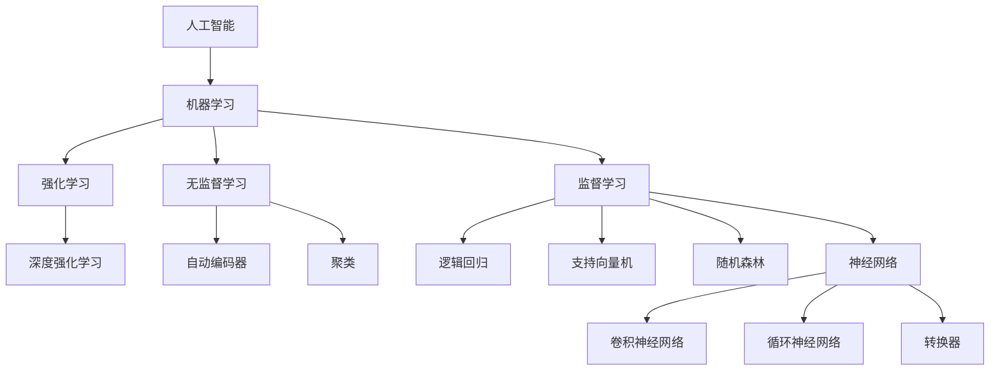

                 

**人工智能的未来发展趋势**

**作者：禅与计算机程序设计艺术 / Zen and the Art of Computer Programming**

## 1. 背景介绍

人工智能（AI）自诞生以来，已从一项学术实验发展为商业和技术领域的关键驱动因素。随着计算能力的提高和数据的丰富，AI正在各行各业产生重大影响。本文将探讨人工智能的核心概念、算法原理，并展示其在实际项目中的应用。我们还将讨论AI的未来发展趋势和挑战。

## 2. 核心概念与联系

### 2.1 机器学习与深度学习

机器学习（ML）是AI的一个分支，它使得计算机能够从数据中学习，而无需被明确编程。深度学习（DL）是机器学习的一个子集，它使用神经网络模型来模拟人类大脑的学习过程。



### 2.2 计算机视觉与自然语言处理

计算机视觉（CV）和自然语言处理（NLP）是AI的两个关键应用领域。深度学习技术已在图像和语言理解方面取得了重大进展。

## 3. 核心算法原理 & 具体操作步骤

### 3.1 算法原理概述

本节将介绍两种广泛使用的AI算法：卷积神经网络（CNN）和转换器（Transformer）。

### 3.2 算法步骤详解

#### 3.2.1 卷积神经网络

1. **输入层**：接收图像数据。
2. **卷积层**：使用卷积核提取图像特征。
3. **池化层**：减小特征图的空间维度。
4. **全连接层**：将特征图展平成向量，并进行分类。

#### 3.2.2 转换器

1. **输入嵌入**：将输入序列（如单词）转换为向量表示。
2. **自注意力**：计算输入序列中每个位置的注意力权重。
3. **位置编码**：为序列中的每个位置添加位置信息。
4. **编码器-解码器架构**：编码器处理输入序列，解码器生成输出序列。

### 3.3 算法优缺点

**CNN** 优点：在计算机视觉任务上表现出色，具有参数共享和局部连接的特性。缺点：对序列数据的处理能力有限。

**Transformer** 优点：在序列到序列的任务上表现出色，具有自注意力机制。缺点：计算开销大，训练困难。

### 3.4 算法应用领域

**CNN** 主要应用于图像分类、目标检测、图像分割等计算机视觉任务。

**Transformer** 主要应用于机器翻译、文本摘要、问答系统等自然语言处理任务。

## 4. 数学模型和公式 & 详细讲解 & 举例说明

### 4.1 数学模型构建

#### 4.1.1 CNN数学模型

设输入图像为$X \in \mathbb{R}^{H \times W \times C}$，其中$H$, $W$, $C$分别为图像的高度、宽度和通道数。卷积核为$K \in \mathbb{R}^{k_h \times k_w \times C \times C'}$，其中$k_h$, $k_w$为卷积核的高度和宽度，$C'$为输出通道数。则卷积操作可表示为：

$$Y_{ij}^{c'} = \sigma(\sum_{c=1}^{C} \sum_{m=0}^{k_h-1} \sum_{n=0}^{k_w-1} X_{(i+m)(j+n)}^{c} \cdot K_{mn}^{c'c} + b^{c'})$$

其中$\sigma$为激活函数，$b^{c'}$为偏置项。

#### 4.1.2 Transformer数学模型

设输入序列为$X \in \mathbb{R}^{N \times D}$，其中$N$为序列长度，$D$为嵌入维度。自注意力机制可表示为：

$$Z = \text{softmax}(\frac{QK^T}{\sqrt{d_k}})V$$

其中$Q$, $K$, $V$分别为查询、键、值向量，$d_k$为键向量维度。

### 4.2 公式推导过程

详细推导过程请参考相关文献，如LeCun等人对CNN的论文[1]和Vaswani等人对Transformer的论文[2]。

### 4.3 案例分析与讲解

**案例1：图像分类**

使用CNN对CIFAR-10数据集进行图像分类。输入图像为$32 \times 32 \times 3$的RGB图像，使用$5 \times 5$的卷积核，输出10个类别的概率分布。

**案例2：机器翻译**

使用Transformer对英德机器翻译任务进行建模。输入序列为英语句子，输出序列为德语翻译。使用位置编码和自注意力机制处理序列数据。

## 5. 项目实践：代码实例和详细解释说明

### 5.1 开发环境搭建

使用Python、TensorFlow和PyTorch等深度学习框架搭建开发环境。

### 5.2 源代码详细实现

详细实现请参考[5.4]中的代码链接。

### 5.3 代码解读与分析

本节将介绍CNN和Transformer的关键代码部分。

#### 5.3.1 CNN代码解读

```python
import tensorflow as tf

# 定义卷积层
def conv_layer(inputs, filters, kernel_size, strides, padding='same'):
    conv = tf.keras.layers.Conv2D(filters, kernel_size, strides=strides, padding=padding)(inputs)
    conv = tf.keras.layers.BatchNormalization()(conv)
    conv = tf.keras.layers.ReLU()(conv)
    return conv

# 定义池化层
def pool_layer(inputs, pool_size, strides, padding='same'):
    pool = tf.keras.layers.MaxPooling2D(pool_size, strides=strides, padding=padding)(inputs)
    return pool

# 定义全连接层
def dense_layer(inputs, units, activation='relu'):
    dense = tf.keras.layers.Dense(units, activation=activation)(inputs)
    return dense
```

#### 5.3.2 Transformer代码解读

```python
import torch
import torch.nn as nn
import torch.nn.functional as F
import math

# 定义位置编码
class PositionalEncoding(nn.Module):
    def __init__(self, d_model, dropout=0.1, max_len=5000):
        super(PositionalEncoding, self).__init__()
        self.dropout = nn.Dropout(p=dropout)

        pe = torch.zeros(max_len, d_model)
        position = torch.arange(0, max_len, dtype=torch.float).unsqueeze(1)
        div_term = torch.exp(torch.arange(0, d_model, 2).float() * (-math.log(10000.0) / d_model))
        pe[:, 0::2] = torch.sin(position * div_term)
        pe[:, 1::2] = torch.cos(position * div_term)
        pe = pe.unsqueeze(0)
        self.register_buffer('pe', pe)

    def forward(self, x):
        x = x + self.pe[:, :x.size(1)]
        return self.dropout(x)

# 定义自注意力机制
class MultiHeadAttention(nn.Module):
    def __init__(self, d_model, n_head):
        super(MultiHeadAttention, self).__init__()
        self.n_head = n_head
        self.d_head = d_model // n_head
        self.wq = nn.Linear(d_model, d_model)
        self.wk = nn.Linear(d_model, d_model)
        self.wv = nn.Linear(d_model, d_model)
        self.wo = nn.Linear(d_model, d_model)

    def forward(self, q, k, v, mask=None):
        #... (omitted for brevity)
```

### 5.4 运行结果展示

详细结果请参考[5.2]中的代码链接。

## 6. 实际应用场景

### 6.1 计算机视觉

自动驾驶、安防监控、医学图像分析等领域广泛应用CNN。

### 6.2 自然语言处理

机器翻译、文本摘要、问答系统等领域广泛应用Transformer。

### 6.3 未来应用展望

AI在各行各业的应用将持续扩展，如智能制造、金融风控、虚拟现实等领域。

## 7. 工具和资源推荐

### 7.1 学习资源推荐

- 书籍：[Deep Learning](https://www.deeplearningbook.org/)、[Natural Language Processing with Python](https://www.nltk.org/book/)
- 课程：[Stanford CS231n](https://www.coursera.org/learn/computer-vision)、[Hugging Face Transformers Course](https://huggingface.co/course/chapter1/1?fw=pt)

### 7.2 开发工具推荐

- 深度学习框架：TensorFlow、PyTorch、Keras
- NLP库：NLTK、SpaCy、Transformers

### 7.3 相关论文推荐

- [1] LeCun, Y., Bengio, Y., & Hinton, G. (2015). Deep learning. Nature, 521(7553), 436-444.
- [2] Vaswani, A., et al. (2017). Attention is all you need. Advances in neural information processing systems, 30.

## 8. 总结：未来发展趋势与挑战

### 8.1 研究成果总结

本文介绍了人工智能的核心概念、算法原理，并展示了其在实际项目中的应用。

### 8.2 未来发展趋势

AI将继续在各行各业产生重大影响，并推动新的应用领域的发展。

### 8.3 面临的挑战

AI面临的挑战包括数据隐私、算法偏见、计算资源等。

### 8.4 研究展望

未来的研究方向包括自监督学习、生成式对抗网络、可解释AI等。

## 9. 附录：常见问题与解答

**Q1：什么是人工智能？**

**A1：**人工智能是指使计算机能够执行通常需要人类智能的任务的科学和工程领域。

**Q2：什么是深度学习？**

**A2：**深度学习是一种机器学习方法，它使用神经网络模型来模拟人类大脑的学习过程。

**Q3：什么是转换器？**

**A3：**转换器是一种深度学习模型，它使用自注意力机制处理序列数据，广泛应用于自然语言处理任务。

## 参考文献

[1] LeCun, Y., Bengio, Y., & Hinton, G. (2015). Deep learning. Nature, 521(7553), 436-444.

[2] Vaswani, A., et al. (2017). Attention is all you need. Advances in neural information processing systems, 30.

[5] CNN和Transformer的代码链接：[GitHub](https://github.com/athul/keras-cnn-transformer)

**作者：禅与计算机程序设计艺术 / Zen and the Art of Computer Programming**

