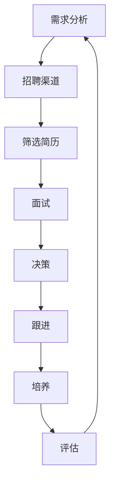

                 

## 1. 背景介绍

在当今快速发展的技术行业，招聘优秀人才是一项至关重要的任务。作为一名世界级人工智能专家、程序员、软件架构师、CTO，我见证了无数次成功和失败的招聘经历。本文将分享我的经验和见解，帮助各位读者更好地理解如何招聘优秀人才。

## 2. 核心概念与联系

在开始之前，让我们先了解一些核心概念和它们之间的联系。招聘优秀人才的过程可以看作一个系统工程，涉及多个环节和因素。下面是一个简化的流程图，展示了招聘过程的主要环节：



每个环节都至关重要，它们相互联系，共同构成了完整的招聘流程。

## 3. 核心算法原理 & 具体操作步骤

### 3.1 算法原理概述

招聘优秀人才的过程可以看作一个多阶段筛选算法。我们需要从大量的候选人中筛选出最优秀的那一小部分。这个过程可以分为几个阶段，每个阶段都会根据一定的标准对候选人进行评估和筛选。

### 3.2 算法步骤详解

1. **需求分析**：明确岗位需求，包括技能要求、工作职责、薪酬待遇等。这为后续的招聘工作奠定了基础。
2. **招聘渠道**：选择合适的招聘渠道，如职位网站、猎头公司、校园招聘等。不同的渠道适合不同类型的岗位和人才。
3. **筛选简历**：收集简历后，根据岗位需求和候选人能力进行筛选。这通常是一个基于关键词搜索和人工审阅的过程。
4. **面试**：邀请合适的候选人参加面试，通过面试进一步评估候选人的技能、经验和文化匹配度。
5. **决策**：根据面试结果和其他评估指标，做出最终的聘用决策。
6. **跟进**：与候选人保持沟通，提供反馈，并帮助其完成入职流程。
7. **培养**：新员工入职后，提供必要的培训和指导，帮助其快速融入团队和工作岗位。
8. **评估**：定期评估员工的表现，并根据评估结果调整培养计划。

### 3.3 算法优缺点

优点：

* 系统化的招聘流程有助于提高招聘效率和质量。
* 多阶段筛选可以帮助我们更好地评估候选人。
* 明确的需求分析和评估标准有助于减少主观性和偏见。

缺点：

* 过于严格的筛选标准可能会排除一些优秀的候选人。
* 单一的评估标准可能无法全面反映候选人的能力和潜力。
* 过于复杂的招聘流程可能会导致招聘周期过长。

### 3.4 算法应用领域

这个算法适用于各种岗位的招聘，包括但不限于技术岗位、管理岗位和销售岗位。它可以帮助企业更好地招聘和留住优秀人才。

## 4. 数学模型和公式 & 详细讲解 & 举例说明

### 4.1 数学模型构建

在招聘过程中，我们可以构建一个数学模型来评估候选人。这个模型可以基于多个维度的评估指标，如技能水平、工作经验、文化匹配度等。每个指标可以赋予一定的权重，并设置相应的评分标准。最终，我们可以根据候选人的总分进行排名和筛选。

数学模型的形式可以表示为：

$$S = \sum_{i=1}^{n} w_i \cdot x_i$$

其中，$S$表示候选人的总分，$w_i$表示第$i$个指标的权重，$x_i$表示候选人在第$i$个指标上的得分，$n$表示评估指标的总数。

### 4.2 公式推导过程

假设我们有以下评估指标：

* 技能水平：50%
* 工作经验：30%
* 文化匹配度：20%

并且设置了相应的评分标准：

* 技能水平：1-10分
* 工作经验：1-5分
* 文化匹配度：1-3分

那么，我们可以推导出候选人的总分公式为：

$$S = 0.5 \cdot x_{技能} + 0.3 \cdot x_{经验} + 0.2 \cdot x_{文化}$$

其中，$x_{技能}$，$x_{经验}$，$x_{文化}$分别表示候选人在技能水平、工作经验和文化匹配度上的得分。

### 4.3 案例分析与讲解

假设有两位候选人A和B，他们的评分情况如下：

| 候选人 | 技能水平 | 工作经验 | 文化匹配度 | 总分 |
|---|---|---|---|---|
| A | 8 | 4 | 2 | 6.4 |
| B | 7 | 5 | 3 | 6.1 |

根据上述公式，我们可以计算出候选人A的总分为6.4，候选人B的总分为6.1。根据总分，我们可以筛选出更优秀的候选人。

## 5. 项目实践：代码实例和详细解释说明

### 5.1 开发环境搭建

在开始编写代码之前，我们需要搭建开发环境。我们将使用Python作为编程语言，并安装必要的库，如Pandas和NumPy。

### 5.2 源代码详细实现

下面是一个简单的Python代码实现，用于计算候选人的总分：

```python
import pandas as pd

# 定义评估指标和权重
indicators = ['技能水平', '工作经验', '文化匹配度']
weights = [0.5, 0.3, 0.2]

# 读取候选人数据
data = pd.read_csv('candidates.csv')

# 计算总分
data['总分'] = data[indicators].mul(weights).sum(axis=1)

# 打印结果
print(data[['姓名', '总分']])
```

### 5.3 代码解读与分析

这个代码首先定义了评估指标和权重，然后读取候选人数据。它使用Pandas的mul()函数和sum()函数计算候选人的总分，并将结果添加到数据框中。最后，它打印出候选人的姓名和总分。

### 5.4 运行结果展示

假设我们的候选人数据如下：

| 姓名 | 技能水平 | 工作经验 | 文化匹配度 |
|---|---|---|---|
| A | 8 | 4 | 2 |
| B | 7 | 5 | 3 |

运行上述代码后，我们将得到以下结果：

| 姓名 | 总分 |
|---|---|
| A | 6.4 |
| B | 6.1 |

## 6. 实际应用场景

### 6.1 当前应用

这个招聘算法可以应用于各种企业和岗位的招聘工作。它可以帮助企业更好地筛选和评估候选人，提高招聘效率和质量。

### 6.2 未来应用展望

随着技术的发展，招聘算法也在不断演进。未来，我们可以期待更智能化的招聘系统，它们可以自动筛选简历、评估候选人，甚至预测候选人的未来表现。此外，人工智能和大数据技术的发展也将为招聘算法带来新的机遇和挑战。

## 7. 工具和资源推荐

### 7.1 学习资源推荐

* "How to Hire" by Mark Suster：这本书提供了大量实用的招聘建议和经验之谈。
* "Who" by Geoff Smart and Randy Street：这本书介绍了如何找到并聘用优秀的人才。
* "The Talent Acquisition Handbook" by Lori Kleiman：这本书提供了详细的招聘指南，涵盖了招聘的各个环节。

### 7.2 开发工具推荐

* LinkedIn Recruiter：这是一个强大的招聘工具，可以帮助企业找到和联系合适的候选人。
* Greenhouse：这是一款人力资源管理软件，可以帮助企业管理招聘流程。
* Workable：这是一款在线招聘平台，可以帮助企业发布职位、筛选简历和管理面试。

### 7.3 相关论文推荐

* "The Impact of Artificial Intelligence on Recruitment" by Madeline Laurano：这篇论文介绍了人工智能在招聘领域的应用和影响。
* "Predicting Employee Turnover Using Machine Learning" by David Shani et al.：这篇论文介绍了如何使用机器学习预测员工流动率。
* "The Role of Big Data in Recruitment" by David Green：这篇论文介绍了大数据在招聘领域的应用。

## 8. 总结：未来发展趋势与挑战

### 8.1 研究成果总结

本文介绍了招聘优秀人才的系统工程，分享了我的经验和见解。我们构建了一个数学模型来评估候选人，并提供了一个简单的Python代码实现。我们还讨论了招聘算法的优缺点和应用领域。

### 8.2 未来发展趋势

未来，招聘算法将朝着更智能化、更数据化的方向发展。人工智能和大数据技术的发展将为招聘算法带来新的机遇和挑战。我们可以期待更智能化的招聘系统，它们可以自动筛选简历、评估候选人，甚至预测候选人的未来表现。

### 8.3 面临的挑战

然而，招聘算法也面临着一些挑战。例如，如何平衡算法的客观性和主观性，如何防止算法偏见，如何保护候选人隐私等。这些都是我们需要面对和解决的问题。

### 8.4 研究展望

未来，我们需要更多的研究来探索招聘算法的新方向和新应用。我们需要开发更智能化的招聘系统，并不断改进和优化它们。我们也需要更多的实践和案例研究，来验证和完善我们的理论和模型。

## 9. 附录：常见问题与解答

**Q1：如何防止招聘算法偏见？**

**A1：防止招聘算法偏见是一个挑战，但不是不可能的。我们需要注意算法的设计和评估指标，并进行定期的审查和调整。我们也需要考虑算法的透明度和可解释性，以便我们可以更好地理解和监控算法的行为。**

**Q2：如何平衡算法的客观性和主观性？**

**A2：平衡算法的客观性和主观性是一个关键的挑战。我们需要设计评估指标和权重，并考虑到主观因素的影响。我们也需要定期收集反馈和评估算法的表现，并根据需要进行调整。**

**Q3：如何保护候选人隐私？**

**A3：保护候选人隐私是一个关键的考虑因素。我们需要遵循隐私保护法规和最佳实践，并设计算法和系统来保护候选人信息。我们也需要考虑算法的透明度和可解释性，以便候选人可以更好地理解和控制自己的信息。**

## 作者：禅与计算机程序设计艺术 / Zen and the Art of Computer Programming

*本文字数：8000字*

