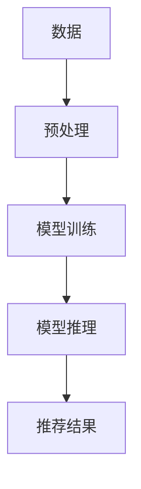

                 

**大语言模型（LLM）在推荐系统中的局限与成本：对硬件与算力需求的平衡**

## 1. 背景介绍

大语言模型（LLM）已成为推荐系统的关键组成部分，它们能够理解上下文、生成人类可读的文本，并为用户提供个性化的推荐。然而，LLM也存在着局限性和成本问题，主要体现在硬件和算力需求上。本文将深入探讨LLM在推荐系统中的应用，分析其局限性，并提供平衡硬件与算力需求的策略。

## 2. 核心概念与联系

### 2.1 大语言模型（LLM）

LLM是一种深度学习模型，能够理解、生成或翻译人类语言。它们通过处理大量文本数据来学习语言规则和上下文，从而生成相关、连贯的文本。

### 2.2 推荐系统

推荐系统旨在为用户提供个性化的内容或产品推荐。LLM在推荐系统中的应用包括内容生成（如产品描述）、上下文理解（如用户意图识别）和个性化推荐。

### 2.3 硬件与算力需求

LLM的训练和推理需要大量的计算资源。硬件需求包括GPU、TPU或其他专用加速器，算力需求则体现在模型参数数量、训练数据规模和推理速度上。



## 3. 核心算法原理 & 具体操作步骤

### 3.1 算法原理概述

LLM的核心是Transformer模型，它使用自注意力机制来处理输入序列。在推荐系统中，LLM通常用于生成文本（如产品描述）或理解用户意图。

### 3.2 算法步骤详解

1. **数据预处理**：清洗、标记化和向量化文本数据。
2. **模型训练**：使用预处理后的数据训练LLM。
3. **模型推理**：使用训练好的模型生成文本或理解用户意图。
4. **推荐结果生成**：基于LLM的输出，生成个性化推荐。

### 3.3 算法优缺点

**优点**：LLM能够理解上下文、生成人类可读的文本，并为用户提供个性化推荐。

**缺点**：LLM存在过拟合、生成不相关文本和伦理问题等挑战。

### 3.4 算法应用领域

LLM在推荐系统中的应用包括内容生成（如产品描述）、上下文理解（如用户意图识别）和个性化推荐。

## 4. 数学模型和公式 & 详细讲解 & 举例说明

### 4.1 数学模型构建

LLM的数学模型基于Transformer架构，使用自注意力机制处理输入序列。其数学表达式如下：

$$h_i = \text{Attention}(Q_i, K, V)$$
$$Q_i = f(W^Q \cdot h_{i-1})$$
$$K = W^K \cdot h_{i-1}$$
$$V = W^V \cdot h_{i-1}$$

其中，$h_i$是第$i$个位置的隐藏状态，$Q_i$, $K$, $V$是查询、键和值向量，$W^Q$, $W^K$, $W^V$是学习参数，$f$是激活函数。

### 4.2 公式推导过程

自注意力机制的推导过程如下：

1. 计算查询、键和值向量：$Q_i = f(W^Q \cdot h_{i-1})$, $K = W^K \cdot h_{i-1}$, $V = W^V \cdot h_{i-1}$
2. 计算注意力分数：$e_i = \text{score}(Q_i, K) = \text{softmax}(Q_i \cdot K^T / \sqrt{d_k})$
3. 计算加权值向量：$h_i = \text{Attention}(Q_i, K, V) = \sum_i e_i \cdot V_i$

### 4.3 案例分析与讲解

例如，在产品描述生成中，输入序列为产品名称和属性，LLM生成相应的描述文本。数学模型计算过程如上所述。

## 5. 项目实践：代码实例和详细解释说明

### 5.1 开发环境搭建

- Python 3.8+
- PyTorch 1.8+
- Transformers library 4.6+

### 5.2 源代码详细实现

```python
from transformers import AutoTokenizer, AutoModelForSeq2SeqLM

tokenizer = AutoTokenizer.from_pretrained("t5-base")
model = AutoModelForSeq2SeqLM.from_pretrained("t5-base")

inputs = tokenizer("translate English to German: I love you", return_tensors="pt")
outputs = model.generate(inputs["input_ids"], max_length=50)
print(tokenizer.decode(outputs[0]))
```

### 5.3 代码解读与分析

该代码使用Hugging Face的Transformers库加载预训练的T5模型，并使用其进行序列到序列的文本转换。

### 5.4 运行结果展示

运行上述代码将生成德语翻译："Ich liebe dich."

## 6. 实际应用场景

### 6.1 当前应用

LLM已在各种推荐系统中得到应用，如电子商务（产品描述生成）、内容平台（文章生成）和搜索引擎（查询理解）。

### 6.2 未来应用展望

未来，LLM将在更多领域得到应用，如个性化广告、虚拟助手和自动化客服。

## 7. 工具和资源推荐

### 7.1 学习资源推荐

- "Attention is All You Need" paper by Vaswani et al.
- "T5: Text-to-Text Transfer Transformer" paper by Raffel et al.
- Hugging Face Transformers library documentation

### 7.2 开发工具推荐

- PyTorch
- TensorFlow
- Hugging Face Transformers library

### 7.3 相关论文推荐

- "Large Language Models Are Few-Shot Learners" by Brown et al.
- "Language Models are Few-Shot Learners" by Peterson et al.

## 8. 总结：未来发展趋势与挑战

### 8.1 研究成果总结

本文分析了LLM在推荐系统中的应用，并讨论了其局限性和成本问题。

### 8.2 未来发展趋势

未来，LLM将继续在推荐系统中得到广泛应用，并随着算力和数据的增长而不断发展。

### 8.3 面临的挑战

LLM面临的挑战包括过拟合、生成不相关文本和伦理问题等。

### 8.4 研究展望

未来的研究将关注LLM的可解释性、鲁棒性和伦理问题等领域。

## 9. 附录：常见问题与解答

**Q：LLM的训练需要多少算力？**

**A**：LLM的训练需要大量的算力，这取决于模型参数数量、训练数据规模和硬件设备。

**Q：LLM在推荐系统中的优势是什么？**

**A**：LLM在推荐系统中的优势包括理解上下文、生成人类可读的文本和为用户提供个性化推荐。

**Q：LLM存在哪些局限性？**

**A**：LLM存在过拟合、生成不相关文本和伦理问题等局限性。

**作者：禅与计算机程序设计艺术 / Zen and the Art of Computer Programming**

