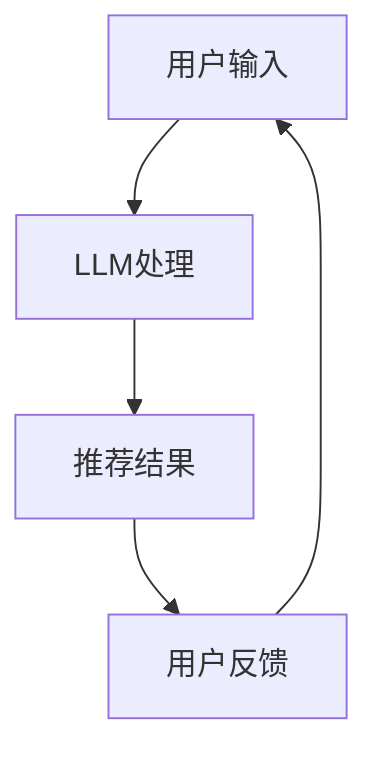

                 

**大语言模型（LLM）在推荐系统中的成本：硬件需求**

## 1. 背景介绍

随着大语言模型（LLM）的发展，它们在推荐系统中的应用变得越来越普遍。然而，部署和运行LLM需要大量的计算资源，这给推荐系统的硬件需求带来了挑战。本文将深入探讨LLM在推荐系统中的成本，重点关注硬件需求。

## 2. 核心概念与联系

### 2.1 大语言模型（LLM）

大语言模型是一种深度学习模型，旨在理解和生成人类语言。它们通过处理大量文本数据来学习语言规则和模式。

### 2.2 推荐系统

推荐系统是一种信息过滤系统，旨在向用户提供个性化的内容推荐。它们通常基于用户行为、偏好和其他因素进行推荐。

### 2.3 LLM在推荐系统中的应用

LLM可以在推荐系统中用于内容生成、个性化推荐和用户互动等任务。然而，运行LLM需要大量的计算资源，这给推荐系统的硬件需求带来了挑战。



## 3. 核心算法原理 & 具体操作步骤

### 3.1 算法原理概述

LLM在推荐系统中的应用通常基于Transformer架构，该架构使用自注意力机制来处理序列数据。推荐系统通常使用LLM生成描述性文本、个性化推荐或用户互动。

### 3.2 算法步骤详解

1. **数据预处理**：收集和预处理文本数据，如用户评论、产品描述等。
2. **模型训练**：使用预处理的数据训练LLM。
3. **推荐生成**：使用训练好的LLM生成推荐，如个性化产品描述或用户互动文本。
4. **评估和优化**：评估推荐的质量，并根据需要优化模型。

### 3.3 算法优缺点

**优点**：LLM可以生成个性化、相关的推荐，提高用户参与度和满意度。

**缺点**：运行LLM需要大量的计算资源，这给推荐系统的硬件需求带来了挑战。

### 3.4 算法应用领域

LLM在推荐系统中的应用领域包括电子商务、内容推荐、个性化广告等。

## 4. 数学模型和公式 & 详细讲解 & 举例说明

### 4.1 数学模型构建

LLM通常基于Transformer架构，其数学模型可以表示为：

$$h_t = \text{Attention}(Q_t, K_t, V_t) + \text{FFN}(h_t)$$

其中，$h_t$是时间步长$t$的隐藏状态，$Q_t$, $K_t$, $V_t$是查询、键和值向量，$FFN$是前馈神经网络。

### 4.2 公式推导过程

自注意力机制的公式如下：

$$\text{Attention}(Q, K, V) = \text{softmax}\left(\frac{QK^T}{\sqrt{d_k}}\right)V$$

其中，$d_k$是键向量的维度。

### 4.3 案例分析与讲解

例如，在电子商务推荐系统中，LLM可以用于生成个性化的产品描述。给定用户的购买历史和产品特性，LLM可以生成描述性文本，如"您可能喜欢的产品：一种高品质、轻便的运动鞋，适合长距离跑步。"

## 5. 项目实践：代码实例和详细解释说明

### 5.1 开发环境搭建

要运行LLM，您需要一个支持GPU的开发环境，如NVIDIA CUDA。您还需要安装Python、PyTorch或TensorFlow等深度学习框架。

### 5.2 源代码详细实现

以下是一个简单的LLM示例，使用PyTorch实现了Transformer架构：

```python
import torch
import torch.nn as nn

class Transformer(nn.Module):
    def __init__(self, d_model, n_head, ff_dim, dropout=0.1):
        super(Transformer, self).__init__()
        self.att = nn.MultiheadAttention(d_model, n_head)
        self.ffn = nn.Sequential(
            nn.Linear(d_model, ff_dim),
            nn.ReLU(),
            nn.Linear(ff_dim, d_model)
        )
        self.dropout = nn.Dropout(dropout)
        self.norm1 = nn.LayerNorm(d_model)
        self.norm2 = nn.LayerNorm(d_model)

    def forward(self, x):
        x = self.norm1(x)
        x = self.att(x, x, x)[0] + x
        x = self.norm2(x)
        x = self.ffn(x) + x
        return x
```

### 5.3 代码解读与分析

此代码定义了一个简单的Transformer模型，它包含自注意力机制和前馈神经网络。模型使用PyTorch的`MultiheadAttention`和`Sequential`类来实现自注意力机制和前馈神经网络。

### 5.4 运行结果展示

运行此代码将创建一个Transformer模型，可以用于训练LLM。模型的大小和复杂度取决于`d_model`、`n_head`和`ff_dim`等参数。

## 6. 实际应用场景

### 6.1 当前应用

LLM在推荐系统中的当前应用包括内容生成、个性化推荐和用户互动。例如，Amazon使用LLM生成产品描述，Netflix使用LLM个性化推荐电影和电视节目。

### 6.2 未来应用展望

未来，LLM在推荐系统中的应用可能会扩展到实时个性化推荐、多模式推荐和跨平台推荐等领域。

## 7. 工具和资源推荐

### 7.1 学习资源推荐

- "Attention is All You Need"论文：<https://arxiv.org/abs/1706.03762>
- "The Illustrated Transformer"：<https://jalammar.github.io/illustrated-transformer/>

### 7.2 开发工具推荐

- PyTorch：<https://pytorch.org/>
- TensorFlow：<https://www.tensorflow.org/>
- Hugging Face Transformers：<https://huggingface.co/transformers/>

### 7.3 相关论文推荐

- "Recurrent Recommender Networks"：<https://arxiv.org/abs/1511.06939>
- "Self-Attentive Sequential Recommendation"：<https://arxiv.org/abs/1808.02265>

## 8. 总结：未来发展趋势与挑战

### 8.1 研究成果总结

本文介绍了LLM在推荐系统中的应用，重点关注了硬件需求。我们讨论了LLM的原理、算法步骤、数学模型和公式，并提供了代码实例和实际应用场景。

### 8.2 未来发展趋势

未来，LLM在推荐系统中的应用可能会扩展到更多领域，如实时个性化推荐、多模式推荐和跨平台推荐。此外，硬件技术的发展，如量子计算和边缘计算，可能会改变LLM在推荐系统中的部署方式。

### 8.3 面临的挑战

然而，LLM在推荐系统中的应用面临着硬件需求高、训练时间长和模型解释性差等挑战。这些挑战需要通过硬件技术的发展、算法优化和模型解释性研究等方式来解决。

### 8.4 研究展望

未来的研究可能会关注LLM在推荐系统中的更多应用、硬件需求的优化和模型解释性的提高等领域。

## 9. 附录：常见问题与解答

**Q：LLM在推荐系统中的优势是什么？**

**A**：LLM可以生成个性化、相关的推荐，提高用户参与度和满意度。

**Q：LLM在推荐系统中的缺点是什么？**

**A**：运行LLM需要大量的计算资源，这给推荐系统的硬件需求带来了挑战。

**Q：LLM在推荐系统中的应用领域有哪些？**

**A**：LLM在推荐系统中的应用领域包括电子商务、内容推荐、个性化广告等。

**作者：禅与计算机程序设计艺术 / Zen and the Art of Computer Programming**

