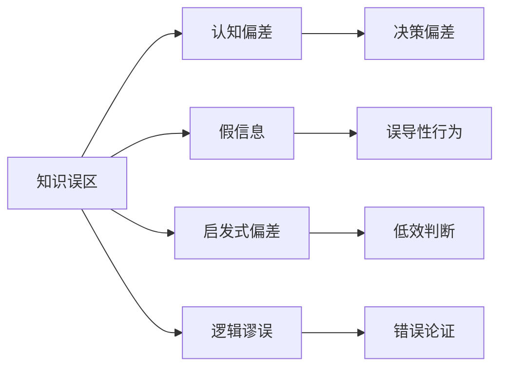

                 

# 知识的误区：常见认知错误及其纠正

> 关键词：知识误区,认知错误,信息过载,假信息,逻辑谬误,启发式偏差,认知偏误,科学思维方式

## 1. 背景介绍

在知识爆炸的时代，信息过载、假信息泛滥，人们的认知过程面临诸多误区和偏差。无论是学术界、工业界还是日常生活中的决策，都可能受到这些认知误区的干扰。本博客旨在从多个角度深入剖析这些常见的知识误区，并提供切实可行的纠正方法，帮助读者培养科学的思维方式，避免落入认知陷阱，提升决策能力。

## 2. 核心概念与联系

### 2.1 核心概念概述

在本节中，我们将介绍几个与知识误区密切相关的核心概念，并探讨它们之间的内在联系。

- **知识误区(Knowledge Fallacy)**：指在获取、处理、应用知识时出现的系统性认知错误。这些错误往往导致决策偏离事实，产生错误的结论和行动。
- **认知偏差(Cognitive Bias)**：指人在感知、思考和决策时，因心理因素、经验、情感等影响产生的偏差。常见的认知偏差包括确认偏误、后见之明偏误等。
- **假信息(Fake News)**：指为达到特定目的而故意传播的虚假信息，往往包装成事实，误导人们的判断。
- **启发式偏差(Heuristic Bias)**：指人类在面临复杂问题时，采用简单、快速但有时不准确的思考策略，如代表性启发式、信念的固定性等。
- **逻辑谬误(Logical Fallacy)**：指在推理、论证中出现的非形式谬误，如因果谬误、假二分法等。

这些概念相互交织，共同构成认知误区的复杂网络，影响着人们的判断和行为。以下是一个简化的Mermaid流程图，展示这些概念之间的联系：



## 3. 核心算法原理 & 具体操作步骤
### 3.1 算法原理概述

认知误区的纠正通常基于以下算法原理：

1. **事实核查**：通过交叉验证、数据溯源等方式，确保信息的真实性，避免假信息的误导。
2. **多元信息源整合**：结合多个可靠的信息源，降低单一来源偏见的影响，增强认知的全面性和准确性。
3. **逻辑分析**：应用逻辑和数学工具，对信息进行严格分析，识别逻辑谬误，提升论证的严谨性。
4. **认知训练**：通过有意识地练习、反思，逐步纠正认知偏差，提升决策能力。

### 3.2 算法步骤详解

基于上述原理，认知误区的纠正可按以下步骤进行：

**Step 1: 数据收集与核查**

- **数据收集**：通过多种渠道获取信息，包括学术期刊、权威报告、官方统计等。
- **数据核查**：使用工具和资源（如FactCheck.org、Snopes.com）对信息进行交叉验证，确保其真实性。

**Step 2: 信息整合与分析**

- **多元信息源整合**：将不同来源的信息进行汇总，消除单一来源的偏见。
- **逻辑分析**：应用逻辑框架（如演绎推理、归纳推理）对信息进行严格分析，识别逻辑谬误。

**Step 3: 认知偏差识别与纠正**

- **认知偏差识别**：通过心理测试、反思日记等方式，识别认知偏差。
- **认知偏差纠正**：采用认知行为疗法（CBT）等方法，逐步纠正认知偏差。

**Step 4: 逻辑训练与实践**

- **逻辑训练**：通过逻辑题、论证分析等练习，提升逻辑思维能力。
- **逻辑实践**：在实际决策中应用逻辑分析，避免逻辑谬误。

### 3.3 算法优缺点

认知误区纠正算法具有以下优点：

- **全面性**：结合数据核查、信息整合、逻辑分析等多种手段，全面提升认知能力。
- **系统性**：通过系统性的训练和实践，逐步纠正认知偏差，提升决策的准确性。
- **科学性**：应用科学的思维方式和工具，确保纠正过程的合理性和有效性。

同时，该算法也存在以下缺点：

- **资源消耗**：需要投入大量时间和精力进行信息收集、核查和分析，过程复杂。
- **适用性**：某些情况下，如极端条件或心理问题，可能难以通过单一算法完全纠正。
- **个体差异**：每个人的知识结构、认知能力不同，效果可能因人而异。

### 3.4 算法应用领域

认知误区纠正算法在多个领域都有广泛应用：

- **学术研究**：在学术研究中，通过严格的事实核查和逻辑分析，避免学术不端和逻辑谬误。
- **商业决策**：在商业决策中，通过多元信息源整合和逻辑分析，避免决策偏差，提升决策质量。
- **法律咨询**：在法律咨询中，通过逻辑推理和事实核查，确保法律分析的准确性和公正性。
- **公共政策**：在公共政策制定中，通过多元信息源整合和逻辑分析，确保政策的科学性和可操作性。
- **个人生活**：在日常生活中，通过认知偏差识别和纠正，提升个人决策的准确性和心理健康。

## 4. 数学模型和公式 & 详细讲解 & 举例说明

### 4.1 数学模型构建

认知误区纠正的数学模型通常包括以下几个关键组成部分：

- **信息真实度评估模型**：用于评估信息的真实度，确保信息源的可信度。
- **多元信息源权重模型**：用于计算不同信息源的权重，综合考虑其影响。
- **逻辑分析模型**：用于识别和纠正逻辑谬误，确保论证的严谨性。

### 4.2 公式推导过程

以下是一个简化的公式示例，展示如何构建多元信息源权重模型：

设信息源 $i$ 的真实度为 $t_i$，其权重为 $w_i$，则多元信息源的综合权重为：

$$
w_i = \frac{t_i}{\sum_{j=1}^n t_j}
$$

其中，$n$ 表示信息源的总数。

### 4.3 案例分析与讲解

假设我们在讨论一项新的政策，收集了四个信息源 $A, B, C, D$，它们的真实度分别为 $t_A=0.8, t_B=0.7, t_C=0.6, t_D=0.5$。则四个信息源的综合权重分别为：

- $w_A = \frac{0.8}{0.8+0.7+0.6+0.5} = 0.24$
- $w_B = \frac{0.7}{0.8+0.7+0.6+0.5} = 0.21$
- $w_C = \frac{0.6}{0.8+0.7+0.6+0.5} = 0.18$
- $w_D = \frac{0.5}{0.8+0.7+0.6+0.5} = 0.14$

在综合考虑这些信息源时，应赋予真实度较高的信息源更高的权重，以增强决策的可靠性。

## 5. 项目实践：代码实例和详细解释说明
### 5.1 开发环境搭建

在进行认知误区纠正项目实践前，我们需要准备好开发环境。以下是使用Python进行NumPy和Pandas开发的环境配置流程：

1. 安装Anaconda：从官网下载并安装Anaconda，用于创建独立的Python环境。

2. 创建并激活虚拟环境：
```bash
conda create -n cognitive-notebook python=3.8 
conda activate cognitive-notebook
```

3. 安装NumPy和Pandas：
```bash
conda install numpy pandas
```

4. 安装必要的库：
```bash
pip install matplotlib scipy seaborn
```

完成上述步骤后，即可在`cognitive-notebook`环境中开始项目实践。

### 5.2 源代码详细实现

下面以构建多元信息源权重模型为例，给出使用Python和NumPy进行代码实现的示例：

```python
import numpy as np

# 信息源真实度
t_values = np.array([0.8, 0.7, 0.6, 0.5])

# 信息源权重计算
w_values = t_values / np.sum(t_values)

# 输出权重
print(w_values)
```

### 5.3 代码解读与分析

让我们再详细解读一下关键代码的实现细节：

**构建信息源权重**：
- 使用NumPy库，定义信息源的真实度向量 `t_values`。
- 通过计算每个信息源的真实度除以所有信息源真实度之和，得到每个信息源的权重向量 `w_values`。
- 最终输出权重向量。

这个示例代码简单易懂，但实际应用中，信息源的真实度可能通过复杂的方式获取，如用户评分、专家评估等。

## 6. 实际应用场景
### 6.1 科学研究

在科学研究中，认知误区纠正算法可以有效避免学术不端和逻辑谬误，确保研究的严谨性和可靠性。

例如，在医学研究中，研究人员需收集大量临床数据，并通过严格的事实核查和逻辑分析，验证研究结论。通过多元信息源整合，可以综合考虑不同临床试验的结果，避免单一数据源的偏见。

### 6.2 商业决策

在商业决策中，认知误区纠正算法可以显著提升决策的准确性和有效性。

例如，在金融投资中，通过多元信息源整合和逻辑分析，可以避免单一来源的信息误导，提高投资决策的质量。在市场营销中，通过认知偏差识别和纠正，可以更准确地把握消费者需求，制定更有效的营销策略。

### 6.3 法律咨询

在法律咨询中，认知误区纠正算法可以确保法律分析的准确性和公正性。

例如，在刑事案件中，通过多元信息源整合和逻辑分析，可以全面了解案件事实，避免证据偏见，确保案件处理的公正性。在合同纠纷中，通过逻辑推理和事实核查，可以准确评估合同条款的合法性，保护各方合法权益。

### 6.4 公共政策

在公共政策制定中，认知误区纠正算法可以确保政策的科学性和可操作性。

例如，在环境保护政策中，通过多元信息源整合和逻辑分析，可以全面评估环境问题的严重性，制定科学合理的环境保护措施。在教育政策中，通过逻辑推理和事实核查，可以确保教育政策的科学性和公平性，促进教育质量的提升。

### 6.5 个人生活

在日常生活中，认知误区纠正算法可以提升个人决策的准确性和心理健康。

例如，在医疗健康中，通过逻辑分析疾病风险，可以制定科学的健康管理计划，预防疾病的发生。在理财规划中，通过多元信息源整合，可以全面了解市场趋势，制定合理的投资策略。

## 7. 工具和资源推荐
### 7.1 学习资源推荐

为了帮助开发者系统掌握认知误区纠正的理论基础和实践技巧，这里推荐一些优质的学习资源：

1. 《逻辑学导论》：由清华大学出版的经典逻辑学教材，系统介绍了逻辑学的基本概念和方法。
2. 《认知行为疗法基础》：介绍了认知行为疗法的原理和应用，帮助读者识别和纠正认知偏差。
3. 《科学思维方式》：介绍了科学思维的基本原则和方法，帮助读者培养科学的思维方式。
4. 《统计学基础》：由清华大学出版的统计学教材，系统介绍了统计学的基本概念和方法。
5. 《Python数据分析实战》：介绍了使用Python进行数据分析的方法和工具，帮助读者掌握实际应用中的技能。

通过对这些资源的学习实践，相信你一定能够快速掌握认知误区纠正的精髓，并用于解决实际的决策问题。

### 7.2 开发工具推荐

高效的开发离不开优秀的工具支持。以下是几款用于认知误区纠正开发的常用工具：

1. Jupyter Notebook：交互式的开发环境，支持Python、NumPy、Pandas等库的混合使用。
2. SciPy：科学计算库，提供了丰富的数学函数和工具。
3. Seaborn：数据可视化库，支持多种图表类型。
4. Tableau：数据可视化工具，支持复杂数据集的可视化分析。
5. Google Colab：免费的Jupyter Notebook服务，支持GPU计算，方便大规模数据分析。

合理利用这些工具，可以显著提升认知误区纠正的开发效率，加快创新迭代的步伐。

### 7.3 相关论文推荐

认知误区纠正技术的发展源于学界的持续研究。以下是几篇奠基性的相关论文，推荐阅读：

1. "Cognitive Biases in Judgment and Decision Making" by Daniel Kahneman and Amos Tversky：介绍了认知偏差的心理学基础和影响。
2. "How to Avoid Illusory Correlations" by John Krummel：介绍了识别和纠正假关联（Illusory Correlation）的方法。
3. "Making Decisions in Uncertain and Confidential Environments" by AI Pazzani和Judy Shavlik：介绍了不确定环境下的决策策略。
4. "The Art of Thinking Clearly" by Rolf Dobelli：介绍了避免常见思维谬误的方法。
5. "Bias in the Science of Science" by Alexander broad：介绍了科学领域的认知偏差和纠正方法。

这些论文代表了大认知误区纠正技术的发展脉络。通过学习这些前沿成果，可以帮助研究者把握学科前进方向，激发更多的创新灵感。

## 8. 总结：未来发展趋势与挑战

### 8.1 总结

本文对认知误区及其纠正方法进行了全面系统的介绍。首先阐述了认知误区的研究背景和意义，明确了认知误区在决策过程中可能带来的系统性偏差和错误。其次，从原理到实践，详细讲解了认知误区的识别、整合、分析和纠正方法，提供了完整的认知误区纠正流程。同时，本文还探讨了认知误区纠正算法在科学研究、商业决策、法律咨询、公共政策和个人生活等各个领域的应用，展示了认知误区纠正的广泛前景。此外，本文精选了认知误区纠正技术的各类学习资源，力求为读者提供全方位的技术指引。

通过本文的系统梳理，可以看到，认知误区纠正技术在提升决策质量、避免认知偏差方面具有重要价值。未来，伴随认知误区纠正方法的不断演进，认知能力将进一步提升，决策科学性将显著增强。

### 8.2 未来发展趋势

展望未来，认知误区纠正技术将呈现以下几个发展趋势：

1. **智能化提升**：通过机器学习和人工智能技术，实现对认知误区的自动化识别和纠正，提高效率和准确性。
2. **跨学科融合**：认知误区纠正将与心理学、社会学、行为经济学等学科进行更深入的融合，提供更全面的认知支持。
3. **个性化定制**：根据个体的知识背景、认知特点，提供个性化的认知误区纠正方案，提升个性化决策能力。
4. **多模态融合**：结合文本、图像、声音等多模态信息，进行更全面的认知分析，提升决策的全面性和准确性。
5. **情境适应性增强**：通过情境感知和动态调整，使认知误区纠正方法更加适应复杂多变的决策环境。

以上趋势凸显了认知误区纠正技术的广阔前景。这些方向的探索发展，必将进一步提升决策系统的智能化水平，为人类认知智能的进化带来深远影响。

### 8.3 面临的挑战

尽管认知误区纠正技术已经取得了显著成果，但在迈向更加智能化、普适化应用的过程中，仍面临诸多挑战：

1. **数据质量问题**：认知误区纠正依赖高质量数据，但在现实应用中，数据收集、标注和处理存在诸多困难。如何提高数据质量，减少数据偏见，仍是重要课题。
2. **模型复杂性**：认知误区纠正模型通常较为复杂，需要大量的计算资源和时间进行训练和优化。如何在保证效果的同时，降低模型复杂性，提高计算效率，是未来研究的方向。
3. **用户接受度**：认知误区纠正需要用户积极参与和配合，但部分用户可能对新技术持怀疑态度，接受度较低。如何提高用户接受度，增强认知误区纠正的普及性，仍需深入研究。
4. **跨领域应用**：认知误区纠正技术在不同领域的应用中，可能需要针对特定领域的认知特点进行调整和优化，以适应不同领域的认知误区。
5. **伦理和隐私**：认知误区纠正涉及大量个人信息的收集和处理，如何保护用户隐私，避免数据滥用，是重要的伦理问题。

### 8.4 研究展望

面对认知误区纠正面临的挑战，未来的研究需要在以下几个方面寻求新的突破：

1. **自动化识别与纠错**：探索使用机器学习和人工智能技术，实现对认知误区的自动化识别和纠正，提高效率和准确性。
2. **多模态融合**：结合文本、图像、声音等多模态信息，进行更全面的认知分析，提升决策的全面性和准确性。
3. **跨领域应用**：针对不同领域的认知特点，开发特定的认知误区纠正方法，提升跨领域应用的适应性。
4. **伦理和隐私保护**：引入隐私保护技术，如差分隐私、联邦学习等，保护用户隐私，确保数据安全。
5. **用户友好性提升**：开发用户友好的界面和交互方式，提高认知误区纠正技术的可接受性和易用性。

这些研究方向的探索，必将引领认知误区纠正技术迈向更高的台阶，为构建安全、可靠、可解释、可控的智能系统铺平道路。面向未来，认知误区纠正技术还需要与其他人工智能技术进行更深入的融合，如知识表示、因果推理、强化学习等，多路径协同发力，共同推动认知智能的发展。只有勇于创新、敢于突破，才能不断拓展认知误区纠正技术的边界，让认知能力更好地服务于人类社会的进步。

## 9. 附录：常见问题与解答

**Q1: 认知误区纠正是否适用于所有决策场景？**

A: 认知误区纠正技术适用于大多数决策场景，特别是在认知偏差和逻辑谬误可能对决策产生较大影响的情况下。但对于一些高度依赖经验或直觉的决策，如艺术创作、竞技体育等，可能需要结合其他决策方法，综合使用。

**Q2: 如何识别和纠正认知偏差？**

A: 识别和纠正认知偏差通常需要系统性的反思和训练。以下是一些常见认知偏差的识别和纠正方法：

- 确认偏误（Confirmation Bias）：通过多角度寻找反证，克服对原有信念的依赖。
- 后见之明偏误（Hindsight Bias）：在决策过程中记录预测和结果，进行对比分析，增强未来预测的准确性。
- 代表性启发式（Representativeness Heuristic）：在决策过程中引入量化分析，减少对代表性的过度依赖。
- 信念的固定性（Belief Perseverance）：在决策过程中进行定期反思和复盘，逐步调整信念。

**Q3: 如何提升认知误区纠正算法的效率？**

A: 提升认知误区纠正算法的效率通常需要以下几个方面的改进：

- 数据预处理：通过数据清洗和特征工程，提高数据质量和适用性。
- 模型优化：采用更高效的算法和数据结构，减少计算资源的消耗。
- 并行计算：利用分布式计算和并行计算技术，提高计算效率。
- 知识复用：通过构建知识库和规则库，提升认知误区纠正算法的复用性。

**Q4: 如何保护用户隐私和数据安全？**

A: 保护用户隐私和数据安全是认知误区纠正技术应用中的重要课题。以下是一些常见方法：

- 差分隐私（Differential Privacy）：在数据处理过程中加入噪声，保护个体隐私。
- 联邦学习（Federated Learning）：在分布式环境中，将数据和模型分散存储，保护用户隐私。
- 数据匿名化（Data Anonymization）：在数据发布前进行匿名化处理，减少隐私泄露风险。

**Q5: 如何评估认知误区纠正算法的效果？**

A: 评估认知误区纠正算法的效果通常需要多维度的指标和测试，以下是一些常见评估方法：

- 准确性：通过与标准答案或真实结果的比较，评估认知误区纠正的准确性。
- 可靠性：通过多轮测试和交叉验证，评估认知误区纠正的稳定性。
- 可解释性：通过对比原始数据和处理后的数据，评估认知误区纠正的可解释性。
- 用户满意度：通过用户调查和反馈，评估认知误区纠正的用户接受度和满意度。

以上问题及其解答，帮助我们更好地理解和应用认知误区纠正技术，提升决策的科学性和可靠性。

