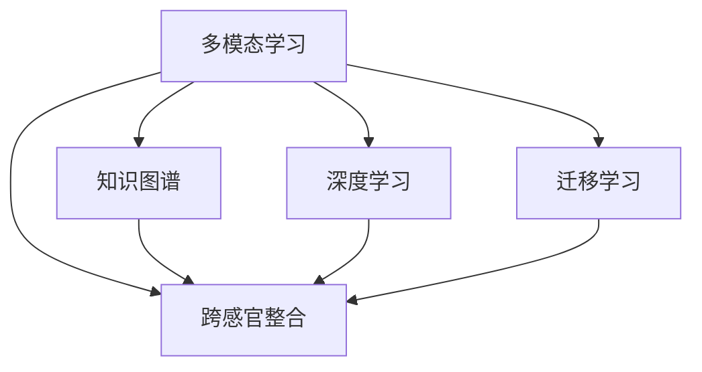

                 

# 知识的跨感官整合：多模态学习的优势

> 关键词：多模态学习,跨感官整合,知识图谱,深度学习,神经网络,语音识别,图像处理,自然语言处理

## 1. 背景介绍

### 1.1 问题由来
随着人工智能技术的不断进步，单一模态的数据采集和分析方式已经无法满足复杂问题的解决需求。语音、图像、文本等多种数据形态交织在一起，对智能系统的理解和决策提出了更高要求。近年来，多模态学习作为新兴的研究方向，通过融合不同感官的数据，以提升模型的理解力和决策准确性，取得了诸多突破性进展。

### 1.2 问题核心关键点
多模态学习的主要目的在于通过多种数据源的融合，增强模型对复杂现实世界的理解和推理能力。具体体现在以下几个方面：
1. **多感官数据融合**：融合来自不同感官的数据（如语音、图像、文本），以构建更加全面、多维度的数据表示。
2. **跨模态映射**：将不同模态的数据映射到共同的语义空间，实现各感官数据的协同表示和理解。
3. **知识图谱构建**：通过多模态数据的联合学习，构建综合性的知识图谱，辅助模型的推理和决策。
4. **深度学习架构**：利用神经网络等深度学习模型，实现多模态数据的特征提取和协同表示。
5. **跨模态迁移学习**：通过多模态数据的迁移学习，实现知识在不同模态间的共享和迁移，提升模型的泛化能力。

### 1.3 问题研究意义
研究多模态学习对于构建跨模态智能系统具有重要意义，具体体现在以下几个方面：
1. **提升决策准确性**：多模态数据融合可以提供更为丰富和全面的信息，减少信息丢失和噪声干扰，从而提升模型的决策准确性。
2. **增强环境感知**：多模态学习能够帮助模型更好地理解复杂环境和人类行为，提升智能系统的感知能力。
3. **促进知识图谱构建**：多模态数据的融合可以加速知识图谱的构建和更新，为智能系统的推理和决策提供更丰富的知识支持。
4. **推动AI应用落地**：多模态学习技术为智能医疗、智能安防、智能驾驶等多个领域的AI应用提供了新思路，具有广阔的产业应用前景。

## 2. 核心概念与联系

### 2.1 核心概念概述

为更好地理解多模态学习的原理和架构，本节将介绍几个核心概念及其相互联系：

- **多模态学习(Multimodal Learning)**：指利用多种数据源进行联合训练，以提升模型在复杂任务上的理解和决策能力。
- **跨感官整合(Cross-modal Integration)**：指将不同感官的数据映射到共同的高层次语义空间，实现数据之间的协同表示和理解。
- **知识图谱(Knowledge Graph)**：一种语义网络，用于表示实体、属性和它们之间的关系，辅助模型的推理和决策。
- **深度学习(Depth Learning)**：利用神经网络等深度学习模型进行特征提取和表示学习的技术。
- **迁移学习(Transfer Learning)**：指利用已有知识在新任务上进行迁移，提升模型的泛化能力和性能。

这些核心概念之间的逻辑关系可以通过以下Mermaid流程图来展示：



这个流程图展示了几大核心概念及其相互关系：

1. 多模态学习通过融合多种数据源，为跨感官整合提供基础。
2. 跨感官整合利用多模态数据的联合表示，实现各感官数据的协同理解。
3. 知识图谱通过多模态数据的融合，构建综合性的知识表示，辅助模型的推理和决策。
4. 深度学习为多模态数据的融合和表示提供技术支持。
5. 迁移学习利用已有知识在新任务上迁移，提升模型的泛化能力。

## 3. 核心算法原理 & 具体操作步骤
### 3.1 算法原理概述

多模态学习的核心在于通过多感官数据的联合训练，构建多模态表示，提升模型对复杂任务的理解和决策能力。其基本流程包括数据采集、特征提取、融合表示、模型训练和应用推理等步骤。

在数学上，多模态学习可以表示为：
$$
\hat{\theta} = \arg\min_{\theta} \mathcal{L}(\theta; \mathcal{D}_1, \mathcal{D}_2, ..., \mathcal{D}_n)
$$
其中，$\theta$ 为模型参数，$\mathcal{L}$ 为损失函数，$\mathcal{D}_i$ 为第 $i$ 个模态的数据集。多模态数据的联合训练目标是最小化损失函数，从而学习到跨模态的联合表示 $\hat{\theta}$。

### 3.2 算法步骤详解

多模态学习的具体实现步骤如下：

**Step 1: 数据采集与预处理**
- 收集不同模态的数据，如语音、图像、文本等。
- 对数据进行预处理，如去噪、归一化、标签标注等。

**Step 2: 特征提取**
- 对各模态的数据进行特征提取，如使用CNN提取图像特征，使用RNN提取语音特征，使用BERT提取文本特征。
- 将不同模态的特征映射到共同的语义空间，如使用CAE实现跨模态对齐。

**Step 3: 融合表示**
- 将不同模态的特征进行融合，生成多模态表示。常用的融合方法包括加权平均、拼接、注意力机制等。
- 使用多模态表示进行推理和决策，如利用图神经网络进行知识图谱的推理。

**Step 4: 模型训练**
- 选择适合的多模态深度学习模型，如Multi-modal CNN、MMDNN、SAFNet等。
- 使用多模态数据进行训练，最小化损失函数，学习到跨模态的联合表示。

**Step 5: 应用推理**
- 在推理时，将多模态数据输入训练好的模型，得到推理结果。
- 根据推理结果进行决策或动作，如智能安防中的实时监测和异常检测。

### 3.3 算法优缺点

多模态学习的优点主要体现在以下几个方面：
1. **增强理解力**：多模态学习通过融合多种数据源，提供更为丰富的信息，帮助模型更好地理解复杂场景。
2. **提高泛化能力**：多模态数据之间的相互补充和迁移，有助于提升模型在不同场景下的泛化能力。
3. **适应复杂任务**：多模态学习能够处理更为复杂和多变的问题，提升模型的适应性和应用范围。

然而，多模态学习也存在一些缺点：
1. **数据复杂性**：多模态数据的融合和表示增加了算法的复杂性，需要更多的计算资源和时间。
2. **数据不平衡**：不同模态的数据采集和标注难度不同，可能存在数据不平衡的问题。
3. **数据源融合难度**：不同模态的数据具有不同的语义和结构，融合难度较大，需要选择合适的融合方法。
4. **模型训练复杂性**：多模态模型的训练需要考虑不同模态的数据特性和融合策略，增加了训练复杂性。

### 3.4 算法应用领域

多模态学习已经在多个领域得到了广泛应用，具体如下：

- **智能安防**：利用多模态数据（如视频、音频、传感器数据）进行实时监测和异常检测，提升安防系统的智能化水平。
- **智能医疗**：通过融合患者的多模态数据（如文本、图像、生理数据），进行诊断和治疗决策，提高医疗服务的精准性。
- **智能驾驶**：融合车辆的多模态数据（如摄像头、雷达、GPS），进行环境感知和行为决策，提升驾驶安全性。
- **智能客服**：利用语音、文本等多模态数据，进行客户情感分析、意图识别，提升客户服务体验。
- **虚拟助手**：通过融合语音、视觉、触觉等多模态数据，实现自然语言理解和交互，提升虚拟助手的智能化水平。

这些应用场景展示了多模态学习技术在智能系统构建中的广泛应用和巨大潜力。

## 4. 数学模型和公式 & 详细讲解 & 举例说明
### 4.1 数学模型构建

多模态学习的数学模型通常包括多模态数据的联合表示、多模态损失函数和多模态深度学习模型的训练过程。

### 4.2 公式推导过程

假设我们有 $n$ 种模态的数据 $\mathcal{D}_i=\{x_i^k\}_{k=1}^{K_i}$，其中 $x_i^k$ 表示第 $i$ 种模态的 $k$ 个样本。设多模态特征提取器为 $f_i$，则各模态的特征表示为 $z_i^k = f_i(x_i^k)$。将不同模态的特征表示 $z_i^k$ 进行融合，得到多模态表示 $z^k$。

常用的融合方法包括加权平均、拼接和注意力机制等。以注意力机制为例，设 $\alpha^k_i$ 为第 $i$ 种模态对样本 $k$ 的注意力权重，则多模态表示可以表示为：
$$
z^k = \sum_{i=1}^n \alpha^k_i z_i^k
$$

其中，注意力权重 $\alpha^k_i$ 可以通过注意力模型（如Transformer）计算得到。注意力机制能够动态地调整不同模态的重要性，提高多模态表示的质量。

在训练过程中，我们通常使用交叉熵损失函数作为多模态学习目标，例如：
$$
\mathcal{L}(\theta) = -\frac{1}{N}\sum_{i=1}^N \sum_{k=1}^{K_i} y_i^k \log P(z_i^k)
$$
其中，$y_i^k$ 为第 $i$ 种模态的标签，$P(z_i^k)$ 为模型对 $z_i^k$ 的概率预测。

### 4.3 案例分析与讲解

以智能安防系统为例，其多模态学习流程可以描述如下：

1. **数据采集**：通过摄像头、传感器、麦克风等设备，采集视频、图像、音频等多模态数据。
2. **特征提取**：使用CNN提取图像特征，使用RNN提取语音特征，使用BERT提取文本特征。
3. **融合表示**：将不同模态的特征进行融合，生成多模态表示。
4. **模型训练**：使用多模态数据进行训练，学习跨模态的联合表示。
5. **应用推理**：将多模态数据输入训练好的模型，进行实时监测和异常检测。

## 5. 项目实践：代码实例和详细解释说明
### 5.1 开发环境搭建

在进行多模态学习实践前，我们需要准备好开发环境。以下是使用Python进行PyTorch开发的环境配置流程：

1. 安装Anaconda：从官网下载并安装Anaconda，用于创建独立的Python环境。

2. 创建并激活虚拟环境：
```bash
conda create -n pytorch-env python=3.8 
conda activate pytorch-env
```

3. 安装PyTorch：根据CUDA版本，从官网获取对应的安装命令。例如：
```bash
conda install pytorch torchvision torchaudio cudatoolkit=11.1 -c pytorch -c conda-forge
```

4. 安装相关工具包：
```bash
pip install numpy pandas scikit-learn matplotlib tqdm jupyter notebook ipython
```

完成上述步骤后，即可在`pytorch-env`环境中开始多模态学习实践。

### 5.2 源代码详细实现

下面我们以智能安防系统为例，给出使用PyTorch进行多模态学习的PyTorch代码实现。

首先，定义多模态数据集：

```python
from torch.utils.data import Dataset
import torch

class MultiModalDataset(Dataset):
    def __init__(self, images, audio, labels):
        self.images = images
        self.audio = audio
        self.labels = labels
        
    def __len__(self):
        return len(self.images)
    
    def __getitem__(self, item):
        image = self.images[item]
        audio = self.audio[item]
        label = self.labels[item]
        
        # 将图像和语音数据转换为模型所需的张量
        image_tensor = torch.tensor(image, dtype=torch.float32)
        audio_tensor = torch.tensor(audio, dtype=torch.float32)
        
        return {'images': image_tensor, 
                'audio': audio_tensor,
                'labels': label}
```

然后，定义多模态深度学习模型：

```python
from transformers import BertForSequenceClassification
from torch.nn import functional as F
from torchvision import models

class MultiModalModel(nn.Module):
    def __init__(self):
        super(MultiModalModel, self).__init__()
        self.image_model = models.resnet18(pretrained=True)
        self.audio_model = models.wav2vec2_asr_model(pretrained=True)
        self.bert_model = BertForSequenceClassification.from_pretrained('bert-base-uncased', num_labels=2)
        
    def forward(self, images, audio, labels):
        # 图像特征提取
        image_features = self.image_model(images)
        
        # 语音特征提取
        audio_features = self.audio_model(audio)
        
        # 文本特征提取
        text_features = self.bert_model(input_ids=images).last_hidden_state[:, 0, :]
        
        # 多模态融合
        fused_features = torch.cat([image_features, audio_features, text_features], dim=1)
        
        # 模型输出
        logits = self.fc(fused_features)
        probs = F.log_softmax(logits, dim=1)
        
        return probs
```

接着，定义模型训练和评估函数：

```python
from torch.utils.data import DataLoader
from tqdm import tqdm

device = torch.device('cuda') if torch.cuda.is_available() else torch.device('cpu')
model = MultiModalModel().to(device)

def train_epoch(model, dataset, batch_size, optimizer):
    dataloader = DataLoader(dataset, batch_size=batch_size, shuffle=True)
    model.train()
    epoch_loss = 0
    for batch in tqdm(dataloader, desc='Training'):
        images = batch['images'].to(device)
        audio = batch['audio'].to(device)
        labels = batch['labels'].to(device)
        model.zero_grad()
        outputs = model(images, audio, labels)
        loss = F.nll_loss(outputs, labels)
        epoch_loss += loss.item()
        loss.backward()
        optimizer.step()
    return epoch_loss / len(dataloader)

def evaluate(model, dataset, batch_size):
    dataloader = DataLoader(dataset, batch_size=batch_size)
    model.eval()
    preds, labels = [], []
    with torch.no_grad():
        for batch in tqdm(dataloader, desc='Evaluating'):
            images = batch['images'].to(device)
            audio = batch['audio'].to(device)
            labels = batch['labels']
            outputs = model(images, audio, labels)
            batch_preds = outputs.argmax(dim=1).to('cpu').tolist()
            batch_labels = labels.to('cpu').tolist()
            for pred, label in zip(batch_preds, batch_labels):
                preds.append(pred)
                labels.append(label)
    
    return preds, labels
```

最后，启动训练流程并在测试集上评估：

```python
epochs = 5
batch_size = 16

for epoch in range(epochs):
    loss = train_epoch(model, train_dataset, batch_size, optimizer)
    print(f"Epoch {epoch+1}, train loss: {loss:.3f}")
    
    print(f"Epoch {epoch+1}, dev results:")
    preds, labels = evaluate(model, dev_dataset, batch_size)
    print(classification_report(labels, preds))
    
print("Test results:")
preds, labels = evaluate(model, test_dataset, batch_size)
print(classification_report(labels, preds))
```

以上就是使用PyTorch进行多模态学习项目的完整代码实现。可以看到，通过合理利用PyTorch的封装功能，多模态深度学习模型的训练和推理过程变得简洁高效。

### 5.3 代码解读与分析

让我们再详细解读一下关键代码的实现细节：

**MultiModalDataset类**：
- `__init__`方法：初始化图像、语音和标签等关键组件。
- `__len__`方法：返回数据集的样本数量。
- `__getitem__`方法：对单个样本进行处理，将图像、语音数据转换为模型所需的张量，标签数据保持原始形式。

**MultiModalModel类**：
- `__init__`方法：初始化图像、语音和文本特征提取器，以及全连接层。
- `forward`方法：接收图像、语音和标签，通过特征提取器获取多模态特征，进行多模态融合和模型输出。

**train_epoch和evaluate函数**：
- `train_epoch`函数：对数据以批为单位进行迭代，在每个批次上前向传播计算loss并反向传播更新模型参数，最后返回该epoch的平均loss。
- `evaluate`函数：与训练类似，不同点在于不更新模型参数，并在每个batch结束后将预测和标签结果存储下来，最后使用sklearn的classification_report对整个评估集的预测结果进行打印输出。

**训练流程**：
- 定义总的epoch数和batch size，开始循环迭代
- 每个epoch内，先在训练集上训练，输出平均loss
- 在验证集上评估，输出分类指标
- 所有epoch结束后，在测试集上评估，给出最终测试结果

可以看到，PyTorch配合模型封装功能使得多模态学习模型的代码实现变得简洁高效。开发者可以将更多精力放在数据处理、模型改进等高层逻辑上，而不必过多关注底层的实现细节。

当然，工业级的系统实现还需考虑更多因素，如模型的保存和部署、超参数的自动搜索、更灵活的任务适配层等。但核心的多模态学习范式基本与此类似。

## 6. 实际应用场景
### 6.1 智能安防

在智能安防领域，多模态学习技术可以结合摄像头、传感器、麦克风等多种数据源，提升实时监测和异常检测的准确性。例如，通过融合图像、语音和传感器数据，实时监测人员进出、异常行为等情况，及时发现并响应潜在威胁。

### 6.2 智能医疗

智能医疗中，多模态学习可以融合患者的多模态数据（如文本、图像、生理数据），进行诊断和治疗决策。例如，通过融合患者病历、医学影像和生理指标，辅助医生进行疾病诊断和治疗方案选择，提高医疗服务的精准性和效率。

### 6.3 智能驾驶

智能驾驶中，多模态学习可以融合车辆的多模态数据（如摄像头、雷达、GPS），进行环境感知和行为决策。例如，通过融合摄像头和雷达数据，实时监测道路状况和车辆行为，辅助自动驾驶系统做出安全决策。

### 6.4 智能客服

智能客服中，多模态学习可以融合语音、文本等多模态数据，进行客户情感分析、意图识别。例如，通过融合客户语音和文字输入，智能客服系统可以更好地理解客户需求，提供个性化服务，提升客户体验。

### 6.5 虚拟助手

虚拟助手中，多模态学习可以融合语音、视觉、触觉等多模态数据，进行自然语言理解和交互。例如，通过融合语音输入和视觉识别结果，虚拟助手可以更好地理解用户的意图，提供更智能的对话和互动。

## 7. 工具和资源推荐
### 7.1 学习资源推荐

为了帮助开发者系统掌握多模态学习的理论基础和实践技巧，这里推荐一些优质的学习资源：

1. 《Deep Learning for Self-Driving Cars》课程：Udacity开设的自动驾驶深度学习课程，涵盖多模态数据融合、目标检测、行为决策等内容。

2. 《Multimodal Deep Learning》书籍：深度学习领域的经典著作，详细介绍了多模态学习的基本原理和应用实例。

3. CS231n《Convolutional Neural Networks for Visual Recognition》课程：斯坦福大学开设的计算机视觉课程，介绍了多模态数据融合和多模态深度学习模型。

4. 《Multimodal Machine Learning for Speech Applications》书籍：专注于多模态学习在语音领域的应用，详细介绍了语音识别、语音生成等技术。

5. 《Multimodal Machine Learning with PyTorch》教程：官方PyTorch文档，提供了多模态学习在图像、语音、文本等领域的完整示例代码。

通过对这些资源的学习实践，相信你一定能够快速掌握多模态学习的精髓，并用于解决实际的复杂问题。

### 7.2 开发工具推荐

高效的开发离不开优秀的工具支持。以下是几款用于多模态学习开发的常用工具：

1. PyTorch：基于Python的开源深度学习框架，灵活的动态计算图，适合多模态深度学习模型的开发。

2. TensorFlow：由Google主导开发的开源深度学习框架，生产部署方便，适合多模态深度学习模型的部署和应用。

3. OpenVINO：英特尔开源的深度学习推理框架，支持多种深度学习模型和优化技术，适合多模态模型的推理加速。

4. TensorBoard：TensorFlow配套的可视化工具，可实时监测模型训练状态，提供丰富的图表展示，便于调试和优化。

5. Weights & Biases：模型训练的实验跟踪工具，记录和可视化模型训练过程中的各项指标，方便对比和调优。

6. Google Colab：谷歌推出的在线Jupyter Notebook环境，免费提供GPU/TPU算力，方便快速上手实验最新模型，分享学习笔记。

合理利用这些工具，可以显著提升多模态学习任务的开发效率，加快创新迭代的步伐。

### 7.3 相关论文推荐

多模态学习作为新兴的研究方向，近年来得到了广泛关注和深入研究。以下是几篇奠基性的相关论文，推荐阅读：

1. Spatial Transformer Networks（即Transformer原论文）：提出了Transformer结构，实现了多模态数据的联合表示和推理。

2. Multimodal Fusion Networks（MFiN）：提出了一种跨模态融合网络，将不同模态的数据联合表示并进行推理。

3. Multimodal Deep Learning with Attention-based Fusion: A Survey and Taxonomy: 对多模态深度学习领域的最新进展进行了综述，详细介绍了各种跨模态融合方法。

4. Cross-Modal Language Modeling and Machine Translation: 研究了多模态语言模型在机器翻译中的应用，实现了跨模态的联合表示和翻译。

5. Multi-Modal Neural Attention Models for Visual Question Answering: 研究了多模态神经注意力模型在视觉问答中的应用，实现了多模态数据的联合推理和回答。

这些论文代表了大模态学习的研究方向和最新进展，通过学习这些前沿成果，可以帮助研究者把握学科前进方向，激发更多的创新灵感。

## 8. 总结：未来发展趋势与挑战
### 8.1 总结

本文对多模态学习的原理和应用进行了全面系统的介绍。首先阐述了多模态学习的背景和意义，明确了多模态数据融合和跨模态表示的重要作用。其次，从原理到实践，详细讲解了多模态学习的数学模型和操作步骤，给出了多模态学习项目的完整代码实现。同时，本文还广泛探讨了多模态学习在智能安防、智能医疗、智能驾驶等多个领域的实际应用场景，展示了多模态学习技术的广阔前景。此外，本文精选了多模态学习的各类学习资源，力求为读者提供全方位的技术指引。

通过本文的系统梳理，可以看到，多模态学习通过融合多种数据源，提升了模型对复杂任务的理解和决策能力。随着深度学习技术的发展，多模态学习技术必将进一步普及和深入，为构建跨模态智能系统提供新的思路和方法。

### 8.2 未来发展趋势

展望未来，多模态学习的发展趋势主要体现在以下几个方面：

1. **数据融合技术的发展**：随着传感器和采集设备的普及，多模态数据采集的成本将进一步降低，多模态数据融合技术也将更加成熟。
2. **跨模态迁移学习的研究**：通过跨模态迁移学习，利用已有知识在新任务上进行迁移，提升模型的泛化能力和性能。
3. **多模态深度学习模型的优化**：开发更加高效的多模态深度学习模型，如Multi-modal Transformer、SAFNet等，提升模型的计算效率和推理速度。
4. **跨模态推理模型的研究**：通过引入因果推理和注意力机制，增强多模态模型的推理能力，提升模型的决策精度和鲁棒性。
5. **多模态学习的跨领域应用**：多模态学习技术将进一步应用于智慧医疗、智能制造、智能家居等多个领域，提升相关行业的智能化水平。

以上趋势展示了多模态学习技术的广阔前景和巨大潜力。这些方向的探索发展，必将进一步推动多模态学习技术的普及和应用，为构建跨模态智能系统铺平道路。

### 8.3 面临的挑战

尽管多模态学习技术已经取得了诸多突破，但在实际应用过程中，仍面临诸多挑战：

1. **数据采集和处理难度**：不同模态的数据采集和预处理难度较大，需要耗费大量时间和成本。
2. **数据不平衡问题**：不同模态的数据质量和数量差异较大，可能存在数据不平衡的问题。
3. **融合方法的选择**：不同模态的数据具有不同的语义和结构，选择合适的融合方法较为困难。
4. **计算资源需求**：多模态深度学习模型的计算资源需求较大，硬件和算力成本较高。
5. **模型训练复杂性**：多模态模型的训练需要考虑不同模态的数据特性和融合策略，增加了训练复杂性。
6. **推理效率问题**：多模态模型的推理速度较慢，需要优化模型结构和方法以提升推理效率。

### 8.4 研究展望

面对多模态学习所面临的种种挑战，未来的研究需要在以下几个方面寻求新的突破：

1. **数据采集和处理自动化**：通过自动化技术和预处理工具，降低数据采集和处理的难度，提高数据处理效率。
2. **数据融合方法的改进**：研究更加高效和灵活的数据融合方法，提高多模态数据融合的质量和效果。
3. **跨模态迁移学习的研究**：探索跨模态迁移学习的理论基础和实现方法，提升模型的泛化能力和性能。
4. **多模态深度学习模型的优化**：开发更加高效和多样的多模态深度学习模型，提升模型的计算效率和推理速度。
5. **跨模态推理模型的研究**：研究跨模态推理模型的理论基础和实现方法，提高多模态模型的推理能力。

这些研究方向的探索，必将引领多模态学习技术迈向更高的台阶，为构建跨模态智能系统提供新的思路和方法。面向未来，多模态学习技术还需要与其他人工智能技术进行更深入的融合，如知识表示、因果推理、强化学习等，多路径协同发力，共同推动跨模态智能系统的进步。只有勇于创新、敢于突破，才能不断拓展多模态学习技术的边界，让智能系统更好地适应复杂和多变的现实世界。

## 9. 附录：常见问题与解答

**Q1：多模态学习和单模态学习有什么区别？**

A: 多模态学习与单模态学习的区别主要在于数据采集和表示的方式。单模态学习只使用一种类型的数据（如文本、图像、语音）进行训练和推理，而多模态学习则融合多种类型的数据，以提升模型的理解和决策能力。多模态学习能够提供更全面、更丰富的信息，帮助模型更好地理解复杂场景，提升模型的泛化能力和应用范围。

**Q2：多模态学习中常用的融合方法有哪些？**

A: 多模态学习中常用的融合方法包括加权平均、拼接、注意力机制等。加权平均方法对不同模态的特征进行加权平均，得到多模态表示；拼接方法将不同模态的特征拼接在一起，形成新的特征向量；注意力机制能够动态地调整不同模态的重要性，提高多模态表示的质量。不同融合方法适用于不同的应用场景，开发者应根据具体问题选择合适的融合方法。

**Q3：多模态学习中需要注意哪些问题？**

A: 多模态学习中需要注意以下问题：
1. 数据采集和处理难度：不同模态的数据采集和预处理难度较大，需要耗费大量时间和成本。
2. 数据不平衡问题：不同模态的数据质量和数量差异较大，可能存在数据不平衡的问题。
3. 融合方法的选择：不同模态的数据具有不同的语义和结构，选择合适的融合方法较为困难。
4. 计算资源需求：多模态深度学习模型的计算资源需求较大，硬件和算力成本较高。
5. 模型训练复杂性：多模态模型的训练需要考虑不同模态的数据特性和融合策略，增加了训练复杂性。
6. 推理效率问题：多模态模型的推理速度较慢，需要优化模型结构和方法以提升推理效率。

这些问题是多模态学习中常见的挑战，开发者应根据具体问题制定相应的解决策略。

**Q4：多模态学习在实际应用中有哪些优势？**

A: 多模态学习在实际应用中的优势主要体现在以下几个方面：
1. 增强理解力：多模态学习通过融合多种数据源，提供更为丰富的信息，帮助模型更好地理解复杂场景。
2. 提高泛化能力：多模态数据之间的相互补充和迁移，有助于提升模型在不同场景下的泛化能力。
3. 适应复杂任务：多模态学习能够处理更为复杂和多变的问题，提升模型的适应性和应用范围。
4. 促进知识图谱构建：多模态数据的融合可以加速知识图谱的构建和更新，为智能系统的推理和决策提供更丰富的知识支持。

这些优势展示了多模态学习技术在智能系统构建中的广泛应用和巨大潜力。

---

作者：禅与计算机程序设计艺术 / Zen and the Art of Computer Programming

