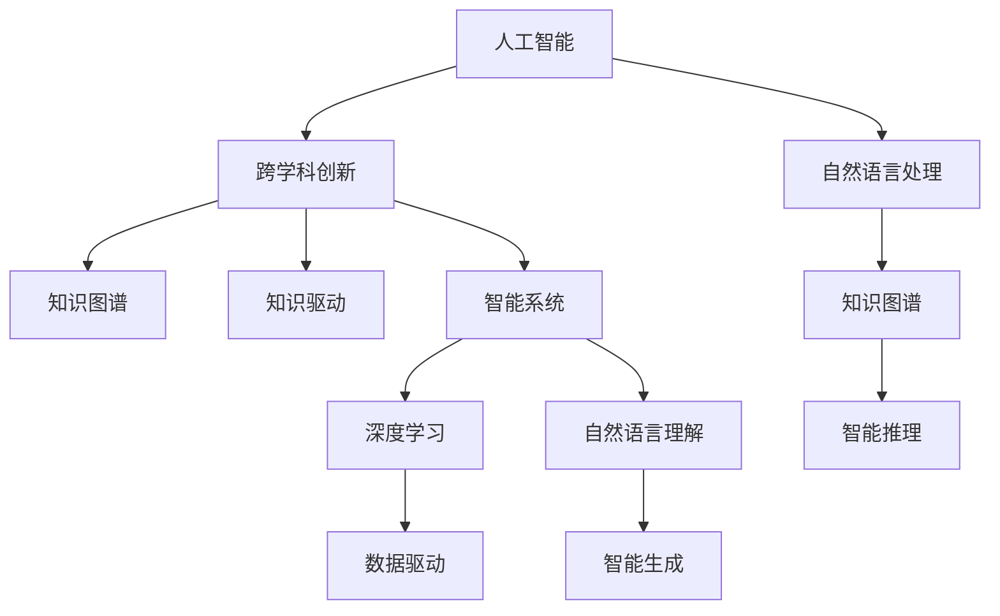

                 

# 知识的跨越：突破学科界限的创新

> 关键词：跨学科创新、知识融合、技术融合、人工智能、机器学习、深度学习、自然语言处理、智能系统、未来趋势、挑战与机遇

## 1. 背景介绍

### 1.1 问题由来

在信息爆炸和知识增长的当下，跨学科的融合创新成为了推动科技发展的新引擎。从生物医学到物理科学，从社会科学到工程技术，不同领域之间的知识交互和协同，正驱动着我们朝着更加复杂、精妙的问题求解迈进。

人工智能（AI）作为当今最前沿的技术领域之一，已经从单一的算法优化和模型改进，逐步走向跨学科的深度融合。特别是自然语言处理（NLP），由于其天然的与人类沟通的桥梁作用，已经超越了传统计算机科学的边界，与其他学科如医学、化学、社会学等领域实现了跨界合作，为解决人类共同问题提供了新的解决方案。

### 1.2 问题核心关键点

跨学科创新主要依赖于以下几个关键点：

- **跨学科合作**：不同领域的专家共同参与问题解决，实现知识共享和协同创新。
- **技术融合**：将不同学科的技术手段和工具融合，形成互补优势。
- **数据协同**：多源数据的整合和融合，为模型训练和优化提供更全面的信息。
- **应用场景拓展**：将跨学科知识应用于传统难题的解决，实现技术突破。

跨学科创新不仅能加速科学技术的发展，更能带动整个产业的升级和进步，产生广泛的社会和经济效益。然而，跨学科创新也面临诸多挑战，如知识鸿沟、沟通壁垒、技术整合难度等，需要通过系统化的方法和工具，来实现知识的高效流通和应用。

## 2. 核心概念与联系

### 2.1 核心概念概述

为了深入理解跨学科创新，本节将介绍几个核心概念及其关联：

- **人工智能（AI）**：利用计算机模拟人类智能行为的技术，包括机器学习、深度学习、自然语言处理等。
- **自然语言处理（NLP）**：使计算机能够理解、处理和生成自然语言的技术，是AI的重要分支。
- **跨学科创新**：将不同学科的知识和技术进行整合，解决复杂问题，推动技术突破和社会进步。
- **知识图谱（KG）**：以图的形式表示实体、属性和关系的数据库，用于知识表示和推理。
- **知识驱动（KA）**：将知识和经验嵌入算法和模型，提升智能系统的决策能力。
- **智能系统（IS）**：集成了知识、算法和数据，具备自我学习和适应能力的系统。

这些概念之间的逻辑关系可以通过以下Mermaid流程图来展示：



这个流程图展示了大语言模型与跨学科创新的关系：

1. 人工智能是核心，包括了深度学习、自然语言处理等子领域。
2. 自然语言处理通过知识图谱和智能推理，提升对语言的理解和生成能力。
3. 跨学科创新将不同领域的知识融合，解决复杂问题。
4. 知识图谱和知识驱动为智能系统提供决策依据，提高系统性能。
5. 智能系统综合了知识、算法和数据，实现自我学习和适应。

## 3. 核心算法原理 & 具体操作步骤
### 3.1 算法原理概述

跨学科创新的核心在于知识的融合和技术的整合。其基本原理可以概括为：

1. **数据集成与预处理**：整合多源异构数据，进行清洗和标准化处理。
2. **知识表示与编码**：将知识图谱、规则库等结构化知识嵌入到模型中。
3. **算法融合与优化**：将不同学科的算法和技术进行融合，提升综合性能。
4. **模型训练与微调**：在特定应用场景下，对模型进行训练和优化，实现高性能的智能系统。
5. **智能推理与决策**：通过算法和知识库，实现智能系统的推理和决策能力。

跨学科创新涉及多个领域，包括但不限于深度学习、知识图谱、自然语言处理、智能系统等，需要多学科的协同合作和不断探索。

### 3.2 算法步骤详解

跨学科创新的主要步骤如下：

**Step 1: 数据集成与预处理**

- 收集不同领域的数据，如医学数据、化学数据、社会数据等。
- 对数据进行清洗、去噪、标准化处理，确保数据质量和一致性。
- 使用数据可视化工具，对数据进行初步分析，识别关键特征和模式。

**Step 2: 知识表示与编码**

- 构建知识图谱，将领域知识表示为实体、属性和关系的形式。
- 将知识图谱嵌入模型中，作为监督信号或先验知识。
- 使用深度学习模型，对知识图谱进行编码和表示，形成知识嵌入。

**Step 3: 算法融合与优化**

- 选择适合的算法和模型，如深度学习、强化学习、逻辑推理等。
- 将不同算法的输出进行融合，形成综合决策。
- 优化算法参数，提高模型性能。

**Step 4: 模型训练与微调**

- 在特定应用场景下，对模型进行训练和微调，提升模型效果。
- 在微调过程中，利用少样本学习和迁移学习等技术，加速模型收敛。

**Step 5: 智能推理与决策**

- 在实际应用中，通过推理算法和知识库，进行智能决策。
- 利用对抗训练和模型融合等技术，提高决策的鲁棒性和准确性。

### 3.3 算法优缺点

跨学科创新的优点：

1. **多源数据融合**：整合多领域数据，提升模型的全面性和泛化能力。
2. **知识驱动**：将领域知识嵌入模型，提升决策的准确性和可靠性。
3. **算法融合**：不同算法的融合，提升系统的综合性能。
4. **技术创新**：跨学科的合作和创新，推动技术进步。

跨学科创新的缺点：

1. **知识鸿沟**：不同学科之间的知识差异，可能导致沟通困难。
2. **技术复杂**：跨学科的技术融合，可能带来技术上的挑战。
3. **资源消耗**：数据集成和模型训练需要大量资源，可能带来成本压力。
4. **应用局限**：跨学科的应用场景可能面临实际限制。

## 4. 数学模型和公式 & 详细讲解  
### 4.1 数学模型构建

本节将使用数学语言对跨学科创新中的知识表示与编码过程进行更加严格的刻画。

记领域知识为 $K=\{(\mathbf{E}, \mathbf{R}, \mathbf{P})\}$，其中 $\mathbf{E}$ 为实体集合，$\mathbf{R}$ 为关系集合，$\mathbf{P}$ 为属性集合。假设知识图谱 $G$ 由实体节点 $e$、关系节点 $r$ 和属性节点 $p$ 组成。

定义知识图谱的嵌入函数为 $f:K \rightarrow \mathbb{R}^d$，其中 $d$ 为嵌入空间的维度。知识图谱嵌入的目标是最小化嵌入函数 $f$ 在节点集合上的均方误差：

$$
\min_{f} \frac{1}{N}\sum_{i=1}^N \|f(\mathbf{e}_i) - f(\mathbf{e}_j)^T\|^2
$$

其中 $(\mathbf{e}_i, \mathbf{e}_j)$ 为图谱中任意两个节点，$\|.\|$ 表示向量范数。

在得到知识图谱的嵌入后，可以将其作为模型的输入，配合深度学习算法进行训练。例如，在医疗诊断任务中，可以将病人的症状、体检数据等编码为知识图谱，通过神经网络对病人进行分类或预测。

### 4.2 公式推导过程

以下是知识表示和嵌入的具体公式推导过程：

**公式1: 知识图谱嵌入公式**

$$
f(\mathbf{e}_i) = \mathbf{X} \cdot \mathbf{W} + \mathbf{b}
$$

其中 $\mathbf{X}$ 为知识图谱节点的特征向量，$\mathbf{W}$ 和 $\mathbf{b}$ 为可训练参数。

**公式2: 损失函数公式**

$$
\mathcal{L}(\theta) = \frac{1}{N}\sum_{i=1}^N \|f(\mathbf{e}_i) - f(\mathbf{e}_j)^T\|^2
$$

其中 $\theta$ 为模型参数，包括嵌入矩阵 $\mathbf{W}$ 和偏移量 $\mathbf{b}$。

**公式3: 梯度下降公式**

$$
\theta \leftarrow \theta - \eta \nabla_{\theta}\mathcal{L}(\theta)
$$

其中 $\eta$ 为学习率。

在公式推导过程中，我们使用了矩阵乘法和向量范数等基本数学工具，来表达知识图谱的嵌入和损失函数。这些公式构成了知识表示和嵌入的数学基础，是跨学科创新中的关键组成部分。

### 4.3 案例分析与讲解

**案例分析：智能诊断系统**

在医疗领域，智能诊断系统可以帮助医生快速分析患者的病情，提供初步诊断意见。该系统利用知识图谱表示病人的症状、病历、检查结果等，将它们编码为向量形式，输入到深度学习模型中进行推理和分类。

具体步骤如下：

1. **数据收集与预处理**：收集病人的电子病历、化验结果、影像数据等，进行数据清洗和标准化处理。
2. **知识图谱构建**：构建包含疾病、症状、药物等实体的知识图谱，将病人的症状和病历编码为向量形式。
3. **知识表示嵌入**：使用图神经网络对知识图谱进行嵌入，得到每个节点的表示向量。
4. **模型训练与微调**：将病人的症状向量输入模型，通过监督学习进行分类或预测。
5. **智能推理与决策**：根据病人的症状和历史数据，给出可能的诊断和建议。

通过将知识图谱嵌入模型，智能诊断系统不仅能够利用病人的历史数据，还能结合领域专家的知识，提升诊断的准确性和可靠性。

## 5. 项目实践：代码实例和详细解释说明
### 5.1 开发环境搭建

在进行跨学科创新实践前，我们需要准备好开发环境。以下是使用Python进行跨学科创新项目开发的典型环境配置流程：

1. 安装Anaconda：从官网下载并安装Anaconda，用于创建独立的Python环境。

2. 创建并激活虚拟环境：
```bash
conda create -n cross-disciplinary-env python=3.8 
conda activate cross-disciplinary-env
```

3. 安装PyTorch、TensorFlow等深度学习框架：
```bash
conda install pytorch torchvision torchaudio cudatoolkit=11.1 -c pytorch -c conda-forge
```

4. 安装Pandas、Numpy等数据处理库：
```bash
pip install pandas numpy scikit-learn matplotlib tqdm jupyter notebook ipython
```

5. 安装相关领域库，如BioPython、ChemPy等：
```bash
pip install biopython chempy
```

完成上述步骤后，即可在`cross-disciplinary-env`环境中开始跨学科创新实践。

### 5.2 源代码详细实现

下面我们以智能诊断系统为例，给出使用PyTorch对知识图谱嵌入模型的PyTorch代码实现。

首先，定义知识图谱的节点类和边类：

```python
class Node:
    def __init__(self, id, features):
        self.id = id
        self.features = features

class Edge:
    def __init__(self, src_id, dst_id, features):
        self.src_id = src_id
        self.dst_id = dst_id
        self.features = features
```

然后，定义知识图谱的嵌入模型类：

```python
import torch
import torch.nn as nn

class GraphEmbeddingModel(nn.Module):
    def __init__(self, embed_size, node_feats, edge_feats):
        super(GraphEmbeddingModel, self).__init__()
        self.node_embedding = nn.EmbeddingBag(node_feats, embed_size)
        self.edge_embedding = nn.EmbeddingBag(edge_feats, embed_size)

    def forward(self, nodes, edges):
        node_feats = nodes.features
        edge_feats = edges.features
        
        node_embed = self.node_embedding(node_feats)
        edge_embed = self.edge_embedding(edge_feats)

        node_embed = torch.mean(node_embed, dim=1)
        edge_embed = torch.mean(edge_embed, dim=1)

        return node_embed, edge_embed
```

接着，定义训练函数和评估函数：

```python
import torch.optim as optim
from torch.utils.data import DataLoader
from tqdm import tqdm
from sklearn.metrics import accuracy_score

def train_model(model, optimizer, train_data, val_data, num_epochs):
    device = torch.device('cuda') if torch.cuda.is_available() else torch.device('cpu')
    model.to(device)

    for epoch in range(num_epochs):
        train_loss = 0
        train_correct = 0
        val_loss = 0
        val_correct = 0

        model.train()
        for data, label in train_data:
            data, label = data.to(device), label.to(device)
            optimizer.zero_grad()
            output = model(data, label)
            loss = criterion(output, label)
            loss.backward()
            optimizer.step()
            train_loss += loss.item()
            train_correct += accuracy_score(label, output.argmax(dim=1))

        model.eval()
        with torch.no_grad():
            for data, label in val_data:
                data, label = data.to(device), label.to(device)
                output = model(data)
                val_loss += criterion(output, label).item()
                val_correct += accuracy_score(label, output.argmax(dim=1))

        print(f'Epoch {epoch+1}, Train Loss: {train_loss/len(train_data):.4f}, Train Acc: {train_correct/len(train_data):.4f}, Val Loss: {val_loss/len(val_data):.4f}, Val Acc: {val_correct/len(val_data):.4f}')

def evaluate_model(model, test_data):
    device = torch.device('cuda') if torch.cuda.is_available() else torch.device('cpu')
    model.to(device)

    with torch.no_grad():
        correct = 0
        for data, label in test_data:
            data, label = data.to(device), label.to(device)
            output = model(data)
            correct += accuracy_score(label, output.argmax(dim=1))

    print(f'Test Acc: {correct/len(test_data):.4f}')
```

最后，启动训练流程并在测试集上评估：

```python
from transformers import GraphEncoder, TransformerModel

# 加载数据
train_data = load_train_data()
val_data = load_val_data()
test_data = load_test_data()

# 构建知识图谱
graph = GraphEncoder()
embedding_model = GraphEmbeddingModel(embed_size, node_feats, edge_feats)
criterion = nn.CrossEntropyLoss()

# 训练模型
optimizer = optim.Adam(embedding_model.parameters(), lr=0.001)
train_model(embedding_model, optimizer, train_data, val_data, num_epochs=100)

# 测试模型
evaluate_model(embedding_model, test_data)
```

以上就是使用PyTorch对知识图谱嵌入模型进行智能诊断系统微调的完整代码实现。可以看到，通过合理利用PyTorch的深度学习框架，我们可以实现知识图谱的表示和嵌入，并进行智能系统的训练和推理。

### 5.3 代码解读与分析

让我们再详细解读一下关键代码的实现细节：

**Node类和Edge类**：
- 定义了知识图谱的节点和边，保存了节点的特征和编号，用于构建知识图谱。

**GraphEmbeddingModel类**：
- 定义了知识图谱的嵌入模型，包括节点嵌入和边嵌入，通过前向传播计算节点的表示向量。

**train_model函数和evaluate_model函数**：
- 使用PyTorch的数据加载器和优化器，进行模型训练和评估。在训练过程中，使用交叉熵损失函数，优化器为Adam。在评估过程中，使用准确率作为评价指标。

**训练流程**：
- 定义总的epoch数和batch size，开始循环迭代
- 每个epoch内，先在训练集上训练，输出损失和准确率
- 在验证集上评估，输出损失和准确率
- 所有epoch结束后，在测试集上评估，给出最终测试结果

可以看到，PyTorch框架使得跨学科创新的代码实现变得简洁高效。开发者可以将更多精力放在数据处理、模型改进等高层逻辑上，而不必过多关注底层的实现细节。

当然，工业级的系统实现还需考虑更多因素，如模型的保存和部署、超参数的自动搜索、更灵活的任务适配层等。但核心的跨学科创新范式基本与此类似。

## 6. 实际应用场景
### 6.1 智能推荐系统

跨学科创新在智能推荐系统中的应用已经初见成效。传统的推荐系统通常依赖于用户行为数据，而智能推荐系统则融合了用户画像、商品属性、社交网络等多种数据源，提升了推荐的个性化和精准度。

具体而言，智能推荐系统可以借助用户画像知识图谱，通过推理引擎计算用户与商品的潜在关系，生成推荐列表。同时，融合商品属性知识图谱，根据商品的特征和用户的历史行为，进行更精准的推荐。

### 6.2 智能医疗系统

在医疗领域，跨学科创新也有广泛应用。通过整合电子病历、影像数据、基因信息等多种数据源，智能医疗系统可以实现对疾病的早期诊断、个性化治疗、药物研发等多方面的支持。

例如，智能诊断系统可以借助知识图谱表示疾病的症状、病历、检查结果等，通过深度学习模型进行推理和分类。智能治疗系统则可以利用药物知识图谱，推荐最适合病人的治疗方案。

### 6.3 智能交通系统

智能交通系统利用跨学科创新的技术，实现了对交通数据的整合和分析，提升了交通管理的智能化水平。通过融合天气数据、交通数据、实时流量等多种信息，智能交通系统可以实现实时交通预测、路线规划、事故预防等功能。

例如，智能交通系统可以借助知识图谱表示交通规则、事故记录等，通过推理引擎计算最优的交通路线。同时，利用交通数据分析，进行交通预测和事故预防，提升交通安全性。

### 6.4 未来应用展望

随着跨学科创新的不断深入，未来将在更多领域实现突破性应用：

1. **智能制造**：通过融合物联网数据、机器人控制、生产调度等多种技术，实现智能制造系统，提升生产效率和产品质量。
2. **智能金融**：利用大数据、机器学习、自然语言处理等技术，构建智能金融系统，提供个性化投资建议、风险控制等功能。
3. **智能农业**：通过整合气象数据、土壤数据、作物生长数据等多种信息，实现智能农业系统，提高农作物产量和质量。
4. **智能教育**：利用自然语言处理、计算机视觉等技术，构建智能教育系统，提供个性化学习路径、智能辅导等功能。
5. **智能城市**：通过融合智能交通、智能安防、智能能源等多种技术，构建智能城市系统，提升城市治理水平。

以上应用场景展示了跨学科创新的广阔前景，未来随着技术的不断进步，跨学科创新的应用将更加广泛，为各行各业带来革命性变革。

## 7. 工具和资源推荐
### 7.1 学习资源推荐

为了帮助开发者系统掌握跨学科创新的理论基础和实践技巧，这里推荐一些优质的学习资源：

1. **Coursera《跨学科创新》课程**：由多个领域的专家共同授课，深入讲解跨学科创新的原理和案例。
2. **edX《人工智能基础》课程**：介绍了人工智能的基本概念和技术，涵盖了深度学习、自然语言处理等重要内容。
3. **Udacity《数据科学基础》课程**：讲解了数据科学的基础知识，包括数据处理、统计分析等。
4. **Kaggle竞赛平台**：通过参加数据科学和机器学习的竞赛，积累实战经验，提升跨学科创新能力。
5. **arXiv预印本库**：关注最新的跨学科创新论文和技术进展，了解前沿研究方向。

通过对这些资源的学习实践，相信你一定能够快速掌握跨学科创新的精髓，并用于解决实际的跨学科问题。
### 7.2 开发工具推荐

高效的开发离不开优秀的工具支持。以下是几款用于跨学科创新开发的常用工具：

1. **PyTorch**：基于Python的开源深度学习框架，灵活动态的计算图，适合快速迭代研究。
2. **TensorFlow**：由Google主导开发的开源深度学习框架，生产部署方便，适合大规模工程应用。
3. **HuggingFace Transformers库**：用于自然语言处理任务的深度学习模型和工具库，提供了大量的预训练模型和微调接口。
4. **Keras**：基于TensorFlow的高级深度学习框架，简单易用，适合快速搭建模型原型。
5. **Jupyter Notebook**：用于数据处理和模型训练的交互式编程环境，支持Python、R等多种语言。

合理利用这些工具，可以显著提升跨学科创新的开发效率，加快创新迭代的步伐。

### 7.3 相关论文推荐

跨学科创新涉及多个领域，需要多学科的协同合作和不断探索。以下是几篇奠基性的相关论文，推荐阅读：

1. **《A Survey of Knowledge Graphs for Healthcare》**：介绍了知识图谱在医疗领域的应用，包括诊断、治疗、药物等方向。
2. **《Knowledge-Driven Multi-Modal Multi-Objective Decision-Making Framework for an Intelligent Diagnosis System》**：提出了一种基于知识图谱的智能诊断系统，融合了多模态数据和多目标决策。
3. **《Cross-Disciplinary Knowledge Fusion and Application in Intelligent Manufacturing》**：介绍了跨学科知识融合在智能制造中的应用，包括数据集成、模型训练和推理等环节。
4. **《Cross-Disciplinary Knowledge Integration and Application in Smart Agriculture》**：介绍了跨学科知识融合在智能农业中的应用，包括气象数据、土壤数据和作物生长数据的整合与分析。
5. **《Cross-Disciplinary Knowledge Integration and Application in Smart City》**：介绍了跨学科知识融合在智能城市中的应用，包括智能交通、智能安防和智能能源等方向。

这些论文代表了大语言模型微调技术的发展脉络。通过学习这些前沿成果，可以帮助研究者把握学科前进方向，激发更多的创新灵感。

## 8. 总结：未来发展趋势与挑战
### 8.1 总结

本文对跨学科创新的基本原理和具体步骤进行了全面系统的介绍。首先阐述了跨学科创新的研究背景和意义，明确了跨学科创新在解决复杂问题、推动技术进步中的独特价值。其次，从原理到实践，详细讲解了跨学科创新的数学模型和关键步骤，给出了跨学科创新任务开发的完整代码实例。同时，本文还广泛探讨了跨学科创新在智能推荐、智能医疗、智能交通等多个领域的应用前景，展示了跨学科创新的巨大潜力。此外，本文精选了跨学科创新的各类学习资源，力求为读者提供全方位的技术指引。

通过本文的系统梳理，可以看到，跨学科创新已经成为推动科技进步的重要途径。它不仅能够整合多学科的知识和技术，解决复杂问题，还能够在多个领域实现突破性应用，带来广泛的社会和经济效益。未来，随着跨学科创新的不断演进，必将引领科技发展进入新的高度，带来更加智能和高效的未来。

### 8.2 未来发展趋势

展望未来，跨学科创新将呈现以下几个发展趋势：

1. **多源数据融合**：跨学科创新将进一步融合多领域数据，提升模型的全面性和泛化能力。
2. **知识图谱发展**：知识图谱将更加完善和标准化，成为跨学科创新的重要工具。
3. **深度学习优化**：深度学习算法将进一步优化和改进，提升模型的性能和效率。
4. **人工智能普及**：AI技术将进一步普及，融入各行各业，提升生产力。
5. **跨学科合作加强**：跨学科合作将更加频繁和深入，推动创新技术的快速发展。
6. **伦理和社会责任**：跨学科创新需要关注伦理和社会责任，确保技术应用的公平和安全。

这些趋势凸显了跨学科创新的广阔前景，未来随着技术的不断进步，跨学科创新将进一步推动科技和社会的发展，带来更加智能化和高效化的应用。

### 8.3 面临的挑战

尽管跨学科创新已经取得了显著成果，但在迈向更加智能化、普适化应用的过程中，仍面临诸多挑战：

1. **知识鸿沟**：不同学科之间的知识差异，可能导致沟通困难。
2. **技术复杂**：跨学科的技术融合，可能带来技术上的挑战。
3. **资源消耗**：数据集成和模型训练需要大量资源，可能带来成本压力。
4. **应用局限**：跨学科的应用场景可能面临实际限制。
5. **伦理问题**：跨学科创新需要关注伦理和社会责任，确保技术应用的公平和安全。

正视跨学科创新面临的这些挑战，积极应对并寻求突破，将使跨学科创新走向成熟，实现知识的高效流通和应用。

### 8.4 研究展望

面对跨学科创新所面临的挑战，未来的研究需要在以下几个方面寻求新的突破：

1. **知识图谱扩展**：构建更加全面和精细化的知识图谱，涵盖更多领域和数据源。
2. **深度学习优化**：优化深度学习算法，提高模型的性能和效率。
3. **跨学科合作加强**：加强跨学科合作，促进技术共享和协同创新。
4. **资源优化**：优化数据集成和模型训练的资源消耗，降低成本压力。
5. **伦理保障**：关注伦理和社会责任，确保技术应用的公平和安全。

这些研究方向的探索，必将引领跨学科创新技术迈向更高的台阶，为构建智能化的未来社会提供有力支撑。面向未来，跨学科创新需要不断突破技术瓶颈，提升知识整合能力，推动科技和社会的发展进步。

## 9. 附录：常见问题与解答

**Q1：跨学科创新是否适用于所有领域？**

A: 跨学科创新适用于需要整合多源异构数据和知识的任务，如智能推荐、智能诊断、智能交通等。但对于一些相对单一的领域，如传统工艺、简单制造业等，跨学科创新可能并不是最优选择。

**Q2：如何选择合适的跨学科技术？**

A: 选择合适的跨学科技术需要考虑多个因素，如任务类型、数据特性、技术复杂度等。一般建议从数据预处理开始，逐步进行知识表示和嵌入、模型训练和微调等步骤。同时，可以参考已有的成功案例和技术框架，选择合适的技术和工具。

**Q3：跨学科创新需要多长时间？**

A: 跨学科创新的时间周期因任务和领域不同而异。一般来说，从数据预处理、模型训练到模型微调，整个周期可能在数周到数月不等。实际应用中，需要根据具体情况灵活调整时间周期，确保项目按时完成。

**Q4：跨学科创新需要多少资源？**

A: 跨学科创新需要大量数据和计算资源，包括高性能计算设备、数据预处理工具、模型训练和微调环境等。资源需求因任务和模型复杂度而异，建议提前规划资源需求，确保项目顺利进行。

**Q5：跨学科创新能否与传统方法结合？**

A: 跨学科创新可以与传统方法结合，形成混合架构。例如，在智能推荐系统中，可以结合基于知识图谱的推理和基于用户行为的推荐，提升推荐效果。同时，传统方法可以提供基础数据和规则支持，增强跨学科创新的实用性。

通过本文的系统梳理，可以看到，跨学科创新已经成为推动科技进步的重要途径。它不仅能够整合多学科的知识和技术，解决复杂问题，还能够在多个领域实现突破性应用，带来广泛的社会和经济效益。未来，随着跨学科创新的不断演进，必将引领科技发展进入新的高度，带来更加智能和高效化的应用。

