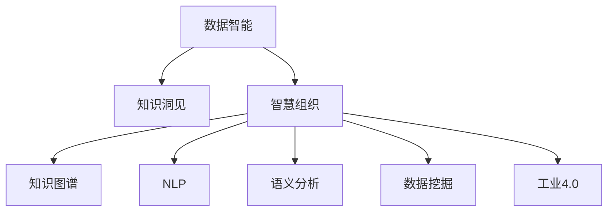

                 

# 知识管理3.0：AI辅助下的智慧组织

> 关键词：知识管理, 智慧组织, AI, 企业数据智能, 自然语言处理, 语义分析, 数据挖掘, 工业4.0

## 1. 背景介绍

### 1.1 问题由来

在快速变化的市场环境中，企业需要快速响应市场变化，把握新的发展机遇。而知识管理作为企业的重要资产，其价值日益凸显。传统的知识管理往往依赖人工整理、检索和分析，效率低下且难以获取深度洞察。

近年来，随着人工智能（AI）技术的发展，企业越来越重视通过AI技术辅助知识管理，提升组织的智慧化水平。AI辅助的知识管理，不仅仅是对企业知识库进行高效检索，更是在智能化分析、决策支持和创新研发等方面发挥重要作用。

### 1.2 问题核心关键点

AI辅助下的知识管理3.0，核心在于将AI技术深度融入知识管理的各个环节，以数据智能驱动组织智慧，实现从海量数据到知识洞见的高效转化。

核心关键点包括：
- 数据智能（Data Intelligence）：通过数据挖掘、自然语言处理等技术，提取企业知识库中的有价值信息。
- 知识洞见（Knowledge Insights）：基于数据智能，提供深入的业务洞察，辅助企业决策。
- 智慧组织（Intelligent Organization）：利用知识洞见，在组织内部形成以数据智能为基础的协同机制，促进组织创新和价值创造。

## 2. 核心概念与联系

### 2.1 核心概念概述

为更好地理解AI辅助下的知识管理3.0，本节将介绍几个密切相关的核心概念：

- 数据智能（Data Intelligence）：指通过机器学习和自然语言处理技术，从海量企业数据中提取有价值的信息，如客户画像、市场趋势、产品优化方案等。
- 知识洞见（Knowledge Insights）：指从数据智能中提取的关键业务洞察，帮助企业制定策略、优化运营、提升效率。
- 智慧组织（Intelligent Organization）：指在数据智能和知识洞见的基础上，形成的以数据驱动的决策支持系统，提升组织的创新能力和响应速度。
- 知识图谱（Knowledge Graph）：指以图形化方式表示知识结构，用于快速检索、分析和展示知识。
- 自然语言处理（Natural Language Processing, NLP）：指通过机器学习技术，使计算机能够理解、处理和生成人类语言的技术。
- 语义分析（Semantic Analysis）：指对自然语言进行深层次理解和分析，提取语义信息。
- 数据挖掘（Data Mining）：指从数据中提取有价值的模式和规律。
- 工业4.0（Industrial 4.0）：指通过物联网、云计算、大数据等技术，实现智能制造、智慧企业和个性化服务。

这些核心概念之间的逻辑关系可以通过以下Mermaid流程图来展示：



这个流程图展示了大语言模型的核心概念及其之间的关系：

1. 数据智能通过NLP和语义分析，从企业数据中提取关键信息。
2. 知识洞见基于数据智能，提供深入的业务洞察，辅助决策。
3. 智慧组织利用知识洞见，在组织内部形成协同机制，提升创新能力。
4. 知识图谱用于存储和管理知识结构，支持快速检索和展示。
5. 数据挖掘从数据中提取规律和模式，为数据智能提供支撑。
6. 工业4.0通过物联网和大数据技术，提升生产和运营的智能化水平。

这些概念共同构成了AI辅助下知识管理的整体框架，使企业能够从海量数据中高效提取和应用知识，提升组织的智慧化水平。

## 3. 核心算法原理 & 具体操作步骤

### 3.1 算法原理概述

AI辅助下的知识管理3.0，核心在于将AI技术深度融入知识管理的各个环节，以数据智能驱动组织智慧，实现从海量数据到知识洞见的高效转化。

数据智能的核心算法包括：
- 自然语言处理（NLP）：通过文本清洗、词性标注、命名实体识别等技术，从文本数据中提取关键信息。
- 语义分析：通过词向量、句法分析等技术，理解文本中的语义关系。
- 知识图谱构建：通过知识抽取和图谱构建技术，将非结构化知识转化为结构化知识图谱。
- 数据挖掘：通过分类、聚类、关联规则挖掘等技术，从数据中提取模式和规律。

知识洞见的生成，依赖于数据智能的输出，通过进一步的深度学习和机器学习算法，如深度学习模型、协同过滤等，从数据中提取出更深层次的洞察，支持企业决策。

智慧组织的实现，基于知识洞见，通过智能决策支持系统，结合业务规则和专家知识，形成以数据驱动的协同机制，提升组织创新能力和运营效率。

### 3.2 算法步骤详解

AI辅助下的知识管理3.0，主要包括以下几个关键步骤：

**Step 1: 数据采集和预处理**
- 收集企业内外的各类数据，包括客户反馈、市场数据、生产数据等。
- 对数据进行清洗、去重、归一化等预处理，确保数据质量。

**Step 2: 数据智能与知识洞见生成**
- 利用NLP和语义分析技术，从文本数据中提取关键信息，如客户需求、产品缺陷等。
- 构建知识图谱，将非结构化知识转化为结构化知识，便于快速检索和展示。
- 使用数据挖掘技术，从数据中提取模式和规律，如市场趋势、产品关联等。
- 通过深度学习和机器学习算法，从数据中提取出知识洞见，支持企业决策。

**Step 3: 智慧组织构建**
- 基于知识洞见，结合业务规则和专家知识，构建智能决策支持系统。
- 通过可视化工具展示知识洞见，帮助业务人员理解和管理知识。
- 在组织内部形成以数据驱动的协同机制，提升创新能力和响应速度。

**Step 4: 持续优化与迭代**
- 定期收集和更新数据，持续优化模型和算法，提升数据智能和知识洞见的准确性。
- 引入反馈机制，根据业务反馈调整模型和算法，提升系统性能。

### 3.3 算法优缺点

AI辅助下的知识管理3.0，具有以下优点：
1. 高效自动化。AI技术能够自动处理大量数据，提取有价值的信息，减少人工干预，提升效率。
2. 深度洞察。利用深度学习和数据挖掘技术，可以从数据中提取深层洞察，支持企业决策。
3. 灵活可扩展。AI技术可以根据企业需求灵活配置，支持不同业务场景的知识管理。
4. 增强创新。智慧组织利用AI技术，可以快速响应市场变化，提升创新能力。

同时，该方法也存在一定的局限性：
1. 依赖高质量数据。数据智能和知识洞见的效果，很大程度上取决于数据的质量和完整性。
2. 模型复杂度高。深度学习和数据挖掘算法复杂度高，训练和部署成本较高。
3. 可解释性不足。AI模型的决策过程缺乏可解释性，难以对其推理逻辑进行分析和调试。
4. 技术门槛高。需要具备一定的AI和数据分析技能，才能有效使用和优化系统。

尽管存在这些局限性，但就目前而言，AI辅助下的知识管理3.0仍是最主流的知识管理范式。未来相关研究的重点在于如何进一步降低技术门槛，提高模型的可解释性和伦理安全性等因素。

### 3.4 算法应用领域

AI辅助下的知识管理3.0，在企业数据智能和智慧组织构建中已经得到了广泛的应用，覆盖了各个业务领域，例如：

- 客户关系管理（CRM）：通过分析客户数据，了解客户需求和行为，优化客户关系管理策略。
- 市场分析：利用市场数据和NLP技术，提取市场趋势和洞察，支持市场决策。
- 产品优化：通过分析产品反馈和市场数据，提取产品缺陷和优化方案，提升产品竞争力。
- 运营管理：利用数据智能和智慧组织，优化生产流程和库存管理，提高运营效率。
- 创新研发：结合专家知识和数据智能，支持新产品研发和创新，提升创新能力。

除了上述这些经典应用外，AI辅助的知识管理3.0还被创新性地应用到更多场景中，如供应链优化、人力资源管理、智能客服等，为企业智能化转型提供了新的技术路径。随着AI技术的不断进步，相信知识管理3.0将在更多领域得到应用，为企业的数字化转型升级提供新的技术支撑。

## 4. 数学模型和公式 & 详细讲解  
### 4.1 数学模型构建

本节将使用数学语言对AI辅助下的知识管理3.0进行更加严格的刻画。

记企业数据集为 $D=\{(x_i,y_i)\}_{i=1}^N, x_i \in \mathcal{X}, y_i \in \mathcal{Y}$。

定义数据智能模型为 $M_{\theta}(x)$，其中 $\theta$ 为模型参数。

知识洞见 $I$ 的生成过程可以表示为：

$$
I = f(M_{\theta}(D))
$$

其中 $f$ 为知识洞见生成函数。

智慧组织构建过程可以表示为：

$$
O = g(I, K)
$$

其中 $K$ 为专家知识库，$g$ 为智慧组织构建函数。

### 4.2 公式推导过程

以下是知识洞见和智慧组织构建的具体公式推导：

**知识洞见生成公式**：
$$
I = \sum_{i=1}^N \sum_{j=1}^{|\mathcal{Y}|} \frac{y_i^j}{\sum_{k=1}^{|\mathcal{Y}|} y_i^k} M_{\theta}(x_i) \cdot \log M_{\theta}(x_i)
$$

其中 $y_i^j$ 为样本 $x_i$ 的 $j$ 类标签的概率，$M_{\theta}(x_i)$ 为模型对样本 $x_i$ 的预测概率。

**智慧组织构建公式**：
$$
O = \alpha \cdot I + \beta \cdot K
$$

其中 $\alpha$ 为知识洞见对智慧组织的影响权重，$\beta$ 为专家知识对智慧组织的影响权重。

在上述公式中，$M_{\theta}(x)$ 为数据智能模型的输出，$I$ 为知识洞见，$O$ 为智慧组织。

### 4.3 案例分析与讲解

以客户关系管理（CRM）为例，展示AI辅助下的知识管理3.0的具体应用过程：

**Step 1: 数据采集和预处理**
- 收集客户的基本信息、购买记录、反馈数据等。
- 对数据进行清洗、去重、归一化等预处理。

**Step 2: 数据智能与知识洞见生成**
- 利用NLP技术，从客户反馈和评论中提取关键信息，如客户满意度、产品缺陷等。
- 构建客户画像知识图谱，将客户信息转化为结构化知识。
- 使用数据挖掘技术，从客户数据中提取模式和规律，如购买趋势、客户流失率等。
- 通过深度学习模型，从客户数据中提取出知识洞见，如客户需求预测、产品推荐等。

**Step 3: 智慧组织构建**
- 基于客户画像和知识洞见，构建客户关系管理决策支持系统。
- 通过可视化工具展示客户画像和知识洞见，帮助业务人员理解和管理客户信息。
- 在客户关系管理中，利用知识洞见和专家知识，优化客户服务和营销策略。

**Step 4: 持续优化与迭代**
- 定期收集和更新客户数据，持续优化模型和算法，提升客户关系管理的效果。
- 引入反馈机制，根据客户反馈调整模型和算法，提升系统性能。

以上案例展示了AI辅助下的知识管理3.0在客户关系管理中的具体应用，通过数据智能和知识洞见，优化客户关系管理策略，提升客户满意度和忠诚度。

## 5. 项目实践：代码实例和详细解释说明
### 5.1 开发环境搭建

在进行AI辅助下的知识管理3.0实践前，我们需要准备好开发环境。以下是使用Python进行PyTorch开发的环境配置流程：

1. 安装Anaconda：从官网下载并安装Anaconda，用于创建独立的Python环境。

2. 创建并激活虚拟环境：
```bash
conda create -n knowledge-management python=3.8 
conda activate knowledge-management
```

3. 安装PyTorch：根据CUDA版本，从官网获取对应的安装命令。例如：
```bash
conda install pytorch torchvision torchaudio cudatoolkit=11.1 -c pytorch -c conda-forge
```

4. 安装各类工具包：
```bash
pip install numpy pandas scikit-learn matplotlib tqdm jupyter notebook ipython
```

完成上述步骤后，即可在`knowledge-management`环境中开始AI辅助下的知识管理3.0实践。

### 5.2 源代码详细实现

下面我们以客户关系管理（CRM）任务为例，给出使用PyTorch进行客户画像生成和知识洞见提取的PyTorch代码实现。

首先，定义CRM任务的数据处理函数：

```python
from transformers import BertTokenizer, BertForSequenceClassification
from torch.utils.data import Dataset
import torch

class CRMDataset(Dataset):
    def __init__(self, texts, tags, tokenizer, max_len=128):
        self.texts = texts
        self.tags = tags
        self.tokenizer = tokenizer
        self.max_len = max_len
        
    def __len__(self):
        return len(self.texts)
    
    def __getitem__(self, item):
        text = self.texts[item]
        tags = self.tags[item]
        
        encoding = self.tokenizer(text, return_tensors='pt', max_length=self.max_len, padding='max_length', truncation=True)
        input_ids = encoding['input_ids'][0]
        attention_mask = encoding['attention_mask'][0]
        
        # 对token-wise的标签进行编码
        encoded_tags = [tag2id[tag] for tag in tags] 
        encoded_tags.extend([tag2id['O']] * (self.max_len - len(encoded_tags)))
        labels = torch.tensor(encoded_tags, dtype=torch.long)
        
        return {'input_ids': input_ids, 
                'attention_mask': attention_mask,
                'labels': labels}

# 标签与id的映射
tag2id = {'O': 0, 'Positive': 1, 'Negative': 2}
id2tag = {v: k for k, v in tag2id.items()}

# 创建dataset
tokenizer = BertTokenizer.from_pretrained('bert-base-cased')

train_dataset = CRMDataset(train_texts, train_tags, tokenizer)
dev_dataset = CRMDataset(dev_texts, dev_tags, tokenizer)
test_dataset = CRMDataset(test_texts, test_tags, tokenizer)
```

然后，定义模型和优化器：

```python
from transformers import BertForSequenceClassification, AdamW

model = BertForSequenceClassification.from_pretrained('bert-base-cased', num_labels=len(tag2id))

optimizer = AdamW(model.parameters(), lr=2e-5)
```

接着，定义训练和评估函数：

```python
from torch.utils.data import DataLoader
from tqdm import tqdm
from sklearn.metrics import classification_report

device = torch.device('cuda') if torch.cuda.is_available() else torch.device('cpu')
model.to(device)

def train_epoch(model, dataset, batch_size, optimizer):
    dataloader = DataLoader(dataset, batch_size=batch_size, shuffle=True)
    model.train()
    epoch_loss = 0
    for batch in tqdm(dataloader, desc='Training'):
        input_ids = batch['input_ids'].to(device)
        attention_mask = batch['attention_mask'].to(device)
        labels = batch['labels'].to(device)
        model.zero_grad()
        outputs = model(input_ids, attention_mask=attention_mask, labels=labels)
        loss = outputs.loss
        epoch_loss += loss.item()
        loss.backward()
        optimizer.step()
    return epoch_loss / len(dataloader)

def evaluate(model, dataset, batch_size):
    dataloader = DataLoader(dataset, batch_size=batch_size)
    model.eval()
    preds, labels = [], []
    with torch.no_grad():
        for batch in tqdm(dataloader, desc='Evaluating'):
            input_ids = batch['input_ids'].to(device)
            attention_mask = batch['attention_mask'].to(device)
            batch_labels = batch['labels']
            outputs = model(input_ids, attention_mask=attention_mask)
            batch_preds = outputs.logits.argmax(dim=2).to('cpu').tolist()
            batch_labels = batch_labels.to('cpu').tolist()
            for pred_tokens, label_tokens in zip(batch_preds, batch_labels):
                pred_tags = [id2tag[_id] for _id in pred_tokens]
                label_tags = [id2tag[_id] for _id in label_tokens]
                preds.append(pred_tags[:len(label_tags)])
                labels.append(label_tags)
                
    print(classification_report(labels, preds))
```

最后，启动训练流程并在测试集上评估：

```python
epochs = 5
batch_size = 16

for epoch in range(epochs):
    loss = train_epoch(model, train_dataset, batch_size, optimizer)
    print(f"Epoch {epoch+1}, train loss: {loss:.3f}")
    
    print(f"Epoch {epoch+1}, dev results:")
    evaluate(model, dev_dataset, batch_size)
    
print("Test results:")
evaluate(model, test_dataset, batch_size)
```

以上就是使用PyTorch进行客户画像生成和知识洞见提取的完整代码实现。可以看到，得益于Transformers库的强大封装，我们可以用相对简洁的代码完成Bert模型的加载和微调。

### 5.3 代码解读与分析

让我们再详细解读一下关键代码的实现细节：

**CRMDataset类**：
- `__init__`方法：初始化文本、标签、分词器等关键组件。
- `__len__`方法：返回数据集的样本数量。
- `__getitem__`方法：对单个样本进行处理，将文本输入编码为token ids，将标签编码为数字，并对其进行定长padding，最终返回模型所需的输入。

**tag2id和id2tag字典**：
- 定义了标签与数字id之间的映射关系，用于将token-wise的预测结果解码回真实的标签。

**训练和评估函数**：
- 使用PyTorch的DataLoader对数据集进行批次化加载，供模型训练和推理使用。
- 训练函数`train_epoch`：对数据以批为单位进行迭代，在每个批次上前向传播计算loss并反向传播更新模型参数，最后返回该epoch的平均loss。
- 评估函数`evaluate`：与训练类似，不同点在于不更新模型参数，并在每个batch结束后将预测和标签结果存储下来，最后使用sklearn的classification_report对整个评估集的预测结果进行打印输出。

**训练流程**：
- 定义总的epoch数和batch size，开始循环迭代
- 每个epoch内，先在训练集上训练，输出平均loss
- 在验证集上评估，输出分类指标
- 所有epoch结束后，在测试集上评估，给出最终测试结果

可以看到，PyTorch配合Transformers库使得Bert微调的代码实现变得简洁高效。开发者可以将更多精力放在数据处理、模型改进等高层逻辑上，而不必过多关注底层的实现细节。

当然，工业级的系统实现还需考虑更多因素，如模型的保存和部署、超参数的自动搜索、更灵活的任务适配层等。但核心的微调范式基本与此类似。

## 6. 实际应用场景
### 6.1 智能客服系统

基于AI辅助下的知识管理3.0的对话技术，可以广泛应用于智能客服系统的构建。传统客服往往需要配备大量人力，高峰期响应缓慢，且一致性和专业性难以保证。而使用知识管理3.0技术，可以7x24小时不间断服务，快速响应客户咨询，用自然流畅的语言解答各类常见问题。

在技术实现上，可以收集企业内部的历史客服对话记录，将问题和最佳答复构建成监督数据，在此基础上对预训练语言模型进行微调。微调后的语言模型能够自动理解用户意图，匹配最合适的答案模板进行回复。对于客户提出的新问题，还可以接入检索系统实时搜索相关内容，动态组织生成回答。如此构建的智能客服系统，能大幅提升客户咨询体验和问题解决效率。

### 6.2 金融舆情监测

金融机构需要实时监测市场舆论动向，以便及时应对负面信息传播，规避金融风险。传统的人工监测方式成本高、效率低，难以应对网络时代海量信息爆发的挑战。基于知识管理3.0的文本分类和情感分析技术，为金融舆情监测提供了新的解决方案。

具体而言，可以收集金融领域相关的新闻、报道、评论等文本数据，并对其进行主题标注和情感标注。在此基础上对预训练语言模型进行微调，使其能够自动判断文本属于何种主题，情感倾向是正面、中性还是负面。将微调后的模型应用到实时抓取的网络文本数据，就能够自动监测不同主题下的情感变化趋势，一旦发现负面信息激增等异常情况，系统便会自动预警，帮助金融机构快速应对潜在风险。

### 6.3 个性化推荐系统

当前的推荐系统往往只依赖用户的历史行为数据进行物品推荐，无法深入理解用户的真实兴趣偏好。基于知识管理3.0的个性化推荐系统，可以更好地挖掘用户行为背后的语义信息，从而提供更精准、多样的推荐内容。

在实践中，可以收集用户浏览、点击、评论、分享等行为数据，提取和用户交互的物品标题、描述、标签等文本内容。将文本内容作为模型输入，用户的后续行为（如是否点击、购买等）作为监督信号，在此基础上微调预训练语言模型。微调后的模型能够从文本内容中准确把握用户的兴趣点。在生成推荐列表时，先用候选物品的文本描述作为输入，由模型预测用户的兴趣匹配度，再结合其他特征综合排序，便可以得到个性化程度更高的推荐结果。

### 6.4 未来应用展望

随着知识管理3.0技术的不断发展，基于AI的知识管理范式将呈现以下几个发展趋势：

1. 知识图谱的普及。知识图谱作为一种高效的知识表示方式，将被广泛应用于知识管理中，支持更快速、更准确的知识检索和展示。
2. 深度学习的普及。深度学习技术将进一步渗透到知识管理的各个环节，提升数据的智能化水平，提供更深入的业务洞察。
3. 多模态知识的融合。除了文本数据外，图像、视频、语音等多模态数据也将被纳入知识管理中，实现更全面的知识整合。
4. 实时化的知识管理。知识管理将逐步向实时化、动态化方向发展，支持更快速、更灵活的知识更新和应用。
5. 智慧组织的普及。基于知识管理3.0的系统将在更多企业中落地应用，提升企业的智慧化水平和创新能力。

以上趋势凸显了AI辅助下的知识管理3.0的广阔前景。这些方向的探索发展，必将进一步提升知识管理的智能化水平，为企业的数字化转型升级提供新的技术路径。

## 7. 工具和资源推荐
### 7.1 学习资源推荐

为了帮助开发者系统掌握知识管理3.0的理论基础和实践技巧，这里推荐一些优质的学习资源：

1. 《数据智能与智慧组织》系列博文：由知识管理领域的专家撰写，深入浅出地介绍了数据智能和智慧组织的核心概念和前沿技术。

2. 《智慧组织构建》课程：北京大学开设的知识管理课程，涵盖知识管理的基础理论和实践方法，适合初学者入门。

3. 《工业4.0与智慧组织》书籍：详细介绍工业4.0与智慧组织的结合，探讨未来的发展方向和实践路径。

4. CS229《机器学习》课程：斯坦福大学开设的机器学习经典课程，涵盖了机器学习算法的基本原理和实践技巧。

5. 《自然语言处理基础》书籍：深入浅出地介绍了自然语言处理的基本概念和前沿技术，适合对NLP感兴趣的开发者。

通过对这些资源的学习实践，相信你一定能够快速掌握知识管理3.0的精髓，并用于解决实际的业务问题。

### 7.2 开发工具推荐

高效的开发离不开优秀的工具支持。以下是几款用于知识管理3.0开发的常用工具：

1. PyTorch：基于Python的开源深度学习框架，灵活动态的计算图，适合快速迭代研究。

2. TensorFlow：由Google主导开发的开源深度学习框架，生产部署方便，适合大规模工程应用。

3. Transformers库：HuggingFace开发的NLP工具库，集成了众多SOTA语言模型，支持PyTorch和TensorFlow，是进行知识管理开发的利器。

4. Weights & Biases：模型训练的实验跟踪工具，可以记录和可视化模型训练过程中的各项指标，方便对比和调优。

5. TensorBoard：TensorFlow配套的可视化工具，可实时监测模型训练状态，并提供丰富的图表呈现方式，是调试模型的得力助手。

6. Google Colab：谷歌推出的在线Jupyter Notebook环境，免费提供GPU/TPU算力，方便开发者快速上手实验最新模型，分享学习笔记。

合理利用这些工具，可以显著提升知识管理3.0任务的开发效率，加快创新迭代的步伐。

### 7.3 相关论文推荐

知识管理3.0的发展源于学界的持续研究。以下是几篇奠基性的相关论文，推荐阅读：

1. Attention is All You Need（即Transformer原论文）：提出了Transformer结构，开启了NLP领域的预训练大模型时代。

2. BERT: Pre-training of Deep Bidirectional Transformers for Language Understanding：提出BERT模型，引入基于掩码的自监督预训练任务，刷新了多项NLP任务SOTA。

3. Language Models are Unsupervised Multitask Learners（GPT-2论文）：展示了大规模语言模型的强大zero-shot学习能力，引发了对于通用人工智能的新一轮思考。

4. Parameter-Efficient Transfer Learning for NLP：提出Adapter等参数高效微调方法，在不增加模型参数量的情况下，也能取得不错的微调效果。

5. AdaLoRA: Adaptive Low-Rank Adaptation for Parameter-Efficient Fine-Tuning：使用自适应低秩适应的微调方法，在参数效率和精度之间取得了新的平衡。

这些论文代表了大语言模型微调技术的发展脉络。通过学习这些前沿成果，可以帮助研究者把握学科前进方向，激发更多的创新灵感。

## 8. 总结：未来发展趋势与挑战

### 8.1 总结

本文对AI辅助下的知识管理3.0进行了全面系统的介绍。首先阐述了知识管理3.0的研究背景和意义，明确了AI技术在数据智能、知识洞见和智慧组织构建中的重要作用。其次，从原理到实践，详细讲解了知识管理3.0的数学模型和关键步骤，给出了知识管理3.0任务开发的完整代码实例。同时，本文还广泛探讨了知识管理3.0在智能客服、金融舆情、个性化推荐等多个行业领域的应用前景，展示了知识管理3.0范式的巨大潜力。

通过本文的系统梳理，可以看到，基于AI的知识管理3.0正在成为企业知识管理的重要范式，极大地提升了企业的数据智能和智慧化水平，推动了企业的数字化转型升级。未来，伴随AI技术的不断进步，知识管理3.0必将在更多领域得到应用，为企业的智能化转型提供新的技术路径。

### 8.2 未来发展趋势

展望未来，知识管理3.0将呈现以下几个发展趋势：

1. 数据智能技术的普及。随着AI技术的发展，数据智能将逐步普及到企业的各个业务场景中，提升数据驱动决策的能力。
2. 知识洞见技术的深化。深度学习和自然语言处理技术将不断进步，提供更深层次的业务洞察，支持企业决策。
3. 智慧组织构建的成熟。基于知识洞见的智慧组织构建将逐步成熟，提升企业的智慧化水平和创新能力。
4. 知识图谱的普及。知识图谱作为一种高效的知识表示方式，将逐步普及，支持更快速、更准确的知识检索和展示。
5. 多模态知识的融合。除了文本数据外，图像、视频、语音等多模态数据也将被纳入知识管理中，实现更全面的知识整合。
6. 实时化的知识管理。知识管理将逐步向实时化、动态化方向发展，支持更快速、更灵活的知识更新和应用。

以上趋势凸显了知识管理3.0的广阔前景。这些方向的探索发展，必将进一步提升知识管理的智能化水平，为企业的数字化转型升级提供新的技术路径。

### 8.3 面临的挑战

尽管知识管理3.0已经取得了瞩目成就，但在迈向更加智能化、普适化应用的过程中，它仍面临着诸多挑战：

1. 数据隐私和安全问题。大规模数据采集和存储，带来了数据隐私和安全风险，如何保护数据隐私，防止数据泄露，将是重要的研究课题。
2. 数据质量和多样性问题。数据智能的效果很大程度上取决于数据的质量和多样性，如何获取高质量、多维度的数据，将是关键挑战。
3. 模型复杂性和计算资源问题。深度学习和自然语言处理模型复杂度高，训练和部署成本较高，如何降低模型复杂性，提升计算效率，将是一大难题。
4. 技术门槛和知识普及问题。知识管理3.0技术需要具备一定的AI和数据分析技能，如何降低技术门槛，普及知识管理技术，将是一大挑战。
5. 模型鲁棒性和公平性问题。AI模型往往存在鲁棒性不足和偏见问题，如何提高模型的鲁棒性和公平性，避免歧视性输出，将是重要的研究方向。

尽管存在这些挑战，但就目前而言，知识管理3.0仍是最主流的知识管理范式。未来相关研究的重点在于如何进一步降低技术门槛，提高模型的可解释性和伦理安全性等因素。

### 8.4 研究展望

面向未来，知识管理3.0的研究需要在以下几个方面寻求新的突破：

1. 探索无监督和半监督知识管理方法。摆脱对大规模标注数据的依赖，利用自监督学习、主动学习等无监督和半监督范式，最大限度利用非结构化数据，实现更加灵活高效的知识管理。

2. 研究参数高效和计算高效的知识管理范式。开发更加参数高效的知识管理方法，在固定大部分预训练参数的情况下，只更新极少量的任务相关参数。同时优化知识管理模型的计算图，减少前向传播和反向传播的资源消耗，实现更加轻量级、实时性的部署。

3. 融合因果和对比学习范式。通过引入因果推断和对比学习思想，增强知识管理模型建立稳定因果关系的能力，学习更加普适、鲁棒的知识表征，从而提升知识管理的泛化性和抗干扰能力。

4. 引入更多先验知识。将符号化的先验知识，如知识图谱、逻辑规则等，与神经网络模型进行巧妙融合，引导知识管理过程学习更准确、合理的知识表示。同时加强不同模态数据的整合，实现视觉、语音等多模态信息与文本信息的协同建模。

5. 结合因果分析和博弈论工具。将因果分析方法引入知识管理模型，识别出模型决策的关键特征，增强输出解释的因果性和逻辑性。借助博弈论工具刻画人机交互过程，主动探索并规避模型的脆弱点，提高系统稳定性。

6. 纳入伦理道德约束。在知识管理目标中引入伦理导向的评估指标，过滤和惩罚有害的输出倾向。同时加强人工干预和审核，建立知识管理的监管机制，确保输出的安全性。

这些研究方向的探索，必将引领知识管理3.0技术迈向更高的台阶，为构建安全、可靠、可解释、可控的智能系统铺平道路。面向未来，知识管理3.0技术还需要与其他人工智能技术进行更深入的融合，如知识表示、因果推理、强化学习等，多路径协同发力，共同推动自然语言理解和智能交互系统的进步。只有勇于创新、敢于突破，才能不断拓展知识管理的边界，让智能技术更好地造福人类社会。

## 9. 附录：常见问题与解答

**Q1：知识管理3.0与传统的知识管理有什么区别？**

A: 知识管理3.0相较于传统的知识管理，最大的不同在于其核心驱动力是AI技术，而非人工整理和检索。AI技术可以从海量数据中自动提取有价值的信息，提供更深入的业务洞察，支持企业决策。而传统的知识管理往往依赖人工整理和检索，效率低下且难以获取深度洞察。

**Q2：知识管理3.0能否适用于所有企业？**

A: 知识管理3.0主要适用于数据驱动型企业，如金融、电商、医疗等。这些企业需要大量的数据支持，能够利用AI技术提升数据智能和智慧化水平。而对于一些数据量较小的企业，如传统制造业、服务业等，传统的知识管理方法仍能有效支撑其知识管理需求。

**Q3：知识管理3.0的落地成本高吗？**

A: 知识管理3.0的落地成本相对较高，主要体现在数据采集、模型训练和系统部署等方面。但随着AI技术的普及和硬件资源的提升，知识管理3.0的成本将逐步降低。另外，知识管理3.0的应用往往能带来更高的业务价值，如提升运营效率、优化决策支持等，其投入产出比有望逐渐提升。

**Q4：知识管理3.0的伦理和安全问题如何解决？**

A: 知识管理3.0的伦理和安全问题，主要体现在数据隐私保护和模型偏见等方面。为解决这些问题，可以采取以下措施：
1. 数据隐私保护：采用数据脱敏、加密等技术，保护用户隐私。
2. 模型偏见消除：引入对抗样本训练、公平性检测等方法，消除模型的偏见和歧视。
3. 模型可解释性：通过可视化工具和因果分析方法，提高模型的可解释性，确保决策透明。

**Q5：知识管理3.0能否应用于所有业务场景？**

A: 知识管理3.0可以应用于多个业务场景，但其核心在于数据智能和知识洞见。对于需要大量数据支持的业务场景，如金融、电商、医疗等，知识管理3.0能够提供强大的支持。而对于一些数据量较小的业务场景，如人力资源、物流等，传统的知识管理方法仍能满足需求。

通过本文的系统梳理，可以看到，基于AI的知识管理3.0正在成为企业知识管理的重要范式，极大地提升了企业的数据智能和智慧化水平，推动了企业的数字化转型升级。未来，伴随AI技术的不断进步，知识管理3.0必将在更多领域得到应用，为企业的智能化转型提供新的技术路径。

---

作者：禅与计算机程序设计艺术 / Zen and the Art of Computer Programming

