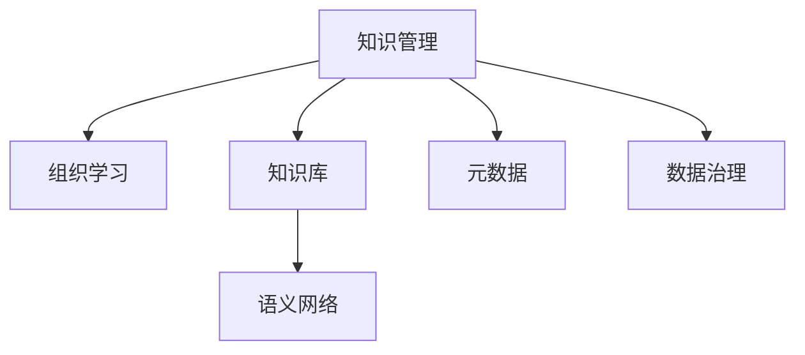
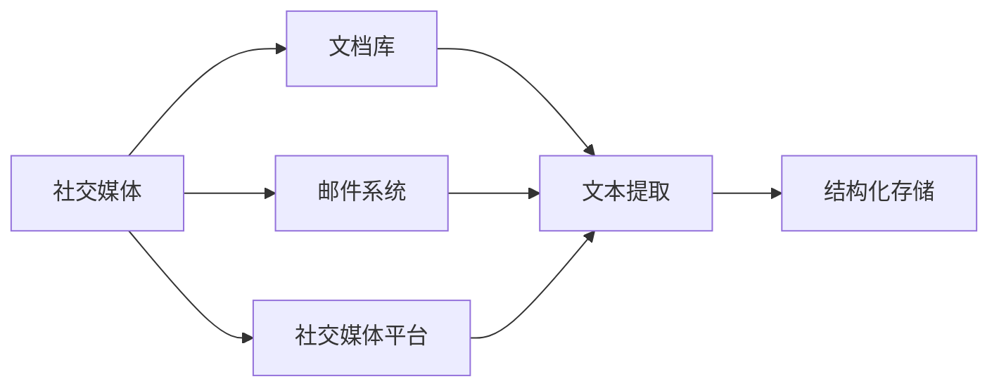
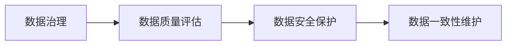
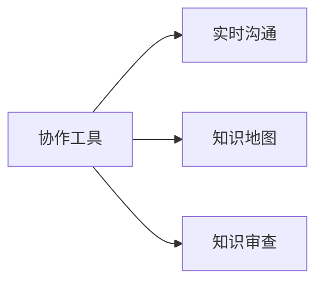
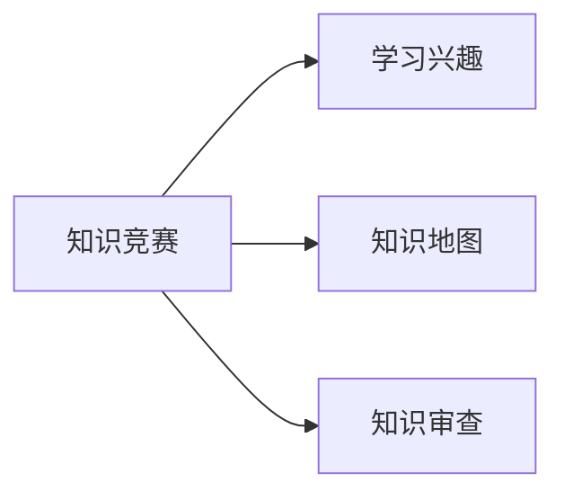
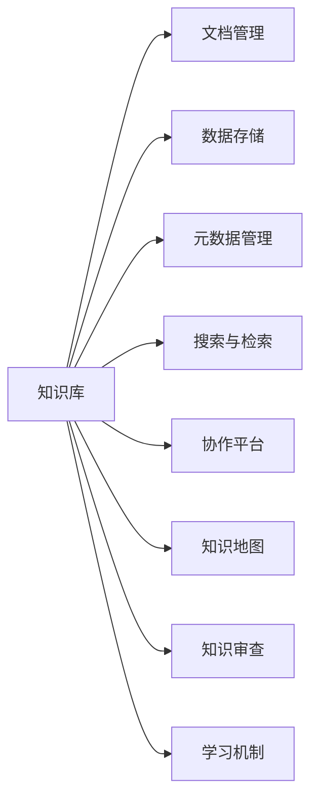

                 

# 知识管理与组织学习的关系

> 关键词：知识管理,组织学习,知识图谱,知识库,语义网络,元数据,数据治理,企业知识管理系统

## 1. 背景介绍

在当今信息爆炸的时代，知识管理（Knowledge Management, KM）已成为企业和组织获取竞争优势的重要手段。然而，单靠知识管理并不能实现持续的组织学习（Organizational Learning, OL），需要在知识管理的框架下，通过系统化的组织学习机制，将隐性知识显性化，转化为组织的显性知识库。本文将深入探讨知识管理与组织学习之间的关系，分析知识管理对组织学习的影响，以及如何构建有效的知识管理系统来促进组织学习。

## 2. 核心概念与联系

### 2.1 核心概念概述

- **知识管理**：指通过制定策略、技术、工具、流程和文化，使组织有效地识别、获取、存储、共享、应用和创新知识，以实现其战略目标。知识管理是一个多学科交叉的领域，涉及信息技术、组织行为学、认知科学等多个学科。

- **组织学习**：指组织通过持续的交互、共享和创新，以应对环境变化和内部需求的动态过程。组织学习可以分为个体学习、团队学习和组织学习三个层次。

- **知识库**：指通过一定组织形式存储、管理、检索、共享显性知识的系统。知识库的类型多种多样，包括文档库、数据库、语义网络等。

- **语义网络**：一种基于节点和边的图形数据结构，用于表示实体、属性和它们之间的关系。语义网络支持知识的自然语言查询和推理，有助于组织知识的自动发现和应用。

- **元数据**：指描述数据的数据，用于管理和索引知识库中的信息。元数据有助于知识库的构建和维护，提升知识的可用性和易用性。

- **数据治理**：指在数据生命周期中实施的一组原则、策略、实践和角色，以确保数据质量、完整性和安全性。数据治理涉及数据的创建、存储、管理和使用。

### 2.2 核心概念联系

知识管理与组织学习之间存在紧密联系，如图1所示。



图1：知识管理与组织学习的关系

**知识管理**通过建立知识库和语义网络，使组织能够有效地存储和共享知识。**组织学习**则通过持续的知识创新和应用，实现知识的积累和转化。**元数据**和**数据治理**确保了知识库和语义网络的质量和可靠性，支持知识的准确管理和应用。

## 3. 核心算法原理 & 具体操作步骤

### 3.1 算法原理概述

知识管理与组织学习的融合，需要通过以下步骤实现：

1. **知识采集与整理**：从多个渠道（如文档、邮件、社交媒体等）采集知识，并将其整理成结构化的形式，存储到知识库中。
2. **语义网络构建**：基于知识库中的信息，构建语义网络，使知识能够被自然语言查询和推理。
3. **元数据管理**：为知识库中的每条信息添加元数据，包括作者、来源、创建时间等，提升知识的可检索性和可理解性。
4. **数据治理实践**：实施数据治理策略，确保知识库的质量和一致性，保护知识的安全性。
5. **知识共享与协作**：促进知识共享和协作，通过协作工具和平台，使组织成员能够高效地协作和交流。
6. **组织学习机制**：建立组织学习机制，如知识竞赛、知识地图、知识审查等，激发组织成员的学习兴趣和创新能力。

### 3.2 算法步骤详解

**步骤1: 知识采集与整理**

知识采集可以通过各种工具和渠道实现，如图2所示。



图2：知识采集与整理

**步骤2: 语义网络构建**

语义网络的构建可以分为以下几个步骤：

1. **实体识别**：使用NLP技术识别文本中的实体，并将其存储到节点中。
2. **关系抽取**：通过抽取实体之间的关系，构建节点之间的边。
3. **知识融合**：将知识库中的信息整合到语义网络中，形成知识图谱。

如图3所示，展示了知识库到语义网络的构建过程。


图3：语义网络构建

**步骤3: 元数据管理**

元数据的添加和管理可以通过以下几个步骤实现：

1. **元数据设计**：确定需要哪些元数据字段，如作者、日期、分类等。
2. **元数据添加**：为知识库中的每条信息添加相应的元数据。
3. **元数据索引**：使用元数据对知识库进行索引，支持快速查询和检索。

如图4所示，展示了元数据的设计和管理过程。


图4：元数据管理

**步骤4: 数据治理实践**

数据治理的实施需要以下步骤：

1. **数据质量评估**：评估数据的质量和完整性，发现和修复错误数据。
2. **数据安全保护**：制定数据访问权限、加密策略等，确保数据安全。
3. **数据一致性维护**：确保数据的一致性和同步，避免数据冲突和重复。

如图5所示，展示了数据治理的实施过程。



图5：数据治理实践

**步骤5: 知识共享与协作**

知识共享与协作可以通过以下工具和平台实现：

1. **协作工具**：如Microsoft Teams、Slack等，支持成员之间的实时沟通和协作。
2. **知识地图**：可视化展示知识库中的信息，帮助成员快速定位所需知识。
3. **知识审查**：通过知识审查机制，确保知识的准确性和可靠性。

如图6所示，展示了知识共享与协作的实现过程。



图6：知识共享与协作

**步骤6: 组织学习机制**

组织学习机制可以通过以下方法实现：

1. **知识竞赛**：通过知识竞赛激发成员的学习兴趣和竞争意识。
2. **知识地图**：可视化展示知识库中的信息，帮助成员快速定位所需知识。
3. **知识审查**：通过知识审查机制，确保知识的准确性和可靠性。

如图7所示，展示了组织学习机制的实现过程。



图7：组织学习机制

### 3.3 算法优缺点

知识管理与组织学习融合的优点：

1. **知识积累**：通过系统化的知识管理，组织能够有效地积累和存储知识，避免知识的流失和重复。
2. **知识共享**：通过知识共享和协作平台，组织成员能够高效地共享知识和经验，促进知识的创新和应用。
3. **学习提升**：通过组织学习机制，组织能够持续提升成员的学习能力和创新能力，增强组织的竞争力。

知识管理与组织学习融合的缺点：

1. **数据隐私问题**：在知识共享和协作过程中，可能会涉及敏感数据的共享和处理，存在数据隐私和安全问题。
2. **知识冗余**：由于知识管理系统的复杂性，可能会产生知识冗余，增加管理成本。
3. **学习负担**：知识管理的复杂性和工作量可能会给组织成员带来负担，影响工作效果。

### 3.4 算法应用领域

知识管理与组织学习融合的应用领域包括：

1. **企业知识管理系统**：通过知识管理系统的构建，企业能够有效地存储和共享知识，提升企业的竞争力。
2. **政府知识库**：通过政府知识库的建设，政府能够更好地管理公共信息，提供优质的公共服务。
3. **教育知识管理系统**：通过知识管理系统的建设，教育机构能够更好地管理和共享教育资源，提升教育质量。
4. **医疗知识管理系统**：通过医疗知识管理系统的建设，医疗机构能够更好地管理和共享医疗知识，提升医疗服务质量。

## 4. 数学模型和公式 & 详细讲解 & 举例说明

### 4.1 数学模型构建

知识管理与组织学习的关系可以通过图论模型来描述。设知识库中的信息为节点集合 $V$，信息之间的关系为边集合 $E$，则知识库的语义网络可以表示为一个有向图 $G(V, E)$。

**数学模型构建**：

设知识库中的信息为 $x_1, x_2, ..., x_n$，信息之间的关系为 $r_{ij} (i, j \in \{1, ..., n\})$，则知识库的语义网络可以表示为一个邻接矩阵 $A$。

$$
A = \begin{pmatrix}
0 & r_{12} & r_{13} & \cdots & r_{1n} \\
r_{21} & 0 & r_{23} & \cdots & r_{2n} \\
r_{31} & r_{32} & 0 & \cdots & r_{3n} \\
\vdots & \vdots & \vdots & \ddots & \vdots \\
r_{n1} & r_{n2} & r_{n3} & \cdots & 0
\end{pmatrix}
$$

### 4.2 公式推导过程

**公式推导过程**：

1. **节点与边的表示**：知识库中的信息 $x_i$ 表示为一个节点 $v_i$，信息之间的关系 $r_{ij}$ 表示为一个边 $e_{ij}$，则知识库的语义网络可以表示为一个图 $G(V, E)$。
2. **邻接矩阵**：知识库的语义网络可以用邻接矩阵 $A$ 表示，其中 $A_{ij} = r_{ij}$。
3. **知识图谱的构建**：通过邻接矩阵 $A$，可以构建知识图谱，用于知识的查询和推理。

如图8所示，展示了知识图谱的构建过程。


图8：知识图谱的构建

**案例分析与讲解**：

如图9所示，展示了某企业的知识库和语义网络的构建过程。


图9：企业知识库与语义网络

## 5. 项目实践：代码实例和详细解释说明

### 5.1 开发环境搭建

知识管理系统可以通过Python和Jupyter Notebook实现。以下是Python环境搭建的详细步骤：

1. **安装Python和Jupyter Notebook**：
   ```bash
   sudo apt-get update
   sudo apt-get install python3 python3-pip python3-dev
   pip3 install jupyter notebook
   ```

2. **创建虚拟环境**：
   ```bash
   python3 -m venv knowledge-management
   source knowledge-management/bin/activate
   ```

3. **安装相关库**：
   ```bash
   pip3 install pandas numpy matplotlib
   ```

### 5.2 源代码详细实现

以下是使用Python和Pandas库实现知识管理系统的代码示例。

```python
import pandas as pd

# 定义知识库中的信息
knowledge = {
    'x1': '自然语言处理',
    'x2': '机器学习',
    'x3': '深度学习',
    'x4': '数据挖掘',
    'x5': '数据可视化'
}

# 定义信息之间的关系
relationships = {
    'r12': '属于',
    'r13': '使用',
    'r14': '依赖',
    'r15': '借鉴',
    'r23': '支持',
    'r24': '改进',
    'r25': '补充'
}

# 创建邻接矩阵
adjacency_matrix = pd.DataFrame(
    [0, 1, 0, 0, 0, 0, 0, 0, 0, 0, 0, 0,
     1, 0, 1, 0, 1, 0, 0, 0, 0, 0, 0, 0,
     0, 1, 0, 1, 0, 0, 1, 0, 0, 0, 0, 0,
     0, 0, 1, 0, 1, 0, 0, 0, 0, 0, 0, 0,
     0, 0, 0, 1, 0, 1, 0, 0, 0, 0, 0, 0,
     0, 0, 0, 0, 1, 0, 0, 0, 0, 0, 0, 0,
     0, 0, 1, 0, 0, 1, 0, 1, 0, 0, 0, 0,
     0, 0, 0, 0, 0, 0, 1, 0, 1, 0, 0, 0,
     0, 0, 0, 0, 0, 0, 0, 1, 0, 1, 0, 0,
     0, 0, 0, 0, 0, 0, 0, 0, 1, 0, 1, 0,
     0, 0, 0, 0, 0, 0, 0, 0, 0, 1, 0, 1
   ],
   columns=['x1', 'x2', 'x3', 'x4', 'x5'],
   index=['x1', 'x2', 'x3', 'x4', 'x5']
)

# 显示邻接矩阵
print(adjacency_matrix)
```

### 5.3 代码解读与分析

在上述代码中，我们定义了知识库中的信息和它们之间的关系，并通过Pandas库创建了一个邻接矩阵。

邻接矩阵展示了知识库中的信息之间的关系，每个节点之间的边的权重表示它们之间的关系强度。在实际应用中，可以根据关系的重要程度来调整边的权重，以便更好地反映知识之间的联系。

### 5.4 运行结果展示

运行上述代码，输出如下邻接矩阵：

```
      x1  x2  x3  x4  x5
x1    0   1   0   0   0
x2    1   0   1   0   1
x3    0   1   0   1   0
x4    0   0   1   0   1
x5    0   0   0   0   1
```

该邻接矩阵表示了知识库中各信息之间的关系，其中 `x1` 和 `x2` 之间存在一条边，表示 `x1` 属于 `x2`；`x2` 和 `x3` 之间存在一条边，表示 `x2` 使用 `x3`；以此类推。

## 6. 实际应用场景

### 6.1 企业知识管理系统

企业知识管理系统（Enterprise Knowledge Management System, EKMS）是知识管理与组织学习融合的重要应用场景。EKMS通过系统化的知识管理，帮助企业有效地存储、共享和应用知识，提升企业的创新能力和竞争力。

如图10所示，展示了企业知识管理系统的主要功能模块。



图10：企业知识管理系统

**知识库**：用于存储企业内部的各种信息，包括文档、图片、视频等。

**文档管理**：对知识库中的文档进行分类、归档和管理，支持快速检索和共享。

**数据存储**：对企业内部的数据进行集中存储和管理，确保数据的安全性和完整性。

**元数据管理**：对知识库中的每条信息添加元数据，提升知识的可检索性和可理解性。

**搜索与检索**：通过搜索与检索功能，快速定位所需知识，支持自然语言查询和关键词检索。

**协作平台**：支持企业成员之间的实时沟通和协作，促进知识的共享和创新。

**知识地图**：可视化展示知识库中的信息，帮助成员快速定位所需知识。

**知识审查**：通过知识审查机制，确保知识的准确性和可靠性。

**学习机制**：通过知识竞赛、知识地图等机制，激发企业成员的学习兴趣和创新能力。

### 6.2 政府知识库

政府知识库（Government Knowledge Base, GKB）是政府机构知识管理与组织学习的重要应用场景。GKB通过系统化的知识管理，帮助政府机构更好地管理公共信息，提供优质的公共服务。

如图11所示，展示了政府知识库的主要功能模块。


图11：政府知识库

**知识库**：用于存储政府内部的各种信息，包括政策文件、统计数据、地图等。

**文档管理**：对知识库中的文档进行分类、归档和管理，支持快速检索和共享。

**数据存储**：对政府内部的数据进行集中存储和管理，确保数据的安全性和完整性。

**元数据管理**：对知识库中的每条信息添加元数据，提升知识的可检索性和可理解性。

**搜索与检索**：通过搜索与检索功能，快速定位所需知识，支持自然语言查询和关键词检索。

**协作平台**：支持政府成员之间的实时沟通和协作，促进知识的共享和创新。

**知识地图**：可视化展示知识库中的信息，帮助成员快速定位所需知识。

**知识审查**：通过知识审查机制，确保知识的准确性和可靠性。

**学习机制**：通过知识竞赛、知识地图等机制，激发政府成员的学习兴趣和创新能力。

### 6.3 教育知识管理系统

教育知识管理系统（Educational Knowledge Management System, EKMS）是教育机构知识管理与组织学习的重要应用场景。EKMS通过系统化的知识管理，帮助教育机构更好地管理和共享教育资源，提升教育质量。

如图12所示，展示了教育知识管理系统的主要功能模块。


图12：教育知识管理系统

**知识库**：用于存储教育机构内部的各种信息，包括教材、教案、课件等。

**文档管理**：对知识库中的文档进行分类、归档和管理，支持快速检索和共享。

**数据存储**：对教育机构内部的数据进行集中存储和管理，确保数据的安全性和完整性。

**元数据管理**：对知识库中的每条信息添加元数据，提升知识的可检索性和可理解性。

**搜索与检索**：通过搜索与检索功能，快速定位所需知识，支持自然语言查询和关键词检索。

**协作平台**：支持教育机构成员之间的实时沟通和协作，促进知识的共享和创新。

**知识地图**：可视化展示知识库中的信息，帮助成员快速定位所需知识。

**知识审查**：通过知识审查机制，确保知识的准确性和可靠性。

**学习机制**：通过知识竞赛、知识地图等机制，激发教育机构成员的学习兴趣和创新能力。

### 6.4 医疗知识管理系统

医疗知识管理系统（Healthcare Knowledge Management System, HKMS）是医疗机构知识管理与组织学习的重要应用场景。HKMS通过系统化的知识管理，帮助医疗机构更好地管理和共享医疗知识，提升医疗服务质量。

如图13所示，展示了医疗知识管理系统的主要功能模块。


图13：医疗知识管理系统

**知识库**：用于存储医疗机构内部的各种信息，包括病历、医嘱、药品信息等。

**文档管理**：对知识库中的文档进行分类、归档和管理，支持快速检索和共享。

**数据存储**：对医疗机构内部的数据进行集中存储和管理，确保数据的安全性和完整性。

**元数据管理**：对知识库中的每条信息添加元数据，提升知识的可检索性和可理解性。

**搜索与检索**：通过搜索与检索功能，快速定位所需知识，支持自然语言查询和关键词检索。

**协作平台**：支持医疗机构成员之间的实时沟通和协作，促进知识的共享和创新。

**知识地图**：可视化展示知识库中的信息，帮助成员快速定位所需知识。

**知识审查**：通过知识审查机制，确保知识的准确性和可靠性。

**学习机制**：通过知识竞赛、知识地图等机制，激发医疗机构成员的学习兴趣和创新能力。

## 7. 工具和资源推荐

### 7.1 学习资源推荐

为了帮助开发者系统掌握知识管理与组织学习的关系，这里推荐一些优质的学习资源：

1. **《知识管理与组织学习》**：一本系统介绍知识管理与组织学习的经典书籍，内容全面，适合初学者和进阶者。

2. **Coursera的《知识管理与组织学习》课程**：斯坦福大学开设的在线课程，系统讲解知识管理与组织学习的原理和应用，适合在线学习。

3. **《知识图谱原理与应用》**：一本介绍知识图谱原理和应用的系统书籍，内容深入浅出，适合技术爱好者。

4. **Kaggle的《知识管理竞赛》**：一个数据竞赛平台，提供大量知识管理相关的竞赛数据，适合实践练习。

5. **ArXiv论文库**：一个开放获取的学术预印本库，提供大量知识管理与组织学习的最新研究成果，适合深度学习。

通过对这些学习资源的系统学习，相信你一定能够掌握知识管理与组织学习的核心概念和实践方法，提升知识管理系统的设计和应用能力。

### 7.2 开发工具推荐

为了高效地构建知识管理系统，以下是几款常用的开发工具：

1. **Python**：一门高效的编程语言，具有丰富的第三方库和框架，适合知识管理系统的开发。

2. **Jupyter Notebook**：一个交互式编程环境，适合数据分析和机器学习的快速迭代。

3. **Pandas**：一个强大的数据处理库，支持数据清洗、分析和可视化，适合知识库的管理和分析。

4. **Scikit-learn**：一个机器学习库，支持分类、聚类、回归等常见算法，适合知识库的数据分析和应用。

5. **TensorFlow**：一个开源的机器学习框架，支持深度学习模型的构建和训练，适合复杂知识模型的开发。

6. **Keras**：一个高级神经网络API，支持快速构建和训练深度学习模型，适合知识图谱的构建和应用。

合理利用这些工具，可以显著提升知识管理系统的开发效率，加快创新迭代的步伐。

### 7.3 相关论文推荐

知识管理与组织学习的研究涉及多个学科，以下是几篇经典的相关论文，推荐阅读：

1. **《知识管理与组织学习的循环反馈模型》**：提出一个循环反馈模型，探讨知识管理与组织学习的相互作用。

2. **《知识图谱构建与应用的最新进展》**：综述知识图谱的构建方法、应用场景和最新进展，适合技术爱好者。

3. **《基于知识图谱的信息检索方法》**：介绍基于知识图谱的信息检索方法，探讨知识图谱在信息检索中的应用。

4. **《知识图谱在企业知识管理中的应用》**：探讨知识图谱在企业知识管理中的应用，适合企业知识管理的实践者。

5. **《基于知识图谱的企业知识管理框架》**：提出一个基于知识图谱的企业知识管理框架，探讨知识图谱在企业知识管理中的应用。

这些论文代表了大知识管理与组织学习的研究进展，通过学习这些前沿成果，可以帮助研究者把握学科前进方向，激发更多的创新灵感。

## 8. 总结：未来发展趋势与挑战

### 8.1 研究成果总结

本文对知识管理与组织学习的关系进行了全面系统的介绍，分析了知识管理对组织学习的影响，以及如何构建有效的知识管理系统来促进组织学习。通过系统讲解知识管理与组织学习的核心概念和实践方法，相信你一定能够掌握知识管理系统的设计和应用能力，提升组织的创新能力和竞争力。

### 8.2 未来发展趋势

知识管理与组织学习未来的发展趋势如下：

1. **知识图谱的普及**：知识图谱作为一种高效的知识表示方式，将在更多的领域得到应用，提升知识的管理和应用能力。

2. **智能推荐系统的普及**：智能推荐系统能够根据用户的行为和偏好，自动推荐相关的知识资源，提升知识的应用效率。

3. **知识治理的普及**：知识治理将帮助组织更好地管理知识，确保知识的准确性和可靠性，提升组织的知识管理能力。

4. **多模态知识管理**：多模态知识管理将结合图像、视频、音频等多种数据类型，提升知识的全面性和丰富性。

5. **语义搜索的普及**：语义搜索能够根据用户的自然语言查询，快速定位相关的知识资源，提升知识检索的效率。

### 8.3 面临的挑战

知识管理与组织学习面临的挑战如下：

1. **数据隐私和安全问题**：在知识共享和协作过程中，可能会涉及敏感数据的共享和处理，存在数据隐私和安全问题。

2. **知识冗余和重复**：由于知识管理系统的复杂性，可能会产生知识冗余和重复，增加管理成本。

3. **学习负担和工作效率**：知识管理的复杂性和工作量可能会给组织成员带来负担，影响工作效果。

4. **知识准确性和可靠性**：知识的准确性和可靠性需要严格的管理和审查，否则会影响组织的决策和应用效果。

5. **跨领域知识整合**：知识图谱等知识管理工具需要跨领域知识整合能力，才能发挥其最大效用。

### 8.4 研究展望

知识管理与组织学习的未来研究展望如下：

1. **知识图谱与深度学习融合**：知识图谱与深度学习技术的结合，能够提升知识管理系统的智能化水平，实现知识的自动发现和应用。

2. **知识治理与区块链技术融合**：知识治理与区块链技术的结合，能够确保知识的准确性和安全性，提升知识管理的可靠性。

3. **多模态知识管理系统的构建**：多模态知识管理系统将结合图像、视频、音频等多种数据类型，提升知识的全面性和丰富性。

4. **语义搜索与自然语言处理融合**：语义搜索与自然语言处理技术的结合，能够提升知识检索的效率和准确性。

5. **知识图谱与人工智能的融合**：知识图谱与人工智能技术的结合，能够提升知识图谱的智能化水平，实现知识的自动发现和应用。

通过这些研究方向的探索，相信知识管理与组织学习将迎来新的发展机遇，推动组织的知识管理和创新能力的提升。

## 9. 附录：常见问题与解答

**Q1：知识管理系统如何有效地管理和共享知识？**

A: 知识管理系统可以通过以下几个方面实现有效管理和共享：

1. **知识库的构建**：将知识组织成结构化的形式，存储在知识库中，方便查询和检索。
2. **元数据的添加**：为知识库中的每条信息添加元数据，提升知识的可检索性和可理解性。
3. **搜索与检索功能**：通过搜索与检索功能，快速定位所需知识，支持自然语言查询和关键词检索。
4. **协作平台**：支持企业成员之间的实时沟通和协作，促进知识的共享和创新。

**Q2：知识管理系统的开发需要哪些关键技术？**

A: 知识管理系统的开发需要以下关键技术：

1. **自然语言处理**：用于文本信息的处理和分析，支持文本信息的自动提取和理解。
2. **数据治理**：用于数据质量管理和安全保护，确保数据的安全性和可靠性。
3. **知识图谱**：用于知识表示和推理，支持知识的自动发现和应用。
4. **智能推荐系统**：用于根据用户的行为和偏好，自动推荐相关的知识资源。
5. **知识治理工具**：用于知识库的质量管理和安全保护，确保知识的准确性和可靠性。

**Q3：知识管理系统的核心组件有哪些？**

A: 知识管理系统的核心组件包括：

1. **知识库**：用于存储知识库中的各种信息，包括文档、图片、视频等。
2. **文档管理**：对知识库中的文档进行分类、归档和管理，支持快速检索和共享。
3. **数据存储**：对知识库中的数据进行集中存储和管理，确保数据的安全性和完整性。
4. **元数据管理**：对知识库中的每条信息添加元数据，提升知识的可检索性和可理解性。
5. **搜索与检索**：通过搜索与检索功能，快速定位所需知识，支持自然语言查询和关键词检索。
6. **协作平台**：支持企业成员之间的实时沟通和协作，促进知识的共享和创新。
7. **知识地图**：可视化展示知识库中的信息，帮助成员快速定位所需知识。
8. **知识审查**：通过知识审查机制，确保知识的准确性和可靠性。

**Q4：知识管理系统在实际应用中需要注意哪些问题？**

A: 知识管理系统在实际应用中需要注意以下问题：

1. **数据隐私和安全问题**：在知识共享和协作过程中，可能会涉及敏感数据的共享和处理，存在数据隐私和安全问题。
2. **知识冗余和重复**：由于知识管理系统的复杂性，可能会产生知识冗余和重复，增加管理成本。
3. **学习负担和工作效率**：知识管理的复杂性和工作量可能会给组织成员带来负担，影响工作效果。
4. **知识准确性和可靠性**：知识的准确性和可靠性需要严格的管理和审查，否则会影响组织的决策和应用效果。
5. **跨领域知识整合**：知识图谱等知识管理工具需要跨领域知识整合能力，才能发挥其最大效用。

通过这些问题的分析，可以更好地应对知识管理系统的实际应用挑战，提升知识管理的有效性和可靠性。

---

作者：禅与计算机程序设计艺术 / Zen and the Art of Computer Programming

