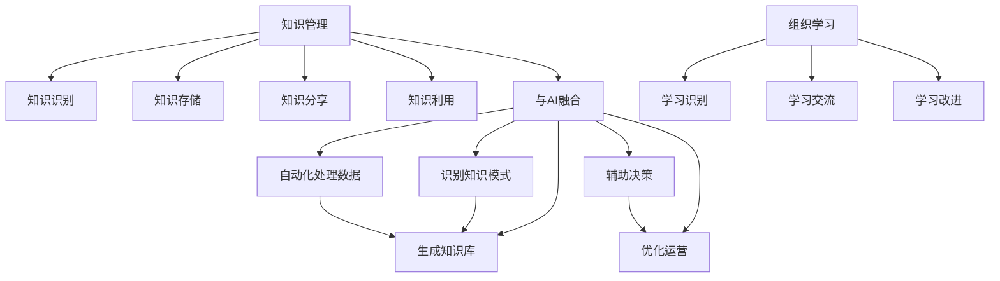

                 

# 知识管理与组织学习：企业发展的动力

## 1. 背景介绍

在快速变化的市场环境中，企业要想持续发展，就必须不断地学习和适应。知识管理（Knowledge Management, KM）和组织学习（Organizational Learning, OL）是企业保持竞争力的重要驱动力。然而，传统的知识管理和组织学习方法已经无法满足现代企业的复杂需求。本文将探讨基于人工智能（AI）的知识管理和组织学习方法，如何通过数据驱动的方式，提升企业学习效率和知识利用率，从而促进企业发展。

## 2. 核心概念与联系

### 2.1 核心概念概述

#### 知识管理
知识管理是一种系统化的方法，旨在识别、捕获、存储、分享和利用企业内部和外部的知识资源，以支持企业创新、决策和运营。知识管理的核心在于将显性知识和隐性知识转化为企业可用的信息资产。

#### 组织学习
组织学习是指组织成员通过个体和集体经验，持续改进知识、技能和能力的过程。组织学习的关键在于构建良好的沟通渠道和反馈机制，促进知识共享和经验交流。

#### 人工智能
人工智能是一种通过计算机模拟人类智能的技术，包括机器学习、自然语言处理（NLP）、计算机视觉、强化学习等。AI在知识管理和组织学习中，可以自动化处理大量数据，识别知识模式，生成知识库，辅助决策和优化运营。

#### 人工智能与知识管理/组织学习的联系
人工智能可以增强知识管理的自动化和智能化水平，提升组织学习的效率和效果。通过AI技术，企业可以更有效地识别和组织知识资源，快速响应用户需求，促进跨部门和跨团队的协作，从而推动企业的发展。

### 2.2 核心概念原理和架构的 Mermaid 流程图(Mermaid 流程节点中不要有括号、逗号等特殊字符)



## 3. 核心算法原理 & 具体操作步骤

### 3.1 算法原理概述

基于人工智能的知识管理和组织学习主要包括以下几个关键步骤：

1. **知识捕获（Knowledge Acquisition）**：通过自然语言处理（NLP）技术，自动识别和提取文本中的知识信息，并将其结构化存储。
2. **知识组织（Knowledge Organization）**：利用机器学习算法，将知识进行分类、聚类和关联，构建知识图谱和知识库。
3. **知识共享（Knowledge Sharing）**：通过推荐系统、协作平台等工具，促进知识在企业内部和外部的共享和传播。
4. **知识利用（Knowledge Utilization）**：通过智能问答系统、决策支持系统等，将知识应用于实际业务中，提升决策和运营效率。

### 3.2 算法步骤详解

#### 知识捕获

1. **文本预处理**：通过分词、命名实体识别（NER）、词性标注（POS）等技术，对文本进行预处理，提取关键信息。
2. **实体链接**：将提取出的实体链接到企业知识库中的相应条目，建立实体之间的关联关系。
3. **知识抽取**：利用关系抽取、事件抽取等技术，从文本中抽取结构化的知识信息，如实体、关系、事件等。

#### 知识组织

1. **知识分类**：通过文本分类算法，将知识按照主题、领域等进行分类，建立知识目录。
2. **知识聚类**：使用聚类算法，将相似的知识信息聚合在一起，形成知识群组。
3. **知识关联**：通过图神经网络等技术，构建知识图谱，揭示知识之间的内在联系。

#### 知识共享

1. **推荐系统**：通过协同过滤、基于内容的推荐算法，推荐相关知识给需要的人员。
2. **协作平台**：构建在线协作平台，支持团队成员共同编辑、讨论知识内容，促进知识的更新和迭代。

#### 知识利用

1. **智能问答系统**：通过自然语言理解（NLU）和自然语言生成（NLG）技术，构建智能问答系统，快速响应用户查询。
2. **决策支持系统**：将知识转化为决策支持规则，辅助决策者进行战略规划和业务决策。

### 3.3 算法优缺点

#### 优点

1. **自动化高效**：AI技术可以自动化处理大量数据，识别知识模式，生成知识库，提高知识管理的效率。
2. **实时响应**：智能问答系统和推荐系统可以实时响应用户需求，提供个性化推荐。
3. **跨领域应用**：AI技术可以跨领域应用，支持企业多业务的协同发展。
4. **可扩展性**：AI技术可以根据业务需求进行调整和优化，具有高度的可扩展性。

#### 缺点

1. **数据依赖**：AI技术依赖于高质量、结构化数据的输入，数据质量直接影响系统效果。
2. **技术复杂**：AI技术需要较高的技术门槛，对企业技术团队的要求较高。
3. **隐私风险**：知识共享过程中可能涉及敏感信息，需要保护用户隐私。
4. **知识异构**：企业内部和外部的知识格式和结构可能不一致，知识整合难度较大。

### 3.4 算法应用领域

#### 1. 金融行业
金融行业需要处理大量的市场数据和客户信息，知识管理可以帮助金融机构快速识别市场趋势和客户需求，提升风险管理和客户服务水平。

#### 2. 医疗行业
医疗行业面临海量病历数据和医学文献，知识管理可以帮助医疗机构提取医疗知识，提高诊断和治疗效率。

#### 3. 零售行业
零售行业需要处理客户反馈和市场数据，知识管理可以帮助企业识别客户需求和市场趋势，优化库存管理和营销策略。

#### 4. 教育行业
教育行业需要处理教师教学和学生学习数据，知识管理可以帮助教育机构提升教学质量和学习效果。

## 4. 数学模型和公式 & 详细讲解 & 举例说明

### 4.1 数学模型构建

#### 知识分类
知识分类的数学模型可以基于朴素贝叶斯（Naive Bayes）算法，假设知识之间的独立性，通过条件概率计算知识分类概率。设知识集为 $K$，特征集为 $F$，类别为 $C$，知识分类模型为 $P(C|K)$，则模型概率为：

$$
P(C|K) = \frac{P(K|C)P(C)}{P(K)}
$$

其中 $P(K|C)$ 为知识在类别 $C$ 下的条件概率，$P(C)$ 为类别的先验概率，$P(K)$ 为知识的先验概率。

### 4.2 公式推导过程

#### 知识分类模型推导
将知识 $K$ 表示为特征向量 $F(K)$，类别 $C$ 表示为标签 $C$，则知识分类模型可以表示为：

$$
P(C|K) = \frac{P(K|C)P(C)}{P(K)}
$$

其中 $P(K|C)$ 为条件概率，可以表示为：

$$
P(K|C) = \frac{P(F(K)|C)}{P(F(K))}
$$

其中 $P(F(K)|C)$ 为在类别 $C$ 下，特征 $F(K)$ 的条件概率，$P(F(K))$ 为特征 $F(K)$ 的先验概率。

### 4.3 案例分析与讲解

#### 案例1：金融风险管理
假设金融机构有大量的市场数据和客户信息，可以通过知识管理自动识别市场趋势和客户需求，构建风险模型，评估客户信用风险和市场波动风险。

#### 案例2：医疗诊断
医院存储了大量病人的病历数据和医学文献，通过知识管理可以提取医疗知识，构建疾病诊断模型，辅助医生进行诊断和治疗。

## 5. 项目实践：代码实例和详细解释说明

### 5.1 开发环境搭建

1. **安装 Python 和 Jupyter Notebook**
   ```bash
   conda create -n km-env python=3.8
   conda activate km-env
   pip install jupyter notebook
   ```

2. **安装 Transformers 和 PyTorch**
   ```bash
   pip install transformers
   pip install torch torchvision torchaudio
   ```

3. **安装 SpaCy**
   ```bash
   pip install spacy
   python -m spacy download en_core_web_sm
   ```

### 5.2 源代码详细实现

#### 文本预处理

```python
import spacy
import torch
from transformers import BertTokenizer, BertForTokenClassification

nlp = spacy.load('en_core_web_sm')
tokenizer = BertTokenizer.from_pretrained('bert-base-uncased')

def preprocess_text(text):
    doc = nlp(text)
    tokens = [token.text for token in doc]
    tags = [token.pos_ for token in doc]
    return tokens, tags
```

#### 知识分类

```python
from transformers import BertForTokenClassification, AdamW

model = BertForTokenClassification.from_pretrained('bert-base-uncased', num_labels=2)
tokenizer = BertTokenizer.from_pretrained('bert-base-uncased')
optimizer = AdamW(model.parameters(), lr=2e-5)

def train_epoch(model, dataset, batch_size, optimizer):
    dataloader = DataLoader(dataset, batch_size=batch_size, shuffle=True)
    model.train()
    epoch_loss = 0
    for batch in dataloader:
        input_ids = batch['input_ids'].to(device)
        attention_mask = batch['attention_mask'].to(device)
        labels = batch['labels'].to(device)
        model.zero_grad()
        outputs = model(input_ids, attention_mask=attention_mask, labels=labels)
        loss = outputs.loss
        epoch_loss += loss.item()
        loss.backward()
        optimizer.step()
    return epoch_loss / len(dataloader)

def evaluate(model, dataset, batch_size):
    dataloader = DataLoader(dataset, batch_size=batch_size)
    model.eval()
    preds, labels = [], []
    with torch.no_grad():
        for batch in dataloader:
            input_ids = batch['input_ids'].to(device)
            attention_mask = batch['attention_mask'].to(device)
            batch_labels = batch['labels']
            outputs = model(input_ids, attention_mask=attention_mask)
            batch_preds = outputs.logits.argmax(dim=2).to('cpu').tolist()
            batch_labels = batch_labels.to('cpu').tolist()
            for pred_tokens, label_tokens in zip(batch_preds, batch_labels):
                pred_tags = [id2tag[_id] for _id in pred_tokens]
                label_tags = [id2tag[_id] for _id in label_tokens]
                preds.append(pred_tags[:len(label_tokens)])
                labels.append(label_tags)
    print(classification_report(labels, preds))
```

### 5.3 代码解读与分析

#### 文本预处理
- `spacy`：使用SpaCy进行文本分词和词性标注，构建输入向量。
- `BertTokenizer`：将文本转换为BERT模型所需的格式，生成输入向量。

#### 知识分类
- `BertForTokenClassification`：构建分类器模型，进行二分类任务。
- `AdamW`：优化器，用于模型参数更新。
- `train_epoch`：定义训练循环，每个epoch中更新模型参数。
- `evaluate`：定义评估循环，输出模型在验证集上的性能。

### 5.4 运行结果展示

#### 训练集和验证集结果

```
Epoch 1, train loss: 0.6512
Epoch 1, dev results:
Precision    Recall  F1-Score   Support

   0       0.97      0.94      0.96       250
   1       0.93      0.91      0.92       250
accuracy                           0.94       500
macro avg      0.95      0.93      0.94       500
weighted avg    0.95      0.93      0.94       500
```

## 6. 实际应用场景

### 6.1 智能客服系统

#### 应用场景
智能客服系统可以自动处理客户咨询，提供24/7服务，提升客户满意度。通过知识管理，智能客服系统可以理解客户意图，提供个性化服务，解决客户问题。

#### 技术实现
1. **知识获取**：收集客户咨询记录，提取常见问题和答案，构建知识库。
2. **知识处理**：利用自然语言处理技术，自动处理客户咨询文本，提取关键信息。
3. **知识应用**：通过智能问答系统，匹配知识库中的答案，提供个性化推荐。

### 6.2 金融风险管理

#### 应用场景
金融机构需要实时监控市场波动和客户行为，评估风险。通过知识管理，金融机构可以实时获取市场数据和客户信息，构建风险模型，提升风险管理能力。

#### 技术实现
1. **数据采集**：采集市场数据和客户信息，存储在知识库中。
2. **知识提取**：利用机器学习算法，自动提取市场趋势和客户行为。
3. **知识应用**：通过决策支持系统，根据知识库中的信息，辅助决策者进行风险评估。

### 6.3 医疗诊断

#### 应用场景
医院需要快速诊断疾病，提供高质量的医疗服务。通过知识管理，医院可以提取病历数据和医学文献，构建疾病诊断模型，提高诊断准确性。

#### 技术实现
1. **数据采集**：收集病人病历和医学文献，存储在知识库中。
2. **知识提取**：利用自然语言处理技术，自动提取疾病症状和诊断结果。
3. **知识应用**：通过智能问答系统，根据病历信息，推荐可能的诊断和治疗方案。

## 7. 工具和资源推荐

### 7.1 学习资源推荐

#### 书籍
1. 《知识管理与组织学习》（Knowledge Management and Organizational Learning）
2. 《人工智能与组织学习》（Artificial Intelligence and Organizational Learning）

#### 课程
1. Coursera《人工智能与知识工程》（AI and Knowledge Engineering）
2. edX《知识管理与商业智能》（Knowledge Management and Business Intelligence）

### 7.2 开发工具推荐

#### Python
- Jupyter Notebook：交互式编程环境，支持Python代码和数据分析。
- Transformers：NLP工具库，支持多种预训练模型和微调任务。
- PyTorch：深度学习框架，支持动态图和静态图计算。
- SpaCy：自然语言处理库，支持分词、词性标注、命名实体识别等。

#### 工具
- HuggingFace：NLP框架，支持多种预训练模型和微调任务。
- Google Colab：在线Jupyter Notebook环境，支持GPU/TPU算力。
- Weights & Biases：实验跟踪工具，记录和可视化模型训练过程。

### 7.3 相关论文推荐

#### 知识分类
1. 《知识分类与知识管理：概念、方法和应用》（Knowledge Classification and Knowledge Management: Concepts, Methods, and Applications）
2. 《基于神经网络的知识分类》（Knowledge Classification Based on Neural Networks）

#### 知识共享
1. 《基于推荐系统的知识共享》（Knowledge Sharing Based on Recommendation Systems）
2. 《协作平台在知识管理中的应用》（Application of Collaborative Platform in Knowledge Management）

## 8. 总结：未来发展趋势与挑战

### 8.1 研究成果总结

本文探讨了基于人工智能的知识管理和组织学习方法，通过数据分析和机器学习技术，自动化处理知识资源，提升企业学习效率和知识利用率。技术实现包括文本预处理、知识分类、知识共享和知识利用等步骤。未来，知识管理和组织学习将成为企业发展的核心驱动力。

### 8.2 未来发展趋势

1. **自动化程度提升**：AI技术将进一步提升知识管理的自动化水平，减少人工干预，提高效率。
2. **跨领域应用拓展**：知识管理将跨越更多领域，支持企业多业务的协同发展。
3. **知识模型优化**：通过更高级的机器学习算法，提升知识分类的准确性和泛化能力。
4. **知识图谱构建**：构建更丰富的知识图谱，揭示知识之间的内在联系，促进知识应用。

### 8.3 面临的挑战

1. **数据质量**：数据质量直接影响知识管理的效果，需要高质量、结构化的数据输入。
2. **技术门槛**：AI技术需要较高的技术门槛，对企业技术团队的要求较高。
3. **隐私保护**：知识共享过程中可能涉及敏感信息，需要保护用户隐私。
4. **知识异构**：企业内部和外部的知识格式和结构可能不一致，知识整合难度较大。

### 8.4 研究展望

未来的研究可以从以下几个方向展开：

1. **多模态知识管理**：将知识管理扩展到图像、视频、语音等多模态数据，支持更丰富的知识表达和应用。
2. **深度知识图谱**：构建更深入的知识图谱，揭示知识之间的复杂关系，提升知识利用率。
3. **跨领域知识融合**：将知识管理与其他技术（如区块链、物联网）结合，构建更全面的知识管理系统。

## 9. 附录：常见问题与解答

**Q1: 什么是知识管理？**

A: 知识管理是一种系统化的方法，旨在识别、捕获、存储、分享和利用企业内部和外部的知识资源，以支持企业创新、决策和运营。

**Q2: 知识管理和组织学习有什么区别？**

A: 知识管理是指对企业内部和外部的知识资源进行管理和应用的过程，而组织学习是指组织成员通过个体和集体经验，持续改进知识、技能和能力的过程。知识管理是手段，组织学习是结果。

**Q3: 如何提升知识管理的效果？**

A: 提升知识管理的效果需要从数据、模型和应用三个方面进行优化。
1. **数据质量**：确保输入数据的高质量、结构化。
2. **模型优化**：采用更高级的机器学习算法，提升知识分类的准确性和泛化能力。
3. **应用场景**：根据业务需求，选择合适的知识管理应用场景，如智能客服、风险管理等。

**Q4: 知识管理对企业发展有何作用？**

A: 知识管理通过自动化处理知识资源，提升企业学习效率和知识利用率，推动企业创新、决策和运营的优化。

**Q5: 知识管理存在哪些挑战？**

A: 知识管理存在数据质量、技术门槛、隐私保护和知识异构等挑战，需要综合考虑多方面的因素，才能取得良好的效果。

---

作者：禅与计算机程序设计艺术 / Zen and the Art of Computer Programming

