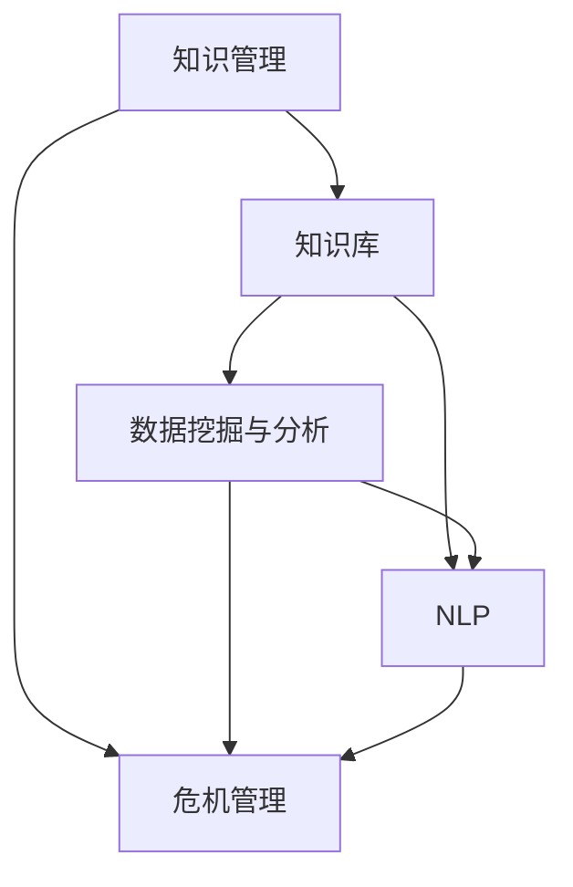

                 

## 1. 背景介绍

### 1.1 问题由来
在现代复杂多变的社会环境中，企业、政府机构和个人都可能面临突如其来的危机。这些危机可能来自自然灾害、经济波动、社会动荡、网络攻击等不同方面，无论是规模还是影响，都不容小觑。例如，新冠疫情的爆发，对全球经济、社会、教育、医疗等多个领域产生了深远影响。

危机应对的成功与否，直接关系到组织和个人的生存与发展。传统危机应对依赖于手工分析和经验决策，但由于危机事件的多变性和复杂性，手工处理存在效率低、决策慢、数据错误率高的问题。随着人工智能和知识管理的不断发展，越来越多的企业和机构开始采用人工智能技术，特别是知识管理（Knowledge Management, KM）手段，来提升危机应对能力。

### 1.2 问题核心关键点
知识管理在危机应对中的作用主要体现在以下几个方面：

- **实时信息检索与处理**：快速获取和处理海量信息，为危机决策提供支持。
- **知识积累与共享**：通过知识库积累历史经验，实现知识复用，提升决策质量。
- **智能推荐与决策支持**：利用AI技术辅助决策，提升响应速度和决策准确性。
- **知识协同与沟通**：通过协同工具促进团队合作，加快信息传递和协同决策。

当前，许多企业和机构已经开始重视知识管理在危机应对中的作用，并积极探索相关的技术和方法。但如何结合实际需求，构建高效的知识管理系统，还需更多实践和研究。

## 2. 核心概念与联系

### 2.1 核心概念概述

为更好地理解知识管理在危机应对中的作用，本节将介绍几个密切相关的核心概念：

- **知识管理（Knowledge Management, KM）**：通过有组织的方式识别、创建、获取、传递、评估和利用知识，提高组织绩效的过程。

- **危机管理（Crisis Management, CM）**：在危机发生时，快速响应、评估、控制和沟通的过程，旨在最小化危机影响并快速恢复正常运营。

- **知识库（Knowledge Base）**：一个系统化的、结构化的知识集合，包含各种形式的知识（如文档、数据、规则等），用于知识检索、存储、共享和重用。

- **数据挖掘与分析（Data Mining and Analysis）**：从海量数据中提取有价值的信息和知识，通过统计分析、机器学习等方法，为决策提供支持。

- **自然语言处理（Natural Language Processing, NLP）**：使计算机能够理解和处理人类语言的技术，包括文本分析、情感分析、语义理解等。

这些核心概念之间的逻辑关系可以通过以下Mermaid流程图来展示：



这个流程图展示了几类核心概念及其之间的关系：

1. 知识管理通过创建和维护知识库，支持危机管理的决策过程。
2. 数据挖掘与分析从数据中提取有价值的信息和知识，增强危机管理的效果。
3. 自然语言处理技术帮助理解人类语言，提升知识库的内容质量和检索效率。

这些概念共同构成了知识管理在危机应对中的应用框架，使其能够在各种场景下发挥重要作用。通过理解这些核心概念，我们可以更好地把握知识管理在危机应对中的工作原理和优化方向。

## 3. 核心算法原理 & 具体操作步骤
### 3.1 算法原理概述

知识管理在危机应对中的应用，通常是通过构建和维护一个知识库来实现的。该知识库包含了组织在以往危机中积累的各类经验、策略、流程、工具等知识。在危机发生时，系统通过搜索、检索、推荐等手段，将最相关的知识呈现给决策者，辅助其做出快速、准确的决策。

形式化地，假设知识库 $K$ 包含了 $N$ 个条目 $k_i$，每个条目由知识 $k_i^j$ 和元数据 $m_i$ 组成。当发生危机时，系统需要快速检索与危机相关的知识条目 $k_i$，并根据实际需求生成推荐列表 $L$。推荐列表中，每个条目 $l_j$ 由推荐得分 $s_j$ 和相关度 $c_j$ 表示，通过排序后供决策者参考。

知识检索的过程涉及以下几个步骤：

1. 获取危机信息：系统从各种来源（如新闻、社交媒体、传感器等）收集和整合危机事件的相关信息。
2. 识别危机类型：通过文本分析、情感分析等技术，识别危机的类型和规模。
3. 知识检索与排序：从知识库中检索与危机相关的知识条目，根据推荐得分和相关度进行排序。
4. 决策辅助：将推荐知识呈现给决策者，辅助其做出决策。

### 3.2 算法步骤详解

知识管理在危机应对中的操作步骤如下：

**Step 1: 构建知识库**

- 收集和整合组织在以往危机中积累的知识，包括决策流程、策略、工具、数据等。
- 对知识进行分类和编码，形成系统化的知识结构。

**Step 2: 数据预处理**

- 将收集到的危机信息进行清洗、整合和标准化处理，形成结构化数据。
- 对数据进行标注，识别出不同类型的事件，如自然灾害、经济波动、网络攻击等。

**Step 3: 知识检索与推荐**

- 使用文本分析、情感分析、分类器等技术，对危机信息进行初步处理。
- 在知识库中检索与危机信息匹配度高的知识条目。
- 根据推荐算法（如基于内容的推荐、协同过滤等）生成推荐列表，并按照推荐得分排序。
- 将推荐列表呈现给决策者，辅助其决策。

**Step 4: 知识更新与迭代**

- 在每次危机应对后，对知识库进行更新和完善，记录新的策略、经验等。
- 定期评估和优化推荐算法，提升检索和推荐的准确性。

### 3.3 算法优缺点

知识管理在危机应对中具有以下优点：

1. **快速响应**：通过系统化的知识库和高效的检索算法，可以快速获取相关信息，辅助决策者快速响应危机。
2. **知识复用**：通过积累和复用历史经验，提升决策的可靠性和质量。
3. **智能化辅助**：利用AI技术提升知识检索和推荐的效率和准确性。

同时，该方法也存在一些局限性：

1. **数据依赖性**：知识库的质量和更新频率直接影响危机应对的效果，依赖人工维护和标注。
2. **复杂性**：构建和维护知识库需要投入大量时间和资源，尤其在大规模组织中。
3. **技术门槛**：需要专业知识来设计和管理知识库，对技术团队的要求较高。

尽管存在这些局限性，但就目前而言，知识管理在危机应对中的应用已成为企业和机构的重要手段。未来相关研究的重点在于如何进一步优化知识库的构建和维护，提高知识检索和推荐的智能化水平，同时兼顾可扩展性和易用性等因素。

### 3.4 算法应用领域

知识管理在危机应对中的应用广泛，涉及多个行业和领域，例如：

- 公共安全：通过知识库和AI技术，辅助警方和救援队快速响应突发事件，提升应急响应能力。
- 金融风险管理：利用金融知识库和AI工具，识别和应对市场波动、欺诈行为等金融危机。
- 公共卫生：通过医疗知识库和AI技术，辅助医疗机构快速应对疫情爆发，优化诊疗流程。
- 企业危机管理：利用企业内部知识库和AI工具，帮助企业在危机事件中保持运营稳定，快速恢复业务。
- 应急通信：通过知识库和AI技术，提升应急通信系统的调度效率，保障通信网络的稳定运行。

除了上述这些经典应用外，知识管理在更多场景中也有着广阔的应用前景，如网络安全防御、灾害预警、物流调度等，为公共安全和应急管理提供了强有力的支持。

## 4. 数学模型和公式 & 详细讲解  
### 4.1 数学模型构建

本节将使用数学语言对知识管理在危机应对中的应用进行更加严格的刻画。

假设知识库 $K$ 包含了 $N$ 个条目 $k_i$，每个条目由知识 $k_i^j$ 和元数据 $m_i$ 组成。当发生危机时，系统需要快速检索与危机相关的知识条目 $k_i$，并根据实际需求生成推荐列表 $L$。推荐列表中，每个条目 $l_j$ 由推荐得分 $s_j$ 和相关度 $c_j$ 表示，通过排序后供决策者参考。

知识检索的过程涉及以下几个步骤：

1. 获取危机信息：系统从各种来源（如新闻、社交媒体、传感器等）收集和整合危机事件的相关信息。
2. 识别危机类型：通过文本分析、情感分析等技术，识别危机的类型和规模。
3. 知识检索与排序：从知识库中检索与危机相关的知识条目，根据推荐得分和相关度进行排序。
4. 决策辅助：将推荐知识呈现给决策者，辅助其决策。

### 4.2 公式推导过程

以下我们以二分类任务为例，推导推荐得分和相关度的计算公式。

假设知识库中的每个条目 $k_i$ 对应一个文本描述 $d_i$，决策者需要从这些描述中选出与危机事件最相关的知识。推荐得分 $s_j$ 和相关度 $c_j$ 的计算公式分别为：

$$
s_j = \text{similarity}(d_i, d_j) \times r_i \times w_j
$$

$$
c_j = \frac{1}{r_i \times w_j} \sum_{k_i \in K} f(k_i, d_j) \times r_i \times w_j
$$

其中 $\text{similarity}(d_i, d_j)$ 表示两个文本描述之间的相似度，$r_i$ 和 $w_j$ 分别表示条目 $k_i$ 和推荐条目 $l_j$ 的权重，$f(k_i, d_j)$ 表示文本 $d_i$ 中是否包含条目 $k_i$。

推荐得分的计算基于相似度、条目权重和文本中的知识条目，相关度的计算则基于知识库中所有条目的评分，体现了知识的累积权重。

在得到推荐得分和相关度后，即可带入推荐算法，生成推荐列表并排序。常用的推荐算法包括基于内容的推荐、协同过滤、深度学习等。

## 5. 项目实践：代码实例和详细解释说明
### 5.1 开发环境搭建

在进行知识管理实践前，我们需要准备好开发环境。以下是使用Python进行开发的环境配置流程：

1. 安装Anaconda：从官网下载并安装Anaconda，用于创建独立的Python环境。

2. 创建并激活虚拟环境：
```bash
conda create -n km-env python=3.8 
conda activate km-env
```

3. 安装PyTorch：根据CUDA版本，从官网获取对应的安装命令。例如：
```bash
conda install pytorch torchvision torchaudio cudatoolkit=11.1 -c pytorch -c conda-forge
```

4. 安装Pandas和Scikit-learn：
```bash
pip install pandas scikit-learn
```

5. 安装Scrapy：用于抓取网站数据：
```bash
pip install scrapy
```

完成上述步骤后，即可在`km-env`环境中开始知识管理实践。

### 5.2 源代码详细实现

下面我们以构建公共安全知识库为例，给出使用Scrapy和PyTorch进行知识管理的Python代码实现。

首先，定义知识库和数据爬虫类：

```python
from scrapy import Spider
from scrapy.crawler import CrawlerProcess
from torch.utils.data import Dataset
from sklearn.metrics.pairwise import cosine_similarity

class PublicSafetyCrawl(Spider):
    name = 'public_safety_crawl'
    start_urls = ['http://www.security.gov.cn/']

    def parse(self, response):
        # 提取网站文本信息
        text = response.css('div.content p::text').extract_first()
        yield {'text': text}

class PublicSafetyDataset(Dataset):
    def __init__(self, data):
        self.data = data
        self.normalize = True
        
    def __len__(self):
        return len(self.data)
    
    def __getitem__(self, idx):
        text = self.data[idx]['text']
        return {'text': text}

# 使用Scrapy爬取数据
process = CrawlerProcess()
process.crawl(PublicSafetyCrawl)
process.start()

# 将爬取的数据保存为文件
with open('public_safety_data.json', 'w') as f:
    f.write(json.dumps(process.items(), indent=4))

# 构建知识库
data = json.load(open('public_safety_data.json'))
dataset = PublicSafetyDataset(data)
```

然后，定义相似度计算函数和推荐算法：

```python
def cosine_similarity_score(vec1, vec2):
    return cosine_similarity(vec1, vec2)[0][1]

def content_based_recommendation(dataset, query):
    # 查询文本
    query_vec = vectorizer.transform([query])
    # 获取知识库中所有文本
    all_texts = [item['text'] for item in dataset.data]
    # 计算相似度得分
    scores = [(cosine_similarity_score(vec1, vec2), vec2) for vec1 in query_vec for vec2 in vectorizer.transform(all_texts)]
    # 对相似度得分进行排序
    sorted_scores = sorted(scores, key=lambda x: x[0], reverse=True)
    # 选择前N条推荐
    top_n = min(10, len(sorted_scores))
    return [item[1] for item in sorted_scores[:top_n]]
```

最后，实现整个知识管理系统的流程：

```python
import torch
from sklearn.feature_extraction.text import TfidfVectorizer

# 使用TF-IDF进行文本向量化
vectorizer = TfidfVectorizer()
dataset = PublicSafetyDataset(data)
query = "自然灾害"

# 查询文本向量化
query_vec = vectorizer.transform([query])

# 获取知识库中所有文本
all_texts = [item['text'] for item in dataset.data]

# 计算相似度得分
scores = [(cosine_similarity_score(vec1, vec2), vec2) for vec1 in query_vec for vec2 in vectorizer.transform(all_texts)]
# 对相似度得分进行排序
sorted_scores = sorted(scores, key=lambda x: x[0], reverse=True)
# 选择前N条推荐
top_n = min(10, len(sorted_scores))
recommendations = [item[1] for item in sorted_scores[:top_n]]

# 将推荐结果呈现给决策者
print("推荐结果：", recommendations)
```

以上就是使用Scrapy和PyTorch构建公共安全知识库的完整代码实现。可以看到，通过Scrapy抓取数据并使用TF-IDF进行文本向量化，最终实现了对知识库的检索和推荐。

### 5.3 代码解读与分析

让我们再详细解读一下关键代码的实现细节：

**PublicSafetyCrawl类**：
- `__init__`方法：初始化爬虫，设置起始URL。
- `parse`方法：定义爬取逻辑，提取文本信息。

**PublicSafetyDataset类**：
- `__init__`方法：初始化数据集，并将爬取的数据加载到内存中。
- `__len__`方法：返回数据集的长度。
- `__getitem__`方法：对单个样本进行处理，返回向量化的文本。

**cosine_similarity_score函数**：
- 定义了余弦相似度计算函数，用于计算文本之间的相似度。

**content_based_recommendation函数**：
- 定义了基于内容的推荐算法，使用TF-IDF向量化文本，计算相似度得分，并生成推荐列表。

在实际应用中，还需要根据具体需求，对上述代码进行优化和扩展。例如，可以使用更高级的文本表示方法（如BERT、GPT等）提升推荐效果；使用更智能的推荐算法（如协同过滤、深度学习等）提高推荐的个性化水平；还可以引入机器学习模型训练预测模型，进一步提升推荐性能。

## 6. 实际应用场景
### 6.1 公共安全领域

在公共安全领域，知识管理系统的应用主要集中在以下几个方面：

- **应急响应**：通过知识库和AI技术，辅助应急管理部门快速响应突发事件，提升应急响应能力。系统可以快速检索历史案例、救援经验、相关法规等，为决策者提供支持。
- **事件预测**：利用知识库中的历史数据，通过数据挖掘和分析技术，预测未来可能发生的公共安全事件，提前做好防范措施。
- **人员疏散**：通过知识库中的疏散策略、逃生路线等，辅助制定科学的疏散方案，保障人员安全。

### 6.2 金融领域

在金融领域，知识管理系统的应用主要集中在以下几个方面：

- **风险预警**：利用金融知识库和AI技术，实时监控市场动态，预警潜在的金融风险。系统可以快速检索历史案例、市场数据、财务报表等，为决策者提供支持。
- **策略优化**：通过金融知识库和AI技术，优化投资策略，提升收益水平。系统可以快速检索不同市场环境下历史交易数据，生成策略优化建议。
- **欺诈检测**：利用金融知识库和AI技术，实时检测金融欺诈行为，保障金融安全。系统可以快速检索欺诈案例、行为模式等，提供异常检测和预警。

### 6.3 医疗领域

在医疗领域，知识管理系统的应用主要集中在以下几个方面：

- **疫情监测**：通过医疗知识库和AI技术，实时监测疫情动态，预警潜在的疫情风险。系统可以快速检索历史疫情数据、流行病学研究、治疗方案等，为决策者提供支持。
- **诊疗优化**：通过医疗知识库和AI技术，优化诊疗方案，提升诊疗效率。系统可以快速检索历史诊疗案例、医疗文献、临床指南等，生成诊疗优化建议。
- **医疗协同**：通过医疗知识库和AI技术，促进医疗机构间的协同合作，共享医疗知识。系统可以快速检索不同医疗机构的治疗方案、专家意见等，提供协同决策支持。

### 6.4 未来应用展望

随着知识管理技术的不断发展，基于知识管理的危机应对系统将展现出更广阔的应用前景。未来，在公共安全、金融、医疗等多个领域，知识管理系统的应用将更加深入和广泛。

在公共安全领域，知识管理系统将与物联网、大数据等技术结合，实现更智能的应急响应和事件预测。在金融领域，知识管理系统将与人工智能交易平台结合，实现更智能的风险预警和策略优化。在医疗领域，知识管理系统将与电子病历系统结合，实现更智能的诊疗优化和医疗协同。

## 7. 工具和资源推荐
### 7.1 学习资源推荐

为了帮助开发者系统掌握知识管理在危机应对中的应用，这里推荐一些优质的学习资源：

1. 《Knowledge Management in Crisis Management》：由知识管理专家撰写，详细介绍了知识管理在危机应对中的理论基础和实践方法。

2. 《Crisis Management and Knowledge Management》：介绍知识管理在危机应对中的重要性和实现方法。

3. 《Natural Language Processing for Crisis Management》：利用NLP技术提升知识检索和推荐的效率。

4. 《Data Mining and Statistical Learning for Crisis Management》：利用数据挖掘和统计学习技术，优化危机应对的决策过程。

5. 《Crisis Management and AI》：介绍AI技术在危机管理中的应用，包括知识管理、情感分析、机器学习等。

通过对这些资源的学习实践，相信你一定能够快速掌握知识管理在危机应对中的精髓，并用于解决实际的危机问题。

### 7.2 开发工具推荐

高效的开发离不开优秀的工具支持。以下是几款用于知识管理开发常用的工具：

1. Python：作为知识管理领域的主流开发语言，Python有着丰富的第三方库和框架，如Scrapy、Pandas、Scikit-learn、TensorFlow等。

2. Scrapy：Python爬虫框架，用于高效抓取网站数据。

3. TfidfVectorizer：使用TF-IDF进行文本向量化。

4. TensorFlow：用于构建和训练机器学习模型，支持深度学习、自然语言处理等多种任务。

5. PyTorch：基于Python的深度学习框架，灵活高效，适合快速迭代研究。

6. Elasticsearch：分布式搜索和分析引擎，支持高效的知识检索和存储。

7. Apache Hadoop：大数据处理平台，支持大规模数据存储和分析。

合理利用这些工具，可以显著提升知识管理系统的开发效率，加快创新迭代的步伐。

### 7.3 相关论文推荐

知识管理在危机应对中的研究源于学界的持续研究。以下是几篇奠基性的相关论文，推荐阅读：

1. "Knowledge Management in Public Safety"：介绍知识管理在公共安全中的应用。

2. "Knowledge Management in Financial Risk Management"：介绍知识管理在金融风险管理中的应用。

3. "Knowledge Management in Healthcare"：介绍知识管理在医疗领域中的应用。

4. "Data Mining and Statistical Learning for Crisis Prediction"：利用数据挖掘和统计学习技术，提升危机预测的准确性。

5. "Natural Language Processing for Crisis Response"：利用自然语言处理技术，提升危机响应的效率和效果。

这些论文代表了大语言模型微调技术的发展脉络。通过学习这些前沿成果，可以帮助研究者把握学科前进方向，激发更多的创新灵感。

## 8. 总结：未来发展趋势与挑战

### 8.1 总结

本文对知识管理在危机应对中的应用进行了全面系统的介绍。首先阐述了知识管理在危机应对中的背景和重要性，明确了知识管理在提升应急响应能力、优化决策质量等方面的独特价值。其次，从原理到实践，详细讲解了知识管理的数学模型和算法步骤，给出了知识管理任务开发的完整代码实例。同时，本文还广泛探讨了知识管理方法在公共安全、金融、医疗等多个领域的应用前景，展示了知识管理技术的巨大潜力。

通过本文的系统梳理，可以看到，知识管理在危机应对中的应用已经成为企业和机构的重要手段，极大地提升了危机应对的效率和效果。未来，伴随知识管理技术的持续演进，知识管理系统必将在更多领域得到应用，为公共安全和应急管理提供强有力的支持。

### 8.2 未来发展趋势

展望未来，知识管理在危机应对中可能呈现以下几个发展趋势：

1. **智能化提升**：结合人工智能技术，实现更智能化的危机应对。通过自然语言处理、深度学习等技术，提升知识检索和推荐的准确性和效率。

2. **数据驱动**：利用大数据和深度学习技术，对危机事件进行更加精细化的分析和预测，提升决策的准确性和前瞻性。

3. **多模态融合**：结合视觉、语音、文本等多种模态的数据，提升知识库的丰富性和多样性，增强危机应对的能力。

4. **跨领域协同**：实现不同领域之间的知识共享和协同，提升整体应对能力。例如，在公共安全领域，将知识库与物联网、大数据等技术结合，实现更智能的应急响应和事件预测。

5. **用户个性化**：通过推荐算法和协同过滤技术，实现个性化的知识推荐，满足不同用户的需求。

6. **知识动态更新**：通过实时数据流和增量学习技术，实现知识库的动态更新，保持知识的时效性和相关性。

以上趋势凸显了知识管理技术在危机应对中的广阔前景。这些方向的探索发展，必将进一步提升知识管理系统的性能和应用范围，为公共安全和应急管理提供强有力的支持。

### 8.3 面临的挑战

尽管知识管理在危机应对中已经取得了一定的成果，但在迈向更加智能化、普适化应用的过程中，它仍面临着诸多挑战：

1. **数据获取与标注**：知识管理系统的应用依赖于高质量的数据和标注，获取和标注数据的成本较高，且数据质量难以保证。

2. **技术复杂性**：知识管理系统的构建和维护需要专业知识，对技术团队的要求较高。同时，系统的部署和运行也需要较高的技术门槛。

3. **知识积累与更新**：知识库的构建和维护需要持续投入，如何高效地积累和更新知识，保持知识的时效性和相关性，仍需进一步探索。

4. **隐私与安全**：在数据采集和存储过程中，如何保障数据隐私和安全，避免敏感信息泄露，是知识管理系统面临的重要问题。

5. **跨领域协作**：不同领域之间的知识共享和协同需要协调，如何建立跨领域的知识生态，实现高效的知识共享和协作，还需进一步努力。

6. **知识呈现与交互**：如何更好地呈现知识，增强用户交互体验，提升知识系统的易用性，是知识管理系统的关键问题。

面对这些挑战，未来的研究需要在数据采集、技术架构、知识库管理等多个方面进行全面优化，才能将知识管理技术推向更高的水平。

### 8.4 研究展望

面对知识管理在危机应对中面临的诸多挑战，未来的研究需要在以下几个方面寻求新的突破：

1. **自动化数据采集与标注**：利用自动文本摘要、数据标注工具，提升数据采集和标注的效率和质量。

2. **跨领域知识融合**：通过知识图谱、语义网等技术，实现不同领域之间的知识融合和共享。

3. **分布式知识管理**：利用分布式存储和计算技术，实现知识库的大规模分布式管理，提升系统的可扩展性和鲁棒性。

4. **知识推理与验证**：结合知识图谱、逻辑推理技术，提升知识库的准确性和可靠性，避免错误信息的传播。

5. **多模态知识表示**：结合视觉、语音、文本等多种模态的数据，提升知识库的丰富性和多样性，增强知识系统的表达能力。

6. **用户行为分析**：利用数据挖掘和机器学习技术，分析用户行为模式，提升知识推荐和知识库管理的智能化水平。

这些研究方向的探索，必将引领知识管理技术迈向更高的台阶，为公共安全和应急管理提供更加智能化、高效化的支持。面向未来，知识管理技术还需要与其他人工智能技术进行更深入的融合，如因果推理、强化学习等，多路径协同发力，共同推动自然语言理解和智能交互系统的进步。只有勇于创新、敢于突破，才能不断拓展知识管理的边界，让智能技术更好地造福人类社会。

## 9. 附录：常见问题与解答

**Q1：知识管理在危机应对中有什么优势？**

A: 知识管理在危机应对中的优势主要体现在以下几个方面：

1. **快速响应**：通过系统化的知识库和高效的检索算法，可以快速获取相关信息，辅助决策者快速响应危机。
2. **知识复用**：通过积累和复用历史经验，提升决策的可靠性和质量。
3. **智能化辅助**：利用AI技术提升知识检索和推荐的效率和准确性。
4. **跨领域协同**：实现不同领域之间的知识共享和协同，提升整体应对能力。

**Q2：构建知识库需要哪些步骤？**

A: 构建知识库需要以下几个关键步骤：

1. **数据收集**：收集和整合组织在以往危机中积累的知识，包括决策流程、策略、工具、数据等。
2. **知识编码**：对知识进行分类和编码，形成系统化的知识结构。
3. **知识存储**：使用数据库、知识图谱等技术，将知识存储在知识库中。
4. **知识检索**：实现高效的知识检索功能，快速获取与危机相关的知识。
5. **知识更新**：在每次危机应对后，对知识库进行更新和完善，记录新的策略、经验等。

**Q3：如何提升知识管理的智能化水平？**

A: 提升知识管理的智能化水平，可以从以下几个方面入手：

1. **数据驱动**：利用大数据和深度学习技术，对危机事件进行更加精细化的分析和预测，提升决策的准确性和前瞻性。
2. **多模态融合**：结合视觉、语音、文本等多种模态的数据，提升知识库的丰富性和多样性，增强危机应对的能力。
3. **自动化知识采集与标注**：利用自动文本摘要、数据标注工具，提升数据采集和标注的效率和质量。
4. **跨领域知识融合**：通过知识图谱、语义网等技术，实现不同领域之间的知识融合和共享。
5. **用户个性化**：通过推荐算法和协同过滤技术，实现个性化的知识推荐，满足不同用户的需求。

**Q4：如何保障知识管理的隐私与安全？**

A: 保障知识管理的隐私与安全，可以从以下几个方面入手：

1. **数据加密**：在数据采集和存储过程中，使用加密技术保护数据的隐私。
2. **访问控制**：通过访问控制技术，限制对知识库的访问权限，避免敏感信息泄露。
3. **数据匿名化**：对数据进行匿名化处理，保护用户隐私。
4. **安全审计**：对知识库的访问和使用进行安全审计，及时发现和处理安全漏洞。

**Q5：知识管理在公共安全领域的应用有哪些？**

A: 知识管理在公共安全领域的应用主要集中在以下几个方面：

1. **应急响应**：通过知识库和AI技术，辅助应急管理部门快速响应突发事件，提升应急响应能力。
2. **事件预测**：利用知识库中的历史数据，通过数据挖掘和分析技术，预测未来可能发生的公共安全事件，提前做好防范措施。
3. **人员疏散**：通过知识库中的疏散策略、逃生路线等，辅助制定科学的疏散方案，保障人员安全。

**Q6：知识管理在金融领域的应用有哪些？**

A: 知识管理在金融领域的应用主要集中在以下几个方面：

1. **风险预警**：利用金融知识库和AI技术，实时监控市场动态，预警潜在的金融风险。
2. **策略优化**：通过金融知识库和AI技术，优化投资策略，提升收益水平。
3. **欺诈检测**：利用金融知识库和AI技术，实时检测金融欺诈行为，保障金融安全。

**Q7：知识管理在医疗领域的应用有哪些？**

A: 知识管理在医疗领域的应用主要集中在以下几个方面：

1. **疫情监测**：通过医疗知识库和AI技术，实时监测疫情动态，预警潜在的疫情风险。
2. **诊疗优化**：通过医疗知识库和AI技术，优化诊疗方案，提升诊疗效率。
3. **医疗协同**：通过医疗知识库和AI技术，促进医疗机构间的协同合作，共享医疗知识。

---

作者：禅与计算机程序设计艺术 / Zen and the Art of Computer Programming

