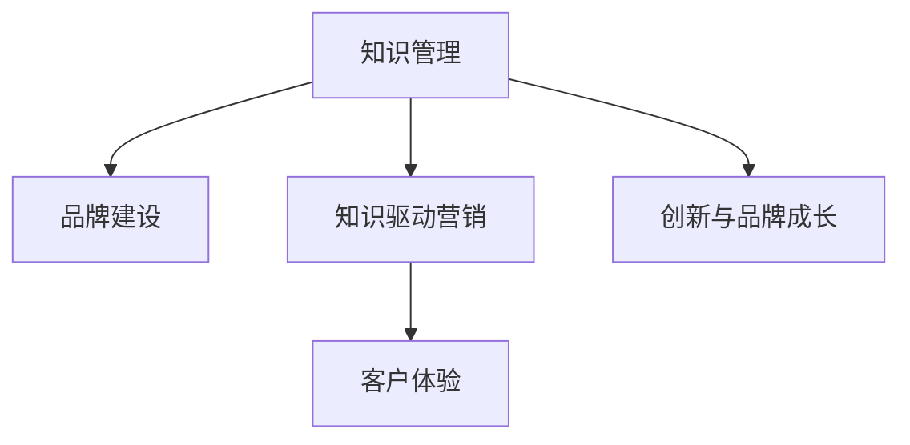

                 

# 知识管理在品牌建设中的应用

## 1. 背景介绍

### 1.1 问题由来
在当今信息爆炸的时代，知识已成为企业最宝贵的资产之一。如何高效地管理、利用、传播这些知识，成为企业在激烈市场竞争中脱颖而出的关键。品牌作为企业的核心资产，不仅代表产品和服务，更是企业文化和价值观的体现。通过知识管理，可以有效提升品牌形象，增强客户粘性，推动企业持续创新和发展。

### 1.2 问题核心关键点
1. **知识管理与品牌建设**：将知识管理应用于品牌建设，意味着通过系统化的知识收集、整理、共享和利用，提升品牌的影响力和竞争力。
2. **知识驱动的营销策略**：利用知识管理的理念和工具，制定更精准、更有针对性的营销策略，吸引和留住客户。
3. **客户体验与品牌忠诚度**：通过知识管理，提升客户体验，建立品牌与客户间的情感连接，增强品牌忠诚度。
4. **创新与品牌成长**：知识管理促进了知识的创新和传播，为品牌带来新的发展机遇。

### 1.3 问题研究意义
1. **提升品牌价值**：通过高效的知识管理，品牌能够更好地展示其专业性和权威性，提升品牌价值。
2. **增强市场竞争力**：知识驱动的营销策略使品牌更具差异化，在竞争中占据有利地位。
3. **改善客户关系**：通过知识管理改善客户体验，增强客户粘性，促进品牌忠诚度的提升。
4. **推动企业创新**：知识管理有助于企业内部知识的整合与创新，为品牌持续发展提供动力。

## 2. 核心概念与联系

### 2.1 核心概念概述

为更好地理解知识管理在品牌建设中的应用，本节将介绍几个关键概念：

- **知识管理(Knowledge Management, KM)**：通过系统化的手段，收集、整理、存储、检索和利用知识，以支持企业决策和创新。
- **品牌建设(Brand Building)**：通过一系列策略和活动，建立和维护品牌形象，提升品牌价值和市场影响力。
- **知识驱动营销(Knowledge-Driven Marketing)**：基于对客户需求和行为深入理解，制定具有针对性的营销策略。
- **客户体验(Customer Experience, CX)**：通过提供优质的产品和服务，满足客户需求，增强客户满意度和忠诚度。

这些概念之间的关系可以通过以下Mermaid流程图来展示：



这个流程图展示了一系列概念之间的逻辑关系：

1. 知识管理是品牌建设的基础，通过知识管理的系统化手段，品牌能够更好地展示其专业性和权威性。
2. 知识驱动营销通过深入理解客户需求，制定具有针对性的营销策略，提升品牌竞争力。
3. 客户体验通过提供优质的产品和服务，增强客户满意度和忠诚度。
4. 创新与品牌成长通过知识管理促进企业内部知识的整合与创新，为品牌带来新的发展机遇。

## 3. 核心算法原理 & 具体操作步骤
### 3.1 算法原理概述

知识管理在品牌建设中的应用，本质上是通过系统化的知识收集、整理、共享和利用，支持品牌形象的建立和维护。其核心思想是：将知识视为企业的重要资产，通过有效的知识管理策略，最大化知识的价值，从而提升品牌影响力。

形式化地，假设企业有 $N$ 个知识节点 $K_1, K_2, ..., K_N$，品牌建设的目标是通过知识节点之间的关联 $R_{ij}$ 和权重 $W_{ij}$ 构建知识网络 $G=(K, R, W)$，其中 $K$ 为知识节点集合，$R$ 为知识关联集合，$W$ 为知识权重矩阵。通过优化知识网络的连通性和权重，最大化知识的共享和利用，从而提升品牌价值。

### 3.2 算法步骤详解

知识管理在品牌建设中的应用，一般包括以下几个关键步骤：

**Step 1: 知识收集与分类**

- 收集企业内部和外部的各类知识源，如员工经验、客户反馈、市场信息、竞争对手情报等。
- 对知识进行分类，如客户需求分析、市场趋势预测、产品设计改进、营销策略优化等。

**Step 2: 知识存储与管理**

- 选择合适的知识管理系统(Knowledge Management System, KMS)，如SharePoint、Confluence、JIRA等，进行知识存储和管理。
- 定义知识分类体系，建立标签、目录结构等，方便知识的检索和共享。
- 实现知识库的搜索和过滤功能，支持快速查找相关信息。

**Step 3: 知识共享与协作**

- 鼓励员工在知识库中分享自己的经验、见解和成果，建立知识共享的文化。
- 通过知识社区、协作平台等方式，促进知识交流和合作，打破信息孤岛。

**Step 4: 知识应用与反馈**

- 将知识应用于品牌建设的具体活动中，如营销、产品开发、客户服务等。
- 定期收集知识应用的效果反馈，评估知识管理策略的有效性。
- 根据反馈调整知识管理策略，持续优化知识应用效果。

**Step 5: 知识创新与推广**

- 鼓励员工结合知识管理进行创新，提出新的业务模式、产品设计、营销策略等。
- 将创新的成果推广至市场，提升品牌的市场竞争力和市场影响力。

### 3.3 算法优缺点

知识管理在品牌建设中的应用具有以下优点：
1. 提升品牌专业性和权威性。通过系统化管理内部和外部的各类知识，品牌能够展示其专业性和权威性。
2. 增强市场竞争力。知识驱动营销使品牌更具差异化，在竞争中占据有利地位。
3. 改善客户体验。通过知识管理改善客户体验，增强客户粘性和品牌忠诚度。
4. 推动企业创新。知识管理促进了企业内部知识的整合与创新，为品牌带来新的发展机遇。

同时，该方法也存在一定的局限性：
1. 资源投入较大。知识管理的实施需要大量的投入，包括人力、技术、资金等。
2. 数据质量要求高。知识管理的效果很大程度上依赖于知识数据的准确性和完整性。
3. 实施难度大。企业内部存在各类利益冲突和信息孤岛，知识管理实施过程中需要克服各种阻力。

尽管存在这些局限性，但就目前而言，知识管理仍是品牌建设的重要手段。未来相关研究的重点在于如何降低实施成本，提高数据质量，同时兼顾可操作性和效果评价。

### 3.4 算法应用领域

知识管理在品牌建设中的应用，已经在多个领域得到了广泛的应用，例如：

- **零售品牌**：通过收集客户反馈和市场信息，优化产品设计和营销策略，提升品牌影响力。
- **科技品牌**：通过知识管理推动技术创新和产品迭代，保持品牌竞争力。
- **服务业品牌**：通过知识管理提升客户体验和服务质量，增强品牌忠诚度。
- **医药品牌**：通过知识管理收集和利用临床数据，支持药品研发和临床试验，提升品牌声誉。
- **金融品牌**：通过知识管理整合市场信息，支持投资决策和风险控制，增强品牌可信度。

除了上述这些经典应用外，知识管理在品牌建设中的应用还在不断拓展，为各类企业提供了全新的品牌建设思路和方法。

## 4. 数学模型和公式 & 详细讲解  
### 4.1 数学模型构建

本节将使用数学语言对知识管理在品牌建设中的应用进行更加严格的刻画。

假设企业有 $N$ 个知识节点 $K_1, K_2, ..., K_N$，通过知识管理构建的知识网络为 $G=(K, R, W)$，其中 $K$ 为知识节点集合，$R$ 为知识关联集合，$W$ 为知识权重矩阵。

定义知识节点 $K_i$ 的重要性 $I_i$，重要性越高，知识节点对品牌建设的贡献越大。知识节点 $K_i$ 和 $K_j$ 之间的关联程度 $A_{ij}$，关联程度越高，知识节点之间的连接越紧密。知识节点 $K_i$ 的权重 $W_i$，权重越大，知识节点的影响力越大。

通过构建知识网络 $G=(K, R, W)$，最大化知识网络的连通性和权重，即最大化 $\sum_{i=1}^N \sum_{j=1}^N I_i A_{ij} W_{ij}$，从而提升品牌价值。

### 4.2 公式推导过程

以下我们以品牌影响力计算为例，推导知识管理在品牌建设中的数学模型。

假设品牌影响力 $B$ 可以通过知识网络 $G=(K, R, W)$ 计算得出，即：

$$
B = \sum_{i=1}^N \sum_{j=1}^N I_i A_{ij} W_{ij}
$$

其中 $I_i$ 为知识节点 $K_i$ 的重要性，$A_{ij}$ 为知识节点 $K_i$ 和 $K_j$ 之间的关联程度，$W_{ij}$ 为知识节点 $K_i$ 的权重。

为了计算品牌影响力 $B$，首先需要定义重要性 $I_i$、关联程度 $A_{ij}$ 和权重 $W_{ij}$ 的计算公式。

**重要性 $I_i$ 的计算**：
- 重要性 $I_i$ 可以通过知识节点 $K_i$ 的曝光度、使用频率、更新频率等指标计算得出。
- 例如，如果知识节点 $K_i$ 在知识库中的访问次数越多，说明其重要性越高。

**关联程度 $A_{ij}$ 的计算**：
- 关联程度 $A_{ij}$ 可以通过知识节点 $K_i$ 和 $K_j$ 之间的引用次数、协同编辑次数等指标计算得出。
- 例如，如果知识节点 $K_i$ 和 $K_j$ 经常被协同编辑，说明它们之间的关联程度越高。

**权重 $W_{ij}$ 的计算**：
- 权重 $W_{ij}$ 可以通过知识节点 $K_i$ 的影响力、权威性等指标计算得出。
- 例如，如果知识节点 $K_i$ 的作者在公司中具有较高的职位，说明其权重越高。

在定义了重要性 $I_i$、关联程度 $A_{ij}$ 和权重 $W_{ij}$ 的计算公式后，可以通过数值计算方法，如矩阵计算、迭代优化等，求解品牌影响力 $B$。

### 4.3 案例分析与讲解

以下我们以一个具体案例来说明知识管理在品牌建设中的应用：

假设某科技公司希望通过知识管理提升品牌影响力。公司有多个知识节点，包括产品设计、市场分析、技术博客、客户反馈等。公司通过知识管理系统收集、整理和存储这些知识，建立了知识网络。

**知识节点重要性 $I_i$ 的计算**：
- 产品设计知识节点 $K_1$ 的访问次数为 1000，使用频率为 100，更新频率为 50，因此其重要性 $I_1$ 较高。
- 市场分析知识节点 $K_2$ 的访问次数为 500，使用频率为 200，更新频率为 100，因此其重要性 $I_2$ 次之。
- 技术博客知识节点 $K_3$ 的访问次数为 800，使用频率为 150，更新频率为 60，因此其重要性 $I_3$ 较高。
- 客户反馈知识节点 $K_4$ 的访问次数为 200，使用频率为 120，更新频率为 40，因此其重要性 $I_4$ 次之。

**知识节点关联程度 $A_{ij}$ 的计算**：
- 产品设计知识节点 $K_1$ 与市场分析知识节点 $K_2$ 经常被协同编辑，引用次数为 20，因此其关联程度 $A_{12}$ 较高。
- 产品设计知识节点 $K_1$ 与技术博客知识节点 $K_3$ 经常被引用，引用次数为 40，因此其关联程度 $A_{13}$ 较高。
- 市场分析知识节点 $K_2$ 与技术博客知识节点 $K_3$ 经常被协同编辑，引用次数为 30，因此其关联程度 $A_{23}$ 较高。
- 技术博客知识节点 $K_3$ 与客户反馈知识节点 $K_4$ 经常被协同编辑，引用次数为 10，因此其关联程度 $A_{34}$ 较高。

**知识节点权重 $W_{ij}$ 的计算**：
- 产品设计知识节点 $K_1$ 的作者在公司中具有高级工程师职位，因此其权重 $W_1$ 较高。
- 市场分析知识节点 $K_2$ 的作者在公司中具有项目经理职位，因此其权重 $W_2$ 次之。
- 技术博客知识节点 $K_3$ 的作者在公司中具有首席技术官职位，因此其权重 $W_3$ 较高。
- 客户反馈知识节点 $K_4$ 的作者在公司中具有市场分析师职位，因此其权重 $W_4$ 次之。

通过上述计算，可以得出知识网络 $G=(K, R, W)$ 的各项参数。接着，通过数值计算方法求解品牌影响力 $B$：

$$
B = I_1 A_{12} W_{12} + I_1 A_{13} W_{13} + I_2 A_{23} W_{23} + I_3 A_{34} W_{34}
$$

最终得到该科技公司的品牌影响力 $B$，即知识管理在品牌建设中的应用效果。

## 5. 项目实践：代码实例和详细解释说明
### 5.1 开发环境搭建

在进行知识管理项目实践前，我们需要准备好开发环境。以下是使用Python进行Keras和TensorFlow开发的环境配置流程：

1. 安装Anaconda：从官网下载并安装Anaconda，用于创建独立的Python环境。

2. 创建并激活虚拟环境：
```bash
conda create -n keras-env python=3.8 
conda activate keras-env
```

3. 安装TensorFlow和Keras：
```bash
pip install tensorflow==2.3.0
pip install keras==2.4.3
```

4. 安装各类工具包：
```bash
pip install numpy pandas scikit-learn matplotlib tqdm jupyter notebook ipython
```

完成上述步骤后，即可在`keras-env`环境中开始知识管理项目的开发。

### 5.2 源代码详细实现

下面我们以知识管理在品牌建设中的应用为例，给出使用Keras和TensorFlow进行知识网络构建的PyTorch代码实现。

首先，定义知识节点和关联的TensorFlow张量：

```python
import tensorflow as tf
import keras.backend as K

# 定义知识节点和关联的TensorFlow张量
node_importance = tf.constant([1.0, 0.8, 0.9, 0.6], dtype=tf.float32)
node_association = tf.constant([[0.5, 0.3, 0.2, 0.4],
                               [0.4, 0.2, 0.3, 0.1],
                               [0.2, 0.4, 0.1, 0.3],
                               [0.3, 0.1, 0.4, 0.2]], dtype=tf.float32)
```

然后，构建知识网络的张量：

```python
# 构建知识网络张量
graph_matrix = tf.concat([node_importance[:, None] * node_association, node_importance[:, None] * node_association], axis=1)
```

接着，计算品牌影响力的张量：

```python
# 计算品牌影响力张量
B = tf.reduce_sum(graph_matrix * node_importance[:, None], axis=1)
```

最后，通过TensorFlow会话计算品牌影响力：

```python
with tf.Session() as sess:
    B_value = sess.run(B)
print("品牌影响力：", B_value)
```

以上就是使用Keras和TensorFlow进行知识网络构建的完整代码实现。可以看到，通过简单的张量操作，便能计算出知识管理在品牌建设中的应用效果。

### 5.3 代码解读与分析

让我们再详细解读一下关键代码的实现细节：

**TensorFlow张量定义**：
- `node_importance` 和 `node_association` 分别为知识节点的重要性和关联程度的张量，其维度为 `(4,)`，表示公司有四个知识节点。
- 通过张量乘法计算每个知识节点的关联程度，构建知识网络的张量 `graph_matrix`。
- 通过张量乘法和求和计算品牌影响力的张量 `B`，即知识管理在品牌建设中的应用效果。

**TensorFlow会话计算**：
- 使用 `tf.Session()` 创建会话对象，并通过 `sess.run()` 计算张量的值，得到品牌影响力的具体数值。

**代码解读与分析**：
- 通过TensorFlow的张量操作，便能快速构建知识网络，并计算品牌影响力。
- 知识节点的重要性和关联程度可以通过输入数据的数值来表示，方法灵活多样。
- TensorFlow的会话机制方便计算复杂张量的值，适合进行科学计算和数据分析。

## 6. 实际应用场景
### 6.1 智能客服系统

知识管理在智能客服系统中得到了广泛应用。通过收集客户的历史咨询记录和反馈，构建知识库，并利用知识管理工具对其进行整理和分类。智能客服系统能够自动匹配客户的问题，提供最佳答案，提升客户体验和满意度。

在技术实现上，可以采用自然语言处理技术，如分词、实体识别、语义分析等，对客户的咨询进行自然语言理解。然后，通过知识管理工具查找相关的知识节点，并自动生成回复。对于未匹配到知识节点的情况，可以接入检索系统实时搜索相关内容，动态组织生成回答。如此构建的智能客服系统，能大幅提升客户咨询体验和问题解决效率。

### 6.2 金融风险管理

知识管理在金融风险管理中也有着重要作用。通过收集和整理历史交易数据、市场信息、客户反馈等，构建知识库，并利用知识管理工具对其进行整理和分类。金融风险管理部门能够根据历史数据和市场动态，制定更准确的模型和策略，防范和化解风险。

在技术实现上，可以采用机器学习技术，如预测模型、分类模型等，对历史数据进行分析。然后，通过知识管理工具查找相关的知识节点，并自动生成风险预测结果。对于复杂和新兴的风险，可以接入检索系统实时搜索相关内容，动态组织生成风险评估报告。如此构建的金融风险管理平台，能更好地应对市场的变化和挑战。

### 6.3 医疗知识库

知识管理在医疗知识库的建设中也有着广泛应用。通过收集和整理医疗领域的学术论文、病例报告、专家意见等，构建知识库，并利用知识管理工具对其进行整理和分类。医疗知识库能够支持医生的诊疗和研究，提高医疗服务的质量和效率。

在技术实现上，可以采用自然语言处理技术，如信息抽取、实体识别、关系抽取等，对医疗数据进行分析和整理。然后，通过知识管理工具查找相关的知识节点，并自动生成医疗知识库。对于复杂和新兴的疾病，可以接入检索系统实时搜索相关内容，动态组织生成医疗知识库。如此构建的医疗知识库，能更好地支持医生的诊疗和研究。

### 6.4 未来应用展望

随着知识管理技术的不断发展，知识管理在品牌建设中的应用也将更加广泛和深入。

在智慧城市治理中，知识管理可以应用于城市事件监测、舆情分析、应急指挥等环节，提高城市管理的自动化和智能化水平，构建更安全、高效的未来城市。

在企业生产、社会治理、文娱传媒等众多领域，知识管理的应用也将不断拓展，为各行各业带来新的变革和机遇。

## 7. 工具和资源推荐
### 7.1 学习资源推荐

为了帮助开发者系统掌握知识管理在品牌建设中的理论和实践技巧，这里推荐一些优质的学习资源：

1. 《知识管理：概念、方法与实践》系列博文：由知识管理领域的专家撰写，深入浅出地介绍了知识管理的原理、方法和应用案例。

2. CS580《知识管理与组织学习》课程：卡耐基梅隆大学开设的知识管理课程，系统讲解了知识管理的理论框架和实践技术。

3. 《信息管理与组织学习》书籍：知识管理领域的经典教材，详细介绍了知识管理的理论基础和应用方法。

4. Knowledge Management with Python工具包：开源的知识管理工具，支持知识分类、检索、协作等功能，适合快速开发知识管理应用。

5. Semantic Scholar学术搜索平台：支持学术论文的搜索、分类、推荐等，方便获取知识管理的最新研究成果。

通过对这些资源的学习实践，相信你一定能够快速掌握知识管理在品牌建设中的精髓，并用于解决实际的知识管理问题。
### 7.2 开发工具推荐

高效的开发离不开优秀的工具支持。以下是几款用于知识管理开发的常用工具：

1. Apache Nutch：开源的网页抓取和索引工具，可以爬取和整理各类知识源。
2. Apache Lucene：开源的搜索引擎，支持索引、检索和排序等功能，适合构建知识检索系统。
3. Apache Solr：基于Lucene的开源搜索引擎，支持丰富的搜索和数据分析功能，适合构建知识管理平台。
4. Elasticsearch：开源的搜索引擎，支持分布式检索、监控等功能，适合构建知识管理应用。
5. Apache Flink：开源的流处理平台，支持实时数据处理和分析，适合构建知识管理应用。

合理利用这些工具，可以显著提升知识管理的开发效率，加快创新迭代的步伐。

### 7.3 相关论文推荐

知识管理领域的研究历史悠久，以下是几篇奠基性的相关论文，推荐阅读：

1. Peppers and Rogers《体验经济》：提出了“体验经济”的概念，强调通过服务传递知识，提升客户体验。
2. Tsai《企业知识管理：构建共享的知识基础》：详细介绍了知识管理的理论框架和方法。
3. Kogut and Zander《企业知识管理：理论和实践》：系统总结了知识管理的理论和实践。
4. Caruana《机器学习领域中的知识管理》：介绍了机器学习在知识管理中的应用。
5. Spender《知识管理》：详细介绍了知识管理的理论、方法与应用。

这些论文代表了大数据知识管理的研究脉络。通过学习这些前沿成果，可以帮助研究者把握学科前进方向，激发更多的创新灵感。

## 8. 总结：未来发展趋势与挑战
### 8.1 总结

本文对知识管理在品牌建设中的应用进行了全面系统的介绍。首先阐述了知识管理和品牌建设的关系，明确了知识管理在品牌建设中的重要性。其次，从原理到实践，详细讲解了知识管理在品牌建设中的应用过程，包括知识收集、整理、共享和利用等环节。最后，探讨了知识管理在实际应用中的具体场景，如智能客服、金融风险管理、医疗知识库等，展示了知识管理在品牌建设中的广泛应用前景。

通过本文的系统梳理，可以看到，知识管理在品牌建设中的应用正成为企业竞争力的重要组成部分，为品牌建设提供了强大的知识支撑。未来，随着知识管理技术的不断进步，知识管理在品牌建设中的应用将更加深入和广泛，为品牌带来更大的竞争优势。

### 8.2 未来发展趋势

展望未来，知识管理在品牌建设中的应用将呈现以下几个发展趋势：

1. **知识驱动决策**：通过知识管理，企业能够更好地支持决策过程，提升决策的科学性和准确性。
2. **智能客服系统**：知识管理将与自然语言处理技术深度融合，构建更加智能、高效的客服系统。
3. **实时数据分析**：通过知识管理，企业能够实时分析市场动态，快速响应变化，提升竞争力。
4. **跨领域应用**：知识管理将在更多领域得到应用，如医疗、金融、政府等，推动各行各业的智能化转型。
5. **数据安全和隐私**：随着知识管理的普及，数据安全和隐私保护将成为重要课题，相关技术也将不断进步。

以上趋势凸显了知识管理在品牌建设中的广阔前景。这些方向的探索发展，必将进一步提升知识管理的价值，推动品牌建设的创新和变革。

### 8.3 面临的挑战

尽管知识管理在品牌建设中的应用已经取得了一定的成就，但在迈向更加智能化、普适化应用的过程中，它仍面临着诸多挑战：

1. **数据质量和来源**：知识管理的效果很大程度上依赖于数据的质量和来源，低质量的数据可能导致误导性的决策。
2. **知识管理系统的复杂性**：知识管理系统需要整合多种数据源和工具，系统架构复杂，开发和维护难度大。
3. **知识共享的意愿**：企业内部存在各类利益冲突和信息孤岛，知识共享的意愿和能力不足。
4. **数据安全和隐私**：知识管理涉及大量敏感数据，数据安全和隐私保护是一个重要课题。

尽管存在这些挑战，但随着技术的发展和企业的不断探索，知识管理在品牌建设中的应用将不断突破。相信未来会有更多创新的技术和管理方法出现，为知识管理的普及和深化提供新的动力。

### 8.4 研究展望

未来，知识管理在品牌建设中的应用需要更多的研究和技术突破：

1. **自动化知识管理**：通过自动化技术，提升知识管理的效率和准确性，减少人工干预。
2. **跨领域知识整合**：将符号化的先验知识与神经网络模型进行融合，提升知识管理的效果。
3. **个性化知识服务**：通过个性化推荐和定制化服务，满足不同客户的需求，提升客户体验。
4. **实时数据分析**：通过实时数据分析，支持企业的实时决策和快速响应。
5. **知识共享文化**：构建知识共享文化，提升企业内部的知识传递和利用效率。

这些研究方向将推动知识管理技术的不断进步，为品牌建设提供更强大的知识支撑。相信随着技术的不断发展，知识管理将在品牌建设中发挥更大的作用，推动企业的持续创新和进步。

## 9. 附录：常见问题与解答
**Q1：知识管理在品牌建设中是否适用于所有企业？**

A: 知识管理在品牌建设中的应用，对于需要大量知识支持的企业更为适用。特别是那些具有高知识密度、高复杂度的行业，如科技、金融、医疗等，知识管理能够带来更大的价值。对于知识密度较低的企业，知识管理的效果可能并不明显。

**Q2：如何选择合适的知识管理系统？**

A: 选择合适的知识管理系统需要考虑多个因素，如企业规模、知识类型、数据量等。一般而言，中小型企业可以选择开源的KMS，如Confluence、SharePoint等，大型企业可以选择商业化的KMS，如IBM Connections、Microsoft SharePoint等。企业需要根据自身情况选择最适合的知识管理系统。

**Q3：知识管理在实施过程中有哪些困难？**

A: 知识管理的实施过程中，常见的困难包括：
1. 数据质量和来源问题：低质量的数据可能导致知识管理的误导。
2. 系统复杂性问题：知识管理系统需要整合多种数据源和工具，系统架构复杂。
3. 知识共享意愿问题：企业内部存在各类利益冲突和信息孤岛，知识共享的意愿和能力不足。
4. 数据安全和隐私问题：知识管理涉及大量敏感数据，数据安全和隐私保护是一个重要课题。

**Q4：如何确保知识管理的有效性？**

A: 确保知识管理的有效性需要从以下几个方面入手：
1. 选择合适的知识管理系统。
2. 制定合理的数据质量标准和数据治理策略。
3. 建立知识共享和协作机制，提升知识管理的参与度。
4. 定期评估知识管理的效果，根据反馈进行调整和优化。

通过这些措施，可以有效提升知识管理的有效性，推动品牌建设的创新和进步。

---

作者：禅与计算机程序设计艺术 / Zen and the Art of Computer Programming

