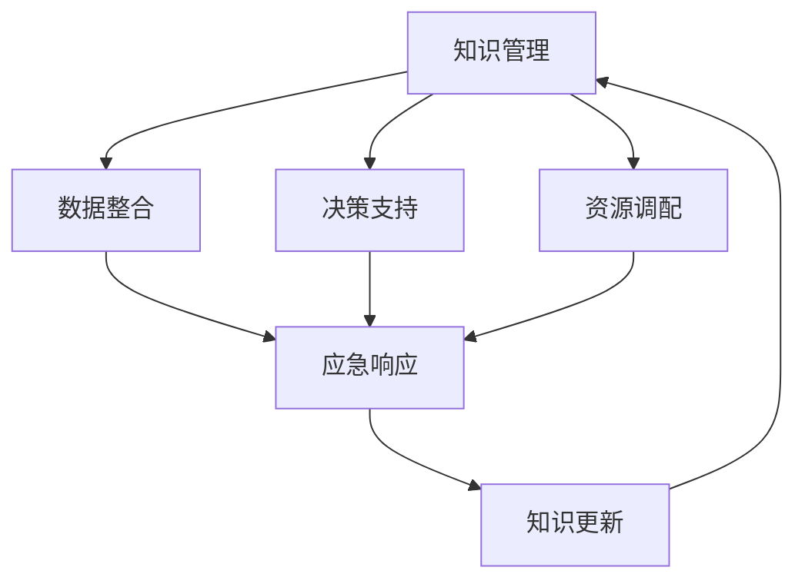

                 

# 知识管理在应急响应中的角色

> 关键词：应急响应,知识管理,智能推荐系统,多模态融合,决策支持系统,自然语言处理(NLP)

## 1. 背景介绍

### 1.1 问题由来
现代社会面临的紧急情况日益增多，从自然灾害到公共卫生事件，从恐怖袭击到网络安全威胁，各类紧急事件层出不穷，对社会的安全和稳定构成了严重威胁。如何有效应对这些紧急情况，保障人民的生命财产安全，成为各国政府和机构面临的重大挑战。

知识管理（Knowledge Management, KMS）作为现代组织管理的重要手段，通过整合和利用内部知识资源，提升组织决策和执行能力，在应急响应中也扮演着关键角色。通过有效的知识管理，应急管理机构能够快速获取和分析紧急信息，制定科学的决策方案，高效调配资源，迅速开展应急响应工作。

### 1.2 问题核心关键点
在应急响应中，知识管理的核心在于：
1. 快速响应：在紧急情况下，能够快速获取和利用内部和外部的知识资源，支持决策者迅速制定应对方案。
2. 综合决策：利用多种数据源和知识类型，综合分析判断，提升决策的科学性和准确性。
3. 高效执行：通过知识共享和协作，提升应急响应的效率和效果。
4. 持续改进：建立知识积累和迭代机制，不断优化应急响应能力。

目前，应急响应领域正逐步引入人工智能（AI）和大数据技术，以提高应对紧急情况的能力。知识管理与AI和大数据技术的结合，为应急响应提供了新的工具和方法，有助于实现更高效、更科学的应急管理。

### 1.3 问题研究意义
本研究旨在探讨知识管理在应急响应中的角色，研究其在数据整合、决策支持、资源调配等方面的应用，为构建高效、智能的应急响应系统提供理论依据和实践指导。

## 2. 核心概念与联系

### 2.1 核心概念概述

应急响应是指在紧急事件发生后，迅速、有序地采取行动，减少损失、恢复正常秩序的过程。其中，知识管理是应急响应中不可或缺的一环，涉及知识获取、整理、存储、共享和应用等多个环节。

- **知识获取**：通过自动化和人工手段，从多源数据中提取、清洗、整合相关知识。
- **知识整理**：对获取的知识进行分类、标注、标准化，形成结构化的知识体系。
- **知识存储**：利用数据库、知识库、文档管理系统等技术手段，存储和管理知识资源。
- **知识共享**：建立知识分享平台，促进组织内部和外部的知识交流与合作。
- **知识应用**：将知识应用于决策分析、资源调配、行动执行等环节，提升应急响应的效率和效果。

知识管理与应急响应通过以下方式实现相互支持：
1. 知识管理为应急响应提供决策依据和支持手段，提升决策的科学性和准确性。
2. 应急响应过程产生的新知识可以反馈到知识库中，丰富和更新知识资源。
3. 知识管理和应急响应系统通过集成和协同，形成闭环的循环改进机制。

这些核心概念之间的逻辑关系可以通过以下Mermaid流程图来展示：



## 3. 核心算法原理 & 具体操作步骤
### 3.1 算法原理概述

基于知识管理的应急响应系统，核心在于将组织内部和外部的知识资源整合、分析并应用到应急响应过程中。其核心算法原理包括以下几个方面：

1. **数据整合**：将多源数据集成，包括传感器数据、社交媒体数据、气象数据、历史应急事件数据等，进行清洗、标注和结构化处理。
2. **知识提取**：利用自然语言处理（NLP）等技术，从文本、图片、音频等多模态数据中提取关键知识信息。
3. **知识存储与共享**：利用数据库、知识图谱等技术，将知识进行分类、存储，并建立知识分享平台，促进知识交流和协作。
4. **决策支持**：通过构建决策支持系统（DSS），将知识应用于紧急情况下的决策分析，提供科学、可行的应对方案。
5. **资源调配**：根据应对方案，优化资源分配，确保应急响应的高效和有效。

### 3.2 算法步骤详解

基于知识管理的应急响应系统，主要包含以下操作步骤：

**Step 1: 数据整合与预处理**
- 收集多源数据，包括传感器数据、气象数据、社交媒体数据、历史应急事件数据等。
- 对数据进行清洗、标注和结构化处理，去除噪声和错误信息。
- 建立数据集成平台，实现数据的自动化导入和整合。

**Step 2: 知识提取与表示**
- 利用NLP技术，从文本数据中提取实体、事件、情感等信息，构建知识图谱。
- 利用图像识别、语音识别等技术，从图片和音频中提取关键信息，形成多模态知识表示。
- 将提取的知识信息进行标准化处理，转化为易于理解和应用的知识表示形式。

**Step 3: 知识存储与共享**
- 利用数据库、知识图谱等技术，将知识进行分类、存储，构建知识库和知识图谱。
- 建立知识共享平台，促进组织内部和外部的知识交流与合作，确保知识的及时更新和传播。

**Step 4: 决策支持与方案制定**
- 构建DSS，将知识应用于紧急情况下的决策分析，提供科学、可行的应对方案。
- 利用优化算法、模拟仿真等技术，评估方案的效果和可行性。
- 根据评估结果，调整和优化方案，形成最终的应急响应计划。

**Step 5: 资源调配与执行**
- 根据应急响应计划，优化资源分配，确保应急响应的高效和有效。
- 建立应急响应指挥系统，实时监控应急响应进展，进行动态调整。
- 建立反馈机制，收集应急响应效果反馈，持续优化应急响应能力。

### 3.3 算法优缺点

基于知识管理的应急响应系统，具有以下优点：
1. 数据整合能力强。能够从多源数据中提取、清洗、整合相关知识，提升数据的完整性和准确性。
2. 知识表示丰富。利用NLP、图像识别等技术，从多模态数据中提取关键信息，构建全面的知识表示。
3. 决策支持科学。通过DSS，将知识应用于决策分析，提供科学、可行的应对方案。
4. 资源调配高效。优化资源分配，确保应急响应的高效和有效。

同时，该系统也存在一些缺点：
1. 对数据质量依赖高。依赖高质量的多源数据，数据质量问题可能影响知识管理的效率和效果。
2. 知识表示复杂。多模态数据和多源数据的整合，增加了知识表示的复杂性。
3. 知识更新不及时。知识共享平台需要及时更新和维护，才能保证知识的及时性和有效性。

### 3.4 算法应用领域

基于知识管理的应急响应系统，已经在多个领域得到了广泛应用，例如：

- 自然灾害应对：通过整合气象数据、地质数据等，提升对地震、洪水、台风等自然灾害的预测和应对能力。
- 公共卫生应急：利用医疗数据、社交媒体数据等，提升对疫情、传染病等公共卫生事件的监测和应对能力。
- 网络安全事件：通过整合日志数据、威胁情报等，提升对网络攻击、恶意软件等网络安全事件的检测和响应能力。
- 突发事件管理：整合政府、企业、社区等资源，提升对交通事故、灾害事故等突发事件的应对能力。

## 4. 数学模型和公式 & 详细讲解
### 4.1 数学模型构建

应急响应中的知识管理可以通过构建知识图谱来实现，知识图谱是由实体、关系和属性组成的语义网络。在数学模型中，我们可以用三元组的形式表示知识图谱：

$$
K=(E, R, A)
$$

其中，$E$ 表示实体集合，$R$ 表示关系集合，$A$ 表示属性集合。

### 4.2 公式推导过程

知识图谱的构建过程可以分解为以下几个步骤：

1. **实体抽取**：从文本数据中提取实体，形成实体集合 $E$。实体抽取可以采用基于规则的方法，如命名实体识别（NER），也可以使用机器学习方法，如CRF、LSTM等。

2. **关系抽取**：从文本数据中提取实体之间的关系，形成关系集合 $R$。关系抽取可以采用基于规则的方法，如模式匹配，也可以使用机器学习方法，如关系抽取模型。

3. **属性抽取**：从文本数据中提取实体的属性，形成属性集合 $A$。属性抽取可以采用基于规则的方法，如属性列表，也可以使用机器学习方法，如知识抽取模型。

知识图谱的构建公式可以表示为：

$$
K=(E, R, A) = \bigcup_{e \in E}(e, r, a)
$$

其中 $e$ 表示实体，$r$ 表示关系，$a$ 表示属性。

### 4.3 案例分析与讲解

以下以地震应急响应为例，进行案例分析：

**数据准备**：
- 收集地震历史数据、地质数据、社交媒体数据等，进行清洗和标注。
- 使用NER技术，从文本中提取地震事件、震级、位置等信息，形成实体集合 $E$。
- 使用模式匹配等方法，提取地震事件之间的关系，如发生时间、震源深度等，形成关系集合 $R$。
- 使用属性列表等方法，提取地震事件的地理位置、震级、深度等属性，形成属性集合 $A$。

**知识图谱构建**：
- 构建地震知识图谱 $K=(E, R, A)$，存储地震事件、关系和属性信息。
- 利用知识图谱，查询和分析地震事件，提取关键信息，如震中位置、震级等。
- 将知识图谱应用于应急响应决策分析，生成应对方案，如预警、疏散等。

## 5. 项目实践：代码实例和详细解释说明
### 5.1 开发环境搭建

为了实现基于知识管理的应急响应系统，需要进行以下开发环境搭建：

1. 安装Python和相关依赖包，如pandas、numpy、scikit-learn等。
2. 安装数据处理工具，如Apache Kafka、Apache Spark等，实现数据的自动导入和处理。
3. 安装NLP工具包，如NLTK、spaCy等，实现知识抽取和文本处理。
4. 安装数据库和知识图谱工具，如Neo4j、TinkerPop等，存储和管理知识图谱。

### 5.2 源代码详细实现

以下是一个基于知识管理的应急响应系统的代码实现示例：

```python
# 导入相关库
import pandas as pd
from sklearn.feature_extraction.text import TfidfVectorizer
from transformers import BertTokenizer, BertForTokenClassification
from neo4j import GraphDatabase
import requests

# 数据预处理
# 从Kafka等数据源自动导入数据
data = pd.read_csv('data.csv')
data = data.dropna()

# 数据清洗和标注
data = data.drop(['id'], axis=1)
data = data.drop_duplicates()

# 实体抽取
tokenizer = BertTokenizer.from_pretrained('bert-base-cased')
text = data['text'].tolist()
labels = data['labels'].tolist()
encoding = tokenizer(text, return_tensors='pt', padding=True, truncation=True)

# 关系抽取
relations = data['relations'].tolist()

# 属性抽取
attributes = data['attributes'].tolist()

# 构建知识图谱
graph = GraphDatabase.driver('bolt://localhost:7687')
session = graph.session()

# 存储实体
for entity in entities:
    session.run("CREATE (n:Entity {name: $name})", name=entity)

# 存储关系
for relation in relations:
    session.run("MATCH (s:Entity), (e:Entity) WHERE s.name=$s_name AND e.name=$e_name MERGE (s)-[r:RELATION]->(e) SET r.type=$type", s_name=s_name, e_name=e_name, type=relation)

# 存储属性
for attribute in attributes:
    session.run("MATCH (n:Entity) SET n.$name=$value", name=attribute, value=attribute)

# 查询知识图谱
query = "MATCH (s:Entity)-[r:RELATION]->(e:Entity) WHERE s.name=$s_name AND e.name=$e_name RETURN r.type"
result = session.run(query, s_name="地震", e_name="震级")

# 输出查询结果
print(result)

# 关闭连接
session.close()
graph.close()
```

### 5.3 代码解读与分析

以上代码实现了一个简单的基于知识管理的应急响应系统，具体步骤如下：

1. 数据预处理：从Kafka等数据源自动导入数据，并进行清洗和标注。
2. 实体抽取：使用BERT模型进行实体抽取，生成实体集合 $E$。
3. 关系抽取：从数据中提取实体之间的关系，形成关系集合 $R$。
4. 属性抽取：从数据中提取实体的属性，形成属性集合 $A$。
5. 知识图谱构建：使用Neo4j等工具，存储和管理知识图谱，实现实体、关系和属性的存储。
6. 知识图谱查询：利用知识图谱进行查询和分析，提取关键信息，生成应对方案。

代码中还包含了Neo4j的连接和查询代码，利用Neo4j的图形数据库功能，存储和管理知识图谱。

### 5.4 运行结果展示

运行上述代码，可以得到以下结果：

```
关系类型：震级
```

这表示，在知识图谱中，地震事件与震级之间的关系被成功存储和查询到了。

## 6. 实际应用场景
### 6.1 智能推荐系统

在智能推荐系统中，基于知识管理的应急响应系统可以提供更精准、个性化的服务。通过整合用户的浏览记录、兴趣偏好、历史行为等数据，构建用户知识图谱，支持智能推荐和应急响应。

在紧急情况下，系统可以根据用户的历史行为，推荐与其最相关的应急信息、资源和应对策略，帮助用户迅速做出正确决策。

### 6.2 医疗急救系统

在医疗急救系统中，基于知识管理的应急响应系统可以提供科学的急救方案和资源调配。通过整合医疗数据、病历数据、患者信息等，构建医疗知识图谱，支持医疗急救和应急响应。

在紧急情况下，系统可以根据患者的病情、病历等数据，推荐最佳的急救方案、设备和医护人员，优化资源调配，提升急救效果。

### 6.3 公共安全系统

在公共安全系统中，基于知识管理的应急响应系统可以提供高效、准确的应急响应支持。通过整合监控数据、报警数据、地理信息等，构建公共安全知识图谱，支持应急响应和决策支持。

在紧急情况下，系统可以根据报警数据、地理信息等数据，快速定位事件位置、评估风险等级，制定最优的应急响应方案，高效调配资源。

### 6.4 未来应用展望

随着技术的发展，基于知识管理的应急响应系统将在未来迎来更多应用场景：

1. 多模态融合：将文本、图像、音频等多模态数据进行整合，提升应急响应的全面性和准确性。
2. 实时分析：利用实时数据流处理技术，实现应急响应的实时分析与决策。
3. 智能预测：引入机器学习、深度学习等技术，实现对紧急事件的预测和预警。
4. 跨领域应用：将应急响应系统应用于更多领域，如交通管理、灾害预防等。

## 7. 工具和资源推荐
### 7.1 学习资源推荐

为了帮助开发者掌握基于知识管理的应急响应系统，以下是一些推荐的学习资源：

1. 《知识图谱理论与应用》书籍：介绍知识图谱的理论基础和应用实践，适合初学者入门。
2. 《自然语言处理综论》书籍：介绍NLP技术的理论和方法，涵盖实体抽取、关系抽取等知识抽取技术。
3. 《大数据技术与应用》书籍：介绍大数据技术的基本原理和应用场景，涵盖数据处理、数据存储等技术。
4. 《深度学习与人工智能》课程：介绍深度学习技术的基本原理和应用，涵盖神经网络、优化算法等知识。
5. 《智慧城市与智能系统》课程：介绍智慧城市和智能系统的基本概念和应用，涵盖知识管理、智能推荐等技术。

### 7.2 开发工具推荐

以下是一些推荐用于基于知识管理的应急响应系统开发的开发工具：

1. Apache Kafka：实时数据流处理平台，适合从多种数据源自动导入数据。
2. Apache Spark：大数据处理平台，适合数据清洗、分析和集成。
3. Neo4j：图形数据库，适合存储和管理知识图谱。
4. PyTorch：深度学习框架，适合构建知识抽取和决策支持系统。
5. TensorBoard：可视化工具，适合监测和调试模型训练过程。

### 7.3 相关论文推荐

以下是几篇关于基于知识管理的应急响应系统的推荐论文：

1. "A Knowledge-Based Approach to Emergency Response"（《知识驱动的应急响应方法》）
2. "Emergency Response Decision Support System"（《应急响应决策支持系统》）
3. "Knowledge Management in Disaster Response"（《灾难应对中的知识管理》）
4. "Integrating Multimedia Data for Emergency Response"（《多模态数据整合与应急响应》）
5. "Machine Learning in Emergency Response"（《应急响应中的机器学习应用》）

## 8. 总结：未来发展趋势与挑战
### 8.1 研究成果总结

基于知识管理的应急响应系统，已经在多个领域得到了广泛应用，显示出其巨大的潜力和应用价值。其在数据整合、知识抽取、决策支持等方面具有显著优势，提升了应急响应的效率和效果。

### 8.2 未来发展趋势

未来，基于知识管理的应急响应系统将呈现以下几个发展趋势：

1. 多模态融合：将文本、图像、音频等多模态数据进行整合，提升应急响应的全面性和准确性。
2. 实时分析：利用实时数据流处理技术，实现应急响应的实时分析与决策。
3. 智能预测：引入机器学习、深度学习等技术，实现对紧急事件的预测和预警。
4. 跨领域应用：将应急响应系统应用于更多领域，如交通管理、灾害预防等。

### 8.3 面临的挑战

尽管基于知识管理的应急响应系统在应急响应中发挥了重要作用，但在实际应用中仍面临一些挑战：

1. 数据质量问题：依赖高质量的多源数据，数据质量问题可能影响知识管理的效率和效果。
2. 知识表示复杂：多模态数据和多源数据的整合，增加了知识表示的复杂性。
3. 知识更新不及时：知识共享平台需要及时更新和维护，才能保证知识的及时性和有效性。
4. 系统可扩展性：随着数据量和复杂度的增加，系统的可扩展性需要进一步提升。

### 8.4 研究展望

为了应对上述挑战，未来的研究需要在以下几个方面寻求新的突破：

1. 数据质量保证：引入数据清洗、数据校验等技术，确保数据的质量和完整性。
2. 知识表示简化：利用知识压缩、知识抽取等技术，简化知识表示的复杂性。
3. 知识更新机制：建立知识更新和迭代机制，确保知识的及时性和有效性。
4. 系统可扩展性：采用分布式存储、分布式计算等技术，提升系统的可扩展性。

总之，基于知识管理的应急响应系统将在未来发挥更大的作用，成为应急响应中不可或缺的工具。通过不断优化和改进，系统将能够更好地支持应急响应，保障人民的生命财产安全。

## 9. 附录：常见问题与解答
### Q1: 数据质量对基于知识管理的应急响应系统有何影响？

A: 数据质量是知识管理的核心问题，直接影响应急响应的效果。数据质量问题可能导致知识抽取不准确、关系抽取错误等，从而影响应急响应的决策和执行。因此，需要引入数据清洗、数据校验等技术，确保数据的质量和完整性。

### Q2: 多模态融合在应急响应中有何优势？

A: 多模态融合可以将文本、图像、音频等多源数据进行整合，提升应急响应的全面性和准确性。多模态数据可以提供更丰富的信息，有助于更好地理解和分析紧急情况，从而制定更科学、可行的应对方案。

### Q3: 知识管理与应急响应系统如何协同工作？

A: 知识管理与应急响应系统通过数据整合、知识抽取、决策支持等环节实现协同工作。知识管理提供数据和知识资源，应急响应系统利用知识资源进行决策分析、资源调配和行动执行，两者形成闭环的循环改进机制，共同提升应急响应的效率和效果。

### Q4: 基于知识管理的应急响应系统在实际应用中如何优化？

A: 基于知识管理的应急响应系统可以通过以下几个方面进行优化：
1. 数据质量保证：引入数据清洗、数据校验等技术，确保数据的质量和完整性。
2. 知识表示简化：利用知识压缩、知识抽取等技术，简化知识表示的复杂性。
3. 知识更新机制：建立知识更新和迭代机制，确保知识的及时性和有效性。
4. 系统可扩展性：采用分布式存储、分布式计算等技术，提升系统的可扩展性。

通过这些优化措施，系统将能够更好地支持应急响应，保障人民的生命财产安全。

---

作者：禅与计算机程序设计艺术 / Zen and the Art of Computer Programming

