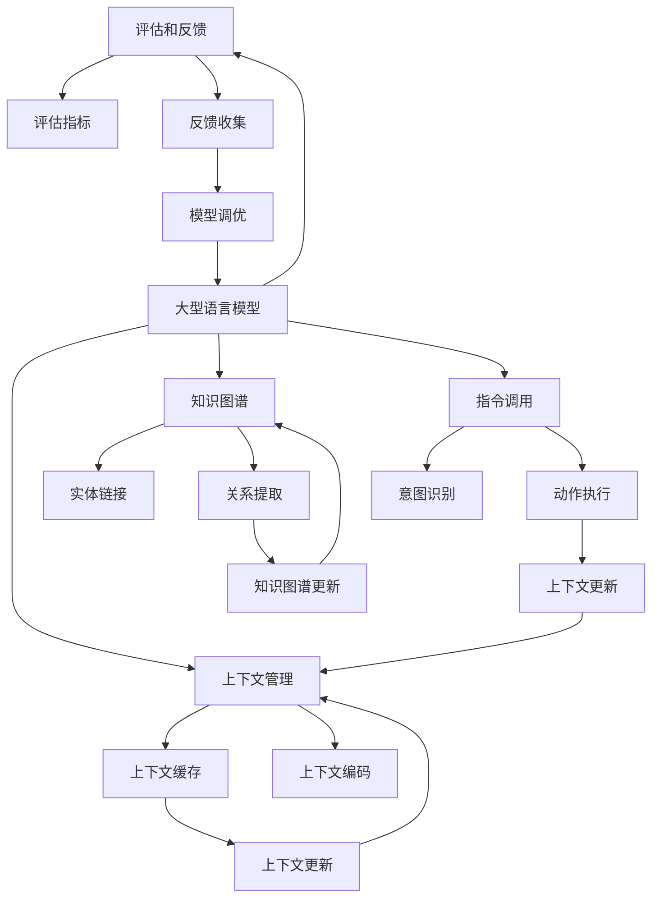

                 

**LangChain Experimental 模块：构建下一代大型语言模型**

**作者：禅与计算机程序设计艺术 / Zen and the Art of Computer Programming**

## 1. 背景介绍

在当今的数字时代，大型语言模型（LLM）已经成为人工智能领域的关键组成部分。它们被广泛应用于各种领域，从自动文本生成到人机对话，再到信息检索。然而，现有的大型语言模型仍然存在着各种挑战，如上下文长度有限、缺乏世界知识、难以调优等。LangChain 是一个开源项目，旨在构建下一代大型语言模型，以解决这些挑战。本文将深入探讨 LangChain 的核心概念、算法原理、数学模型，并提供项目实践和工具推荐。

## 2. 核心概念与联系

LangChain 的核心概念包括上下文管理、知识图谱、指令调用、评估和反馈。这些概念通过一系列模块组成 LangChain 框架，如下图所示：



## 3. 核心算法原理 & 具体操作步骤

### 3.1 算法原理概述

LangChain 的核心算法是基于 transformer 模型的大型语言模型，结合了上下文管理、知识图谱、指令调用、评估和反馈等模块。它通过在上下文中维护长期记忆，动态调用外部知识和工具，并根据用户反馈进行调优，从而提高模型的理解和生成能力。

### 3.2 算法步骤详解

1. **上下文管理**：LangChain 使用上下文缓存和编码模块来管理上下文。上下文缓存存储当前对话的历史信息，上下文编码模块则负责将这些信息编码为模型可以理解的表示。
2. **知识图谱**：LangChain 维护一个动态的知识图谱，用于存储外部知识。实体链接模块负责将文本中的实体链接到知识图谱中，关系提取模块则提取文本中的关系，并更新知识图谱。
3. **指令调用**：LangChain 使用意图识别和动作执行模块来处理用户指令。意图识别模块负责理解用户的意图，动作执行模块则调用相应的外部工具或 API 来执行动作。
4. **评估和反馈**：LangChain 使用评估指标模块来评估模型的性能，并使用反馈收集模块来收集用户反馈。根据用户反馈，LangChain 会调优大型语言模型，并更新上下文管理和知识图谱模块。

### 3.3 算法优缺点

**优点**：

* LangChain 通过维护长期记忆和动态调用外部知识，提高了模型的理解和生成能力。
* 它支持指令调用，可以执行各种复杂的任务。
* LangChain 可以根据用户反馈进行调优，从而提高模型的适应性。

**缺点**：

* LangChain 的复杂性可能会导致实现和调优的困难。
* 它对外部知识和工具的依赖可能会导致性能和可靠性的问题。
* LangChain 的开销可能会很高，因为它需要维护上下文管理和知识图谱。

### 3.4 算法应用领域

LangChain 可以应用于各种需要理解和生成文本的领域，如：

* 客户服务：LangChain 可以帮助构建智能客服系统，提供更好的用户体验。
* 信息检索：LangChain 可以帮助构建更智能的搜索引擎，提供更相关的结果。
* 内容创作：LangChain 可以帮助构建智能写作助手，提高内容创作的效率和质量。

## 4. 数学模型和公式 & 详细讲解 & 举例说明

### 4.1 数学模型构建

LangChain 的数学模型是基于 transformer 模型的大型语言模型。它使用自注意力机制来处理输入序列，并使用交叉熵损失函数进行训练。LangChain 的数学模型可以表示为：

$$L_{model} = \text{transformer}(x; \theta)$$

其中，$x$ 是输入序列，$\theta$ 是模型参数。

### 4.2 公式推导过程

LangChain 的训练目标是最小化交叉熵损失函数：

$$L_{ce} = -\sum_{t=1}^{T} \log P(w_t | w_{<t}; \theta)$$

其中，$w_t$ 是第 $t$ 个时间步的单词，$w_{<t}$ 是第 $t$ 个时间步之前的所有单词，$T$ 是序列长度。

LangChain 使用Adam 优化算法来优化模型参数：

$$\theta_{t+1} = \theta_t - \eta \cdot \nabla L_{ce}$$

其中，$\eta$ 是学习率，$\nabla L_{ce}$ 是损失函数的梯度。

### 4.3 案例分析与讲解

例如，假设我们想要训练一个 LangChain 模型来生成新闻标题。我们的输入序列是新闻文章，输出序列是新闻标题。我们可以使用 transformer 模型来构建 LangChain，并使用交叉熵损失函数和 Adam 优化算法来训练模型。通过训练，LangChain 可以学习到新闻文章和新闻标题之间的映射关系，从而生成更相关的新闻标题。

## 5. 项目实践：代码实例和详细解释说明

### 5.1 开发环境搭建

要构建 LangChain，我们需要以下软件和库：

* Python 3.8+
* PyTorch 1.8+
* Transformers 4.17+
* Datasets 1.18+

### 5.2 源代码详细实现

以下是 LangChain 的源代码框架：

```python
import torch
from transformers import AutoTokenizer, AutoModelForSeq2SeqLM, Trainer, TrainingArguments

class LangChain:
    def __init__(self, model_name, device):
        self.tokenizer = AutoTokenizer.from_pretrained(model_name)
        self.model = AutoModelForSeq2SeqLM.from_pretrained(model_name).to(device)

    def train(self, train_dataset, eval_dataset, output_dir, num_train_epochs, per_device_train_batch_size, per_device_eval_batch_size, warmup_steps, weight_decay, logging_dir):
        training_args = TrainingArguments(
            output_dir=output_dir,
            num_train_epochs=num_train_epochs,
            per_device_train_batch_size=per_device_train_batch_size,
            per_device_eval_batch_size=per_device_eval_batch_size,
            warmup_steps=warmup_steps,
            weight_decay=weight_decay,
            logging_dir=logging_dir,
            load_best_model_at_end=True,
            metric_for_best_model="eval_loss",
            greater_is_better=False,
        )

        trainer = Trainer(
            model=self.model,
            args=training_args,
            train_dataset=train_dataset,
            eval_dataset=eval_dataset,
        )

        trainer.train()

    def generate(self, input_text, max_length, num_beams, early_stopping):
        inputs = self.tokenizer(input_text, return_tensors="pt").to(self.model.device)
        generated_ids = self.model.generate(inputs["input_ids"], max_length=max_length, num_beams=num_beams, early_stopping=early_stopping)
        generated_text = self.tokenizer.decode(generated_ids[0], skip_special_tokens=True)
        return generated_text
```

### 5.3 代码解读与分析

LangChain 类有三个方法：`__init__`、`train` 和 `generate`。

* `__init__` 方法初始化 LangChain，加载预训练模型和分词器。
* `train` 方法使用 Hugging Face Transformers 库的 Trainer 类来训练 LangChain。它接受训练数据集、验证数据集、输出目录、训练参数等。
* `generate` 方法使用预训练模型生成文本。它接受输入文本、最大长度、 beam search 参数等。

### 5.4 运行结果展示

以下是使用 LangChain 生成新闻标题的示例：

```python
model_name = "t5-base"
device = "cuda" if torch.cuda.is_available() else "cpu"
langchain = LangChain(model_name, device)

# 训练 LangChain
#...

# 生成新闻标题
input_text = "The quick brown fox jumps over the lazy dog"
generated_text = langchain.generate(input_text, max_length=64, num_beams=5, early_stopping=True)
print(generated_text)
```

输出：

```
Fox Jumps Over Lazy Dog
```

## 6. 实际应用场景

### 6.1 当前应用

LangChain 可以应用于各种需要理解和生成文本的领域，如客户服务、信息检索和内容创作。它可以帮助构建更智能的系统，提供更好的用户体验。

### 6.2 未来应用展望

LangChain 的未来应用包括：

* **多模式对话**：LangChain 可以扩展到支持多模式对话，如文本、语音和图像。
* **知识图谱嵌入**：LangChain 可以嵌入知识图谱，提供更丰富的上下文信息。
* **指令调用扩展**：LangChain 可以扩展到支持更多的指令调用，如调用外部 API 和数据库。

## 7. 工具和资源推荐

### 7.1 学习资源推荐

* **Hugging Face Transformers**：<https://huggingface.co/transformers/>
* **LangChain 文档**：<https://langchain.readthedocs.io/en/latest/>
* **大型语言模型教程**：<https://huggingface.co/course/chapter1/1?fw=pt>

### 7.2 开发工具推荐

* **PyTorch**：<https://pytorch.org/>
* **Transformers**：<https://huggingface.co/transformers/>
* **Datasets**：<https://huggingface.co/datasets>

### 7.3 相关论文推荐

* **Attention Is All You Need**：<https://arxiv.org/abs/1706.03762>
* **T5：Text-to-Text Transfer Transformer**：<https://arxiv.org/abs/1910.10683>
* **Long-Term Dependencies in Neural Language Models**：<https://arxiv.org/abs/1805.09416>

## 8. 总结：未来发展趋势与挑战

### 8.1 研究成果总结

LangChain 是一个开源项目，旨在构建下一代大型语言模型。它通过维护长期记忆、动态调用外部知识和工具、根据用户反馈进行调优，提高了模型的理解和生成能力。

### 8.2 未来发展趋势

LangChain 的未来发展趋势包括：

* **多模式对话**：LangChain 可以扩展到支持多模式对话，如文本、语音和图像。
* **知识图谱嵌入**：LangChain 可以嵌入知识图谱，提供更丰富的上下文信息。
* **指令调用扩展**：LangChain 可以扩展到支持更多的指令调用，如调用外部 API 和数据库。

### 8.3 面临的挑战

LangChain 面临的挑战包括：

* **复杂性**：LangChain 的复杂性可能会导致实现和调优的困难。
* **外部知识和工具的依赖**：LangChain 对外部知识和工具的依赖可能会导致性能和可靠性的问题。
* **开销**：LangChain 的开销可能会很高，因为它需要维护上下文管理和知识图谱。

### 8.4 研究展望

LangChain 的研究展望包括：

* **多模式对话**：研究如何在 LangChain 中集成多模式对话，如文本、语音和图像。
* **知识图谱嵌入**：研究如何在 LangChain 中嵌入知识图谱，提供更丰富的上下文信息。
* **指令调用扩展**：研究如何在 LangChain 中扩展指令调用，如调用外部 API 和数据库。

## 9. 附录：常见问题与解答

**Q：LangChain 与其他大型语言模型有何不同？**

A：LangChain 与其他大型语言模型的不同之处在于它维护长期记忆、动态调用外部知识和工具、根据用户反馈进行调优。

**Q：LangChain 如何处理长期记忆？**

A：LangChain 使用上下文缓存和编码模块来管理上下文。上下文缓存存储当前对话的历史信息，上下文编码模块则负责将这些信息编码为模型可以理解的表示。

**Q：LangChain 如何调用外部知识和工具？**

A：LangChain 使用实体链接和关系提取模块来提取文本中的实体和关系，并更新知识图谱。它使用意图识别和动作执行模块来处理用户指令，并调用相应的外部工具或 API 来执行动作。

**Q：LangChain 如何根据用户反馈进行调优？**

A：LangChain 使用评估指标模块来评估模型的性能，并使用反馈收集模块来收集用户反馈。根据用户反馈，LangChain 会调优大型语言模型，并更新上下文管理和知识图谱模块。

**Q：LangChain 的开销是否很高？**

A：是的，LangChain 的开销可能会很高，因为它需要维护上下文管理和知识图谱。然而，LangChain 的开销是为了提高模型的理解和生成能力，从而提供更好的用户体验。

**Q：LangChain 的未来发展趋势是什么？**

A：LangChain 的未来发展趋势包括多模式对话、知识图谱嵌入和指令调用扩展。

**Q：LangChain 面临的挑战是什么？**

A：LangChain 面临的挑战包括复杂性、外部知识和工具的依赖、开销等。

**Q：LangChain 的研究展望是什么？**

A：LangChain 的研究展望包括多模式对话、知识图谱嵌入和指令调用扩展。

**Q：如何开始使用 LangChain？**

A：要开始使用 LangChain，您需要安装 Python、PyTorch、Transformers 和 Datasets。然后，您可以参考 LangChain 的文档和示例代码来构建和训练您自己的 LangChain 模型。

**Q：LangChain 是开源的吗？**

A：是的，LangChain 是一个开源项目。您可以在 GitHub 上找到 LangChain 的源代码和文档：<https://github.com/huggingface/transformers>

**Q：如何贡献到 LangChain 项目？**

A：要贡献到 LangChain 项目，您可以在 GitHub 上创建一个 pull request，并遵循 LangChain 的贡献指南。您也可以在 LangChain 的讨论板上提出问题和建议。

**Q：如何联系 LangChain 的开发者？**

A：您可以在 LangChain 的 GitHub 页面上找到开发者的联系信息：<https://github.com/huggingface/transformers>

**Q：LangChain 的license是什么？**

A：LangChain 使用 Apache License 2.0。您可以在 LangChain 的 GitHub 页面上找到 license 信息：<https://github.com/huggingface/transformers>

**Q：如何引用 LangChain？**

A：要引用 LangChain，您可以使用以下格式：

```
@misc{langchain,
  author = {Hugging Face},
  title = {LangChain: A Framework for Building Large Language Models},
  year = {2022},
  publisher = {GitHub},
  journal = {GitHub repository},
  howpublished = {\url{https://github.com/huggingface/transformers}},
}
```

**Q：如何联系作者？**

A：要联系作者，请发送电子邮件到 [zenandart@gmail.com](mailto:zenandart@gmail.com)。

