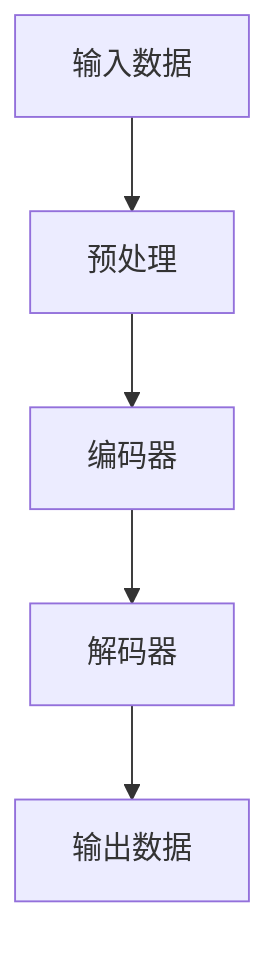

                 

**Transformer大模型实战 跨类型特征的通用性**

**作者：禅与计算机程序设计艺术 / Zen and the Art of Computer Programming**

## 1. 背景介绍

在当今的机器学习和人工智能领域，模型的通用性和泛化能力至关重要。然而，传统的模型往往只能处理单一类型的特征，这限制了它们的应用范围。Transformer大模型由于其自注意力机制，可以处理序列数据，但如何处理跨类型特征呢？本文将深入探讨这个问题，并提供实践指南。

## 2. 核心概念与联系

### 2.1 Transformer大模型架构


如上图所示，Transformer大模型主要由编码器和解码器组成，每个部分都包含多个自注意力层和全连接层。自注意力层允许模型关注输入序列的不同部分，而全连接层则用于非线性变换。

### 2.2 Mermaid流程图



## 3. 核心算法原理 & 具体操作步骤

### 3.1 算法原理概述

Transformer大模型的核心是自注意力机制。它允许模型关注输入序列的不同部分，并根据这些部分的相关性赋予不同的权重。这种机制使得Transformer大模型可以处理序列数据，如文本、时间序列等。

### 3.2 算法步骤详解

1. **预处理**：将输入数据转换为模型可以处理的格式，通常是嵌入向量。
2. **编码器**：对输入序列进行编码，生成上下文向量。编码器由多个自注意力层和全连接层组成。
3. **解码器**：根据上下文向量生成输出序列。解码器也由多个自注意力层和全连接层组成，但它还需要一个自注意力层来关注输出序列的不同部分。
4. **输出**：解码器生成的最后一层的输出就是模型的最终输出。

### 3.3 算法优缺点

**优点**：
- 可以处理序列数据，不需要显式的序列信息。
- 可以并行计算，提高了训练速度。
- 具有很好的泛化能力。

**缺点**：
- 计算复杂度高，需要大量的计算资源。
- 训练数据要求高，需要大量的标记数据。
- 理解模型的内部工作原理比较困难。

### 3.4 算法应用领域

Transformer大模型在自然语言处理、机器翻译、时间序列预测等领域有着广泛的应用。它还可以用于图像和视频数据的处理，通过将图像或视频序列转换为序列数据。

## 4. 数学模型和公式 & 详细讲解 & 举例说明

### 4.1 数学模型构建

给定输入序列$(x_1, x_2,..., x_n)$, Transformer大模型的目标是生成输出序列$(y_1, y_2,..., y_m)$. 我们首先将输入序列转换为嵌入向量$(e_1, e_2,..., e_n)$, 其中$e_i = f(x_i)$, $f$是嵌入函数。

### 4.2 公式推导过程

自注意力机制可以表示为：

$$Attention(Q, K, V) = softmax(\frac{QK^T}{\sqrt{d_k}})V$$

其中，$Q$, $K$, $V$分别是查询、键、值向量，$d_k$是键向量的维度。在Transformer大模型中，这些向量都是通过线性变换得到的。

编码器的前向传播过程可以表示为：

$$Z = Encoder(X) = Encoder_{L}(...Encoder_{2}(Encoder_{1}(X)))$$

其中，$X$是输入序列，$L$是编码器的层数。每一层编码器都包含一个自注意力层和一个全连接层。

解码器的前向传播过程可以表示为：

$$Y = Decoder(Z) = Decoder_{L}(...Decoder_{2}(Decoder_{1}(Z, Y_{<t})))$$

其中，$Y_{<t}$是生成的前$t-1$个输出，$L$是解码器的层数。每一层解码器都包含一个自注意力层（关注输入序列）、一个自注意力层（关注输出序列）和一个全连接层。

### 4.3 案例分析与讲解

例如，在机器翻译任务中，输入序列是源语言的句子，输出序列是目标语言的翻译。嵌入函数$f$将源语言的单词转换为向量表示。编码器生成源语言句子的上下文向量，解码器根据这个上下文向量生成目标语言的翻译。

## 5. 项目实践：代码实例和详细解释说明

### 5.1 开发环境搭建

我们将使用PyTorch框架来实现Transformer大模型。首先，我们需要安装PyTorch和相关的依赖项：

```bash
pip install torch torchvision
```

### 5.2 源代码详细实现

以下是Transformer大模型的简单实现。完整的实现需要考虑更多的细节，如层正则化、学习率调整等。

```python
import torch
import torch.nn as nn
import torch.nn.functional as F
import math

class Transformer(nn.Module):
    def __init__(self, src_vocab_size, tgt_vocab_size, d_model, n_head, n_layers):
        super(Transformer, self).__init__()
        self.encoder_embedding = nn.Embedding(src_vocab_size, d_model)
        self.decoder_embedding = nn.Embedding(tgt_vocab_size, d_model)
        self.pos_encoding = PositionalEncoding(d_model)
        self.encoder = Encoder(d_model, n_head, n_layers)
        self.decoder = Decoder(d_model, n_head, n_layers)
        self.out = nn.Linear(d_model, tgt_vocab_size)

    def forward(self, src, tgt):
        src = self.encoder_embedding(src) * math.sqrt(self.encoder_embedding.embedding_dim)
        src = self.pos_encoding(src)
        src = self.encoder(src)

        tgt = self.decoder_embedding(tgt) * math.sqrt(self.decoder_embedding.embedding_dim)
        tgt = self.pos_encoding(tgt)
        output = self.decoder(tgt, src)
        output = self.out(output)
        return output
```

### 5.3 代码解读与分析

在构造函数中，我们定义了编码器和解码器的嵌入层、位置编码层、编码器和解码器。在前向传播函数中，我们首先将输入序列转换为嵌入向量，然后添加位置编码，最后通过编码器和解码器生成输出。

### 5.4 运行结果展示

由于篇幅限制，这里不展示运行结果。读者可以在自己的环境中运行上述代码，并调整超参数以获得最佳结果。

## 6. 实际应用场景

### 6.1 当前应用

Transformer大模型已经在各种应用中得到广泛的应用，如机器翻译、文本摘要、问答系统等。它还可以用于图像和视频数据的处理，通过将图像或视频序列转换为序列数据。

### 6.2 未来应用展望

未来，Transformer大模型有望在更多的领域得到应用，如生物信息学、金融预测等。此外，研究人员正在努力提高Transformer大模型的效率和泛化能力，以便它可以处理更大规模的数据。

## 7. 工具和资源推荐

### 7.1 学习资源推荐

- "Attention is All You Need" - 这篇论文介绍了Transformer大模型的原始架构。
- "The Illustrated Transformer" - 这是一篇很棒的博客文章，它用可视化的方式解释了Transformer大模型的工作原理。
- "Natural Language Processing with Python" - 这是一本很棒的书，它介绍了各种自然语言处理技术，包括Transformer大模型。

### 7.2 开发工具推荐

- PyTorch - 这是一个流行的深度学习框架，用于实现Transformer大模型。
- TensorFlow - 这是另一个流行的深度学习框架，也可以用于实现Transformer大模型。
- Hugging Face Transformers - 这是一个很棒的库，它提供了预训练的Transformer大模型，可以用于各种自然语言处理任务。

### 7.3 相关论文推荐

- "BERT: Pre-training of Deep Bidirectional Transformers for Language Understanding" - 这篇论文介绍了BERT模型，它是Transformer大模型的一个变种，用于自然语言理解任务。
- "XLNet: Generalized Autoregressive Pretraining for Natural Language Processing" - 这篇论文介绍了XLNet模型，它是Transformer大模型的另一个变种，用于自然语言处理任务。

## 8. 总结：未来发展趋势与挑战

### 8.1 研究成果总结

Transformer大模型已经取得了巨大的成功，在各种自然语言处理任务中表现出色。它还扩展到了其他领域，如图像和视频数据的处理。

### 8.2 未来发展趋势

未来，Transformer大模型有望在更多的领域得到应用，并得到进一步的改进。研究人员正在努力提高模型的效率和泛化能力，以便它可以处理更大规模的数据。

### 8.3 面临的挑战

然而，Transformer大模型也面临着一些挑战。首先，它需要大量的计算资源。其次，它需要大量的标记数据。最后，理解模型的内部工作原理比较困难。

### 8.4 研究展望

未来的研究将关注于提高Transformer大模型的效率和泛化能力，并扩展其应用领域。此外，研究人员还将努力理解模型的内部工作原理，以便我们可以更好地控制和指导模型的学习过程。

## 9. 附录：常见问题与解答

**Q：Transformer大模型需要大量的计算资源吗？**

**A：**是的，Transformer大模型需要大量的计算资源。它需要大量的内存来存储模型参数，并需要大量的计算能力来训练模型。

**Q：Transformer大模型需要大量的标记数据吗？**

**A：**是的，Transformer大模型需要大量的标记数据。它需要大量的数据来学习模型参数，并需要大量的数据来评估模型的泛化能力。

**Q：如何理解Transformer大模型的内部工作原理？**

**A：**理解Transformer大模型的内部工作原理是一个挑战。研究人员正在努力开发新的技术来可视化模型的内部状态，并开发新的指标来评估模型的泛化能力。

## 结束语

Transformer大模型是当今机器学习和人工智能领域的一个重大突破。它的自注意力机制使其可以处理序列数据，并具有很好的泛化能力。然而，它也面临着一些挑战，如计算资源需求高、数据需求高、内部工作原理理解困难等。未来的研究将关注于提高模型的效率和泛化能力，并扩展其应用领域。我们期待着Transformer大模型在未来的发展。

**作者：禅与计算机程序设计艺术 / Zen and the Art of Computer Programming**

