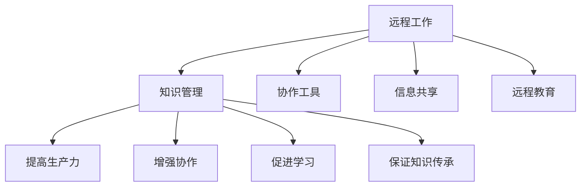

                 

# 知识管理在远程工作中的重要性

> 关键词：远程工作,知识管理,协作工具,信息共享,远程团队,生产力提升,远程教育

## 1. 背景介绍

### 1.1 问题由来
随着全球化和技术的发展，远程工作已成为越来越多企业和组织的标准工作方式。然而，远程工作也带来了新的挑战，尤其是在知识管理方面。传统的工作模式依赖于面对面的交流和共享，而远程工作则需要全新的知识管理策略来保证团队协作的效率和质量。

### 1.2 问题核心关键点
知识管理在远程工作中的重要性主要体现在以下几个方面：

- **信息共享**：远程团队成员无法像传统办公室那样轻松交流，信息共享成为提升远程工作效能的关键。
- **协作工具**：选择合适的协作工具能够极大提升团队协作效率，减少沟通成本。
- **远程教育**：远程教育需要更为高效的知识管理策略，帮助学习者快速掌握知识和技能。
- **知识保留**：远程工作环境下，知识的积累和传递更加复杂，需要有效的知识管理机制来保证知识的传承。
- **生产力提升**：良好的知识管理能够提升团队的整体生产力，减少重复工作，加速创新。

### 1.3 问题研究意义
研究知识管理在远程工作中的重要性，对于提升远程团队的工作效率、知识共享和协作能力，具有重要意义：

1. **提高生产力**：通过有效的知识管理，团队能够更快地获取和应用信息，减少时间浪费。
2. **增强协作**：合适的知识管理工具能够促进团队成员之间的沟通和协作，构建更为紧密的工作关系。
3. **促进学习**：远程教育需要高效的知识管理系统，帮助学习者快速获取和掌握知识。
4. **保证知识传承**：通过系统化的知识管理，确保新成员能够迅速融入团队，继续推进组织的知识积累。

## 2. 核心概念与联系

### 2.1 核心概念概述

为更好地理解知识管理在远程工作中的重要性，本节将介绍几个密切相关的核心概念：

- **远程工作(Remote Work)**：指团队成员通过互联网、通信工具等手段，在非同地的环境中完成工作任务。
- **知识管理(Knowledge Management)**：通过各种手段和工具，管理和利用组织内部的知识和信息，以提高组织效率和创新能力。
- **协作工具**：如Slack、Microsoft Teams、Zoom等，帮助远程团队成员进行实时沟通和协作。
- **信息共享**：通过文档、代码库、Wiki等工具，方便团队成员共享和访问信息。
- **远程教育**：指通过在线平台和工具，提供远程学习的机会和资源。

这些核心概念之间的逻辑关系可以通过以下Mermaid流程图来展示：



这个流程图展示了点对点的知识管理与远程工作各组成部分的联系：

1. 远程工作通过协作工具、信息共享和远程教育等手段，促进了知识管理。
2. 知识管理通过提升生产力、增强协作、促进学习、保证知识传承等途径，提高了远程团队的整体效率。

## 3. 核心算法原理 & 具体操作步骤
### 3.1 算法原理概述

知识管理在远程工作中的核心思想是：通过有效的知识管理策略和技术手段，最大化地利用和共享团队内部的知识资源，以提升远程工作的效率和效果。这主要包括以下几个方面：

- **信息收集**：收集和整理远程工作过程中产生的信息和数据。
- **知识存储**：将信息存储在易于访问和查询的系统中，以便团队成员随时检索和使用。
- **知识共享**：通过协作工具和平台，促进团队成员之间的知识传递和共享。
- **知识应用**：将知识转化为实际工作的决策和行动，提高远程团队的决策质量和执行效率。

### 3.2 算法步骤详解

知识管理在远程工作中的应用一般包括以下几个关键步骤：

**Step 1: 定义知识管理策略**

- **知识分类**：根据组织和团队的工作需求，将知识分为不同的类别，如技术文档、项目计划、团队文化等。
- **知识权限**：定义不同类别的知识访问权限，确保敏感信息的安全性。
- **知识生命周期**：确定知识的生命周期，明确知识收集、存储、共享和销毁的流程。

**Step 2: 选择合适的知识管理工具**

- **文档管理系统**：如Confluence、SharePoint等，用于存储和管理文档。
- **协作平台**：如Slack、Microsoft Teams等，提供团队沟通和协作的功能。
- **代码库和版本控制系统**：如Git、GitHub等，管理软件开发的代码和版本。
- **知识图谱和知识图**：如Lucidchart、Stratimake等，帮助团队构建和共享知识结构。

**Step 3: 构建知识管理框架**

- **知识地图**：创建组织的知识地图，帮助团队成员快速找到所需知识。
- **知识库**：建立知识库，将各类知识整理成易于检索和使用的形式。
- **知识共享机制**：制定知识共享机制，鼓励团队成员主动分享和更新知识。

**Step 4: 实施知识管理**

- **知识收集**：通过工具和流程，自动收集和整理团队中的各类信息。
- **知识存储**：将收集到的信息存储在知识库和协作平台中，确保可检索和更新。
- **知识共享**：利用协作工具，促进团队成员之间的知识交流和共享。
- **知识应用**：将知识转化为实际工作中的决策和行动，提高远程团队的工作效率。

### 3.3 算法优缺点

知识管理在远程工作中的应用具有以下优点：

- **提高效率**：通过有效管理知识，减少重复工作，提升团队整体效率。
- **增强协作**：促进团队成员之间的知识传递和共享，增强协作能力。
- **促进学习**：通过知识共享和积累，帮助新成员快速融入团队，提升团队整体知识水平。
- **保证知识传承**：确保知识在公司内部的连续传递，保证组织知识的积累。

同时，知识管理在远程工作中也存在一些局限性：

- **初始成本高**：选择合适的知识管理工具和构建知识管理框架需要较高的初始投入。
- **知识质量依赖人工**：知识管理的质量和效果依赖于团队成员的主动性和积极性。
- **安全性和隐私保护**：远程工作环境下的知识管理需要更多的安全措施和隐私保护策略。
- **技术复杂性**：需要团队成员具备一定的技术能力和知识管理意识。

尽管存在这些局限性，但知识管理在提升远程工作效能方面的重要性不容忽视。未来相关研究的重点在于如何进一步降低知识管理的初始成本，提高知识质量，同时兼顾安全性和隐私保护，以及简化技术实现的复杂度。

### 3.4 算法应用领域

知识管理在远程工作中的应用领域非常广泛，以下是几个典型案例：

- **技术研发**：如Google、Facebook等科技公司的远程研发团队，通过文档管理系统、代码库和协作平台，高效管理技术知识。
- **客户服务**：如Airbnb、Slack等远程客户服务团队，通过知识库和协作工具，快速响应客户咨询。
- **教育培训**：如Coursera、Udemy等在线教育平台，通过知识图谱和在线课程，提供高质量的远程教育资源。
- **市场营销**：如HubSpot、Hootsuite等远程市场营销团队，通过协作工具和信息共享机制，提升市场营销的效果和效率。

这些应用领域展示了知识管理在远程工作中的广泛应用前景和实际价值。

## 4. 数学模型和公式 & 详细讲解 & 举例说明

### 4.1 数学模型构建

在知识管理的量化模型中，通常使用知识流图(Knowledge Flow Graph)来描述知识管理的各个环节。知识流图由节点和边组成，节点表示知识管理活动的各个步骤，边表示知识的流动方向和流速。

知识流图的形式化定义如下：

$$
\mathcal{G}=(\mathcal{V},\mathcal{E})
$$

其中，$\mathcal{V}$为节点集合，表示知识管理活动的各个步骤；$\mathcal{E}$为边集合，表示知识的流动方向和流速。

知识流图的构建需要考虑以下几个关键因素：

- **知识源**：指知识流图的起点，通常是项目文档、会议记录等。
- **知识处理**：指知识从源到目标的转换和处理过程，如分类、存储、共享等。
- **知识目标**：指知识流图的终点，通常是用户、项目或团队。

### 4.2 公式推导过程

知识流图的构建可以通过以下公式来推导：

$$
\text{知识流图} = (\text{知识源}, \text{知识处理}, \text{知识目标})
$$

例如，一个远程技术团队的文档管理系统可以表示为：

- 知识源：项目文档、技术博客、会议记录等。
- 知识处理：文档分类、版本控制、文档共享等。
- 知识目标：开发人员、项目经理、团队成员等。

通过构建知识流图，可以清晰地了解知识管理的各个环节和流程，有助于优化和改进知识管理策略。

### 4.3 案例分析与讲解

假设一个远程教育机构想要提升在线课程的学习效果，可以使用知识流图来描述其知识管理流程。具体如下：

- 知识源：课程内容、专家讲座、学习资料等。
- 知识处理：知识分类、资源整合、平台存储等。
- 知识目标：学生、教师、课程管理团队等。

通过知识流图，教育机构可以更好地了解课程知识的流动和应用，优化课程内容和学习资源，提升学生的学习效果。

## 5. 项目实践：代码实例和详细解释说明

### 5.1 开发环境搭建

在进行知识管理实践前，我们需要准备好开发环境。以下是使用Python进行PyTorch开发的环境配置流程：

1. 安装Anaconda：从官网下载并安装Anaconda，用于创建独立的Python环境。

2. 创建并激活虚拟环境：
```bash
conda create -n knowledge-management python=3.8 
conda activate knowledge-management
```

3. 安装PyTorch：根据CUDA版本，从官网获取对应的安装命令。例如：
```bash
conda install pytorch torchvision torchaudio cudatoolkit=11.1 -c pytorch -c conda-forge
```

4. 安装TensorBoard：
```bash
pip install tensorboard
```

5. 安装各类工具包：
```bash
pip install numpy pandas scikit-learn matplotlib tqdm jupyter notebook ipython
```

完成上述步骤后，即可在`knowledge-management`环境中开始知识管理实践。

### 5.2 源代码详细实现

这里我们以一个文档管理系统为例，给出使用PyTorch和TensorFlow进行知识管理的PyTorch代码实现。

首先，定义文档管理系统的数据处理函数：

```python
from transformers import BertTokenizer
from torch.utils.data import Dataset
import torch

class DocumentDataset(Dataset):
    def __init__(self, documents, tokenizer, max_len=128):
        self.documents = documents
        self.tokenizer = tokenizer
        self.max_len = max_len
        
    def __len__(self):
        return len(self.documents)
    
    def __getitem__(self, item):
        document = self.documents[item]
        
        encoding = self.tokenizer(document, return_tensors='pt', max_length=self.max_len, padding='max_length', truncation=True)
        input_ids = encoding['input_ids'][0]
        attention_mask = encoding['attention_mask'][0]
        
        return {'input_ids': input_ids, 
                'attention_mask': attention_mask,
                'text': document}
```

然后，定义模型和优化器：

```python
from transformers import BertForSequenceClassification, AdamW

model = BertForSequenceClassification.from_pretrained('bert-base-cased', num_labels=2)

optimizer = AdamW(model.parameters(), lr=2e-5)
```

接着，定义训练和评估函数：

```python
from torch.utils.data import DataLoader
from tqdm import tqdm
from sklearn.metrics import classification_report

device = torch.device('cuda') if torch.cuda.is_available() else torch.device('cpu')
model.to(device)

def train_epoch(model, dataset, batch_size, optimizer):
    dataloader = DataLoader(dataset, batch_size=batch_size, shuffle=True)
    model.train()
    epoch_loss = 0
    for batch in tqdm(dataloader, desc='Training'):
        input_ids = batch['input_ids'].to(device)
        attention_mask = batch['attention_mask'].to(device)
        labels = batch['labels'].to(device)
        model.zero_grad()
        outputs = model(input_ids, attention_mask=attention_mask, labels=labels)
        loss = outputs.loss
        epoch_loss += loss.item()
        loss.backward()
        optimizer.step()
    return epoch_loss / len(dataloader)

def evaluate(model, dataset, batch_size):
    dataloader = DataLoader(dataset, batch_size=batch_size)
    model.eval()
    preds, labels = [], []
    with torch.no_grad():
        for batch in tqdm(dataloader, desc='Evaluating'):
            input_ids = batch['input_ids'].to(device)
            attention_mask = batch['attention_mask'].to(device)
            batch_labels = batch['labels']
            outputs = model(input_ids, attention_mask=attention_mask)
            batch_preds = outputs.logits.argmax(dim=2).to('cpu').tolist()
            batch_labels = batch_labels.to('cpu').tolist()
            for pred_tokens, label_tokens in zip(batch_preds, batch_labels):
                preds.append(pred_tokens[:len(label_tokens)])
                labels.append(label_tokens)
                
    print(classification_report(labels, preds))
```

最后，启动训练流程并在测试集上评估：

```python
epochs = 5
batch_size = 16

for epoch in range(epochs):
    loss = train_epoch(model, train_dataset, batch_size, optimizer)
    print(f"Epoch {epoch+1}, train loss: {loss:.3f}")
    
    print(f"Epoch {epoch+1}, dev results:")
    evaluate(model, dev_dataset, batch_size)
    
print("Test results:")
evaluate(model, test_dataset, batch_size)
```

以上就是使用PyTorch和TensorFlow对文档管理系统进行知识管理的完整代码实现。可以看到，利用Transformer模型和TensorBoard等工具，可以方便地进行文档管理系统的构建和评估。

### 5.3 代码解读与分析

让我们再详细解读一下关键代码的实现细节：

**DocumentDataset类**：
- `__init__`方法：初始化文档数据、分词器等关键组件。
- `__len__`方法：返回数据集的样本数量。
- `__getitem__`方法：对单个文档进行处理，将文本输入编码为token ids，最终返回模型所需的输入。

**训练和评估函数**：
- 使用PyTorch的DataLoader对数据集进行批次化加载，供模型训练和推理使用。
- 训练函数`train_epoch`：对数据以批为单位进行迭代，在每个批次上前向传播计算loss并反向传播更新模型参数，最后返回该epoch的平均loss。
- 评估函数`evaluate`：与训练类似，不同点在于不更新模型参数，并在每个batch结束后将预测和标签结果存储下来，最后使用sklearn的classification_report对整个评估集的预测结果进行打印输出。

**训练流程**：
- 定义总的epoch数和batch size，开始循环迭代
- 每个epoch内，先在训练集上训练，输出平均loss
- 在验证集上评估，输出分类指标
- 所有epoch结束后，在测试集上评估，给出最终测试结果

可以看到，PyTorch配合Transformer库使得文档管理系统的构建变得简洁高效。开发者可以将更多精力放在数据处理、模型改进等高层逻辑上，而不必过多关注底层的实现细节。

当然，工业级的系统实现还需考虑更多因素，如模型的保存和部署、超参数的自动搜索、更灵活的任务适配层等。但核心的知识管理流程基本与此类似。

## 6. 实际应用场景

### 6.1 远程客户服务

远程客户服务需要高效的知识管理系统来支持。传统客服通常需要大量人力，高峰期响应缓慢，且一致性和专业性难以保证。通过知识管理，远程客服系统可以24小时不间断服务，快速响应客户咨询，用自然流畅的语言解答各类常见问题。

在技术实现上，可以收集企业内部的历史客服对话记录，将问题和最佳答复构建成监督数据，在此基础上对预训练模型进行微调。微调后的模型能够自动理解用户意图，匹配最合适的答案模板进行回复。对于客户提出的新问题，还可以接入检索系统实时搜索相关内容，动态组织生成回答。如此构建的智能客服系统，能大幅提升客户咨询体验和问题解决效率。

### 6.2 技术研发

远程技术研发团队通常需要高效的文档管理系统来管理技术知识。通过知识管理，团队成员可以轻松查找和共享技术文档、项目计划、代码库等各类信息。文档管理系统可以帮助团队成员快速了解项目背景和技术细节，提升开发效率。

具体而言，可以建立基于Git的代码库，集成代码审查、版本控制和协作工具，使得团队成员可以随时访问和更新代码。同时，通过文档管理系统和知识图谱，团队成员可以快速找到所需的技术文档和资料，加速知识传递和应用。

### 6.3 远程教育

远程教育需要高效的知识管理系统来支持。在线课程需要丰富的学习资源和及时的教学支持，知识管理系统可以帮助教育机构管理和共享这些资源。

具体而言，可以构建在线课程平台，集成文档管理系统、视频课程、知识图谱等各类资源。通过知识管理系统，学习者可以轻松获取课程内容和相关资料，提升学习效果。教师可以通过知识管理系统记录和分享教学经验，积累和传承教学知识。

### 6.4 未来应用展望

随着知识管理技术的不断进步，未来知识管理在远程工作中的应用将更加广泛和深入：

- **实时知识更新**：通过实时数据流和协作工具，知识管理系统能够实时更新和共享最新的知识信息。
- **智能推荐**：利用机器学习和推荐算法，知识管理系统可以根据用户的学习行为和偏好，智能推荐相关的学习资源和资料。
- **跨平台集成**：知识管理系统将与各类办公平台和协作工具进行深度集成，提供无缝的知识流动和应用。
- **自动化知识生成**：利用自然语言处理和自动生成技术，知识管理系统可以自动生成和更新各类文档和资料，减少人工干预。

随着知识管理技术的不断创新和应用，远程工作的知识管理将更加高效和智能化，为各类工作场景提供更加优质的支持和服务。

## 7. 工具和资源推荐
### 7.1 学习资源推荐

为了帮助开发者系统掌握知识管理在远程工作中的理论和实践，这里推荐一些优质的学习资源：

1. **《知识管理基础与实践》**：详细介绍了知识管理的理论基础和实践方法，适用于初学者和有经验的管理人员。
2. **《远程工作与知识管理》**：探讨了远程工作环境下知识管理的最佳实践和工具选择，帮助团队提高工作效率。
3. **《Python数据科学手册》**：介绍了Python在数据管理和分析中的应用，包括文档管理系统、数据可视化等。
4. **《远程教育与知识管理系统》**：讨论了远程教育中的知识管理策略和工具，帮助教育机构提升教学效果。
5. **《知识管理系统与协作平台》**：介绍了各类知识管理系统和协作平台的使用方法和最佳实践，帮助团队构建高效的知识管理系统。

通过对这些资源的学习实践，相信你一定能够快速掌握知识管理在远程工作中的精髓，并用于解决实际的NLP问题。

### 7.2 开发工具推荐

高效的开发离不开优秀的工具支持。以下是几款用于知识管理开发的常用工具：

1. **Confluence**：Atlassian开发的文档管理系统，支持协作、搜索和版本控制。
2. **SharePoint**：微软开发的文档管理系统，适用于企业级知识管理。
3. **Slack**：团队协作工具，支持实时沟通、文件共享和任务管理。
4. **Microsoft Teams**：微软开发的协作平台，支持视频会议、文档共享和协作。
5. **GitHub**：Git版本控制系统，支持代码库管理和协作。
6. **Lucidchart**：在线知识图谱工具，支持协作和共享知识结构。
7. **Stratimake**：知识图谱构建工具，支持可视化和管理知识图谱。

合理利用这些工具，可以显著提升知识管理开发的效率，加快创新迭代的步伐。

### 7.3 相关论文推荐

知识管理在远程工作中的应用源于学界的持续研究。以下是几篇奠基性的相关论文，推荐阅读：

1. **Knowledge Management in Remote Work**：探讨了远程工作环境下知识管理的挑战和解决方案。
2. **Collaboration Tools for Remote Teams**：讨论了各类协作工具在远程团队中的应用和效果。
3. **Knowledge Sharing in Online Education**：探讨了远程教育中的知识管理策略和工具，帮助教育机构提升教学效果。
4. **Document Management Systems for Remote Work**：讨论了文档管理系统在远程工作中的应用和效果。
5. **Real-Time Knowledge Updates in Remote Work**：探讨了实时数据流和协作工具在知识管理中的应用。

这些论文代表了大语言模型微调技术的发展脉络。通过学习这些前沿成果，可以帮助研究者把握学科前进方向，激发更多的创新灵感。

## 8. 总结：未来发展趋势与挑战

### 8.1 总结

本文对知识管理在远程工作中的重要性进行了全面系统的介绍。首先阐述了远程工作和知识管理的研究背景和意义，明确了知识管理在提升远程工作效能方面的独特价值。其次，从原理到实践，详细讲解了知识管理的数学模型和操作步骤，给出了知识管理任务开发的完整代码实例。同时，本文还广泛探讨了知识管理在各类远程工作场景中的应用前景，展示了知识管理技术的广阔前景。最后，本文精选了知识管理技术的各类学习资源，力求为读者提供全方位的技术指引。

通过本文的系统梳理，可以看到，知识管理在远程工作中的重要性不可忽视。通过有效的知识管理策略和技术手段，最大化地利用和共享团队内部的知识资源，可以显著提升远程工作的效率和效果。未来，伴随着知识管理技术的持续演进，远程工作将更加高效、智能和协作化，为各类工作场景提供优质的知识支持和服务。

### 8.2 未来发展趋势

展望未来，知识管理在远程工作中的发展趋势将呈现以下几个方向：

1. **实时化**：通过实时数据流和协作工具，知识管理系统能够实时更新和共享最新的知识信息。
2. **智能化**：利用机器学习和推荐算法，知识管理系统可以智能推荐相关的学习资源和资料，提升知识应用的效率。
3. **自动化**：利用自然语言处理和自动生成技术，知识管理系统可以自动生成和更新各类文档和资料，减少人工干预。
4. **跨平台集成**：知识管理系统将与各类办公平台和协作工具进行深度集成，提供无缝的知识流动和应用。
5. **多模态融合**：知识管理系统将支持文本、图片、视频等多种数据形式的管理和应用，增强知识表示的多样性。

这些趋势将进一步提升知识管理的效率和效果，为远程工作带来更多的便利和支持。

### 8.3 面临的挑战

尽管知识管理在远程工作中的应用前景广阔，但在实践中仍面临诸多挑战：

1. **初始成本高**：选择合适的知识管理工具和构建知识管理框架需要较高的初始投入。
2. **知识质量依赖人工**：知识管理的质量和效果依赖于团队成员的主动性和积极性。
3. **安全性和隐私保护**：远程工作环境下的知识管理需要更多的安全措施和隐私保护策略。
4. **技术复杂性**：需要团队成员具备一定的技术能力和知识管理意识。
5. **跨文化适应**：在多语言环境下，知识管理需要考虑语言和文化差异，实现跨文化知识的共享和应用。

尽管存在这些挑战，但知识管理在提升远程工作效能方面的重要性不容忽视。未来相关研究的重点在于如何进一步降低知识管理的初始成本，提高知识质量，同时兼顾安全性和隐私保护，以及简化技术实现的复杂度。

### 8.4 研究展望

面对知识管理面临的挑战，未来的研究需要在以下几个方面寻求新的突破：

1. **自动化知识生成**：利用自然语言处理和自动生成技术，知识管理系统可以自动生成和更新各类文档和资料，减少人工干预。
2. **跨文化知识共享**：在多语言环境下，知识管理系统需要考虑语言和文化差异，实现跨文化知识的共享和应用。
3. **智能推荐系统**：利用机器学习和推荐算法，知识管理系统可以智能推荐相关的学习资源和资料，提升知识应用的效率。
4. **多模态知识管理**：知识管理系统将支持文本、图片、视频等多种数据形式的管理和应用，增强知识表示的多样性。
5. **跨平台集成**：知识管理系统将与各类办公平台和协作工具进行深度集成，提供无缝的知识流动和应用。

这些研究方向将引领知识管理技术迈向更高的台阶，为远程工作的知识管理带来更多的创新和突破。相信随着学界和产业界的共同努力，知识管理技术将不断演进，为各类工作场景提供更加优质和高效的知识支持。

## 9. 附录：常见问题与解答

**Q1：知识管理是否适用于所有远程工作场景？**

A: 知识管理在大多数远程工作场景中都能取得不错的效果，特别是对于需要大量协作和信息共享的场景，如研发、客户服务、教育等。但对于一些特定领域的任务，如医疗、法律等，知识管理系统的设计需要考虑更多细节，以适应特定的业务需求。

**Q2：如何选择合适的知识管理工具？**

A: 选择合适的知识管理工具需要考虑以下几个因素：
1. 功能需求：根据团队的工作需求，选择适合的功能模块，如文档管理、协作工具、代码库等。
2. 用户友好性：选择易用性高的工具，方便团队成员快速上手使用。
3. 可扩展性：选择可扩展的工具，能够满足未来业务扩展的需求。
4. 安全性和隐私保护：选择具有良好安全机制和隐私保护策略的工具，确保数据安全。

**Q3：知识管理是否需要引入新技术？**

A: 知识管理系统的构建需要考虑业务需求和团队特点，不一定需要引入新技术。对于已有系统，可以通过配置和优化，满足知识管理的需要。但是对于新系统，选择合适的技术架构和工具，可以显著提升系统性能和用户体验。

**Q4：知识管理在远程工作中的实现难度如何？**

A: 知识管理的实现难度取决于业务需求和团队的技术能力。对于小型团队，可以利用现成的SaaS工具，方便快捷地搭建知识管理系统。对于大型企业，需要更多的技术投入和定制开发，以满足复杂的业务需求。

**Q5：知识管理系统的维护成本如何？**

A: 知识管理系统的维护成本主要取决于系统的复杂性和使用频率。系统的复杂性越高，维护成本越高。系统的使用频率越高，维护成本也越高。因此，需要合理规划知识管理系统的规模和使用，平衡成本和效益。

通过本文的系统梳理，可以看到，知识管理在远程工作中的重要性不可忽视。通过有效的知识管理策略和技术手段，最大化地利用和共享团队内部的知识资源，可以显著提升远程工作的效率和效果。未来，伴随着知识管理技术的持续演进，远程工作将更加高效、智能和协作化，为各类工作场景提供优质的知识支持和服务。

