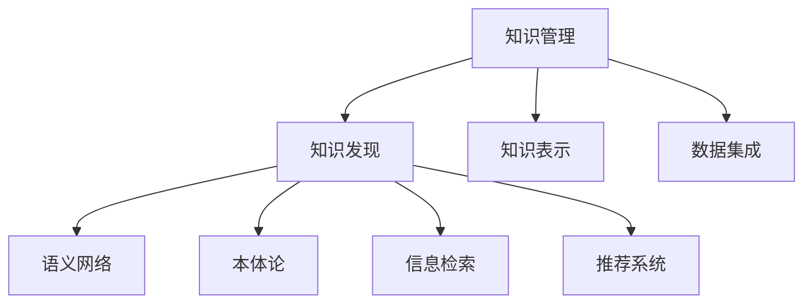

                 

# 知识管理技术：知识发现引擎的底层支撑

## 1. 背景介绍

### 1.1 问题由来
在数字化时代，知识管理成为了企业信息化的核心需求。随着数据量的爆炸性增长，企业越来越依赖于能够高效地发现、整合、应用知识的技术手段。知识发现引擎作为知识管理的核心组件，其性能和可靠性直接影响着企业业务决策的科学性和有效性。然而，现有的知识发现引擎在多源异构数据的融合、语义理解的准确性、知识的即时获取等方面仍存在诸多局限。

### 1.2 问题核心关键点
当前知识发现引擎面临的核心挑战包括：

1. 数据异构性：来自不同系统和应用的数据格式、结构各异，难以直接进行整合。
2. 语义理解：对结构化数据、半结构化数据以及非结构化数据进行准确语义理解，是知识发现引擎的核心难点。
3. 知识获取：如何快速、准确地从大规模数据中发现有用知识，是衡量知识发现引擎性能的重要指标。
4. 实时性：如何在数据变化时即时更新知识库，确保知识的时效性，也是知识发现引擎关注的重点。
5. 交互性：如何通过用户友好的界面和交互方式，提高知识发现的效率和用户体验。

### 1.3 问题研究意义
深入研究知识发现引擎的底层支撑技术，有助于构建高效、可靠、可扩展的知识管理平台，为企业的数字化转型和业务创新提供坚实的技术保障。通过优化知识发现引擎的技术架构，企业可以实现对知识的全面、精准管理，提升数据驱动决策的能力，助力企业的智能化发展。

## 2. 核心概念与联系

### 2.1 核心概念概述

为更好地理解知识发现引擎的底层支撑技术，本节将介绍几个密切相关的核心概念：

- 知识管理(Knowledge Management, KM)：一种企业信息化技术，旨在通过技术和制度手段，管理和应用企业内部和外部的知识资源，以支持企业的战略目标。
- 知识发现(Knowledge Discovery, KD)：从大规模数据中提取有用知识的过程，涉及数据挖掘、机器学习、语义分析等多个技术领域。
- 知识表示(Knowledge Representation, KR)：通过符号化、形式化等方式将知识编码成计算机可以处理的形式，以便于知识推理和应用。
- 语义网络(Semantic Network)：一种基于图结构的知识表示方法，通过节点和边的结构化方式，表达知识之间的语义关系。
- 本体论(Ontology)：一种形式化知识表示方式，用于定义和表示概念之间的关系，支持语义推理。
- 信息检索(Information Retrieval, IR)：通过计算机自动检索相关信息的技术，包括文档检索、图像检索、视频检索等。
- 推荐系统(Recommendation System)：根据用户的行为和偏好，推荐可能感兴趣的信息或商品的技术。

这些核心概念之间的逻辑关系可以通过以下Mermaid流程图来展示：



这个流程图展示出知识发现引擎的核心概念及其之间的关系：

1. 知识管理通过技术和制度手段管理知识资源。
2. 知识发现从大规模数据中提取知识，是知识管理的核心支撑。
3. 知识表示通过形式化方法，将知识编码为可处理的形式。
4. 语义网络利用图结构表达知识之间的语义关系。
5. 本体论定义概念关系，支持语义推理。
6. 信息检索技术用于自动检索相关信息。
7. 推荐系统根据用户行为，推荐感兴趣的信息或商品。
8. 数据集成将来自不同系统和应用的数据整合，为知识发现提供数据源。

这些概念共同构成了知识发现引擎的技术框架，使得企业能够高效地管理和应用知识资源。通过理解这些核心概念，我们可以更好地把握知识发现引擎的工作原理和优化方向。

## 3. 核心算法原理 & 具体操作步骤

### 3.1 算法原理概述

知识发现引擎的核心算法原理主要涉及以下几个方面：

1. 数据预处理：清洗、整合、归一化不同来源的数据，为后续分析和处理做准备。
2. 数据挖掘：应用统计学、机器学习等方法，从数据中挖掘有用知识。
3. 语义分析：通过自然语言处理技术，对文本数据进行语义理解和语义抽取。
4. 知识表示：将挖掘出的知识进行形式化表示，便于后续推理和应用。
5. 知识推理：通过逻辑推理、概率推理等技术，将知识表示转化为可应用的推理形式。
6. 推荐算法：基于用户行为数据，推荐可能感兴趣的信息或商品。

### 3.2 算法步骤详解

知识发现引擎的典型实现流程包括：

1. 数据采集：从各种数据源采集数据，包括数据库、文件、网络等。
2. 数据预处理：对数据进行清洗、整合、归一化等预处理操作。
3. 数据挖掘：应用统计学和机器学习算法，从数据中发现有用知识。
4. 知识表示：将挖掘出的知识进行形式化表示，如本体论表示、语义网络表示等。
5. 知识推理：通过推理引擎，将知识表示转化为可应用的推理形式。
6. 信息检索：根据用户查询，从知识库中检索相关信息。
7. 推荐系统：根据用户行为和偏好，推荐可能感兴趣的信息或商品。

### 3.3 算法优缺点

知识发现引擎具有以下优点：

1. 数据集成能力强：通过数据预处理技术，能够高效整合异构数据，为知识发现提供数据源。
2. 语义理解精确：应用自然语言处理技术，能够准确理解文本数据的语义。
3. 知识推理能力强：通过逻辑推理和概率推理，能够高效推理出知识间的逻辑关系。
4. 推荐效果显著：基于用户行为数据，推荐系统能够提供高度个性化的信息或商品。

但同时也存在一些局限：

1. 数据预处理成本高：数据清洗、整合等预处理操作复杂耗时，对系统性能影响较大。
2. 语义分析难度大：非结构化数据的语义理解仍存在较多困难，特别是复杂语义关系。
3. 知识表示复杂：形式化知识表示方法复杂，难以处理海量数据。
4. 实时性较差：知识库的更新和推理需要较长的时间，难以满足实时性要求。
5. 交互性不足：用户界面和交互方式单一，用户体验有待提升。

### 3.4 算法应用领域

知识发现引擎已在多个领域得到了广泛应用，例如：

1. 商业智能(Business Intelligence, BI)：通过知识发现引擎，企业能够从海量数据中提取商业洞察，制定更科学的决策。
2. 金融风险管理：应用知识发现技术，识别金融市场的风险因素，实现风险预警和控制。
3. 医疗诊断支持：通过知识发现和语义分析，辅助医生进行疾病诊断和治疗方案的制定。
4. 教育个性化推荐：利用用户行为数据，推荐个性化的学习资源，提升教育效果。
5. 工业制造优化：通过知识发现和推荐系统，优化生产流程，提高生产效率和质量。

除了上述这些经典应用外，知识发现引擎还在更多领域展现出了其强大的应用潜力，如城市管理、能源优化、物流调度等，为各行各业带来了智能化升级的可能性。

## 4. 数学模型和公式 & 详细讲解 & 举例说明

### 4.1 数学模型构建

知识发现引擎的数学模型构建主要涉及以下几个方面：

1. 数据矩阵：将数据表示为矩阵形式，便于应用机器学习算法进行挖掘。
2. 特征提取：从原始数据中提取有意义的特征，如词频、TF-IDF等。
3. 知识表示：通过形式化方法，如本体论、语义网络，将知识表示为图结构。
4. 推理逻辑：定义知识推理的逻辑规则，如因果关系、蕴含关系等。

### 4.2 公式推导过程

以下是知识发现引擎中常用的数学模型及其推导过程：

1. 数据矩阵构建：假设原始数据集为 $\mathcal{D}$，包含 $n$ 条数据 $d_1, d_2, ..., d_n$，每条数据包含 $m$ 个特征 $f_1, f_2, ..., f_m$，数据矩阵表示为 $X \in \mathbb{R}^{n \times m}$。

2. 特征提取：假设从原始数据中提取出 $k$ 个特征 $f_1, f_2, ..., f_k$，通过 $X_{\text{features}} \in \mathbb{R}^{n \times k}$ 表示。

3. 知识表示：假设知识表示为语义网络形式，知识图 $G=(V, E)$，其中 $V$ 为节点集，$E$ 为边集。每个节点表示一个概念或事实，边表示概念之间的关系。

4. 推理逻辑：假设定义了 $r$ 种推理规则 $R$，每种规则定义了知识推理的逻辑表达式。推理过程通过规则 $R$ 进行计算，得到推理结果 $Y \in \mathbb{R}^{1 \times m}$。

### 4.3 案例分析与讲解

以一个简单的知识发现案例为例，分析其数学模型构建和推导过程：

假设某电商平台希望通过知识发现引擎，从用户行为数据中发现商品推荐规则。首先，将用户行为数据表示为矩阵形式：

$$
X = \begin{bmatrix}
1 & 0 & 1 & 0 \\
0 & 1 & 1 & 1 \\
1 & 1 & 0 & 1 \\
0 & 0 & 0 & 1
\end{bmatrix}
$$

其中，每一行表示一个用户的行为，每一列表示一种商品特征。例如，第一行表示用户对商品A、商品C感兴趣，对商品B、商品D不感兴趣。

接下来，从原始数据中提取出商品名称、购买频率等特征：

$$
X_{\text{features}} = \begin{bmatrix}
1 & 0 & 1 & 0 \\
0 & 1 & 1 & 1 \\
1 & 1 & 0 & 1 \\
0 & 0 & 0 & 1
\end{bmatrix}
$$

其中，每一行表示一个用户的行为，每一列表示一种商品特征，如商品名称、购买频率等。

假设定义了如下推理规则：

1. 如果用户对商品A感兴趣，且购买频率高，则推荐商品C。
2. 如果用户对商品B感兴趣，且购买频率高，则推荐商品D。

推理过程如下：

1. 提取商品名称和购买频率特征。
2. 通过逻辑推理，判断用户对商品A和商品C的兴趣关系，生成推荐结果。
3. 通过逻辑推理，判断用户对商品B和商品D的兴趣关系，生成推荐结果。
4. 将推荐结果表示为矩阵形式，进行可视化展示。

通过以上案例分析，我们可以看到，知识发现引擎通过数据挖掘、特征提取、知识表示和推理逻辑等数学模型，从数据中提取有用知识，实现商品推荐等业务功能。

## 5. 项目实践：代码实例和详细解释说明

### 5.1 开发环境搭建

在进行知识发现引擎的开发实践前，我们需要准备好开发环境。以下是使用Python进行TensorFlow开发的环境配置流程：

1. 安装Anaconda：从官网下载并安装Anaconda，用于创建独立的Python环境。

2. 创建并激活虚拟环境：
```bash
conda create -n tf-env python=3.8 
conda activate tf-env
```

3. 安装TensorFlow：根据CUDA版本，从官网获取对应的安装命令。例如：
```bash
conda install tensorflow -c tf -c conda-forge
```

4. 安装各类工具包：
```bash
pip install numpy pandas scikit-learn matplotlib tqdm jupyter notebook ipython
```

完成上述步骤后，即可在`tf-env`环境中开始知识发现引擎的开发实践。

### 5.2 源代码详细实现

下面我以商品推荐系统为例，给出使用TensorFlow进行知识发现引擎开发的PyTorch代码实现。

首先，定义商品推荐的数据处理函数：

```python
import tensorflow as tf
import numpy as np

def load_data(file_path):
    with open(file_path, 'r') as f:
        data = [line.strip().split('\t') for line in f.readlines()]
    return np.array(data, dtype=np.float32)

# 商品推荐数据集
train_data = load_data('train_data.txt')
test_data = load_data('test_data.txt')
```

然后，定义模型和优化器：

```python
def build_model():
    input_layer = tf.keras.layers.Input(shape=(4,))
    dense_layer = tf.keras.layers.Dense(64, activation='relu')(input_layer)
    output_layer = tf.keras.layers.Dense(1, activation='sigmoid')(dense_layer)
    model = tf.keras.Model(inputs=input_layer, outputs=output_layer)
    return model

model = build_model()
optimizer = tf.keras.optimizers.Adam(learning_rate=0.01)
```

接着，定义训练和评估函数：

```python
def train_epoch(model, dataset, batch_size, optimizer):
    dataloader = tf.data.Dataset.from_tensor_slices(dataset)
    dataloader = dataloader.shuffle(buffer_size=10000).batch(batch_size)
    model.compile(optimizer=optimizer, loss='binary_crossentropy', metrics=['accuracy'])
    model.fit(dataloader, epochs=10)

def evaluate(model, dataset, batch_size):
    dataloader = tf.data.Dataset.from_tensor_slices(dataset)
    dataloader = dataloader.shuffle(buffer_size=10000).batch(batch_size)
    model.evaluate(dataloader)
```

最后，启动训练流程并在测试集上评估：

```python
epochs = 10
batch_size = 32

train_data = load_data('train_data.txt')
test_data = load_data('test_data.txt')

train_epoch(model, train_data, batch_size, optimizer)
evaluate(model, test_data, batch_size)
```

以上就是使用TensorFlow对商品推荐系统进行知识发现引擎开发的完整代码实现。可以看到，得益于TensorFlow的强大封装，我们可以用相对简洁的代码完成商品推荐系统的开发。

### 5.3 代码解读与分析

让我们再详细解读一下关键代码的实现细节：

**数据处理函数**：
- `load_data`方法：从文件中加载数据，并按行分割成列表，返回NumPy数组。
- `train_data`和`test_data`变量：存储训练集和测试集的数据。

**模型定义函数**：
- `build_model`方法：定义一个包含输入层、密集层和输出层的神经网络模型。
- `input_layer`和`dense_layer`变量：定义输入层和密集层。
- `output_layer`变量：定义输出层，使用sigmoid激活函数。
- `model`变量：构建并返回完整的神经网络模型。

**训练和评估函数**：
- `train_epoch`方法：定义训练过程，包括数据加载、模型编译、训练等步骤。
- `evaluate`方法：定义评估过程，包括数据加载和模型评估。

**训练流程**：
- `epochs`变量：设置训练的轮数。
- `batch_size`变量：设置每批次的数据大小。
- `train_data`和`test_data`变量：加载训练集和测试集的数据。
- `train_epoch`方法：对训练集进行训练。
- `evaluate`方法：对测试集进行评估。

可以看到，TensorFlow使得知识发现引擎的开发变得简洁高效。开发者可以将更多精力放在模型改进和算法优化上，而不必过多关注底层的实现细节。

当然，工业级的系统实现还需考虑更多因素，如模型的保存和部署、超参数的自动搜索、更灵活的接口设计等。但核心的知识发现引擎基本与此类似。

## 6. 实际应用场景

### 6.1 商业智能系统

知识发现引擎在商业智能系统中得到了广泛应用，帮助企业从海量数据中提取商业洞察，制定更科学的决策。

在实际应用中，知识发现引擎可以集成到BI系统中，通过自动化的数据挖掘和分析，生成商业报表和可视化图表，支持企业的高层决策。例如，某电商平台可以通过知识发现引擎，从用户行为数据中发现商品推荐规则，实现个性化推荐，提升用户满意度和销售额。

### 6.2 金融风险管理系统

金融领域的数据量庞大且复杂，知识发现引擎能够从大量金融数据中提取有用信息，识别风险因素，实现风险预警和控制。

例如，某银行可以通过知识发现引擎，从客户的交易数据、信用评分等数据中，发现潜在的欺诈行为，及时采取措施防范风险。此外，知识发现引擎还可以从新闻、社交媒体等非结构化数据中，获取市场舆情，辅助分析师进行投资决策。

### 6.3 医疗诊断支持系统

医疗领域的数据通常分散在不同的系统中，知识发现引擎能够整合这些数据，进行全面的分析和诊断。

例如，某医院可以通过知识发现引擎，从电子病历、实验室报告等数据中，发现疾病的早期预警信号，辅助医生进行诊断和治疗方案的制定。此外，知识发现引擎还可以从医学文献、临床试验等数据中，提取医疗知识，支持医生的临床决策。

### 6.4 教育个性化推荐系统

教育领域需要根据学生的行为数据，推荐个性化的学习资源，提升教育效果。

例如，某在线教育平台可以通过知识发现引擎，从学生的学习记录、课程评分等数据中，发现学习兴趣和难点，推荐相应的课程和学习材料。此外，知识发现引擎还可以从教育心理学数据中，提取学习行为模式，辅助教师进行教学设计和学生评估。

### 6.5 智慧城市管理系统

智慧城市管理需要从各种传感器、监控设备等数据中，发现城市运行中的问题，优化城市管理。

例如，某城市可以通过知识发现引擎，从交通监控、气象预报等数据中，发现交通拥堵、空气污染等城市问题，辅助城市规划和管理。此外，知识发现引擎还可以从社交媒体、新闻等数据中，获取市民的反馈和需求，优化城市服务。

## 7. 工具和资源推荐

### 7.1 学习资源推荐

为了帮助开发者系统掌握知识发现引擎的理论基础和实践技巧，这里推荐一些优质的学习资源：

1. 《机器学习实战》系列博文：由机器学习专家撰写，深入浅出地介绍了机器学习的基本原理和算法。
2. 《深度学习与Python编程》课程：由DeepLearning.ai开设的深度学习课程，涵盖深度学习的基本概念和应用。
3. 《TensorFlow官方文档》：TensorFlow的官方文档，提供了详细的API和使用指南，是学习TensorFlow的必备资料。
4. Kaggle竞赛平台：全球最大的数据科学竞赛平台，提供丰富的数据集和问题，供开发者学习和实践。
5. GitHub代码仓库：GitHub上的TensorFlow和机器学习项目，提供了大量的代码示例和实践经验，供开发者参考和学习。

通过对这些资源的学习实践，相信你一定能够快速掌握知识发现引擎的精髓，并用于解决实际的业务问题。

### 7.2 开发工具推荐

高效的开发离不开优秀的工具支持。以下是几款用于知识发现引擎开发的常用工具：

1. TensorFlow：由Google主导开发的开源深度学习框架，生产部署方便，适合大规模工程应用。
2. Scikit-learn：Python的机器学习库，提供了多种经典机器学习算法，易于使用和扩展。
3. Jupyter Notebook：开源的交互式计算环境，支持Python、R等多种语言，方便开发者进行数据分析和模型开发。
4. Apache Hadoop：开源的分布式计算框架，适用于大规模数据处理和存储。
5. Apache Spark：开源的大数据处理引擎，支持数据挖掘、机器学习等任务。

合理利用这些工具，可以显著提升知识发现引擎的开发效率，加快创新迭代的步伐。

### 7.3 相关论文推荐

知识发现引擎的研究源于学界的持续研究。以下是几篇奠基性的相关论文，推荐阅读：

1. Knowledge Discovery in Databases（KDD）：国际顶级会议，涵盖知识发现、数据挖掘等多个领域的前沿研究。
2. 《Knowledge Discovery and Data Mining》（KDD'99）：KDD会议的论文集，汇集了大量数据挖掘和知识发现的经典研究成果。
3. 《Practical Recommender Systems》：推荐系统领域的重要书籍，介绍了推荐系统的基本原理和算法。
4. 《Machine Learning: A Probabilistic Perspective》：机器学习领域的经典教材，涵盖统计学、概率学等多个主题。
5. 《Neural Network and Deep Learning》：深度学习领域的经典教材，介绍了深度学习的基本概念和应用。

这些论文代表了大数据挖掘和知识发现的最新进展，通过学习这些前沿成果，可以帮助研究者把握学科前进方向，激发更多的创新灵感。

## 8. 总结：未来发展趋势与挑战

### 8.1 总结

本文对知识发现引擎的底层支撑技术进行了全面系统的介绍。首先阐述了知识发现引擎的研究背景和意义，明确了其在数据驱动决策中的重要地位。其次，从原理到实践，详细讲解了知识发现引擎的核心算法和实现步骤，给出了知识发现引擎开发的完整代码实例。同时，本文还广泛探讨了知识发现引擎在商业智能、金融风险管理、医疗诊断支持等多个领域的应用前景，展示了其在提升企业智能化水平方面的巨大潜力。

通过本文的系统梳理，可以看到，知识发现引擎通过数据挖掘、语义分析、知识表示和推理逻辑等技术，从大规模数据中提取有用知识，支持企业的业务决策。未来，随着技术的不断进步和应用的广泛拓展，知识发现引擎必将成为企业智能化发展的核心引擎。

### 8.2 未来发展趋势

展望未来，知识发现引擎将呈现以下几个发展趋势：

1. 数据规模持续扩大：随着数字化进程的推进，企业的数据量将持续增长，知识发现引擎需要处理的海量数据将进一步增加。
2. 语义理解更加深入：自然语言处理技术将不断进步，知识发现引擎能够更准确地理解和处理非结构化数据。
3. 知识表示形式多样化：形式化知识表示方法将进一步丰富，本体论、语义网络等将发挥更大作用。
4. 推理逻辑更加复杂：知识发现引擎将更广泛地应用因果推断、概率推理等高级推理技术。
5. 推荐系统更加个性化：通过用户行为数据，推荐系统能够提供更加个性化和精准的推荐。
6. 实时性显著提升：通过分布式计算和大数据处理技术，知识发现引擎的实时处理能力将显著提升。
7. 交互方式更加多样：通过可视化界面和自然语言交互，知识发现引擎的用户界面将更加友好和智能化。

以上趋势凸显了知识发现引擎的广阔前景。这些方向的探索发展，必将进一步提升企业的智能化水平，为企业的数字化转型和业务创新提供更强的技术支撑。

### 8.3 面临的挑战

尽管知识发现引擎已经取得了显著进展，但在迈向更加智能化、普适化应用的过程中，仍面临诸多挑战：

1. 数据质量问题：数据源的多样性和异构性，使得数据质量难以保证，影响知识发现的准确性和可靠性。
2. 语义理解难度：非结构化数据的语义理解仍存在较大挑战，复杂语义关系的提取仍需进一步优化。
3. 知识表示复杂：形式化知识表示方法复杂，难以处理海量数据。
4. 推理逻辑复杂：高级推理技术的应用需要更强大的计算资源和算法优化。
5. 实时性不足：知识库的更新和推理需要较长的时间，难以满足实时性要求。
6. 交互方式单一：用户界面和交互方式仍需进一步优化，提升用户体验。

正视知识发现引擎面临的这些挑战，积极应对并寻求突破，将是大数据挖掘和知识发现技术走向成熟的必由之路。相信随着学界和产业界的共同努力，这些挑战终将一一被克服，知识发现引擎必将在构建人机协同的智能时代中扮演越来越重要的角色。

### 8.4 研究展望

面对知识发现引擎所面临的挑战，未来的研究需要在以下几个方面寻求新的突破：

1. 探索无监督和半监督学习方法：摆脱对大规模标注数据的依赖，利用自监督学习、主动学习等无监督和半监督范式，最大限度利用非结构化数据，实现更加灵活高效的微调。
2. 开发更加高效的推理算法：开发更高效的推理算法，如因果推断、概率推理等，提高知识推理的准确性和效率。
3. 引入更多先验知识：将符号化的先验知识，如知识图谱、逻辑规则等，与神经网络模型进行巧妙融合，引导知识发现过程学习更准确、合理的知识表示。
4. 结合因果分析和博弈论工具：将因果分析方法引入知识发现引擎，识别出知识发现的关键特征，增强知识推理的因果性和逻辑性。借助博弈论工具刻画人机交互过程，主动探索并规避知识发现的脆弱点，提高系统稳定性。
5. 纳入伦理道德约束：在知识发现引擎的设计和应用中，引入伦理导向的评估指标，过滤和惩罚有偏见、有害的输出倾向。同时加强人工干预和审核，建立知识发现的监管机制，确保知识发现的公正性和安全性。

这些研究方向的探索，必将引领知识发现引擎技术迈向更高的台阶，为构建安全、可靠、可解释、可控的智能系统铺平道路。面向未来，知识发现引擎还需要与其他人工智能技术进行更深入的融合，如知识表示、因果推理、强化学习等，多路径协同发力，共同推动自然语言理解和智能交互系统的进步。只有勇于创新、敢于突破，才能不断拓展知识发现引擎的边界，让智能技术更好地造福人类社会。

## 9. 附录：常见问题与解答

**Q1：知识发现引擎如何处理大规模数据？**

A: 知识发现引擎在处理大规模数据时，主要采用以下策略：

1. 分布式计算：通过Hadoop、Spark等分布式计算框架，将数据并行处理，提高计算效率。
2. 数据压缩：使用数据压缩技术，减小数据存储和传输的带宽。
3. 数据分片：将数据分割成多个片段，并行处理，减少计算时间。
4. 数据预处理：对数据进行清洗、整合、归一化等预处理操作，提高数据质量。
5. 数据缓存：使用数据缓存技术，减少数据的读取时间，提高系统性能。

**Q2：知识发现引擎如何提升实时性？**

A: 知识发现引擎在提升实时性时，主要采用以下策略：

1. 增量更新：在数据发生变化时，只更新变化部分，减少知识库的更新时间。
2. 实时流处理：使用Spark Streaming等实时流处理框架，对数据进行实时处理和分析。
3. 分布式存储：使用HBase、 Cassandra等分布式数据库，提高数据存储和读取效率。
4. 缓存技术：使用Redis等缓存技术，减少数据的读取时间，提高系统性能。
5. 异步处理：使用异步处理技术，提高系统的并行处理能力。

**Q3：知识发现引擎在数据预处理时需要注意哪些问题？**

A: 知识发现引擎在数据预处理时，需要注意以下问题：

1. 数据清洗：去除噪声、缺失值、异常值等数据噪声。
2. 数据归一化：将数据标准化，便于后续的计算和处理。
3. 数据分词：对文本数据进行分词处理，便于文本分析。
4. 数据编码：将数据编码成计算机可处理的形式，便于机器学习算法处理。
5. 数据标注：对数据进行标注，便于机器学习算法的训练。

**Q4：知识发现引擎在推理时需要注意哪些问题？**

A: 知识发现引擎在推理时，需要注意以下问题：

1. 推理逻辑：定义正确的推理逻辑，避免推理错误。
2. 推理效率：优化推理算法，提高推理效率。
3. 推理可解释性：提高推理结果的可解释性，便于用户理解和调试。
4. 推理精度：保证推理结果的精度，避免误导性输出。
5. 推理鲁棒性：增强推理系统的鲁棒性，避免对抗样本攻击。

**Q5：知识发现引擎在实际应用中需要注意哪些问题？**

A: 知识发现引擎在实际应用中，需要注意以下问题：

1. 数据安全：保护用户隐私和数据安全，避免数据泄露和滥用。
2. 系统稳定性：确保系统稳定运行，避免崩溃和故障。
3. 用户体验：优化用户界面和交互方式，提升用户体验。
4. 业务需求：根据业务需求，调整系统功能和性能，满足实际应用的需求。
5. 系统扩展：考虑系统的可扩展性，便于后续的升级和维护。

大语言模型微调技术虽然已经取得了显著进展，但在迈向更加智能化、普适化应用的过程中，仍面临诸多挑战。唯有在数据预处理、推理算法、系统架构等多个方面不断优化和创新，才能构建高效、可靠、可扩展的知识发现引擎，为企业的数字化转型和业务创新提供坚实的技术保障。

