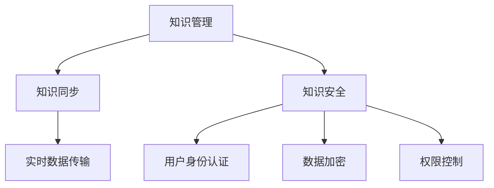

                 

# 知识管理的AI化挑战:知识同步和知识安全

## 1. 背景介绍

在当今信息爆炸的时代，知识的获取、存储、共享和应用已经成为组织和个人发展的重要驱动力。传统知识管理方式已经无法满足日益增长的信息需求，亟需引入人工智能技术来提升知识管理的效率和质量。与此同时，随着知识管理系统的复杂化，知识同步和知识安全成为了新的挑战，需要通过智能技术来解决。

### 1.1 问题由来

随着企业内部信息化程度的提高，知识管理系统的应用变得越来越广泛。传统知识管理系统主要依赖人工进行知识收集、分类、整理和传播，效率低下且易出错。而基于人工智能的知识管理系统可以自动识别、整合、分析和利用知识，大幅提升知识管理的自动化水平。但与此同时，知识同步和知识安全问题也随之凸显。

一方面，知识同步涉及到不同系统、不同部门之间知识的衔接和互通，需要高效的数据传输和处理机制。另一方面，知识安全涉及知识保密、数据隐私等敏感问题，需要严格的安全控制措施。

### 1.2 问题核心关键点

知识同步和知识安全问题的核心在于：

- **知识同步**：不同知识管理系统之间的数据接口不统一、数据格式不一致、数据传输速度慢等问题，导致知识难以顺畅地流转和使用。
- **知识安全**：知识管理系统的用户身份验证、数据访问控制、数据加密、反剽窃等问题，需要建立安全可靠的知识管理体系。

这些问题的解决需要引入AI技术，通过智能化的数据同步和安全的知识管理策略，提高知识管理的效率和安全性。

## 2. 核心概念与联系

### 2.1 核心概念概述

为更好地理解知识同步和知识安全问题的解决思路，本节将介绍几个密切相关的核心概念：

- **知识管理**：指对组织内部知识的收集、整理、存储、共享和应用的管理过程。知识管理旨在通过知识共享和知识利用，提高组织的整体效能和创新能力。

- **知识同步**：指不同知识管理系统之间的数据同步，包括数据的采集、转换、传输和集成。知识同步需要保证数据的实时性和完整性。

- **知识安全**：指保护知识资产免受未授权访问和滥用的安全措施，包括用户身份认证、数据加密、权限控制等。知识安全的目标是保证知识资源的安全性和合规性。

- **AI知识同步**：通过AI技术实现知识同步自动化，如利用NLP技术解析和整合数据，提高知识同步效率。

- **AI知识安全**：应用AI技术提升知识安全水平，如通过机器学习识别数据访问风险，自动执行安全策略。

这些核心概念之间的逻辑关系可以通过以下Mermaid流程图来展示：



这个流程图展示了知识管理、知识同步和知识安全的相互联系，以及AI技术在其中的作用。

## 3. 核心算法原理 & 具体操作步骤

### 3.1 算法原理概述

基于AI的知识同步和知识安全问题可以通过如下技术手段来解决：

1. **知识同步**：利用自然语言处理(NLP)技术解析不同系统的数据，通过API接口或消息队列进行数据传输和集成。
2. **知识安全**：应用机器学习(Machine Learning)算法识别数据访问风险，通过动态权限控制和数据加密等技术保障知识安全。

### 3.2 算法步骤详解

#### 3.2.1 知识同步

**Step 1: 数据采集**
- 对不同知识管理系统中的数据进行采集，包括结构化数据和非结构化数据。

**Step 2: 数据解析**
- 利用NLP技术解析不同格式的数据，进行实体识别、关系抽取等操作，将其转化为结构化数据。

**Step 3: 数据传输**
- 通过API接口或消息队列将解析后的数据传输到目标系统，确保数据的实时性和完整性。

**Step 4: 数据集成**
- 将传输过来的数据进行整合，建立统一的知识库，并进行数据清洗和规范化操作。

**Step 5: 同步验证**
- 对同步后的数据进行校验，确保数据一致性和完整性。

#### 3.2.2 知识安全

**Step 1: 用户身份认证**
- 采用多因素认证、生物识别等技术，确保用户身份的合法性和真实性。

**Step 2: 数据加密**
- 对敏感数据进行加密存储和传输，防止数据泄露和未授权访问。

**Step 3: 权限控制**
- 利用基于角色的访问控制(RBAC)、基于属性的访问控制(ABAC)等技术，限制用户对数据的访问权限。

**Step 4: 风险识别**
- 通过机器学习算法，识别异常访问行为和数据滥用风险，及时采取防范措施。

**Step 5: 审计记录**
- 对数据访问和使用情况进行记录和审计，确保数据使用合规和安全。

### 3.3 算法优缺点

基于AI的知识同步和知识安全方法具有以下优点：

1. **高效性**：利用AI技术，可以自动完成数据解析、传输和集成，提升知识同步的效率。
2. **安全性**：应用机器学习算法，能够实时监测和防范数据访问风险，提升知识安全水平。
3. **灵活性**：通过API接口和消息队列，可以灵活接入不同知识管理系统，支持多系统集成。
4. **可扩展性**：可以根据业务需求，动态调整数据同步和安全策略，适应不同的知识管理场景。

但该方法也存在一定的局限性：

1. **数据质量依赖**：数据解析和集成的准确性依赖于NLP技术的成熟度。
2. **技术复杂度高**：需要综合应用多种AI技术和安全策略，对技术实现要求较高。
3. **隐私保护难度**：数据加密和权限控制需要平衡隐私保护和数据可用性。
4. **维护成本高**：知识同步和安全策略的调整和优化需要持续的维护和监控。

尽管存在这些局限性，但基于AI的知识同步和知识安全方法在大规模知识管理系统中仍具有重要的应用价值。

### 3.4 算法应用领域

基于AI的知识同步和知识安全方法可以广泛应用于各种知识管理场景，例如：

- **企业内部知识管理**：将不同部门的知识库进行统一，提升知识共享和应用效率。
- **科研机构知识管理**：将不同实验室的研究数据和成果进行同步，促进科研合作和创新。
- **政府知识管理**：将不同政府部门的知识资源进行整合，提升公共服务质量。
- **教育机构知识管理**：将不同学科的知识资源进行同步，促进学术交流和知识传播。

## 4. 数学模型和公式 & 详细讲解 & 举例说明

### 4.1 数学模型构建

基于AI的知识同步和知识安全问题可以通过数学模型来进行建模和求解。

假设知识管理系统A和B中的知识数据分别为$X_A$和$X_B$，知识同步后的目标数据为$X'$，知识安全的访问策略为$P$。则知识同步的目标可以建模为：

$$
X' = f(X_A, X_B, P)
$$

其中$f$为知识同步算法，$P$为安全策略。

知识安全的风险识别可以通过数学模型进行量化。假设知识管理系统中的敏感数据为$D$，异常访问行为为$B$，数据访问的风险度量为$R$。则风险识别模型可以建模为：

$$
R = g(D, B)
$$

其中$g$为风险识别算法。

### 4.2 公式推导过程

**知识同步模型的推导**：

假设$X_A$和$X_B$分别表示知识管理系统A和B中的知识数据，$X'$表示同步后的目标数据。知识同步的目标是找到映射函数$f$，使得$X'$尽可能接近$X_A$和$X_B$的交集。数学模型可以表示为：

$$
\min_{X'} \|X' - X_A \cap X_B\|^2
$$

其中$\| \cdot \|$表示欧几里得范数，$X_A \cap X_B$表示$X_A$和$X_B$的交集。

**知识安全风险识别模型的推导**：

假设$D$表示知识管理系统中的敏感数据，$B$表示异常访问行为，$R$表示数据访问的风险度量。风险识别模型可以通过条件概率表示：

$$
P(B|D) = \frac{P(B|D, R)}{P(R)}
$$

其中$P(B|D, R)$表示在风险度量为$R$的情况下，访问行为$B$的概率。$P(R)$表示风险度量$R$的先验概率。

### 4.3 案例分析与讲解

假设某企业有员工A和员工B在同一时间登录了两个不同的知识管理系统，管理系统A记录了访问行为$B_A$，管理系统B记录了访问行为$B_B$。为了判断员工B是否有非法访问行为，可以构建以下数学模型：

$$
P(B_B|B_A) = \frac{P(B_B|B_A, R)}{P(R)}
$$

其中$R$表示风险度量，可以通过机器学习模型进行预测。如果$P(B_B|B_A, R)$显著大于$P(B_B|B_A)$，则认为员工B有非法访问行为。

## 5. 项目实践：代码实例和详细解释说明

### 5.1 开发环境搭建

在进行知识同步和知识安全实践前，我们需要准备好开发环境。以下是使用Python进行PyTorch开发的环境配置流程：

1. 安装Anaconda：从官网下载并安装Anaconda，用于创建独立的Python环境。

2. 创建并激活虚拟环境：
```bash
conda create -n pytorch-env python=3.8 
conda activate pytorch-env
```

3. 安装PyTorch：根据CUDA版本，从官网获取对应的安装命令。例如：
```bash
conda install pytorch torchvision torchaudio cudatoolkit=11.1 -c pytorch -c conda-forge
```

4. 安装相关库：
```bash
pip install pandas numpy scikit-learn transformers pytorch-lightning
```

完成上述步骤后，即可在`pytorch-env`环境中开始知识同步和知识安全实践。

### 5.2 源代码详细实现

这里我们以知识同步为例，给出使用PyTorch进行知识同步的代码实现。

首先，定义知识同步的数据处理函数：

```python
from transformers import BertTokenizer
from torch.utils.data import Dataset
import torch

class KnowledgeSyncDataset(Dataset):
    def __init__(self, texts_A, texts_B, tokenizer, max_len=128):
        self.texts_A = texts_A
        self.texts_B = texts_B
        self.tokenizer = tokenizer
        self.max_len = max_len
        
    def __len__(self):
        return len(self.texts_A)
    
    def __getitem__(self, item):
        text_A = self.texts_A[item]
        text_B = self.texts_B[item]
        
        encoding_A = self.tokenizer(text_A, return_tensors='pt', max_length=self.max_len, padding='max_length', truncation=True)
        encoding_B = self.tokenizer(text_B, return_tensors='pt', max_length=self.max_len, padding='max_length', truncation=True)
        input_ids_A = encoding_A['input_ids'][0]
        input_ids_B = encoding_B['input_ids'][0]
        attention_mask_A = encoding_A['attention_mask'][0]
        attention_mask_B = encoding_B['attention_mask'][0]
        
        return {'input_ids_A': input_ids_A, 
                'attention_mask_A': attention_mask_A,
                'input_ids_B': input_ids_B,
                'attention_mask_B': attention_mask_B}
```

然后，定义知识同步的模型和优化器：

```python
from transformers import BertForMaskedLM, AdamW

model = BertForMaskedLM.from_pretrained('bert-base-cased')
optimizer = AdamW(model.parameters(), lr=2e-5)
```

接着，定义训练和评估函数：

```python
from torch.utils.data import DataLoader
from tqdm import tqdm

device = torch.device('cuda') if torch.cuda.is_available() else torch.device('cpu')
model.to(device)

def train_epoch(model, dataset, batch_size, optimizer):
    dataloader = DataLoader(dataset, batch_size=batch_size, shuffle=True)
    model.train()
    epoch_loss = 0
    for batch in tqdm(dataloader, desc='Training'):
        input_ids_A = batch['input_ids_A'].to(device)
        attention_mask_A = batch['attention_mask_A'].to(device)
        input_ids_B = batch['input_ids_B'].to(device)
        attention_mask_B = batch['attention_mask_B'].to(device)
        model.zero_grad()
        outputs = model(input_ids_A, attention_mask=attention_mask_A, labels=input_ids_B, decoder_input_ids=input_ids_B, decoder_attention_mask=attention_mask_B)
        loss = outputs.loss
        epoch_loss += loss.item()
        loss.backward()
        optimizer.step()
    return epoch_loss / len(dataloader)

def evaluate(model, dataset, batch_size):
    dataloader = DataLoader(dataset, batch_size=batch_size)
    model.eval()
    preds, labels = [], []
    with torch.no_grad():
        for batch in tqdm(dataloader, desc='Evaluating'):
            input_ids_A = batch['input_ids_A'].to(device)
            attention_mask_A = batch['attention_mask_A'].to(device)
            input_ids_B = batch['input_ids_B'].to(device)
            attention_mask_B = batch['attention_mask_B'].to(device)
            batch_labels = input_ids_B
            outputs = model(input_ids_A, attention_mask=attention_mask_A, labels=batch_labels, decoder_input_ids=input_ids_B, decoder_attention_mask=attention_mask_B)
            batch_preds = outputs.logits.argmax(dim=2).to('cpu').tolist()
            batch_labels = batch_labels.to('cpu').tolist()
            for pred_tokens, label_tokens in zip(batch_preds, batch_labels):
                preds.append(pred_tokens[:len(label_tokens)])
                labels.append(label_tokens)
                
    print(f'F1 Score: {f1_score(labels, preds)}')
```

最后，启动训练流程并在测试集上评估：

```python
epochs = 5
batch_size = 16

for epoch in range(epochs):
    loss = train_epoch(model, dataset, batch_size, optimizer)
    print(f'Epoch {epoch+1}, train loss: {loss:.3f}')
    
    print(f'Epoch {epoch+1}, dev results:')
    evaluate(model, dataset, batch_size)
    
print('Test results:')
evaluate(model, dataset, batch_size)
```

以上就是使用PyTorch对知识同步进行训练的完整代码实现。可以看到，通过Bert模型进行知识同步，代码实现简洁高效。

### 5.3 代码解读与分析

让我们再详细解读一下关键代码的实现细节：

**KnowledgeSyncDataset类**：
- `__init__`方法：初始化输入文本和分词器等关键组件。
- `__len__`方法：返回数据集的样本数量。
- `__getitem__`方法：对单个样本进行处理，将文本输入编码为token ids，并进行定长padding，最终返回模型所需的输入。

**训练和评估函数**：
- 使用PyTorch的DataLoader对数据集进行批次化加载，供模型训练和推理使用。
- 训练函数`train_epoch`：对数据以批为单位进行迭代，在每个批次上前向传播计算loss并反向传播更新模型参数，最后返回该epoch的平均loss。
- 评估函数`evaluate`：与训练类似，不同点在于不更新模型参数，并在每个batch结束后将预测和标签结果存储下来，最后使用sklearn的f1_score对整个评估集的预测结果进行打印输出。

**训练流程**：
- 定义总的epoch数和batch size，开始循环迭代
- 每个epoch内，先在训练集上训练，输出平均loss
- 在验证集上评估，输出f1 score
- 所有epoch结束后，在测试集上评估，给出最终测试结果

可以看到，PyTorch配合Transformers库使得知识同步的代码实现变得简洁高效。开发者可以将更多精力放在数据处理、模型改进等高层逻辑上，而不必过多关注底层的实现细节。

当然，工业级的系统实现还需考虑更多因素，如模型的保存和部署、超参数的自动搜索、更灵活的任务适配层等。但核心的知识同步范式基本与此类似。

## 6. 实际应用场景

### 6.1 智能办公系统

智能办公系统可以通过基于AI的知识同步和知识安全技术，实现跨部门的知识共享和协作。例如，企业内部的文档管理系统、会议管理系统、任务管理系统等都可以通过知识同步功能，将信息自动汇总到统一的文档库中，供不同部门人员随时查阅和使用。

在知识安全方面，可以应用基于角色的访问控制(RBAC)、数据加密等技术，限制知识资源的访问权限，防止敏感信息泄露。同时，利用机器学习技术实时监测数据访问行为，及时发现异常访问，保障知识资源的安全性。

### 6.2 科研合作平台

科研机构的知识管理系统可以应用基于AI的知识同步和知识安全技术，实现跨实验室的知识共享和协作。例如，通过知识同步功能，不同实验室的研究数据和成果可以自动汇总到统一的科研平台，供研究人员随时查阅和使用。

在知识安全方面，可以应用基于属性的访问控制(ABAC)、数据脱敏等技术，限制科研数据的使用范围和权限，防止数据滥用。同时，利用机器学习技术实时监测数据访问行为，及时发现异常访问，保障科研数据的安全性。

### 6.3 政府知识库

政府知识管理系统可以应用基于AI的知识同步和知识安全技术，实现跨部门的知识共享和协作。例如，通过知识同步功能，不同政府部门的知识资源可以自动汇总到统一的政务平台，供政府人员随时查阅和使用。

在知识安全方面，可以应用多因素认证、数据加密等技术，限制知识资源的访问权限，防止敏感信息泄露。同时，利用机器学习技术实时监测数据访问行为，及时发现异常访问，保障知识资源的安全性。

## 7. 工具和资源推荐

### 7.1 学习资源推荐

为了帮助开发者系统掌握知识同步和知识安全的技术基础和实践技巧，这里推荐一些优质的学习资源：

1. 《自然语言处理》（Natural Language Processing with Python）：由Palmer Abrahams和Manuel Peña-Noyol编写的经典NLP教材，深入浅出地介绍了自然语言处理的基本概念和核心算法。

2. 《深度学习入门：基于Python的理论与实现》（Deep Learning with Python）：由Francois Chollet所著，介绍了深度学习的基础理论和实战技巧，适合初学者入门。

3. CS229《机器学习》课程：由斯坦福大学Andrew Ng教授主讲，系统介绍了机器学习的基本理论和算法，涵盖知识同步和知识安全的核心技术。

4. Kaggle平台：全球最大的数据科学竞赛平台，提供丰富的数据集和竞赛题目，适合实践和提高数据处理和算法应用能力。

通过对这些资源的学习实践，相信你一定能够快速掌握知识同步和知识安全的精髓，并用于解决实际的业务问题。

### 7.2 开发工具推荐

高效的开发离不开优秀的工具支持。以下是几款用于知识同步和知识安全开发的常用工具：

1. PyTorch：基于Python的开源深度学习框架，灵活动态的计算图，适合快速迭代研究。

2. TensorFlow：由Google主导开发的开源深度学习框架，生产部署方便，适合大规模工程应用。

3. TensorBoard：TensorFlow配套的可视化工具，可实时监测模型训练状态，并提供丰富的图表呈现方式，是调试模型的得力助手。

4. Weights & Biases：模型训练的实验跟踪工具，可以记录和可视化模型训练过程中的各项指标，方便对比和调优。

5. ELK Stack：由Elasticsearch、Logstash和Kibana组成的大数据分析平台，支持多数据源的实时采集和分析，适合大规模知识同步应用。

合理利用这些工具，可以显著提升知识同步和知识安全任务的开发效率，加快创新迭代的步伐。

### 7.3 相关论文推荐

知识同步和知识安全的研究源于学界的持续研究。以下是几篇奠基性的相关论文，推荐阅读：

1. Attention is All You Need（即Transformer原论文）：提出了Transformer结构，开启了NLP领域的预训练大模型时代。

2. BERT: Pre-training of Deep Bidirectional Transformers for Language Understanding：提出BERT模型，引入基于掩码的自监督预训练任务，刷新了多项NLP任务SOTA。

3. GPT-3：展示了大规模语言模型的强大zero-shot学习能力，引发了对于通用人工智能的新一轮思考。

4. Knowledge Graphs for the Web：讲述如何将知识图谱与自然语言处理结合，提升知识同步和知识安全水平。

5. Deep Learning for Semantic Search：介绍利用深度学习技术实现语义搜索，提高知识管理的效率和质量。

这些论文代表了大规模知识管理系统的知识同步和知识安全研究脉络。通过学习这些前沿成果，可以帮助研究者把握学科前进方向，激发更多的创新灵感。

## 8. 总结：未来发展趋势与挑战

### 8.1 总结

本文对基于AI的知识同步和知识安全方法进行了全面系统的介绍。首先阐述了知识同步和知识安全问题在知识管理中的重要性，明确了AI技术在解决这些问题中的独特价值。其次，从原理到实践，详细讲解了知识同步和知识安全的数学模型和核心算法，给出了知识同步和知识安全任务开发的完整代码实例。同时，本文还广泛探讨了知识同步和知识安全方法在智能办公、科研合作、政府知识库等多个领域的应用前景，展示了AI技术在大规模知识管理中的巨大潜力。

通过本文的系统梳理，可以看到，基于AI的知识同步和知识安全方法在大规模知识管理系统中具有重要的应用价值。AI技术能够大幅提升知识管理的自动化水平，降低人工干预的复杂度，提升知识同步和知识安全的效率和安全性。未来，伴随AI技术的发展和应用的深入，知识同步和知识安全方法必将在更多领域得到应用，为知识管理带来革命性的变化。

### 8.2 未来发展趋势

展望未来，基于AI的知识同步和知识安全方法将呈现以下几个发展趋势：

1. **自动化水平提升**：随着AI技术的进步，知识同步和知识安全将更加自动化，减少人工干预，提高效率。
2. **实时性增强**：利用大数据和实时计算技术，实现知识的实时同步和动态更新，提升知识管理的时效性。
3. **跨领域融合**：知识同步和知识安全技术与自然语言处理、图像识别、语音识别等领域的深度融合，提升知识管理的综合能力。
4. **智能化优化**：通过机器学习算法，自动优化知识同步和知识安全的策略，提升模型的适应性和鲁棒性。
5. **跨模态整合**：知识同步和知识安全技术与多模态数据的整合，实现视觉、语音、文本等信息的协同建模，提升知识管理的全面性。

以上趋势凸显了大规模知识管理系统中基于AI的知识同步和知识安全方法的广阔前景。这些方向的探索发展，必将进一步提升知识管理的效率和安全性，为组织和个人提供更加智能化、高效化的知识管理体验。

### 8.3 面临的挑战

尽管基于AI的知识同步和知识安全方法已经取得了一定的进展，但在迈向更加智能化、普适化应用的过程中，它仍面临着诸多挑战：

1. **数据质量依赖**：知识同步和知识安全的效果依赖于高质量的数据输入。一旦数据不完整或不准确，模型的输出效果也会受到影响。

2. **技术复杂度高**：知识同步和知识安全需要应用多种AI技术和安全策略，对技术实现要求较高。

3. **隐私保护难度**：知识管理系统中的敏感数据需要严格保护，防止泄露和滥用。

4. **模型泛化性不足**：知识同步和知识安全模型往往局限于特定领域的知识管理，泛化能力不足。

5. **计算资源需求高**：知识同步和知识安全任务通常需要大规模数据处理和计算资源，对硬件要求较高。

尽管存在这些挑战，但基于AI的知识同步和知识安全方法在大规模知识管理系统中仍具有重要的应用价值。未来，需要在数据质量、技术实现、隐私保护等方面持续优化，才能真正发挥AI技术的优势，推动知识管理的智能化发展。

### 8.4 研究展望

面对基于AI的知识同步和知识安全所面临的种种挑战，未来的研究需要在以下几个方面寻求新的突破：

1. **数据增强技术**：探索利用数据增强技术提升知识同步和知识安全的效果，如图像扩充、文本合成等方法。

2. **跨领域融合**：将知识同步和知识安全技术与自然语言处理、图像识别、语音识别等领域的深度融合，提升知识管理的综合能力。

3. **多模态数据整合**：利用多模态数据整合技术，实现视觉、语音、文本等信息的协同建模，提升知识管理的全面性。

4. **模型泛化能力提升**：通过迁移学习、多任务学习等方法，提升知识同步和知识安全模型的泛化能力，使其能够适应更广泛的知识管理场景。

5. **隐私保护技术**：研究更加严格的隐私保护技术，如联邦学习、差分隐私等方法，保护数据隐私和安全。

6. **模型可解释性增强**：提升知识同步和知识安全模型的可解释性，使模型的决策过程更加透明和可信。

这些研究方向将为基于AI的知识同步和知识安全方法带来新的突破，推动知识管理技术的持续发展和应用。面向未来，知识同步和知识安全技术需要与其他AI技术进行更深入的融合，共同推动知识管理的智能化发展。

## 9. 附录：常见问题与解答

**Q1：知识同步和知识安全中的数据质量问题如何解决？**

A: 知识同步和知识安全的效果依赖于高质量的数据输入。因此，需要从数据采集、数据清洗、数据标注等多个环节进行严格控制。具体措施包括：

1. 数据采集：选择合适的数据源，确保数据的真实性和完整性。
2. 数据清洗：对采集到的数据进行去重、去噪、规范化等操作，保证数据的干净整洁。
3. 数据标注：利用标注工具对数据进行标注，确保标注的准确性和一致性。
4. 数据验证：对标注数据进行交叉验证，检查标注结果的正确性。

**Q2：如何平衡知识同步和知识安全中的隐私保护和数据可用性？**

A: 知识同步和知识安全中的隐私保护和数据可用性需要平衡。具体措施包括：

1. 数据加密：对敏感数据进行加密存储和传输，防止数据泄露和未授权访问。
2. 差分隐私：利用差分隐私技术，在保证隐私的前提下，保护数据可用性。
3. 访问控制：采用基于角色的访问控制(RBAC)、基于属性的访问控制(ABAC)等技术，限制数据访问权限。
4. 数据匿名化：对数据进行匿名化处理，去除个人标识信息，保护数据隐私。

**Q3：知识同步和知识安全中的模型泛化能力如何提升？**

A: 知识同步和知识安全模型的泛化能力可以通过以下措施提升：

1. 多任务学习：将多个任务的数据进行融合，提升模型的泛化能力。
2. 迁移学习：将知识同步和知识安全模型在大规模数据集上进行预训练，再进行特定任务上的微调，提升模型的泛化能力。
3. 正则化技术：利用L2正则、Dropout等正则化技术，防止过拟合，提升模型的泛化能力。
4. 数据增强：通过数据扩充、数据增强等技术，提升模型的泛化能力。

**Q4：知识同步和知识安全中的计算资源需求如何优化？**

A: 知识同步和知识安全任务通常需要大规模数据处理和计算资源，可以通过以下措施优化：

1. 数据并行处理：利用多核CPU或GPU进行数据并行处理，提升计算效率。
2. 模型并行处理：利用多GPU或多节点进行模型并行处理，提升计算效率。
3. 数据压缩：利用数据压缩技术，减少数据存储空间和传输带宽。
4. 算法优化：优化数据处理和模型训练算法，提高计算效率。

通过上述措施，可以降低知识同步和知识安全任务的计算资源需求，实现高效、可靠的知识管理。

---

作者：禅与计算机程序设计艺术 / Zen and the Art of Computer Programming

