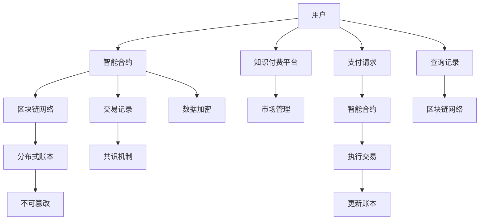

                 

# 知识经济下知识付费的区块链去中心化应用

> 关键词：知识经济,知识付费,区块链,去中心化应用,分布式账本,智能合约,隐私保护,加密算法,去中心化市场

## 1. 背景介绍

### 1.1 问题由来
随着知识经济的兴起，越来越多的人开始重视个人知识和经验的价值。传统的知识传播方式如书籍、博客等，已经不能满足用户快速获取专业知识的需要。在线教育、网络课程、知识付费等新兴模式应运而生，知识付费市场日益壮大。

然而，知识付费行业存在诸多问题：
- 信息不对称：用户无法确认内容质量，付费后可能遭遇欺诈。
- 信任危机：平台和卖家之间缺乏有效的信任机制。
- 版权问题：内容盗版、侵权现象严重，平台难以维权。
- 支付风险：在线支付渠道易受攻击，支付安全难以保障。

这些问题不仅损害了用户的利益，也阻碍了知识付费市场的发展。如何构建一个去中心化的、安全的、可信的知识付费生态系统，成为亟待解决的问题。

## 2. 核心概念与联系

### 2.1 核心概念概述

为更好地理解区块链去中心化知识付费系统，本节将介绍几个核心概念：

- 区块链(Blockchain)：一种去中心化的分布式账本技术，通过去中心化的网络节点共识，确保数据的不可篡改性和透明性。
- 分布式账本(Distributed Ledger)：区块链的核心组件，记录了所有交易和状态变化的历史记录，具有不可篡改性。
- 智能合约(Smart Contract)：一种在区块链上自动执行的合约，当满足特定条件时自动执行预设的代码，实现自动化和去中心化。
- 加密算法(Cryptography)：用于保证数据传输和存储的安全性，如公钥加密、哈希算法等。
- 去中心化市场(Decentralized Marketplace)：一种基于区块链的去中心化市场，减少了中间环节，提高了交易效率和透明度。
- 隐私保护(Privacy Protection)：保护用户隐私和数据安全，防止个人信息泄露。

这些核心概念通过区块链技术实现了去中心化的信任机制，为知识付费系统的安全和可信提供了技术保障。

### 2.2 核心概念原理和架构的 Mermaid 流程图(Mermaid 流程节点中不要有括号、逗号等特殊字符)



这个流程图展示了大语言模型微调的核心概念及其之间的关系：

1. 用户通过智能合约与知识付费平台交互，完成知识付费。
2. 交易记录存储在区块链网络上，保证不可篡改性。
3. 支付请求通过智能合约自动执行，减少中间环节。
4. 数据加密保护用户隐私和交易安全。
5. 分布式账本提供去中心化的信任机制，确保数据透明性。
6. 共识机制保障网络节点间的共识一致性，维护系统稳定。

这些概念共同构成了知识付费系统的核心技术框架，实现了去中心化的信任机制和高效的交易处理能力。

## 3. 核心算法原理 & 具体操作步骤

### 3.1 算法原理概述

知识付费的区块链去中心化系统通过智能合约和区块链技术，实现去中心化的信任机制和高效的交易处理。其核心算法原理如下：

1. 智能合约：在区块链上自动执行的合约，当满足预设条件时自动执行，实现去中心化的自动化和信任机制。
2. 分布式账本：通过区块链技术实现去中心化的分布式账本，记录所有交易和状态变化，确保数据的不可篡改性和透明性。
3. 加密算法：采用公钥加密、哈希算法等技术，保障数据传输和存储的安全性。
4. 共识机制：通过共识机制保障网络节点间的共识一致性，维护系统稳定。

### 3.2 算法步骤详解

以下是区块链去中心化知识付费系统的核心算法步骤：

**Step 1: 用户注册与身份验证**
- 用户创建区块链账户，并上传身份证明。
- 系统验证身份，生成公钥和私钥，用于加密和签名。
- 将用户信息记录在分布式账本上，完成身份认证。

**Step 2: 内容发布与审核**
- 知识付费平台发布内容，并附上价格和描述。
- 平台管理员审核内容，确保其真实性和质量。
- 通过智能合约设置内容的锁定时间、发布条件等。

**Step 3: 购买与支付**
- 用户浏览内容，选择购买。
- 支付系统调用智能合约，创建支付订单。
- 支付订单通过公钥加密，发送给内容提供者。
- 内容提供者验证支付订单，确认交易。

**Step 4: 交易记录与智能合约执行**
- 交易信息记录在分布式账本上，实现不可篡改性。
- 智能合约自动执行交易，解锁内容，并将内容交付给用户。
- 交易完成，平台和内容提供者分别获得报酬。

**Step 5: 数据隐私保护**
- 智能合约采用零知识证明技术，保护用户隐私。
- 交易记录和内容信息采用加密算法保护，防止信息泄露。
- 用户可以访问区块链记录，验证交易过程和结果。

**Step 6: 平台与用户信任机制**
- 平台管理员定期审查智能合约，确保其正常执行。
- 用户可以对交易进行评分，评价内容质量，影响平台的信誉。
- 系统通过智能合约自动执行评分规则，维护公平公正。

### 3.3 算法优缺点

基于区块链的知识付费去中心化系统具有以下优点：
1. 去中心化信任：通过区块链技术实现去中心化的信任机制，避免了中间环节的信任问题。
2. 透明性：所有交易和状态变化记录在区块链上，保证了数据的透明性和不可篡改性。
3. 安全性：采用加密算法和智能合约，保障了支付和交易的安全性。
4. 自动化：智能合约自动执行交易，提高了交易效率和便利性。

但同时，也存在一些局限性：
1. 技术门槛高：需要用户和平台具备一定的区块链技术知识。
2. 手续费高：区块链交易的手续费可能较高，增加了平台的运营成本。
3. 可扩展性差：目前区块链的扩展能力有限，难以处理大规模交易。
4. 隐私问题：虽然采用了加密算法和零知识证明，但用户的隐私仍面临一定风险。

### 3.4 算法应用领域

基于区块链的知识付费去中心化系统，可以广泛应用于以下领域：

1. 在线教育：通过区块链实现课程的发布、购买和交付，保障课程的版权和支付安全。
2. 专业培训：利用区块链进行证书颁发和管理，确保培训内容的质量和真实性。
3. 医疗健康：提供健康知识和在线咨询服务，保障信息的安全和隐私。
4. 法律咨询：提供法律知识和咨询服务，保护用户隐私和权益。
5. 投资理财：提供金融知识和理财服务，保障交易的透明和公正。

此外，在科研、农业、艺术等多个领域，区块链去中心化知识付费系统也有广泛的应用前景。

## 4. 数学模型和公式 & 详细讲解 & 举例说明（备注：数学公式请使用latex格式，latex嵌入文中独立段落使用 $$，段落内使用 $)
### 4.1 数学模型构建

本节将使用数学语言对区块链去中心化知识付费系统的核心算法进行更加严格的刻画。

假设知识付费平台的智能合约为 $M_{\theta}:\mathcal{X} \rightarrow \mathcal{Y}$，其中 $\mathcal{X}$ 为输入空间，$\mathcal{Y}$ 为输出空间，$\theta$ 为模型参数。

定义智能合约在输入 $x$ 上的输出为 $\hat{y}=M_{\theta}(x) \in [0,1]$，表示支付订单是否成功。用户支付订单的价格为 $p$，锁定时间为 $t$，内容提供者的报酬为 $c$。交易成功的条件为：
$$
\hat{y} = \begin{cases}
1, & \text{if } x=\text{支付成功} \\
0, & \text{if } x=\text{支付失败}
\end{cases}
$$

则支付订单的损失函数为：
$$
\ell(M_{\theta}(x),y) = \begin{cases}
\max(0, y - \hat{y}), & \text{if } x=\text{支付成功} \\
0, & \text{if } x=\text{支付失败}
\end{cases}
$$

通过梯度下降等优化算法，智能合约不断更新模型参数 $\theta$，最小化损失函数，使得模型输出逼近真实标签。

### 4.2 公式推导过程

以下我们以二分类任务为例，推导智能合约的损失函数及其梯度的计算公式。

假设智能合约在输入 $x$ 上的输出为 $\hat{y}=M_{\theta}(x) \in [0,1]$，真实标签 $y \in \{0,1\}$。则二分类交叉熵损失函数定义为：
$$
\ell(M_{\theta}(x),y) = -[y\log \hat{y} + (1-y)\log (1-\hat{y})]
$$

将其代入经验风险公式，得：
$$
\mathcal{L}(\theta) = -\frac{1}{N}\sum_{i=1}^N [y_i\log M_{\theta}(x_i)+(1-y_i)\log(1-M_{\theta}(x_i))]
$$

根据链式法则，损失函数对参数 $\theta_k$ 的梯度为：
$$
\frac{\partial \mathcal{L}(\theta)}{\partial \theta_k} = -\frac{1}{N}\sum_{i=1}^N (\frac{y_i}{M_{\theta}(x_i)}-\frac{1-y_i}{1-M_{\theta}(x_i)}) \frac{\partial M_{\theta}(x_i)}{\partial \theta_k}
$$

其中 $\frac{\partial M_{\theta}(x_i)}{\partial \theta_k}$ 可进一步递归展开，利用自动微分技术完成计算。

在得到损失函数的梯度后，即可带入参数更新公式，完成智能合约的迭代优化。重复上述过程直至收敛，最终得到适应支付订单的最优模型参数 $\theta^*$。

### 4.3 案例分析与讲解

以在线教育平台为例，分析基于区块链的课程付费流程。

**Step 1: 用户注册与身份验证**
- 用户创建区块链账户，并上传身份证明。
- 系统验证身份，生成公钥和私钥，用于加密和签名。
- 将用户信息记录在分布式账本上，完成身份认证。

**Step 2: 课程发布与审核**
- 平台管理员发布课程，并附上价格和描述。
- 平台管理员审核课程，确保其真实性和质量。
- 通过智能合约设置课程的锁定时间、发布条件等。

**Step 3: 课程购买与支付**
- 用户浏览课程，选择购买。
- 支付系统调用智能合约，创建支付订单。
- 支付订单通过公钥加密，发送给课程提供者。
- 课程提供者验证支付订单，确认交易。

**Step 4: 交易记录与智能合约执行**
- 交易信息记录在分布式账本上，实现不可篡改性。
- 智能合约自动执行交易，解锁课程，并将课程交付给用户。
- 交易完成，平台和课程提供者分别获得报酬。

**Step 5: 数据隐私保护**
- 智能合约采用零知识证明技术，保护用户隐私。
- 交易记录和课程信息采用加密算法保护，防止信息泄露。
- 用户可以访问区块链记录，验证交易过程和结果。

通过以上分析，可以看出，基于区块链的知识付费系统，通过智能合约和区块链技术，实现了去中心化的信任机制和高效的交易处理。

## 5. 项目实践：代码实例和详细解释说明
### 5.1 开发环境搭建

在进行区块链知识付费系统开发前，我们需要准备好开发环境。以下是使用Python进行以太坊智能合约开发的Environment配置流程：

1. 安装Solidity开发工具：从官网下载并安装Solidity IDE，用于编写智能合约代码。

2. 创建并激活虚拟环境：
```bash
conda create -n solwit-env python=3.8 
conda activate solwit-env
```

3. 安装以太坊开发工具：
```bash
pip install web3 solc-bin eth-keys eth-client
```

4. 安装以太坊钱包：
```bash
pip install eth-address
```

完成上述步骤后，即可在`solwit-env`环境中开始智能合约开发。

### 5.2 源代码详细实现

下面我们以课程付费智能合约为例，给出使用Solidity编写以太坊智能合约的代码实现。

```solidity
pragma solidity ^0.8.0;

contract CoursePay {

    address public courseOwner;
    uint256 public coursePrice;
    uint256 public courseDuration;
    bool public isPublished;
    
    address payable public payee;

    event PaymentReceived(address indexed receiver, uint256 indexed value);

    constructor(address _owner, uint256 _coursePrice, uint256 _courseDuration, address payable _payee) {
        courseOwner = _owner;
        coursePrice = _coursePrice;
        courseDuration = _courseDuration;
        payee = _payee;
    }

    function publishCourse() public onlyOwner {
        isPublished = true;
    }

    function setCoursePrice(uint256 _coursePrice) public onlyOwner {
        coursePrice = _coursePrice;
    }

    function setCourseDuration(uint256 _courseDuration) public onlyOwner {
        courseDuration = _courseDuration;
    }

    function payCourse() public payable {
        require(msg.value == coursePrice, "Not enough payment");
        payee.send(msg.value);
        emit PaymentReceived(msg.sender, coursePrice);
    }

    function courseExpired() public {
        payee.send(coursePrice);
    }
}
```

### 5.3 代码解读与分析

让我们再详细解读一下关键代码的实现细节：

**CoursePay合同**：
- 定义了课程的发布者、价格、时长、是否发布状态、付款方地址等关键信息。
- 提供了发布课程、修改价格和时长等操作，通过`onlyOwner`修饰符限制只有发布者才能执行。
- 提供支付课程、课程到期自动退款等操作，通过`payable`修饰符限制只有付款者才能执行。

**PublishCourse函数**：
- 当发布者调用该函数时，将`isPublished`状态设为`true`，表示课程已经发布。

**SetCoursePrice函数**：
- 当发布者调用该函数时，可以修改课程价格，通过`onlyOwner`限制只有发布者才能执行。

**SetCourseDuration函数**：
- 当发布者调用该函数时，可以修改课程时长，通过`onlyOwner`限制只有发布者才能执行。

**PayCourse函数**：
- 当付款者调用该函数时，需要支付课程价格，将付款转发给课程发布者，同时触发`PaymentReceived`事件。

**CourseExpired函数**：
- 当课程到期时，将付款自动返回给课程发布者。

通过以上代码实现，可以看出，以太坊智能合约在区块链上实现了去中心化的知识付费系统，保障了支付的安全性和透明性。

## 6. 实际应用场景
### 6.1 智能教育
基于区块链的课程付费系统，可以应用于智能教育平台，提供更加安全、透明、可信的课程付费和交付服务。用户可以随时查看课程信息、支付费用，平台和课程发布者也可以获得相应的报酬。

### 6.2 专业培训
在专业培训领域，通过区块链去中心化知识付费系统，可以实现培训证书的颁发和管理。学员通过区块链账户进行付费和认证，保障证书的真实性和安全性。

### 6.3 医疗健康
在医疗健康领域，通过区块链知识付费系统，可以为患者提供健康知识和在线咨询服务。平台可以发布医疗知识和专家讲座，用户通过区块链账户进行付费和互动。

### 6.4 法律咨询
在法律咨询领域，通过区块链知识付费系统，可以为律师提供法律知识和咨询服务。用户通过区块链账户进行付费和互动，平台和律师也可以获得相应的报酬。

### 6.5 投资理财
在金融理财领域，通过区块链知识付费系统，可以为投资者提供金融知识和理财服务。平台可以发布理财知识和投资课程，用户通过区块链账户进行付费和互动。

## 7. 工具和资源推荐
### 7.1 学习资源推荐

为了帮助开发者系统掌握区块链去中心化知识付费的理论基础和实践技巧，这里推荐一些优质的学习资源：

1. 《以太坊智能合约开发实战》系列博文：由以太坊官方和开发者社区撰写的实战指南，从入门到进阶全面讲解以太坊智能合约开发。

2. Solidity官方文档：以太坊官方Solidity文档，包含详细的Solidity语言规范和智能合约示例，是学习Solidity的必备资料。

3. ConsenSys官方课程：以太坊ConsenSys官方课程，涵盖以太坊开发、智能合约、区块链应用开发等主题，是学习以太坊开发的权威资源。

4. CryptoZombies游戏：一款基于以太坊的智能合约开发游戏，通过有趣的互动，帮助开发者掌握智能合约开发技能。

5. ETHDev社区：以太坊开发者社区，提供丰富的以太坊开发资源、教程和案例分析，是学习以太坊开发的交流平台。

通过对这些资源的学习实践，相信你一定能够快速掌握以太坊智能合约开发的精髓，并用于解决实际的区块链知识付费问题。

### 7.2 开发工具推荐

高效的开发离不开优秀的工具支持。以下是几款用于以太坊智能合约开发的常用工具：

1. Remix：以太坊官方开发工具，集成了智能合约编辑器、IDE、控制台等功能，方便开发者编写、测试和调试智能合约。

2. Truffle：以太坊开发框架，支持智能合约部署、测试、编译等操作，适合团队协作开发。

3. Ganache：以太坊本地测试网络，可以在本地快速搭建测试网络，进行智能合约的开发和测试。

4. OpenZeppelin：以太坊智能合约安全库，提供丰富的智能合约组件和安全审计工具，帮助开发者构建安全的智能合约。

5. MetaMask：以太坊钱包，支持智能合约交互、以太币转账、去中心化应用等操作，方便开发者进行以太坊开发和测试。

合理利用这些工具，可以显著提升以太坊智能合约开发的效率，加快创新迭代的步伐。

### 7.3 相关论文推荐

区块链知识付费技术的发展源于学界的持续研究。以下是几篇奠基性的相关论文，推荐阅读：

1. Ethereum: A Secure Blockchain with Smart Contracts（以太坊白皮书）：提出了以太坊区块链架构，定义了智能合约和共识机制，奠定了以太坊发展的基石。

2. Solidity Language Specification：以太坊官方Solidity语言规范，详细定义了Solidity语言结构和智能合约开发标准。

3. Security Considerations for Ethereum Smart Contracts：以太坊智能合约安全指南，提供了智能合约开发的常见安全建议和防护措施。

4. Decentralized Applications and Smart Contracts on Ethereum：以太坊官方开发文档，详细讲解了以太坊开发工具和智能合约开发流程。

5. An Overview of Smart Contracts for Financial Applications：关于智能合约在金融领域应用的综述，介绍了智能合约在支付、结算、借贷等金融场景中的应用。

这些论文代表了大语言模型微调技术的发展脉络。通过学习这些前沿成果，可以帮助研究者把握学科前进方向，激发更多的创新灵感。

## 8. 总结：未来发展趋势与挑战
### 8.1 总结

本文对区块链去中心化知识付费方法进行了全面系统的介绍。首先阐述了知识付费市场的发展趋势和存在的问题，明确了区块链技术在解决信任、安全和效率问题上的独特价值。其次，从原理到实践，详细讲解了智能合约的数学模型和核心算法，给出了以太坊智能合约的代码实现。同时，本文还广泛探讨了区块链去中心化知识付费系统在教育、医疗、法律、金融等多个领域的应用前景，展示了区块链技术的广泛应用潜力。此外，本文精选了区块链技术的学习资源，力求为读者提供全方位的技术指引。

通过本文的系统梳理，可以看到，区块链去中心化知识付费技术正在成为知识付费市场的重要范式，极大地拓展了知识付费系统的应用边界，催生了更多的落地场景。受益于区块链技术的高安全性和去中心化特性，未来知识付费市场必将在区块链技术的推动下，变得更加安全、可信和高效。

### 8.2 未来发展趋势

展望未来，区块链知识付费技术将呈现以下几个发展趋势：

1. 去中心化程度进一步提升。随着区块链技术的不断成熟，去中心化程度将进一步提升，减少中间环节，提高系统的透明度和信任度。

2. 智能合约自动化程度提高。智能合约将通过更高级的自动化和逻辑设计，实现更复杂的业务流程，减少人为干预。

3. 隐私保护和数据安全进一步增强。通过更先进的加密算法和隐私保护技术，保障用户隐私和数据安全。

4. 多链融合成为趋势。区块链网络将从单一链扩展到多链融合，提供更加丰富和灵活的服务。

5. 跨链通信和互操作性增强。不同区块链网络之间的通信和互操作性将得到提升，促进区块链生态系统的融合发展。

6. 去中心化身份验证成为重要方向。区块链将逐步取代传统身份认证方式，提供去中心化的身份验证和认证机制。

以上趋势凸显了区块链去中心化知识付费技术的广阔前景。这些方向的探索发展，必将进一步提升知识付费系统的性能和应用范围，为知识经济的快速发展提供新的动力。

### 8.3 面临的挑战

尽管区块链知识付费技术已经取得了瞩目成就，但在迈向更加智能化、普适化应用的过程中，它仍面临着诸多挑战：

1. 技术复杂度：区块链去中心化技术具有一定的复杂性，开发和部署需要较高技术门槛。
2. 扩展性问题：目前区块链网络面临扩展性不足的问题，难以处理大规模交易。
3. 安全性问题：区块链网络存在潜在的攻击风险，需要进一步加强安全性保障。
4. 隐私问题：用户隐私和数据安全仍面临一定风险，需要进一步增强隐私保护技术。
5. 治理问题：去中心化系统的治理机制需要进一步完善，保障系统的公平和透明。

正视区块链知识付费技术面临的这些挑战，积极应对并寻求突破，将是大规模应用的关键。

### 8.4 研究展望

面对区块链知识付费技术所面临的挑战，未来的研究需要在以下几个方面寻求新的突破：

1. 探索无许可区块链。摆脱传统的许可区块链的限制，采用公有链或私有链，实现更大范围的去中心化。

2. 研究跨链通信技术。实现不同区块链网络之间的通信和互操作性，促进区块链生态系统的融合发展。

3. 发展共识算法。优化共识算法，提高区块链网络的吞吐量和安全性。

4. 加强隐私保护技术。采用更先进的隐私保护技术，如零知识证明、同态加密等，保障用户隐私和数据安全。

5. 提升治理机制。建立更加公平和透明的治理机制，确保去中心化系统的稳定和可持续发展。

6. 探索新的智能合约设计。开发更复杂、更灵活的智能合约，支持更多业务场景和应用。

这些研究方向的探索，必将引领区块链知识付费技术迈向更高的台阶，为构建安全、可靠、可信的知识付费生态系统铺平道路。面向未来，区块链知识付费技术还需要与其他区块链应用进行更深入的融合，如去中心化金融、物联网等，多路径协同发力，共同推动区块链技术的进步。只有勇于创新、敢于突破，才能不断拓展区块链技术的边界，让区块链知识付费技术更好地造福知识经济。

## 9. 附录：常见问题与解答

**Q1：区块链知识付费是否适用于所有知识付费场景？**

A: 区块链知识付费系统适用于需要去中心化信任机制、高安全性和透明性的知识付费场景，如教育、法律、医疗等领域。但对于一些实时性要求较高、数据处理量较大的场景，如在线视频、直播等，可能需要结合其他技术手段，如CDN加速、分布式计算等，才能满足需求。

**Q2：智能合约的开发和部署需要注意哪些问题？**

A: 智能合约的开发和部署需要注意以下问题：
1. 安全性：采用零知识证明、审计工具等保障智能合约的安全性。
2. 可扩展性：优化智能合约代码，采用分布式计算等技术提升系统的可扩展性。
3. 可读性：编写清晰的智能合约代码，便于后期维护和更新。
4. 自动化测试：编写自动化测试脚本，保障智能合约的正确性和稳定性。
5. 跨链交互：实现跨链交互，支持不同区块链网络之间的数据和资产交换。

**Q3：如何保护用户的隐私和数据安全？**

A: 用户隐私和数据安全可以通过以下方式保护：
1. 加密算法：采用公钥加密、哈希算法等技术，保障数据传输和存储的安全性。
2. 零知识证明：采用零知识证明技术，保障用户隐私，防止个人信息泄露。
3. 访问控制：通过智能合约和身份验证技术，控制用户对数据的访问权限，防止信息滥用。
4. 数据匿名化：将用户数据进行匿名化处理，防止用户信息泄露。

**Q4：区块链知识付费系统如何提高效率？**

A: 区块链知识付费系统可以通过以下方式提高效率：
1. 自动化交易：智能合约自动执行交易，减少中间环节，提高交易效率。
2. 分布式存储：通过分布式存储技术，实现数据的快速访问和处理。
3. 去中心化认证：采用去中心化认证技术，减少身份验证的复杂性和成本。
4. 跨链交互：实现不同区块链网络之间的数据和资产交换，提高系统灵活性和扩展性。

**Q5：区块链知识付费系统的优势和劣势是什么？**

A: 区块链知识付费系统具有以下优势：
1. 去中心化信任：通过区块链技术实现去中心化的信任机制，避免了中间环节的信任问题。
2. 透明性：所有交易和状态变化记录在区块链上，保证了数据的透明性和不可篡改性。
3. 安全性：采用加密算法和智能合约，保障了支付和交易的安全性。

但同时，也存在一些劣势：
1. 技术门槛高：需要用户和平台具备一定的区块链技术知识。
2. 手续费高：区块链交易的手续费可能较高，增加了平台的运营成本。
3. 可扩展性差：目前区块链的扩展能力有限，难以处理大规模交易。
4. 隐私问题：虽然采用了加密算法和零知识证明，但用户的隐私仍面临一定风险。

通过以上分析，可以看出，区块链知识付费系统通过智能合约和区块链技术，实现了去中心化的信任机制和高效的交易处理。其优势在于高安全性和透明性，劣势在于技术复杂度和扩展性问题。面对这些挑战，未来需要在技术优化、应用场景拓展和隐私保护等方面持续创新，推动区块链知识付费技术的进步。

---

作者：禅与计算机程序设计艺术 / Zen and the Art of Computer Programming

