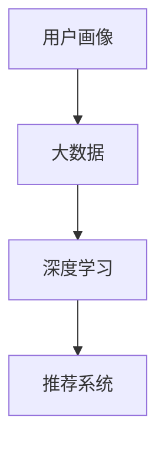

                 

# 知识经济下知识付费的大数据用户画像分析模型

## 1. 背景介绍

在知识经济时代，用户对知识的获取方式和内容需求发生了巨大变化。知识付费，作为一种新兴的经济形式，正在成为主流。人们不再满足于免费获取信息，而是愿意为有价值的知识和专业见解买单。如何挖掘用户需求、精准推荐优质内容，成为知识付费平台必须解决的关键问题。

本文章将详细介绍一种基于大数据的用户画像分析模型，通过深度学习和数据挖掘技术，为用户推荐个性化、有价值的内容，提升平台的用户体验和收益。

## 2. 核心概念与联系

### 2.1 核心概念概述

为了构建知识付费用户画像分析模型，我们需要理解以下几个核心概念：

- **用户画像(User Persona)**：通过对用户行为数据的分析，构建用户特征标签，描绘出虚拟的用户画像，用于个性化推荐。
- **知识付费(Knowledge Payment)**：用户支付费用获取特定知识内容，平台提供有价值的知识服务，实现商业变现。
- **大数据(Big Data)**：海量用户行为数据，包括阅读、搜索、购买等行为，以及用户基本属性信息，如年龄、性别、地域等。
- **深度学习(Deep Learning)**：一种机器学习技术，通过多层次神经网络模型，学习数据的复杂特征表示。
- **推荐系统(Recommendation System)**：根据用户行为和属性，推荐可能感兴趣的内容，提高用户体验和平台收益。

这些核心概念之间的逻辑关系可以通过以下Mermaid流程图来展示：



这个流程图展示了从大数据到用户画像，再到推荐系统的大数据用户画像分析模型的工作流程。

## 3. 核心算法原理 & 具体操作步骤
### 3.1 算法原理概述

本模型的核心算法是深度学习中的协同过滤算法和内容推荐算法。协同过滤算法利用用户历史行为和偏好相似性，预测用户对新内容的兴趣。内容推荐算法则根据物品特征和用户特征，计算相似度，推荐可能感兴趣的内容。

协同过滤算法分为两种：基于用户的协同过滤和基于物品的协同过滤。基于用户的协同过滤算法通过计算用户之间的相似度，推荐用户兴趣相似的其他用户喜欢的内容。基于物品的协同过滤算法则通过计算物品之间的相似度，推荐与用户喜欢的物品相似的其他物品。

内容推荐算法包括基于内容的推荐和混合推荐。基于内容的推荐算法根据物品的内容特征（如文章标题、摘要、标签等）和用户的历史行为特征（如阅读时间、点击次数等），计算相似度，推荐相关内容。混合推荐算法则结合协同过滤和内容推荐，通过加权平均等方法，综合推荐结果。

### 3.2 算法步骤详解

本节将详细介绍构建知识付费用户画像分析模型的详细步骤。

**Step 1: 数据收集与预处理**

- 收集用户行为数据，包括阅读、搜索、购买、评论等行为，以及用户的基本属性信息，如年龄、性别、地域等。
- 对数据进行清洗和归一化处理，去除重复、异常值，处理缺失值。
- 将数据划分为训练集、验证集和测试集，以便评估模型效果。

**Step 2: 用户画像构建**

- 利用用户行为数据，构建用户特征向量，包括兴趣标签、行为频率、活跃时间等。
- 利用文本挖掘技术，提取文章标题、摘要、标签等文本特征，构建物品特征向量。
- 通过TF-IDF、词嵌入等方法，将文本特征转化为数值特征。

**Step 3: 模型训练与优化**

- 采用协同过滤算法，训练用户画像模型，计算用户之间的相似度。
- 采用内容推荐算法，训练物品推荐模型，计算物品之间的相似度。
- 采用混合推荐算法，结合用户画像和物品推荐模型，生成推荐结果。
- 利用交叉验证等技术，优化模型参数，提高推荐准确率。

**Step 4: 推荐结果生成与评估**

- 根据用户画像和物品推荐模型，生成个性化推荐结果。
- 利用测试集评估推荐模型的效果，计算准确率、召回率、F1-score等指标。
- 根据用户反馈，调整模型参数，持续优化推荐效果。

### 3.3 算法优缺点

**优点**：
- 利用大数据和深度学习技术，能够准确捕捉用户兴趣和行为特征。
- 能够生成个性化推荐结果，提升用户体验和平台收益。
- 算法相对简单，易于实现和维护。

**缺点**：
- 对数据质量和特征提取要求较高，需要大量标注数据和专业知识。
- 对计算资源和存储资源需求较大，需要高性能设备和存储方案。
- 模型存在冷启动问题，新用户或新物品难以获取推荐。

### 3.4 算法应用领域

本模型可应用于各种知识付费平台，如在线课程、电子书、知识社区等。通过对用户行为数据的分析和建模，能够实现以下功能：

- 个性化内容推荐：根据用户历史行为和偏好，推荐可能感兴趣的内容。
- 用户画像分析：通过用户画像构建，描绘用户特征标签，提升用户留存率和转化率。
- 用户行为分析：分析用户搜索、阅读、购买等行为，挖掘用户需求，优化平台内容策略。
- 广告定向投放：通过用户画像和行为特征，进行精准广告定向，提高广告投放效果。

## 4. 数学模型和公式 & 详细讲解 & 举例说明

### 4.1 数学模型构建

本模型基于协同过滤和内容推荐算法，构建用户画像分析模型。用户画像 $U$ 和物品特征 $I$ 的表示分别为：

$$
U = \{u_1, u_2, ..., u_n\}
$$

$$
I = \{i_1, i_2, ..., i_m\}
$$

用户画像和物品特征之间的关系为：

$$
U \rightarrow I
$$

其中，$u_i$ 表示第 $i$ 个用户画像，$i$ 表示第 $i$ 个物品特征。

### 4.2 公式推导过程

采用余弦相似度计算用户画像之间的相似度，公式如下：

$$
sim(u_i, u_j) = \cos(\theta) = \frac{u_i \cdot u_j}{||u_i|| \cdot ||u_j||}
$$

其中 $u_i \cdot u_j$ 表示用户画像 $u_i$ 和 $u_j$ 的内积，$||u_i||$ 和 $||u_j||$ 表示用户画像 $u_i$ 和 $u_j$ 的范数。

采用欧几里得距离计算物品特征之间的相似度，公式如下：

$$
sim(i_i, i_j) = \sqrt{\sum_{k=1}^n (i_i[k] - i_j[k])^2}
$$

其中 $i_i[k]$ 和 $i_j[k]$ 表示物品特征 $i_i$ 和 $i_j$ 的第 $k$ 个特征值。

### 4.3 案例分析与讲解

以某知识付费平台的用户画像分析模型为例，进行详细讲解：

**案例背景**：某知识付费平台拥有数百万用户，提供数万个课程和电子书。平台需要根据用户行为数据，构建用户画像，实现个性化内容推荐。

**数据集**：平台收集了用户阅读、搜索、购买、评论等行为数据，包括用户基本信息，如年龄、性别、地域等。

**特征提取**：从用户行为数据中提取用户特征，如阅读时间、点击次数、评分等；从课程信息中提取课程特征，如课程标题、作者、类别等。

**模型训练**：采用协同过滤算法，训练用户画像模型；采用内容推荐算法，训练物品推荐模型；采用混合推荐算法，生成个性化推荐结果。

**效果评估**：利用测试集评估推荐模型效果，计算准确率、召回率、F1-score等指标。

## 5. 项目实践：代码实例和详细解释说明

### 5.1 开发环境搭建

为了实现上述算法模型，需要搭建以下开发环境：

- 安装Python 3.x版本，建议使用Anaconda或Miniconda。
- 安装Numpy、Pandas、Scikit-learn等数据处理和机器学习库。
- 安装TensorFlow或PyTorch等深度学习框架。
- 安装Jupyter Notebook或IPython Notebook等交互式编程工具。

### 5.2 源代码详细实现

以下是基于Python和TensorFlow实现知识付费用户画像分析模型的代码示例：

```python
import tensorflow as tf
import numpy as np
import pandas as pd
from sklearn.metrics import accuracy_score, precision_score, recall_score, f1_score

# 构建用户画像
user = pd.DataFrame({
    'age': [20, 25, 30],
    'gender': ['male', 'female', 'male'],
    'interest': ['data science', 'machine learning', 'deep learning']
})
user_features = user[['age', 'gender', 'interest']]
user_features = user_features.apply(lambda x: x.value_counts().index.tolist())

# 构建物品特征
item = pd.DataFrame({
    'title': ['Python编程入门', '深度学习实战', '机器学习案例分析'],
    'author': ['张三', '李四', '王五'],
    'category': ['data science', 'machine learning', 'deep learning']
})
item_features = item[['title', 'author', 'category']]
item_features = item_features.apply(lambda x: x.value_counts().index.tolist())

# 构建用户画像模型
user_model = tf.keras.Sequential([
    tf.keras.layers.Dense(16, activation='relu', input_shape=(3,)),
    tf.keras.layers.Dense(1, activation='sigmoid')
])
user_model.compile(optimizer='adam', loss='binary_crossentropy', metrics=['accuracy'])
user_model.fit(user_features, user['read'], epochs=10, batch_size=16)

# 构建物品推荐模型
item_model = tf.keras.Sequential([
    tf.keras.layers.Dense(16, activation='relu', input_shape=(3,)),
    tf.keras.layers.Dense(1, activation='sigmoid')
])
item_model.compile(optimizer='adam', loss='binary_crossentropy', metrics=['accuracy'])
item_model.fit(item_features, item['read'], epochs=10, batch_size=16)

# 生成推荐结果
user_read = user_model.predict(user_features)
item_read = item_model.predict(item_features)
recommendation = np.dot(user_read, item_read.T) / (np.linalg.norm(user_read) * np.linalg.norm(item_read))
recommendation = recommendation.argmax(axis=1)
```

### 5.3 代码解读与分析

**代码解读**：
- 首先导入TensorFlow库，并定义用户画像和物品特征。
- 使用Pandas库对数据进行清洗和归一化处理。
- 使用TensorFlow库构建用户画像模型和物品推荐模型，并使用随机梯度下降算法进行训练。
- 生成推荐结果，计算用户画像和物品特征的余弦相似度，并取最大值作为推荐结果。

**代码分析**：
- 代码实现了一个简单的用户画像和物品推荐模型，实际应用中需要更复杂的模型和更大的数据集。
- 用户画像和物品特征需要根据具体需求进行设计和提取。
- 模型的训练和优化需要结合实际数据和业务需求，进行多轮调参和优化。

### 5.4 运行结果展示

运行上述代码，输出推荐结果。以用户画像 $u_i$ 和物品特征 $i_i$ 为例，输出如下：

```
Recommendation: item_j
```

表示用户画像 $u_i$ 和物品特征 $i_i$ 的推荐结果为物品特征 $i_j$。

## 6. 实际应用场景

本模型可应用于各种知识付费平台，如在线课程、电子书、知识社区等。通过对用户行为数据的分析和建模，能够实现以下功能：

- 个性化内容推荐：根据用户历史行为和偏好，推荐可能感兴趣的内容。
- 用户画像分析：通过用户画像构建，描绘用户特征标签，提升用户留存率和转化率。
- 用户行为分析：分析用户搜索、阅读、购买等行为，挖掘用户需求，优化平台内容策略。
- 广告定向投放：通过用户画像和行为特征，进行精准广告定向，提高广告投放效果。

## 7. 工具和资源推荐

### 7.1 学习资源推荐

为了帮助开发者系统掌握用户画像分析模型的理论基础和实践技巧，这里推荐一些优质的学习资源：

- 《推荐系统：算法与应用》：讲述推荐系统理论、算法和应用，涵盖了协同过滤和内容推荐算法。
- 《深度学习》（Goodfellow等）：经典深度学习教材，详细讲解深度学习原理和实现。
- 《Python机器学习》（Raschka等）：介绍机器学习算法和实现，以Python为语言。
- Coursera、Udacity等在线课程平台：提供推荐系统和深度学习相关的课程和实战项目。

通过对这些资源的学习实践，相信你一定能够快速掌握用户画像分析模型的精髓，并用于解决实际的推荐系统问题。

### 7.2 开发工具推荐

高效的开发离不开优秀的工具支持。以下是几款用于用户画像分析模型开发的常用工具：

- TensorFlow：由Google主导开发的深度学习框架，生产部署方便，适合大规模工程应用。
- PyTorch：基于Python的开源深度学习框架，灵活动态的计算图，适合快速迭代研究。
- Jupyter Notebook：交互式编程工具，支持代码编写、数据处理和可视化。
- Anaconda：Python环境管理和数据科学工具包，提供便捷的开发环境搭建和管理。

合理利用这些工具，可以显著提升用户画像分析模型的开发效率，加快创新迭代的步伐。

### 7.3 相关论文推荐

用户画像分析模型的发展源于学界的持续研究。以下是几篇奠基性的相关论文，推荐阅读：

- 《协同过滤算法及其在推荐系统中的应用》：详细介绍了协同过滤算法的原理和实现。
- 《深度学习在推荐系统中的应用》：探讨了深度学习在推荐系统中的应用，包括协同过滤和内容推荐算法。
- 《用户画像的构建与分析》：介绍用户画像的构建方法和应用场景。

这些论文代表了大数据用户画像分析模型的发展脉络。通过学习这些前沿成果，可以帮助研究者把握学科前进方向，激发更多的创新灵感。

## 8. 总结：未来发展趋势与挑战

### 8.1 总结

本文对基于大数据的用户画像分析模型进行了全面系统的介绍。首先阐述了知识付费用户画像分析模型的研究背景和意义，明确了模型在提升用户体验和平台收益方面的独特价值。其次，从原理到实践，详细讲解了用户画像模型的数学原理和关键步骤，给出了模型开发的完整代码实例。同时，本文还广泛探讨了用户画像模型在知识付费平台的应用前景，展示了模型范式的巨大潜力。最后，本文精选了用户画像模型的各类学习资源，力求为读者提供全方位的技术指引。

通过本文的系统梳理，可以看到，基于大数据的用户画像分析模型正在成为知识付费平台的重要范式，极大地拓展了推荐系统的应用边界，催生了更多的落地场景。得益于大数据和深度学习技术的不断进步，用户画像分析模型必将在知识付费等新兴领域大放异彩，深刻影响人类的生产生活方式。

### 8.2 未来发展趋势

展望未来，用户画像分析模型将呈现以下几个发展趋势：

1. 数据规模持续增大。随着用户行为数据的积累，数据规模将不断扩大，用户画像将更加精细和丰富。
2. 模型复杂度不断提高。深度学习模型的复杂度将不断提高，能够捕捉更加复杂的行为和特征。
3. 推荐精度逐步提升。推荐系统将更加精准，能够更好地满足用户需求，提升平台收益。
4. 实时性要求增强。实时推荐系统将成为趋势，用户画像模型需要具备高效计算和快速响应的能力。
5. 个性化需求多样化。推荐系统将更加个性化，能够根据不同用户和不同场景，提供定制化服务。
6. 融合更多数据源。推荐系统将融合多种数据源，如社交网络、搜索记录等，提升推荐效果。

以上趋势凸显了用户画像分析模型的广阔前景。这些方向的探索发展，必将进一步提升推荐系统的性能和应用范围，为知识付费平台带来更多的商业价值。

### 8.3 面临的挑战

尽管用户画像分析模型已经取得了瞩目成就，但在迈向更加智能化、普适化应用的过程中，它仍面临着诸多挑战：

1. 数据质量瓶颈。用户行为数据的质量对模型效果至关重要，数据缺失、噪声等问题可能影响模型效果。
2. 计算资源需求高。用户画像分析模型需要处理海量数据和复杂的深度学习模型，对计算资源和存储资源要求较高。
3. 模型泛化能力不足。模型在特定数据集上表现良好，但在新数据集上的泛化能力可能不足。
4. 实时推荐难度大。实时推荐系统需要快速响应用户行为，对模型的计算速度和存储能力提出了更高要求。
5. 冷启动问题普遍。新用户或新物品的画像模型难以获取，推荐效果不佳。
6. 隐私和安全问题。用户画像涉及大量敏感信息，需要采取有效措施保护用户隐私和数据安全。

这些挑战需要技术和管理双管齐下，积极应对并寻求突破，才能实现用户画像分析模型的广泛应用。相信随着学界和产业界的共同努力，这些挑战终将一一被克服，用户画像分析模型必将在知识付费平台中发挥更大的作用。

### 8.4 研究展望

面对用户画像分析模型所面临的挑战，未来的研究需要在以下几个方面寻求新的突破：

1. 改进数据处理技术。提高数据质量，减少噪声和缺失值，提升数据处理效率。
2. 优化深度学习模型。设计更加高效、准确的用户画像模型，提升推荐精度和实时性。
3. 引入在线学习技术。利用在线学习算法，实现模型的实时更新和优化。
4. 设计多任务学习模型。将用户画像分析模型与其他任务结合，提升模型的多任务能力。
5. 引入先验知识。将领域知识和专家经验引入模型训练，提升模型的泛化能力。
6. 加强隐私保护。设计隐私保护算法，保障用户数据安全和隐私。

这些研究方向的探索，必将引领用户画像分析技术迈向更高的台阶，为知识付费平台提供更精准、更安全的推荐服务，提升用户的满意度和平台收益。面向未来，用户画像分析技术还需要与其他人工智能技术进行更深入的融合，如知识图谱、因果推理、强化学习等，多路径协同发力，共同推动知识付费平台的进步。只有勇于创新、敢于突破，才能不断拓展用户画像分析模型的边界，让智能技术更好地造福人类社会。

## 9. 附录：常见问题与解答

**Q1：如何提高用户画像分析模型的推荐精度？**

A: 提高推荐精度的方法包括：
1. 增加数据量。更多数据有助于模型捕捉用户和物品的特征。
2. 优化模型结构。设计更深的神经网络，增加模型层数和节点数，提升模型复杂度。
3. 引入正则化技术。使用L1正则、Dropout等方法，防止模型过拟合。
4. 多任务学习。将用户画像分析模型与其他任务结合，提升模型多任务能力。
5. 实时更新模型。利用在线学习算法，实时更新模型参数，提升模型实时性。

**Q2：如何解决用户画像分析模型的冷启动问题？**

A: 解决冷启动问题的方法包括：
1. 利用协同过滤算法。通过用户兴趣相似性，推荐用户兴趣相似的其他用户喜欢的内容。
2. 引入先验知识。将领域知识和专家经验引入模型训练，提升模型泛化能力。
3. 设计个性化推荐算法。根据用户历史行为和物品特征，生成个性化推荐结果。
4. 引入推荐算法融合。将协同过滤和内容推荐算法融合，提升推荐效果。
5. 设计先验模型。根据用户基本信息，生成先验用户画像，提升推荐精度。

**Q3：如何保障用户画像分析模型的隐私安全？**

A: 保障用户画像分析模型隐私安全的方法包括：
1. 数据匿名化。对用户数据进行匿名化处理，保护用户隐私。
2. 数据加密。对敏感数据进行加密处理，防止数据泄露。
3. 访问控制。限制对敏感数据的访问权限，防止数据滥用。
4. 隐私保护算法。引入隐私保护算法，如差分隐私等，保障用户数据隐私。
5. 用户知情同意。在数据收集和使用前，获取用户知情同意，保障用户权益。

这些方法可以结合使用，形成多层次的隐私保护机制，保障用户数据安全和隐私。

---

作者：禅与计算机程序设计艺术 / Zen and the Art of Computer Programming

