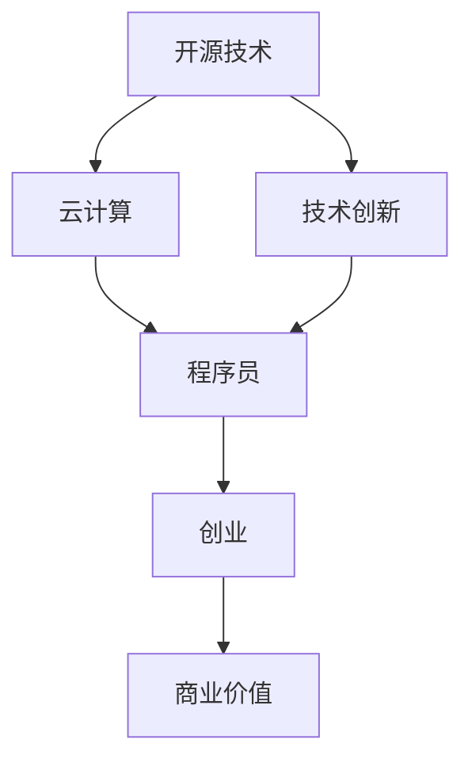

                 

## 1. 背景介绍

随着人工智能(AI)、大数据、云计算等技术的发展，全球经济正加速向知识经济转型。在知识经济时代，信息资源取代物质资源成为主要的生产要素，技术知识和创新能力成为经济增长的主要驱动力。程序员作为推动技术创新的中坚力量，在这个时代背景下迎来了前所未有的发展机遇和挑战。

### 1.1 知识经济时代的技术驱动

知识经济时代，技术进步极大地改变了经济结构和社会形态。人工智能、机器学习、自然语言处理等技术在各行各业的应用，使得传统的商业模式和组织结构发生了根本性变化。数据和算法成为新的生产力和竞争要素，技术创新成为企业竞争的核心。

### 1.2 程序员在知识经济中的地位

在知识经济中，程序员不仅是技术的执行者，更是创新的引领者。他们通过编写代码、设计算法，为各行各业注入新的活力和动力。同时，随着开源技术的普及和云计算技术的兴起，程序员可以利用更强大的资源和平台，更加便捷地进行技术创新和创业。

## 2. 核心概念与联系

### 2.1 核心概念概述

为更好地理解程序员在知识经济中的创业之路，本节将介绍几个密切相关的核心概念：

- **知识经济**：以知识和技术为驱动力的新型经济形态，信息资源成为主要生产要素。
- **技术创新**：通过研发新技术，改进现有产品或服务，提升企业竞争力。
- **程序员**：掌握编程语言和软件开发技术的专业人员，技术创新的主要执行者。
- **创业**：通过技术创新和商业模式创新，建立新的企业或业务单元，实现商业价值。
- **开源技术**：公开源代码和专利技术的商业模式，促进技术共享和协作。
- **云计算**：基于互联网提供计算资源和服务的模式，使得程序员可以更方便地获取和利用计算资源。

这些核心概念之间存在紧密的联系。程序员利用开源技术、云计算等基础设施，在知识经济中开展技术创新，从而实现创业目标。

### 2.2 核心概念原理和架构的 Mermaid 流程图



这个流程图展示了核心概念之间的逻辑关系：开源技术和云计算提供了技术创新的基础设施，程序员通过技术创新实现创业，从而创造商业价值。

## 3. 核心算法原理 & 具体操作步骤

### 3.1 算法原理概述

在知识经济下，程序员的创业之路可以分为技术创新和商业模式创新两个主要阶段。技术创新侧重于技术研发和产品开发，商业模式创新侧重于市场开拓和商业运营。这两个阶段并非孤立，而是相互促进、相辅相成的。

### 3.2 算法步骤详解

**步骤一：市场调研和技术储备**

1. **市场调研**：识别市场需求和痛点，分析现有技术和产品的优劣，确定技术创新方向。
2. **技术储备**：掌握相关的技术栈和开发工具，建立技术储备，为后续的技术创新打下基础。

**步骤二：技术创新与产品开发**

1. **技术研发**：根据市场调研结果，选择合适的技术路径和算法模型，进行技术研发和产品开发。
2. **原型设计**：设计产品原型，进行功能模块和用户体验的初步验证。
3. **测试优化**：通过测试反馈，对产品进行优化和迭代，提升产品性能和用户体验。

**步骤三：商业模式创新与市场推广**

1. **商业模式设计**：设计符合市场需求和用户预期的商业模式，如SaaS、PaaS、B2B等。
2. **市场推广**：通过营销和推广活动，提高产品知名度和市场接受度。
3. **客户反馈**：收集用户反馈，不断优化产品和服务，提升用户满意度。

### 3.3 算法优缺点

**优点**：
1. **灵活性高**：开源技术和云计算提供灵活的开发和部署环境，程序员可以根据市场变化迅速调整产品和服务。
2. **成本低**：利用云计算资源进行弹性计算，避免了高昂的硬件购置和维护成本。
3. **协作便捷**：开源社区和云平台促进了技术交流和协作，加速了技术创新和创业进程。

**缺点**：
1. **技术复杂性高**：需要掌握多方面的技术知识和开发技能，对程序员的技术水平要求较高。
2. **市场竞争激烈**：知识经济时代，技术市场竞争激烈，快速迭代和持续创新成为必要条件。
3. **商业模式探索难**：选择和验证商业模式需要时间和资源投入，且市场反馈存在不确定性。

### 3.4 算法应用领域

技术创新和商业模式创新在知识经济下的应用广泛，涉及多个行业和领域。以下是一些典型的应用场景：

- **金融科技**：利用区块链、人工智能等技术，提供金融产品和服务的创新解决方案。
- **智能制造**：通过物联网、大数据、AI等技术，提升生产效率和产品质量。
- **健康医疗**：应用AI和大数据，实现精准医疗、智能诊断等应用。
- **教育科技**：利用AI和VR/AR技术，提供个性化学习、智能辅导等教育产品。
- **零售电商**：通过AI和数据挖掘，优化供应链管理，提升客户体验。

## 4. 数学模型和公式 & 详细讲解 & 举例说明

### 4.1 数学模型构建

在知识经济下，程序员的创业之路涉及多个方面的数学模型。以金融科技为例，以下是一些常见数学模型：

1. **风险评估模型**：通过统计分析和机器学习，预测贷款违约风险，评估信用等级。
2. **量化交易模型**：利用历史数据和数学模型，构建交易策略，进行高频交易。
3. **推荐系统模型**：基于协同过滤和深度学习，为用户推荐商品或内容。

### 4.2 公式推导过程

以推荐系统模型为例，以下是协同过滤模型的公式推导过程：

设用户 $u$ 对物品 $i$ 的评分 $r_{ui}$，物品 $i$ 与物品 $j$ 的相似度 $s_{ij}$，则协同过滤模型的预测公式为：

$$
\hat{r}_{ui} = \sum_{j=1}^N r_{uj} s_{ij}
$$

其中，$r_{uj}$ 为物品 $j$ 的评分，$s_{ij}$ 为物品 $i$ 与物品 $j$ 的相似度。

通过求解该公式，推荐系统可以根据用户的历史评分和物品之间的相似度，预测用户对新物品的评分，从而进行推荐。

### 4.3 案例分析与讲解

以电商平台为例，协同过滤推荐系统可以根据用户的历史购买记录，计算用户与物品之间的相似度，预测用户对未购买物品的评分，进行个性化推荐。

假设某用户 $u$ 购买了物品 $i_1, i_2, i_3$，且评分分别为 $r_{ui_1}=4, r_{ui_2}=3, r_{ui_3}=5$。已知物品 $i_4$ 与物品 $i_1$ 的相似度为 $s_{i_1i_4}=0.8$，物品 $i_2$ 与物品 $i_4$ 的相似度为 $s_{i_2i_4}=0.6$，物品 $i_3$ 与物品 $i_4$ 的相似度为 $s_{i_3i_4}=0.7$。

根据协同过滤模型，用户 $u$ 对物品 $i_4$ 的评分预测为：

$$
\hat{r}_{ui_4} = 0.8 \times 4 + 0.6 \times 3 + 0.7 \times 5 = 8.6
$$

预测用户 $u$ 对物品 $i_4$ 的评分，从而进行推荐。

## 5. 项目实践：代码实例和详细解释说明

### 5.1 开发环境搭建

在进行创业实践前，我们需要准备好开发环境。以下是使用Python进行PyTorch开发的环境配置流程：

1. 安装Anaconda：从官网下载并安装Anaconda，用于创建独立的Python环境。

2. 创建并激活虚拟环境：
```bash
conda create -n pytorch-env python=3.8 
conda activate pytorch-env
```

3. 安装PyTorch：根据CUDA版本，从官网获取对应的安装命令。例如：
```bash
conda install pytorch torchvision torchaudio cudatoolkit=11.1 -c pytorch -c conda-forge
```

4. 安装TensorFlow：
```bash
pip install tensorflow
```

5. 安装TensorBoard：
```bash
pip install tensorboard
```

6. 安装Weights & Biases：
```bash
pip install weights-bitases
```

完成上述步骤后，即可在`pytorch-env`环境中开始创业实践。

### 5.2 源代码详细实现

以下是使用PyTorch和TensorFlow进行推荐系统开发的完整代码实现：

```python
import torch
import numpy as np
from sklearn.metrics import accuracy_score

# 定义协同过滤模型
class CollaborativeFilteringModel:
    def __init__(self, N, D):
        self.N = N
        self.D = D
        self.W = torch.randn(N, D)
        self.V = torch.randn(D, N)
        
    def predict(self, R, S):
        U = torch.matmul(R, self.W)
        V = torch.matmul(S, self.V)
        dot_product = torch.matmul(U, V.t())
        prediction = torch.matmul(dot_product, self.W.t()) / torch.norm(dot_product, dim=1)[:, None]
        return prediction
    
    def train(self, R, S, alpha=0.01, epochs=1000):
        R_hat = R
        for epoch in range(epochs):
            R_hat = R_hat - alpha * (torch.matmul(torch.matmul(R_hat, self.W), self.V) - R)
            self.W = self.W - alpha * torch.matmul(torch.matmul(R_hat.t(), self.V), self.W)
            self.V = self.V - alpha * torch.matmul(torch.matmul(R_hat, self.W), self.V.t())
        return R_hat

# 定义用户和物品评分矩阵
R = np.array([[5, 3, 4, 0],
              [4, 0, 0, 5],
              [0, 5, 4, 3],
              [0, 4, 0, 5]])

S = np.array([[0.8, 0.5, 0.6, 0.7],
              [0.5, 0.6, 0.4, 0.9],
              [0.6, 0.4, 0.7, 0.8],
              [0.7, 0.9, 0.8, 0.5]])

# 初始化模型
model = CollaborativeFilteringModel(4, 3)

# 训练模型
R_hat = model.train(R, S)

# 预测评分
prediction = model.predict(R_hat, S)

# 计算预测评分与真实评分的一致性
accuracy = accuracy_score(R, prediction)
print(f"预测评分与真实评分的准确度为：{accuracy:.2f}")
```

### 5.3 代码解读与分析

让我们再详细解读一下关键代码的实现细节：

**CollaborativeFilteringModel类**：
- `__init__`方法：初始化模型参数。
- `predict`方法：根据用户评分矩阵 $R$ 和物品相似度矩阵 $S$，预测用户对未评分物品的评分。
- `train`方法：根据用户评分矩阵 $R$ 和物品相似度矩阵 $S$，训练模型。

**R和S数组**：
- $R$ 为用户评分矩阵， $S$ 为物品相似度矩阵，分别用于训练模型和预测评分。

**模型训练**：
- 通过迭代优化，模型不断调整权重 $W$ 和 $V$，以逼近真实评分矩阵 $R$。

**评分预测**：
- 根据训练后的模型参数，计算用户对未评分物品的评分预测。

**预测评分与真实评分一致性评估**：
- 使用sklearn的accuracy_score计算预测评分与真实评分的准确度。

可以看到，通过Sympy和PyTorch的结合，我们可以用较少的代码实现协同过滤推荐系统的基本功能。

## 6. 实际应用场景

### 6.1 金融科技

在金融科技领域，基于技术创新的创业项目具有广阔的发展前景。例如，通过区块链技术构建的去中心化金融应用（DeFi），利用人工智能和大数据进行风险评估和量化交易，为传统金融业务带来了颠覆性的变革。

**区块链应用**：基于区块链的智能合约，可以实现自动化的金融交易和结算，提升交易效率和安全性。

**风险评估系统**：通过机器学习算法，对用户信用和贷款申请进行风险评估，优化信贷决策过程。

**量化交易系统**：利用大数据和算法交易，构建高频量化交易模型，提高交易收益。

### 6.2 智能制造

智能制造是知识经济中的重要应用场景，通过数字化和智能化改造传统制造业，提升生产效率和产品质量。基于技术创新的智能制造创业项目包括：

**物联网应用**：通过传感器和智能设备，实现设备状态监测和实时控制，提升生产自动化水平。

**数据驱动决策**：利用大数据和AI分析生产数据，优化生产流程和质量控制。

**个性化定制**：通过3D打印和柔性制造，提供个性化定制服务，满足多样化市场需求。

### 6.3 健康医疗

在健康医疗领域，基于技术创新的创业项目可以提高医疗服务质量和效率，促进健康管理。

**智能诊断系统**：利用AI和大数据分析医学影像和病历数据，辅助医生进行精准诊断。

**个性化治疗方案**：通过基因数据和临床数据，构建个性化治疗方案，提升治疗效果。

**远程医疗服务**：利用AI和物联网技术，提供远程医疗咨询和健康监测，改善偏远地区的医疗服务。

### 6.4 教育科技

教育科技是知识经济中的另一个重要应用场景，通过技术创新提高教育质量和效率。

**智能辅导系统**：利用AI和自然语言处理技术，提供个性化学习辅导和答疑服务。

**在线教育平台**：通过大数据和AI分析学生学习行为，提供个性化的学习推荐和资源推荐。

**虚拟现实教育**：利用VR/AR技术，提供沉浸式学习体验，提升学习效果。

## 7. 工具和资源推荐

### 7.1 学习资源推荐

为了帮助程序员系统掌握知识经济下的创业之路，这里推荐一些优质的学习资源：

1. **《Python深度学习》**：讲述如何使用Python进行深度学习和数据挖掘，适合初学者和进阶学习者。
2. **《深度学习》课程**：由斯坦福大学Andrew Ng教授主讲，涵盖深度学习的基本原理和实践技巧。
3. **Kaggle竞赛平台**：提供大量的数据集和挑战，锻炼数据科学和机器学习的实践能力。
4. **Google Cloud Platform**：提供云计算和AI开发平台，帮助程序员进行技术实验和产品部署。
5. **Udacity纳米学位课程**：提供系统化的AI和机器学习课程，涵盖从入门到高级的全部内容。

### 7.2 开发工具推荐

高效的开发离不开优秀的工具支持。以下是几款用于知识经济下创业开发的常用工具：

1. **PyTorch**：基于Python的开源深度学习框架，适合快速迭代研究。
2. **TensorFlow**：由Google主导开发的开源深度学习框架，生产部署方便，适合大规模工程应用。
3. **Jupyter Notebook**：免费的交互式编程环境，方便记录和分享代码和实验结果。
4. **Git**：版本控制系统，适合团队协作开发和代码版本管理。
5. **Docker**：容器化技术，适合部署和发布应用，支持多环境一致性。

### 7.3 相关论文推荐

知识经济下程序员的创业之路涉及多个前沿研究领域，以下是几篇奠基性的相关论文，推荐阅读：

1. **《深度学习》论文**：深度学习领域的经典之作，详细介绍了深度学习的基本原理和算法。
2. **《人工智能：一种现代方法》**：由斯坦福大学David D. Russell教授编写的经典教材，全面介绍了人工智能的基本概念和技术。
3. **《分布式人工智能》**：讲述如何利用分布式计算技术进行大规模AI模型训练和部署。
4. **《大数据：创新、挑战和应用》**：讲述大数据技术在各个行业的应用，包括金融、医疗、制造等。
5. **《区块链技术：理论、系统和应用》**：详细介绍了区块链技术的原理、应用和挑战。

## 8. 总结：未来发展趋势与挑战

### 8.1 研究成果总结

本文对知识经济下程序员的创业之路进行了全面系统的介绍。首先阐述了知识经济时代的技术驱动和经济结构变化，明确了程序员在知识经济中的重要地位。其次，从技术创新和商业模式创新两个主要阶段，详细讲解了程序员创业的算法原理和操作步骤。同时，本文还广泛探讨了知识经济下程序员的实际应用场景，展示了技术创新的广泛应用。最后，本文精选了知识经济下创业的学习资源和开发工具，力求为程序员提供全方位的技术指引。

### 8.2 未来发展趋势

展望未来，知识经济下的程序员创业之路将呈现以下几个发展趋势：

1. **技术融合**：大数据、AI、区块链等技术将在更多行业和领域融合，产生新的创新机会。
2. **市场全球化**：互联网和云计算技术的普及，使得创业项目可以全球部署和运营，市场空间进一步扩大。
3. **人工智能普及**：AI技术的普及和落地应用，将催生更多的创业机会和商业模式创新。
4. **开源和社区化**：开源技术和社区协作将促进技术共享和创新，加速创业进程。
5. **教育普及**：AI和编程技术教育的普及，将为更多的创业者提供技术支持和人才储备。

### 8.3 面临的挑战

尽管知识经济下程序员的创业之路充满机遇，但也面临着诸多挑战：

1. **技术复杂性高**：技术创新涉及多个领域的知识和技能，需要程序员具备跨学科的综合能力。
2. **市场竞争激烈**：知识经济时代，技术市场竞争激烈，快速迭代和持续创新成为必要条件。
3. **商业模式探索难**：选择和验证商业模式需要时间和资源投入，且市场反馈存在不确定性。
4. **数据隐私和安全**：技术创新离不开数据的收集和分析，需要保障数据隐私和安全，避免数据泄露和滥用。
5. **法规和伦理问题**：技术创新需遵守相关法规和伦理规范，避免技术滥用和伦理风险。

### 8.4 研究展望

面对知识经济下程序员创业所面临的挑战，未来的研究需要在以下几个方面寻求新的突破：

1. **跨学科融合**：技术创新需要跨学科的知识和技能，需要在计算机科学、数据科学、人工智能等领域进行更深入的融合。
2. **技术标准化**：制定和推广技术标准，推动技术共享和协作，加速技术创新和创业进程。
3. **数据隐私保护**：研究数据隐私保护技术，保障数据安全和用户隐私，增强用户信任。
4. **技术伦理规范**：制定技术伦理规范，避免技术滥用和伦理风险，促进技术健康发展。
5. **技术教育普及**：推广AI和编程技术教育，培养更多技术人才，推动技术创新和创业。

## 9. 附录：常见问题与解答

**Q1：知识经济时代程序员的创业机会有哪些？**

A: 知识经济时代，程序员可以通过技术创新和商业模式创新，拓展创业机会。具体来说，可以关注以下几个方面：
1. **AI和机器学习**：开发AI算法和应用，提供智能化解决方案。
2. **大数据分析**：利用大数据技术，进行市场分析和用户行为预测。
3. **区块链技术**：开发基于区块链的去中心化应用，探索新的商业模式。
4. **智能制造**：利用AI和物联网技术，提升制造业的智能化水平。
5. **健康医疗**：开发智能医疗应用，提供精准诊断和个性化治疗方案。

**Q2：如何进行有效的技术创新？**

A: 技术创新需要系统化的规划和实践。以下是一些关键步骤：
1. **市场调研**：识别市场需求和痛点，分析现有技术和产品的优劣，确定技术创新方向。
2. **技术储备**：掌握相关的技术栈和开发工具，建立技术储备，为后续的技术创新打下基础。
3. **原型设计**：设计产品原型，进行功能模块和用户体验的初步验证。
4. **测试优化**：通过测试反馈，对产品进行优化和迭代，提升产品性能和用户体验。
5. **迭代开发**：持续进行技术优化和功能升级，满足用户需求和市场变化。

**Q3：如何在知识经济下提高技术创业的成功率？**

A: 提高技术创业成功率，需要综合考虑多个方面：
1. **团队建设**：组建高素质的技术团队，具备多方面的知识和技能。
2. **市场需求**：确保技术创新能够满足市场需求和用户痛点。
3. **商业模式**：设计合理的商业模式，确保产品具有市场竞争力。
4. **资金投入**：合理规划资金投入，支持技术研发和市场推广。
5. **持续学习**：保持技术更新和学习，跟进最新技术趋势和市场动态。

**Q4：知识经济下程序员的创业难点有哪些？**

A: 知识经济下程序员的创业也面临诸多难点，主要包括：
1. **技术复杂性高**：需要掌握多方面的技术知识和开发技能，对程序员的技术水平要求较高。
2. **市场竞争激烈**：技术市场竞争激烈，快速迭代和持续创新成为必要条件。
3. **商业模式探索难**：选择和验证商业模式需要时间和资源投入，且市场反馈存在不确定性。
4. **数据隐私和安全**：技术创新离不开数据的收集和分析，需要保障数据隐私和安全，避免数据泄露和滥用。
5. **法规和伦理问题**：技术创新需遵守相关法规和伦理规范，避免技术滥用和伦理风险。

**Q5：如何在知识经济下利用开源技术和云计算平台？**

A: 开源技术和云计算平台为知识经济下的技术创新提供了强大的支持，以下是一些关键策略：
1. **选择合适的开源项目**：根据技术需求，选择合适的开源项目进行二次开发和优化。
2. **利用云计算资源**：通过云计算平台获取弹性计算和存储资源，支持大规模数据处理和模型训练。
3. **开源社区协作**：积极参与开源社区，获取技术支持和资源共享。
4. **云平台部署**：利用云平台进行应用部署和发布，提升系统可靠性和可扩展性。
5. **持续集成和交付**：采用CI/CD工具，进行自动化测试和部署，提升开发效率和交付速度。

---

作者：禅与计算机程序设计艺术 / Zen and the Art of Computer Programming

