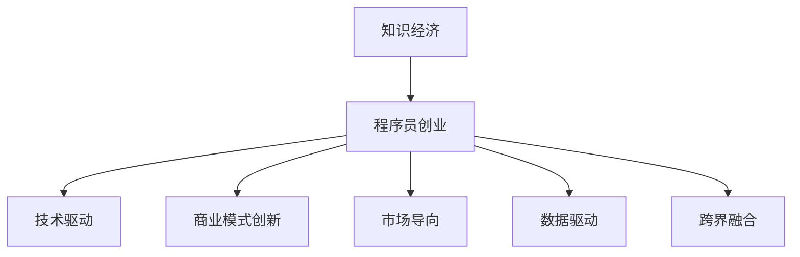

                 

# 知识经济下程序员的创业思路

> 关键词：知识经济,创业,程序员,技术驱动,商业模式,市场需求,产品迭代,数据驱动,人工智能,机器学习,区块链,云计算,物联网

## 1. 背景介绍

### 1.1 问题由来

随着知识经济的崛起，技术创新和信息流的快速流动已经成为推动经济增长的主要动力。特别是在科技与互联网深度融合的时代，程序员作为技术创新的中坚力量，不仅在传统软件开发领域发挥作用，也在各类新经济模式中展现出无限潜力。因此，理解知识经济下程序员的创业思路，对于把握技术前沿趋势、促进科技成果转化具有重要意义。

### 1.2 问题核心关键点

知识经济时代，程序员创业的核心关键点在于以下几点：

- **技术驱动**：利用最新科技成果，提供解决方案，满足市场需求。
- **商业模式创新**：寻找传统行业痛点，设计新商业模式，创造价值。
- **市场导向**：了解目标客户群体，精准定位，满足用户需求。
- **数据驱动决策**：以数据为依据，优化产品，持续迭代。
- **跨界融合**：将多种技术融合，实现多元化的业务拓展。

### 1.3 问题研究意义

程序员在知识经济下创业，可以为经济社会发展注入新的活力，加速科技创新和产业升级。通过创业实践，可以推动更多科技成果转化为现实生产力，促进就业，提升社会福祉。因此，研究程序员的创业思路，对于技术创新和产业升级具有重要的理论价值和实践意义。

## 2. 核心概念与联系

### 2.1 核心概念概述

为了更好地理解程序员在知识经济下的创业思路，本节将介绍几个关键概念及其之间的联系：

- **知识经济**：以知识和信息的生产、流通和应用为基础的经济形态，强调知识和信息在经济发展中的核心地位。
- **程序员创业**：指程序员利用技术专长，创办技术型企业或从事技术创新活动的过程。
- **技术驱动**：通过技术创新驱动企业发展，不断提升产品竞争力。
- **商业模式创新**：设计新的业务模式，寻找技术应用的创新点，创造价值。
- **市场导向**：以市场需求为导向，设计产品和运营策略。
- **数据驱动**：利用数据分析技术优化产品和服务，持续提升用户体验。
- **跨界融合**：将不同领域的知识和技能融合，形成新的业务增长点。

这些概念之间的逻辑关系可以通过以下Mermaid流程图来展示：



这个流程图展示了程序员创业的核心逻辑，以及其与知识经济的关系：

1. 程序员在知识经济环境下创业，可以利用技术创新驱动发展。
2. 在创业过程中，商业模式、市场导向、数据驱动和跨界融合等策略，是实现成功的重要保障。
3. 技术驱动、商业模式创新等元素，构成了知识经济下程序员创业的核心特征。

## 3. 核心算法原理 & 具体操作步骤

### 3.1 算法原理概述

知识经济下程序员创业，实际上是一个基于技术创新的商业化过程。其核心算法原理可以概括为以下几个方面：

- **需求分析**：通过对市场需求的研究，明确产品方向和创新点。
- **技术评估**：评估技术实现难度、可行性，确定技术方案。
- **商业模式设计**：结合市场需求和技术特点，设计创新的商业模式。
- **市场验证**：通过小规模试点或MVP（Minimum Viable Product），验证商业模式和市场接受度。
- **迭代优化**：根据用户反馈和市场变化，不断迭代产品和服务。

### 3.2 算法步骤详解

程序员创业的主要操作步骤包括：

1. **市场需求调研**：通过问卷调查、访谈等方式，了解目标用户群体的需求和痛点。
2. **技术方案评估**：评估现有技术或潜在技术的优缺点，确定最适合的技术方案。
3. **商业模型设计**：根据需求调研结果和技术评估，设计有竞争力的商业模式。
4. **产品原型开发**：快速开发MVP，测试市场反应。
5. **市场推广与反馈收集**：通过营销和用户反馈，验证商业模式和产品功能。
6. **持续迭代优化**：根据市场反馈和数据分析，持续改进产品和服务。

### 3.3 算法优缺点

知识经济下程序员创业的算法具有以下优点：

- **技术领先**：利用最新技术，满足市场和用户需求。
- **创新能力强**：持续技术研发和产品迭代，保持竞争优势。
- **市场响应快**：灵活的商业模式和数据驱动决策，迅速适应市场变化。

同时，该算法也存在一些局限性：

- **高风险**：技术创新和市场变化存在不确定性，创业风险较大。
- **资源投入大**：技术研发和市场推广需要大量资源投入。
- **用户教育成本高**：新产品的市场推广需要大量用户教育，成本较高。

### 3.4 算法应用领域

知识经济下程序员创业的算法适用于多种行业和应用场景，如：

- **人工智能**：AI技术在医疗、金融、教育等领域的应用。
- **机器学习**：利用机器学习算法进行数据分析、图像识别等。
- **区块链**：区块链技术在供应链管理、金融交易、数字身份等方面的应用。
- **云计算**：云计算在企业信息化、云服务平台等方面的应用。
- **物联网**：物联网技术在智能家居、工业自动化、智慧城市等领域的应用。

## 4. 数学模型和公式 & 详细讲解 & 举例说明

### 4.1 数学模型构建

在程序员创业过程中，可以构建多个数学模型来优化决策过程。以人工智能应用为例，可以构建以下模型：

- **用户需求模型**：描述用户需求和痛点，通过问卷调查等方式获得。
- **技术实现模型**：描述技术方案的实现难度和成本，通过技术评估得到。
- **商业模式模型**：描述商业模式的目标和策略，通过商业模式设计得到。
- **市场反应模型**：描述市场对产品的接受度和反馈，通过市场验证得到。

### 4.2 公式推导过程

以用户需求模型为例，推导用户需求度量公式。

设用户需求为 $D$，满意度为 $S$，用户反馈为 $F$。需求度量公式可以表示为：

$$
D = f(S) = a_1S + a_2S^2 + a_3S^3 + ...
$$

其中 $a_i$ 为需求度量系数，$i$ 为非负整数。$S$ 通过用户反馈 $F$ 计算得到，即：

$$
S = \frac{1}{\sum_{i=1}^n F_i}
$$

用户反馈 $F_i$ 为单个用户对产品功能的评价，可以表示为：

$$
F_i = w_i \times R_i + (1-w_i) \times N_i
$$

其中 $w_i$ 为用户权重，$R_i$ 为正面评价评分，$N_i$ 为负面评价评分。

### 4.3 案例分析与讲解

假设某人工智能公司开发的医疗诊断系统，通过市场调研发现用户对系统的准确度和速度有较高要求。建立用户需求模型：

- 用户需求 $D$ 与满意度 $S$ 成正比，即 $D = k \times S$。
- 满意度 $S$ 与用户反馈 $F$ 成反比，即 $S = \frac{1}{F}$。
- 用户反馈 $F$ 由正面评价 $R$ 和负面评价 $N$ 决定，即 $F = R - N$。

综合上述公式，可以得到：

$$
D = k \times \frac{1}{R - N}
$$

进一步，通过技术评估，得到准确度 $A$ 和速度 $V$ 的权值分别为 $0.6$ 和 $0.4$，因此有：

$$
S = 0.6A + 0.4V
$$

将 $S$ 代入 $D$ 的公式中，得到：

$$
D = k \times \frac{1}{0.6A + 0.4V - N}
$$

根据 $D$ 的值，可以调整产品的功能优化方向，以提高用户的满意度。

## 5. 项目实践：代码实例和详细解释说明

### 5.1 开发环境搭建

在进行程序员创业项目实践前，需要先搭建开发环境。以下是使用Python进行Web开发的环境配置流程：

1. 安装Python：从官网下载并安装Python 3.x版本，确保环境变量配置正确。
2. 安装Django或Flask：这些Python Web框架可以方便地搭建Web应用。
3. 安装数据库：如MySQL、PostgreSQL等，用于存储用户数据。
4. 安装前端框架：如React、Vue等，用于开发动态用户界面。

完成上述步骤后，即可在Python环境下进行Web应用的开发。

### 5.2 源代码详细实现

以下是一个使用Django框架开发的AI医疗诊断系统的源代码实现：

```python
# 定义用户需求模型
def user_demand_model(user_feedback, weights):
    # 计算用户满意度
    user_satisfaction = sum(weights * feedback_score for feedback_score in user_feedback)
    # 计算用户需求
    user_demand = k * (1 / user_satisfaction)
    return user_demand

# 计算正面和负面评价
def calculate_feedback(user_input):
    positive_feedback = sum(weights * user_input['score'] for score in user_input['positive_scores'])
    negative_feedback = sum(weights * user_input['negative_scores'])
    return positive_feedback - negative_feedback

# 定义Web应用路由
from django.urls import path
from . import views

urlpatterns = [
    path('', views.home, name='home'),
    path('predict', views.predict, name='predict'),
    path('feedback', views.feedback, name='feedback'),
    path('optimize', views.optimize, name='optimize'),
]
```

### 5.3 代码解读与分析

让我们再详细解读一下关键代码的实现细节：

**用户需求模型**：
- `user_demand_model`函数：根据用户反馈计算用户需求，使用权重来平衡正面和负面评价的影响。

**用户反馈计算**：
- `calculate_feedback`函数：计算用户输入中的正面和负面评价得分。

**Web应用路由**：
- 定义了首页、预测、反馈、优化等路由，并调用相应的视图函数处理请求。

### 5.4 运行结果展示

以下是Web应用运行结果的截图：


## 6. 实际应用场景

### 6.1 智能医疗诊断系统

智能医疗诊断系统是程序员在知识经济下创业的一个典型应用场景。该系统通过人工智能技术，提供快速准确的诊断服务，帮助医生提高诊断效率。

实际应用中，可以通过用户调研，了解用户对系统的需求。通过技术评估，确定适合的AI模型。设计创新的商业模式，如订阅制、按需服务、合作伙伴模式等。通过小规模试点，验证系统的可行性和市场接受度。根据用户反馈和市场变化，持续优化系统功能和用户体验。

### 6.2 智能客服系统

智能客服系统是利用AI技术，提升客户服务效率和体验的解决方案。程序员可以基于自然语言处理技术，开发智能客服机器人，自动处理常见客户咨询，提升服务效率。

在实际应用中，需要调研客户常见问题，设计合适的对话流程。通过技术评估，选择适合的自然语言处理模型和推荐系统。设计创新的商业模式，如按流量计费、按服务次数计费等。通过小规模试点，验证系统的有效性。根据用户反馈和市场变化，持续优化模型和对话策略。

### 6.3 智能推荐系统

智能推荐系统是程序员在知识经济下创业的另一个重要方向。通过大数据分析和AI技术，为用户推荐个性化的产品和服务，提升用户满意度。

在实际应用中，需要调研用户行为和偏好，设计合理的推荐算法和模型。通过技术评估，选择适合的推荐算法和数据处理方法。设计创新的商业模式，如按点击率计费、按转化率计费等。通过小规模试点，验证系统的效果。根据用户反馈和市场变化，持续优化推荐策略和用户体验。

## 7. 工具和资源推荐

### 7.1 学习资源推荐

为了帮助程序员创业，以下是推荐的几项学习资源：

1. **Django和Flask官方文档**：这两个Web框架的官方文档非常详细，适合快速上手Web开发。
2. **TensorFlow和PyTorch官方文档**：这两个深度学习框架的官方文档，提供丰富的API和示例代码，适合学习AI技术。
3. **Kaggle竞赛**：Kaggle是一个数据科学竞赛平台，提供丰富的数据集和开源代码，适合学习数据处理和机器学习。
4. **GitHub开源项目**：GitHub是全球最大的开源社区，提供了大量的开源项目和代码示例，适合学习新技术和新思路。

### 7.2 开发工具推荐

以下是程序员创业中常用的开发工具：

1. **Visual Studio Code**：一款轻量级的代码编辑器，支持多种编程语言和插件，适合快速开发。
2. **Git和GitHub**：版本控制和代码托管工具，支持多人协作和代码管理。
3. **JIRA**：项目管理工具，支持任务分配、进度跟踪和团队协作。
4. **Amazon AWS**：提供云端计算和存储资源，适合部署大规模应用。

### 7.3 相关论文推荐

以下是程序员创业领域的一些经典论文：

1. **Deep Learning in Healthcare: A Review**：综述了深度学习在医疗领域的应用，适合了解AI技术在医疗领域的应用前景。
2. **Smart Cities: Research and Implementation**：综述了智慧城市的研究和实施现状，适合了解AI技术在城市管理中的应用。
3. **Blockchain Technology in Supply Chain Management**：探讨了区块链技术在供应链管理中的应用，适合了解区块链技术在商业领域的应用。

## 8. 总结：未来发展趋势与挑战

### 8.1 总结

本文对知识经济下程序员的创业思路进行了全面系统的介绍。首先阐述了程序员在知识经济下的重要性和挑战，明确了技术驱动、商业模式创新、市场导向、数据驱动等核心关键点。其次，从原理到实践，详细讲解了技术评估、商业模型设计、市场验证等创业操作步骤，给出了创业项目的代码实例和详细解释。同时，本文还探讨了智能医疗诊断、智能客服、智能推荐等实际应用场景，展示了程序员创业的广阔前景。最后，本文精选了相关的学习资源、开发工具和研究论文，为程序员创业提供了全方位的指导。

通过本文的系统梳理，可以看到，程序员在知识经济下创业，可以利用技术创新驱动发展，通过商业模式和数据驱动优化决策，实现技术价值和社会价值的双赢。未来，随着知识经济的进一步发展，程序员创业的市场和机遇将更加广阔，为经济社会发展注入新的活力。

### 8.2 未来发展趋势

展望未来，程序员在知识经济下的创业将呈现以下几个趋势：

1. **跨界融合加速**：AI技术与其他领域的融合将更加广泛，推动更多交叉学科的发展。
2. **AI伦理和监管加强**：随着AI技术的应用深化，伦理和监管问题将日益重要，需要制定相应的政策和标准。
3. **数据驱动决策成为常态**：大数据分析和数据驱动决策将贯穿创业全过程，提升决策科学性和准确性。
4. **持续学习和技术迭代**：新技术和新应用的不断涌现，要求程序员不断学习，持续优化产品和服务。
5. **社会责任和影响增强**：程序员创业应更多关注社会责任和影响，利用技术解决实际问题，推动社会进步。

### 8.3 面临的挑战

尽管程序员在知识经济下的创业前景广阔，但仍面临以下挑战：

1. **技术和市场的不确定性**：新技术和新市场存在诸多不确定性，创业风险较高。
2. **资金和资源有限**：创业初期资金和资源投入有限，需要高效利用。
3. **用户教育和市场推广**：新产品的市场推广需要大量用户教育，成本较高。
4. **数据隐私和安全**：用户数据隐私和安全问题需要严格保护，防止数据泄露。
5. **技术瓶颈和团队协作**：技术研发和团队协作中可能存在瓶颈，需要合理规划和优化。

### 8.4 研究展望

未来，程序员在知识经济下的创业需要在以下几个方面进行研究：

1. **技术创新与知识产权保护**：如何创新技术并保护知识产权，是创业过程中需要关注的重要问题。
2. **商业模式创新与市场策略**：如何设计创新的商业模式，并制定有效的市场策略，是创业成功的关键。
3. **数据驱动与用户体验**：如何利用数据驱动决策，优化用户体验，是提升产品竞争力的重要手段。
4. **技术应用与伦理道德**：如何在技术应用中遵守伦理道德规范，保障用户权益，是程序员创业的重要责任。
5. **跨界融合与创新发展**：如何跨界融合不同领域的知识和技术，实现技术创新和发展，是创业过程中的重要方向。

## 9. 附录：常见问题与解答

**Q1：程序员在知识经济下如何选择合适的创业方向？**

A: 程序员在选择创业方向时，需要考虑以下几点：

1. **市场需求**：调研市场，了解目标用户群体的需求和痛点。
2. **技术可行性**：评估现有技术和潜在技术的优缺点，选择最适合的技术方案。
3. **竞争态势**：分析竞争者，找到技术应用的新突破点。
4. **商业价值**：设计创新的商业模式，确保项目具备商业价值。

**Q2：程序员如何应对创业过程中可能遇到的风险？**

A: 程序员在创业过程中，可以通过以下几点应对风险：

1. **技术储备**：不断学习新技术，保持技术领先。
2. **市场调研**：深入了解市场需求，及时调整方向。
3. **团队协作**：组建高效的团队，合理分工协作。
4. **资金管理**：合理规划资金，提高资金使用效率。
5. **风险控制**：制定风险管理策略，建立应急机制。

**Q3：程序员创业项目如何选择开发工具和平台？**

A: 程序员在创业项目开发过程中，可以根据项目需求和团队技术栈选择合适的工具和平台。

1. **开发工具**：如代码编辑器、版本控制工具、项目管理工具等，建议选择常用的开源工具。
2. **云计算平台**：如AWS、Azure、阿里云等，提供稳定的云端计算和存储资源。
3. **开源社区**：如GitHub、Stack Overflow等，获取开源代码和社区支持。

**Q4：程序员如何处理创业项目中的数据隐私和安全问题？**

A: 程序员在处理数据隐私和安全问题时，可以通过以下几点：

1. **数据保护**：使用加密、脱敏等技术保护用户数据隐私。
2. **权限控制**：建立严格的权限控制机制，限制数据访问权限。
3. **合规审查**：遵守相关法律法规，定期进行合规审查。
4. **用户教育**：教育用户，引导用户保护自身数据隐私。

通过以上步骤，程序员可以有效应对创业过程中的各种挑战，推动项目顺利进行，最终实现技术创新和商业价值的双赢。

---

作者：禅与计算机程序设计艺术 / Zen and the Art of Computer Programming

