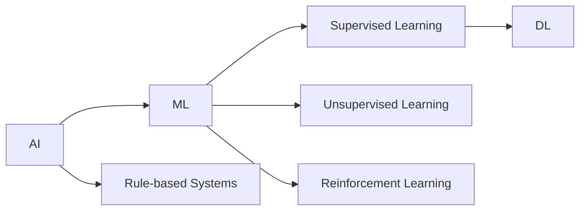

                 

**企业转型中的AI应用技术**

**作者：禅与计算机程序设计艺术 / Zen and the Art of Computer Programming**

## 1. 背景介绍

在当今数字化转型的大背景下，企业纷纷寻求人工智能（AI）技术的应用，以提高效率、降低成本，并获得竞争优势。然而，成功地将AI集成到企业运作中并非易事。本文旨在提供一条清晰的路径，帮助企业理解和应用AI技术，实现转型。

## 2. 核心概念与联系

### 2.1 AI、ML、DL的关系

AI（Artificial Intelligence）是指机器模拟人类智能行为的能力。机器学习（ML）是AI的一种，它允许机器从数据中学习，而不需要被明确编程。深度学习（DL）则是ML的一个子集，它使用神经网络模型来学习和做出决策。



### 2.2 AI在企业中的应用

AI在企业中的应用可以分为以下几类：

- **预测分析**：使用AI预测未来趋势，如销售额、客户需求等。
- **自动化**：使用AI自动化重复性任务，如客户服务、数据分析等。
- **决策支持**：使用AI提供数据驱动的决策支持，如产品推荐、风险评估等。

## 3. 核心算法原理 & 具体操作步骤

### 3.1 算法原理概述

本节将介绍两种常用的AI算法：线性回归和神经网络。

### 3.2 算法步骤详解

#### 3.2.1 线性回归

1. **数据收集**：收集相关特征的数据。
2. **特征工程**：处理缺失值、异常值，并进行特征选择。
3. **模型训练**：使用训练数据拟合线性回归模型。
4. **模型评估**：使用测试数据评估模型性能。
5. **预测**：使用训练好的模型进行预测。

#### 3.2.2 神经网络

1. **数据预处理**：同上。
2. **网络架构设计**：设计神经网络的层数和激活函数。
3. **模型训练**：使用训练数据训练神经网络。
4. **模型评估**：同上。
5. **预测**：同上。

### 3.3 算法优缺点

| 算法 | 优点 | 缺点 |
|---|---|---|
| 线性回归 | 简单、快速、易于理解 | 只适用于线性关系，不适合复杂关系 |
| 神经网络 | 适用于复杂关系，可自动学习特征 | 复杂、计算量大、易过拟合 |

### 3.4 算法应用领域

线性回归常用于预测分析，如销售额预测。神经网络则广泛应用于图像识别、语音识别等领域。

## 4. 数学模型和公式 & 详细讲解 & 举例说明

### 4.1 线性回归模型构建

线性回归模型的数学表达式为：

$$y = wx + b$$

其中，$y$是目标变量，$x$是特征变量，$w$和$b$是模型参数。

### 4.2 公式推导过程

模型参数$w$和$b$可以通过最小化误差平方和来求解：

$$\min_w, b \sum_{i=1}^{n} (y_i - wx_i - b)^2$$

### 4.3 案例分析与讲解

假设我们要预测销售额，特征变量$x$是广告支出，目标变量$y$是销售额。我们收集了100个样本，并使用线性回归模型进行预测。模型参数$w$和$b$分别为0.5和10000。这意味着每花费1单位的广告支出，销售额将增加0.5单位，而不花费任何广告支出时，销售额为10000单位。

## 5. 项目实践：代码实例和详细解释说明

### 5.1 开发环境搭建

本项目使用Python语言，并需要安装NumPy、Pandas、Matplotlib、Scikit-learn等库。

### 5.2 源代码详细实现

以下是线性回归的Python实现代码：

```python
import numpy as np
from sklearn.linear_model import LinearRegression
from sklearn.model_selection import train_test_split
from sklearn.metrics import mean_squared_error

# 读取数据
X = np.array([[1], [2], [3], [4], [5], [6], [7], [8], [9], [10]])
y = np.array([10000, 15000, 20000, 25000, 30000, 35000, 40000, 45000, 50000, 55000])

# 拆分数据集
X_train, X_test, y_train, y_test = train_test_split(X, y, test_size=0.2, random_state=42)

# 训练模型
model = LinearRegression()
model.fit(X_train, y_train)

# 预测
y_pred = model.predict(X_test)

# 评估模型
print('Mean Squared Error:', mean_squared_error(y_test, y_pred))
```

### 5.3 代码解读与分析

代码首先导入必要的库，并读取数据。然后，数据被拆分为训练集和测试集。线性回归模型被训练，并用于预测测试集的目标变量。最后，模型的性能通过均方误差（MSE）进行评估。

### 5.4 运行结果展示

运行代码后，输出的MSE值越小，模型的性能越好。

## 6. 实际应用场景

### 6.1 当前应用

AI技术已广泛应用于企业的各个领域，如客户服务、供应链管理、市场营销等。

### 6.2 未来应用展望

未来，AI技术将更加融入企业的运作中，如自动化决策、智能制造等。此外，AI技术还将帮助企业实现可持续发展，如碳排放预测和管理。

## 7. 工具和资源推荐

### 7.1 学习资源推荐

- Andrew Ng的机器学习课程（Coursera）
- Hands-On Machine Learning with Scikit-Learn, Keras, and TensorFlow（书籍）
- TensorFlow Playground（交互式神经网络可视化工具）

### 7.2 开发工具推荐

- Jupyter Notebook
- Google Colab
- PyCharm

### 7.3 相关论文推荐

- "Deep Learning" by Ian Goodfellow, Yoshua Bengio, and Aaron Courville
- "Artificial Intelligence: A Modern Approach" by Stuart Russell and Peter Norvig

## 8. 总结：未来发展趋势与挑战

### 8.1 研究成果总结

本文介绍了AI技术在企业转型中的应用，并提供了线性回归和神经网络的详细讲解。此外，还提供了项目实践的代码实例。

### 8.2 未来发展趋势

AI技术将继续发展，并更加融入企业的运作中。此外，AI技术还将帮助企业实现可持续发展。

### 8.3 面临的挑战

AI技术的应用面临着数据安全、算法偏见等挑战。企业需要建立严格的数据管理政策，并确保算法公平性。

### 8.4 研究展望

未来的研究将关注AI技术在企业转型中的更深入应用，如智能制造、自动化决策等。此外，还将关注AI技术在可持续发展中的应用。

## 9. 附录：常见问题与解答

**Q：AI技术需要大量数据吗？**

**A：**是的，AI技术通常需要大量数据来训练模型。然而，数据并不总是越多越好。质量高、相关性强的数据更为重要。

**Q：AI技术会取代人类工作吗？**

**A：**AI技术将改变工作性质，但不会完全取代人类工作。AI技术更多的是辅助人类工作，帮助人类做出更好的决策。

**Q：AI技术是否会导致就业岗位减少？**

**A：**AI技术的应用将导致一些岗位消失，但也会创造新的岗位。根据世界经济论坛的报告，到2025年，AI技术将创造9700万个新岗位，但也会消失8500万个岗位。

**作者：禅与计算机程序设计艺术 / Zen and the Art of Computer Programming**

