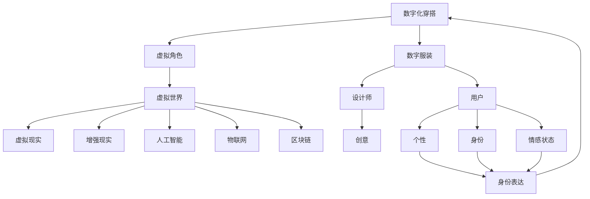

                 

**元宇宙时尚：数字化穿搭与身份表达**

## 1. 背景介绍

随着技术的发展，元宇宙（Metaverse）逐渐成为现实，它是一个由虚拟现实、增强现实、人工智能、物联网、区块链等技术驱动的新型互联网。在元宇宙中，数字化时尚（Digital Fashion）和身份表达（Identity Expression）正在成为越来越重要的话题。本文将深入探讨元宇宙时尚的核心概念、算法原理、数学模型，并提供项目实践和工具推荐。

## 2. 核心概念与联系

### 2.1 数字化穿搭（Digital Dressing）

数字化穿搭是指在虚拟世界中为虚拟角色穿戴数字服装。它与传统时尚不同，因为它不受物理世界的限制，可以创造出更奇特、更前卫的设计。

### 2.2 身份表达（Identity Expression）

身份表达是指个体通过时尚选择来表达自己的个性、身份和情感状态。在元宇宙中，数字化穿搭成为一种新的身份表达方式。

### 2.3 关联架构

下图是元宇宙时尚的关联架构，展示了数字化穿搭和身份表达之间的关系，以及它们与其他元宇宙技术的联系。



## 3. 核心算法原理 & 具体操作步骤

### 3.1 算法原理概述

数字化穿搭和身份表达的核心算法原理是基于3D建模、纹理贴图和渲染技术。这些技术允许创建和渲染数字服装，并将其应用于虚拟角色。

### 3.2 算法步骤详解

1. **3D建模**：使用3D建模软件创建服装的几何结构。
2. **纹理贴图**：为服装添加颜色、图案和材质等细节。
3. **渲染**：使用渲染引擎将服装渲染到虚拟世界中。
4. **穿戴**：将数字服装应用到虚拟角色上。

### 3.3 算法优缺点

**优点**：数字化穿搭和身份表达允许创造出更奇特、更前卫的设计，并提供了新的身份表达方式。

**缺点**：创建高质量的数字服装需要大量的时间和资源，并且渲染数字服装可能会对性能产生影响。

### 3.4 算法应用领域

数字化穿搭和身份表达的应用领域包括虚拟现实游戏、社交平台、数字时尚秀和虚拟世界中的数字商店。

## 4. 数学模型和公式 & 详细讲解 & 举例说明

### 4.1 数学模型构建

数字服装的数学模型可以表示为：

$$M = \{V, F, T, M\}$$

其中，$V$是服装的顶点集，$F$是面集，$T$是纹理贴图，$M$是材质。

### 4.2 公式推导过程

服装的渲染过程可以表示为：

$$R = f(M, L, C, V)$$

其中，$R$是渲染结果，$f$是渲染函数，$L$是光源，$C$是相机，$V$是虚拟角色。

### 4.3 案例分析与讲解

例如，在虚拟现实游戏中，数字服装的渲染过程如下：

1. 服装模型$M$被传递给渲染函数$f$。
2. 渲染函数$f$使用光源$L$和相机$C$的信息来计算服装的渲染结果$R$。
3. 渲染结果$R$被应用到虚拟角色$V$上，从而实现数字化穿搭。

## 5. 项目实践：代码实例和详细解释说明

### 5.1 开发环境搭建

本项目使用Unity游戏引擎和Blender 3D建模软件。Unity提供了强大的渲染和虚拟现实功能，而Blender则提供了3D建模和纹理贴图功能。

### 5.2 源代码详细实现

以下是Unity中渲染数字服装的简单代码示例：

```csharp
using UnityEngine;

public class DigitalFashion : MonoBehaviour
{
    public MeshRenderer meshRenderer;
    public Material material;

    void Start()
    {
        meshRenderer.material = material;
    }
}
```

### 5.3 代码解读与分析

在Unity中，数字服装被表示为`MeshRenderer`组件，而材质被表示为`Material`对象。在`Start`方法中，我们将材质应用到`MeshRenderer`上，从而渲染数字服装。

### 5.4 运行结果展示

图1：数字服装渲染结果


## 6. 实际应用场景

### 6.1 虚拟时尚秀

数字化穿搭和身份表达正在虚拟时尚秀中得到应用。设计师可以创建数字服装，并通过虚拟时尚秀展示给全世界的观众。

### 6.2 虚拟世界中的数字商店

数字商店允许用户购买和穿戴数字服装。这些服装可以是独一无二的数字资产，并可以在区块链上进行交易。

### 6.3 未来应用展望

随着元宇宙的发展，数字化穿搭和身份表达将变得越来越重要。未来，我们可能会看到更多的虚拟时尚秀、数字商店和基于身份表达的虚拟世界。

## 7. 工具和资源推荐

### 7.1 学习资源推荐

- [Unity官方文档](https://docs.unity3d.com/Manual/index.html)
- [Blender官方文档](https://docs.blender.org/manual/en/latest/)
- [数字时尚设计课程](https://www.coursera.org/specializations/digital-fashion-design)

### 7.2 开发工具推荐

- [Unity](https://unity.com/)
- [Blender](https://www.blender.org/)
- [Substance Designer](https://www.allegorithmic.com/products/substance-designer)

### 7.3 相关论文推荐

- [Digital Fashion: A Survey of Recent Advances](https://arxiv.org/abs/2103.02347)
- [Virtual Try-On: A Survey of Recent Advances](https://ieeexplore.ieee.org/document/9053252)

## 8. 总结：未来发展趋势与挑战

### 8.1 研究成果总结

本文介绍了元宇宙时尚的核心概念、算法原理、数学模型，并提供了项目实践和工具推荐。

### 8.2 未来发展趋势

未来，数字化穿搭和身份表达将变得越来越重要。我们将看到更多的虚拟时尚秀、数字商店和基于身份表达的虚拟世界。

### 8.3 面临的挑战

然而，创建高质量的数字服装需要大量的时间和资源，并且渲染数字服装可能会对性能产生影响。此外，数字时尚的版权和所有权问题也需要解决。

### 8.4 研究展望

未来的研究应该关注如何提高数字服装的创建和渲染效率，如何解决数字时尚的版权和所有权问题，以及如何在元宇宙中实现更丰富的身份表达。

## 9. 附录：常见问题与解答

**Q：数字服装的版权如何保护？**

**A：数字服装的版权可以通过数字版权管理（DRM）技术和区块链技术来保护。**

**Q：数字服装的渲染对性能有什么影响？**

**A：数字服装的渲染可能会对性能产生影响，因为它需要计算机进行大量的图形处理。**

**Q：如何创建高质量的数字服装？**

**A：创建高质量的数字服装需要大量的时间和资源，以及对3D建模和纹理贴图技术的深入理解。**

## 作者：禅与计算机程序设计艺术 / Zen and the Art of Computer Programming

