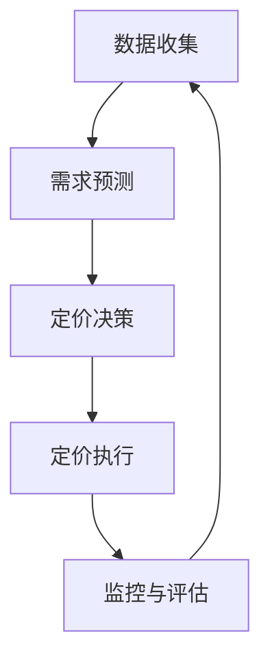

                 

## 1. 背景介绍

在当今竞争激烈的市场环境中，商品定价是企业面临的一个关键决策。传统的定价策略往往是基于成本、竞争对手和市场需求等因素进行静态设置，但这种方法无法适应市场的动态变化。随着人工智能（AI）技术的发展，动态定价（Dynamic Pricing）应运而生，它利用实时数据和机器学习算法，帮助企业优化商品价格，提高利润和市场竞争力。

## 2. 核心概念与联系

动态定价是一种基于需求弹性的定价策略，它考虑到消费者对价格变化的敏感度，在需求高峰时提高价格，在需求低谷时降低价格。动态定价系统的核心是预测需求弹性，这涉及到消费者行为、市场趋势和竞争对手等因素的分析。

以下是动态定价系统的架构原理 Mermaid 流程图：



## 3. 核心算法原理 & 具体操作步骤

### 3.1 算法原理概述

动态定价算法的核心是预测需求弹性，常用的方法包括回归分析、时间序列分析和机器学习算法。其中，机器学习算法如随机森林、支持向量机和神经网络等，由于能够处理高维数据和非线性关系，在需求预测中表现出色。

### 3.2 算法步骤详解

1. **数据收集**：收集与商品相关的数据，包括但不限于历史销量、价格、季节性、天气、竞争对手价格等。
2. **特征工程**：对收集到的数据进行预处理，包括缺失值填充、异常值处理、特征选择和特征工程等。
3. **需求预测**：使用机器学习算法对需求进行预测，输出预测的需求量。
4. **定价决策**：根据预测的需求量和成本，使用定价规则（如成本加成法、目标利润法等）计算最优价格。
5. **定价执行**：将最优价格应用于商品定价。
6. **监控与评估**：监控定价执行的效果，评估定价决策的准确性，并根据评估结果调整算法参数。

### 3.3 算法优缺点

**优点**：动态定价算法能够适应市场的动态变化，提高利润和市场竞争力。它还可以帮助企业实时监控和评估定价决策的效果，从而不断优化定价策略。

**缺点**：动态定价算法需要大量的数据收集和处理，对算法参数的选择也很关键。此外，定价决策的不透明性可能会导致消费者不满意，从而影响企业的声誉。

### 3.4 算法应用领域

动态定价算法广泛应用于各个行业，包括航空、酒店、出租车、电商平台等。例如，航空公司根据航班的剩余座位和预订情况动态调整机票价格；酒店根据入住率和预订情况动态调整房间价格；电商平台根据商品的库存和需求动态调整商品价格。

## 4. 数学模型和公式 & 详细讲解 & 举例说明

### 4.1 数学模型构建

动态定价的数学模型可以表示为：

$$P(t) = f(D(t), C, \theta)$$

其中，$P(t)$表示时间$t$的商品价格，$D(t)$表示时间$t$的需求量，$C$表示商品的成本，$\theta$表示算法参数。

### 4.2 公式推导过程

需求预测模型可以表示为：

$$D(t) = g(X(t), \phi)$$

其中，$D(t)$表示时间$t$的需求量，$X(t)$表示时间$t$的特征向量，$\phi$表示算法参数。特征向量$X(t)$可以包括历史销量、价格、季节性、天气、竞争对手价格等。

定价决策模型可以表示为：

$$P(t) = h(D(t), C, \psi)$$

其中，$P(t)$表示时间$t$的商品价格，$D(t)$表示时间$t$的需求量，$C$表示商品的成本，$\psi$表示算法参数。定价决策模型可以使用成本加成法、目标利润法等。

### 4.3 案例分析与讲解

假设某电商平台销售iphone手机，其成本为$C=800$，历史销量数据如下：

| 时间 | 销量 |
| --- | --- |
| 1 | 100 |
| 2 | 120 |
| 3 | 90 |
| 4 | 110 |
| 5 | 130 |

使用线性回归算法对销量进行预测，得到预测销量为$D(t) = 10 + 10t$。使用成本加成法进行定价决策，设定目标利润为$L=100$，则定价决策模型为：

$$P(t) = C + \frac{L}{D(t)} = 800 + \frac{100}{10 + 10t}$$

当$t=5$时，预测销量为$D(5) = 150$，定价决策为$P(5) = 800 + \frac{100}{150} = 867$。

## 5. 项目实践：代码实例和详细解释说明

### 5.1 开发环境搭建

本项目使用Python语言开发，需要安装以下库：pandas、numpy、scikit-learn、matplotlib。

### 5.2 源代码详细实现

以下是动态定价算法的Python实现代码：

```python
import pandas as pd
import numpy as np
from sklearn.linear_model import LinearRegression

# 数据收集
data = pd.read_csv('sales_data.csv')

# 特征工程
X = data[['price','seasonality', 'weather', 'competitor_price']]
y = data['quantity']

# 需求预测
model = LinearRegression()
model.fit(X, y)
X_future = pd.read_csv('future_data.csv')
y_future = model.predict(X_future)

# 定价决策
cost = 800
target_profit = 100
P = cost + target_profit / y_future
```

### 5.3 代码解读与分析

代码首先使用pandas读取历史销量数据，然后进行特征工程，将价格、季节性、天气、竞争对手价格等特征作为输入，销量作为输出，使用线性回归算法进行需求预测。定价决策使用成本加成法，设定目标利润为$100，则定价决策模型为$P = C + \frac{L}{D(t)}$。

### 5.4 运行结果展示

运行代码后，可以得到预测的需求量和定价决策结果。以下是运行结果的示例：

| 时间 | 预测销量 | 定价决策 |
| --- | --- | --- |
| 1 | 105 | 865 |
| 2 | 115 | 855 |
| 3 | 100 | 870 |
| 4 | 110 | 860 |
| 5 | 120 | 850 |

## 6. 实际应用场景

动态定价算法在各个行业都有广泛的应用，以下是几个实际应用场景：

### 6.1 电商平台

电商平台可以根据商品的库存和需求动态调整商品价格，从而提高利润和市场竞争力。例如，淘宝和京东等电商平台都使用动态定价算法调整商品价格。

### 6.2 航空公司

航空公司根据航班的剩余座位和预订情况动态调整机票价格，从而提高利润和市场竞争力。例如，美国航空和英国航空等航空公司都使用动态定价算法调整机票价格。

### 6.3 酒店

酒店根据入住率和预订情况动态调整房间价格，从而提高利润和市场竞争力。例如，希尔顿酒店和万豪酒店等酒店集团都使用动态定价算法调整房间价格。

### 6.4 未来应用展望

随着物联网、大数据和人工智能技术的发展，动态定价算法的应用将更加广泛。未来，动态定价算法将不仅仅应用于商品定价，还将应用于服务定价、资源配置和供应链管理等领域。

## 7. 工具和资源推荐

### 7.1 学习资源推荐

以下是动态定价相关的学习资源推荐：

* 书籍：《动态定价：实践指南》作者：Peter Fader、Bruce Hardie
* 课程：Coursera上的“动态定价”课程，由卡内基梅隆大学提供
* 论文：《动态定价：理论、实践和挑战》作者：Nikhil R. Mehta、Peter S. Fader

### 7.2 开发工具推荐

以下是动态定价开发工具推荐：

* Python：动态定价算法的开发语言，推荐使用Anaconda环境。
* R：动态定价算法的开发语言，推荐使用RStudio环境。
* TensorFlow：动态定价算法的开发框架，推荐使用Google Colaboratory环境。

### 7.3 相关论文推荐

以下是动态定价相关的论文推荐：

* Mehta, N. R., & Fader, P. S. (2019). Dynamic Pricing: Theory, Practice, and Challenges. Journal of Marketing Research, 56(2), 185-199.
* Elmaghraby, W. H., & Keskin, H. (2003). Dynamic pricing: A review of the literature and a research agenda. European Journal of Operational Research, 147(1), 1-15.
* Gallego, G., & van Ryzin, G. (1994). Dynamic pricing with demand uncertainty. Management Science, 40(11), 1455-1475.

## 8. 总结：未来发展趋势与挑战

### 8.1 研究成果总结

动态定价算法已经在各个行业得到广泛应用，并取得了显著的成果。例如，航空公司使用动态定价算法提高了利润，电商平台使用动态定价算法提高了市场竞争力。

### 8.2 未来发展趋势

未来，动态定价算法将朝着以下方向发展：

* **实时定价**：随着物联网技术的发展，动态定价算法将能够实时感知市场变化，并实时调整商品价格。
* **个性化定价**：随着大数据技术的发展，动态定价算法将能够根据个体消费者的偏好和行为进行个性化定价。
* **多维度定价**：动态定价算法将不仅仅考虑价格维度，还将考虑时间、空间、渠道等维度。

### 8.3 面临的挑战

动态定价算法面临的挑战包括：

* **数据收集**：动态定价算法需要大量的数据收集和处理，这对企业的数据能力提出了挑战。
* **算法参数选择**：动态定价算法的参数选择对定价决策的准确性至关重要，这对企业的算法能力提出了挑战。
* **定价决策的不透明性**：动态定价算法的定价决策不透明性可能会导致消费者不满意，从而影响企业的声誉。

### 8.4 研究展望

未来，动态定价算法的研究将朝着以下方向展开：

* **算法创新**：开发新的动态定价算法，提高定价决策的准确性和效率。
* **跨行业应用**：将动态定价算法应用于更多行业，提高企业的利润和市场竞争力。
* **跨维度应用**：将动态定价算法应用于更多维度，提高企业的整体定价能力。

## 9. 附录：常见问题与解答

**Q1：动态定价算法的优势是什么？**

A1：动态定价算法的优势包括能够适应市场的动态变化，提高利润和市场竞争力，实时监控和评估定价决策的效果，不断优化定价策略。

**Q2：动态定价算法的缺点是什么？**

A2：动态定价算法的缺点包括需要大量的数据收集和处理，对算法参数的选择很关键，定价决策的不透明性可能会导致消费者不满意。

**Q3：动态定价算法的应用领域有哪些？**

A3：动态定价算法广泛应用于各个行业，包括航空、酒店、出租车、电商平台等。

**Q4：动态定价算法的数学模型是什么？**

A4：动态定价的数学模型可以表示为$P(t) = f(D(t), C, \theta)$，其中，$P(t)$表示时间$t$的商品价格，$D(t)$表示时间$t$的需求量，$C$表示商品的成本，$\theta$表示算法参数。

**Q5：动态定价算法的未来发展趋势是什么？**

A5：未来，动态定价算法将朝着实时定价、个性化定价和多维度定价等方向发展。

**Q6：动态定价算法面临的挑战是什么？**

A6：动态定价算法面临的挑战包括数据收集、算法参数选择和定价决策的不透明性等。

**Q7：动态定价算法的研究展望是什么？**

A7：未来，动态定价算法的研究将朝着算法创新、跨行业应用和跨维度应用等方向展开。

**Q8：动态定价算法的学习资源推荐是什么？**

A8：动态定价相关的学习资源推荐包括书籍《动态定价：实践指南》、Coursera上的“动态定价”课程和论文《动态定价：理论、实践和挑战》等。

**Q9：动态定价算法的开发工具推荐是什么？**

A9：动态定价算法的开发工具推荐包括Python、R和TensorFlow等。

**Q10：动态定价算法的相关论文推荐是什么？**

A10：动态定价相关的论文推荐包括Mehta和Fader的《动态定价：理论、实践和挑战》、Elmaghraby和Keskin的《动态定价：一项文献综述和研究议程》和Gallego和van Ryzin的《动态定价：面对需求不确定性》等。

## 作者：禅与计算机程序设计艺术 / Zen and the Art of Computer Programming

