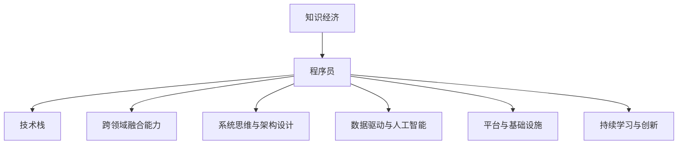

                 

# 知识经济下程序员的职业转型之路

> 关键词：知识经济,程序员,职业转型,技术栈,深度学习,人工智能,大数据,云计算,DevOps

## 1. 背景介绍

### 1.1 问题由来

进入21世纪以来，人类社会逐步迈向知识经济时代。知识经济，又称为信息经济或智能经济，是以知识资源为关键要素，以智力为主要驱动力，以信息技术和网络通信为支撑的经济形态。与传统经济以物质生产为主导不同，知识经济更加依赖于知识和技术的创新应用，强调信息和知识资源的深度挖掘与整合。

在知识经济背景下，IT行业经历了翻天覆地的变化。软件开发逐渐从传统的定制化开发转向通用化、组件化的平台开发。传统程序员的技能也逐步从简单的编程实现向深层次的技术架构设计和业务解决方案咨询转变。

### 1.2 问题核心关键点

知识经济对程序员提出了更高的要求：

1. **跨领域融合能力**：程序员需要具备多种技术栈和行业知识，综合解决跨领域问题。
2. **系统思维与架构设计**：不仅要求技术熟练，更需要具备系统思维，能够设计和优化复杂系统架构。
3. **数据驱动与人工智能**：需要掌握大数据与人工智能技术，以数据驱动业务决策，提升系统智能性。
4. **平台与基础设施**：需要熟悉云计算、容器化、DevOps等平台与基础设施，保证系统稳定、高效运行。
5. **持续学习与创新**：技术更新速度快，程序员需要不断学习新技术，创新解决方案。

### 1.3 问题研究意义

研究程序员在知识经济下的职业转型之路，具有以下重要意义：

1. **提升竞争力**：帮助程序员通过学习新技术、拓展知识面，提升在知识经济时代的职业竞争力。
2. **促进行业发展**：通过技术栈和行业知识的全面整合，加速行业技术进步与创新应用。
3. **支撑产业升级**：知识经济对传统行业进行数字化、智能化升级，需要大量具备跨领域综合能力的人才支持。
4. **推动经济增长**：IT技术的深度应用将带来新的商业模式和产业形态，对经济发展产生重要推动作用。

## 2. 核心概念与联系

### 2.1 核心概念概述

为了更好地理解程序员在知识经济下的职业转型，需要理解以下核心概念：

- **知识经济**：以知识和信息为核心的经济形态，强调知识资源的深度挖掘与整合。
- **程序员**：从事软件开发与系统设计的专业技术人员，是知识经济时代的重要力量。
- **技术栈**：程序员掌握的各种编程语言、开发框架、库函数等技术资源的集合。
- **跨领域融合能力**：程序员将多种技术栈与行业知识融合，解决复杂问题。
- **系统思维与架构设计**：从系统层面对复杂问题进行分析和设计，优化系统架构。
- **数据驱动与人工智能**：以数据为基础，利用人工智能技术提升系统智能性。
- **平台与基础设施**：熟悉云计算、容器化、DevOps等平台与基础设施，保证系统稳定、高效运行。
- **持续学习与创新**：不断学习新技术，持续创新解决方案，跟上技术发展步伐。

### 2.2 核心概念原理和架构的 Mermaid 流程图



通过这个流程图，可以看出知识经济对程序员提出了多个维度的要求。程序员不仅需要掌握多样化的技术栈，还需要将技术、业务、数据、平台等多个方面进行全面整合，持续学习和创新，才能适应知识经济的发展趋势。

## 3. 核心算法原理 & 具体操作步骤
### 3.1 算法原理概述

在知识经济背景下，程序员的职业转型涉及多方面的知识与技术，如深度学习、人工智能、大数据、云计算、DevOps等。这些技术虽然各自独立，但核心原理和方法有共通之处，都遵循以下基本算法原理：

1. **数据驱动**：以数据为基础，通过机器学习、数据分析等方法，提升系统智能性。
2. **算法优化**：通过算法优化，提升系统性能，降低复杂度。
3. **模型设计**：构建合适的模型结构，实现系统功能的优化。
4. **平台选择**：选择适合的云计算平台、开发平台、部署平台，提升系统可用性和可扩展性。
5. **持续迭代**：通过迭代优化，不断改进系统性能和用户体验。

### 3.2 算法步骤详解

程序员在知识经济下的职业转型，一般包括以下关键步骤：

**Step 1: 技术栈整合**

程序员需要掌握多种技术栈，并将它们进行整合，构建适应知识经济需求的多元化技术能力。例如：

- **编程语言**：熟练掌握多种编程语言，如Python、Java、JavaScript等。
- **开发框架**：熟悉主流开发框架，如Spring、Django、React等。
- **库函数**：掌握常用的库函数和工具，如TensorFlow、PyTorch、Flask等。
- **行业知识**：了解所在行业的业务知识和应用场景，如金融、医疗、教育等。

**Step 2: 系统架构设计**

程序员需要具备系统思维，能够设计和优化复杂系统的架构。例如：

- **微服务架构**：将系统分解为多个微服务，提升系统的可扩展性和可维护性。
- **分布式架构**：设计分布式系统架构，提高系统的高可用性和容错性。
- **模块化设计**：实现系统模块化设计，提升代码复用性和可维护性。

**Step 3: 数据驱动与人工智能**

程序员需要掌握数据驱动和人工智能技术，利用数据提升系统智能性。例如：

- **大数据技术**：熟悉Hadoop、Spark等大数据处理技术，处理海量数据。
- **机器学习**：掌握机器学习算法，如回归、分类、聚类等。
- **深度学习**：了解深度学习框架，如TensorFlow、PyTorch，应用深度学习模型。
- **人工智能应用**：熟悉人工智能应用，如自然语言处理、图像识别、推荐系统等。

**Step 4: 平台与基础设施**

程序员需要熟悉云计算、容器化、DevOps等平台与基础设施，保证系统稳定、高效运行。例如：

- **云计算平台**：熟悉AWS、Google Cloud、阿里云等主要云计算平台。
- **容器化技术**：掌握Docker、Kubernetes等容器化技术，实现系统部署和运维。
- **DevOps实践**：熟悉CI/CD流程，使用Jenkins、GitLab等DevOps工具，实现自动化测试和部署。

**Step 5: 持续学习与创新**

程序员需要不断学习新技术，持续创新解决方案。例如：

- **在线学习**：通过Coursera、Udacity等在线平台，学习新技术。
- **技术社区**：参与技术社区，如GitHub、Stack Overflow，获取最新技术动态。
- **项目实践**：参与实际项目，积累经验，提升技能。
- **技术创新**：探索新技术和新方法，推动技术创新。

### 3.3 算法优缺点

知识经济下程序员的职业转型，有其独特的优势和劣势：

**优势：**

1. **多维度能力**：掌握多方面的技术栈和行业知识，具备跨领域综合能力。
2. **技术创新**：不断学习新技术，推动技术创新，提升竞争力。
3. **平台支持**：熟悉云计算、容器化等平台与基础设施，保障系统稳定高效。

**劣势：**

1. **学习成本高**：需要学习多种技术栈和行业知识，学习成本较高。
2. **知识更新快**：技术更新速度快，需要不断学习和跟进，知识更新压力大。
3. **资源需求大**：需要大量计算资源和数据支持，资源需求较大。

### 3.4 算法应用领域

程序员在知识经济下的职业转型，涉及多个应用领域，例如：

1. **智能客服系统**：使用人工智能技术，构建智能客服系统，提升客户满意度。
2. **金融舆情监测**：利用大数据和机器学习技术，实时监测金融舆情，预警风险。
3. **个性化推荐系统**：利用深度学习和大数据技术，实现个性化推荐，提升用户体验。
4. **智慧医疗系统**：应用人工智能和数据驱动技术，构建智慧医疗系统，提高医疗服务水平。
5. **智能制造系统**：结合工业互联网和大数据技术，构建智能制造系统，优化生产流程。
6. **智慧城市治理**：应用人工智能和云计算技术，构建智慧城市治理系统，提升城市管理水平。

## 4. 数学模型和公式 & 详细讲解 & 举例说明

### 4.1 数学模型构建

程序员在知识经济下的职业转型，需要掌握多种数学模型，如线性回归、逻辑回归、决策树等。以下是几种常见数学模型的构建过程：

- **线性回归模型**：假设样本数据集为 $(x_i, y_i)$，其中 $x_i \in \mathbb{R}^n$，$y_i \in \mathbb{R}$。定义线性回归模型为 $y = wx + b$，其中 $w \in \mathbb{R}^n$，$b \in \mathbb{R}$。根据最小二乘法，求解 $w$ 和 $b$：

$$
\begin{align*}
\hat{w} &= (\mathbf{X}^T \mathbf{X})^{-1} \mathbf{X}^T \mathbf{y} \\
\hat{b} &= \bar{y} - \hat{w} \bar{x}
\end{align*}
$$

其中 $\mathbf{X} = [x_1, x_2, \cdots, x_n]$，$\bar{x} = \frac{1}{N} \sum_{i=1}^N x_i$，$\bar{y} = \frac{1}{N} \sum_{i=1}^N y_i$。

- **逻辑回归模型**：假设样本数据集为 $(x_i, y_i)$，其中 $x_i \in \mathbb{R}^n$，$y_i \in \{0, 1\}$。定义逻辑回归模型为 $P(y=1|x) = \frac{1}{1+\exp(-z)}$，其中 $z = wx + b$。根据最大似然估计法，求解 $w$ 和 $b$：

$$
\begin{align*}
\hat{w} &= (\mathbf{X}^T \mathbf{X})^{-1} \mathbf{X}^T \mathbf{y} \\
\hat{b} &= \bar{y} - \hat{w} \bar{x}
\end{align*}
$$

其中 $\mathbf{X} = [x_1, x_2, \cdots, x_n]$，$\bar{x} = \frac{1}{N} \sum_{i=1}^N x_i$，$\bar{y} = \frac{1}{N} \sum_{i=1}^N y_i$。

- **决策树模型**：假设样本数据集为 $(x_i, y_i)$，其中 $x_i \in \mathbb{R}^n$，$y_i \in \{0, 1\}$。定义决策树模型为：

$$
\begin{align*}
T &= \left\{ t = \{ (x, y) \in D \mid x \in R_t, y = T(x) \}, \right. \\
& \left. \quad \; R_t \subseteq \mathbb{R}^n, T: \mathbb{R}^n \rightarrow \{0, 1\} \right\}
\end{align*}
$$

其中 $D$ 为样本数据集。根据信息增益法，选择最优特征 $x_j$ 和最优阈值 $t_j$ 进行分裂：

$$
\begin{align*}
g(x_j, t_j) &= \frac{1}{|D|} \sum_{(x, y) \in D} \mathbb{I}(x \in R_j) \cdot \log \frac{p(x \in R_j|y=1)}{p(x \in R_j)} \\
& \quad + \frac{1}{|D|} \sum_{(x, y) \in D} \mathbb{I}(x \in R_j) \cdot \log \frac{p(x \in R_j|y=0)}{p(x \in R_j)}
\end{align*}
$$

其中 $\mathbb{I}(\cdot)$ 为示性函数，$p(x \in R_j|y)$ 为在 $y$ 的条件下 $x$ 属于 $R_j$ 的概率。

### 4.2 公式推导过程

以下是几种常见数学模型的公式推导过程：

- **线性回归模型**：

$$
\begin{align*}
\hat{y} &= wx + b \\
&= \hat{w} x + \hat{b}
\end{align*}
$$

- **逻辑回归模型**：

$$
\begin{align*}
P(y=1|x) &= \frac{1}{1+\exp(-z)} \\
&= \frac{1}{1+\exp(-(wx + b))}
\end{align*}
$$

- **决策树模型**：

$$
\begin{align*}
T &= \left\{ t = \{ (x, y) \in D \mid x \in R_t, y = T(x) \}, \right. \\
& \left. \quad \; R_t \subseteq \mathbb{R}^n, T: \mathbb{R}^n \rightarrow \{0, 1\} \right\}
\end{align*}
$$

其中 $R_t$ 为样本点 $x$ 属于特征集合 $R_t$ 的区域，$T(x)$ 为区域 $R_t$ 内的样本点的预测标签。

### 4.3 案例分析与讲解

这里以线性回归模型的实际应用为例，讲解数学模型的应用过程。

假设某房地产公司想要预测房价与房屋面积之间的关系，通过收集历史房价和房屋面积数据，使用线性回归模型进行预测。具体步骤如下：

1. **数据预处理**：将房屋面积数据标准化，进行归一化处理。
2. **模型训练**：根据历史房价和房屋面积数据，构建线性回归模型，求解 $w$ 和 $b$。
3. **模型验证**：使用验证集对模型进行验证，计算误差和精度。
4. **模型应用**：将新房屋面积数据输入模型，预测房价。

通过以上步骤，可以有效地预测房价与房屋面积之间的关系，提升房地产公司的业务决策能力。

## 5. 项目实践：代码实例和详细解释说明

### 5.1 开发环境搭建

以下是使用Python进行TensorFlow开发的开发环境配置流程：

1. 安装Anaconda：从官网下载并安装Anaconda，用于创建独立的Python环境。

2. 创建并激活虚拟环境：
```bash
conda create -n tensorflow-env python=3.8 
conda activate tensorflow-env
```

3. 安装TensorFlow：根据CUDA版本，从官网获取对应的安装命令。例如：
```bash
conda install tensorflow -c pytorch -c conda-forge
```

4. 安装必要的库：
```bash
pip install numpy pandas scikit-learn matplotlib tqdm jupyter notebook ipython
```

完成上述步骤后，即可在`tensorflow-env`环境中开始TensorFlow项目的开发。

### 5.2 源代码详细实现

这里我们以线性回归模型的实现为例，给出一个TensorFlow的Python代码实现。

```python
import tensorflow as tf
import numpy as np

# 定义线性回归模型
def linear_regression_model(input_dim):
    # 定义模型参数
    w = tf.Variable(tf.random.normal([input_dim, 1]))
    b = tf.Variable(tf.random.normal([1]))
    
    # 定义前向传播函数
    def forward(x):
        return tf.matmul(x, w) + b
    
    return forward

# 加载数据
x = np.array([[2.0], [3.0], [4.0], [5.0]])
y = np.array([[5.0], [7.0], [9.0], [11.0]])

# 构建模型
model = linear_regression_model(input_dim=1)

# 定义损失函数和优化器
loss = tf.losses.mean_squared_error(y, model(x))
optimizer = tf.optimizers.SGD(learning_rate=0.01)

# 训练模型
for i in range(1000):
    with tf.GradientTape() as tape:
        loss_value = loss(y, model(x))
    grads = tape.gradient(loss_value, [w, b])
    optimizer.apply_gradients(zip(grads, [w, b]))
    
    if i % 100 == 0:
        print("Epoch {}, loss: {}".format(i, loss_value.numpy()))

# 预测新数据
x_new = np.array([[6.0]])
y_pred = model(x_new)

print("Predicted price: {}".format(y_pred.numpy()))
```

以上代码实现了基本的线性回归模型，并使用TensorFlow框架进行训练和预测。

### 5.3 代码解读与分析

下面我们详细解读一下关键代码的实现细节：

**模型定义**：
- `linear_regression_model`函数定义了线性回归模型的前向传播函数。

**数据加载**：
- `x`和`y`分别为房屋面积和房价的数据集。

**模型构建**：
- `model`为线性回归模型，使用`tf.Variable`定义模型参数`w`和`b`。

**损失函数和优化器**：
- `loss`为均方误差损失函数，`optimizer`为随机梯度下降优化器。

**模型训练**：
- 通过`tf.GradientTape`计算梯度，使用`optimizer.apply_gradients`更新模型参数。

**模型预测**：
- `x_new`为新的房屋面积数据，通过模型进行预测，输出`y_pred`。

通过以上代码，可以看出TensorFlow框架的高效性和简洁性。开发者可以方便地使用TensorFlow进行机器学习模型的构建、训练和预测。

## 6. 实际应用场景

### 6.1 智能客服系统

基于深度学习和人工智能技术的智能客服系统，可以大大提升客户服务体验和效率。传统的客服系统通常需要配备大量人力，成本高且响应速度慢。而智能客服系统通过学习大量历史客服数据，能够理解客户问题并自动回复，实现7x24小时不间断服务，提升客户满意度。

在技术实现上，可以采用深度学习模型，如BERT或GPT等，在大量客服对话数据上进行预训练，然后微调模型，适应具体业务场景。通过自然语言处理技术，智能客服系统能够自动理解客户意图，匹配最合适的回答模板进行回复。对于客户提出的新问题，还可以接入检索系统实时搜索相关内容，动态组织生成回答。

### 6.2 金融舆情监测

金融机构需要实时监测市场舆论动向，以便及时应对负面信息传播，规避金融风险。传统的人工监测方式成本高、效率低，难以应对网络时代海量信息爆发的挑战。基于深度学习和人工智能技术的文本分类和情感分析技术，为金融舆情监测提供了新的解决方案。

具体而言，可以收集金融领域相关的新闻、报道、评论等文本数据，并对其进行主题标注和情感标注。在此基础上对深度学习模型进行微调，使其能够自动判断文本属于何种主题，情感倾向是正面、中性还是负面。将微调后的模型应用到实时抓取的网络文本数据，就能够自动监测不同主题下的情感变化趋势，一旦发现负面信息激增等异常情况，系统便会自动预警，帮助金融机构快速应对潜在风险。

### 6.3 个性化推荐系统

当前的推荐系统往往只依赖用户的历史行为数据进行物品推荐，无法深入理解用户的真实兴趣偏好。基于深度学习和人工智能技术的个性化推荐系统，可以更好地挖掘用户行为背后的语义信息，从而提供更精准、多样的推荐内容。

在实践中，可以收集用户浏览、点击、评论、分享等行为数据，提取和用户交互的物品标题、描述、标签等文本内容。将文本内容作为模型输入，用户的后续行为（如是否点击、购买等）作为监督信号，在此基础上微调深度学习模型。微调后的模型能够从文本内容中准确把握用户的兴趣点。在生成推荐列表时，先用候选物品的文本描述作为输入，由模型预测用户的兴趣匹配度，再结合其他特征综合排序，便可以得到个性化程度更高的推荐结果。

### 6.4 未来应用展望

随着深度学习和人工智能技术的不断发展，基于深度学习模型的应用场景将越来越广泛。在知识经济时代，深度学习将在更多领域得到应用，为传统行业带来变革性影响。

在智慧医疗领域，基于深度学习技术的医学影像分析、病历分析、药物研发等应用将提升医疗服务的智能化水平，辅助医生诊疗，加速新药开发进程。

在智能教育领域，深度学习技术可应用于作业批改、学情分析、知识推荐等方面，因材施教，促进教育公平，提高教学质量。

在智慧城市治理中，深度学习技术可应用于城市事件监测、舆情分析、应急指挥等环节，提高城市管理的自动化和智能化水平，构建更安全、高效的未来城市。

此外，在企业生产、社会治理、文娱传媒等众多领域，深度学习技术的应用也将不断涌现，为经济社会发展注入新的动力。相信随着技术的日益成熟，深度学习技术将成为人工智能落地应用的重要范式，推动人工智能技术向更广阔的领域加速渗透。

## 7. 工具和资源推荐

### 7.1 学习资源推荐

为了帮助程序员系统掌握深度学习和大数据技术的理论基础和实践技巧，这里推荐一些优质的学习资源：

1. **深度学习课程**：如斯坦福大学的《CS231n: Convolutional Neural Networks for Visual Recognition》、《CS224n: Natural Language Processing with Deep Learning》等。
2. **大数据课程**：如Coursera的《Big Data Specialization》系列课程，涵盖Hadoop、Spark等大数据处理技术。
3. **开源项目**：如TensorFlow、PyTorch、Keras等深度学习框架，GitHub上的开源项目。
4. **技术博客**：如DeepLearning.ai的博客、Keras博客等，提供深度学习和大数据技术的最新动态和实践指南。
5. **技术社区**：如GitHub、Stack Overflow、Kaggle等，获取最新技术动态，参与项目开发和交流。

通过对这些资源的学习实践，相信你一定能够快速掌握深度学习和大数据技术的精髓，并用于解决实际的NLP问题。

### 7.2 开发工具推荐

高效的开发离不开优秀的工具支持。以下是几款用于深度学习和大数据开发的常用工具：

1. **TensorFlow**：Google开发的深度学习框架，功能强大，支持分布式计算。
2. **PyTorch**：Facebook开发的深度学习框架，易于使用，支持动态计算图。
3. **Keras**：高层次的深度学习框架，简洁易用，支持多种后端。
4. **Hadoop**：Apache开发的分布式大数据处理框架，支持海量数据存储和处理。
5. **Spark**：Apache开发的分布式大数据处理框架，支持内存计算和迭代计算。
6. **Jupyter Notebook**：交互式数据科学工具，支持代码编写、数据可视化、互动讨论等。

合理利用这些工具，可以显著提升深度学习和大数据开发的效率，加速创新迭代的步伐。

### 7.3 相关论文推荐

深度学习和大数据技术的快速发展，得益于学界的持续研究。以下是几篇奠基性的相关论文，推荐阅读：

1. **AlexNet**：ImageNet大规模视觉识别竞赛冠军，引入了卷积神经网络，奠定了深度学习在计算机视觉领域的地位。
2. **Google Brain团队关于BERT的论文**：提出BERT模型，引入基于掩码的自监督预训练任务，刷新了多项NLP任务SOTA。
3. **AlphaGo**：DeepMind开发的围棋人工智能程序，引入了深度强化学习技术，成为人工智能领域的重要里程碑。
4. **TensorFlow的论文**：Google开发的深度学习框架，提供了丰富的工具和算法支持，成为深度学习领域的主流框架之一。
5. **Keras的论文**：高层次的深度学习框架，支持多种后端和预训练模型，极大简化了深度学习模型的构建和训练。

这些论文代表了大数据和深度学习技术的发展脉络。通过学习这些前沿成果，可以帮助程序员把握学科前进方向，激发更多的创新灵感。

## 8. 总结：未来发展趋势与挑战

### 8.1 研究成果总结

通过以上分析，可以看出深度学习和大数据技术在知识经济时代的巨大潜力和应用前景。以下是深度学习和大数据技术的核心研究成果总结：

1. **深度学习模型**：卷积神经网络、循环神经网络、生成对抗网络等模型，在计算机视觉、自然语言处理等领域取得了突破性进展。
2. **大数据技术**：Hadoop、Spark等大数据处理框架，支持海量数据存储和处理，提升了数据分析的效率和精度。
3. **深度学习框架**：TensorFlow、PyTorch、Keras等框架，提供了丰富的工具和算法支持，简化了深度学习模型的构建和训练。
4. **分布式计算**：云计算、大数据集群、分布式计算框架等技术，支持大规模数据处理和模型训练，提升了系统的可扩展性和可用性。
5. **数据驱动决策**：深度学习和人工智能技术，帮助企业实现数据驱动决策，提升了业务决策的智能化水平。

### 8.2 未来发展趋势

展望未来，深度学习和大数据技术的发展趋势如下：

1. **模型规模增大**：随着计算资源的增加，深度学习模型的规模将进一步增大，提升系统的智能性和精度。
2. **算法优化**：新的算法和优化方法将不断涌现，提升深度学习模型的性能和效率。
3. **跨领域融合**：深度学习和大数据技术将更多地应用于其他领域，如医疗、金融、教育等，推动行业数字化转型。
4. **平台集成**：深度学习和大数据技术与云计算、物联网、区块链等平台将更紧密集成，提升系统的综合能力和应用价值。
5. **智能决策**：深度学习和人工智能技术将更多地应用于决策支持，提升系统的智能化水平和业务决策能力。

### 8.3 面临的挑战

尽管深度学习和大数据技术在知识经济时代发展迅速，但在应用过程中仍面临以下挑战：

1. **数据隐私和安全**：大规模数据处理和存储，带来了数据隐私和安全的风险。如何保护数据隐私，防止数据泄露，是重要的研究方向。
2. **计算资源消耗**：深度学习模型的计算资源消耗较大，需要大量的计算资源和电力支持，成本较高。
3. **模型可解释性**：深度学习模型的内部机制复杂，难以解释模型的决策过程，影响模型的可解释性和可信度。
4. **技术壁垒**：深度学习和大数据技术复杂度高，需要较高的技术门槛和专业技能。
5. **伦理和法律问题**：深度学习和大数据技术的应用，涉及伦理和法律问题，需要建立完善的规范和标准。

### 8.4 研究展望

面对深度学习和大数据技术所面临的挑战，未来的研究需要从以下几个方向进行突破：

1. **数据隐私和安全**：引入联邦学习、差分隐私等技术，保护数据隐私和安全性。
2. **计算资源优化**：优化模型结构，提升计算效率，降低资源消耗。
3. **模型可解释性**：引入可解释性算法和工具，增强模型的可解释性。
4. **技术普及**：降低技术门槛，提高技术普及率，推动深度学习和大数据技术的普及应用。
5. **伦理和法律规范**：制定完善的伦理和法律规范，保障技术应用的安全和合规。

## 9. 附录：常见问题与解答

**Q1：深度学习技术有哪些优缺点？**

A: 深度学习技术的优缺点如下：

**优点：**

1. **自动特征提取**：深度学习模型能够自动提取输入数据的特征，减少了手动特征工程的工作量。
2. **高精度**：深度学习模型在许多领域取得了比传统机器学习模型更高的精度。
3. **可扩展性**：深度学习模型可以通过增加层数和参数，提升模型的能力和性能。

**缺点：**

1. **计算资源消耗大**：深度学习模型的计算资源消耗较大，需要大量的计算资源和电力支持。
2. **模型复杂度高**：深度学习模型结构复杂，难以理解和解释模型的内部机制。
3. **数据需求高**：深度学习模型需要大量的标注数据进行训练，数据获取成本较高。
4. **过拟合风险高**：深度学习模型容易过拟合，需要采取相应的正则化措施。

**Q2：如何理解深度学习模型的训练过程？**

A: 深度学习模型的训练过程如下：

1. **前向传播**：将输入数据输入模型，通过模型参数进行前向传播，计算输出。
2. **损失计算**：计算输出与真实标签之间的损失函数。
3. **反向传播**：通过链式法则，计算损失函数对模型参数的梯度。
4. **参数更新**：根据梯度下降等优化算法，更新模型参数。
5. **重复迭代**：重复上述过程，直到模型收敛。

通过不断迭代优化，深度学习模型能够逐步学习到输入数据的复杂特征，提升模型的准确性和泛化能力。

**Q3：如何选择深度学习框架？**

A: 选择深度学习框架时，需要考虑以下几个方面：

1. **易用性**：框架是否易用，学习曲线是否陡峭。
2. **性能**：框架的性能是否稳定，是否支持分布式计算。
3. **社区支持**：框架是否有活跃的社区和丰富的文档支持。
4. **生态系统**：框架是否有丰富的预训练模型和工具支持。
5. **应用场景**：框架是否支持具体的应用场景，如计算机视觉、自然语言处理等。

综合考虑以上因素，可以选择适合自己需求和场景的深度学习框架。

**Q4：如何提升深度学习模型的泛化能力？**

A: 提升深度学习模型的泛化能力，需要采取以下措施：

1. **数据增强**：通过数据增强技术，增加训练集的多样性，提高模型的泛化能力。
2. **正则化**：使用L2正则化、Dropout等正则化技术，避免模型过拟合。
3. **早停**：通过早停技术，避免模型在训练集上过拟合。
4. **模型集成**：采用模型集成技术，如Bagging、Boosting等，提升模型的泛化能力。
5. **迁移学习**：利用预训练模型和迁移学习技术，提升模型的泛化能力。

通过以上措施，可以有效提升深度学习模型的泛化能力和应用效果。

**Q5：如何理解深度学习模型的梯度消失和梯度爆炸问题？**

A: 深度学习模型的梯度消失和梯度爆炸问题，是由于模型层数较深导致的：

1. **梯度消失**：当模型层数较深时，梯度在反向传播过程中逐渐变小，导致浅层网络的参数更新不足，深层网络的参数更新过于强烈，模型难以收敛。
2. **梯度爆炸**：当模型层数较深时，梯度在反向传播过程中逐渐变大，导致深层网络的参数更新过于强烈，模型难以稳定训练。

解决这些问题，可以采取以下措施：

1. **梯度截断**：使用梯度截断技术，防止梯度爆炸。
2. **激活函数选择**：选择适当的激活函数，如ReLU、LeakyReLU等，防止梯度消失。
3. **参数初始化**：选择适当的参数初始化方法，如Xavier初始化、He初始化等，防止梯度消失和梯度爆炸。
4. **批标准化**：使用批标准化技术，提高模型的训练速度和泛化能力。
5. **残差连接**：使用残差连接技术，提高模型的训练速度和泛化能力。

通过以上措施，可以有效解决深度学习模型的梯度消失和梯度爆炸问题，提升模型的训练效果和泛化能力。

---

作者：禅与计算机程序设计艺术 / Zen and the Art of Computer Programming

