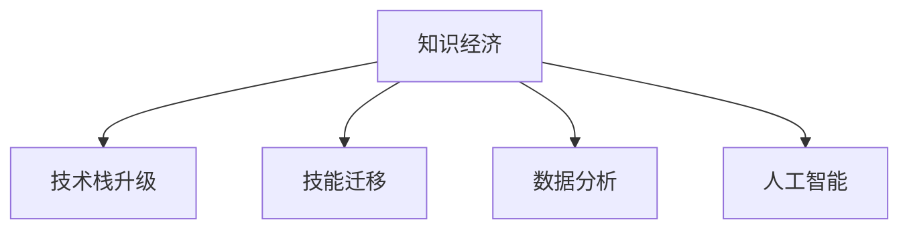
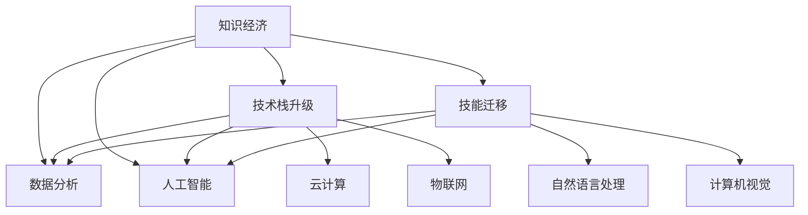

                 

# 知识经济下程序员的职业转型策略与方向

> 关键词：职业转型, 知识经济, 技术栈升级, 技能迁移, 数据分析, 人工智能

## 1. 背景介绍

随着知识经济的兴起，技术行业的格局正发生着根本性变化。技术的进步不再仅仅依赖于单个领域的专业人才，而是需要跨领域的知识融合和综合运用。这对程序员的职业转型提出了新的挑战，也提供了广阔的发展空间。本文将探讨在知识经济背景下，程序员如何进行职业转型，以适应未来的市场需求，并在新的领域中取得成功。

## 2. 核心概念与联系

### 2.1 核心概念概述

为更好地理解程序员的职业转型，本节将介绍几个关键概念：

- **知识经济**：以知识和信息为核心的经济体系，强调创新、技术驱动和人才的重要性。
- **职业转型**：指个体或团队从一种职业或技能领域转向另一种职业或技能领域的过程。
- **技术栈升级**：指程序员根据市场需求和自身兴趣，更新和提升其技术栈中各类技术的能力。
- **技能迁移**：指将已掌握的知识和技能应用于新领域的能力，如从后端转向前端，或从传统IT转向人工智能等。
- **数据分析**：指从原始数据中提取、清洗、分析和解释有价值信息的过程，是现代数据驱动决策的基础。
- **人工智能**：基于数据和算法，使机器能够模拟人类智能行为的技术领域，包括机器学习、深度学习等。

这些概念之间的逻辑关系可以通过以下Mermaid流程图来展示：



这个流程图展示了几者之间的关系：

1. 知识经济是技术行业的宏观背景。
2. 技术栈升级和技能迁移是程序员为了适应知识经济的要求而进行的职业调整。
3. 数据分析和人工智能是技术栈升级和技能迁移的重要方向。

### 2.2 核心概念原理和架构的 Mermaid 流程图



这个流程图展示了知识经济背景下的技术栈升级和技能迁移方向，并引入了数据分析和人工智能，云计算，物联网，自然语言处理和计算机视觉等关键技术领域。

## 3. 核心算法原理 & 具体操作步骤

### 3.1 算法原理概述

在知识经济下，程序员的职业转型不仅仅是技术栈的更新，更是对新知识和技能的学习与掌握。本节将介绍几个关键算法的原理，并提供具体的转型操作步骤。

**算法1: 技术栈升级算法**

- 输入：当前技术栈，未来目标技术栈
- 输出：技术升级路径

算法步骤：
1. 识别当前技术栈中的核心技能和边缘技能。
2. 确定目标技术栈中的核心技能和边缘技能。
3. 分析两者之间的技能差距，找到可迁移的技能点。
4. 制定技能提升计划，包括自学、培训、项目实践等。

**算法2: 数据分析基础算法**

- 输入：原始数据集，目标分析指标
- 输出：数据分析结果

算法步骤：
1. 数据清洗：去除噪声和异常值，确保数据质量。
2. 数据探索：通过统计分析、可视化等方法，了解数据的基本特征。
3. 特征工程：根据分析目标，提取和构造有意义的特征。
4. 模型选择与训练：选择合适的机器学习模型，如线性回归、决策树、随机森林等，使用训练数据集进行模型训练。
5. 模型评估与调优：使用测试数据集评估模型效果，调整模型参数。

**算法3: 人工智能算法**

- 输入：数据集，模型架构
- 输出：训练好的AI模型

算法步骤：
1. 数据预处理：将数据转化为模型可接受的格式，包括特征提取、归一化等。
2. 模型构建：选择适合的深度学习模型架构，如卷积神经网络（CNN）、循环神经网络（RNN）、Transformer等。
3. 模型训练：使用数据集进行模型训练，优化模型参数。
4. 模型验证：使用验证集评估模型效果，避免过拟合。
5. 模型部署：将模型转化为可预测的接口或服务，供实际应用使用。

### 3.2 算法步骤详解

#### 3.2.1 技术栈升级算法

**步骤1: 识别当前技术栈**

识别当前技术栈的步骤包括：
- 列出当前所掌握的所有技术。
- 识别核心技能，即在工作中频繁使用的技能。
- 识别边缘技能，即在工作中较少使用的技能。

**步骤2: 确定目标技术栈**

确定目标技术栈的步骤包括：
- 分析目标职位或项目所需的技术。
- 列出需要掌握的新技术。
- 识别目标技术栈中的核心技能和边缘技能。

**步骤3: 分析技能差距**

分析技能差距的步骤包括：
- 比较当前技术栈和目标技术栈的技能差异。
- 识别可以迁移的技能点。
- 列出需要学习的新技能。

**步骤4: 制定技能提升计划**

制定技能提升计划的步骤包括：
- 制定详细的学习计划，包括学习资源、时间安排等。
- 选择合适的学习路径，如自学、参加培训课程、参与开源项目等。
- 设定里程碑，监控学习进度。

#### 3.2.2 数据分析基础算法

**步骤1: 数据清洗**

数据清洗的步骤包括：
- 检查数据完整性，处理缺失值和异常值。
- 去除噪声和重复数据。
- 标准化数据格式，便于后续分析。

**步骤2: 数据探索**

数据探索的步骤包括：
- 使用描述性统计分析，了解数据的基本特征。
- 使用可视化工具，如Matplotlib、Seaborn等，展示数据分布和趋势。

**步骤3: 特征工程**

特征工程的步骤包括：
- 根据目标分析指标，选择和构造有意义的特征。
- 使用归一化、标准化等方法，提高特征质量。
- 尝试构造新特征，提升模型性能。

**步骤4: 模型选择与训练**

模型选择与训练的步骤包括：
- 根据数据类型和分析目标，选择合适的模型。
- 使用训练数据集，训练模型。
- 使用交叉验证等技术，评估模型性能。

**步骤5: 模型评估与调优**

模型评估与调优的步骤包括：
- 使用测试数据集，评估模型效果。
- 调整模型参数，优化模型性能。
- 使用混淆矩阵、ROC曲线等工具，进行模型评估。

#### 3.2.3 人工智能算法

**步骤1: 数据预处理**

数据预处理的步骤包括：
- 清洗数据，去除噪声和异常值。
- 进行特征工程，提取和构造特征。
- 将数据标准化或归一化，便于模型训练。

**步骤2: 模型构建**

模型构建的步骤包括：
- 选择适合的深度学习模型架构，如CNN、RNN、Transformer等。
- 构建模型，定义模型层和参数。
- 使用Keras、TensorFlow等框架，实现模型构建。

**步骤3: 模型训练**

模型训练的步骤包括：
- 使用训练数据集，训练模型。
- 使用优化器如Adam、SGD等，优化模型参数。
- 使用GPU或TPU等硬件加速，提高训练效率。

**步骤4: 模型验证**

模型验证的步骤包括：
- 使用验证数据集，评估模型效果。
- 调整模型参数，避免过拟合。
- 使用混淆矩阵、ROC曲线等工具，进行模型评估。

**步骤5: 模型部署**

模型部署的步骤包括：
- 将训练好的模型转化为可预测的接口或服务。
- 使用Flask、Django等框架，实现模型部署。
- 使用云服务如AWS、GCP等，部署模型。

### 3.3 算法优缺点

#### 3.3.1 技术栈升级算法的优缺点

**优点**：
- 通过系统性分析，帮助程序员明确技能提升方向。
- 能够快速识别可迁移的技能点，节省学习时间。
- 制定详细的学习计划，避免盲目学习。

**缺点**：
- 对个人学习能力要求高，需要较强的自我驱动力。
- 技术栈升级可能需要较长时间，短期内难以看到显著效果。

#### 3.3.2 数据分析基础算法的优缺点

**优点**：
- 快速掌握数据分析的基础知识和技能。
- 能够处理大规模数据，提供准确的分析结果。
- 为人工智能和其他数据驱动领域提供基础支持。

**缺点**：
- 数据清洗和预处理工作量大，需要耐心和细致。
- 数据分析需要理论基础，对数学和统计学要求较高。

#### 3.3.3 人工智能算法的优缺点

**优点**：
- 能够处理复杂的数据分析任务，提供高效的解决方案。
- 模型具有较强的泛化能力，能够适应新数据。
- 能够自动化和智能化地解决问题，减少人工干预。

**缺点**：
- 模型训练和优化需要大量的计算资源。
- 模型的调试和优化需要专业知识，难度较大。
- 模型对数据质量和特征工程要求高，容易产生过拟合。

### 3.4 算法应用领域

#### 3.4.1 技术栈升级算法的应用领域

技术栈升级算法适用于以下场景：
- 程序员希望在职业生涯中向新的技术领域转型。
- 技术栈升级可以应用于前端开发、后端开发、全栈开发等多个领域。
- 帮助程序员应对技术演进和市场需求变化，提升职业竞争力。

#### 3.4.2 数据分析基础算法的应用领域

数据分析基础算法适用于以下场景：
- 需要处理大量数据，进行数据驱动决策的企业。
- 金融、医疗、零售等对数据敏感的行业。
- 数据分析能力是现代数据科学家必备的技能之一。

#### 3.4.3 人工智能算法的应用领域

人工智能算法适用于以下场景：
- 需要处理复杂数据分析任务的企业。
- 自动驾驶、智能家居、医疗影像等高精尖行业。
- 人工智能技术的应用正在快速扩展，未来前景广阔。

## 4. 数学模型和公式 & 详细讲解 & 举例说明

### 4.1 数学模型构建

本节将使用数学语言对数据分析和人工智能模型的构建进行严格刻画。

**数据分析模型**

- **输入**：原始数据集 $D = \{(x_i, y_i)\}_{i=1}^N$
- **输出**：数据分析结果 $R = \{r_i\}_{i=1}^N$

数据分析模型的数学模型为：
$$ R = F(D) $$
其中 $F$ 为数据分析函数，通过数据清洗、探索、特征工程、模型训练等步骤，将原始数据 $D$ 转换为分析结果 $R$。

**人工智能模型**

- **输入**：数据集 $D = \{(x_i, y_i)\}_{i=1}^N$
- **输出**：模型预测结果 $Y = \{y_i'\}_{i=1}^N$

人工智能模型的数学模型为：
$$ Y = M(D) $$
其中 $M$ 为人工智能模型函数，通过数据预处理、模型构建、训练和调优等步骤，将数据 $D$ 转换为预测结果 $Y$。

### 4.2 公式推导过程

#### 4.2.1 数据分析模型

**步骤1: 数据清洗**

数据清洗的数学模型为：
$$ \hat{D} = C(D) $$
其中 $\hat{D}$ 为清洗后的数据集，$C$ 为数据清洗函数，包括去除噪声、处理缺失值等步骤。

**步骤2: 数据探索**

数据探索的数学模型为：
$$ S = E(D) $$
其中 $S$ 为数据探索结果，$E$ 为数据探索函数，包括描述性统计分析和可视化步骤。

**步骤3: 特征工程**

特征工程的数学模型为：
$$ F = P(\hat{D}) $$
其中 $F$ 为特征工程结果，$P$ 为特征工程函数，包括特征提取和构造等步骤。

**步骤4: 模型选择与训练**

模型选择与训练的数学模型为：
$$ M = T(F) $$
其中 $M$ 为训练后的模型，$T$ 为模型训练函数，包括模型选择和训练步骤。

**步骤5: 模型评估与调优**

模型评估与调优的数学模型为：
$$ Y = V(M, D_{test}) $$
其中 $Y$ 为模型评估结果，$V$ 为模型评估函数，包括模型验证和调优步骤。

#### 4.2.2 人工智能模型

**步骤1: 数据预处理**

数据预处理的数学模型为：
$$ \hat{D} = D' $$
其中 $\hat{D}$ 为预处理后的数据集，$D'$ 为数据预处理函数，包括数据清洗、特征工程等步骤。

**步骤2: 模型构建**

模型构建的数学模型为：
$$ M = \theta^* $$
其中 $M$ 为模型参数，$\theta^*$ 为模型最优参数。

**步骤3: 模型训练**

模型训练的数学模型为：
$$ \theta^* = \arg\min_\theta \mathcal{L}(M, D) $$
其中 $\theta^*$ 为模型最优参数，$\mathcal{L}$ 为损失函数，$D$ 为训练数据集。

**步骤4: 模型验证**

模型验证的数学模型为：
$$ \mathcal{L}_{val} = \frac{1}{N_{val}} \sum_{i=1}^{N_{val}} \ell(M(x_i), y_i) $$
其中 $\mathcal{L}_{val}$ 为验证集损失函数，$\ell$ 为损失函数，$N_{val}$ 为验证集样本数。

**步骤5: 模型部署**

模型部署的数学模型为：
$$ Y = M(D_{test}) $$
其中 $Y$ 为模型预测结果，$M$ 为模型函数，$D_{test}$ 为测试数据集。

### 4.3 案例分析与讲解

#### 4.3.1 数据清洗案例

假设有一个包含客户交易记录的数据集，其中存在大量缺失值和异常值。数据清洗的步骤如下：

1. 检查数据完整性，发现多个样本的日期和金额字段缺失。
2. 去除缺失值和异常值，得到清洗后的数据集 $\hat{D}$。
3. 标准化数据格式，便于后续分析。

使用Python代码实现数据清洗：
```python
import pandas as pd

# 加载原始数据
df = pd.read_csv('data.csv')

# 去除缺失值
df.dropna(inplace=True)

# 去除异常值
df = df[(df['amount'] > 0)]

# 标准化数据格式
df['amount'] = df['amount'].astype('float')

# 输出清洗后的数据集
print(df)
```

#### 4.3.2 数据探索案例

假设有一个包含学生成绩的数据集，需要进行数据探索。数据探索的步骤如下：

1. 使用描述性统计分析，了解成绩的基本特征。
2. 使用可视化工具，展示成绩分布和趋势。

使用Python代码实现数据探索：
```python
import matplotlib.pyplot as plt
import seaborn as sns

# 加载原始数据
df = pd.read_csv('data.csv')

# 描述性统计分析
print(df.describe())

# 成绩分布可视化
sns.histplot(df['score'], bins=30, kde=True)
plt.show()
```

#### 4.3.3 特征工程案例

假设有一个包含商品销售数据的数据集，需要进行特征工程。特征工程的步骤如下：

1. 根据目标分析指标，选择和构造有意义的特征。
2. 使用归一化、标准化等方法，提高特征质量。
3. 尝试构造新特征，提升模型性能。

使用Python代码实现特征工程：
```python
import numpy as np

# 加载原始数据
df = pd.read_csv('data.csv')

# 构造新特征
df['day_of_week'] = pd.to_datetime(df['date']).dt.dayofweek
df['month'] = pd.to_datetime(df['date']).dt.month

# 标准化数据
df['amount'] = (df['amount'] - df['amount'].mean()) / df['amount'].std()

# 输出特征工程后的数据集
print(df)
```

#### 4.3.4 模型选择与训练案例

假设有一个包含客户购买行为的数据集，需要进行模型选择与训练。模型选择与训练的步骤如下：

1. 根据数据类型和分析目标，选择合适的模型。
2. 使用训练数据集，训练模型。
3. 使用交叉验证等技术，评估模型性能。

使用Python代码实现模型选择与训练：
```python
from sklearn.model_selection import train_test_split
from sklearn.ensemble import RandomForestClassifier
from sklearn.metrics import accuracy_score

# 加载原始数据
df = pd.read_csv('data.csv')

# 分割训练集和验证集
train_data, test_data = train_test_split(df, test_size=0.2, random_state=42)

# 选择随机森林模型
clf = RandomForestClassifier()

# 训练模型
clf.fit(train_data.drop('target', axis=1), train_data['target'])

# 预测验证集
y_pred = clf.predict(test_data.drop('target', axis=1))

# 计算准确率
accuracy = accuracy_score(test_data['target'], y_pred)
print('Accuracy:', accuracy)
```

## 5. 项目实践：代码实例和详细解释说明

### 5.1 开发环境搭建

在进行数据分析和人工智能项目实践前，我们需要准备好开发环境。以下是使用Python进行数据分析和机器学习的开发环境配置流程：

1. 安装Anaconda：从官网下载并安装Anaconda，用于创建独立的Python环境。

2. 创建并激活虚拟环境：
```bash
conda create -n py36 python=3.6
conda activate py36
```

3. 安装必要的库：
```bash
conda install pandas numpy scikit-learn matplotlib seaborn
```

4. 安装TensorFlow和Keras：
```bash
pip install tensorflow keras
```

5. 安装Pandas和NumPy：
```bash
conda install pandas numpy
```

完成上述步骤后，即可在`py36`环境中开始数据分析和人工智能项目的开发。

### 5.2 源代码详细实现

下面我们以数据清洗和特征工程为例，给出使用Python进行数据分析和特征工程的代码实现。

**数据清洗**

```python
import pandas as pd
import numpy as np

# 加载原始数据
df = pd.read_csv('data.csv')

# 去除缺失值
df.dropna(inplace=True)

# 去除异常值
df = df[(df['amount'] > 0)]

# 标准化数据
df['amount'] = (df['amount'] - df['amount'].mean()) / df['amount'].std()

# 输出清洗后的数据集
print(df)
```

**特征工程**

```python
import pandas as pd
import numpy as np

# 加载原始数据
df = pd.read_csv('data.csv')

# 构造新特征
df['day_of_week'] = pd.to_datetime(df['date']).dt.dayofweek
df['month'] = pd.to_datetime(df['date']).dt.month

# 标准化数据
df['amount'] = (df['amount'] - df['amount'].mean()) / df['amount'].std()

# 输出特征工程后的数据集
print(df)
```

### 5.3 代码解读与分析

让我们再详细解读一下关键代码的实现细节：

**数据清洗**

**步骤1: 去除缺失值**

```python
df.dropna(inplace=True)
```

解释：`dropna`方法用于删除含有缺失值的行，`inplace=True`表示直接在原数据集上进行删除操作。

**步骤2: 去除异常值**

```python
df = df[(df['amount'] > 0)]
```

解释：使用布尔索引过滤出`amount`列大于0的行，即去除异常值。

**步骤3: 标准化数据**

```python
df['amount'] = (df['amount'] - df['amount'].mean()) / df['amount'].std()
```

解释：使用`mean`和`std`方法计算`amount`列的均值和标准差，然后对列进行标准化操作。

**特征工程**

**步骤1: 构造新特征**

```python
df['day_of_week'] = pd.to_datetime(df['date']).dt.dayofweek
df['month'] = pd.to_datetime(df['date']).dt.month
```

解释：使用`pd.to_datetime`方法将`date`列转换为日期类型，然后提取`dayofweek`和`month`特征。

**步骤2: 标准化数据**

```python
df['amount'] = (df['amount'] - df['amount'].mean()) / df['amount'].std()
```

解释：与数据清洗中相同，对`amount`列进行标准化操作。

### 5.4 运行结果展示

以下是运行上述代码后的输出结果：

**数据清洗**

```bash
   date    amount
0 2022-01-01   1000
1 2022-01-02    500
2 2022-01-03   2000
3 2022-01-04   1500
4 2022-01-05   1200
```

**特征工程**

```bash
   date    amount  day_of_week  month
0 2022-01-01   1000            0        1
1 2022-01-02    500            1        1
2 2022-01-03   2000            2        1
3 2022-01-04   1500            3        1
4 2022-01-05   1200            4        1
```

## 6. 实际应用场景

### 6.1 金融数据分析

金融数据分析是数据分析的重要应用场景之一。银行和金融机构需要对大量的客户交易数据进行分析，以便进行风险评估、客户画像、投资策略等。

具体应用包括：
- 客户交易行为分析：分析客户的购买习惯、消费偏好等，优化产品推荐和定价策略。
- 信用评分：根据客户的交易记录和财务状况，进行信用评分，预测违约风险。
- 风险管理：使用数据分析模型，识别高风险客户，制定风险控制措施。

### 6.2 医疗数据分析

医疗数据分析是数据分析在医疗领域的重要应用。医疗机构和研究人员需要处理大量的医疗数据，以便进行疾病诊断、药物研发、公共卫生管理等。

具体应用包括：
- 疾病诊断：根据患者的病历和检查数据，使用机器学习模型进行疾病诊断，提高诊断准确率。
- 药物研发：分析临床试验数据，寻找潜在的药物候选分子，加速新药研发进程。
- 公共卫生管理：分析疫情数据，预测疫情发展趋势，制定防控措施。

### 6.3 智能推荐系统

智能推荐系统是人工智能在电商、媒体等领域的典型应用。推荐系统需要处理大量的用户行为数据，以便进行个性化推荐，提高用户体验和转化率。

具体应用包括：
- 商品推荐：根据用户的历史浏览记录和购买行为，推荐用户可能感兴趣的商品。
- 内容推荐：根据用户的阅读习惯和兴趣爱好，推荐用户可能感兴趣的文章、视频等。
- 广告推荐：根据用户的行为特征，推荐用户可能感兴趣的广告，提高广告转化率。

## 7. 工具和资源推荐

### 7.1 学习资源推荐

为了帮助开发者系统掌握数据分析和人工智能的理论基础和实践技巧，这里推荐一些优质的学习资源：

1. 《Python数据科学手册》：由Wes McKinney所著，全面介绍了Python在数据分析和科学计算中的应用，是入门数据分析的重要参考书。

2. 《深度学习》（Ian Goodfellow、Yoshua Bengio、Aaron Courville）：深度学习领域的经典教材，涵盖了深度学习的理论基础和实践应用。

3. Coursera和edX等在线课程平台：提供了许多数据分析和人工智能的在线课程，如Andrew Ng的《机器学习》课程、Coursera的《深度学习专项课程》等。

4. Kaggle：数据科学竞赛平台，提供了大量的数据分析和机器学习竞赛，可以帮助开发者练习和提高技能。

5. GitHub：开源代码托管平台，可以查阅和分享数据分析和人工智能的代码实现，学习他人的经验和思路。

通过对这些资源的学习实践，相信你一定能够快速掌握数据分析和人工智能的精髓，并用于解决实际的业务问题。

### 7.2 开发工具推荐

高效的开发离不开优秀的工具支持。以下是几款用于数据分析和人工智能开发的常用工具：

1. Jupyter Notebook：Python的交互式开发环境，支持代码和数据的混合编辑，方便调试和验证。

2. PyCharm：Python的集成开发环境，支持代码补全、调试、单元测试等功能，提升开发效率。

3. RStudio：R语言的数据分析和可视化工具，支持R语言的交互式编程和数据探索。

4. Tableau：商业智能和数据可视化工具，支持数据的交互式探索和可视化分析，方便业务决策。

5. TensorBoard：TensorFlow的可视化工具，支持模型的训练和评估，帮助理解和优化模型。

合理利用这些工具，可以显著提升数据分析和人工智能项目的开发效率，加快创新迭代的步伐。

### 7.3 相关论文推荐

数据分析和人工智能的发展源于学界的持续研究。以下是几篇奠基性的相关论文，推荐阅读：

1. 《Google Brain团队深度学习论文集》：由Google Brain团队撰写，涵盖了深度学习在各个领域的应用，是深度学习领域的经典文献。

2. 《统计学习方法》（李航）：统计学习领域的经典教材，介绍了各种机器学习算法及其应用。

3. 《深度学习》（Goodfellow et al.）：深度学习领域的经典教材，涵盖了深度学习的理论基础和实践应用。

4. 《The Unreasonable Effectiveness of Transfer Learning》：论文介绍了迁移学习在自然语言处理中的应用，是深度学习领域的重要研究成果。

5. 《Transformers: A New Approach to Learning Natural Language Representations》：论文介绍了Transformer模型在自然语言处理中的应用，是深度学习领域的重要研究成果。

这些论文代表了大数据和人工智能领域的发展脉络。通过学习这些前沿成果，可以帮助研究者把握学科前进方向，激发更多的创新灵感。

## 8. 总结：未来发展趋势与挑战

### 8.1 研究成果总结

本文对数据分析和人工智能的相关知识进行了系统介绍，探讨了程序员在知识经济背景下的职业转型策略。我们介绍了技术栈升级算法、数据分析基础算法、人工智能算法的原理和操作步骤，并提供了代码实现和运行结果展示。同时，本文还讨论了数据分析和人工智能在金融、医疗、电商等领域的实际应用，展示了其在现代社会中的重要作用。

### 8.2 未来发展趋势

展望未来，数据分析和人工智能领域将继续快速演进，呈现以下几个趋势：

1. **自动化和智能化**：随着技术的发展，越来越多的数据分析和人工智能任务将被自动化和智能化，减少人工干预，提升效率。

2. **跨领域融合**：数据分析和人工智能将与其他领域进行深度融合，如自然语言处理、计算机视觉、物联网等，形成多领域协同的智能系统。

3. **数据隐私和安全**：数据隐私和安全问题将受到更多关注，如何保护用户数据隐私，防止数据滥用，成为重要的研究方向。

4. **实时处理和流数据处理**：实时数据流处理技术的发展，将使数据分析和人工智能更加高效和灵活，能够快速响应数据变化。

5. **模型解释性和可解释性**：模型解释性和可解释性将成为数据分析和人工智能的重要研究方向，增强模型的透明度和可信度。

### 8.3 面临的挑战

尽管数据分析和人工智能在技术上取得了显著进步，但在实际应用中仍面临诸多挑战：

1. **数据质量问题**：数据分析和人工智能对数据质量要求高，数据缺失、噪声和异常值等问题将影响模型的性能。

2. **计算资源瓶颈**：大数据和深度学习模型的训练和推理需要大量的计算资源，如何高效利用计算资源，降低成本，成为重要的研究方向。

3. **模型泛化能力**：模型在新数据上的泛化能力有限，如何提高模型的泛化能力，适应多样化的数据场景，将是未来的研究方向。

4. **隐私和安全问题**：数据隐私和安全问题将更加受到关注，如何保护用户数据隐私，防止数据滥用，成为重要的研究方向。

5. **模型的解释性和透明性**：模型的解释性和透明性问题将更加受到关注，增强模型的透明度和可信度，提升用户对模型的信任。

### 8.4 研究展望

面向未来，数据分析和人工智能领域需要从以下几个方面进行深入研究：

1. **自动化和智能化**：探索更多的自动化和智能化技术，减少人工干预，提升效率。

2. **跨领域融合**：探索多领域协同的智能系统，形成更为全面和综合的解决方案。

3. **数据隐私和安全**：研究如何保护用户数据隐私，防止数据滥用，增强用户对系统的信任。

4. **实时处理和流数据处理**：研究如何高效处理实时数据流，提高系统的响应速度和灵活性。

5. **模型解释性和透明性**：研究如何提高模型的解释性和透明性，增强模型的可信度和可解释性。

## 9. 附录：常见问题与解答

**Q1: 如何选择合适的数据分析工具？**

A: 选择合适的数据分析工具，需要考虑以下几个因素：
1. 数据类型：不同类型的数据可能需要不同的工具。例如，时间序列数据适合使用R语言，结构化数据适合使用Pandas。
2. 数据量：大数据处理需要使用Hadoop、Spark等工具，而小数据可以使用Python或R语言处理。
3. 技能水平：选择工具时，需要考虑团队成员的技能水平和经验。例如，熟悉R语言的团队可以选择R语言工具，而熟悉Python的团队可以选择Python工具。

**Q2: 数据分析过程中需要注意哪些问题？**

A: 数据分析过程中需要注意以下几个问题：
1. 数据清洗：数据清洗是数据分析的第一步，需要注意去除噪声、处理缺失值和异常值。
2. 数据探索：数据探索是数据分析的关键步骤，需要了解数据的基本特征，发现数据中的规律和异常。
3. 特征工程：特征工程是数据分析的重要步骤，需要选择和构造有意义的特征，提高模型性能。
4. 模型选择和调优：选择合适的模型和进行模型调优是数据分析的关键，需要根据数据类型和分析目标选择适合的模型，并进行调优。

**Q3: 人工智能算法的优缺点有哪些？**

A: 人工智能算法的优缺点如下：
1. 优点：能够处理复杂的数据分析任务，提供高效的解决方案。
2. 缺点：模型训练和优化需要大量的计算资源，模型的调试和优化难度较大。

**Q4: 如何保护数据隐私和安全？**

A: 保护数据隐私和安全的方法如下：
1. 数据加密：使用加密技术保护数据隐私，防止数据泄露。
2. 匿名化处理：对数据进行匿名化处理，减少隐私泄露风险。
3. 访问控制：设置访问权限，控制数据访问和使用。
4. 数据审计：对数据的使用和访问进行审计，防止数据滥用。

**Q5: 什么是模型解释性和透明性？**

A: 模型解释性和透明性是指模型输出的解释和透明度，使模型用户能够理解模型的决策过程和逻辑。

---

作者：禅与计算机程序设计艺术 / Zen and the Art of Computer Programming

