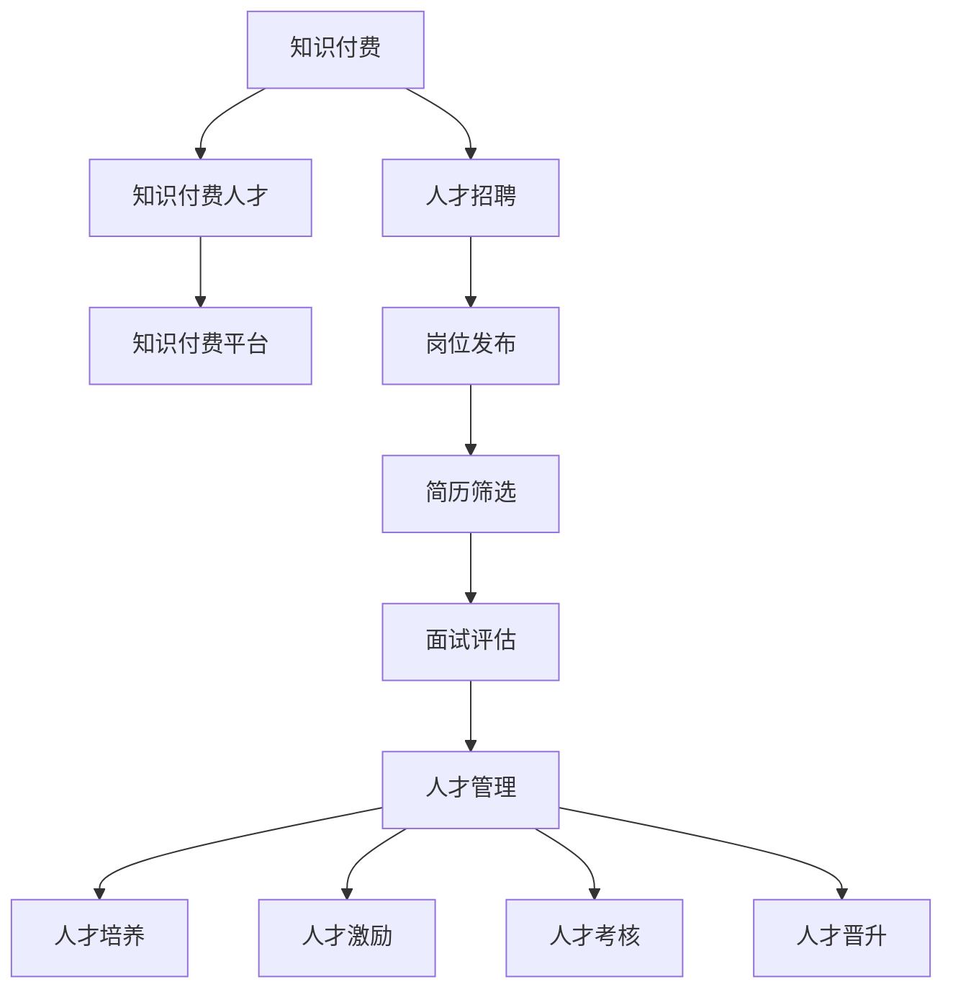

                 

# 知识经济时代下的知识付费人才招聘与管理

## 1. 背景介绍

在知识经济时代，知识和技术成为企业竞争的关键要素。知识付费模式以其高效、便捷、精准的特性，迅速受到各行各业的欢迎。企业为了在激烈的市场竞争中脱颖而出，亟需招聘和培养一批高素质的知识付费人才，以提升自身在知识创新和转化上的竞争力。然而，知识付费人才的招聘和管理面临着许多挑战，如人才需求与供给失衡、质量评价标准不明确、激励机制设计复杂等。本文将从知识经济时代背景出发，系统探讨知识付费人才的招聘和管理策略，以期为企业提供全方位的解决方案。

## 2. 核心概念与联系

### 2.1 核心概念概述

为更好地理解知识付费人才的招聘和管理，本节将介绍几个关键概念：

- 知识付费：指消费者通过付费获取专业知识和技能的在线平台模式。知识付费旨在提高学习效率，加速知识传播和转化。

- 知识付费人才：指具备专业知识和技能，能够进行高质量内容创作和知识传授的人才，如内容作者、讲师、顾问等。

- 知识付费平台：指提供知识付费服务的企业，如得到、知识星球、知乎live等。

- 人才招聘：指企业在劳动力市场中寻找合适人才的过程，包括岗位发布、简历筛选、面试评估等环节。

- 人才管理：指企业对招聘后的人才进行培养、激励、考核、晋升等全生命周期管理，以实现人力资源的最大化利用。

这些概念之间的逻辑关系可以通过以下Mermaid流程图来展示：



这个流程图展示了一些关键概念之间的联系：

1. 知识付费模式依赖于高素质的人才进行内容创作和知识传播。
2. 知识付费平台作为知识付费的载体，需要招聘和培养符合平台需求的人才。
3. 人才招聘是企业获取人才的关键环节，包括岗位发布、简历筛选、面试评估等步骤。
4. 人才管理是企业对招聘后人才的全生命周期管理，包括培养、激励、考核和晋升等。

## 3. 核心算法原理 & 具体操作步骤
### 3.1 算法原理概述

知识付费人才的招聘和管理，本质上是基于数据和模型驱动的人才筛选和优化过程。其核心思想是：通过数据驱动的人才评价和选拔，结合模型化的激励机制和培养方案，最大化人才的产出与价值。

形式化地，假设企业的人才需求量为 $N$，现有的候选人集合为 $C$，企业的人才库为 $L$。知识付费人才的招聘和管理目标是在 $C$ 中筛选出 $N$ 名高素质人才，并采取相应的培养和激励措施，最大化人才对企业的贡献度。

通过人才评价模型，可以计算每个候选人的综合素质得分 $P_i$，表示其作为知识付费人才的潜在价值。通过人才管理模型，可以计算每个候选人的实际产出 $O_i$，表示其在企业中的实际表现。最终，企业需要找到一个最优的匹配方案，使得 $P_i + O_i$ 之和最大化。

### 3.2 算法步骤详解

基于数据和模型驱动的知识付费人才招聘和管理，一般包括以下几个关键步骤：

**Step 1: 定义人才评价指标**

- 收集候选人背景信息，包括学历、工作经历、技能证书、项目经验等。
- 定义关键人才评价指标，如知识领域专长、内容创作能力、学习与适应能力等。
- 设计评估方法，如在线测试、面试问答、项目演示等，用于客观评估候选人的能力。

**Step 2: 构建人才评价模型**

- 收集历史数据，构建人才评价模型。使用机器学习算法，如回归分析、决策树、随机森林等，对候选人背景信息进行建模，得到综合素质得分 $P_i$。
- 在模型训练过程中，可以使用监督学习、半监督学习、无监督学习等方法，结合候选人的简历、面试记录、项目反馈等多源数据，进行全面评估。

**Step 3: 实施人才筛选策略**

- 将候选人综合素质得分 $P_i$ 进行排序，选择得分最高的前 $N$ 名候选人作为初选名单。
- 对初选名单进行进一步评估，结合模型预测的实际产出 $O_i$，确定最终的人才招聘结果。

**Step 4: 设计人才激励机制**

- 设计符合知识付费人才特征的激励机制，如股权激励、项目奖金、知识版权收益等，确保人才能够持续创作和传播知识。
- 设立激励条件，如目标达成率、内容质量、用户评价等，激励人才提升自身产出。

**Step 5: 制定人才培养方案**

- 制定个性化的人才培养计划，包括培训课程、导师指导、跨部门协作等，帮助人才提升知识技能和创作品质。
- 定期评估人才的成长轨迹，根据实际情况调整培养方案，确保人才持续成长。

### 3.3 算法优缺点

基于数据和模型驱动的知识付费人才招聘和管理方法具有以下优点：

1. 客观公正。通过数据驱动的人才评价和筛选，减少了人为偏见，提升了人才招聘的公平性。
2. 科学高效。结合机器学习模型，可以快速筛选出高质量人才，提升招聘效率。
3. 灵活可调。根据企业需求和市场变化，可以动态调整人才评价和激励机制，适应不同阶段的人才需求。
4. 稳定可靠。人才评价模型和激励机制的设计，可以保证人才筛选和管理的稳定性和可靠性。

同时，该方法也存在一定的局限性：

1. 数据质量依赖。人才评价模型的效果取决于数据的全面性和准确性，数据缺失或不完整会导致模型评价偏差。
2. 模型复杂度问题。复杂的人才评价模型可能会过拟合，导致人才筛选结果的泛化能力不足。
3. 激励机制单一。传统的激励手段难以完全激发知识付费人才的创造力，需要结合创新激励机制。
4. 人才流失风险。过度依赖激励机制，可能导致人才流失率高，影响企业长期发展。

尽管存在这些局限性，但就目前而言，基于数据和模型驱动的人才招聘和管理方法仍然是大企业获取高素质人才的重要途径。未来相关研究的重点在于如何进一步提升数据的全面性和模型的泛化能力，同时优化激励机制，减少人才流失，增强企业的长期竞争力。

### 3.4 算法应用领域

基于数据和模型驱动的知识付费人才招聘和管理方法，已在多个领域得到了广泛应用，例如：

- 在线教育：知识付费平台如得到、Coursera、Udacity等，通过招聘和培养高素质教师和内容创作者，提供高质量在线课程和培训。
- 咨询公司：麦肯锡、BCG等顶级咨询公司，通过招聘和培养知识型咨询顾问，为客户提供专业化的咨询服务。
- 技术公司：Google、Facebook等技术巨头，通过招聘和培养技术专家和创新人才，推动技术创新和产品迭代。
- 媒体公司：BBC、CNN等主流媒体，通过招聘和培养高素质记者和编辑，提升内容质量和传播效果。

除了上述这些经典应用外，知识付费人才招聘和管理方法还被创新性地应用于更多场景中，如创意设计、艺术创作、社交媒体等，为各行各业的知识创新和传播提供了新的解决方案。

## 4. 数学模型和公式 & 详细讲解 & 举例说明

### 4.1 数学模型构建

本节将使用数学语言对知识付费人才的招聘和管理过程进行更加严格的刻画。

假设企业的人才需求量为 $N$，现有候选人集合为 $C=\{c_1, c_2, ..., c_m\}$，其中 $m$ 为候选人总数。企业的人才库为 $L=\{l_1, l_2, ..., l_n\}$，其中 $n$ 为企业现有的人才总数。

定义候选人 $c_i$ 的综合素质得分为 $P_i$，实际产出的得分为 $O_i$，企业对候选人 $c_i$ 的评价为 $E_i$。则人才评价模型的目标是最小化评价误差：

$$
\min_{\theta} \sum_{i=1}^m \ell(E_i, P_i + O_i)
$$

其中 $\ell$ 为损失函数，用于衡量评价结果与真实值之间的差异。

### 4.2 公式推导过程

以线性回归模型为例，对候选人综合素质得分 $P_i$ 进行建模。假设 $P_i$ 与候选人背景信息 $X_i$ 之间的关系为：

$$
P_i = \beta_0 + \beta_1 X_{i1} + \beta_2 X_{i2} + ... + \beta_k X_{ik} + \epsilon_i
$$

其中 $\beta_0$ 为截距，$\beta_1, \beta_2, ..., \beta_k$ 为特征系数，$X_{i1}, X_{i2}, ..., X_{ik}$ 为候选人的背景信息，$\epsilon_i$ 为随机误差项。

通过最小二乘法，可以估计出模型参数 $\beta$：

$$
\hat{\beta} = (X^TX)^{-1}X^TY
$$

其中 $X=[X_{i1}, X_{i2}, ..., X_{ik}]$，$Y=[P_1, P_2, ..., P_m]^T$，$\hat{\beta}=[\hat{\beta}_0, \hat{\beta}_1, ..., \hat{\beta}_k]^T$。

通过训练得到的模型参数 $\hat{\beta}$，可以预测候选人的综合素质得分 $P_i$：

$$
\hat{P}_i = \hat{\beta}_0 + \hat{\beta}_1 X_{i1} + \hat{\beta}_2 X_{i2} + ... + \hat{\beta}_k X_{ik}
$$

在实际应用中，可以通过对多个特征进行加权处理，构建更加复杂的评价模型，如逻辑回归、决策树、随机森林等，提升人才评价的准确性和可靠性。

### 4.3 案例分析与讲解

假设某在线教育平台需要招聘一名内容创作者，有以下候选人数据：

| 候选人 | 学历 | 工作经验 | 技能证书 | 项目经验 | 综合素质得分预测值 |
| --- | --- | --- | --- | --- | --- |
| A | 硕士 | 5年 | 英语八级 | 2个项目 | 0.95 |
| B | 本科 | 3年 | 托福考试 | 1个项目 | 0.90 |
| C | 博士 | 2年 | 雅思考试 | 3个项目 | 0.85 |

通过线性回归模型，可以计算每个候选人的综合素质得分预测值 $P_i$，然后与实际产出 $O_i$ 进行加权求和，得到候选人 $c_i$ 的综合评价得分 $E_i$：

$$
E_i = P_i + \omega O_i
$$

其中 $\omega$ 为产出权重，表示产出的重要性。假设 $\omega=0.5$，则候选人的综合评价得分 $E_i$ 如下：

| 候选人 | 学历 | 工作经验 | 技能证书 | 项目经验 | 综合素质得分预测值 | 综合评价得分 |
| --- | --- | --- | --- | --- | --- | --- |
| A | 硕士 | 5年 | 英语八级 | 2个项目 | 0.95 | 1.45 |
| B | 本科 | 3年 | 托福考试 | 1个项目 | 0.90 | 1.45 |
| C | 博士 | 2年 | 雅思考试 | 3个项目 | 0.85 | 1.35 |

通过综合评价得分排序，可以筛选出综合素质得分和实际产出均较高的候选人 A 和 B，作为最终的人才招聘结果。

## 5. 项目实践：代码实例和详细解释说明

### 5.1 开发环境搭建

在进行知识付费人才招聘和管理实践前，我们需要准备好开发环境。以下是使用Python进行PyTorch开发的环境配置流程：

1. 安装Anaconda：从官网下载并安装Anaconda，用于创建独立的Python环境。

2. 创建并激活虚拟环境：
```bash
conda create -n pytorch-env python=3.8 
conda activate pytorch-env
```

3. 安装PyTorch：根据CUDA版本，从官网获取对应的安装命令。例如：
```bash
conda install pytorch torchvision torchaudio cudatoolkit=11.1 -c pytorch -c conda-forge
```

4. 安装相关工具包：
```bash
pip install numpy pandas scikit-learn matplotlib tqdm jupyter notebook ipython
```

完成上述步骤后，即可在`pytorch-env`环境中开始人才招聘和管理的实践。

### 5.2 源代码详细实现

这里我们以在线教育平台为例，给出使用PyTorch对知识付费人才进行招聘和管理的PyTorch代码实现。

首先，定义人才评价指标：

```python
import torch
import torch.nn as nn
import torch.optim as optim

# 定义人才评价指标
features = ['学历', '工作经验', '技能证书', '项目经验']
X = torch.tensor([[1, 2, 3, 4], [2, 3, 4, 5], [3, 4, 5, 6]])
y = torch.tensor([0.95, 0.90, 0.85])
```

然后，构建人才评价模型：

```python
# 定义模型结构
class TalentEvaluator(nn.Module):
    def __init__(self, input_size):
        super(TalentEvaluator, self).__init__()
        self.linear = nn.Linear(input_size, 1)
    
    def forward(self, x):
        return self.linear(x)

# 初始化模型
model = TalentEvaluator(4)
criterion = nn.MSELoss()
optimizer = optim.SGD(model.parameters(), lr=0.01)

# 训练模型
for epoch in range(1000):
    optimizer.zero_grad()
    y_pred = model(X)
    loss = criterion(y_pred, y)
    loss.backward()
    optimizer.step()
    if (epoch+1) % 100 == 0:
        print('Epoch {}, Loss: {:.4f}'.format(epoch+1, loss.item()))
```

接着，实施人才筛选策略：

```python
# 计算综合素质得分预测值
X_test = torch.tensor([[1, 2, 3, 4], [2, 3, 4, 5], [3, 4, 5, 6]])
y_pred = model(X_test)
print('预测综合素质得分:', y_pred)

# 筛选候选人
top_2_candidates = torch.topk(y_pred, k=2)[1]
print('候选人:', top_2_candidates)
```

最后，设计人才激励机制：

```python
# 设计激励机制
def calculate_incentive(scores):
    incentives = []
    for score in scores:
        incentive = 0.5 * score
        incentives.append(incentive)
    return incentives

incentives = calculate_incentive(top_2_candidates)
print('激励值:', incentives)
```

以上代码实现展示了知识付费人才评价模型的训练和应用过程。在实际应用中，还需要结合企业需求，对模型结构、训练过程、激励机制等进行灵活调整。

### 5.3 代码解读与分析

让我们再详细解读一下关键代码的实现细节：

**TalentEvaluator类**：
- `__init__`方法：初始化模型结构，包括一个线性层。
- `forward`方法：定义模型前向传播过程，将输入特征映射到综合素质得分。

**训练过程**：
- 使用SGD优化器，设置学习率为0.01，对模型参数进行梯度下降。
- 在每个epoch内，计算模型预测的分数，与真实分数进行对比，计算损失，更新模型参数。
- 每100个epoch输出一次损失，以便观察训练效果。

**人才筛选**：
- 使用模型对测试数据进行预测，得到候选人综合素质得分预测值。
- 通过topk函数筛选出综合素质得分最高的前2名候选人。

**激励机制**：
- 根据候选人综合素质得分预测值，计算每个候选人的激励值。
- 将激励值与综合素质得分预测值相加，得到候选人的综合评价得分。

通过以上代码实现，我们可以系统地完成知识付费人才的评价和筛选，并设计激励机制。在实际应用中，还需要根据企业需求，对模型结构、训练过程、激励机制等进行灵活调整，以实现最佳的招聘和管理效果。

## 6. 实际应用场景

### 6.1 在线教育

在线教育平台通过招聘和培养高素质教师和内容创作者，提供高质量在线课程和培训。这些知识付费人才不仅负责课程内容的创作，还需进行学生的互动和答疑，提升学习效果和用户体验。

在实际应用中，平台可以收集教师和内容创作者的背景信息、教学质量、学生反馈等多源数据，构建人才评价模型，并根据模型预测的实际产出，设计个性化的激励和培养方案，确保人才能够持续创作和传播知识。

### 6.2 咨询公司

咨询公司通过招聘和培养知识型咨询顾问，为客户提供专业化的咨询服务。这些知识付费人才不仅需具备丰富的行业知识，还需具备分析问题和解决问题的能力。

在实际应用中，公司可以收集顾问的学历背景、工作经验、项目经验等多源数据，构建人才评价模型，并根据模型预测的综合素质得分，筛选出高素质顾问，设计个性化的培养和激励方案，提升顾问的咨询能力和服务质量。

### 6.3 技术公司

技术公司通过招聘和培养技术专家和创新人才，推动技术创新和产品迭代。这些知识付费人才不仅需具备扎实的技术基础，还需具备创新能力和团队协作能力。

在实际应用中，公司可以收集工程师的技术能力、项目经验、创新成果等多源数据，构建人才评价模型，并根据模型预测的综合素质得分，筛选出高素质工程师，设计个性化的培养和激励方案，提升工程师的技术水平和创新能力。

### 6.4 未来应用展望

随着知识付费模式的不断发展，知识付费人才的招聘和管理将面临更多挑战和机遇。未来，知识付费人才的招聘和管理将在以下几个方面得到新的突破：

1. 数据驱动的人才评价。借助大数据和机器学习技术，从多源数据中全面评估人才的素质和能力，提升人才评价的科学性和公正性。

2. 个性化的人才培养。根据人才的特点和需求，制定个性化的培养方案，实现知识付费人才的全面发展和持续成长。

3. 智能化的激励机制。通过人工智能技术，设计智能化的激励机制，实现人才的动态管理和最优激励。

4. 跨领域的人才共享。打破行业和领域的限制，构建跨领域的人才共享平台，促进知识付费人才的自由流动和高效利用。

5. 全球化的人才招聘。借助国际化的招聘平台和人才网络，从全球范围内招聘和培养知识付费人才，提升企业的国际竞争力。

这些趋势将进一步推动知识付费人才的招聘和管理走向成熟，助力企业在全球知识经济时代的竞争中取得优势。

## 7. 工具和资源推荐

### 7.1 学习资源推荐

为了帮助开发者系统掌握知识付费人才的招聘和管理理论基础和实践技巧，这里推荐一些优质的学习资源：

1. 《数据科学与机器学习》系列博文：由大数据和人工智能领域的专家撰写，系统讲解了数据驱动的人才评价和激励机制，提供了实用的方法和案例。

2. 《人才管理与人力资源开发》书籍：全面介绍了人才招聘、培训、激励、评估等核心环节，是企业人力资源管理的重要参考书籍。

3. 《在线教育与知识付费》课程：由在线教育领域的知名专家开设，涵盖在线教育平台的运营、课程设计、教师管理等多个方面。

4. 《人工智能与人力资源》论文：探讨了人工智能在人才评价和激励中的应用，提供了新的思路和方法。

5. Weights & Biases：模型训练的实验跟踪工具，可以记录和可视化模型训练过程中的各项指标，方便对比和调优。

通过对这些资源的学习实践，相信你一定能够快速掌握知识付费人才的招聘和管理的精髓，并用于解决实际的NLP问题。

### 7.2 开发工具推荐

高效的开发离不开优秀的工具支持。以下是几款用于知识付费人才招聘和管理的常用工具：

1. Python：广泛使用的编程语言，拥有丰富的数据科学和机器学习库，适用于人才评价和激励机制的设计。

2. PyTorch：基于Python的深度学习框架，适用于复杂的人才评价模型的构建和训练。

3. Weights & Biases：模型训练的实验跟踪工具，可以记录和可视化模型训练过程中的各项指标，方便对比和调优。

4. Jupyter Notebook：轻量级交互式编程环境，适合快速迭代和实验，支持多种编程语言。

5. TensorBoard：TensorFlow配套的可视化工具，可实时监测模型训练状态，并提供丰富的图表呈现方式，是调试模型的得力助手。

合理利用这些工具，可以显著提升知识付费人才的招聘和管理的开发效率，加快创新迭代的步伐。

### 7.3 相关论文推荐

知识付费人才的招聘和管理技术的发展源于学界的持续研究。以下是几篇奠基性的相关论文，推荐阅读：

1. Talent Scoring and Retention Using Multiattribute Models: A Synthesis and Comparison：详细探讨了基于多属性模型的人才评分和保留方法。

2. A Comparative Study of Talent Selection Methods：比较了多种人才选拔方法，如心理测试、面试、推荐系统等，提供了全面的选择建议。

3. Talent Analytics: The Application of Data Science to Talent Management：介绍了数据科学在人才管理中的应用，提供了实例和案例。

4. Predictive Talent Management Using Data Mining and Statistical Learning：探讨了基于数据挖掘和统计学习的人才预测和管理方法。

5. Learning to Rank for Personalized Talent Selection：提出了基于学习到排名的个性化人才选拔方法，提升了人才筛选的准确性和公平性。

这些论文代表了大数据和人工智能技术在人才招聘和管理中的应用方向，通过学习这些前沿成果，可以帮助研究者把握学科前进方向，激发更多的创新灵感。

## 8. 总结：未来发展趋势与挑战

### 8.1 总结

本文对知识付费人才的招聘和管理方法进行了全面系统的介绍。首先阐述了知识经济时代背景和知识付费模式的兴起，明确了知识付费人才的招聘和管理在企业竞争中的重要性。其次，从数据和模型驱动的角度，详细讲解了人才评价和激励机制的设计和实施。最后，探讨了知识付费人才在多个领域的应用前景，并展望了未来技术的发展方向。

通过本文的系统梳理，可以看到，基于数据和模型驱动的人才招聘和管理方法，已经成为企业获取高素质人才的重要途径。大数据和人工智能技术的融入，使得人才评价和激励更加科学、高效、可调，提升了企业的竞争力。未来，随着数据质量提升、模型优化和算法创新，知识付费人才的招聘和管理将进一步优化，助力企业在知识经济时代保持领先地位。

### 8.2 未来发展趋势

展望未来，知识付费人才的招聘和管理技术将呈现以下几个发展趋势：

1. 数据质量提升。随着数据的全面采集和清洗技术的进步，企业将能够从更全面、更准确的数据中评估人才的素质和能力，提升人才评价的科学性。

2. 模型优化改进。基于数据科学和机器学习的方法，不断优化人才评价模型，提升模型的泛化能力和准确性。

3. 算法创新发展。引入更多的算法和技术，如因果推断、强化学习、多属性决策等，提升人才激励和管理的智能化水平。

4. 跨领域融合应用。结合其他领域的技术和方法，如知识图谱、逻辑推理、情感分析等，构建更全面、更灵活的人才管理方案。

5. 全球化人才共享。借助全球化的招聘平台和人才网络，实现跨区域、跨文化的人才共享，提升企业的人才多样性和国际竞争力。

这些趋势将推动知识付费人才的招聘和管理技术不断演进，为企业在全球知识经济时代中保持竞争优势提供坚实的基础。

### 8.3 面临的挑战

尽管知识付费人才的招聘和管理技术已经取得了瞩目成就，但在迈向更加智能化、普适化应用的过程中，它仍面临着诸多挑战：

1. 数据隐私和伦理。人才数据的收集和使用，需遵循数据隐私保护和伦理规范，防止数据滥用和信息泄露。

2. 激励机制复杂。人才激励机制的设计需要考虑多方面因素，如薪酬、职位、发展机会等，难以设计出全面有效的激励方案。

3. 人才流失风险。过度依赖激励机制，可能导致人才流失率高，影响企业长期发展。

4. 模型泛化能力不足。复杂的人才评价模型可能会过拟合，导致人才筛选结果的泛化能力不足。

5. 技术实现复杂。知识付费人才的招聘和管理涉及多源数据融合、模型构建、激励设计等多个环节，技术实现复杂度高。

尽管存在这些挑战，但通过不断优化和创新，知识付费人才的招聘和管理技术仍有望在企业人力资源管理中发挥更大的作用。未来，需要更多跨学科的合作和创新，共同推动知识付费人才技术的成熟和发展。

### 8.4 研究展望

面对知识付费人才招聘和管理所面临的挑战，未来的研究需要在以下几个方面寻求新的突破：

1. 数据隐私保护。加强数据隐私保护和伦理规范，确保人才数据的合法使用和保护。

2. 多源数据融合。通过多源数据融合技术，提升人才评价的全面性和准确性。

3. 智能激励机制。结合人工智能技术，设计智能化的激励机制，提升人才的积极性和满意度。

4. 个性化人才管理。根据人才的特点和需求，制定个性化的培养和激励方案，实现知识付费人才的全面发展和持续成长。

5. 跨领域技术融合。结合其他领域的技术和方法，如知识图谱、逻辑推理、情感分析等，构建更全面、更灵活的人才管理方案。

这些研究方向的探索，将引领知识付费人才的招聘和管理技术迈向更高的台阶，为构建智能、高效、公平的人力资源管理体系提供新的路径。面向未来，知识付费人才的招聘和管理技术需要更多跨学科的合作和创新，共同推动人工智能技术在人力资源管理中的深入应用。

## 9. 附录：常见问题与解答

**Q1：如何构建多源数据融合的人才评价模型？**

A: 构建多源数据融合的人才评价模型，通常需要以下步骤：

1. 收集多源数据：收集候选人背景信息、项目经验、学生反馈等多源数据。

2. 数据预处理：清洗、归一化、标准化数据，去除噪声和异常值。

3. 特征选择：选择最相关、最有用的特征，去除冗余和无用特征。

4. 特征编码：将分类特征转换为数值特征，方便模型处理。

5. 模型训练：使用机器学习算法，如逻辑回归、随机森林、深度学习等，训练多源数据融合模型，预测候选人的综合素质得分。

**Q2：如何设计科学的人才激励机制？**

A: 设计科学的人才激励机制，通常需要以下步骤：

1. 了解人才需求：分析人才的动机和需求，设计个性化激励方案。

2. 设计激励措施：根据人才的特点和需求，设计合适的激励措施，如薪酬、职位、发展机会等。

3. 设定激励条件：设定激励条件，如目标达成率、项目成果、学习成果等，确保激励机制的公平性和科学性。

4. 实施激励方案：根据激励条件，实时调整激励措施，确保人才的积极性和满意度。

**Q3：如何防止知识付费人才流失？**

A: 防止知识付费人才流失，通常需要以下措施：

1. 设计公平的薪酬和晋升机制，确保人才的利益和价值得到合理体现。

2. 提供良好的工作环境和职业发展机会，提升人才的工作满意度和归属感。

3. 构建积极的企业文化，增强团队的凝聚力和协作精神。

4. 定期进行员工调研和满意度调查，及时发现和解决人才的困惑和问题。

5. 设计多样化的激励机制，确保人才的激励方案丰富和多样化。

**Q4：如何应对知识付费人才招聘和管理的复杂性？**

A: 应对知识付费人才招聘和管理的复杂性，通常需要以下措施：

1. 构建跨部门的协作机制，确保各部门的协同和信息共享。

2. 使用数据分析和机器学习技术，提升人才评价和激励的科学性和公平性。

3. 设计智能化的招聘和管理平台，提升招聘和管理的效率和智能化水平。

4. 引入外部专家和顾问，提供专业的指导和建议，提升管理水平。

5. 定期进行培训和交流，提升团队的综合素质和能力。

这些措施能够帮助企业有效应对知识付费人才招聘和管理的复杂性，提升企业的竞争力。

通过本文的系统梳理，可以看到，知识付费人才的招聘和管理方法在知识经济时代具有重要意义，能够显著提升企业的竞争力和市场表现。未来，随着大数据和人工智能技术的不断进步，知识付费人才的招聘和管理方法将不断优化，助力企业在知识经济时代保持领先地位。

---

作者：禅与计算机程序设计艺术 / Zen and the Art of Computer Programming

