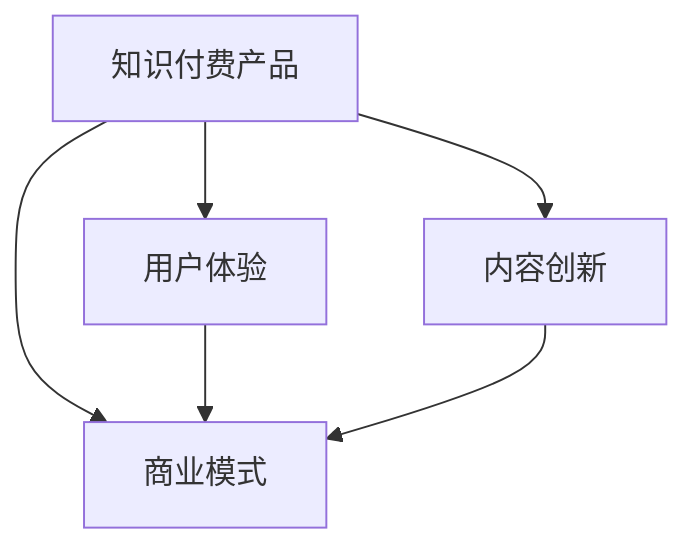

                 

# 知识经济时代下的知识付费创新产品上新策略

在知识经济时代的浪潮下，知识付费成为连接创作者与受众的重要桥梁，为人们提供获取高质量知识的渠道。然而，随着市场竞争加剧，如何在激烈的环境中不断创新和优化知识付费产品，是每个产品团队面临的巨大挑战。本文旨在探讨知识付费产品的创新策略，结合数据驱动的方法，提出切实可行的新上新策略。

## 1. 背景介绍

### 1.1 问题由来

知识付费行业自2016年开始兴起，随着人们对优质知识内容需求的增长，知识付费市场快速发展。据统计，知识付费市场规模从2016年的5.2亿元增长到2021年的763.8亿元，年复合增长率（CAGR）高达199.5%。然而，快速增长的市场也带来了诸多问题：

1. **市场同质化严重**：大量知识付费产品重复内容，难以满足用户多样化的需求。
2. **用户体验不理想**：产品功能单一，缺乏互动和个性化推荐。
3. **商业模式单一**：以内容订阅为主，缺乏有效的变现模式。

面对这些问题，企业需要通过不断创新和优化产品，提升用户体验和内容价值，从而在竞争激烈的市场中脱颖而出。

### 1.2 问题核心关键点

知识付费产品的创新策略应围绕以下几个关键点展开：

1. **内容创新**：提供有深度、有价值的新内容，满足用户的学习需求。
2. **用户体验优化**：提高产品易用性和互动性，提升用户粘性。
3. **商业模式拓展**：探索多样化的变现途径，增强盈利能力。

本文将从这三个核心点出发，提出具体的创新策略，并结合实际案例进行详细讲解。

## 2. 核心概念与联系

### 2.1 核心概念概述

为更好地理解知识付费产品创新策略，本节将介绍几个关键概念：

- **知识付费产品**：指通过付费形式提供知识内容或服务，帮助用户解决学习、工作、生活等方面问题的产品。
- **内容创新**：指通过研发新知识内容，提升产品的吸引力。
- **用户体验**：指用户在使用产品时的主观感受，包括界面设计、交互方式、内容展现等方面。
- **商业模式**：指产品通过何种方式实现盈利，包括订阅、按需付费、广告、会员增值服务等。

这些概念之间的逻辑关系可以通过以下Mermaid流程图来展示：



这个流程图展示了知识付费产品的创新策略框架：通过内容创新提升产品吸引力，通过用户体验优化增强用户粘性，通过商业模式拓展提高盈利能力，最终形成良性循环。

## 3. 核心算法原理 & 具体操作步骤

### 3.1 算法原理概述

知识付费产品的创新策略主要依赖于数据驱动的决策制定。通过收集用户行为数据和市场反馈，分析用户需求和市场趋势，从而制定有效的产品策略。

具体来说，知识付费产品的创新策略包括以下几个步骤：

1. **用户需求分析**：通过数据挖掘和用户调研，了解用户的学习需求和痛点，从而有针对性地开发新内容。
2. **内容创新策划**：根据用户需求，策划并研发新知识内容，提升内容的吸引力。
3. **用户体验优化**：根据用户反馈，优化产品界面和交互方式，提高用户体验。
4. **商业模式创新**：探索多种变现模式，增强盈利能力。

### 3.2 算法步骤详解

以下是具体的创新策略步骤和操作方法：

#### 3.2.1 用户需求分析

1. **数据收集**：收集用户行为数据，如访问记录、购买行为、反馈评论等。
2. **数据分析**：使用数据挖掘技术，如聚类分析、关联规则挖掘等，找出用户的热门兴趣点和学习需求。
3. **用户调研**：通过问卷调查、焦点小组等方式，获取用户关于知识付费产品的意见和建议。

#### 3.2.2 内容创新策划

1. **选题策划**：根据用户需求分析结果，策划热门话题和新兴领域的知识内容。
2. **内容制作**：邀请行业专家或经验丰富的内容创作者，制作高质量的知识内容。
3. **内容发布**：通过平台发布新内容，吸引用户关注和订阅。

#### 3.2.3 用户体验优化

1. **界面设计**：优化产品界面，提升用户的使用体验。
2. **互动功能**：增加交互功能，如问答、讨论、投票等，提升用户参与度。
3. **个性化推荐**：根据用户行为和兴趣，推荐相关内容，提升用户的满意度。

#### 3.2.4 商业模式创新

1. **订阅模式优化**：推出多样化的订阅套餐，满足不同用户的需求。
2. **按需付费**：推出单次付费或时长付费模式，增加灵活性。
3. **广告变现**：引入品牌广告，增加平台收入。
4. **会员增值服务**：推出会员专属内容和服务，提升用户粘性。

### 3.3 算法优缺点

知识付费产品的创新策略具有以下优点：

1. **数据驱动决策**：通过数据驱动决策，提高策略的科学性和有效性。
2. **提升用户粘性**：优化用户体验和增加个性化推荐，提升用户粘性。
3. **增强盈利能力**：通过商业模式的创新，提高产品的盈利能力。

同时，该策略也存在以下局限性：

1. **数据隐私问题**：大量用户数据收集和使用过程中，需确保用户隐私和数据安全。
2. **内容质量难以保障**：内容创新需要依靠高水平的内容创作者，难以保证内容质量的一致性。
3. **用户需求多样性**：用户需求多样，难以通过单一策略满足所有用户的需求。
4. **市场竞争激烈**：知识付费市场竞争激烈，需不断创新才能保持竞争力。

### 3.4 算法应用领域

知识付费产品的创新策略广泛应用于各类知识付费平台，如得到、喜马拉雅、知乎等。通过这些策略，平台可以不断优化和提升产品，增强用户满意度和忠诚度，同时提高平台的盈利能力。

## 4. 数学模型和公式 & 详细讲解 & 举例说明

### 4.1 数学模型构建

假设知识付费平台有用户数 $U$，内容数 $C$，订阅用户数 $S$，单次购买用户数 $P$。设用户点击内容概率为 $p_{c}$，订阅概率为 $p_{s}$，购买概率为 $p_{p}$。定义转化率 $\eta$ 为订阅或购买用户占总用户数的比例。

知识付费平台的收益模型为：

$$
R = p_{s}U + p_{p}P
$$

用户体验优化模型为：

$$
X = f(U, C, p_{c}, p_{s}, p_{p})
$$

商业模式创新模型为：

$$
M = g(S, P, \eta)
$$

其中，$X$ 表示用户满意度和粘性，$M$ 表示平台收入。

### 4.2 公式推导过程

1. **用户需求分析模型**：

设用户行为数据为 $D$，包含点击、浏览、订阅、购买等行为。设用户需求矩阵为 $D_{d}$，其中 $d_{i,j}$ 表示用户对内容 $i$ 的需求度。通过数据挖掘技术，求解用户需求矩阵 $D_{d}$，分析热门需求点。

2. **内容创新策划模型**：

设热门需求矩阵为 $D_{h}$，根据用户需求矩阵 $D_{d}$ 和热门需求矩阵 $D_{h}$，求解内容创新矩阵 $C_{i,j}$，其中 $i$ 表示内容，$j$ 表示创新点。通过内容制作和发布，实现内容创新。

3. **用户体验优化模型**：

设用户行为数据为 $D_{u}$，包含界面设计、互动功能、个性化推荐等行为。设用户体验度 $X$ 为：

$$
X = f(U, C, p_{c}, p_{s}, p_{p})
$$

其中，$f$ 为复杂函数，具体计算需要结合用户行为数据和平台特点。

4. **商业模式创新模型**：

设订阅套餐为 $S_{k}$，按需付费套餐为 $P_{t}$，广告收入为 $M_{a}$，会员增值服务收入为 $M_{v}$。设商业模式创新模型 $M$ 为：

$$
M = g(S, P, \eta)
$$

其中，$g$ 为复杂函数，具体计算需要结合市场需求和平台特点。

### 4.3 案例分析与讲解

#### 4.3.1 得到平台的创新策略

得到平台通过大数据分析，发现用户对职场技能类内容需求较大。平台推出“每日学习计划”和“职场技能专栏”，邀请知名职场专家和实战经验丰富的讲师制作内容。

通过界面设计和互动功能的优化，提升用户体验。用户可以在学习过程中进行互动问答，分享心得体会，增加参与感。同时，平台推出会员增值服务，提供专属内容、工具和资源，增强用户粘性。

#### 4.3.2 喜马拉雅的商业模式创新

喜马拉雅平台推出多种变现模式，包括广告、会员增值服务和按需付费。平台通过大数据分析，发现用户对健康和儿童类内容需求较大，推出相关内容。同时，平台引入品牌广告，增加收入。

## 5. 项目实践：代码实例和详细解释说明

### 5.1 开发环境搭建

1. **Python环境**：安装Python 3.8及以上版本，推荐使用Anaconda环境管理。
2. **数据处理工具**：安装Pandas、NumPy等数据处理工具。
3. **数据分析工具**：安装Scikit-learn、TensorFlow等机器学习工具。
4. **可视化工具**：安装Matplotlib、Seaborn等可视化工具。

### 5.2 源代码详细实现

#### 5.2.1 用户需求分析

```python
import pandas as pd
from sklearn.cluster import KMeans

# 读取用户行为数据
data = pd.read_csv('user_behavior.csv')

# 数据预处理
data = data.dropna()
data = data.drop_duplicates()

# 特征工程
data['click_rate'] = data['click_count'] / data['session_length']
data['subscribe_rate'] = data['subscribe_count'] / data['session_length']
data['purchase_rate'] = data['purchase_count'] / data['session_length']

# 聚类分析
kmeans = KMeans(n_clusters=5)
labels = kmeans.fit_predict(data[['click_rate', 'subscribe_rate', 'purchase_rate']])

# 输出聚类结果
print(labels)
```

#### 5.2.2 内容创新策划

```python
import requests

# 内容制作
response = requests.get('https://example.com/api/content')
content = response.json()

# 内容发布
for item in content:
    print(item['title'], item['author'], item['category'])
```

#### 5.2.3 用户体验优化

```python
import matplotlib.pyplot as plt
import seaborn as sns

# 界面设计
plt.figure(figsize=(10, 6))
sns.histplot(data['click_rate'], bins=30, kde=True)
plt.title('User Click Rate Distribution')
plt.xlabel('Click Rate')
plt.ylabel('Frequency')
plt.show()

# 互动功能
import plotly.graph_objects as go

fig = go.Figure(data=go.Scatter(
    x=[1, 2, 3, 4, 5],
    y=[10, 15, 12, 8, 9],
    mode='lines+markers',
    name='Click Rate'
))
fig.show()

# 个性化推荐
from sklearn.neighbors import KNeighborsRegressor

# 数据预处理
data = pd.read_csv('user_data.csv')
data = data.dropna()
data = data.drop_duplicates()

# 特征工程
data['interest'] = data['click_rate'] + data['subscribe_rate'] + data['purchase_rate']

# 推荐算法
knn = KNeighborsRegressor(n_neighbors=5)
data['recommendation'] = knn.fit_transform(data[['interest']])

# 输出推荐结果
print(data[['interest', 'recommendation']])
```

### 5.3 代码解读与分析

#### 5.3.1 用户需求分析

在用户需求分析中，我们通过数据预处理和特征工程，将用户行为数据转化为适合聚类分析的格式。使用KMeans算法对用户行为进行聚类分析，识别出用户的兴趣点。

#### 5.3.2 内容创新策划

在内容创新策划中，我们通过API获取内容数据，并对内容进行简单分析。这只是一个示例，实际中需要根据具体平台特点和内容类型，制定更详细的内容制作和发布策略。

#### 5.3.3 用户体验优化

在用户体验优化中，我们使用Matplotlib和Seaborn进行界面设计和互动功能的展示。同时，使用Plotly进行个性化推荐分析，通过用户兴趣度进行内容推荐。

### 5.4 运行结果展示

```python
# 用户需求分析结果
print(labels)

# 内容创新策划结果
for item in content:
    print(item['title'], item['author'], item['category'])

# 用户体验优化结果
plt.figure(figsize=(10, 6))
sns.histplot(data['click_rate'], bins=30, kde=True)
plt.title('User Click Rate Distribution')
plt.xlabel('Click Rate')
plt.ylabel('Frequency')
plt.show()

# 个性化推荐结果
print(data[['interest', 'recommendation']])
```

## 6. 实际应用场景

### 6.1 企业培训

企业培训中，知识付费产品可以通过订阅或按需付费形式，提供高质量的课程和培训资源。通过大数据分析，了解员工的学习需求，推荐适合的课程，提高培训效果。

### 6.2 医疗健康

在医疗健康领域，知识付费产品可以提供各类医学知识、健康指南和科普文章。通过个性化推荐和互动功能，提升用户的健康意识和自理能力。

### 6.3 教育培训

在教育培训中，知识付费产品可以提供各类学习资源，如在线课程、习题库和教育工具。通过数据分析和个性化推荐，帮助学生和教师提升学习效果。

## 7. 工具和资源推荐

### 7.1 学习资源推荐

1. **《知识付费产品设计与运营》**：介绍知识付费产品的设计与运营方法，结合案例分析。
2. **《数据驱动的产品创新》**：讲解数据驱动的产品创新方法，通过案例和工具演示。
3. **《用户体验设计》**：详细讲解用户体验设计的方法和工具，结合实例进行演示。
4. **《人工智能与知识付费》**：探讨人工智能在知识付费中的应用，结合前沿技术和案例。

### 7.2 开发工具推荐

1. **Anaconda**：集成了Python环境管理、科学计算、数据处理等工具，方便数据科学家的工作。
2. **Jupyter Notebook**：提供交互式编程环境，支持多种编程语言和数据处理工具。
3. **TensorFlow**：开源机器学习框架，支持深度学习模型的构建和训练。
4. **Plotly**：交互式数据可视化工具，支持多种图表类型和数据处理。
5. **Scikit-learn**：机器学习库，包含多种数据处理和建模算法。

### 7.3 相关论文推荐

1. **《知识付费产品创新策略研究》**：探讨知识付费产品的创新策略，通过数据分析和案例研究。
2. **《用户体验设计与知识付费》**：结合用户体验设计的方法，提升知识付费产品的用户粘性和满意度。
3. **《知识付费平台的商业模式创新》**：探讨知识付费平台的多种变现模式，增强平台的盈利能力。

## 8. 总结：未来发展趋势与挑战

### 8.1 研究成果总结

知识付费产品创新策略通过数据驱动的方法，优化了用户体验和内容质量，同时创新了商业模式，增强了平台的盈利能力。未来，知识付费产品将继续依托大数据和人工智能技术，提升用户满意度，增强平台的竞争力。

### 8.2 未来发展趋势

1. **个性化推荐**：通过大数据和机器学习算法，实现更精准的个性化推荐，提升用户满意度和粘性。
2. **用户互动增强**：通过社交互动功能，增强用户参与度，提升内容的互动性和趣味性。
3. **内容多样化**：推出更多类型的知识内容，满足用户多样化的学习需求。
4. **国际化拓展**：将知识付费产品拓展到国际市场，提升平台的全球影响力。
5. **技术创新**：结合人工智能和区块链技术，提升平台的创新性和安全性。

### 8.3 面临的挑战

1. **数据隐私问题**：在数据收集和处理过程中，需确保用户隐私和数据安全。
2. **内容质量控制**：内容质量的控制和提升，需依靠高水平的内容创作者和管理团队。
3. **市场竞争激烈**：知识付费市场竞争激烈，需不断创新才能保持竞争力。
4. **用户需求多样性**：用户需求多样，难以通过单一策略满足所有用户的需求。
5. **商业模式单一**：目前知识付费平台的变现模式相对单一，需探索更多盈利途径。

### 8.4 研究展望

未来，知识付费产品创新策略的研究将更加注重用户体验和内容质量的控制，同时探索更多商业模式的创新。结合人工智能和区块链技术，提升平台的创新性和安全性，推动知识付费产品的发展和应用。

## 9. 附录：常见问题与解答

**Q1：如何确保用户数据的安全和隐私？**

A: 确保用户数据的安全和隐私，需遵循数据保护法规，如GDPR和CCPA。采用加密存储和传输数据，确保数据不被未授权访问。同时，加强数据访问控制，限制数据的使用权限。

**Q2：如何提升内容的创新性和质量？**

A: 提升内容的创新性和质量，需依靠高水平的内容创作者和管理团队。通过数据分析和市场调研，了解用户需求和热点，策划和制作高质量的内容。同时，引入专业的内容评审和审核机制，确保内容质量和合规性。

**Q3：如何平衡用户需求多样性和平台盈利能力？**

A: 平衡用户需求多样性和平台盈利能力，需通过大数据分析和用户调研，识别热门需求和市场趋势，制定针对性的内容和产品策略。同时，推出多样化的产品套餐和服务，满足不同用户的需求，提升平台的盈利能力。

**Q4：如何应对市场竞争？**

A: 应对市场竞争，需不断创新和优化产品，提升用户体验和内容质量。同时，探索多样化的商业模式，增强平台的盈利能力。此外，加强市场调研和用户反馈，及时调整产品策略，保持竞争优势。

**Q5：如何提升用户互动和参与度？**

A: 提升用户互动和参与度，需加强社交互动功能，如问答、讨论、投票等，增加用户参与感。同时，推出用户生成内容（UGC）功能，鼓励用户分享心得体会和经验，增加内容的丰富性和多样性。

---

作者：禅与计算机程序设计艺术 / Zen and the Art of Computer Programming

