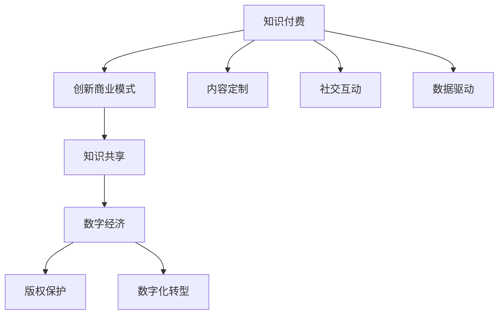

                 

# 知识经济时代下的知识付费创新商业模式推广

> 关键词：知识付费, 创新商业模式, 知识共享, 数字经济, 版权保护, 数字化转型

## 1. 背景介绍

在知识经济时代，知识作为一种稀缺资源，其价值日益凸显。特别是在数字化转型的浪潮下，知识的获取、分享和利用方式正在发生深刻变革。传统的纸质书籍、教室授课等形式正在逐渐被电子阅读、在线教育所取代。而知识付费作为一种新兴的商业模式，将知识与商业化紧密结合，为知识生产者和消费者创造了新的价值。本文将从知识付费的背景出发，分析其创新商业模式的特点，探讨其发展趋势，并提出相应的推广策略。

## 2. 核心概念与联系

### 2.1 核心概念概述

#### 2.1.1 知识付费
知识付费是指用户为获取特定知识而支付费用的商业行为。其形式多样，包括在线课程、电子书、咨询服务、专业问答等。知识付费的本质在于通过市场机制，鼓励高质量知识的生产和传播，促进知识的积累与创新。

#### 2.1.2 创新商业模式
创新商业模式是指通过创新的业务模式、流程或工具，实现产品或服务的价值最大化。在知识付费领域，创新商业模式包括内容定制、社交互动、数据驱动等，旨在提升用户体验和知识价值。

#### 2.1.3 知识共享
知识共享是指知识的生产者与消费者之间，通过网络平台进行知识的交换和传播。与传统的单向传播不同，知识共享强调双向互动，鼓励用户生成内容，从而形成知识生态圈。

#### 2.1.4 数字经济
数字经济是指通过数字化技术，推动经济活动和产业升级，实现经济效益和社会价值的最大化。知识付费作为数字经济的重要组成部分，其发展与数字化技术的进步密不可分。

#### 2.1.5 版权保护
版权保护是指对知识产品进行法律保护，确保作者对其作品拥有使用、许可、交易等权利。知识付费的推广需要依赖有效的版权保护机制，以保障内容生产者的合法权益。

#### 2.1.6 数字化转型
数字化转型是指传统企业通过引入数字化技术，实现业务流程、产品形态、市场策略等方面的变革。知识付费作为一种新型商业模式，有助于推动各行各业的数字化转型，提升整体经济效率。

### 2.2 核心概念联系

知识付费、创新商业模式、知识共享、数字经济、版权保护、数字化转型等概念之间相互关联，共同构成了知识经济时代的商业生态系统。以下是这些概念之间的逻辑关系：



## 3. 核心算法原理 & 具体操作步骤

### 3.1 算法原理概述

知识付费的创新商业模式基于以下几个核心原理：

1. **长尾理论**：通过细分市场，满足多样化的知识需求，实现长尾市场的价值最大化。
2. **社交网络效应**：利用社交平台的力量，扩大知识传播范围，形成知识生态系统。
3. **订阅制模式**：通过持续性订阅，实现对用户的高粘性锁定，增加平台收益。
4. **精准推荐算法**：通过数据分析和机器学习，提升内容的个性化推荐，提高用户满意度。

### 3.2 算法步骤详解

#### 3.2.1 长尾市场细分
1. **市场调研**：通过问卷调查、用户数据分析等方式，确定潜在用户的知识需求。
2. **细分市场**：根据需求细分出多个小市场，如编程、金融、法律、心理学等。
3. **精准定位**：为每个细分市场设计专门的知识产品和服务。

#### 3.2.2 社交网络效应
1. **社区建设**：构建知识分享社区，鼓励用户生成内容和互动。
2. **平台整合**：将社区与知识付费平台整合，形成闭环生态。
3. **用户反馈**：收集用户反馈，优化社区和平台功能。

#### 3.2.3 订阅制模式
1. **定价策略**：根据知识产品的价值和成本，设定合理的订阅价格。
2. **会员服务**：提供专属会员服务，如定制内容、优先推荐等。
3. **梯度订阅**：设计不同级别的订阅计划，满足不同层次的用户需求。

#### 3.2.4 精准推荐算法
1. **数据收集**：收集用户的阅读、搜索、评分等行为数据。
2. **模型训练**：使用机器学习算法（如协同过滤、内容推荐、深度学习等）训练推荐模型。
3. **推荐展示**：在平台首页、订阅页面等位置，展示个性化推荐内容。

### 3.3 算法优缺点

#### 3.3.1 优点
1. **高价值内容**：通过订阅制模式，能够过滤低价值内容，保证平台内容的高质量和专业性。
2. **用户粘性高**：通过社交网络效应和精准推荐算法，增加用户粘性，提升平台收益。
3. **市场细分化**：通过长尾市场细分，满足多样化的知识需求，实现差异化竞争。

#### 3.3.2 缺点
1. **成本高**：高价值的订阅内容往往需要大量的资金投入，如内容创作、技术开发、市场推广等。
2. **用户流失**：平台需要不断创新和优化，否则容易失去用户的兴趣和信任。
3. **市场竞争激烈**：知识付费市场存在众多竞争对手，平台需要不断提升自身的竞争力。

### 3.4 算法应用领域

知识付费的创新商业模式不仅适用于教育培训、专业咨询等传统知识领域，还广泛应用于多个新兴领域：

- **健康与健身**：提供个性化的健康方案、饮食计划、运动指导等。
- **艺术与设计**：提供艺术创作技巧、设计灵感、审美训练等。
- **科技与创业**：提供技术开发教程、商业策略、创业指导等。
- **旅游与生活**：提供旅行攻略、生活技能、文化体验等。

## 4. 数学模型和公式 & 详细讲解 & 举例说明

### 4.1 数学模型构建

知识付费的创新商业模式涉及多个业务环节，其数学模型可以表示为：

$$
\text{Revenue} = \sum_{i=1}^{N} (\text{Price}_i \times \text{Quantity}_i)
$$

其中，$\text{Revenue}$ 表示平台总收入，$\text{Price}_i$ 为第 $i$ 个知识产品的订阅价格，$\text{Quantity}_i$ 为订阅用户数量。

### 4.2 公式推导过程

对于订阅制模型，用户订阅量的变化受多个因素影响，包括内容质量、推荐算法、用户粘性等。通过建立用户行为模型，可以推导出用户订阅量的变化规律：

$$
\text{Quantity}_i = f(\text{Quality}_i, \text{Recommendation}_i, \text{Stickiness}_i, \text{Promotion}_i)
$$

其中，$\text{Quality}_i$ 为第 $i$ 个知识产品的质量评分，$\text{Recommendation}_i$ 为用户对推荐内容的满意度，$\text{Stickiness}_i$ 为用户的粘性度，$\text{Promotion}_i$ 为平台的推广力度。

### 4.3 案例分析与讲解

以在线教育平台Coursera为例，其创新商业模式包括以下几个方面：

1. **内容多样化**：Coursera提供来自全球顶尖大学和机构的课程，覆盖多个学科领域。
2. **社交互动**：Coursera平台上，用户可以加入学习小组，进行讨论和协作。
3. **订阅制模式**：用户可以选择单门课程付费，或购买年度会员，享受所有课程的访问权。
4. **个性化推荐**：Coursera使用机器学习算法，根据用户的学习行为，推荐适合的课程和学习路径。

Coursera通过这些创新商业模式，实现了知识付费的高效运营，同时提升了用户的学习体验和平台的收益。

## 5. 项目实践：代码实例和详细解释说明

### 5.1 开发环境搭建

知识付费平台的开发环境搭建，需要考虑到数据存储、计算资源、网络安全等方面。以下是搭建环境的详细步骤：

1. **选择合适的云平台**：如AWS、阿里云、腾讯云等，提供稳定的计算和存储资源。
2. **安装必要的工具**：如Docker、Kubernetes、Jenkins等，用于容器化、自动化部署和监控。
3. **数据安全措施**：采用数据加密、访问控制、审计日志等手段，确保数据安全。

### 5.2 源代码详细实现

以在线教育平台为例，平台主要包括以下模块：

1. **用户管理系统**：用户注册、登录、个人信息管理等。
2. **课程管理系统**：课程上架、课程详情、课程评价等。
3. **推荐系统**：根据用户行为，生成个性化推荐。
4. **支付系统**：用户支付、订单管理、退款处理等。

以下是一个简单的用户管理系统示例代码：

```python
# 用户注册功能
def register_user(username, password):
    # 生成用户ID
    user_id = generate_user_id()
    # 存储用户信息到数据库
    save_user_info(user_id, username, password)
    return user_id

# 用户登录功能
def login_user(username, password):
    # 验证用户名和密码
    if verify_user(username, password):
        # 生成登录令牌
        token = generate_token(username)
        return token
    else:
        return None
```

### 5.3 代码解读与分析

代码中，`register_user` 函数用于注册新用户，包括生成用户ID、存储用户信息到数据库等步骤。`login_user` 函数用于用户登录，包括验证用户名和密码、生成登录令牌等步骤。这些功能模块构成了知识付费平台的基本运营框架。

### 5.4 运行结果展示

运行上述代码，可以模拟用户注册和登录的过程。用户注册成功后，可以生成用户ID，并存储到数据库中。用户登录成功后，可以生成登录令牌，用于后续的用户操作。

## 6. 实际应用场景

### 6.1 在线教育
知识付费在在线教育领域的应用最为广泛。如Coursera、Udemy、edX等平台，通过提供高价值课程和个性化推荐，实现了大规模的用户吸引和商业化变现。

### 6.2 专业咨询
知识付费在专业咨询领域同样大有可为。如法律咨询、财务规划、医疗健康等专业服务，通过收取订阅费用，实现高价值内容的锁定和专业服务的提升。

### 6.3 健康与健身
健康与健身领域，知识付费可以提供个性化饮食计划、运动指导、心理健康咨询等，帮助用户提升生活质量。如Fitbit的健身课程、MyFitnessPal的饮食建议等。

### 6.4 艺术与设计
艺术与设计领域，知识付费可以提供创意灵感、设计技能、审美训练等内容。如Behance的创意设计教程、Coursera的视觉艺术课程等。

### 6.5 科技与创业
科技与创业领域，知识付费可以提供技术开发、商业策略、创业指导等内容。如Udacity的AI课程、Y Combinator的创业指导等。

### 6.6 旅游与生活
旅游与生活领域，知识付费可以提供旅行攻略、生活技能、文化体验等内容。如TripAdvisor的旅游指南、Airbnb的生活技巧等。

## 7. 工具和资源推荐

### 7.1 学习资源推荐

1. **《知识付费：未来商业模式的崛起》**：深入剖析知识付费的商业模式，探讨其发展趋势和应用场景。
2. **《数字营销新趋势》**：研究数字经济时代下的知识付费推广策略，涵盖社交网络、大数据、算法优化等方面。
3. **《云计算技术与应用》**：介绍云计算平台在知识付费中的应用，包括数据存储、计算资源、安全防护等方面。
4. **《机器学习与知识推荐》**：研究推荐算法的原理和实现，提高知识付费平台的个性化推荐能力。
5. **《区块链技术与应用》**：探讨区块链技术在版权保护、数据透明、智能合约等方面的应用，保障知识付费平台的健康发展。

### 7.2 开发工具推荐

1. **AWS**：亚马逊提供的云服务平台，提供计算、存储、数据库、AI等丰富的资源。
2. **Docker**：容器化技术，帮助开发者实现跨平台的应用部署和维护。
3. **Kubernetes**：容器编排工具，自动化管理容器的生命周期，提升运维效率。
4. **Jenkins**：持续集成和持续部署工具，自动构建、测试和部署应用。
5. **PostgreSQL**：开源关系型数据库，提供高效的数据存储和查询能力。

### 7.3 相关论文推荐

1. **《知识付费模式研究》**：探讨知识付费的商业模式、用户行为、市场策略等方面，提供理论基础和实证分析。
2. **《在线教育平台的数据分析与推荐算法》**：研究在线教育平台的数据分析与推荐算法，提高用户体验和平台收益。
3. **《数字经济与知识付费的融合》**：探讨数字经济对知识付费的影响，提出融合策略，推动知识付费的发展。
4. **《版权保护与知识付费的协同发展》**：研究版权保护机制在知识付费平台中的应用，确保内容生产者的合法权益。
5. **《区块链技术在知识付费中的应用》**：探讨区块链技术在知识付费中的应用，如版权保护、数据透明、智能合约等。

## 8. 总结：未来发展趋势与挑战

### 8.1 研究成果总结

知识付费作为一种新兴的商业模式，其发展前景广阔，具有以下特点：

1. **高价值内容**：知识付费平台通过提供高价值的课程、咨询等，满足用户的多样化需求，提升用户满意度和平台收益。
2. **社交网络效应**：通过社交平台的互动，增加用户粘性，形成知识生态圈。
3. **订阅制模式**：通过订阅制模式，实现对用户的锁定，提升平台的收入稳定性。
4. **精准推荐算法**：通过数据分析和机器学习，提升个性化推荐能力，提高用户满意度。

### 8.2 未来发展趋势

未来知识付费将呈现以下几个发展趋势：

1. **内容多样化**：平台将提供更多样化的内容，覆盖多个领域，满足用户的多样化需求。
2. **技术驱动**：通过大数据、人工智能、区块链等技术，提升平台的运营效率和用户体验。
3. **国际化拓展**：随着全球化的推进，知识付费平台将拓展海外市场，提供多语言支持。
4. **社交化融合**：社交平台的互动将更加深入，用户之间的交流和协作将更加频繁。
5. **元宇宙应用**：结合元宇宙技术，为用户提供沉浸式的学习体验和互动环境。

### 8.3 面临的挑战

知识付费在推广过程中面临以下挑战：

1. **成本高**：高质量内容的制作和维护需要高昂的成本，平台需要不断投入资金和资源。
2. **市场竞争激烈**：知识付费市场存在众多竞争对手，平台需要不断提升自身的竞争力。
3. **用户流失**：平台需要不断创新和优化，否则容易失去用户的兴趣和信任。
4. **数据隐私**：平台需要处理好用户数据隐私问题，避免数据泄露和滥用。
5. **版权问题**：平台需要遵守相关法律法规，确保内容的版权合规性。

### 8.4 研究展望

知识付费的推广和应用，需要从多个方面进行研究：

1. **内容创作**：如何提升内容创作效率和质量，降低成本，吸引优质内容生产者。
2. **用户体验**：如何提升用户体验，增加用户粘性，形成平台忠诚度。
3. **市场策略**：如何制定有效的市场策略，扩大用户规模，提升平台收益。
4. **技术创新**：如何利用新技术，提升平台的运营效率和用户体验。
5. **政策环境**：如何适应政策环境的变化，保障平台的健康发展。

## 9. 附录：常见问题与解答

### Q1: 如何选择合适的知识付费平台？

A: 选择合适的知识付费平台需要考虑多个因素，包括平台的用户规模、内容质量、用户体验、价格等。建议先试用免费资源，了解平台的整体表现，再决定是否付费订阅。

### Q2: 如何提高知识付费平台的推荐能力？

A: 提高推荐能力需要多方面的努力，包括数据收集、模型训练、算法优化等。建议引入深度学习、协同过滤等先进技术，同时收集用户反馈，不断优化推荐算法。

### Q3: 如何保障知识付费平台的数据安全？

A: 保障数据安全需要多层次的安全措施，包括数据加密、访问控制、审计日志等。建议采用安全技术，如区块链、数字签名等，确保数据传输和存储的安全性。

### Q4: 如何处理知识付费平台的版权问题？

A: 处理版权问题需要遵守相关法律法规，确保内容的合法合规性。建议与内容生产者签订版权协议，明确双方的权利和义务，保障平台运营的合规性。

---

作者：禅与计算机程序设计艺术 / Zen and the Art of Computer Programming

