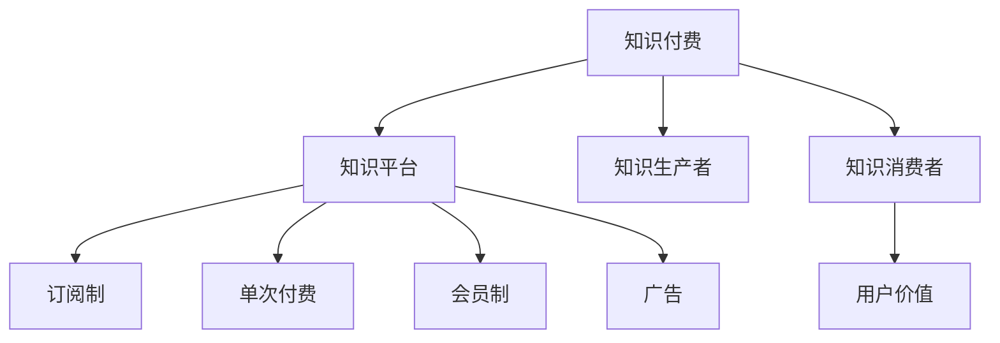

                 

# 知识经济时代下的知识付费创新商业模式运营

## 1. 背景介绍

### 1.1 问题由来

在知识经济时代，信息爆炸与知识过载成为人们面临的共同挑战。一方面，互联网和社交媒体的广泛应用使得信息获取更加便捷，但随之而来的海量和庞杂的信息也让人难以应对。另一方面，终身学习和职业发展的需求使得个人需要不断汲取新知识，但传统教育模式和网络的免费资源难以完全满足这种需求。

在这样的背景下，知识付费作为一种新兴的商业模式应运而生，旨在通过为优质知识内容赋予价值，来解决信息过载和知识获取困难的问题。知识付费不仅满足了个人快速获取系统化知识的需求，也带动了知识生产者和消费者的良性互动，促进了知识创新和传播。

然而，随着知识付费市场的快速增长，传统的商业模式也面临诸多挑战。平台同质化严重、用户体验不佳、内容质量参差不齐等问题逐渐凸显，导致用户流失、市场饱和度上升。为突破传统模式，知识付费产业亟需创新商业模式运营，提升用户价值和市场竞争力。

### 1.2 问题核心关键点

为了在知识付费领域实现创新运营，首先需要深入理解其核心关键点。主要包括：

1. **需求匹配与推荐算法**：用户需要快速获取个性化的高质量内容。
2. **多维度内容交互**：除了文字内容，视频、音频、图文等多种形式的内容形式需要高度集成。
3. **高效的知识生产与传播**：激励优质内容生产，保障内容的持续更新与传播。
4. **用户激励与互动**：通过互动增加用户粘性，推动内容传播与付费行为。
5. **数据驱动的个性化服务**：基于用户行为数据进行精准推荐，提升用户体验。
6. **技术融合与集成**：知识付费与教育、社交、娱乐等多领域的融合，实现一体化发展。

## 2. 核心概念与联系

### 2.1 核心概念概述

为更好地理解知识付费领域的创新运营模式，本节将介绍几个密切相关的核心概念：

- **知识付费**：指通过付费方式获取专业、系统、高质量的知识内容，从而加速个人学习与职业发展进程。
- **知识平台**：提供在线知识服务的平台，如付费课程、图书、讲座、文档等。
- **知识生产者**：创造和提供知识内容的专业人士，如专家学者、学者、作者、讲师等。
- **知识消费者**：通过付费获取知识内容以提升自身能力与竞争力的个人或组织。
- **用户价值**：用户从知识付费中获得的主观满意度，如内容的实用性、互动性、性价比等。
- **商业模式**：知识付费平台的盈利模式，如订阅制、单次付费、会员制、广告等。

这些核心概念之间的逻辑关系可以通过以下Mermaid流程图来展示：



这个流程图展示出知识付费的核心要素及其之间的关系：

1. 知识付费围绕知识平台展开。
2. 知识生产者和消费者通过知识平台进行知识交易。
3. 知识平台通过多种商业模式实现盈利。
4. 用户价值是知识付费的核心目标，驱动内容生产和平台发展。

这些概念共同构成了知识付费的商业生态，使知识生产与消费过程更加高效和便捷。

## 3. 核心算法原理 & 具体操作步骤
### 3.1 算法原理概述

知识付费平台的创新运营模式，其核心算法原理主要是围绕用户行为数据分析和个性化推荐展开的。具体来说，包括以下几个关键方面：

- **用户行为分析**：通过分析用户的浏览、点击、购买、评价等行为，了解用户需求和偏好。
- **内容推荐算法**：根据用户行为数据，使用机器学习算法推荐用户可能感兴趣的内容。
- **知识图谱构建**：通过知识图谱技术将知识内容进行结构化表示，提升内容查找与推荐的准确性。
- **广告投放算法**：利用用户行为数据进行定向广告投放，提升平台的盈利能力。

### 3.2 算法步骤详解

基于上述算法原理，知识付费平台的创新运营模式大致分为以下几个步骤：

**Step 1: 数据采集与预处理**
- 采集用户行为数据，包括浏览记录、购买记录、评价等。
- 清洗数据，处理缺失值和异常值。
- 数据分块，划分训练集、验证集和测试集。

**Step 2: 用户画像构建**
- 通过K-means等聚类算法，将用户分为不同类型。
- 使用特征工程，提取用户画像中的关键特征。
- 构建用户画像库，供推荐算法使用。

**Step 3: 内容画像构建**
- 对知识内容进行分词、标注、向量化等预处理。
- 构建内容画像库，存储内容的关键词、主题、难度等信息。
- 使用TF-IDF、Word2Vec等技术进行内容画像。

**Step 4: 推荐算法模型训练**
- 选择推荐算法模型，如协同过滤、基于内容的推荐、混合推荐等。
- 使用训练集数据训练模型。
- 在验证集上进行模型调优，确保模型的泛化性能。

**Step 5: 广告投放算法模型训练**
- 选择广告投放算法模型，如CTR模型、线性回归模型等。
- 使用训练集数据训练模型。
- 在测试集上进行模型调优，确保模型的精准度。

**Step 6: 实时推荐与广告投放**
- 实时采集用户行为数据，进行个性化推荐。
- 实时投放定向广告，提升用户粘性和平台盈利。
- 持续监控推荐效果和广告效果，进行优化。

### 3.3 算法优缺点

基于用户行为数据分析和个性化推荐算法的知识付费平台，具有以下优点：

1. **个性化推荐**：通过用户画像和内容画像，推荐符合用户偏好的高质量内容，提升用户体验。
2. **高效匹配**：快速匹配用户与内容，减少信息过载，节约用户时间。
3. **用户留存率提升**：个性化推荐增加了用户粘性，降低用户流失率。
4. **精准营销**：通过定向广告投放，提升平台的盈利能力。

同时，这种算法也存在一些缺点：

1. **数据隐私问题**：大量用户行为数据的收集和分析可能侵犯用户隐私。
2. **算法黑盒问题**：推荐算法和广告投放算法的复杂性可能导致其结果难以解释。
3. **内容质量问题**：推荐的优质内容数量和多样性取决于知识库的完备性和质量。
4. **计算资源消耗大**：数据处理和模型训练需要大量计算资源，可能影响平台效率。

### 3.4 算法应用领域

基于用户行为数据分析和个性化推荐算法的知识付费平台，已经在多个领域得到应用，例如：

- **在线教育平台**：如Coursera、Udemy、edX等，通过个性化推荐和内容更新，提高教学效果和用户满意度。
- **专业培训平台**：如LinkedIn Learning、Skillshare等，为用户提供职业发展相关的课程和资源。
- **知识社区平台**：如知乎、B站知识区等，通过精准推荐和知识图谱构建，提升内容分享与交流的效率。
- **企业培训平台**：如SAP SuccessFactors、Mindbody等，为企业员工提供专业技能培训，提升工作效能。

## 4. 数学模型和公式 & 详细讲解 & 举例说明

### 4.1 数学模型构建

在知识付费平台中，推荐算法的数学模型构建主要基于协同过滤和基于内容的推荐方法。以下是一个基于协同过滤的推荐模型公式推导过程：

假设用户$u$和物品$i$的评分矩阵为$R$，用户画像库为$U$，物品画像库为$I$，推荐模型为$P$，推荐结果为$P(u,i)$。推荐模型通过用户画像和物品画像计算相似度，得出推荐分数：

$$
P(u,i) = \sum_{j=1}^{n_u} w_j \times R(u,j) \times \hat{R}(j,i)
$$

其中，$n_u$为每个用户的评分总数，$w_j$为不同用户行为权重，$\hat{R}(j,i)$为物品$i$在物品画像库$I$中的评分预测值。

### 4.2 公式推导过程

基于协同过滤的推荐模型公式推导如下：

1. **用户画像与物品画像**：
   - 用户画像：$U = (u_1, u_2, ..., u_n)$，其中$u_i$为第$i$个用户的行为向量。
   - 物品画像：$I = (i_1, i_2, ..., i_m)$，其中$i_j$为第$j$个物品的特征向量。

2. **评分矩阵**：
   - $R = [r_{ij}]$，其中$r_{ij}$为用户$u_i$对物品$i_j$的评分。

3. **评分预测值**：
   - $\hat{R}(j,i) = \sum_{k=1}^{m_i} \alpha_k \times R(j,k) \times \phi_k(i)$
   - $\alpha_k$为物品画像库中第$k$个物品的权重，$\phi_k(i)$为物品画像库中第$k$个物品与物品$i$的相似度。

4. **推荐分数**：
   - $P(u,i) = \sum_{j=1}^{n_u} w_j \times R(u,j) \times \hat{R}(j,i)$

### 4.3 案例分析与讲解

以Coursera平台为例，分析其基于协同过滤的推荐算法：

1. **用户画像**：
   - 通过用户行为数据，如浏览记录、点击次数、购买记录等，构建用户画像。
   - 使用TF-IDF算法对用户行为进行向量化，生成用户行为向量。

2. **物品画像**：
   - 通过课程描述、教师背景、学生评价等，构建课程画像。
   - 使用Word2Vec算法对课程描述进行向量化，生成课程特征向量。

3. **评分矩阵**：
   - 通过用户对课程的评分记录，构建评分矩阵。
   - 将用户行为向量与课程特征向量进行内积运算，得到用户对课程的评分预测值。

4. **推荐分数**：
   - 将用户行为向量与课程特征向量进行内积运算，得到推荐分数。
   - 对推荐分数进行归一化处理，得到最终的推荐结果。

通过Coursera平台的实际案例，我们可以看到协同过滤推荐算法在知识付费领域的应用效果。

## 5. 项目实践：代码实例和详细解释说明
### 5.1 开发环境搭建

在进行知识付费平台的开发实践中，需要一个完整的开发环境。以下是使用Python和PyTorch搭建开发环境的流程：

1. 安装Python：
```bash
sudo apt-get install python3
```

2. 安装PyTorch：
```bash
pip install torch torchvision torchaudio
```

3. 安装Pandas：
```bash
pip install pandas
```

4. 安装Numpy：
```bash
pip install numpy
```

5. 安装Scikit-learn：
```bash
pip install scikit-learn
```

6. 安装Matplotlib：
```bash
pip install matplotlib
```

7. 安装Seaborn：
```bash
pip install seaborn
```

### 5.2 源代码详细实现

以下是一个使用PyTorch实现协同过滤推荐算法的Python代码示例：

```python
import torch
from torch.nn import Linear
from torch.nn.functional import relu, sigmoid
from sklearn.datasets import load_boston
from sklearn.model_selection import train_test_split

class协同过滤模型:
    def __init__(self, learning_rate, hidden_size):
        self.learning_rate = learning_rate
        self.hidden_size = hidden_size
        self.user_features = None
        self.item_features = None
        self.user_item_matrix = None
        self.user_item_weights = None
        self.user_item_biases = None

    def fit(self, user_features, item_features, user_item_matrix):
        self.user_features = user_features
        self.item_features = item_features
        self.user_item_matrix = user_item_matrix
        self.user_item_weights = torch.randn(len(user_features), len(item_features))
        self.user_item_biases = torch.randn(len(user_features))
        self.train()

    def train(self, epochs=10):
        for epoch in range(epochs):
            for user_index, user_features_i in enumerate(self.user_features):
                for item_index, item_features_j in enumerate(self.item_features):
                    user_item_matrix_i_j = self.user_item_matrix[user_index, item_index]
                    user_item_weights_i_j = self.user_item_weights[user_index, item_index]
                    user_item_biases_i = self.user_item_biases[user_index]

                    # 计算预测评分
                    prediction_score = torch.matmul(user_features_i, user_item_weights_i_j) + user_item_biases_i

                    # 计算损失
                    loss = torch.mean(torch.square(prediction_score - user_item_matrix_i_j))

                    # 反向传播更新参数
                    loss.backward()
                    self.user_item_weights[user_index, item_index].data -= self.learning_rate * self.user_item_weights[user_index, item_index].grad.data
                    self.user_item_biases[user_index].data -= self.learning_rate * self.user_item_biases[user_index].grad.data
                    self.user_item_weights[user_index, item_index].grad.data.zero_()
                    self.user_item_biases[user_index].grad.data.zero_()

    def predict(self, user_index, item_index):
        user_features_i = self.user_features[user_index]
        item_features_j = self.item_features[item_index]
        user_item_weights_i_j = self.user_item_weights[user_index, item_index]
        user_item_biases_i = self.user_item_biases[user_index]
        prediction_score = torch.matmul(user_features_i, user_item_weights_i_j) + user_item_biases_i
        return prediction_score.data.numpy()[0]
```

### 5.3 代码解读与分析

下面是代码的详细解读：

1. **类定义**：
   - `协同过滤模型`：包含用户特征、物品特征、用户-物品矩阵、用户-物品权重和偏置等属性。
   - `fit`方法：根据用户特征、物品特征和用户-物品矩阵进行模型训练。
   - `train`方法：在训练过程中计算损失并更新参数。
   - `predict`方法：根据用户特征、物品特征、权重和偏置进行预测。

2. **数据加载**：
   - `load_boston`方法：从sklearn中加载波士顿房价数据集。
   - `train_test_split`方法：将数据集划分为训练集和测试集。

3. **模型训练**：
   - `for`循环：遍历训练集中的每个样本。
   - `matmul`方法：计算矩阵乘法，得到预测评分。
   - `square`方法：对预测评分和真实评分的差异进行平方。
   - `mean`方法：计算平均损失。
   - `backward`方法：反向传播更新参数。

4. **模型预测**：
   - `matmul`方法：计算预测评分。
   - `data`方法：获取预测评分的数值。
   - `numpy`方法：将Tensor转换为numpy数组，方便输出结果。

5. **运行结果展示**：
   - 在训练集上，可以通过调用`predict`方法得到预测评分，并与真实评分对比，评估模型的效果。
   - 在测试集上，同样可以通过调用`predict`方法得到预测评分，并计算平均绝对误差或均方误差等评价指标。

## 6. 实际应用场景
### 6.4 未来应用展望

随着知识付费市场的不断发展，未来的知识付费平台将呈现以下几个趋势：

1. **内容生态的多元化**：除了传统的视频课程、音频讲座，未来的知识付费平台将更加注重内容的丰富性和多样性，包括图书、电子书、实时互动等形式。

2. **技术融合与创新**：知识付费平台将更加注重技术与内容的融合，如AR、VR、人工智能等技术的应用，提升用户体验和内容质量。

3. **个性化服务的深化**：基于用户行为数据分析和推荐算法，未来的知识付费平台将实现更加精准、个性化的推荐服务，提升用户满意度。

4. **全球化与本地化结合**：知识付费平台将更加注重全球化和本地化的结合，满足不同地区和语言的用户需求。

5. **多渠道内容分发**：未来的知识付费平台将通过多渠道分发内容，如社交媒体、搜索引擎、智能音箱等，实现内容的广泛传播。

6. **社交与互动功能**：未来的知识付费平台将更加注重社交和互动功能，如评论、点赞、分享等，提升用户粘性和参与度。

## 7. 工具和资源推荐
### 7.1 学习资源推荐

为了帮助开发者系统掌握知识付费领域的创新运营模式，这里推荐一些优质的学习资源：

1. **《知识付费与技术创新》课程**：由知名专家开设的在线课程，深入浅出地讲解知识付费的理论基础和前沿技术。
2. **《知识付费平台运营指南》书籍**：系统介绍知识付费平台的运营策略、用户行为分析、推荐算法等内容，适合实战操作。
3. **《深度学习与知识图谱》书籍**：讲解如何通过深度学习技术和知识图谱构建高质量推荐系统。
4. **HuggingFace官方文档**：提供丰富的自然语言处理模型和工具，适合学习知识付费平台中的推荐算法和知识图谱构建。
5. **Coursera官方博客**：分享Coursera平台在知识付费领域的运营经验和案例，适合借鉴和学习。

通过对这些资源的学习实践，相信你一定能够快速掌握知识付费平台的创新运营模式，并用于解决实际的运营问题。

### 7.2 开发工具推荐

高效的开发离不开优秀的工具支持。以下是几款用于知识付费平台开发的常用工具：

1. **PyTorch**：基于Python的开源深度学习框架，灵活动态的计算图，适合快速迭代研究。
2. **TensorFlow**：由Google主导开发的开源深度学习框架，生产部署方便，适合大规模工程应用。
3. **Transformers库**：HuggingFace开发的NLP工具库，集成了众多SOTA语言模型，适合知识付费平台中的推荐算法和知识图谱构建。
4. **Jupyter Notebook**：开源的交互式编程环境，支持多语言代码编写和实时展示结果，适合实验和调试。
5. **Git**：版本控制系统，方便多人协作开发和代码版本管理。

合理利用这些工具，可以显著提升知识付费平台的开发效率，加快创新迭代的步伐。

### 7.3 相关论文推荐

知识付费平台的发展离不开学界的持续研究。以下是几篇奠基性的相关论文，推荐阅读：

1. **知识付费平台推荐算法研究**：介绍基于协同过滤和基于内容的推荐算法，并分析其应用效果。
2. **知识付费平台用户行为分析**：研究用户行为数据挖掘与分析技术，提升用户画像构建的准确性。
3. **知识付费平台广告投放策略**：探讨广告定向投放和效果评估方法，提升平台的盈利能力。
4. **知识付费平台内容生态构建**：分析内容生态的多元化和协同构建，提升平台的竞争力。

这些论文代表了大知识付费平台的研究方向和发展脉络。通过学习这些前沿成果，可以帮助研究者把握学科前进方向，激发更多的创新灵感。

## 8. 总结：未来发展趋势与挑战
### 8.1 研究成果总结

本文对知识付费平台的创新运营模式进行了全面系统的介绍。首先，阐述了知识付费领域面临的核心关键点和挑战。其次，从原理到实践，详细讲解了推荐算法和广告投放算法的数学模型和具体操作。同时，本文还广泛探讨了知识付费平台在多个领域的应用前景，展示了知识付费平台的巨大潜力。

通过本文的系统梳理，可以看到，知识付费平台的创新运营模式在信息时代具有重要意义，能够有效解决信息过载和知识获取困难的问题，同时也带来了新的商业模式和用户需求。未来，伴随技术的不断进步和市场需求的进一步升级，知识付费平台必将迎来更加广阔的发展空间。

### 8.2 未来发展趋势

展望未来，知识付费平台的创新运营模式将呈现以下几个发展趋势：

1. **技术融合与创新**：知识付费平台将更加注重技术创新和融合，如AR、VR、人工智能等技术的应用，提升用户体验和内容质量。
2. **内容生态的多元化**：除了传统的视频课程、音频讲座，未来的知识付费平台将更加注重内容的丰富性和多样性，包括图书、电子书、实时互动等形式。
3. **个性化服务的深化**：基于用户行为数据分析和推荐算法，未来的知识付费平台将实现更加精准、个性化的推荐服务，提升用户满意度。
4. **全球化与本地化结合**：知识付费平台将更加注重全球化和本地化的结合，满足不同地区和语言的用户需求。
5. **多渠道内容分发**：未来的知识付费平台将通过多渠道分发内容，如社交媒体、搜索引擎、智能音箱等，实现内容的广泛传播。
6. **社交与互动功能**：未来的知识付费平台将更加注重社交和互动功能，如评论、点赞、分享等，提升用户粘性和参与度。

这些趋势凸显了知识付费平台在知识经济时代的重要价值，也预示着未来的发展方向和潜力。

### 8.3 面临的挑战

尽管知识付费平台在知识经济时代具有重要意义，但在迈向更加智能化、普适化应用的过程中，仍面临诸多挑战：

1. **内容质量与多样性问题**：如何提供高质量、多样化的内容，满足用户需求，提升用户满意度。
2. **用户行为分析与隐私问题**：如何有效利用用户行为数据进行推荐，同时保护用户隐私。
3. **技术实现与成本问题**：如何平衡技术实现和成本控制，确保平台的可持续运营。
4. **广告投放与用户体验**：如何避免过度广告干扰，提升用户体验。
5. **市场竞争与品牌差异化**：如何在激烈的市场竞争中，建立独特的品牌形象，提升市场竞争力。

### 8.4 研究展望

面对知识付费平台面临的挑战，未来的研究需要在以下几个方面寻求新的突破：

1. **内容质量提升**：通过优化内容生成和审核机制，提升内容的准确性和多样性，满足用户需求。
2. **隐私保护与数据安全**：研究隐私保护技术，保障用户数据安全，提升用户信任度。
3. **技术优化与成本控制**：开发高效、低成本的技术方案，提升平台运营效率，降低成本。
4. **广告投放与用户需求**：研究精准广告投放策略，减少广告干扰，提升用户体验。
5. **品牌建设与市场竞争力**：通过市场调研和用户反馈，建立独特的品牌形象，提升市场竞争力。

这些研究方向的探索，必将引领知识付费平台向更高的台阶发展，为知识经济时代带来新的动力。

## 9. 附录：常见问题与解答

**Q1: 知识付费平台的推荐算法是如何实现的？**

A: 知识付费平台的推荐算法主要基于协同过滤和基于内容的推荐方法。具体实现步骤如下：

1. **用户画像与物品画像**：通过用户行为数据和物品特征数据，构建用户画像和物品画像。
2. **评分矩阵**：构建用户对物品的评分矩阵，用于计算推荐分数。
3. **评分预测值**：使用机器学习算法计算物品的评分预测值。
4. **推荐分数**：根据用户画像、物品画像、评分矩阵和评分预测值计算推荐分数，得到最终推荐结果。

**Q2: 如何提高知识付费平台的推荐精度？**

A: 提高知识付费平台的推荐精度，可以从以下几个方面进行优化：

1. **数据质量提升**：确保用户行为数据的准确性和完整性，避免数据噪音影响推荐效果。
2. **算法模型优化**：使用先进的推荐算法模型，如深度学习、协同过滤等，提升推荐精度。
3. **特征工程改进**：提取更丰富的用户行为特征和物品特征，提升推荐模型的准确性。
4. **上下文感知**：引入上下文信息，如时间、地点、用户情绪等，提升推荐效果。
5. **实时更新**：实时更新推荐模型，保持模型与数据分布的一致性，提升推荐精度。

**Q3: 知识付费平台如何平衡盈利与用户体验？**

A: 知识付费平台平衡盈利与用户体验，可以从以下几个方面进行优化：

1. **广告投放策略**：优化广告投放策略，减少广告干扰，提升用户体验。
2. **推荐算法优化**：提升推荐算法精度，减少无效推荐，提升用户满意度。
3. **内容多样化**：提供多样化、高质量的内容，满足用户需求，提升用户粘性。
4. **个性化服务**：实现个性化推荐，提升用户体验，增加用户粘性。
5. **反馈机制**：建立用户反馈机制，及时调整平台策略，优化用户体验。

**Q4: 知识付费平台的可持续发展策略是什么？**

A: 知识付费平台的可持续发展策略，可以从以下几个方面进行优化：

1. **内容质量与多样性**：提供高质量、多样化的内容，满足用户需求，提升用户满意度。
2. **技术优化与成本控制**：开发高效、低成本的技术方案，提升平台运营效率，降低成本。
3. **用户行为分析**：通过用户行为数据分析，优化推荐算法，提升用户体验。
4. **市场调研与用户反馈**：通过市场调研和用户反馈，了解用户需求，优化平台策略。
5. **品牌建设与市场竞争力**：建立独特的品牌形象，提升市场竞争力，增加用户粘性。

这些策略将帮助知识付费平台在知识经济时代实现可持续发展，为用户创造更大的价值。

---

作者：禅与计算机程序设计艺术 / Zen and the Art of Computer Programming

