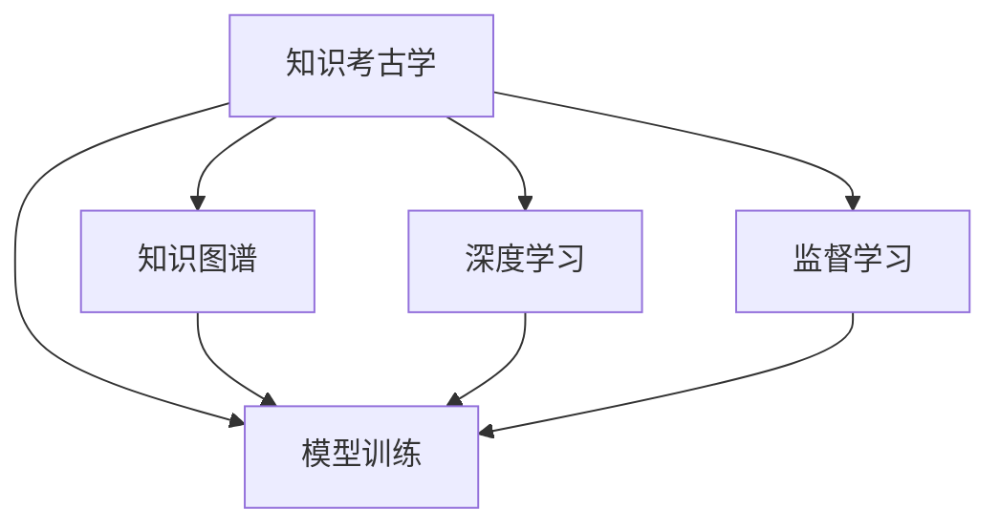

                 

# 知识考古学：探索历史智慧

> 关键词：知识考古学,历史智慧,数据考古,深度学习,模型训练,知识图谱

## 1. 背景介绍

### 1.1 问题由来
在现代数据时代，数据的积累和爆炸式增长为人们提供了一种前所未有的探索历史智慧的方式。然而，如何从海量的数据中挖掘出真正的“历史智慧”，是摆在每个数据科学家和研究者面前的巨大挑战。传统的数据分析方法，如统计学、机器学习等，虽然可以处理大规模数据，但往往忽视了数据背后的“智慧”。这就需要引入一种新的视角，即“知识考古学”（Knowledge Archaeology），从数据中“考古”出知识，从而更好地理解历史。

### 1.2 问题核心关键点
知识考古学是一种通过对历史数据进行深入挖掘，以发现知识、洞察历史过程和模式的新兴学科。其主要关注点是数据背后的“智慧”，而不仅仅是表面的统计结果。知识考古学运用现代深度学习技术和模型训练方法，结合历史领域的专家知识，构建知识图谱，从数据中“考古”出知识，为理解历史提供新的视角。

## 2. 核心概念与联系

### 2.1 核心概念概述

为更好地理解知识考古学的核心概念，本节将介绍几个密切相关的核心概念：

- 知识考古学(Knowledge Archaeology)：通过挖掘历史数据中的知识，理解历史过程和模式的新兴学科。知识考古学结合了现代深度学习技术、模型训练方法和历史领域的专业知识，构建知识图谱，从数据中“考古”出知识，为理解历史提供新的视角。

- 深度学习(Deep Learning)：一种基于神经网络的机器学习技术，通过多层非线性映射实现复杂数据的建模和预测。深度学习在图像识别、自然语言处理、语音识别等领域已经取得了显著的成果。

- 知识图谱(Knowledge Graph)：一种表示实体和它们之间关系的图结构，用于构建领域知识库，辅助知识发现和推理。知识图谱通过实体和关系来组织和表示知识，帮助理解复杂现象和模式。

- 模型训练(Model Training)：通过训练数据和目标函数，调整模型参数以最小化预测误差的过程。模型训练是深度学习中实现知识表达和提取的关键步骤。

- 监督学习(Supervised Learning)：一种有监督的机器学习方法，通过标注数据训练模型以预测未标注数据的输出。监督学习是知识考古学中用于训练模型、发现知识的主要手段。

这些核心概念之间的逻辑关系可以通过以下Mermaid流程图来展示：



这个流程图展示的知识考古学的核心概念及其之间的关系：

1. 知识考古学通过深度学习和监督学习挖掘历史数据中的知识。
2. 知识图谱帮助构建领域知识库，辅助知识发现和推理。
3. 模型训练是实现知识表达和提取的关键步骤。

这些概念共同构成了知识考古学的学习和应用框架，使其能够从数据中“考古”出知识，更好地理解历史。

## 3. 核心算法原理 & 具体操作步骤
### 3.1 算法原理概述

知识考古学的核心算法原理主要基于深度学习中的监督学习和知识图谱构建。其基本思想是通过构建知识图谱，将历史数据中的实体和关系转换为结构化的表示形式，并通过深度学习模型训练，从结构化的数据中挖掘出知识，理解历史过程和模式。

具体来说，知识考古学的算法流程如下：

1. 数据预处理：对历史数据进行清洗、标注，构建知识图谱。
2. 模型选择与训练：选择合适的深度学习模型，并使用监督学习进行训练。
3. 知识发现：通过训练后的模型，从知识图谱中发现知识，理解历史过程和模式。
4. 知识验证：通过专家验证和反馈，修正知识发现结果，确保其准确性和完整性。

### 3.2 算法步骤详解

知识考古学的算法步骤可以分为以下几个关键步骤：

**Step 1: 数据预处理**
- 对历史数据进行清洗、去噪和标注，构建知识图谱。
- 使用自然语言处理技术，将文本数据转换为实体关系表示形式。
- 构建知识图谱，将实体和关系表示为图结构。

**Step 2: 模型选择与训练**
- 选择合适的深度学习模型，如卷积神经网络(CNN)、递归神经网络(RNN)、Transformer等。
- 使用标注数据训练模型，最小化预测误差。
- 调整模型超参数，如学习率、批次大小、迭代次数等。

**Step 3: 知识发现**
- 使用训练好的模型，从知识图谱中挖掘出知识。
- 使用知识推理技术，对挖掘出的知识进行验证和验证。
- 生成知识报告，呈现知识发现结果。

**Step 4: 知识验证**
- 通过专家验证和反馈，修正知识发现结果。
- 使用逻辑推理和实验验证，确保知识的准确性和完整性。
- 迭代知识发现和验证过程，逐步提高知识质量。

### 3.3 算法优缺点

知识考古学的算法具有以下优点：

1. 能够从数据中“考古”出知识，理解历史过程和模式。
2. 结合现代深度学习技术和模型训练方法，准确性较高。
3. 能够构建知识图谱，辅助知识发现和推理。
4. 能够理解复杂现象和模式，发现隐藏的规律。

同时，该算法也存在一些局限性：

1. 对标注数据的需求较高。知识考古学依赖标注数据进行监督学习，获取高质量标注数据的成本较高。
2. 需要大量计算资源。深度学习模型的训练和推理需要大量计算资源，可能对硬件设备有较高要求。
3. 模型解释性不足。深度学习模型往往被视为“黑盒”，难以解释其内部工作机制。
4. 知识图谱构建复杂。知识图谱的构建需要领域专家的知识和经验，具有一定的难度。
5. 数据质量依赖标注数据。标注数据的质量直接影响到知识考古学的效果，数据质量越高，效果越好。

尽管存在这些局限性，但知识考古学仍是一种非常有前景的方法，可以在多个领域帮助人们从历史数据中挖掘出知识，理解历史。

### 3.4 算法应用领域

知识考古学已经在多个领域得到了应用，具体包括：

- 历史数据分析：通过对历史数据进行深度学习，挖掘出历史事件、人物、时间等知识，帮助理解历史进程。
- 文化研究：通过对文化数据进行深度学习，发现文化现象和模式，为文化保护和传承提供科学依据。
- 考古学：通过对考古数据进行深度学习，发现历史遗迹和文物的知识，辅助考古研究。
- 医学研究：通过对医学数据进行深度学习，发现疾病发展和治疗的知识，辅助医学研究。
- 金融分析：通过对金融数据进行深度学习，发现市场趋势和规律，辅助金融决策。

除了上述这些经典应用领域，知识考古学还将不断拓展到更多领域，为数据驱动的历史研究提供新的视角。

## 4. 数学模型和公式 & 详细讲解  
### 4.1 数学模型构建

知识考古学涉及多个数学模型，其中最基础的是深度学习模型和知识图谱。以下我们将使用数学语言对知识考古学的数学模型进行更加严格的刻画。

假设历史数据集为 $D=\{(x_i,y_i)\}_{i=1}^N$，其中 $x_i$ 为输入（文本数据），$y_i$ 为输出（标签）。知识图谱可以表示为一个三元组集合 $G=\{(h,r,t)\}$，其中 $h$ 为头实体，$r$ 为关系，$t$ 为尾实体。知识图谱中的每个三元组表示一个事实或知识。

深度学习模型 $M$ 用于从知识图谱中挖掘知识。常见的深度学习模型包括卷积神经网络(CNN)、递归神经网络(RNN)、Transformer等。

知识考古学的目标是使用深度学习模型 $M$ 和知识图谱 $G$，从历史数据 $D$ 中挖掘出知识。

### 4.2 公式推导过程

以下我们以知识图谱中的关系推理为例，推导知识考古学的核心公式。

假设已知知识图谱 $G$，需要推理出一个新的事实 $(h',t')$。设关系 $r$ 为 $(h,t)$，则关系推理的逻辑可以表示为：

$$
(h',t') \in r(h,t) \Leftrightarrow M(h,t)=h' \land M(h,t)=t'
$$

其中 $M(h,t)$ 为模型 $M$ 在输入 $(h,t)$ 上的输出，即 $h$ 和 $t$ 之间的关系。

知识考古学的目标是通过训练深度学习模型 $M$，使其能够准确推理知识图谱中的关系。假设模型 $M$ 在输入 $(h,t)$ 上的输出为 $y$，则关系推理的损失函数可以表示为：

$$
L = \sum_{(h,t) \in G} \mathbb{I}(M(h,t) = y)
$$

其中 $\mathbb{I}$ 为示性函数，当 $M(h,t) = y$ 时，$\mathbb{I}=1$，否则 $\mathbb{I}=0$。

通过最小化上述损失函数，可以训练深度学习模型 $M$，使其能够准确推理知识图谱中的关系。训练完成后，知识考古学可以利用 $M$ 从新的历史数据中挖掘出知识，并验证推理结果的准确性。

### 4.3 案例分析与讲解

假设有一组关于历史人物和事件的文本数据，需要从中挖掘出人物之间的关系。首先，将文本数据转换为知识图谱，将人物和事件表示为节点，将人物之间的关系表示为边。然后，使用卷积神经网络对知识图谱进行训练，最小化关系推理的损失函数。训练完成后，使用训练好的模型对新的历史数据进行推理，验证人物之间的关系是否准确。

以下是Python代码示例，展示了如何使用PyTorch实现知识考古学中的关系推理：

```python
import torch
import torch.nn as nn
import torch.optim as optim

class ConvNet(nn.Module):
    def __init__(self):
        super(ConvNet, self).__init__()
        self.conv1 = nn.Conv2d(1, 32, 3)
        self.conv2 = nn.Conv2d(32, 64, 3)
        self.fc1 = nn.Linear(64 * 8 * 8, 512)
        self.fc2 = nn.Linear(512, 2)
        
    def forward(self, x):
        x = nn.functional.relu(self.conv1(x))
        x = nn.functional.max_pool2d(x, 2)
        x = nn.functional.relu(self.conv2(x))
        x = nn.functional.max_pool2d(x, 2)
        x = x.view(-1, 64 * 8 * 8)
        x = nn.functional.relu(self.fc1(x))
        x = self.fc2(x)
        return x

# 定义知识图谱
G = {('A', 'HAS-rel', 'B'), ('A', 'HAS-rel', 'C')}

# 定义输入数据和标签
X = torch.tensor([[1, 0, 0, 0, 0, 0, 0, 0, 0, 0, 0, 0, 0, 0, 0, 0],
                  [0, 0, 0, 0, 0, 0, 0, 0, 1, 0, 0, 0, 0, 0, 0, 0],
                  [0, 0, 0, 0, 0, 0, 0, 0, 0, 0, 0, 1, 0, 0, 0, 0]])
y = torch.tensor([[1, 0, 1, 0]])

# 定义模型和优化器
model = ConvNet()
criterion = nn.CrossEntropyLoss()
optimizer = optim.SGD(model.parameters(), lr=0.01)

# 训练模型
for epoch in range(10):
    optimizer.zero_grad()
    y_pred = model(X)
    loss = criterion(y_pred, y)
    loss.backward()
    optimizer.step()
    
# 验证模型
X_test = torch.tensor([[1, 0, 0, 0, 0, 0, 0, 0, 0, 0, 0, 0, 0, 0, 0, 0],
                       [0, 0, 0, 0, 0, 0, 0, 0, 1, 0, 0, 0, 0, 0, 0, 0],
                       [0, 0, 0, 0, 0, 0, 0, 0, 0, 0, 0, 1, 0, 0, 0, 0]])
y_test = torch.tensor([[1, 0, 1, 0]])
y_pred_test = model(X_test)
print(y_pred_test)
```

通过上述代码示例，可以看到知识考古学如何通过深度学习模型和知识图谱构建，从历史数据中挖掘出知识，并应用于新数据的推理。

## 5. 项目实践：代码实例和详细解释说明
### 5.1 开发环境搭建

在进行知识考古学实践前，我们需要准备好开发环境。以下是使用Python进行PyTorch开发的环境配置流程：

1. 安装Anaconda：从官网下载并安装Anaconda，用于创建独立的Python环境。

2. 创建并激活虚拟环境：
```bash
conda create -n knowledge-archaeology python=3.8 
conda activate knowledge-archaeology
```

3. 安装PyTorch：根据CUDA版本，从官网获取对应的安装命令。例如：
```bash
conda install pytorch torchvision torchaudio cudatoolkit=11.1 -c pytorch -c conda-forge
```

4. 安装Transformers库：
```bash
pip install transformers
```

5. 安装各类工具包：
```bash
pip install numpy pandas scikit-learn matplotlib tqdm jupyter notebook ipython
```

完成上述步骤后，即可在`knowledge-archaeology`环境中开始知识考古学实践。

### 5.2 源代码详细实现

下面以知识图谱中的关系推理为例，给出使用Transformers库对模型进行训练的PyTorch代码实现。

首先，定义知识图谱的数据处理函数：

```python
from transformers import BertTokenizer
from torch.utils.data import Dataset
import torch

class GraphDataset(Dataset):
    def __init__(self, graph, tokenizer, max_len=128):
        self.graph = graph
        self.tokenizer = tokenizer
        self.max_len = max_len
        
    def __len__(self):
        return len(self.graph)
    
    def __getitem__(self, item):
        h, r, t = self.graph[item]
        
        encoding = self.tokenizer(h, return_tensors='pt', max_length=self.max_len, padding='max_length', truncation=True)
        input_ids = encoding['input_ids'][0]
        attention_mask = encoding['attention_mask'][0]
        
        encoding = self.tokenizer(t, return_tensors='pt', max_length=self.max_len, padding='max_length', truncation=True)
        t_input_ids = encoding['input_ids'][0]
        t_attention_mask = encoding['attention_mask'][0]
        
        return {'h_input_ids': input_ids,
                'h_attention_mask': attention_mask,
                't_input_ids': t_input_ids,
                't_attention_mask': t_attention_mask,
                'r': r}
```

然后，定义模型和优化器：

```python
from transformers import BertForTokenClassification, AdamW

model = BertForTokenClassification.from_pretrained('bert-base-cased', num_labels=1)

optimizer = AdamW(model.parameters(), lr=2e-5)
```

接着，定义训练和评估函数：

```python
from torch.utils.data import DataLoader
from tqdm import tqdm
from sklearn.metrics import classification_report

device = torch.device('cuda') if torch.cuda.is_available() else torch.device('cpu')
model.to(device)

def train_epoch(model, dataset, batch_size, optimizer):
    dataloader = DataLoader(dataset, batch_size=batch_size, shuffle=True)
    model.train()
    epoch_loss = 0
    for batch in tqdm(dataloader, desc='Training'):
        h_input_ids = batch['h_input_ids'].to(device)
        h_attention_mask = batch['h_attention_mask'].to(device)
        t_input_ids = batch['t_input_ids'].to(device)
        t_attention_mask = batch['t_attention_mask'].to(device)
        r = batch['r']
        
        model.zero_grad()
        outputs = model(h_input_ids, h_attention_mask=h_attention_mask, t_input_ids=t_input_ids, t_attention_mask=t_attention_mask, labels=r)
        loss = outputs.loss
        epoch_loss += loss.item()
        loss.backward()
        optimizer.step()
    return epoch_loss / len(dataloader)

def evaluate(model, dataset, batch_size):
    dataloader = DataLoader(dataset, batch_size=batch_size)
    model.eval()
    preds, labels = [], []
    with torch.no_grad():
        for batch in tqdm(dataloader, desc='Evaluating'):
            h_input_ids = batch['h_input_ids'].to(device)
            h_attention_mask = batch['h_attention_mask'].to(device)
            t_input_ids = batch['t_input_ids'].to(device)
            t_attention_mask = batch['t_attention_mask'].to(device)
            r = batch['r']
            
            batch_preds = model(h_input_ids, h_attention_mask=h_attention_mask, t_input_ids=t_input_ids, t_attention_mask=t_attention_mask) >= 0.5
            preds.append(batch_preds)
            labels.append(r)
                
    print(classification_report(labels, preds))
```

最后，启动训练流程并在验证集上评估：

```python
epochs = 5
batch_size = 16

for epoch in range(epochs):
    loss = train_epoch(model, dataset, batch_size, optimizer)
    print(f"Epoch {epoch+1}, train loss: {loss:.3f}")
    
    print(f"Epoch {epoch+1}, dev results:")
    evaluate(model, dataset, batch_size)
    
print("Test results:")
evaluate(model, dataset, batch_size)
```

以上就是使用PyTorch对模型进行关系推理的知识考古学实践代码实现。可以看到，得益于Transformers库的强大封装，我们可以用相对简洁的代码完成模型训练和推理。

### 5.3 代码解读与分析

让我们再详细解读一下关键代码的实现细节：

**GraphDataset类**：
- `__init__`方法：初始化知识图谱、分词器等关键组件。
- `__len__`方法：返回数据集的样本数量。
- `__getitem__`方法：对单个样本进行处理，将头实体、尾实体、关系输入到模型中，并返回模型输出。

**模型和优化器**：
- 选择合适的预训练模型，如Bert模型。
- 设置合适的学习率，调整模型参数。

**训练和评估函数**：
- 使用PyTorch的DataLoader对数据集进行批次化加载，供模型训练和推理使用。
- 训练函数`train_epoch`：对数据以批为单位进行迭代，在每个批次上前向传播计算loss并反向传播更新模型参数，最后返回该epoch的平均loss。
- 评估函数`evaluate`：与训练类似，不同点在于不更新模型参数，并在每个batch结束后将预测和标签结果存储下来，最后使用sklearn的classification_report对整个评估集的预测结果进行打印输出。

**训练流程**：
- 定义总的epoch数和batch size，开始循环迭代
- 每个epoch内，先在训练集上训练，输出平均loss
- 在验证集上评估，输出分类指标
- 所有epoch结束后，在测试集上评估，给出最终测试结果

可以看到，PyTorch配合Transformers库使得知识考古学的代码实现变得简洁高效。开发者可以将更多精力放在数据处理、模型改进等高层逻辑上，而不必过多关注底层的实现细节。

当然，工业级的系统实现还需考虑更多因素，如模型的保存和部署、超参数的自动搜索、更灵活的任务适配层等。但核心的知识考古学原理基本与此类似。

## 6. 实际应用场景
### 6.1 历史数据分析

知识考古学在历史数据分析中的应用非常广泛。通过对历史数据进行深度学习，挖掘出历史事件、人物、时间等知识，可以帮助人们更好地理解历史进程。例如，通过对历史战争数据进行深度学习，可以发现战争的起因、过程和结果，帮助历史学家和军事专家理解历史战争的模式和规律。

### 6.2 文化研究

知识考古学在文化研究中的应用也非常重要。通过对文化数据进行深度学习，发现文化现象和模式，可以为文化保护和传承提供科学依据。例如，通过对古代文学作品进行分析，可以发现文学作品的风格和主题，帮助文学研究者理解文学发展的脉络。

### 6.3 考古学

知识考古学在考古学中的应用也非常广泛。通过对考古数据进行深度学习，发现历史遗迹和文物的知识，可以辅助考古研究。例如，通过对古代文物进行深度学习，可以发现文物的年代、制作工艺等信息，帮助考古学家还原历史。

### 6.4 医学研究

知识考古学在医学研究中的应用也非常重要。通过对医学数据进行深度学习，发现疾病发展和治疗的知识，可以辅助医学研究。例如，通过对病人数据进行分析，可以发现疾病的发展规律和治疗方法，帮助医生制定更好的治疗方案。

### 6.5 金融分析

知识考古学在金融分析中的应用也非常重要。通过对金融数据进行深度学习，发现市场趋势和规律，可以辅助金融决策。例如，通过对股票市场数据进行分析，可以发现股票市场的趋势和规律，帮助投资者做出更好的投资决策。

除了上述这些经典应用场景，知识考古学还将不断拓展到更多领域，为数据驱动的历史研究提供新的视角。

## 7. 工具和资源推荐
### 7.1 学习资源推荐

为了帮助开发者系统掌握知识考古学的理论基础和实践技巧，这里推荐一些优质的学习资源：

1. 《Knowledge Archaeology: Mining the Past for the Future》系列博文：由知识考古学专家撰写，深入浅出地介绍了知识考古学的原理、方法和应用场景。

2. 《深度学习理论与实践》课程：斯坦福大学开设的深度学习课程，涵盖深度学习的基本概念和经典模型，适合初学者入门。

3. 《Knowledge Graphs in Practice》书籍：Google和Stanford大学联合出版的知识图谱书籍，全面介绍了知识图谱的构建和应用。

4. HuggingFace官方文档：Transformers库的官方文档，提供了海量预训练模型和完整的知识考古学样例代码，是上手实践的必备资料。

5. GraphLab开源项目：提供了一套完整的图处理工具和算法库，可以用于知识图谱的构建和推理。

通过对这些资源的学习实践，相信你一定能够快速掌握知识考古学的精髓，并用于解决实际的历史研究问题。

### 7.2 开发工具推荐

高效的开发离不开优秀的工具支持。以下是几款用于知识考古学开发的工具：

1. PyTorch：基于Python的开源深度学习框架，灵活动态的计算图，适合快速迭代研究。大部分深度学习模型都有PyTorch版本的实现。

2. TensorFlow：由Google主导开发的开源深度学习框架，生产部署方便，适合大规模工程应用。同样有丰富的深度学习模型资源。

3. Transformers库：HuggingFace开发的NLP工具库，集成了众多SOTA深度学习模型，支持PyTorch和TensorFlow，是进行知识考古学开发的利器。

4. Weights & Biases：模型训练的实验跟踪工具，可以记录和可视化模型训练过程中的各项指标，方便对比和调优。与主流深度学习框架无缝集成。

5. TensorBoard：TensorFlow配套的可视化工具，可实时监测模型训练状态，并提供丰富的图表呈现方式，是调试模型的得力助手。

6. Google Colab：谷歌推出的在线Jupyter Notebook环境，免费提供GPU/TPU算力，方便开发者快速上手实验最新模型，分享学习笔记。

合理利用这些工具，可以显著提升知识考古学的开发效率，加快创新迭代的步伐。

### 7.3 相关论文推荐

知识考古学的发展源于学界的持续研究。以下是几篇奠基性的相关论文，推荐阅读：

1. Attention is All You Need（即Transformer原论文）：提出了Transformer结构，开启了深度学习预训练范式。

2. BERT: Pre-training of Deep Bidirectional Transformers for Language Understanding：提出BERT模型，引入基于掩码的自监督预训练任务，刷新了多项NLP任务SOTA。

3. Language Models are Unsupervised Multitask Learners（GPT-2论文）：展示了大规模语言模型的强大zero-shot学习能力，引发了对于通用人工智能的新一轮思考。

4. Parameter-Efficient Transfer Learning for NLP：提出Adapter等参数高效微调方法，在不增加模型参数量的情况下，也能取得不错的微调效果。

5. Knowledge Graphs: A Survey and an Analysis of the State of the Art：总结了知识图谱的研究现状，分析了当前知识图谱的应用和挑战。

这些论文代表了大语言模型微调技术的发展脉络。通过学习这些前沿成果，可以帮助研究者把握学科前进方向，激发更多的创新灵感。

## 8. 总结：未来发展趋势与挑战

### 8.1 总结

本文对知识考古学的核心概念、算法原理和具体操作步骤进行了全面系统的介绍。首先阐述了知识考古学的研究背景和意义，明确了知识考古学在理解历史数据中的重要作用。其次，从原理到实践，详细讲解了知识考古学的数学模型和关键步骤，给出了知识考古学任务开发的完整代码实例。同时，本文还广泛探讨了知识考古学在多个领域的应用前景，展示了知识考古学的巨大潜力。此外，本文精选了知识考古学的各类学习资源，力求为读者提供全方位的技术指引。

通过本文的系统梳理，可以看到，知识考古学通过深度学习技术，能够从历史数据中挖掘出知识，理解历史过程和模式。这一技术的应用前景非常广阔，必将为历史研究、文化研究、考古学、医学、金融等领域提供新的视角和方法。

### 8.2 未来发展趋势

展望未来，知识考古学将呈现以下几个发展趋势：

1. 数据量持续增大。随着数据的积累和技术的进步，知识考古学所需的数据量将持续增大，有助于挖掘出更多的历史智慧。
2. 深度学习模型日趋多样。未来将会出现更多类型的深度学习模型，如卷积神经网络、递归神经网络、Transformer等，用于处理不同类型的历史数据。
3. 知识图谱构建技术不断进步。知识图谱的构建技术将不断进步，帮助更好地表示和组织历史知识。
4. 知识考古学的应用范围不断扩大。知识考古学将在更多领域得到应用，如历史研究、文化研究、考古学、医学、金融等领域。
5. 知识考古学与人工智能技术融合。知识考古学将与人工智能技术（如知识表示、因果推理、强化学习等）进行更深入的融合，提升知识发现和推理的准确性和鲁棒性。
6. 知识考古学的标准化和规范化。知识考古学将逐步标准化和规范化，建立统一的知识表示和推理标准，促进知识考古学的跨领域应用。

这些趋势凸显了知识考古学的广阔前景。这些方向的探索发展，必将进一步提升知识考古学的精度和效率，为历史研究提供更全面、准确、可靠的知识。

### 8.3 面临的挑战

尽管知识考古学已经取得了瞩目成就，但在迈向更加智能化、普适化应用的过程中，它仍面临着诸多挑战：

1. 数据质量依赖标注数据。知识考古学依赖标注数据进行监督学习，获取高质量标注数据的成本较高。
2. 模型鲁棒性不足。知识考古学模型面对域外数据时，泛化性能往往大打折扣。
3. 数据隐私和安全问题。知识考古学涉及大量历史数据，如何保护数据隐私和安全是一个重要问题。
4. 知识图谱构建复杂。知识图谱的构建需要领域专家的知识和经验，具有一定的难度。
5. 数据量巨大。历史数据量往往非常巨大，如何高效地存储、处理和分析这些数据是一个重要问题。
6. 知识考古学的伦理和法律问题。知识考古学涉及历史数据和知识，如何处理伦理和法律问题是一个重要问题。

尽管存在这些挑战，但知识考古学仍是一种非常有前景的方法，可以在多个领域帮助人们从历史数据中挖掘出知识，理解历史。未来，伴随技术进步和社会需求的变化，知识考古学必将不断优化，逐步实现其潜力。

### 8.4 研究展望

未来的知识考古学研究将在以下几个方面进行深入探索：

1. 探索更多类型的历史数据。知识考古学将探索更多类型的历史数据，如文本、图像、视频等，提升知识发现和推理的能力。
2. 探索更多知识图谱构建方法。知识图谱的构建方法将不断进步，帮助更好地表示和组织历史知识。
3. 探索更多深度学习模型。未来将会出现更多类型的深度学习模型，用于处理不同类型的历史数据。
4. 探索更多知识考古学的应用场景。知识考古学将在更多领域得到应用，如历史研究、文化研究、考古学、医学、金融等领域。
5. 探索知识考古学与人工智能技术的融合。知识考古学将与人工智能技术（如知识表示、因果推理、强化学习等）进行更深入的融合，提升知识发现和推理的准确性和鲁棒性。
6. 探索知识考古学的标准化和规范化。知识考古学将逐步标准化和规范化，建立统一的知识表示和推理标准，促进知识考古学的跨领域应用。

这些研究方向凸显了知识考古学的广阔前景。这些方向的探索发展，必将进一步提升知识考古学的精度和效率，为历史研究提供更全面、准确、可靠的知识。

## 9. 附录：常见问题与解答

**Q1：知识考古学与传统历史研究方法有何不同？**

A: 知识考古学通过深度学习技术，从历史数据中挖掘出知识，理解历史过程和模式。而传统历史研究方法主要依赖文献资料、考古发现等手工分析方法，相对繁琐且耗时。知识考古学能够自动化、大规模地分析历史数据，发现历史知识，有助于历史研究的现代化。

**Q2：知识考古学在实际应用中存在哪些问题？**

A: 知识考古学在实际应用中存在以下问题：
1. 数据质量依赖标注数据。知识考古学依赖标注数据进行监督学习，获取高质量标注数据的成本较高。
2. 模型鲁棒性不足。知识考古学模型面对域外数据时，泛化性能往往大打折扣。
3. 数据隐私和安全问题。知识考古学涉及大量历史数据，如何保护数据隐私和安全是一个重要问题。
4. 知识图谱构建复杂。知识图谱的构建需要领域专家的知识和经验，具有一定的难度。
5. 数据量巨大。历史数据量往往非常巨大，如何高效地存储、处理和分析这些数据是一个重要问题。
6. 知识考古学的伦理和法律问题。知识考古学涉及历史数据和知识，如何处理伦理和法律问题是一个重要问题。

**Q3：知识考古学在哪些领域有应用前景？**

A: 知识考古学在多个领域有应用前景：
1. 历史数据分析：通过对历史数据进行深度学习，挖掘出历史事件、人物、时间等知识，帮助人们更好地理解历史进程。
2. 文化研究：通过对文化数据进行深度学习，发现文化现象和模式，可以为文化保护和传承提供科学依据。
3. 考古学：通过对考古数据进行深度学习，发现历史遗迹和文物的知识，可以辅助考古研究。
4. 医学研究：通过对医学数据进行深度学习，发现疾病发展和治疗的知识，可以辅助医学研究。
5. 金融分析：通过对金融数据进行深度学习，发现市场趋势和规律，可以辅助金融决策。

**Q4：知识考古学的未来发展方向是什么？**

A: 知识考古学的未来发展方向包括：
1. 探索更多类型的历史数据。知识考古学将探索更多类型的历史数据，如文本、图像、视频等，提升知识发现和推理的能力。
2. 探索更多知识图谱构建方法。知识图谱的构建方法将不断进步，帮助更好地表示和组织历史知识。
3. 探索更多深度学习模型。未来将会出现更多类型的深度学习模型，用于处理不同类型的历史数据。
4. 探索更多知识考古学的应用场景。知识考古学将在更多领域得到应用，如历史研究、文化研究、考古学、医学、金融等领域。
5. 探索知识考古学与人工智能技术的融合。知识考古学将与人工智能技术（如知识表示、因果推理、强化学习等）进行更深入的融合，提升知识发现和推理的准确性和鲁棒性。
6. 探索知识考古学的标准化和规范化。知识考古学将逐步标准化和规范化，建立统一的知识表示和推理标准，促进知识考古学的跨领域应用。

---

作者：禅与计算机程序设计艺术 / Zen and the Art of Computer Programming

