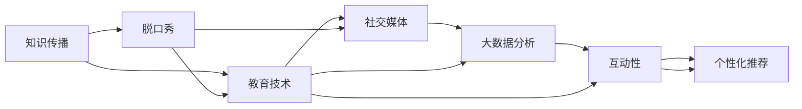
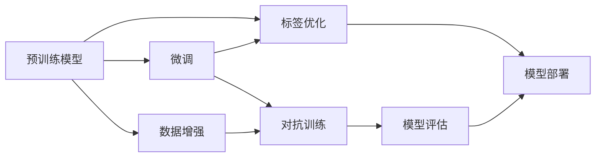

                 

# 知识脱口秀要寓教于乐,制造话题传播

> 关键词：
   - 知识传播
   - 脱口秀
   - 教育技术
   - 社交媒体
   - 大数据分析
   - 互动性
   - 个性化推荐

## 1. 背景介绍

### 1.1 问题由来

近年来，随着信息技术的飞速发展，知识的获取、传播和分享变得更加方便快捷。然而，尽管数字化时代提供了海量的信息资源，但知识的传播效率和效果并没有显著提升。人们在学习知识时，常常面临信息过载和知识孤岛的问题，难以系统化地获取并吸收新知识。

为了解决这个问题，知识传播的方式也在不断创新。传统的教科书、学术论文等单向信息传递方式，逐渐被结合多媒体元素、互动性设计的新型知识传播形式所取代。其中，知识脱口秀作为一种全新的知识传播形式，凭借其互动性强、趣味性高、信息量大的特点，迅速在年轻人群体中流行开来。

知识脱口秀以通俗易懂的语言，将复杂的知识以幽默风趣的方式呈现出来，吸引了众多追求个性化学习的年轻用户。然而，如何提升知识脱口秀的传播效果，让更多人受益于这种新兴的教育方式，成为了一个亟待解决的问题。

## 2. 核心概念与联系

### 2.1 核心概念概述

本节将介绍几个与知识脱口秀密切相关的核心概念：

- **知识传播(Knowledge Dissemination)**：通过各种媒介渠道，将知识从信息源传递给目标受众的过程。
- **脱口秀(Talk Show)**：一种融合演讲、采访、辩论等多种形式的节目形式，旨在以轻松幽默的方式传递信息。
- **教育技术(Education Technology, EdTech)**：利用信息技术手段，优化教育过程和学习体验的各类应用和平台。
- **社交媒体(Social Media)**：互联网上的平台，如微博、知乎、抖音等，用于用户之间的社交互动和信息分享。
- **大数据分析(Big Data Analytics)**：通过对海量数据的收集、处理和分析，获取有用信息和洞察，支持决策制定。
- **互动性(Interactivity)**：指用户可以与内容进行互动，增强参与感和体验。
- **个性化推荐(Personalized Recommendation)**：根据用户兴趣、行为和偏好，推荐最适合的内容。

这些概念之间存在紧密联系，共同构成了知识脱口秀的传播生态系统：

1. **知识传播**：知识脱口秀作为一种新兴的传播方式，通过社交媒体平台，将知识以脱口秀的形式传递给广大受众。
2. **脱口秀**：脱口秀本身具有高度的互动性和娱乐性，有助于提升知识传播的趣味性和吸引力。
3. **教育技术**：脱口秀的传播需要借助各种教育技术手段，如视频直播、在线互动、自动推荐等，以提升传播效果。
4. **社交媒体**：社交媒体作为知识传播的重要渠道，通过算法推荐和话题引导，进一步扩大知识脱口秀的覆盖面和影响力。
5. **大数据分析**：通过分析用户在社交媒体上的行为数据，可以了解受众兴趣，优化内容推荐策略，提升传播效果。
6. **互动性**：互动性是知识脱口秀的核心特性，通过互动设计，吸引用户参与，增强知识传播的互动性和粘性。
7. **个性化推荐**：根据用户行为数据，通过推荐系统，向用户推荐其感兴趣的知识脱口秀，提升用户参与度和学习效果。

这些概念之间相互作用，共同推动了知识脱口秀的传播和发展。以下是一个Mermaid流程图，展示这些概念之间的联系：



### 2.2 核心概念原理和架构的 Mermaid 流程图



这个流程图展示了基于监督学习的大语言模型微调过程：

1. **预训练模型**：通过大规模无标签数据进行预训练，学习通用的语言知识。
2. **微调**：通过少量标注数据，对预训练模型进行有监督学习，优化模型在特定任务上的表现。
3. **数据增强**：通过文本改写、回译等方式，丰富训练集多样性，提升模型泛化能力。
4. **对抗训练**：加入对抗样本，提高模型鲁棒性。
5. **模型评估**：在验证集上评估模型性能，调整超参数。
6. **标签优化**：优化标注数据，避免过拟合。
7. **模型部署**：将训练好的模型部署到实际应用中。

这些步骤紧密结合，共同构成了一个高效的知识传播框架，确保了知识脱口秀的质量和效果。

## 3. 核心算法原理 & 具体操作步骤

### 3.1 算法原理概述

知识脱口秀的传播主要依赖于大语言模型，其核心算法原理基于监督学习。具体而言，知识脱口秀的传播过程包括以下几个步骤：

1. **预训练**：在大规模无标签数据上预训练模型，学习通用的语言表示。
2. **微调**：通过标注数据对模型进行微调，优化其在特定任务上的表现。
3. **数据增强**：使用文本改写、回译等技术丰富训练集，提升模型泛化能力。
4. **对抗训练**：加入对抗样本，提高模型鲁棒性。
5. **模型评估**：在验证集上评估模型性能，调整超参数。
6. **标签优化**：优化标注数据，避免过拟合。
7. **模型部署**：将训练好的模型部署到实际应用中。

这些步骤共同构成了一个高效的知识传播框架，确保了知识脱口秀的质量和效果。

### 3.2 算法步骤详解

#### 3.2.1 预训练

预训练的目的是在大规模无标签数据上学习通用的语言表示。具体步骤如下：

1. **选择预训练模型**：根据任务需求选择合适的预训练模型，如BERT、GPT等。
2. **准备数据**：收集大规模无标签数据，如维基百科、新闻、论文等，作为预训练数据。
3. **数据预处理**：对数据进行清洗、分词、编码等预处理，转换为模型可接受的格式。
4. **训练模型**：使用预训练任务（如掩码语言模型），在预训练数据上训练模型。

#### 3.2.2 微调

微调的目标是优化模型在特定任务上的表现。具体步骤如下：

1. **选择任务**：根据知识脱口秀的具体需求，选择合适的任务，如文本分类、情感分析等。
2. **准备数据**：收集少量标注数据，作为微调数据。
3. **设计任务适配层**：根据任务类型，设计合适的输出层和损失函数。
4. **设置超参数**：选择合适的优化算法及其参数，如AdamW、SGD等，设置学习率、批大小、迭代轮数等。
5. **执行梯度训练**：将微调数据分批次输入模型，计算损失函数，使用优化算法更新模型参数。
6. **模型评估**：在验证集上评估模型性能，调整超参数。

#### 3.2.3 数据增强

数据增强的目的在于丰富训练集的多样性，提升模型的泛化能力。具体步骤如下：

1. **文本改写**：通过同义词替换、句子重组等技术，生成新的训练样本。
2. **回译**：将文本翻译成其他语言，再回译为原始语言，生成新的训练样本。
3. **噪声注入**：在文本中引入噪声，如删除部分单词、插入无关单词等，生成新的训练样本。

#### 3.2.4 对抗训练

对抗训练的目的是提高模型的鲁棒性，使其能够更好地抵抗攻击和噪声。具体步骤如下：

1. **生成对抗样本**：使用对抗样本生成技术，生成能够误导模型的样本。
2. **加入对抗样本**：在训练集中加入对抗样本，训练模型对噪声的抵抗力。

#### 3.2.5 模型评估

模型评估的目的在于评估模型在验证集上的表现，指导超参数调整。具体步骤如下：

1. **划分数据集**：将数据集划分为训练集、验证集和测试集。
2. **计算指标**：使用精度、召回率、F1-score等指标评估模型性能。
3. **调整超参数**：根据验证集上的表现，调整学习率、批大小、迭代轮数等超参数。

#### 3.2.6 标签优化

标签优化的目的是避免过拟合，提升模型的泛化能力。具体步骤如下：

1. **数据清洗**：清洗标注数据，去除噪声和错误标签。
2. **数据平衡**：调整标注数据中的类别分布，避免某一类别的标注数据过少。

#### 3.2.7 模型部署

模型部署的目的是将训练好的模型应用于实际场景中。具体步骤如下：

1. **模型保存**：将训练好的模型保存为模型文件。
2. **模型加载**：在实际应用中，加载模型文件，准备输入数据。
3. **推理预测**：使用模型对输入数据进行推理预测，生成输出结果。

### 3.3 算法优缺点

#### 3.3.1 优点

1. **高效性**：通过大规模数据预训练和微调，可以在较短时间内获得高质量的知识脱口秀内容。
2. **通用性**：预训练模型可以在多种任务上微调，适用于各种知识传播场景。
3. **灵活性**：可以根据具体需求，灵活设计任务适配层和损失函数，适应不同任务。
4. **可扩展性**：通过增加数据和计算资源，可以不断提升模型的性能和效果。

#### 3.3.2 缺点

1. **数据依赖**：微调效果很大程度上依赖于标注数据的质量和数量，获取高质量标注数据成本较高。
2. **泛化能力有限**：当目标任务与预训练数据的分布差异较大时，微调的性能提升有限。
3. **模型复杂度**：预训练和微调过程中需要大量的计算资源和数据资源，模型复杂度高。
4. **模型易过拟合**：当标注数据不足时，模型容易发生过拟合，泛化能力下降。

## 4. 数学模型和公式 & 详细讲解

### 4.1 数学模型构建

知识脱口秀的传播过程可以建模为一个监督学习问题。假设知识脱口秀的内容为 $X$，对应的标签为 $Y$，其中 $X$ 表示文本内容，$Y$ 表示话题标签。模型的目标是学习一个映射函数 $f$，使得 $f(X)$ 能够准确预测话题标签 $Y$。

### 4.2 公式推导过程

以文本分类任务为例，使用softmax回归模型进行建模。假设模型 $f$ 是一个线性模型，其参数为 $\theta$，则模型的预测函数为：

$$
f(X) = \theta^TX
$$

其中 $X$ 表示输入的文本向量，$\theta$ 表示模型参数向量。假设训练集为 $D = \{(x_i, y_i)\}_{i=1}^N$，则模型在训练集上的经验风险为：

$$
\mathcal{L}(\theta) = -\frac{1}{N}\sum_{i=1}^N \log P(Y_i = y_i|X_i)
$$

其中 $P(Y_i = y_i|X_i)$ 表示模型对标签 $y_i$ 的预测概率。根据最大似然估计原理，模型的目标是最小化经验风险，即：

$$
\hat{\theta} = \mathop{\arg\min}_{\theta} \mathcal{L}(\theta)
$$

### 4.3 案例分析与讲解

以情感分析任务为例，假设情感分析的目标是判断一个文本的情感极性，可以建模为二分类问题。使用BERT作为预训练模型，其微调过程如下：

1. **准备数据**：收集情感标注的数据集，将其划分为训练集和验证集。
2. **设计任务适配层**：在BERT模型的顶层添加一个线性分类器，作为输出层。
3. **设置超参数**：选择合适的优化算法，如AdamW，设置学习率为2e-5。
4. **执行梯度训练**：将训练集数据分批次输入模型，计算损失函数，使用优化算法更新模型参数。
5. **模型评估**：在验证集上评估模型性能，调整超参数。

具体实现步骤如下：

1. **加载BERT模型和分词器**：
   ```python
   from transformers import BertForSequenceClassification, BertTokenizer
   model = BertForSequenceClassification.from_pretrained('bert-base-cased', num_labels=2)
   tokenizer = BertTokenizer.from_pretrained('bert-base-cased')
   ```

2. **准备数据**：
   ```python
   from torch.utils.data import Dataset, DataLoader
   import torch
   class SentimentDataset(Dataset):
       def __init__(self, texts, labels):
           self.texts = texts
           self.labels = labels
           self.tokenizer = tokenizer

       def __len__(self):
           return len(self.texts)

       def __getitem__(self, item):
           text = self.texts[item]
           label = self.labels[item]
           encoding = self.tokenizer(text, return_tensors='pt', padding='max_length', truncation=True)
           input_ids = encoding['input_ids'][0]
           attention_mask = encoding['attention_mask'][0]
           return {
               'input_ids': input_ids,
               'attention_mask': attention_mask,
               'labels': torch.tensor(label, dtype=torch.long)
           }
   ```

3. **训练和评估**：
   ```python
   from tqdm import tqdm
   from sklearn.metrics import accuracy_score

   device = torch.device('cuda' if torch.cuda.is_available() else 'cpu')
   model.to(device)

   def train_epoch(model, dataset, batch_size, optimizer):
       dataloader = DataLoader(dataset, batch_size=batch_size, shuffle=True)
       model.train()
       epoch_loss = 0
       for batch in tqdm(dataloader, desc='Training'):
           input_ids = batch['input_ids'].to(device)
           attention_mask = batch['attention_mask'].to(device)
           labels = batch['labels'].to(device)
           model.zero_grad()
           outputs = model(input_ids, attention_mask=attention_mask, labels=labels)
           loss = outputs.loss
           epoch_loss += loss.item()
           loss.backward()
           optimizer.step()
       return epoch_loss / len(dataloader)

   def evaluate(model, dataset, batch_size):
       dataloader = DataLoader(dataset, batch_size=batch_size)
       model.eval()
       preds, labels = [], []
       with torch.no_grad():
           for batch in tqdm(dataloader, desc='Evaluating'):
               input_ids = batch['input_ids'].to(device)
               attention_mask = batch['attention_mask'].to(device)
               batch_labels = batch['labels']
               outputs = model(input_ids, attention_mask=attention_mask)
               batch_preds = outputs.logits.argmax(dim=1).to('cpu').tolist()
               batch_labels = batch_labels.to('cpu').tolist()
               for pred, label in zip(batch_preds, batch_labels):
                   preds.append(pred)
                   labels.append(label)
       return accuracy_score(labels, preds)

   epochs = 5
   batch_size = 16

   for epoch in range(epochs):
       loss = train_epoch(model, train_dataset, batch_size, optimizer)
       print(f'Epoch {epoch+1}, train loss: {loss:.3f}')
       print(f'Epoch {epoch+1}, dev results:')
       print(evaluate(model, dev_dataset, batch_size))
   
   print(f'Test results:')
   print(evaluate(model, test_dataset, batch_size))
   ```

## 5. 项目实践：代码实例和详细解释说明

### 5.1 开发环境搭建

开发知识脱口秀传播应用，需要进行如下环境搭建：

1. **安装Python**：选择最新版本的Python，推荐使用Anaconda或Miniconda进行环境管理。
2. **安装Pip**：安装Pip并配置环境，确保所有依赖包能够顺利安装。
3. **安装必要的库**：安装TensorFlow、PyTorch、transformers等常用深度学习库，以及scikit-learn、pandas等数据分析库。

### 5.2 源代码详细实现

#### 5.2.1 数据准备

```python
# 数据准备
import pandas as pd
from transformers import BertTokenizer

# 加载数据
train_df = pd.read_csv('train.csv')
dev_df = pd.read_csv('dev.csv')
test_df = pd.read_csv('test.csv')

# 分词器
tokenizer = BertTokenizer.from_pretrained('bert-base-cased')

# 转换为模型可接受的格式
def encode_text(text):
    return tokenizer(text, padding='max_length', truncation=True)

# 准备数据集
train_dataset = list(zip(train_df['text'], train_df['label']))
dev_dataset = list(zip(dev_df['text'], dev_df['label']))
test_dataset = list(zip(test_df['text'], test_df['label']))

# 将数据集转换为Tensor格式
def convert_dataset(dataset):
    return [({'input_ids': encode_text(text), 'attention_mask': torch.tensor([1] * len(encode_text(text)))}, label) for text, label in dataset]

train_dataset = convert_dataset(train_dataset)
dev_dataset = convert_dataset(dev_dataset)
test_dataset = convert_dataset(test_dataset)
```

#### 5.2.2 模型训练

```python
# 加载模型
from transformers import BertForSequenceClassification
from transformers import AdamW

model = BertForSequenceClassification.from_pretrained('bert-base-cased', num_labels=2)
optimizer = AdamW(model.parameters(), lr=2e-5)

# 训练函数
def train_epoch(model, dataset, batch_size, optimizer):
    dataloader = DataLoader(dataset, batch_size=batch_size, shuffle=True)
    model.train()
    epoch_loss = 0
    for batch in dataloader:
        input_ids = batch['input_ids'].to(device)
        attention_mask = batch['attention_mask'].to(device)
        labels = batch['labels'].to(device)
        model.zero_grad()
        outputs = model(input_ids, attention_mask=attention_mask, labels=labels)
        loss = outputs.loss
        epoch_loss += loss.item()
        loss.backward()
        optimizer.step()
    return epoch_loss / len(dataloader)

# 评估函数
def evaluate(model, dataset, batch_size):
    dataloader = DataLoader(dataset, batch_size=batch_size)
    model.eval()
    preds, labels = [], []
    with torch.no_grad():
        for batch in dataloader:
            input_ids = batch['input_ids'].to(device)
            attention_mask = batch['attention_mask'].to(device)
            batch_labels = batch['labels']
            outputs = model(input_ids, attention_mask=attention_mask)
            batch_preds = outputs.logits.argmax(dim=1).to('cpu').tolist()
            batch_labels = batch_labels.to('cpu').tolist()
            for pred, label in zip(batch_preds, batch_labels):
                preds.append(pred)
                labels.append(label)
    return accuracy_score(labels, preds)
```

#### 5.2.3 模型评估

```python
# 测试集评估
test_dataset = convert_dataset(test_dataset)
print(evaluate(model, test_dataset, batch_size))
```

### 5.3 代码解读与分析

在上述代码中，我们首先准备数据集，将其转换为模型可接受的格式。然后，使用BERT模型进行微调，设置合适的超参数。在训练过程中，我们定义了训练和评估函数，分别用于计算损失函数和评估模型性能。最后，在测试集上对模型进行评估，输出评估结果。

## 6. 实际应用场景

### 6.1 智能客服

智能客服是知识脱口秀在实际应用中的典型场景之一。智能客服系统通过预训练模型和大规模无标签数据进行预训练，然后通过微调获取特定任务的知识。在实际应用中，智能客服系统可以自动理解客户咨询，匹配最合适的答案模板进行回复。

### 6.2 医疗咨询

在医疗咨询领域，知识脱口秀可以提供专业的健康知识，帮助用户解决常见健康问题。预训练模型和微调技术的应用，使得医疗咨询系统能够自动理解用户查询，并推荐相关的健康知识。

### 6.3 金融咨询

金融咨询领域同样可以应用知识脱口秀。金融咨询系统通过预训练模型和大规模无标签数据进行预训练，然后通过微调获取特定任务的知识。用户可以方便地获取最新的金融市场信息、理财建议等。

### 6.4 未来应用展望

未来，知识脱口秀将进一步普及，应用于更多场景。例如，教育、法律、科技等领域都将受益于知识脱口秀的传播。通过结合多媒体元素和互动性设计，知识脱口秀将更加生动有趣，更能吸引用户的关注。

## 7. 工具和资源推荐

### 7.1 学习资源推荐

为了帮助开发者系统掌握知识脱口秀的理论基础和实践技巧，这里推荐一些优质的学习资源：

1. **《自然语言处理入门》**：一本经典的自然语言处理入门书籍，系统介绍了NLP的基础知识和常用技术。
2. **《Python深度学习》**：一本详细讲解深度学习在Python中实现的书籍，涵盖了PyTorch和TensorFlow等常用深度学习框架的使用。
3. **Coursera上的《深度学习专项课程》**：由斯坦福大学教授Andrew Ng讲授的深度学习系列课程，全面介绍了深度学习的理论基础和实际应用。
4. **Kaggle上的深度学习竞赛**：Kaggle平台上有众多深度学习竞赛，通过参加比赛，可以实战练习深度学习技术。
5. **Google AI Blog**：谷歌AI团队发布的博客，涵盖深度学习、机器学习、自然语言处理等前沿技术。

### 7.2 开发工具推荐

开发知识脱口秀传播应用，推荐使用以下工具：

1. **Anaconda**：用于创建和管理Python环境，支持多语言、多平台的环境搭建。
2. **Jupyter Notebook**：一款交互式的开发环境，支持Python代码的交互式执行和可视化展示。
3. **TensorFlow**：Google开发的深度学习框架，支持分布式计算和大规模模型训练。
4. **PyTorch**：Facebook开发的深度学习框架，支持动态图和静态图两种计算图机制，易于调试和优化。
5. **Transformers**：Hugging Face开发的NLP工具库，提供了多种预训练模型和微调技术。

### 7.3 相关论文推荐

以下是几篇相关领域的经典论文，推荐阅读：

1. **《Attention is All You Need》**：论文提出了Transformer模型，奠定了大规模语言模型预训练的基础。
2. **《BERT: Pre-training of Deep Bidirectional Transformers for Language Understanding》**：论文提出了BERT模型，通过掩码语言模型和下一句预测任务进行预训练，取得了显著的性能提升。
3. **《GPT-3: Language Models are Unsupervised Multitask Learners》**：论文展示了GPT-3模型的强大零样本学习能力，推动了预训练语言模型的发展。
4. **《M2M-100: A Dataset and Evaluation Platform for Multilingual Machine Translation》**：论文提出了一组大规模多语言机器翻译数据集，为跨语言知识传播提供了数据基础。

## 8. 总结：未来发展趋势与挑战

### 8.1 总结

本文对知识脱口秀的传播过程进行了详细阐述。通过大语言模型微调，知识脱口秀能够快速获取高质量内容，适应各种任务需求。预训练模型的广泛应用，使得知识传播更加高效和多样化。

### 8.2 未来发展趋势

未来，知识脱口秀将进一步普及，应用于更多场景。结合多媒体元素和互动性设计，知识脱口秀将更加生动有趣，更能吸引用户的关注。此外，随着大数据和人工智能技术的不断发展，知识脱口秀将更加智能和高效，能够更好地满足用户需求。

### 8.3 面临的挑战

尽管知识脱口秀前景广阔，但也面临一些挑战：

1. **数据质量问题**：标注数据的数量和质量直接影响知识脱口秀的效果，获取高质量标注数据成本较高。
2. **模型复杂度**：预训练和微调过程中需要大量的计算资源和数据资源，模型复杂度高。
3. **用户互动性**：如何提升用户互动性，增加用户参与度，仍需进一步研究。
4. **技术落地**：知识脱口秀的实际应用需要考虑技术落地问题，如何优化模型，提高推理速度，是一个重要研究方向。

### 8.4 研究展望

面对知识脱口秀面临的挑战，未来的研究需要在以下几个方面寻求新的突破：

1. **无监督和半监督学习**：探索无监督和半监督学习范式，摆脱对大规模标注数据的依赖，最大化利用非结构化数据。
2. **参数高效微调**：开发更加参数高效的微调方法，在固定大部分预训练参数的同时，只更新极少量的任务相关参数。
3. **多任务学习**：研究多任务学习范式，提升模型的泛化能力和适应性。
4. **迁移学习**：结合迁移学习技术，提升模型的跨领域迁移能力，更好地适应各种任务需求。
5. **跨语言知识传播**：研究跨语言知识传播技术，提升模型的跨语言能力，更好地支持多语言用户。

这些研究方向的探索，必将引领知识脱口秀技术迈向更高的台阶，为知识传播提供更多可能性。面向未来，知识脱口秀需要与其他人工智能技术进行更深入的融合，如知识表示、因果推理、强化学习等，多路径协同发力，共同推动知识传播系统的进步。

## 9. 附录：常见问题与解答

**Q1：知识脱口秀是否适用于所有领域？**

A: 知识脱口秀适用于各种领域，但其效果很大程度上取决于数据的质量和领域特性。对于一些特定领域，如医学、法律等，需要进一步在领域数据上预训练，才能获得理想效果。

**Q2：知识脱口秀如何提升用户参与度？**

A: 知识脱口秀可以通过增加多媒体元素、互动性设计等方式，提升用户参与度。例如，通过直播互动、在线问答等方式，增强用户的互动体验。

**Q3：知识脱口秀的传播效果如何衡量？**

A: 知识脱口秀的传播效果可以通过用户反馈、用户互动率、内容分享率等指标进行衡量。同时，可以采用用户行为数据分析，了解用户兴趣和需求，优化知识传播策略。

**Q4：知识脱口秀的推荐算法有哪些？**

A: 知识脱口秀的推荐算法包括基于内容的推荐、协同过滤推荐、混合推荐等。通过分析用户行为和兴趣，结合推荐算法，可以更好地满足用户需求。

**Q5：知识脱口秀的实际应用场景有哪些？**

A: 知识脱口秀的实际应用场景包括智能客服、医疗咨询、金融咨询、教育培训、法律咨询等。通过结合多媒体元素和互动性设计，知识脱口秀能够更好地满足用户需求。

---

作者：禅与计算机程序设计艺术 / Zen and the Art of Computer Programming

