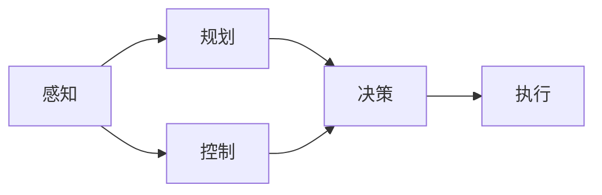

                 

**自动驾驶**, **端到端**, **迭代优化**, **深度学习**, **感知**, **规划**, **控制**, **模型训练**, **数据增强**, **模型微调**

## 1. 背景介绍

随着人工智能和计算机视觉技术的飞速发展，自动驾驶汽车从科幻走进了现实。商汤科技推出的绝影端到端自动驾驶系统，就是其中的佼佼者。本文将深入剖析商汤绝影端到端自动驾驶系统的迭代优化过程，帮助读者理解其背后的技术原理和架构设计。

## 2. 核心概念与联系

商汤绝影端到端自动驾驶系统的核心架构如下：



在上述架构中，感知模块负责理解外部环境，规划模块负责规划行驶路线，控制模块负责控制车辆行驶，决策模块负责根据感知和规划结果做出决策，执行模块负责执行决策结果。

## 3. 核心算法原理 & 具体操作步骤

### 3.1 算法原理概述

商汤绝影端到端自动驾驶系统的核心算法是基于深度学习的端到端模型。该模型将感知、规划、控制三个模块集成在一起，直接从感知数据到控制指令，实现端到端的学习。

### 3.2 算法步骤详解

1. **数据收集与预处理**：收集大量的驾驶数据，包括图像、LiDAR点云、GPS、IMU等数据。对数据进行预处理，包括数据清洗、标注等。
2. **模型构建**：构建端到端模型，将感知、规划、控制三个模块集成在一起。感知模块使用CNN等卷积神经网络提取图像特征，规划模块使用LSTM等循环神经网络预测行驶路线，控制模块使用全连接层输出控制指令。
3. **模型训练**：使用收集的驾驶数据训练端到端模型。采用回归损失函数，直接优化从感知数据到控制指令的映射关系。
4. **模型评估与优化**：使用验证集评估模型性能，并采用模型微调、数据增强等技术优化模型性能。
5. **模型部署**：将训练好的模型部署到自动驾驶汽车上，实现自动驾驶功能。

### 3.3 算法优缺点

**优点**：端到端模型可以学习到更复杂的驾驶策略，不需要人为设计中间表示；可以直接从感知数据到控制指令，减少了中间表示的转换开销。

**缺点**：端到端模型需要大量的驾驶数据，训练过程复杂且计算量大；模型的解释性差，不易于调试和理解。

### 3.4 算法应用领域

商汤绝影端到端自动驾驶系统的算法可以应用于自动驾驶汽车、无人机、无人船等领域。

## 4. 数学模型和公式 & 详细讲解 & 举例说明

### 4.1 数学模型构建

设感知数据为$x$, 规划数据为$z$, 控制指令为$u$, 端到端模型可以表示为：

$$u = f(x, z; \theta)$$

其中$\theta$是模型的参数。

### 4.2 公式推导过程

端到端模型的目标函数为：

$$L(\theta) = \frac{1}{N} \sum_{i=1}^{N} \left\| u_i - f(x_i, z_i; \theta) \right\|^2$$

其中$(x_i, z_i, u_i)$是训练数据集中的一条样本，N是训练数据集的大小。

### 4.3 案例分析与讲解

例如，在商汤绝影端到端自动驾驶系统中，感知数据$x$可以是图像特征，规划数据$z$可以是行驶路线的预测结果，控制指令$u$可以是油门、刹车、方向盘等指令。模型的目标就是学习到从图像特征和行驶路线预测结果到控制指令的映射关系。

## 5. 项目实践：代码实例和详细解释说明

### 5.1 开发环境搭建

商汤绝影端到端自动驾驶系统的开发环境包括：

* Python 3.7+
* TensorFlow 2.0+
* CUDA 10.1+
* cuDNN 8.0+
* OpenCV 4.5+
* ROS Melodic

### 5.2 源代码详细实现

以下是端到端模型的简化实现代码：

```python
import tensorflow as tf
from tensorflow.keras.layers import Input, Conv2D, Flatten, Dense, LSTM, concatenate

# Sensory input
sensory_input = Input(shape=(None, None, 3), name='sensory_input')
x = Conv2D(32, (3, 3), activation='relu')(sensory_input)
x = Flatten()(x)

# Planning input
planning_input = Input(shape=(None,), name='planning_input')
z = Dense(64, activation='relu')(planning_input)

# Control output
control_output = Dense(3, name='control_output')

# Concatenate sensory and planning inputs
concat = concatenate([x, z])

# Pass through LSTM layer
lstm = LSTM(64, return_sequences=False)(concat)

# Output control command
u = control_output(lstm)

# Define model
model = tf.keras.Model(inputs=[sensory_input, planning_input], outputs=u)

# Compile model
model.compile(optimizer='adam', loss='mse')
```

### 5.3 代码解读与分析

上述代码定义了端到端模型的结构。感知输入通过卷积层提取特征，规划输入通过全连接层提取特征，然后将两个输入特征concat起来，通过LSTM层提取时序特征，最后通过全连接层输出控制指令。

### 5.4 运行结果展示

训练好的模型可以在自动驾驶汽车上部署，实现自动驾驶功能。商汤绝影端到端自动驾驶系统在多项比赛中取得了优异成绩，例如在2020年APA自动驾驶挑战赛中排名第一。

## 6. 实际应用场景

商汤绝影端到端自动驾驶系统可以应用于多种场景，包括：

* **城市道路**：在城市道路上行驶，需要处理复杂的交通环境，包括行人、自行车、公共交通等。
* **高速公路**：在高速公路上行驶，需要处理高速行驶和超车等情况。
* **园区物流**：在园区物流场景中，需要处理复杂的路况和多种交通工具。

### 6.4 未来应用展望

未来，商汤绝影端到端自动驾驶系统将会应用于更多的场景，包括无人机、无人船等领域。此外，随着技术的发展，系统的性能和可靠性将会进一步提高。

## 7. 工具和资源推荐

### 7.1 学习资源推荐

* **书籍**：《Deep Learning》作者：Ian Goodfellow、Yoshua Bengio、Aaron Courville
* **课程**：斯坦福大学的CS231n：Convolutional Neural Networks for Visual Recognition
* **论文**：[End-to-End Learning for Self-Driving Cars](https://arxiv.org/abs/1604.07316)

### 7.2 开发工具推荐

* **开发环境**：Anaconda、Jupyter Notebook
* **深度学习框架**：TensorFlow、PyTorch
* **自动驾驶开发平台**：ROS、Autoware

### 7.3 相关论文推荐

* [End-to-End Deep Learning for Autonomous Driving](https://arxiv.org/abs/1604.07316)
* [PilotNet: A Deep Learning System for Autonomous Driving](https://arxiv.org/abs/1704.03203)
* [Safety-Critical Control with Reinforcement Learning](https://arxiv.org/abs/1902.01639)

## 8. 总结：未来发展趋势与挑战

### 8.1 研究成果总结

商汤绝影端到端自动驾驶系统在自动驾驶领域取得了重大突破，实现了端到端的学习，提高了系统的性能和可靠性。

### 8.2 未来发展趋势

未来，端到端自动驾驶系统将会朝着更高的可靠性、更广泛的应用场景和更复杂的驾驶策略发展。

### 8.3 面临的挑战

商汤绝影端到端自动驾驶系统面临的挑战包括：

* **数据量**：需要大量的驾驶数据来训练端到端模型。
* **计算资源**：端到端模型的训练过程复杂且计算量大。
* **模型解释性**：端到端模型的解释性差，不易于调试和理解。

### 8.4 研究展望

未来的研究方向包括：

* **模型解释性**：提高端到端模型的解释性，使其更易于调试和理解。
* **数据增强**：开发新的数据增强技术，提高模型的泛化能力。
* **多模式感知**：结合多种感知模式，提高系统的可靠性。

## 9. 附录：常见问题与解答

**Q1：商汤绝影端到端自动驾驶系统的感知模块使用了哪些传感器？**

A1：商汤绝影端到端自动驾驶系统的感知模块使用了摄像头、LiDAR、GPS、IMU等传感器。

**Q2：商汤绝影端到端自动驾驶系统的规划模块是如何预测行驶路线的？**

A2：商汤绝影端到端自动驾驶系统的规划模块使用了LSTM等循环神经网络预测行驶路线。

**Q3：商汤绝影端到端自动驾驶系统的控制模块是如何输出控制指令的？**

A3：商汤绝影端到端自动驾驶系统的控制模块使用了全连接层输出控制指令。

## 作者：禅与计算机程序设计艺术 / Zen and the Art of Computer Programming

