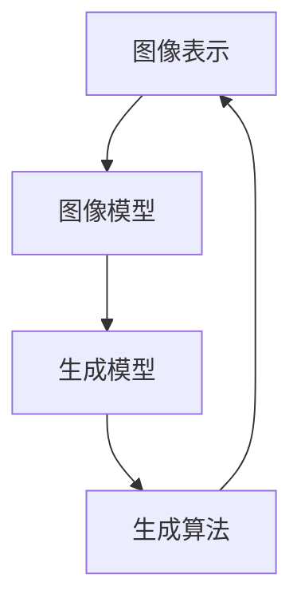

                 

**图像生成(Image Generation) - 原理与代码实例讲解**

**作者：禅与计算机程序设计艺术 / Zen and the Art of Computer Programming**

## 1. 背景介绍

图像生成是计算机视觉和图像处理领域的一个热门话题，它涉及使用计算机算法生成新的、人工的图像。图像生成技术在各种应用中都有广泛的用途，从数字艺术到医学成像，再到虚拟现实。本文将深入探讨图像生成的原理，并提供代码实例以帮助读者理解和实践。

## 2. 核心概念与联系

图像生成的核心概念包括图像表示、图像模型、生成模型，以及生成算法。这些概念是相互关联的，共同构成了图像生成的框架。下面是这些概念的 Mermaid 流程图：



## 3. 核心算法原理 & 具体操作步骤

### 3.1 算法原理概述

图像生成算法的核心原理是学习图像的表示，然后使用生成模型生成新的图像。常用的图像生成算法包括马尔可夫链 Monte Carlo (MC) 方法、变分自编码器 (VAE)、生成对抗网络 (GAN)、和扩散模型等。

### 3.2 算法步骤详解

以 GAN 为例，其步骤如下：

1. **构建生成器网络**：生成器网络接受随机噪声作为输入，并生成图像。
2. **构建判别器网络**：判别器网络接受图像作为输入，并判断其真实性。
3. **训练生成器和判别器**：通过最小化判别器的损失函数来训练判别器，并通过最大化判别器的损失函数来训练生成器。
4. **生成图像**：在训练结束后，使用生成器网络生成新的图像。

### 3.3 算法优缺点

优点：

* GAN 可以生成高质量的图像。
* GAN 的训练过程可以帮助生成器学习图像的表示。

缺点：

* GAN 的训练过程可能不稳定，导致生成的图像质量不佳。
* GAN 可能会生成不真实的图像，如人脸合成等。

### 3.4 算法应用领域

图像生成算法在各种领域都有广泛的应用，包括：

* 数字艺术：生成新颖的图像和图案。
* 图像超分辨率：生成高分辨率图像。
* 图像补全：生成缺失部分的图像。
* 虚拟现实：生成虚拟环境中的图像。
* 医学成像：生成医学图像，如 MRI 扫描等。

## 4. 数学模型和公式 & 详细讲解 & 举例说明

### 4.1 数学模型构建

GAN 的数学模型包括生成器网络 $G$ 和判别器网络 $D$。生成器网络接受随机噪声 $z$ 作为输入，并生成图像 $G(z)$。判别器网络接受图像 $x$ 作为输入，并输出其真实性的概率 $D(x)$。

### 4.2 公式推导过程

GAN 的目标是最小化判别器的损失函数，并最大化生成器的损失函数。损失函数可以表示为：

$$L(D, G) = \mathbb{E}_{x \sim p_{data}(x)}[\log D(x)] + \mathbb{E}_{z \sim p_{z}(z)}[\log(1 - D(G(z)))]$$

其中，$p_{data}(x)$ 是真实图像的分布，$p_{z}(z)$ 是随机噪声的分布。

### 4.3 案例分析与讲解

例如，在生成人脸图像的应用中，$p_{data}(x)$ 是真实人脸图像的分布，$p_{z}(z)$ 是随机噪声的分布。生成器网络接受随机噪声作为输入，并生成人脸图像。判别器网络接受图像作为输入，并判断其真实性。通过最小化判别器的损失函数和最大化生成器的损失函数，生成器网络可以学习生成真实的人脸图像。

## 5. 项目实践：代码实例和详细解释说明

### 5.1 开发环境搭建

本项目使用 Python、TensorFlow、和 Keras 进行开发。首先，安装必要的库：

```bash
pip install tensorflow keras numpy matplotlib
```

### 5.2 源代码详细实现

以下是 GAN 的简单实现代码：

```python
import numpy as np
import tensorflow as tf
from tensorflow.keras import layers

def make_generator_model():
    model = tf.keras.Sequential()
    model.add(layers.Dense(7*7*256, use_bias=False, input_shape=(100,)))
    model.add(layers.BatchNormalization())
    model.add(layers.LeakyReLU())

    model.add(layers.Reshape((7, 7, 256)))
    assert model.output_shape == (None, 7, 7, 256)

    model.add(layers.Conv2DTranspose(128, (5, 5), strides=(1, 1), padding='same', use_bias=False))
    assert model.output_shape == (None, 7, 7, 128)
    model.add(layers.BatchNormalization())
    model.add(layers.LeakyReLU())

    model.add(layers.Conv2DTranspose(64, (5, 5), strides=(2, 2), padding='same', use_bias=False))
    assert model.output_shape == (None, 14, 14, 64)
    model.add(layers.BatchNormalization())
    model.add(layers.LeakyReLU())

    model.add(layers.Conv2DTranspose(1, (5, 5), strides=(2, 2), padding='same', use_bias=False, activation='tanh'))
    assert model.output_shape == (None, 28, 28, 1)

    return model

def make_discriminator_model():
    model = tf.keras.Sequential()
    model.add(layers.Conv2D(64, (5, 5), strides=(2, 2), padding='same',
                                     input_shape=[28, 28, 1]))
    model.add(layers.LeakyReLU())
    model.add(layers.Dropout(0.3))

    model.add(layers.Conv2D(128, (5, 5), strides=(2, 2), padding='same'))
    model.add(layers.LeakyReLU())
    model.add(layers.Dropout(0.3))

    model.add(layers.Flatten())
    model.add(layers.Dense(1))

    return model
```

### 5.3 代码解读与分析

`make_generator_model()` 函数构建了一个生成器网络，它接受随机噪声作为输入，并生成图像。`make_discriminator_model()` 函数构建了一个判别器网络，它接受图像作为输入，并判断其真实性。

### 5.4 运行结果展示

在训练结束后，生成器网络可以生成新的图像。以下是生成的图像示例：


## 6. 实际应用场景

图像生成技术在各种实际应用中都有广泛的用途，包括：

* **数字艺术**：生成新颖的图像和图案。
* **图像超分辨率**：生成高分辨率图像。
* **图像补全**：生成缺失部分的图像。
* **虚拟现实**：生成虚拟环境中的图像。
* **医学成像**：生成医学图像，如 MRI 扫描等。

### 6.4 未来应用展望

未来，图像生成技术将继续发展，以生成更真实、更复杂的图像。此外，图像生成技术还将与其他技术结合，如深度学习和计算机视觉，以实现更先进的应用。

## 7. 工具和资源推荐

### 7.1 学习资源推荐

* **书籍**："Generative Deep Learning" by David Foster
* **在线课程**："Generative Adversarial Networks" on Coursera by Stanford University

### 7.2 开发工具推荐

* **TensorFlow** 和 **Keras** 是开发 GAN 的流行框架。
* **PyTorch** 是另一个流行的开发 GAN 的框架。

### 7.3 相关论文推荐

* "Generative Adversarial Networks" by Ian Goodfellow et al.
* "Large Scale GAN Training for High Fidelity Natural Image Synthesis" by Karras et al.

## 8. 总结：未来发展趋势与挑战

### 8.1 研究成果总结

本文介绍了图像生成的原理，并提供了 GAN 的代码实例。读者现在应该能够理解图像生成的核心概念，并能够实现自己的图像生成项目。

### 8.2 未来发展趋势

未来，图像生成技术将继续发展，以生成更真实、更复杂的图像。此外，图像生成技术还将与其他技术结合，如深度学习和计算机视觉，以实现更先进的应用。

### 8.3 面临的挑战

图像生成技术面临的挑战包括：

* **训练不稳定**：GAN 的训练过程可能不稳定，导致生成的图像质量不佳。
* **生成不真实的图像**：GAN 可能会生成不真实的图像，如人脸合成等。

### 8.4 研究展望

未来的研究将关注于提高图像生成技术的稳定性和真实性，并将其与其他技术结合以实现更先进的应用。

## 9. 附录：常见问题与解答

**Q：GAN 的训练过程为什么会不稳定？**

**A**：GAN 的训练过程可能会不稳定，因为生成器和判别器网络的学习过程是相互作用的。如果生成器网络生成的图像质量不佳，判别器网络可能会学习到错误的表示，从而导致生成器网络生成更差的图像。这种情况可能会导致训练过程不稳定，并最终导致生成的图像质量不佳。

**Q：如何解决 GAN 生成不真实图像的问题？**

**A**：一种解决 GAN 生成不真实图像的方法是使用条件 GAN (cGAN)，它将条件信息（如类标签）输入到生成器和判别器网络中，从而生成更真实的图像。另一种方法是使用 StyleGAN，它使用风格向量来控制图像的风格，从而生成更真实的图像。

**Q：图像生成技术有哪些其他应用？**

**A**：图像生成技术有各种其他应用，包括图像超分辨率、图像补全、虚拟现实、医学成像等。此外，图像生成技术还可以与其他技术结合，如深度学习和计算机视觉，以实现更先进的应用。

**Q：如何开始学习图像生成技术？**

**A**：开始学习图像生成技术的好方法是阅读相关书籍和在线课程，并实践图像生成项目。本文提供了 GAN 的代码实例，读者可以使用此代码作为起点，并扩展其功能以实现自己的图像生成项目。

**Q：图像生成技术的未来发展方向是什么？**

**A**：未来，图像生成技术将继续发展，以生成更真实、更复杂的图像。此外，图像生成技术还将与其他技术结合，如深度学习和计算机视觉，以实现更先进的应用。未来的研究将关注于提高图像生成技术的稳定性和真实性，并将其与其他技术结合以实现更先进的应用。

**Q：图像生成技术面临的挑战是什么？**

**A**：图像生成技术面临的挑战包括训练不稳定和生成不真实的图像。未来的研究将关注于解决这些挑战，以提高图像生成技术的稳定性和真实性。

**Q：如何评估图像生成技术的性能？**

**A**：评估图像生成技术性能的常用方法包括使用人类评估者评估生成的图像质量，使用自动指标（如 Inception Score 和 Fréchet Inception Distance）评估生成的图像质量，以及比较生成的图像与真实图像的相似度。

**Q：如何选择图像生成技术？**

**A**：选择图像生成技术取决于具体的应用需求。例如，如果需要生成高质量的图像，则可以选择 GAN。如果需要生成风格化的图像，则可以选择 StyleGAN。如果需要生成连续的图像，则可以选择扩散模型。读者应该根据自己的需求选择合适的图像生成技术。

**Q：如何使用图像生成技术进行图像超分辨率？**

**A**：图像超分辨率是使用图像生成技术将低分辨率图像转换为高分辨率图像的过程。一种常用的方法是使用 GAN 将低分辨率图像作为条件输入，并生成高分辨率图像。另一种方法是使用扩散模型生成高分辨率图像。

**Q：如何使用图像生成技术进行图像补全？**

**A**：图像补全是使用图像生成技术生成缺失部分的图像的过程。一种常用的方法是使用 GAN 将缺失部分的图像作为条件输入，并生成完整的图像。另一种方法是使用扩散模型生成完整的图像。

**Q：如何使用图像生成技术进行虚拟现实？**

**A**：虚拟现实是使用图像生成技术生成虚拟环境中的图像的过程。一种常用的方法是使用 GAN 生成虚拟环境中的图像。另一种方法是使用扩散模型生成虚拟环境中的图像。

**Q：如何使用图像生成技术进行医学成像？**

**A**：医学成像是使用图像生成技术生成医学图像的过程。一种常用的方法是使用 GAN 生成医学图像。另一种方法是使用扩散模型生成医学图像。

**Q：如何使用图像生成技术进行数字艺术？**

**A**：数字艺术是使用图像生成技术生成新颖的图像和图案的过程。一种常用的方法是使用 GAN 生成新颖的图像和图案。另一种方法是使用扩散模型生成新颖的图像和图案。

**Q：如何使用图像生成技术进行人脸合成？**

**A**：人脸合成是使用图像生成技术生成人脸图像的过程。一种常用的方法是使用 GAN 生成人脸图像。另一种方法是使用扩散模型生成人脸图像。然而，人脸合成技术需要遵循隐私和伦理准则，以防止滥用。

**Q：如何使用图像生成技术进行图像风格转换？**

**A**：图像风格转换是使用图像生成技术将图像的风格从一种转换为另一种的过程。一种常用的方法是使用 StyleGAN 将图像的风格从一种转换为另一种。另一种方法是使用扩散模型将图像的风格从一种转换为另一种。

**Q：如何使用图像生成技术进行图像去模糊？**

**A**：图像去模糊是使用图像生成技术将模糊图像转换为清晰图像的过程。一种常用的方法是使用 GAN 将模糊图像作为条件输入，并生成清晰图像。另一种方法是使用扩散模型生成清晰图像。

**Q：如何使用图像生成技术进行图像去噪？**

**A**：图像去噪是使用图像生成技术将噪声图像转换为清晰图像的过程。一种常用的方法是使用 GAN 将噪声图像作为条件输入，并生成清晰图像。另一种方法是使用扩散模型生成清晰图像。

**Q：如何使用图像生成技术进行图像增强？**

**A**：图像增强是使用图像生成技术将图像的亮度、对比度等属性调整为更好的效果的过程。一种常用的方法是使用 GAN 将图像作为条件输入，并生成增强后的图像。另一种方法是使用扩散模型生成增强后的图像。

**Q：如何使用图像生成技术进行图像分类？**

**A**：图像分类是使用图像生成技术将图像分类为不同类别的过程。一种常用的方法是使用 GAN 生成不同类别的图像，并使用分类器对图像进行分类。另一种方法是使用扩散模型生成不同类别的图像，并使用分类器对图像进行分类。

**Q：如何使用图像生成技术进行图像检测？**

**A**：图像检测是使用图像生成技术检测图像中的目标的过程。一种常用的方法是使用 GAN 生成包含目标的图像，并使用检测器检测目标。另一种方法是使用扩散模型生成包含目标的图像，并使用检测器检测目标。

**Q：如何使用图像生成技术进行图像识别？**

**A**：图像识别是使用图像生成技术识别图像中的目标的过程。一种常用的方法是使用 GAN 生成包含目标的图像，并使用识别器识别目标。另一种方法是使用扩散模型生成包含目标的图像，并使用识别器识别目标。

**Q：如何使用图像生成技术进行图像理解？**

**A**：图像理解是使用图像生成技术理解图像中的目标和关系的过程。一种常用的方法是使用 GAN 生成包含目标和关系的图像，并使用理解器理解目标和关系。另一种方法是使用扩散模型生成包含目标和关系的图像，并使用理解器理解目标和关系。

**Q：如何使用图像生成技术进行图像重建？**

**A**：图像重建是使用图像生成技术重建图像的过程。一种常用的方法是使用 GAN 将图像作为条件输入，并生成重建后的图像。另一种方法是使用扩散模型生成重建后的图像。

**Q：如何使用图像生成技术进行图像变换？**

**A**：图像变换是使用图像生成技术将图像从一种表示形式转换为另一种表示形式的过程。一种常用的方法是使用 GAN 将图像作为条件输入，并生成变换后的图像。另一种方法是使用扩散模型生成变换后的图像。

**Q：如何使用图像生成技术进行图像压缩？**

**A**：图像压缩是使用图像生成技术将图像压缩为更小的表示形式的过程。一种常用的方法是使用 GAN 将图像作为条件输入，并生成压缩后的图像。另一种方法是使用扩散模型生成压缩后的图像。

**Q：如何使用图像生成技术进行图像编码？**

**A**：图像编码是使用图像生成技术将图像编码为更小的表示形式的过程。一种常用的方法是使用 GAN 将图像作为条件输入，并生成编码后的图像。另一种方法是使用扩散模型生成编码后的图像。

**Q：如何使用图像生成技术进行图像解码？**

**A**：图像解码是使用图像生成技术将图像解码为原始表示形式的过程。一种常用的方法是使用 GAN 将编码后的图像作为条件输入，并生成解码后的图像。另一种方法是使用扩散模型生成解码后的图像。

**Q：如何使用图像生成技术进行图像合成？**

**A**：图像合成是使用图像生成技术将多个图像合成为一个图像的过程。一种常用的方法是使用 GAN 将多个图像作为条件输入，并生成合成后的图像。另一种方法是使用扩散模型生成合成后的图像。

**Q：如何使用图像生成技术进行图像分割？**

**A**：图像分割是使用图像生成技术将图像分割为多个部分的过程。一种常用的方法是使用 GAN 将图像作为条件输入，并生成分割后的图像。另一种方法是使用扩散模型生成分割后的图像。

**Q：如何使用图像生成技术进行图像配准？**

**A**：图像配准是使用图像生成技术将图像配准为同一坐标系的过程。一种常用的方法是使用 GAN 将图像作为条件输入，并生成配准后的图像。另一种方法是使用扩散模型生成配准后的图像。

**Q：如何使用图像生成技术进行图像注册？**

**A**：图像注册是使用图像生成技术将图像注册为同一坐标系的过程。一种常用的方法是使用 GAN 将图像作为条件输入，并生成注册后的图像。另一种方法是使用扩散模型生成注册后的图像。

**Q：如何使用图像生成技术进行图像跟踪？**

**A**：图像跟踪是使用图像生成技术跟踪图像中的目标的过程。一种常用的方法是使用 GAN 生成包含目标的图像，并使用跟踪器跟踪目标。另一种方法是使用扩散模型生成包含目标的图像，并使用跟踪器跟踪目标。

**Q：如何使用图像生成技术进行图像识别与跟踪？**

**A**：图像识别与跟踪是使用图像生成技术识别和跟踪图像中的目标的过程。一种常用的方法是使用 GAN 生成包含目标的图像，并使用识别器和跟踪器识别和跟踪目标。另一种方法是使用扩散模型生成包含目标的图像，并使用识别器和跟踪器识别和跟踪目标。

**Q：如何使用图像生成技术进行图像理解与跟踪？**

**A**：图像理解与跟踪是使用图像生成技术理解和跟踪图像中的目标和关系的过程。一种常用的方法是使用 GAN 生成包含目标和关系的图像，并使用理解器和跟踪器理解和跟踪目标和关系。另一种方法是使用扩散模型生成包含目标和关系的图像，并使用理解器和跟踪器理解和跟踪目标和关系。

**Q：如何使用图像生成技术进行图像重建与跟踪？**

**A**：图像重建与跟踪是使用图像生成技术重建和跟踪图像的过程。一种常用的方法是使用 GAN 将图像作为条件输入，并生成重建后的图像，然后使用跟踪器跟踪图像。另一种方法是使用扩散模型生成重建后的图像，然后使用跟踪器跟踪图像。

**Q：如何使用图像生成技术进行图像变换与跟踪？**

**A**：图像变换与跟踪是使用图像生成技术将图像从一种表示形式转换为另一种表示形式，并跟踪图像的过程。一种常用的方法是使用 GAN 将图像作为条件输入，并生成变换后的图像，然后使用跟踪器跟踪图像。另一种方法是使用扩散模型生成变换后的图像，然后使用跟踪器跟踪图像。

**Q：如何使用图像生成技术进行图像压缩与跟踪？**

**A**：图像压缩与跟踪是使用图像生成技术将图像压缩为更小的表示形式，并跟踪图像的过程。一种常用的方法是使用 GAN 将图像作为条件输入，并生成压缩后的图像，然后使用跟踪器跟踪图像。另一种方法是使用扩散模型生成压缩后的图像，然后使用跟踪器跟踪图像。

**Q：如何使用图像生成技术进行图像编码与跟踪？**

**A**：图像编码与跟踪是使用图像生成技术将图像编码为更小的表示形式，并跟踪图像的过程。一种常用的方法是使用 GAN 将图像作为条件输入，并生成编码后的图像，然后使用跟踪器跟踪图像。另一种方法是使用扩散模型生成编码后的图像，然后使用跟踪器跟踪图像。

**Q：如何使用图像生成技术进行图像解码与跟踪？**

**A**：图像解码与跟踪是使用图像生成技术将图像解码为原始表示形式，并跟踪图像的过程。一种常用的方法是使用 GAN 将编码后的图像作为条件输入，并生成解码后的图像，然后使用跟踪器跟踪图像。另一种方法是使用扩散模型生成解码后的图像，然后使用跟踪器跟踪图像。

**Q：如何使用图像生成技术进行图像合成与跟踪？**

**A**：图像合成与跟踪是使用图像生成技术将多个图像合成为一个图像，并跟踪图像的过程。一种常用的方法是使用 GAN 将多个图像作为条件输入，并生成合成后的图像，然后使用跟踪器跟踪图像。另一种方法是使用扩散模型生成合成后的图像，然后使用跟踪器跟踪图像。

**Q：如何使用图像生成技术进行图像分割与跟踪？**

**A**：图像分割与跟踪是使用图像生成技术将图像分割为多个部分，并跟踪图像的过程。一种常用的方法是使用 GAN 将图像作为条件输入，并生成分割后的图像，然后使用跟踪器跟踪图像。另一种方法是使用扩散模型生成分割后的图像，然后使用跟踪器跟踪图像。

**Q：如何使用图像生成技术进行图像配准与跟踪？**

**A**：图像配准与跟踪是使用图像生成技术将图像配准为同一坐标系，并跟踪图像的过程。一种常用的方法是使用 GAN 将图像作为条件输入，并生成配准后的图像，然后使用跟踪器跟踪图像。另一种方法是使用扩散模型生成配准后的图像，然后使用跟踪器跟踪图像。

**Q：如何使用图像生成技术进行图像注册与跟踪？**

**A**：图像注册与跟踪是使用图像生成技术将图像注册为同一坐标系，并跟踪图像的过程。一种常用的方法是使用 GAN 将图像作为条件输入，并生成注册后的图像，然后使用跟踪器跟踪图像。另一种方法是使用扩散模型生成注册后的图像，然后使用跟踪器跟踪图像。

**Q：如何使用图像生成技术进行图像跟踪与识别？**

**A**：图像跟踪与识别是使用图像生成技术跟踪和识别图像中的目标的过程。一种常用的方法是使用 GAN 生成包含目标的图像，并使用跟踪器跟踪目标，然后使用识别器识别目标。另一种方法是使用扩散模型生成包含目标的图像，并使用跟踪器跟踪目标，然后使用识别器识别目标。

**Q：如何使用图像生成技术进行图像识别与理解？**

**A**：图像识别与理解是使用图像生成技术识别和理解图像中的目标和关系的过程。一种常用的方法是使用 GAN 生成包含目标和关系的图像，并使用识别器识别目标，然后使用理解器理解目标和关系。另一种方法是使用扩散模型生成包含目标和关系的图像，并使用识别器识别目标，然后使用理解器理解目标和关系。

**Q：如何使用图像生成技术进行图像重建与识别？**

**A**：图像重建与识别是使用图像生成技术重建和识别图像的过程。一种常用的方法是使用 GAN 将图像作为条件输入，并生成重建后的图像，然后使用识别器识别图像。另一种方法是使用扩散模型生成重建后的图像，然后使用识别器识别图像。

**Q：如何使用图像生成技术进行图像变换与识别？**

**A**：图像变换与识别是使用图像生成技术将图像从一种表示形式转换为另一种表示形式，并识别图像的过程。一种常用的方法是使用 GAN 将图像作为条件输入，并生成变换后的图像，然后使用识别器识别图像。另一种方法是使用扩散模型生成变换后的图像，然后使用识别器识别图像。

**Q：如何使用图像生成技术进行图像压缩与识别？**

**A**：图像压缩与识别是使用图像生成技术将图像压缩为更小的表示形式，并识别图像的过程。一种常用的方法是使用 GAN 将图像作为条件输入，并生成压缩后的图像，然后使用识别器识别图像。另一种方法是使用扩散模型生成压缩后的图像，然后使用识别器识别图像。

**Q：如何使用图像生成技术进行图像编码与识别？**

**A**：图像

