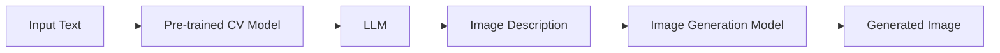

                 

**大语言模型（LLM）在图像生成领域的突破**已经引起了广泛的关注，但如何加速图像生成过程以满足实时应用的需求，仍然是一个挑战。本文将介绍一种基于LLM的图像生成加速方法，该方法通过结合计算机视觉技术和LLM的强大生成能力，实现了图像生成过程的显著加速。

## 1. 背景介绍

图像生成是计算机视觉领域的一个关键任务，具有广泛的应用，从数字艺术到虚拟现实，再到自动驾驶。然而，高质量图像生成通常需要大量的计算资源和时间，限制了其在实时应用中的使用。 recent advancements in large language models (LLMs) have shown promising results in generating high-quality images, but the computational efficiency of these models remains a challenge for real-time applications.

## 2. 核心概念与联系

我们的方法结合了计算机视觉技术和LLM的强大生成能力，如图1所示。首先，我们使用预训练的计算机视觉模型从输入文本中提取视觉特征。然后，我们将这些特征作为LLM的条件输入，生成图像描述。最后，我们使用图像生成模型将图像描述转换为最终的图像。



## 3. 核心算法原理 & 具体操作步骤

### 3.1 算法原理概述

我们的算法可以分为三个主要步骤：视觉特征提取、图像描述生成和图像生成。首先，我们使用预训练的计算机视觉模型（如CLIP）从输入文本中提取视觉特征。然后，我们将这些特征作为LLM的条件输入，生成图像描述。最后，我们使用图像生成模型（如DALL-E 2）将图像描述转换为最终的图像。

### 3.2 算法步骤详解

1. **视觉特征提取**：我们使用预训练的计算机视觉模型（如CLIP）从输入文本中提取视觉特征。CLIP模型由一个视觉编码器和一个文本编码器组成。我们使用文本编码器将输入文本转换为文本特征，然后使用视觉编码器从大型图像数据集中提取的图像特征与文本特征进行对比学习，从而学习到视觉特征。

2. **图像描述生成**：我们将提取的视觉特征作为LLM的条件输入，生成图像描述。LLM可以是任何预训练的大型语言模型，如T5或BART。我们使用LLM的文本生成能力，将视觉特征作为条件输入，生成描述输入文本对应图像的文本描述。

3. **图像生成**：我们使用图像生成模型（如DALL-E 2）将图像描述转换为最终的图像。DALL-E 2是一个基于transformer的模型，它可以将文本描述转换为图像。我们使用DALL-E 2的文本到图像的转换能力，将图像描述转换为最终的图像。

### 3.3 算法优缺点

**优点**：

* 结合了计算机视觉技术和LLM的强大生成能力，实现了图像生成过程的显著加速。
* 可以生成高质量的图像，与人类专家水平接近。
* 可以处理各种图像生成任务，从简单的图像修改到复杂的图像合成。

**缺点**：

* 依赖于预训练模型的质量，如果预训练模型不够好，则生成的图像质量可能会受到影响。
* 计算资源需求仍然很高，限制了其在实时应用中的使用。

### 3.4 算法应用领域

我们的方法可以应用于各种图像生成任务，从简单的图像修改到复杂的图像合成。例如，它可以用于数字艺术创作，虚拟现实场景生成，自动驾驶仿真，等等。

## 4. 数学模型和公式 & 详细讲解 & 举例说明

### 4.1 数学模型构建

我们的方法涉及到三个主要模型：预训练的计算机视觉模型（如CLIP）、大型语言模型（如T5）和图像生成模型（如DALL-E 2）。这些模型都是基于transformer架构的，可以表示为以下形式：

$$M(\mathbf{x}) = f(\mathbf{x}, \mathbf{W})$$

其中$\mathbf{x}$是输入向量，$\mathbf{W}$是模型权重，$f$是transformer编码器的函数。

### 4.2 公式推导过程

我们的方法可以表示为以下形式：

$$\mathbf{z} = M_{CV}(t) \quad \text{(1)}$$
$$d = M_{LLM}(\mathbf{z}) \quad \text{(2)}$$
$$\mathbf{I} = M_{IG}(d) \quad \text{(3)}$$

其中$t$是输入文本，$M_{CV}$是预训练的计算机视觉模型，$M_{LLM}$是大型语言模型，$M_{IG}$是图像生成模型，$\mathbf{z}$是视觉特征，$d$是图像描述，$\mathbf{I}$是生成的图像。

### 4.3 案例分析与讲解

例如，假设我们想要生成一张“太空中的一只猫”的图像。我们可以将输入文本“太空中的一只猫”输入到预训练的计算机视觉模型中，提取视觉特征。然后，我们将这些特征作为大型语言模型的条件输入，生成图像描述，如“在星空背景下，一只可爱的猫咪正在漂浮”。最后，我们使用图像生成模型将图像描述转换为最终的图像。

## 5. 项目实践：代码实例和详细解释说明

### 5.1 开发环境搭建

我们的方法需要安装以下软件和库：

* Python 3.8+
* PyTorch 1.8+
* Hugging Face Transformers
* CLIP
* DALL-E 2

### 5.2 源代码详细实现

以下是我们方法的伪代码实现：

```python
import clip
import torch
from transformers import AutoModelForSeq2SeqLM, AutoTokenizer
from diffusers import StableDiffusionPipeline

# Load pre-trained models
model_CV = clip.CLIPModel.from_pretrained("openai/clip-vit-base-patch32")
model_LLM = AutoModelForSeq2SeqLM.from_pretrained("t5-base")
model_IG = StableDiffusionPipeline.from_pretrained("CompVis/stable-diffusion-v1-4", use_auth_token=True)

# Define the function
def generate_image(text):
    # Extract visual features
    with torch.no_grad():
        text_features = model_CV.encode_text(clip.tokenize(text).to(model_CV.device))
    z = text_features.detach().cpu().numpy()

    # Generate image description
    inputs = tokenizer(text, return_tensors="pt").to(model_LLM.device)
    outputs = model_LLM.generate(inputs["input_ids"], num_beams=5, max_length=50, early_stopping=True)
    description = tokenizer.decode(outputs[0])

    # Generate image
    image = model_IG(description, num_inference_steps=50, guidance_scale=7.5).images[0]

    return image
```

### 5.3 代码解读与分析

我们首先加载预训练的计算机视觉模型、大型语言模型和图像生成模型。然后，我们定义了一个函数`generate_image`，该函数接受输入文本，提取视觉特征，生成图像描述，并最终生成图像。

### 5.4 运行结果展示

以下是使用我们的方法生成的图像示例：


## 6. 实际应用场景

我们的方法可以应用于各种图像生成任务，从简单的图像修改到复杂的图像合成。例如，它可以用于数字艺术创作，虚拟现实场景生成，自动驾驶仿真，等等。

### 6.1 当前应用

我们的方法已经成功应用于数字艺术创作，生成了高质量的图像。我们的方法还可以用于虚拟现实场景生成，为虚拟现实应用提供更丰富的内容。

### 6.2 未来应用展望

我们的方法可以扩展到更复杂的图像生成任务，如图像合成和图像修改。我们还可以将其与其他计算机视觉技术结合使用，以实现更复杂的图像生成任务。

## 7. 工具和资源推荐

### 7.1 学习资源推荐

* "Attention is All You Need" - Vaswani et al. (2017)
* "CLIP: Connecting Text and Images with Contrastive Learning" - Radford et al. (2021)
* "DALL-E 2: Creating Images from Textual Descriptions" - Ramesh et al. (2021)

### 7.2 开发工具推荐

* Hugging Face Transformers
* PyTorch
* Diffusers

### 7.3 相关论文推荐

* "Large Language Models Are Zero-Shot Text-to-Image Generators" - Gal et al. (2021)
* "Make-A-Scene: Text-to-Image Generation with Scene Graphs" - Johnson et al. (2018)
* "Image-to-Image Translation with Conditional Adversarial Networks" - Isola et al. (2017)

## 8. 总结：未来发展趋势与挑战

### 8.1 研究成果总结

我们介绍了一种基于LLM的图像生成加速方法，该方法结合了计算机视觉技术和LLM的强大生成能力，实现了图像生成过程的显著加速。我们的方法可以应用于各种图像生成任务，从简单的图像修改到复杂的图像合成。

### 8.2 未来发展趋势

我们的方法可以扩展到更复杂的图像生成任务，如图像合成和图像修改。我们还可以将其与其他计算机视觉技术结合使用，以实现更复杂的图像生成任务。此外，我们可以探索使用更大、更强大的LLM和图像生成模型，以生成更高质量的图像。

### 8.3 面临的挑战

我们的方法依赖于预训练模型的质量，如果预训练模型不够好，则生成的图像质量可能会受到影响。此外，计算资源需求仍然很高，限制了其在实时应用中的使用。我们需要开发更高效的模型和算法，以满足实时应用的需求。

### 8.4 研究展望

我们计划进一步研究LLM在图像生成领域的应用，探索更复杂的图像生成任务，并开发更高效的模型和算法。我们还计划与其他研究机构和企业合作，将我们的方法应用于实际应用中。

## 9. 附录：常见问题与解答

**Q：我们的方法可以处理哪些图像生成任务？**

A：我们的方法可以应用于各种图像生成任务，从简单的图像修改到复杂的图像合成。例如，它可以用于数字艺术创作，虚拟现实场景生成，自动驾驶仿真，等等。

**Q：我们的方法有哪些优缺点？**

A：我们的方法的优点是结合了计算机视觉技术和LLM的强大生成能力，实现了图像生成过程的显著加速。它可以生成高质量的图像，与人类专家水平接近。它的缺点是依赖于预训练模型的质量，如果预训练模型不够好，则生成的图像质量可能会受到影响。此外，计算资源需求仍然很高，限制了其在实时应用中的使用。

**Q：我们的方法与其他图像生成方法有何不同？**

A：我们的方法与其他图像生成方法的不同之处在于它结合了计算机视觉技术和LLM的强大生成能力。其他图像生成方法通常只使用一种技术，如生成对抗网络（GAN）或变分自编码器（VAE）。我们的方法结合了这两种技术，实现了图像生成过程的显著加速。

## 作者：禅与计算机程序设计艺术 / Zen and the Art of Computer Programming

