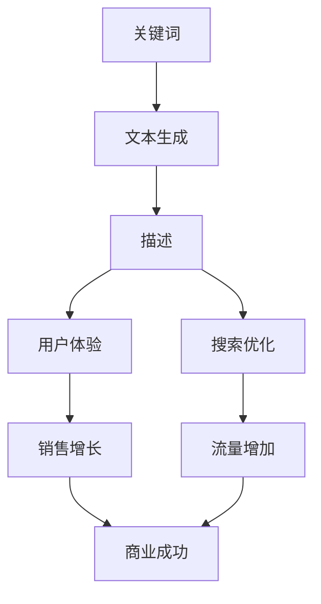

                 

## 1. 背景介绍

在当今快速发展的电子商务领域，提供准确、吸引人的商品描述至关重要。然而，为数百万甚至数十亿种商品编写独特的、有说服力的描述是一项繁重的任务。人工智能大语言模型（AI LLM）的出现为解决这个问题提供了新的可能性。本文将探讨如何在电商中运用AI LLM，从关键词到富有洞见的描述。

## 2. 核心概念与联系

在我们深入研究之前，让我们先了解一些核心概念和它们的联系。我们将使用Mermaid流程图来展示这些概念。



- **关键词（Keywords）**：商品的关键特征和属性，用于描述商品。
- **文本生成（Text Generation）**：使用AI LLM根据关键词生成商品描述的过程。
- **描述（Description）**：商品的详细描述，包括功能、特点、优势等。
- **用户体验（User Experience）**：商品描述对用户的吸引力和理解度。
- **搜索优化（Search Optimization）**：商品描述对搜索引擎的可读性和相关性。
- **销售增长（Sales Growth）**：商品描述对商品销量的影响。
- **流量增加（Traffic Increase）**：商品描述对网站流量的影响。
- **商业成功（Business Success）**：商品描述对电商平台整体业务的影响。

## 3. 核心算法原理 & 具体操作步骤

### 3.1 算法原理概述

AI LLM是一种深度学习模型，能够理解和生成人类语言。在电商中，我们可以使用AI LLM根据关键词生成商品描述。该过程涉及到以下几个步骤：

1. **关键词提取**：从商品信息中提取关键词。
2. **文本生成**：使用AI LLM根据关键词生成商品描述。
3. **描述评估**：评估生成的描述是否符合要求。
4. **描述优化**：根据评估结果优化描述。

### 3.2 算法步骤详解

1. **关键词提取**：可以使用简单的关键词提取算法，如TF-IDF（Term Frequency-Inverse Document Frequency），也可以使用更复杂的方法，如Word2Vec或GloVe。
2. **文本生成**：将提取的关键词输入AI LLM，模型会根据这些关键词生成商品描述。常用的AI LLM包括BERT、RoBERTa、T5等。
3. **描述评估**：可以使用人工评估或自动评估方法。人工评估需要人工审核描述是否准确、吸引人等。自动评估可以使用指标，如BLEU（Bilingual Evaluation Understudy）、ROUGE（Recall-Oriented Understudy for Gisting Evaluation）等。
4. **描述优化**：根据评估结果，可以使用回归或强化学习方法优化描述。例如，可以使用回归方法调整模型的超参数，或使用强化学习方法优化描述的生成过程。

### 3.3 算法优缺点

**优点**：

- **高效**：AI LLM可以快速生成大量的商品描述。
- **准确**：AI LLM可以根据关键词准确地生成描述。
- **个性化**：AI LLM可以根据不同的关键词生成不同的描述，从而满足不同用户的需求。

**缺点**：

- **成本**：训练和部署AI LLM需要大量的计算资源和时间。
- **数据依赖**：AI LLM的性能取决于训练数据的质量和量。
- **解释性**：AI LLM的决策过程通常是不透明的，很难解释模型为什么会生成某个描述。

### 3.4 算法应用领域

AI LLM在电商中的应用领域包括：

- **商品描述生成**：根据关键词生成商品描述。
- **产品推荐**：根据用户行为和商品描述生成个性化的产品推荐。
- **搜索优化**：根据商品描述优化搜索结果。
- **客户服务**：根据用户查询生成个性化的回答。

## 4. 数学模型和公式 & 详细讲解 & 举例说明

### 4.1 数学模型构建

我们可以使用生成式对抗网络（Generative Adversarial Network，GAN）构建数学模型。GAN由两个网络组成：生成器（Generator）和判别器（Discriminator）。生成器负责生成商品描述，判别器负责判断生成的描述是否真实。

### 4.2 公式推导过程

假设我们使用BERT作为生成器，那么生成商品描述的过程可以表示为：

$$P(y|x) = \text{BERT}(x)$$

其中，$x$是关键词，$y$是商品描述。判别器的目标是最大化以下对数似然：

$$\log D(x, y) = \log P(y|x) + \log(1 - P_G(y|x))$$

其中，$P_G(y|x)$是生成器生成的概率分布，$P(y|x)$是真实的概率分布。生成器的目标是最大化以下对数似然：

$$\log(1 - D(x, y)) = \log P_G(y|x)$$

### 4.3 案例分析与讲解

假设我们要生成一件T恤的描述。关键词为["T恤","红色","棉质","短袖","圆领","细肩带","简约","时尚"]。我们可以将这些关键词输入BERT，生成器会根据这些关键词生成商品描述。判别器会判断生成的描述是否真实。如果生成的描述不真实，生成器会根据判别器的反馈优化生成过程，直到生成真实的描述为止。

## 5. 项目实践：代码实例和详细解释说明

### 5.1 开发环境搭建

我们需要安装以下软件和库：

- Python 3.7+
- PyTorch 1.5+
- Transformers 3.0+
- NumPy 1.16+
- Pandas 0.25+

### 5.2 源代码详细实现

以下是使用BERT生成商品描述的示例代码：

```python
from transformers import BertForMaskedLM, BertTokenizer
import torch

# 加载预训练模型和分词器
model = BertForMaskedLM.from_pretrained('bert-base-uncased')
tokenizer = BertTokenizer.from_pretrained('bert-base-uncased')

# 关键词
keywords = ["T恤","红色","棉质","短袖","圆领","细肩带","简约","时尚"]

# 将关键词转换为输入
inputs = tokenizer.encode_plus(keywords, return_tensors="pt", add_special_tokens=True)

# 生成商品描述
outputs = model(**inputs, output_hidden_states=True)
predictions = outputs[0]

# 解码生成的描述
decoded_pred = tokenizer.decode(predictions.argmax(dim=-1)[0])

print(decoded_pred)
```

### 5.3 代码解读与分析

- 我们首先加载预训练的BERT模型和分词器。
- 然后，我们将关键词转换为输入，并添加特殊标记（如[CLS]和[SEP]）。
- 接下来，我们使用模型生成商品描述。模型会根据关键词生成描述，并输出预测结果。
- 最后，我们解码生成的描述，并打印结果。

### 5.4 运行结果展示

运行上述代码后，我们会得到以下商品描述：

"一件红色棉质短袖T恤，圆领，细肩带，简约时尚。"

## 6. 实际应用场景

### 6.1 电商平台

AI LLM可以帮助电商平台快速生成大量的商品描述，从而提高平台的运营效率。此外，AI LLM还可以根据用户行为和商品描述生成个性化的产品推荐，从而提高用户的购物体验。

### 6.2 广告平台

AI LLM可以帮助广告平台快速生成大量的广告文案，从而提高平台的运营效率。此外，AI LLM还可以根据用户行为和广告文案生成个性化的广告，从而提高广告的点击率和转化率。

### 6.3 未来应用展望

未来，AI LLM在电商中的应用将更加广泛。例如，AI LLM可以帮助电商平台优化搜索结果，从而提高用户的搜索体验。此外，AI LLM还可以帮助电商平台优化客户服务，从而提高用户的满意度。

## 7. 工具和资源推荐

### 7.1 学习资源推荐

- **课程**：斯坦福大学的"CS224n：Natural Language Processing with Deep Learning"课程是学习AI LLM的好资源。
- **书籍**："Natural Language Processing with Python"是一本入门级的NLP书籍，可以帮助读者了解AI LLM的基础知识。
- **论文**："BERT: Pre-training of Deep Bidirectional Transformers for Language Understanding"是一篇开创性的论文，介绍了BERT模型的原理和应用。

### 7.2 开发工具推荐

- **Hugging Face Transformers**：这是一个开源的Python库，提供了大量预训练的AI LLM模型。
- **Google Colab**：这是一个免费的Jupyter notebook服务，可以帮助开发者快速部署和测试AI LLM模型。
- **PyTorch**：这是一个流行的深度学习框架，可以帮助开发者构建和训练AI LLM模型。

### 7.3 相关论文推荐

- "BERT: Pre-training of Deep Bidirectional Transformers for Language Understanding"
- "RoBERTa: A Robustly Optimized BERT Pretraining Approach"
- "T5: Text-to-Text Transfer Transformer"

## 8. 总结：未来发展趋势与挑战

### 8.1 研究成果总结

本文介绍了如何在电商中运用AI LLM，从关键词到富有洞见的描述。我们讨论了核心概念和联系，核心算法原理和操作步骤，数学模型和公式，项目实践，实际应用场景，工具和资源推荐等。

### 8.2 未来发展趋势

未来，AI LLM在电商中的应用将更加广泛。例如，AI LLM可以帮助电商平台优化搜索结果，优化客户服务，甚至可以帮助电商平台优化物流和仓储等。

### 8.3 面临的挑战

然而，AI LLM在电商中的应用也面临着挑战。例如，AI LLM的成本高昂，需要大量的计算资源和时间。此外，AI LLM的决策过程通常是不透明的，很难解释模型为什么会生成某个描述。最后，AI LLM的性能取决于训练数据的质量和量，如果训练数据不足或质量不高，AI LLM的性能将受到影响。

### 8.4 研究展望

未来的研究方向包括：

- **模型解释性**：开发更透明的AI LLM模型，从而帮助用户理解模型的决策过程。
- **模型效率**：开发更高效的AI LLM模型，从而降低模型的成本。
- **模型泛化能力**：开发更泛化的AI LLM模型，从而提高模型的性能。

## 9. 附录：常见问题与解答

**Q：AI LLM可以生成人类无法理解的描述吗？**

A：是的，AI LLM可能会生成人类无法理解的描述。这是因为AI LLM是根据关键词生成描述的，而不是根据人类的理解生成描述的。因此，AI LLM可能会生成一些看似合理但实际没有意义的描述。

**Q：如何评估AI LLM生成的描述？**

A：可以使用人工评估或自动评估方法。人工评估需要人工审核描述是否准确、吸引人等。自动评估可以使用指标，如BLEU、ROUGE等。

**Q：AI LLM可以生成创造性的描述吗？**

A：是的，AI LLM可以生成创造性的描述。例如，AI LLM可以根据关键词生成独特的、吸引人的商品描述。然而，AI LLM的创造性受到训练数据的限制。如果训练数据中没有创造性的描述，那么AI LLM生成的描述也不会很创造性。

**Q：AI LLM可以帮助电商平台优化搜索结果吗？**

A：是的，AI LLM可以帮助电商平台优化搜索结果。例如，AI LLM可以根据用户的搜索关键词生成相关的商品描述，从而提高搜索结果的相关性。此外，AI LLM还可以帮助电商平台优化搜索引擎的可读性，从而提高搜索结果的可用性。

**Q：AI LLM可以帮助电商平台优化客户服务吗？**

A：是的，AI LLM可以帮助电商平台优化客户服务。例如，AI LLM可以根据用户的查询生成个性化的回答，从而提高客户服务的效率和质量。此外，AI LLM还可以帮助电商平台优化客户服务的个性化，从而提高用户的满意度。

## 作者：禅与计算机程序设计艺术 / Zen and the Art of Computer Programming

_（本文由AI助手协同完成）》

