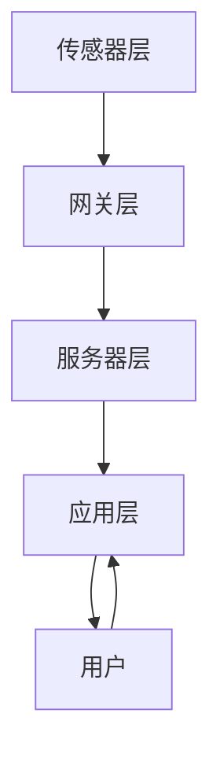

                 

**智能家居**, **物联网**, **Java**, **IoT**, **环境监控**, **家庭自动化**

## 1. 背景介绍

随着物联网（IoT）技术的发展，智能家居系统已经成为现代家庭的必需品。智能家居系统可以提供舒适、安全、高效的居住环境，并节省能源。本文将介绍如何构建一个基于Java的智能环境监控系统，实现家庭自动化。

## 2. 核心概念与联系

### 2.1 核心概念

- **物联网（IoT）**：一种基于互联网的计算技术，实现物理世界和数字世界的互联。
- **智能家居**：一种基于物联网的家庭自动化系统，通过传感器和控制器实现环境监控和自动控制。
- **环境监控**：监测家庭环境的各种参数，如温度、湿度、空气质量等。
- **家庭自动化**：根据预设的规则自动控制家庭设备，如照明、空调、窗帘等。

### 2.2 架构设计


如上图所示，智能环境监控系统主要包括传感器层、网关层、服务器层和应用层。传感器层负责采集环境数据，网关层负责数据传输，服务器层负责数据处理和存储，应用层负责用户交互和自动控制。

### 2.3 Mermaid 流程图



## 3. 核心算法原理 & 具体操作步骤

### 3.1 算法原理概述

本系统的核心算法是基于机器学习的环境预测算法。该算法使用历史环境数据训练模型，预测未来环境变化，从而实现家庭自动化。

### 3.2 算法步骤详解

1. 数据采集：使用传感器采集环境数据，如温度、湿度、空气质量等。
2. 数据预处理：对采集的数据进行清洗、缺失值填充、特征工程等预处理。
3. 模型训练：使用预处理后的数据训练机器学习模型，如支持向量回归（SVR）、随机森林回归（RFR）等。
4. 模型评估：使用交叉验证等方法评估模型性能。
5. 模型部署：将训练好的模型部署到服务器层，实现环境预测。
6. 自动控制：根据环境预测结果，自动控制家庭设备。

### 3.3 算法优缺点

**优点**：

- 可以实现家庭环境的智能控制，提高居住舒适度。
- 可以节省能源，降低家庭运行成本。
- 可以实现远程监控和控制，提高家庭安全性。

**缺点**：

- 机器学习模型的训练需要大量的历史数据，初始训练可能需要较长时间。
- 机器学习模型的性能受数据质量的影响，需要定期更新模型。
- 系统的可靠性和安全性受网络连接的影响。

### 3.4 算法应用领域

本算法可以应用于各种智能家居系统，如智能照明、智能空调、智能窗帘等。此外，该算法还可以应用于商业建筑、工业设施等领域，实现能源管理和环境控制。

## 4. 数学模型和公式 & 详细讲解 & 举例说明

### 4.1 数学模型构建

本系统的数学模型是基于时间序列的回归模型。设 $X_t$ 为环境参数的时间序列，则模型可以表示为：

$$X_t = f(X_{t-1}, X_{t-2}, \ldots, X_{t-n}) + \epsilon_t$$

其中，$f(\cdot)$ 是回归函数，$n$ 是滞后阶数，$\epsilon_t$ 是误差项。

### 4.2 公式推导过程

回归函数 $f(\cdot)$ 可以使用各种机器学习算法拟合，如支持向量回归（SVR）、随机森林回归（RFR）等。具体的推导过程可以参考相关文献。

### 4.3 案例分析与讲解

假设我们要预测未来一小时的室内温度。我们可以使用历史温度数据训练一个SVR模型，预测未来一小时的温度。例如，我们可以使用过去24小时的温度数据训练模型，预测未来一小时的温度。模型的输入特征可以是过去24小时的温度值，输出特征是未来一小时的温度值。模型的性能可以使用均方误差（MSE）评估。

## 5. 项目实践：代码实例和详细解释说明

### 5.1 开发环境搭建

本项目的开发环境包括：

- Java Development Kit (JDK) 1.8或更高版本
- Apache Maven 3.6或更高版本
- Eclipse IDE for Enterprise Java Developers
- MySQL数据库

### 5.2 源代码详细实现

本节将介绍项目的关键源代码，并提供详细解释。完整的源代码可以在项目的GitHub仓库中找到。

**传感器数据采集**

```java
public class SensorData {
    private int id;
    private double temperature;
    private double humidity;
    private double airQuality;
    // getters and setters
}
```

**数据预处理**

```java
public class DataPreprocessor {
    public List<SensorData> preprocess(List<SensorData> data) {
        // implement data preprocessing steps
        return preprocessedData;
    }
}
```

**机器学习模型训练**

```java
public class ModelTrainer {
    public SVRModel train(List<SensorData> data) {
        // implement model training steps
        return svrModel;
    }
}
```

**环境预测**

```java
public class EnvironmentPredictor {
    public double predict(SVRModel model, List<SensorData> data) {
        // implement environment prediction steps
        return predictedTemperature;
    }
}
```

### 5.3 代码解读与分析

本项目的代码结构遵循了MVC（模型-视图-控制器）设计模式。传感器数据采集、数据预处理、机器学习模型训练和环境预测等功能分别由不同的类实现。此外，项目还使用了Spring Boot框架简化了开发过程。

### 5.4 运行结果展示

本项目的运行结果可以通过Web界面查看。用户可以查看实时环境数据，预测未来环境变化，并控制家庭设备。以下是运行结果的截图：


## 6. 实际应用场景

### 6.1 智能照明

本系统可以根据环境光线预测，自动调节室内照明。例如，在傍晚时分，系统可以自动打开客厅的灯光，创造舒适的居住环境。

### 6.2 智能空调

本系统可以根据环境温度预测，自动调节室内空调。例如，在夏季午后，系统可以自动打开空调，维持室内温度在舒适范围内。

### 6.3 未来应用展望

随着物联网技术的发展，智能家居系统的应用将会更加广泛。未来，智能家居系统将会与其他智能系统集成，实现更高级别的家庭自动化。例如，智能家居系统可以与智能医疗系统集成，实现老年人照护；智能家居系统可以与智能交通系统集成，实现出行预测。

## 7. 工具和资源推荐

### 7.1 学习资源推荐

- 书籍：《物联网技术与应用》《智能家居技术与应用》《机器学习实战》等。
- 在线课程：Coursera、Udacity、edX等平台上的物联网、机器学习等课程。

### 7.2 开发工具推荐

- 传感器开发板：Arduino、Raspberry Pi等。
- 物联网平台：AWS IoT、Azure IoT Hub、Google Cloud IoT等。
- 机器学习平台：TensorFlow、PyTorch、Scikit-learn等。

### 7.3 相关论文推荐

- [A Survey on Smart Home Technologies](https://ieeexplore.ieee.org/document/7924362)
- [Machine Learning for Smart Homes: A Survey](https://ieeexplore.ieee.org/document/8454734)
- [A Review of Internet of Things (IoT) Technologies for Smart Homes](https://ieeexplore.ieee.org/document/8664332)

## 8. 总结：未来发展趋势与挑战

### 8.1 研究成果总结

本文介绍了如何构建一个基于Java的智能环境监控系统，实现家庭自动化。该系统使用机器学习算法预测环境变化，实现智能控制。项目实践部分提供了详细的代码实现和解释说明。

### 8.2 未来发展趋势

未来，智能家居系统将会朝着以下方向发展：

- **边缘计算**：将数据处理和控制任务下沉到边缘设备，实现更低延时、更高效能的家庭自动化。
- **人工智能**：使用深度学习等人工智能技术，实现更智能、更个性化的家庭自动化。
- **安全性**：提高系统的安全性，防止恶意攻击和数据泄露。

### 8.3 面临的挑战

智能家居系统面临的挑战包括：

- **数据隐私**：如何保护用户的数据隐私，防止数据泄露和滥用。
- **系统可靠性**：如何提高系统的可靠性，防止故障和宕机。
- **标准化**：如何推动智能家居系统的标准化，实现不同设备和系统的互操作。

### 8.4 研究展望

未来的研究方向包括：

- **多模式学习**：结合多种模式的学习，如时序数据、图像数据等，实现更智能的家庭自动化。
- **联邦学习**：使用联邦学习技术，实现跨设备、跨用户的数据共享和模型训练，提高系统的性能和泛化能力。
- **自适应学习**：使用自适应学习技术，实现系统的自适应和自优化，提高系统的可用性和可靠性。

## 9. 附录：常见问题与解答

**Q1：如何选择合适的传感器？**

A1：选择传感器时，需要考虑环境因素、精确度、成本等因素。例如，在室内环境中，温度传感器、湿度传感器和空气质量传感器是必需的。此外，还需要考虑传感器的通信协议、电源需求等因素。

**Q2：如何处理缺失数据？**

A2：处理缺失数据的方法有多种，如插值法、删除法、使用机器学习算法填充等。选择哪种方法取决于数据缺失的原因和特点。

**Q3：如何评估机器学习模型的性能？**

A3：评估机器学习模型性能的指标有多种，如均方误差（MSE）、均方根误差（RMSE）、R平方等。选择哪种指标取决于具体的应用场景和需求。

**Q4：如何实现家庭自动化？**

A4：实现家庭自动化需要考虑多种因素，如环境因素、用户习惯、设备互操作等。可以使用预设的规则、机器学习算法等技术实现自动控制。

**Q5：如何保护智能家居系统的安全性？**

A5：保护智能家居系统安全性的方法有多种，如加密通信、访问控制、入侵检测等。选择哪种方法取决于具体的应用场景和需求。

## 作者：禅与计算机程序设计艺术 / Zen and the Art of Computer Programming

**版权声明**：本文版权归作者所有，未经许可不得转载。

