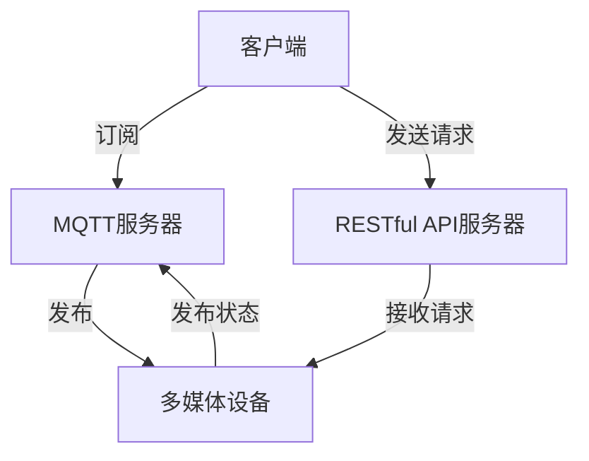

                 

## 1. 背景介绍

随着物联网和智能家居技术的发展，家庭娱乐系统也在朝着智能化方向转变。传统的家庭娱乐系统通常需要手动控制，操作繁琐，不能实时共享内容。本文将介绍一种基于MQTT协议和RESTful API的智能家居多媒体娱乐系统，旨在提供一种更智能、更便捷、更互动的家庭娱乐体验。

## 2. 核心概念与联系

### 2.1 核心概念

- **MQTT (Message Queuing Telemetry Transport)**：一种轻量级的发布/订阅消息协议，设计用于低带宽、高延迟网络，非常适合物联网和移动设备。
- **RESTful API (Representational State Transfer Application Programming Interface)**：一种基于HTTP协议的API设计风格，用于提供网络服务。
- **多媒体娱乐系统**：指家庭娱乐系统，包括但不限于音频、视频、图像等多媒体内容的播放和控制。

### 2.2 架构设计


如上图所示，系统主要由客户端、MQTT服务器、RESTful API服务器和多媒体设备组成。客户端通过订阅MQTT主题获取实时内容，并通过RESTful API控制多媒体设备。多媒体设备通过MQTT发布内容状态，并通过RESTful API接收控制指令。

### 2.3 Mermaid 流程图



## 3. 核心算法原理 & 具体操作步骤

### 3.1 算法原理概述

系统的核心算法是内容分发和设备控制算法。内容分发算法基于MQTT的发布/订阅机制，实现实时内容共享。设备控制算法基于RESTful API，实现对多媒体设备的控制。

### 3.2 算法步骤详解

#### 3.2.1 内容分发算法

1. 客户端订阅MQTT主题，指定感兴趣的内容类型。
2. 多媒体设备发布内容状态到对应的MQTT主题。
3. MQTT服务器将内容状态转发给订阅该主题的客户端。

#### 3.2.2 设备控制算法

1. 客户端发送HTTP请求给RESTful API服务器，指定控制指令和目标设备。
2. RESTful API服务器接收请求，并转发给目标设备。
3. 目标设备执行控制指令，并通过MQTT发布新的内容状态。

### 3.3 算法优缺点

**优点**：
- 实时性好：MQTT的发布/订阅机制可以实现实时内容共享。
- 便捷性好：RESTful API提供了简单易用的接口，方便客户端控制设备。
- 可扩展性好：MQTT和RESTful API都支持热插拔，可以方便地添加或移除设备。

**缺点**：
- 安全性需要考虑：MQTT和RESTful API都需要考虑数据传输的安全性，防止非法访问。
- 网络依赖性强：系统的正常运行依赖于稳定的网络连接。

### 3.4 算法应用领域

本算法适用于智能家居领域，可以实现家庭娱乐系统的智能化控制和内容共享。此外，该算法也可以应用于其他物联网领域，如工业控制、车联网等。

## 4. 数学模型和公式 & 详细讲解 & 举例说明

### 4.1 数学模型构建

设 $C$ 为内容集合，$S$ 为设备集合，$A$ 为控制指令集合，$M$ 为MQTT主题集合，$R$ 为RESTful API请求集合。则系统的数学模型可以表示为：

$$M = \{m_1, m_2,..., m_n\}, \quad S = \{s_1, s_2,..., s_m\}, \quad A = \{a_1, a_2,..., a_p\}, \quad R = \{r_1, r_2,..., r_q\}$$

其中，$m_i$ 表示第 $i$ 个MQTT主题，$s_j$ 表示第 $j$ 个设备，$a_k$ 表示第 $k$ 个控制指令，$r_l$ 表示第 $l$ 个RESTful API请求。

### 4.2 公式推导过程

系统的内容分发过程可以表示为：

$$f: C \times M \times S \rightarrow C$$

其中，$f(c, m, s)$ 表示内容 $c$ 通过MQTT主题 $m$ 分发给设备 $s$。设备控制过程可以表示为：

$$g: A \times R \times S \rightarrow A$$

其中，$g(a, r, s)$ 表示控制指令 $a$ 通过RESTful API请求 $r$ 控制设备 $s$。

### 4.3 案例分析与讲解

假设系统中有两个设备，$s_1$ 和 $s_2$，分别支持视频和音乐内容。MQTT主题集合为 $\{m_1, m_2\}$, 分别对应视频和音乐内容。控制指令集合为 $\{a_1, a_2\}$, 分别表示播放和暂停。RESTful API请求集合为 $\{r_1, r_2\}$, 分别表示控制设备 $s_1$ 和 $s_2$。

客户端订阅了 $m_1$ 和 $m_2$，并发送了 $r_1$ 和 $r_2$ 请求，指定播放视频和音乐内容。则系统的内容分发过程为：

$$f(v, m_1, s_1), \quad f(m, m_2, s_2)$$

设备控制过程为：

$$g(a_1, r_1, s_1), \quad g(a_1, r_2, s_2)$$

## 5. 项目实践：代码实例和详细解释说明

### 5.1 开发环境搭建

本项目使用 Python 语言开发，需要安装以下依赖：

- Paho-MQTT：MQTT 客户端库
- Flask：RESTful API 开发框架
- requests：HTTP 请求库

可以使用以下命令安装依赖：

```bash
pip install paho-mqtt flask requests
```

### 5.2 源代码详细实现

#### 5.2.1 MQTT 客户端

```python
import paho.mqtt.client as mqtt

def on_connect(client, userdata, flags, rc):
    print("Connected with result code " + str(rc))
    client.subscribe("#")  # 订阅所有主题

def on_message(client, userdata, msg):
    print(msg.topic + " " + str(msg.payload))

client = mqtt.Client()
client.on_connect = on_connect
client.on_message = on_message

client.connect("mqtt.example.com", 1883, 60)

client.loop_forever()
```

#### 5.2.2 RESTful API 服务器

```python
from flask import Flask, request

app = Flask(__name__)

@app.route('/control/<string:device_id>', methods=['POST'])
def control(device_id):
    data = request.get_json()
    # 处理控制指令
    print(data)
    return 'OK'

if __name__ == '__main__':
    app.run(port=5000)
```

#### 5.2.3 多媒体设备

```python
import paho.mqtt.client as mqtt
import requests

def on_connect(client, userdata, flags, rc):
    print("Connected with result code " + str(rc))
    client.publish("device/status", "online")  # 发布设备状态

client = mqtt.Client()
client.on_connect = on_connect

client.connect("mqtt.example.com", 1883, 60)

while True:
    # 接收控制指令
    response = requests.get('http://rest.example.com/control/device_id')
    data = response.json()
    # 处理控制指令
    print(data)
    client.publish("device/status", "online")  # 发布设备状态
```

### 5.3 代码解读与分析

- MQTT 客户端：订阅所有主题，接收所有内容状态。
- RESTful API 服务器：提供控制接口，接收控制指令。
- 多媒体设备：连接 MQTT 服务器，发布设备状态，并接收控制指令。

### 5.4 运行结果展示

运行上述代码，MQTT 客户端会打印接收到的所有内容状态。RESTful API 服务器会打印接收到的控制指令。多媒体设备会打印接收到的控制指令，并发布设备状态。

## 6. 实际应用场景

### 6.1 家庭娱乐

家庭成员可以通过客户端订阅感兴趣的内容，并控制多媒体设备播放内容。内容可以实时共享，方便家庭成员一起娱乐。

### 6.2 商业应用

商业场所可以使用该系统播放广告或其他内容，并实时控制内容播放。例如，商场可以播放促销活动信息，并实时控制播放内容。

### 6.3 未来应用展望

随着物联网技术的发展，该系统可以应用于更多领域，如智能办公、智能医疗等。此外，该系统也可以与人工智能技术结合，实现更智能化的控制和内容推荐。

## 7. 工具和资源推荐

### 7.1 学习资源推荐

- MQTT 官方网站：<http://mqtt.org/>
- RESTful API 设计指南：<https://www.vinaysahni.com/best-practices-for-a-pragmatic-restful-api>
- 智能家居技术指南：<https://www.home-assistant.io/docs/>

### 7.2 开发工具推荐

- MQTT 客户端工具：MQTT.fx、MQTT Explorer
- RESTful API 开发工具：Postman、curl
- Python IDE：PyCharm、Visual Studio Code

### 7.3 相关论文推荐

- "A Survey on Internet of Things: Architecture, Protocols, and Applications"：<https://ieeexplore.ieee.org/document/7927618>
- "A Review on RESTful Web Services: Architecture, Design, and Best Practices"：<https://ieeexplore.ieee.org/document/8464374>
- "Smart Home: A Survey on Technologies, Standards, and Applications"：<https://ieeexplore.ieee.org/document/8760427>

## 8. 总结：未来发展趋势与挑战

### 8.1 研究成果总结

本文介绍了基于 MQTT 协议和 RESTful API 的智能家居多媒体娱乐系统，实现了实时内容共享和设备控制。该系统具有实时性好、便捷性好、可扩展性好的优点，适用于智能家居领域。

### 8.2 未来发展趋势

随着物联网技术的发展，智能家居技术也在不断发展。未来，该系统可以与人工智能技术结合，实现更智能化的控制和内容推荐。此外，该系统也可以应用于更多领域，如智能办公、智能医疗等。

### 8.3 面临的挑战

该系统面临的挑战包括安全性需要考虑、网络依赖性强等。需要考虑数据传输的安全性，防止非法访问。此外，系统的正常运行依赖于稳定的网络连接。

### 8.4 研究展望

未来的研究可以考虑以下方向：

- 研究基于区块链技术的内容分发和设备控制算法，提高系统的安全性和可靠性。
- 研究基于人工智能技术的内容推荐算法，实现更智能化的内容共享。
- 研究基于边缘计算技术的内容分发和设备控制算法，提高系统的实时性和可扩展性。

## 9. 附录：常见问题与解答

**Q1：MQTT 和 RESTful API 有什么区别？**

A1：MQTT 是一种轻量级的发布/订阅消息协议，设计用于低带宽、高延迟网络，非常适合物联网和移动设备。RESTful API 是一种基于 HTTP 协议的 API 设计风格，用于提供网络服务。两者的区别在于传输方式不同，MQTT 使用发布/订阅机制，RESTful API 使用请求/响应机制。

**Q2：如何保证系统的安全性？**

A2：系统的安全性需要考虑数据传输的安全性，防止非法访问。可以使用加密技术保护数据传输，并使用身份验证技术验证设备身份。

**Q3：如何提高系统的实时性？**

A3：系统的实时性取决于网络连接的稳定性和设备的响应速度。可以使用低延迟的网络连接，并优化设备的响应速度，提高系统的实时性。

**Q4：如何扩展系统的可扩展性？**

A4：系统的可扩展性取决于系统的设计和实现。可以使用模块化设计，方便地添加或移除设备。此外，也可以使用分布式系统设计，提高系统的可扩展性。

**Q5：如何应用该系统于其他领域？**

A5：该系统可以应用于其他物联网领域，如工业控制、车联网等。需要根据具体领域的特点进行适当的修改和扩展。

## 作者：禅与计算机程序设计艺术 / Zen and the Art of Computer Programming

