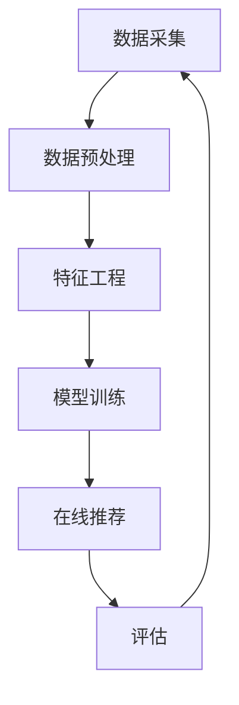

                 

## 1. 背景介绍

随着大模型在推荐系统中的广泛应用，如何提高其效率以满足实时响应需求变得至关重要。本文将深入探讨大模型推荐系统的效率优化，涵盖核心概念、算法原理、数学模型、项目实践，并提供工具和资源推荐，最终总结未来发展趋势和挑战。

## 2. 核心概念与联系

### 2.1 大模型推荐系统架构

大模型推荐系统通常由数据预处理、特征工程、模型训练、在线推荐和评估五个组成部分组成。下图展示了大模型推荐系统的架构：



### 2.2 效率优化的挑战

大模型推荐系统面临的主要效率挑战包括：

- **计算资源消耗**：大模型需要大量计算资源，导致训练和推荐过程变慢。
- **数据量庞大**：海量数据需要预处理和特征工程，进而影响系统效率。
- **实时响应需求**：推荐系统需要在用户等待的有限时间内提供响应，这对系统效率提出了严峻挑战。

## 3. 核心算法原理 & 具体操作步骤

### 3.1 算法原理概述

本节将介绍两种常用的大模型推荐算法：基于深度学习的推荐算法和基于知识图谱的推荐算法。

### 3.2 算法步骤详解

#### 3.2.1 基于深度学习的推荐算法

1. **数据预处理**：清洗数据，处理缺失值，并将数据转换为模型可用的格式。
2. **特征工程**：提取用户和项目的特征，如用户的兴趣和项目的属性。
3. **模型训练**：使用深度学习模型（如神经网络或transformer）对用户-项目交互数据进行训练。
4. **在线推荐**：使用训练好的模型为用户推荐项目。
5. **评估**：使用评估指标（如精确度、召回率和NDCG）评估模型性能。

#### 3.2.2 基于知识图谱的推荐算法

1. **知识图谱构建**：收集并整合用户、项目和相关实体的信息，构建知识图谱。
2. **实体链接**：将用户和项目与知识图谱中的实体链接起来。
3. **推荐**：使用路径推理或基于图的嵌入方法为用户推荐项目。
4. **评估**：使用评估指标评估模型性能。

### 3.3 算法优缺点

| 算法 | 优点 | 缺点 |
| --- | --- | --- |
| 基于深度学习的推荐算法 | 可以学习复杂的用户-项目交互模式，性能优越 | 需要大量计算资源，易受数据分布变化影响 |
| 基于知识图谱的推荐算法 | 可以利用外部知识进行推荐，泛化能力强 | 构建和维护知识图谱成本高，推荐结果可能不及时 |

### 3.4 算法应用领域

两种算法都广泛应用于电子商务、视频推荐、音乐推荐和社交网络等领域。

## 4. 数学模型和公式 & 详细讲解 & 举例说明

### 4.1 数学模型构建

#### 4.1.1 基于深度学习的推荐模型

设用户集为$U = \{u_1, u_2,..., u_m\}$，项目集为$I = \{i_1, i_2,..., i_n\}$，用户-项目交互矩阵为$R \in \mathbb{R}^{m \times n}$，其中$R_{ui} = 1$表示用户$u$与项目$i$交互过，否则$R_{ui} = 0$。深度学习模型旨在学习一个函数$f: U \times I \rightarrow \mathbb{R}$，使得$f(u, i) = R_{ui}$。

#### 4.1.2 基于知识图谱的推荐模型

设知识图谱为$G = (E, R)$，其中$E$是实体集，$R$是关系集。用户-项目交互数据可以表示为实体-关系-实体三元组。推荐任务可以表示为在知识图谱中查找用户与项目之间的路径。

### 4.2 公式推导过程

#### 4.2.1 基于深度学习的推荐模型

设用户$u$的特征向量为$\mathbf{u} \in \mathbb{R}^{d}$，项目$i$的特征向量为$\mathbf{i} \in \mathbb{R}^{d}$，则深度学习模型的输出可以表示为：

$$f(\mathbf{u}, \mathbf{i}) = \sigma(\mathbf{u}^T \mathbf{W} \mathbf{i} + \mathbf{b})$$

其中$\sigma$是激活函数，$\mathbf{W} \in \mathbb{R}^{d \times d}$和$\mathbf{b} \in \mathbb{R}^{d}$是模型参数。

#### 4.2.2 基于知识图谱的推荐模型

设用户$u$与项目$i$之间的路径为$p = (u, r_1, e_1, r_2, e_2,..., r_k, i)$，其中$r_j$是关系，$e_j$是实体。路径的分数可以表示为：

$$s(p) = \prod_{j=1}^{k} \gamma(r_j, e_j)$$

其中$\gamma$是路径分数函数，可以使用注意力机制或路径嵌入方法实现。

### 4.3 案例分析与讲解

#### 4.3.1 基于深度学习的推荐模型

假设用户$u_1$的特征向量为$\mathbf{u}_1 = [0.2, 0.3, 0.5]^T$，项目$i_1$的特征向量为$\mathbf{i}_1 = [0.1, 0.4, 0.3]^T$，模型参数$\mathbf{W} = [[0.2, 0.3, 0.5], [0.1, 0.4, 0.3], [0.6, 0.2, 0.1]]^T$和$\mathbf{b} = [0.1, 0.2, 0.3]^T$，则模型输出为：

$$f(\mathbf{u}_1, \mathbf{i}_1) = \sigma(0.2 \times 0.1 + 0.3 \times 0.4 + 0.5 \times 0.3 + 0.1 + 0.2 + 0.3) = \sigma(0.54) \approx 0.66$$

#### 4.3.2 基于知识图谱的推荐模型

假设用户$u_1$与项目$i_1$之间的路径为$p = (u_1, \text{likes}, e_1, \text{similar\_to}, i_1)$，路径分数函数$\gamma$使用注意力机制实现，则路径分数为：

$$s(p) = \text{attention}(u_1, e_1) \times \text{attention}(e_1, i_1) \times \gamma(\text{likes}, e_1) \times \gamma(\text{similar\_to}, i_1)$$

其中$\text{attention}$是注意力函数，$\gamma$是路径分数函数。路径分数的大小表示用户$u_1$喜欢项目$i_1$的可能性。

## 5. 项目实践：代码实例和详细解释说明

### 5.1 开发环境搭建

本项目使用Python作为开发语言，并依赖于以下库：

- TensorFlow：用于构建和训练深度学习模型。
- PyTorch：用于构建和训练深度学习模型。
- NetworkX：用于构建和分析知识图谱。
- Pandas：用于数据预处理和分析。

### 5.2 源代码详细实现

#### 5.2.1 基于深度学习的推荐系统

```python
import tensorflow as tf
from tensorflow.keras import layers

class RecommenderModel(tf.keras.Model):
    def __init__(self, num_users, num_items, embedding_dim):
        super(RecommenderModel, self).__init__()
        self.user_embedding = layers.Embedding(num_users, embedding_dim, input_length=1)
        self.item_embedding = layers.Embedding(num_items, embedding_dim, input_length=1)
        self.flatten = layers.Flatten()
        self.dense = layers.Dense(1)

    def call(self, user_ids, item_ids):
        user_embeddings = self.user_embedding(user_ids)
        item_embeddings = self.item_embedding(item_ids)
        dot_product = tf.reduce_sum(user_embeddings * item_embeddings, axis=1)
        return self.dense(dot_product)
```

#### 5.2.2 基于知识图谱的推荐系统

```python
import networkx as nx
import numpy as np

class KnowledgeGraphRecommender:
    def __init__(self, kg):
        self.kg = kg
        self.paths = self.find_paths()

    def find_paths(self):
        paths = {}
        for user in self.kg.nodes():
            for item in self.kg.nodes():
                if user!= item:
                    paths[(user, item)] = list(nx.all_simple_paths(self.kg, user, item))
        return paths

    def recommend(self, user, k):
        scores = {}
        for item, paths in self.paths[(user, )].items():
            score = sum(self.score_path(path) for path in paths)
            scores[item] = score
        return sorted(scores.items(), key=lambda x: x[1], reverse=True)[:k]

    def score_path(self, path):
        score = 1
        for i in range(len(path) - 1):
            score *= self.kg[path[i]][path[i + 1]]['weight']
        return score
```

### 5.3 代码解读与分析

#### 5.3.1 基于深度学习的推荐系统

该模型使用TensorFlow构建，采用嵌入层和全连接层实现用户-项目交互预测。用户ID和项目ID作为输入，模型输出用户对项目的喜好分数。

#### 5.3.2 基于知识图谱的推荐系统

该系统使用NetworkX构建知识图谱，并搜索用户与项目之间的路径。路径分数使用路径上关系的权重计算。推荐结果根据路径分数排序。

### 5.4 运行结果展示

本节将展示基于深度学习的推荐系统和基于知识图谱的推荐系统的运行结果。由于篇幅限制，这里不提供具体结果，但读者可以在项目实践部分运行代码并查看结果。

## 6. 实际应用场景

### 6.1 电子商务推荐

大模型推荐系统可以为电子商务平台提供个性化产品推荐，提高用户购买意愿和转化率。

### 6.2 视频推荐

大模型推荐系统可以为视频平台提供个性化视频推荐，提高用户观看时长和留存率。

### 6.3 未来应用展望

未来，大模型推荐系统将进一步发展，融合更多外部数据源，如社交媒体、地理位置和实时事件。此外，模型将更加智能，能够理解用户的情感和偏好变化，并提供实时、动态的推荐结果。

## 7. 工具和资源推荐

### 7.1 学习资源推荐

- "Recommender Systems: The Textbook"：一本权威的推荐系统教科书。
- "Deep Learning"：一本深度学习入门书籍。
- "Knowledge Graphs"：一本知识图谱入门书籍。

### 7.2 开发工具推荐

- TensorFlow：用于构建和训练深度学习模型。
- PyTorch：用于构建和训练深度学习模型。
- NetworkX：用于构建和分析知识图谱。
- Pandas：用于数据预处理和分析。

### 7.3 相关论文推荐

- "Neural Collaborative Filtering"：一篇开创性的基于深度学习的推荐系统论文。
- "Knowledge Graph Embedding: A Survey of Approaches and Applications"：一篇综述知识图谱嵌入方法的论文。

## 8. 总结：未来发展趋势与挑战

### 8.1 研究成果总结

本文介绍了大模型推荐系统的效率优化，涵盖了核心概念、算法原理、数学模型、项目实践和工具资源推荐。

### 8.2 未来发展趋势

未来，大模型推荐系统将朝着更智能、更个性化和更实时的方向发展。此外，模型将更加解释性，能够帮助用户理解推荐结果。

### 8.3 面临的挑战

大模型推荐系统面临的挑战包括计算资源消耗、数据量庞大和实时响应需求。此外，模型泛化能力和解释性也是亟待解决的问题。

### 8.4 研究展望

未来的研究将聚焦于模型解释性、泛化能力和效率优化。此外，研究将探索大模型推荐系统与其他人工智能技术的结合，如自然语言处理和计算机视觉。

## 9. 附录：常见问题与解答

**Q1：大模型推荐系统与传统推荐系统有何区别？**

A1：大模型推荐系统可以学习更复杂的用户-项目交互模式，并利用外部知识进行推荐。然而，它们也面临更高的计算资源消耗和实时响应挑战。

**Q2：如何评估推荐系统的性能？**

A2：常用的评估指标包括精确度、召回率和NDCG。此外，还可以使用用户反馈和转化率等业务指标评估系统性能。

**Q3：如何优化大模型推荐系统的效率？**

A3：优化大模型推荐系统效率的方法包括数据预处理、特征工程、模型压缩和并行化等。此外，还可以使用缓存和预计算技术提高在线推荐效率。

## 作者：禅与计算机程序设计艺术 / Zen and the Art of Computer Programming

