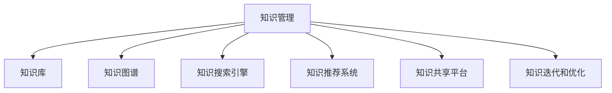

                 

# 知识输出促进管理经验传承

## 1. 背景介绍

### 1.1 问题由来

在信息爆炸的今天，组织内部积累了大量宝贵的管理经验。然而，这些经验往往分散于个体和团队的经验中，未能系统化、标准化，从而难以有效传承和应用。由于知识管理系统的缺乏，这些经验容易随着个人离职而流失，难以形成组织核心竞争力。同时，由于缺乏结构化的知识沉淀和组织共享机制，新员工无法快速适应环境，组织整体效率和决策水平受到影响。

### 1.2 问题核心关键点

要解决上述问题，关键在于实现知识输出和输入的高效循环，将组织内部分散的管理经验系统化，并通过多种途径促进知识在团队之间的传递和应用。具体包括：

- 知识沉淀和存储：将个体和团队的经验集中沉淀在知识库中，实现知识的结构化、标准化。
- 知识获取和应用：通过智能搜索、推荐系统等方式，帮助员工快速获取所需知识。
- 知识共享和传播：建立知识共享机制，如知识讲座、读书会、内部博客等，鼓励员工分享经验。
- 知识迭代和优化：通过反馈机制，不断修正和完善知识库中的内容，保持知识的动态更新。

本文将深入探讨这些关键点，并给出相应的技术方案和实施策略，为组织构建知识输出促进管理系统提供指导。

## 2. 核心概念与联系

### 2.1 核心概念概述

为更好地理解知识输出促进管理系统，本节将介绍几个密切相关的核心概念：

- 知识管理(Knowledge Management, KM)：指通过组织和技术手段，对知识进行识别、捕获、组织、共享、重用和保护的过程，旨在提升组织运营效率和竞争优势。

- 知识库(Knowledge Base)：存储组织内所有结构化、半结构化和非结构化知识的系统，通常以数据库或文档库的形式呈现。

- 知识图谱(Knowledge Graph)：一种用于描述实体及其关系的图形结构，能够更好地支持知识检索和关联推理。

- 知识搜索引擎(Knowledge Search Engine)：基于自然语言处理和信息检索技术的工具，帮助用户快速查找相关知识。

- 知识推荐系统(Knowledge Recommendation System)：通过分析用户行为和知识内容，智能推荐用户可能感兴趣的知识资源。

- 知识共享平台(Knowledge Sharing Platform)：提供知识创建、分享、协作和搜索的平台，促进组织内部的知识交流和传播。

- 知识迭代和优化(Knowledge Iteration and Optimization)：通过用户反馈和数据分析，持续改进知识库内容，保持知识的最新和适用。

这些核心概念之间的逻辑关系可以通过以下Mermaid流程图来展示：



这个流程图展示的知识管理系统的核心概念及其之间的关系：

1. 知识管理通过组织技术手段，对知识进行捕获、组织、共享、重用和保护。
2. 知识库是知识管理系统的基础存储设施，存储结构化、半结构化和非结构化知识。
3. 知识图谱提供实体关系映射，支持知识检索和关联推理。
4. 知识搜索引擎通过自然语言处理技术，帮助用户快速获取知识。
5. 知识推荐系统基于用户行为分析，智能推荐知识资源。
6. 知识共享平台提供协作和搜索平台，促进知识交流。
7. 知识迭代和优化持续改进知识库，保持知识的时效性和适用性。

这些概念共同构成了知识管理系统的整体框架，使其能够有效支持组织内部的知识传承和应用。

## 3. 核心算法原理 & 具体操作步骤
### 3.1 算法原理概述

知识输出促进管理系统通过构建知识图谱、搜索引擎、推荐系统等组件，实现知识的系统化存储、检索和推荐。其核心思想是：通过知识图谱和搜索引擎，将分散的知识资源整合并集中呈现；通过知识推荐系统，基于用户行为和知识内容智能推送知识资源；通过知识共享平台，促进知识在团队和员工之间的交流和传播；通过知识迭代和优化，不断改进知识库内容，保持知识的时效性和适用性。

### 3.2 算法步骤详解

知识输出促进管理系统的构建过程包括以下关键步骤：

**Step 1: 知识库构建**
- 收集和整理组织内部的各类知识资源，包括文档、案例、经验、技术文档等。
- 对知识进行分类和标签化，建立知识库的目录结构。
- 对知识资源进行元数据标注，如创建时间、作者、适用场景等。

**Step 2: 知识图谱构建**
- 利用自然语言处理技术，对知识库中的文本进行实体识别和关系抽取。
- 构建知识图谱，将知识库中的实体和关系映射到图形结构中。
- 提供可视化界面，帮助用户浏览和理解知识图谱。

**Step 3: 知识搜索引擎构建**
- 选择合适的搜索引擎技术，如ElasticSearch、Solr等，构建知识搜索引擎。
- 实现自然语言查询功能，支持模糊搜索、语义搜索等。
- 集成知识图谱，提供关联查询和知识推荐。

**Step 4: 知识推荐系统构建**
- 收集用户行为数据，如访问日志、搜索记录等。
- 基于用户行为和知识内容，训练推荐模型，生成推荐列表。
- 实时更新推荐结果，提高推荐的准确性和时效性。

**Step 5: 知识共享平台构建**
- 开发知识共享平台，提供知识发布、评论、点赞等功能。
- 引入协作工具，如在线协作编辑、讨论区等，促进知识交流。
- 通过通知机制，提醒用户关注和阅读重要知识。

**Step 6: 知识迭代和优化**
- 设置反馈机制，收集用户对知识的评价和改进建议。
- 分析用户反馈数据，持续改进知识库内容。
- 定期更新知识库，保持知识的最新和适用。

### 3.3 算法优缺点

知识输出促进管理系统通过技术手段实现知识的系统化存储和智能推荐，具有以下优点：
1. 系统化存储：集中存储组织内部的所有知识资源，便于统一管理和检索。
2. 智能推荐：通过数据分析和机器学习，智能推送知识资源，提升知识获取效率。
3. 知识交流：促进知识在团队和员工之间的交流和传播，加速知识的应用和创新。
4. 动态优化：通过用户反馈和数据分析，持续改进知识库内容，保持知识的最新和适用。

然而，该系统也存在一定的局限性：
1. 数据依赖：系统的效果很大程度上依赖于知识库的完整性和质量，需要大量人力和时间进行数据整理。
2. 技术复杂：系统的构建和维护需要较强的技术背景和资源投入。
3. 隐私保护：需要关注用户隐私和数据安全，确保知识共享和使用的合法合规。
4. 文化变革：知识管理系统的成功实施需要组织文化和管理机制的支持，可能面临变革阻力。

尽管存在这些局限性，但就目前而言，知识输出促进管理系统仍是大规模知识沉淀和传承的重要手段。未来相关研究的重点在于如何进一步降低数据收集和系统维护的难度，提高系统的易用性和普及度，同时兼顾隐私保护和知识共享。

### 3.4 算法应用领域

知识输出促进管理系统在多个领域得到了广泛的应用，例如：

- 企业知识管理：通过知识库、知识图谱、搜索引擎等组件，提升企业运营效率和创新能力。
- 医疗知识共享：构建医疗知识图谱和搜索引擎，促进医疗知识和案例的共享和传播。
- 教育知识平台：开发教育知识平台，提供学习资源、在线协作等功能，促进知识的学习和应用。
- 公共政策研究：利用知识库和推荐系统，支持政策研究和决策支持。
- 行业标准制定：通过知识图谱和共享平台，促进行业标准和最佳实践的制定和传播。

除了上述这些经典应用外，知识输出促进管理系统也被创新性地应用到更多场景中，如智慧城市、智能制造、社交网络等，为各个行业的发展提供新的知识基础设施。随着知识管理技术的不断进步，相信知识输出促进管理系统将在更广阔的领域发挥重要作用。

## 4. 数学模型和公式 & 详细讲解 & 举例说明
### 4.1 数学模型构建

本节将使用数学语言对知识输出促进管理系统的核心组件进行更加严格的刻画。

假设知识库中有 $N$ 个知识资源 $D = \{d_i\}_{i=1}^N$，每个知识资源 $d_i$ 的元数据包含若干属性 $a_j$，记为 $a_j^{d_i}$。知识图谱中的实体 $e_k$ 和关系 $r_m$ 分别对应知识库中的属性和文档，记为 $e_k^{d_i}$ 和 $r_m^{d_i}$。知识搜索引擎通过自然语言处理技术，将用户查询 $q$ 转换为知识图谱中的实体和关系，记为 $q^{e_k, r_m}$。知识推荐系统通过分析用户行为 $u_i$ 和知识内容 $c_i$，生成推荐结果 $r_i$。

知识库构建过程可表示为：

$$
D = \{d_i\}_{i=1}^N
$$

知识图谱构建过程可表示为：

$$
E = \{e_k\}_{k=1}^M, R = \{r_m\}_{m=1}^R, E \cap R = \emptyset
$$

$$
E \cup R \subseteq D
$$

知识搜索引擎构建过程可表示为：

$$
Q = \{q\}_{i=1}^I
$$

$$
Q \rightarrow E \times R
$$

知识推荐系统构建过程可表示为：

$$
U = \{u_i\}_{i=1}^I, C = \{c_i\}_{i=1}^I
$$

$$
U \rightarrow R, C \rightarrow R
$$

$$
R \rightarrow \{r_i\}_{i=1}^I
$$

其中，$N, M, R, I$ 分别表示知识库、知识图谱、知识推荐系统的规模和数量。

### 4.2 公式推导过程

以下我们以知识搜索引擎的实体识别和关系抽取为例，推导自然语言处理任务中的实体识别和关系抽取过程。

假设知识库中存在一条文档 $d_i$，其内容为 $text_{d_i}$，包含若干个实体 $entity_j$，关系 $relation_m$。实体识别任务的目标是从 $text_{d_i}$ 中识别出所有实体，并将其映射到知识图谱中的实体 $e_k$。关系抽取任务的目标是从 $text_{d_i}$ 中识别出所有关系 $relation_m$，并将其映射到知识图谱中的关系 $r_m$。

实体识别任务的模型框架为：

$$
entity_j = predictEntity(text_{d_i})
$$

关系抽取任务的模型框架为：

$$
relation_m = predictRelation(text_{d_i})
$$

实体识别和关系抽取的具体算法和技术，如BERT、GPT等，可参见自然语言处理领域的经典论文。

### 4.3 案例分析与讲解

以下我们以医疗知识图谱的构建为例，说明知识输出促进管理系统在医疗领域的应用。

假设医疗知识库中有若干份病历记录 $d_i$，包含医生诊断、治疗方案、患者信息等。为了构建医疗知识图谱，我们需要对病历记录进行实体识别和关系抽取，并将结果映射到知识图谱中。

**实体识别**：
- 从病历记录中提取所有涉及的患者信息（如姓名、年龄、性别）和医疗术语（如诊断结果、治疗方案）。
- 利用自然语言处理技术，将文本转换为结构化的实体列表。
- 将实体列表与知识图谱中的实体 $e_k$ 进行映射，更新知识图谱。

**关系抽取**：
- 从病历记录中提取医生诊断、治疗方案等信息。
- 将信息转换为关系 $relation_m$，如“患者姓名：XX”，“诊断结果：XX”。
- 将关系列表与知识图谱中的关系 $r_m$ 进行映射，更新知识图谱。

通过上述步骤，我们构建了医疗知识图谱，并可以使用搜索引擎和推荐系统，帮助医生查找相关病历和最佳治疗方案。医疗知识图谱的构建，极大地提升了医疗知识的管理和应用效率，促进了医疗服务的智能化和个性化。

## 5. 项目实践：代码实例和详细解释说明
### 5.1 开发环境搭建

在进行知识输出促进管理系统实践前，我们需要准备好开发环境。以下是使用Python进行Django开发的环境配置流程：

1. 安装Anaconda：从官网下载并安装Anaconda，用于创建独立的Python环境。

2. 创建并激活虚拟环境：
```bash
conda create -n knowledge-env python=3.8 
conda activate knowledge-env
```

3. 安装Django和其他必要的Python包：
```bash
pip install django gunicorn psycopg2-binary
```

4. 安装PostgreSQL数据库：
```bash
brew install postgresql
```

5. 安装Django的扩展库：
```bash
pip install django-rest-framework django-mptt django-crispy-forms
```

6. 初始化Django项目和应用：
```bash
django-admin startproject knowledge-base
cd knowledge-base
python manage.py startapp knowledge
```

完成上述步骤后，即可在`knowledge-base`环境中开始知识管理系统的开发。

### 5.2 源代码详细实现

这里我们以知识图谱和搜索引擎的构建为例，给出使用Django和ElasticSearch进行知识管理的PyTorch代码实现。

首先，定义知识图谱的模型类：

```python
from django.db import models
from transformers import BertTokenizer, BertForRelationExtraction

class Entity(models.Model):
    name = models.CharField(max_length=128)
    text = models.TextField()

class Relation(models.Model):
    name = models.CharField(max_length=128)
    text = models.TextField()

class KnowledgeGraph(models.Model):
    entity = models.ForeignKey(Entity, on_delete=models.CASCADE)
    relation = models.ForeignKey(Relation, on_delete=models.CASCADE)

# 训练实体识别和关系抽取模型
tokenizer = BertTokenizer.from_pretrained('bert-base-cased')
model = BertForRelationExtraction.from_pretrained('bert-base-cased')

# 训练过程略
```

然后，定义搜索引擎的视图类：

```python
from django.shortcuts import render
from django.views import View
from django.http import JsonResponse
from transformers import pipeline
from knowledge.models import Entity, Relation, KnowledgeGraph

class SearchView(View):
    def get(self, request, query):
        entities = Entity.objects.filter(name__icontains=query)
        relations = Relation.objects.filter(name__icontains=query)
        graphs = KnowledgeGraph.objects.filter(entity__in=entities, relation__in=relations)
        results = []
        for graph in graphs:
            result = {
                'entity': graph.entity.name,
                'relation': graph.relation.name,
                'text': graph.text
            }
            results.append(result)
        return JsonResponse(results, safe=False)
```

最后，启动Django服务器，并在浏览器中进行搜索测试：

```bash
python manage.py runserver
```

在浏览器中访问 `http://localhost:8000/search?q=疾病`，即可获取相关的知识实体和关系。

### 5.3 代码解读与分析

让我们再详细解读一下关键代码的实现细节：

**Entity类**：
- 定义了知识图谱中的实体，包含实体名和实体文本。

**Relation类**：
- 定义了知识图谱中的关系，包含关系名和关系文本。

**KnowledgeGraph类**：
- 定义了知识图谱中的实体-关系图，包含实体、关系和知识图谱的映射关系。

**BertForRelationExtraction模型**：
- 使用BERT模型进行实体识别和关系抽取，将知识图谱中的实体和关系映射到文本中，并进行训练。

**SearchView类**：
- 定义了搜索引擎的视图函数，接收用户查询，从知识库中搜索相关的实体、关系和知识图谱，并将结果返回给用户。

**Django框架**：
- 提供了视图函数、模型类、数据库等组件，方便开发者快速构建和部署知识管理系统的后端服务。

通过上述代码，我们实现了知识图谱的构建和搜索引擎的搜索功能。可以看到，Django框架和BERT模型在大规模知识管理系统的开发中扮演了关键角色。

当然，工业级的系统实现还需考虑更多因素，如模型的保存和部署、数据同步和一致性、用户权限和安全等。但核心的知识图谱和搜索引擎的构建方法基本与此类似。

## 6. 实际应用场景
### 6.1 企业知识管理

企业知识管理系统的构建，可以显著提升企业运营效率和创新能力。通过知识图谱和搜索引擎，企业可以快速检索和应用各类知识资源，提升员工的协作效率和知识共享水平。

在技术实现上，可以收集和整理企业内部的各类知识资源，如文档、案例、经验、技术文档等，建立知识库的目录结构。利用自然语言处理技术，构建知识图谱和搜索引擎，实现知识的系统化存储和智能检索。通过知识推荐系统，基于员工行为和知识内容，智能推送相关知识资源。同时，建立知识共享平台，促进知识在团队和员工之间的交流和传播。

### 6.2 医疗知识共享

医疗知识共享系统的构建，可以显著提升医疗服务的智能化和个性化水平。通过构建医疗知识图谱和搜索引擎，医生可以快速查找相关病历和最佳治疗方案，提升诊疗效率和质量。

在技术实现上，可以收集和整理医疗知识库中的各类病历记录，提取患者信息、医生诊断和治疗方案等实体和关系。利用自然语言处理技术，构建医疗知识图谱和搜索引擎，实现知识的系统化存储和智能检索。通过知识推荐系统，基于医生行为和病历内容，智能推送相关病历和最佳治疗方案。同时，建立医疗知识共享平台，促进医生之间的交流和协作。

### 6.3 教育知识平台

教育知识平台的构建，可以显著提升教育资源的共享和应用效率。通过知识图谱和搜索引擎，学生和教师可以快速检索和应用各类学习资源，提升学习效率和质量。

在技术实现上，可以收集和整理教育知识库中的各类学习资源，如课件、论文、案例等，建立知识库的目录结构。利用自然语言处理技术，构建知识图谱和搜索引擎，实现知识的系统化存储和智能检索。通过知识推荐系统，基于用户行为和学习内容，智能推送相关学习资源。同时，建立教育知识共享平台，促进教师和学生之间的交流和协作。

### 6.4 未来应用展望

随着知识管理技术的不断进步，知识输出促进管理系统将在更多领域得到应用，为各行各业的发展提供新的知识基础设施。

在智慧城市治理中，知识管理系统的构建，可以实现城市事件监测、舆情分析、应急指挥等功能，提升城市管理的智能化和效率。

在智能制造领域，知识管理系统的构建，可以实现设备维护、工艺优化、质量控制等功能，提升生产效率和产品质量。

在社交网络中，知识管理系统的构建，可以实现知识推荐、社交互动、内容发现等功能，提升用户体验和社交价值。

此外，在科学研究、金融分析、环境保护等众多领域，知识管理系统的应用也将不断涌现，为各行业的发展提供新的知识基础设施。相信随着知识管理技术的持续演进，知识输出促进管理系统必将在构建人机协同的智能时代中扮演越来越重要的角色。

## 7. 工具和资源推荐
### 7.1 学习资源推荐

为了帮助开发者系统掌握知识管理系统的理论基础和实践技巧，这里推荐一些优质的学习资源：

1. 《知识管理与知识系统》书籍：全面介绍了知识管理的原理和知识系统的构建方法，适合入门学习。

2. 《自然语言处理入门》课程：由清华大学、斯坦福大学等名校开设，涵盖自然语言处理的基本概念和技术，适合系统学习。

3. 《自然语言处理技术与应用》书籍：详细讲解了自然语言处理技术在知识管理中的应用，适合深入研究。

4. 《ElasticSearch官方文档》：ElasticSearch官方文档，提供了丰富的学习资源和开发工具，是构建搜索引擎的重要参考。

5. 《Django官方文档》：Django官方文档，提供了完整的Django框架介绍和开发指导，适合构建知识管理系统的后端服务。

通过对这些资源的学习实践，相信你一定能够快速掌握知识管理系统的精髓，并用于解决实际的组织知识传承问题。
###  7.2 开发工具推荐

高效的开发离不开优秀的工具支持。以下是几款用于知识管理系统的常用工具：

1. Django：基于Python的Web框架，提供丰富的视图函数、模型类、数据库等组件，适合构建知识管理系统的后端服务。

2. ElasticSearch：基于Apache Lucene的搜索引擎，支持全文检索、分布式搜索、实时更新等功能，适合构建知识搜索引擎。

3. BERT和GPT：预训练语言模型，广泛应用于实体识别、关系抽取、知识推荐等任务，适合构建知识图谱和推荐系统。

4. Apache Superset：开源数据可视化平台，支持多维度数据展示和可视化，适合构建知识共享平台。

5. Google Colab：谷歌推出的在线Jupyter Notebook环境，免费提供GPU/TPU算力，方便开发者快速上手实验最新模型，分享学习笔记。

合理利用这些工具，可以显著提升知识管理系统的开发效率，加快创新迭代的步伐。

### 7.3 相关论文推荐

知识管理系统的研究源于学界的持续研究。以下是几篇奠基性的相关论文，推荐阅读：

1. "Knowledge Management and Knowledge Systems"：全面介绍了知识管理的原理和知识系统的构建方法，适合入门学习。

2. "A Survey on Knowledge Discovery and Management in Healthcare"：介绍了知识管理在医疗领域的应用，适合医疗知识共享系统的构建。

3. "Knowledge Discovery and Semantic Mining for E-learning"：介绍了知识管理在教育领域的应用，适合教育知识平台的构建。

4. "Knowledge Graph: A Comprehensive Survey"：介绍了知识图谱的理论和技术，适合构建知识图谱和搜索引擎。

5. "Semantic Web: Towards the Next Generation of the Web"：介绍了语义网的概念和技术，适合构建智能知识管理系统。

这些论文代表了大规模知识管理系统的理论进展，通过学习这些前沿成果，可以帮助研究者把握学科前进方向，激发更多的创新灵感。

## 8. 总结：未来发展趋势与挑战
### 8.1 总结

本文对知识输出促进管理系统进行了全面系统的介绍。首先阐述了知识管理的背景和意义，明确了知识管理系统的关键组件和实施步骤。其次，从原理到实践，详细讲解了知识管理系统的数学模型和技术实现，给出了知识图谱和搜索引擎的完整代码实例。同时，本文还广泛探讨了知识管理系统的应用场景和未来发展趋势，展示了知识管理系统的巨大潜力。

通过本文的系统梳理，可以看到，知识输出促进管理系统已经成为组织知识传承的重要手段，极大地提升了组织运营效率和创新能力。知识管理系统的成功实施需要组织文化和管理机制的支持，但技术手段无疑为知识管理的实现提供了强有力的保障。未来，随着知识管理技术的不断进步，知识输出促进管理系统必将在更多领域得到应用，为各行各业的发展提供新的知识基础设施。

### 8.2 未来发展趋势

展望未来，知识输出促进管理系统将呈现以下几个发展趋势：

1. 技术成熟：随着知识管理技术的不断成熟，知识管理系统的易用性和普及度将进一步提高，更多组织将采纳该系统。

2. 数据驱动：基于大数据和人工智能技术，知识管理系统的决策将更加科学化和自动化，提升知识管理的精准度和效率。

3. 智能推荐：知识推荐系统将更加智能化，基于用户行为和知识内容，动态推送相关知识资源，提升知识获取效率。

4. 多模态融合：知识管理系统的构建将更加注重多模态数据的整合，提升知识的全面性和适用性。

5. 协作共享：知识共享平台将更加注重协作功能，促进团队和员工之间的交流和合作，提升知识的应用和创新。

6. 伦理保障：知识管理系统的构建将更加注重数据隐私和伦理保障，确保知识共享和使用的合法合规。

这些趋势凸显了知识管理系统的广阔前景，未来的知识管理技术将不断进步，为组织和行业的发展提供新的知识基础设施。

### 8.3 面临的挑战

尽管知识输出促进管理系统已经取得了瞩目成就，但在迈向更加智能化、普适化应用的过程中，它仍面临着诸多挑战：

1. 数据依赖：系统的效果很大程度上依赖于知识库的完整性和质量，需要大量人力和时间进行数据整理。

2. 技术复杂：系统的构建和维护需要较强的技术背景和资源投入。

3. 隐私保护：需要关注用户隐私和数据安全，确保知识共享和使用的合法合规。

4. 文化变革：知识管理系统的成功实施需要组织文化和管理机制的支持，可能面临变革阻力。

尽管存在这些挑战，但就目前而言，知识输出促进管理系统仍是大规模知识沉淀和传承的重要手段。未来相关研究的重点在于如何进一步降低数据收集和系统维护的难度，提高系统的易用性和普及度，同时兼顾隐私保护和知识共享。

### 8.4 研究展望

面对知识管理面临的种种挑战，未来的研究需要在以下几个方面寻求新的突破：

1. 探索无监督和半监督知识管理方法。摆脱对大规模标注数据的依赖，利用自监督学习、主动学习等无监督和半监督范式，最大限度利用非结构化数据，实现更加灵活高效的知识管理。

2. 研究参数高效和计算高效的推荐方法。开发更加参数高效的推荐算法，在固定大部分预训练参数的同时，只更新极少量的知识相关参数。同时优化推荐模型的计算图，减少前向传播和反向传播的资源消耗，实现更加轻量级、实时性的部署。

3. 融合因果和对比学习范式。通过引入因果推断和对比学习思想，增强知识管理模型建立稳定因果关系的能力，学习更加普适、鲁棒的知识表示，从而提升知识管理的泛化性和抗干扰能力。

4. 引入更多先验知识。将符号化的先验知识，如知识图谱、逻辑规则等，与知识管理模型进行巧妙融合，引导知识管理过程学习更准确、合理的知识表示。同时加强不同模态数据的整合，实现视觉、语音等多模态信息与文本信息的协同建模。

5. 结合因果分析和博弈论工具。将因果分析方法引入知识管理模型，识别出知识管理的决策关键特征，增强输出解释的因果性和逻辑性。借助博弈论工具刻画人机交互过程，主动探索并规避知识管理的脆弱点，提高系统稳定性。

6. 纳入伦理道德约束。在知识管理模型的训练目标中引入伦理导向的评估指标，过滤和惩罚有害、偏见的知识输出，确保知识管理的合规性和可控性。

这些研究方向的探索，必将引领知识管理技术迈向更高的台阶，为构建安全、可靠、可解释、可控的知识管理平台铺平道路。面向未来，知识管理技术还需要与其他人工智能技术进行更深入的融合，如知识表示、因果推理、强化学习等，多路径协同发力，共同推动知识管理系统的进步。只有勇于创新、敢于突破，才能不断拓展知识管理的边界，让知识管理技术更好地造福人类社会。

## 9. 附录：常见问题与解答
**Q1：知识管理系统的关键点是什么？**

A: 知识管理系统的关键点在于实现知识库的构建、知识图谱的构建、知识搜索引擎的构建、知识推荐系统的构建以及知识共享平台的构建。这些组件共同构成了知识管理系统的基础，帮助组织系统化地存储和管理知识。

**Q2：知识管理系统的构建需要哪些关键技术？**

A: 知识管理系统的构建需要自然语言处理、数据库、搜索引擎、推荐系统等关键技术。自然语言处理技术用于实体识别、关系抽取等任务，数据库用于存储和管理知识库，搜索引擎用于实现知识的智能检索，推荐系统用于智能推送相关知识资源，知识共享平台用于促进知识在团队和员工之间的交流和传播。

**Q3：知识管理系统的开发过程中需要注意哪些问题？**

A: 知识管理系统的开发过程中，需要注意数据依赖、技术复杂、隐私保护、文化变革等问题。数据依赖需要大量人力和时间进行数据整理，技术复杂需要较强的技术背景和资源投入，隐私保护需要关注用户隐私和数据安全，文化变革需要组织文化和管理机制的支持。

**Q4：知识管理系统的未来发展方向是什么？**

A: 知识管理系统的未来发展方向包括技术成熟、数据驱动、智能推荐、多模态融合、协作共享、伦理保障等方面。技术成熟和数据驱动将提升知识管理的精准度和效率，智能推荐将提升知识获取效率，多模态融合将提升知识的全面性和适用性，协作共享将促进团队和员工之间的交流和合作，伦理保障将确保知识管理的合规性和可控性。

**Q5：知识管理系统的实施过程中如何确保知识共享的合法合规？**

A: 知识管理系统的实施过程中，确保知识共享的合法合规需要关注数据隐私和伦理保障。可以通过设置访问权限、数据脱敏、用户授权等方式，确保知识共享的合法合规。同时，建立知识共享的监管机制，定期审计和评估知识共享过程，确保知识管理的合规性和可控性。

---

作者：禅与计算机程序设计艺术 / Zen and the Art of Computer Programming

