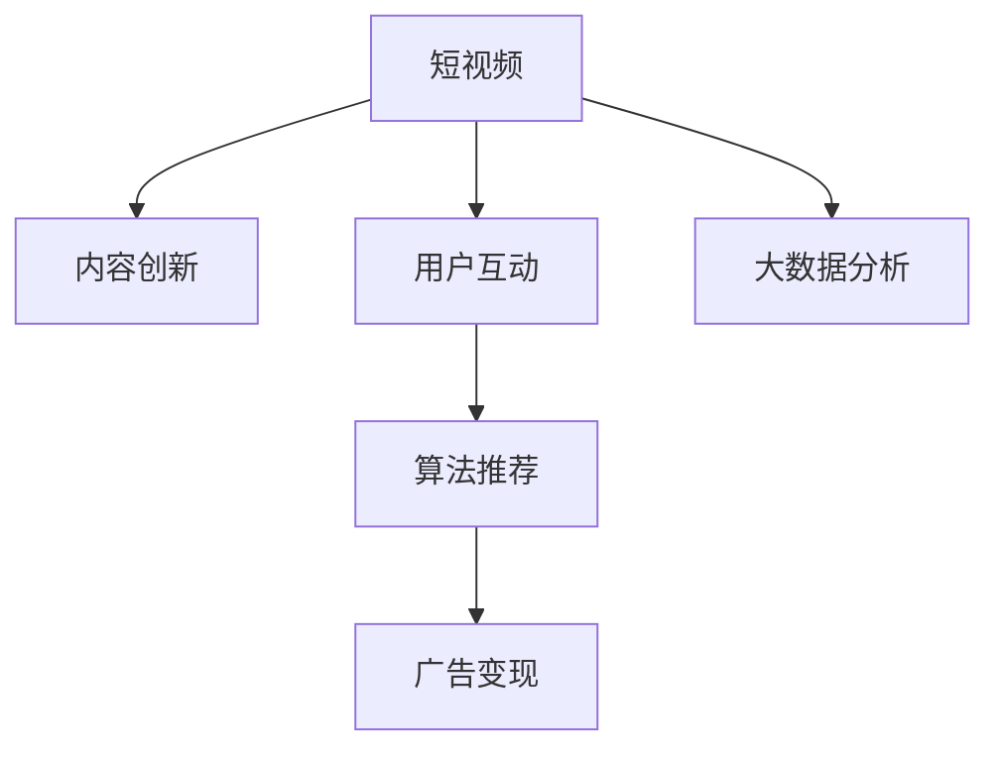

                 

# 短视频创业：碎片化时代的内容革命

> 关键词：短视频，内容创新，用户互动，算法推荐，广告变现，大数据分析

## 1. 背景介绍

### 1.1 问题由来
随着移动互联网的普及和智能手机的普及，人们的注意力正在从传统的文字和图片内容，向更加丰富和动态的短视频内容转变。TikTok、抖音等平台迅速崛起，不仅吸引了大量年轻用户，也激发了短视频创业的浪潮。短视频创业的成功不仅依赖于优质内容的制作和分发，更在于其背后一整套完备的技术和商业模式支撑。

### 1.2 问题核心关键点
短视频创业的核心在于如何构建高效的内容生产和分发系统，提升用户参与度和留存率，实现高效的内容变现。这不仅涉及内容的创新和生产，还涵盖算法推荐、用户互动、广告变现等多个环节。

短视频创业的核心技术包括：
1. 内容生成技术：包括视频剪辑、编辑、特效、音乐等工具和技术。
2. 内容分发技术：包括视频传输、CDN加速、分布式存储等技术。
3. 用户互动技术：包括社区管理、用户行为分析、个性化推荐等技术。
4. 广告变现技术：包括广告投放、用户行为跟踪、效果评估等技术。

## 2. 核心概念与联系

### 2.1 核心概念概述

为更好地理解短视频创业的技术体系，本节将介绍几个密切相关的核心概念：

- 短视频：指时长较短、内容简练、形式多样、易于传播的视频内容。其特点是节奏快、信息密度高、互动性强，符合当前用户“碎片化”的需求习惯。
- 内容创新：指通过创意、技术手段不断创造新颖、有吸引力的短视频内容。内容创新是短视频创业的核心驱动力，也是平台持续吸引用户的关键。
- 用户互动：指通过互动技术增强用户参与感，提升用户粘性。如评论、点赞、分享、直播等互动方式，是平台社交属性的重要体现。
- 算法推荐：指通过推荐算法个性化展示内容，提升用户留存和观看时间。算法推荐技术是平台运营和变现的重要手段。
- 广告变现：指通过广告、付费会员、电商等形式，将平台流量转化为商业价值。广告变现是平台商业模式的核心部分。
- 大数据分析：指通过大数据技术挖掘用户行为和偏好，指导内容和运营策略。大数据分析是平台决策支持的基础。

这些核心概念之间的逻辑关系可以通过以下Mermaid流程图来展示：



这个流程图展示了大视频创业的核心概念及其之间的关系：

1. 短视频作为平台的核心内容，通过内容创新持续吸引用户。
2. 用户互动增强用户粘性，提升观看时长和活跃度。
3. 算法推荐优化内容展示策略，增加用户留存。
4. 广告变现是平台商业模式的核心，帮助平台获取收入。
5. 大数据分析指导内容和运营策略，提升平台运营效率。

## 3. 核心算法原理 & 具体操作步骤
### 3.1 算法原理概述

短视频创业的技术体系中，核心算法包括内容推荐算法、用户行为预测算法、广告投放算法等。这些算法通过机器学习和大数据分析技术，实现智能化、个性化的内容推荐和运营策略。

以内容推荐算法为例，其核心思想是通过用户的历史行为数据，学习用户兴趣偏好，并利用这些信息为用户推荐最相关、最有吸引力的内容。具体算法流程如下：

1. 数据收集：收集用户的行为数据，如观看时长、点赞、评论、分享等。
2. 特征提取：从行为数据中提取用户兴趣特征，如视频类型、创作者标签、用户标签等。
3. 模型训练：基于用户历史行为和兴趣特征，训练推荐模型，如协同过滤、矩阵分解、神经网络等。
4. 内容推荐：根据用户兴趣特征，推荐与用户兴趣最匹配的内容。

### 3.2 算法步骤详解

以下详细介绍内容推荐算法的具体步骤：

**Step 1: 数据收集**
- 使用API接口或日志文件，收集用户的历史行为数据，如观看时长、点赞、评论、分享等。
- 将行为数据保存为矩阵形式，每个行为数据对应一个用户和一项内容的评分。

**Step 2: 特征提取**
- 对行为数据进行预处理，包括数据清洗、去噪、归一化等。
- 使用特征工程技术，提取用户和内容的特征向量。如使用PCA降维技术，将高维特征映射到低维空间。

**Step 3: 模型训练**
- 选择合适的推荐算法，如协同过滤、矩阵分解、神经网络等。
- 使用GPU或分布式训练，对模型进行训练，并使用交叉验证等技术进行调参。
- 保存训练好的模型，用于后续的推荐服务。

**Step 4: 内容推荐**
- 使用训练好的推荐模型，对新用户输入的行为数据进行特征提取。
- 根据用户特征和模型预测，推荐与用户兴趣最匹配的内容。
- 返回推荐结果，显示在用户界面或通知栏上，吸引用户观看。

### 3.3 算法优缺点

内容推荐算法具有以下优点：
1. 提升用户留存率：个性化推荐能够显著提升用户粘性，增加用户留存时间和观看时长。
2. 增加广告收入：通过精准推荐广告，提升广告点击率和转化率，增加平台收入。
3. 优化内容生态：推荐算法能够帮助发现优质内容，提升整体内容质量。

同时，该算法也存在以下局限性：
1. 数据依赖性强：推荐算法的性能很大程度上取决于数据质量和量级，需要持续收集和更新用户行为数据。
2. 模型复杂度高：推荐模型的复杂度较高，计算资源消耗较大，难以实时处理大量请求。
3. 公平性问题：推荐算法可能倾向于推荐高频热门内容，导致冷门优质内容被忽视。
4. 隐私风险：用户行为数据的收集和存储可能带来隐私风险，需要采取严格的数据保护措施。

尽管存在这些局限性，但就目前而言，内容推荐算法仍是短视频平台的重要技术支撑，能够显著提升用户体验和平台收益。

### 3.4 算法应用领域

内容推荐算法在短视频创业中，有着广泛的应用：

1. 个性化推荐：对用户进行个性化推荐，提升用户满意度和粘性。
2. 热门榜单：通过分析用户兴趣，生成热门视频榜单，帮助用户发现最新和最热门的短视频内容。
3. 广告推荐：基于用户兴趣，精准投放广告，提升广告效果。
4. 用户画像：通过用户行为数据，构建用户画像，帮助平台理解用户需求，优化内容策略。

除了上述这些经典应用外，内容推荐算法还可以创新性地应用于更多场景中，如社区推荐、内容排序、个性化视频制作等，为短视频平台带来新的商业机会和用户体验。

## 4. 数学模型和公式 & 详细讲解 & 举例说明

### 4.1 数学模型构建

以下以协同过滤算法为例，介绍其数学模型构建和原理：

假设用户行为矩阵为 $R \in \mathbb{R}^{m \times n}$，其中 $m$ 为物品数量，$n$ 为用户数量。$R_{ui}$ 表示用户 $u$ 对物品 $i$ 的评分。

协同过滤算法的目标是通过用户行为数据，找到用户 $u$ 和物品 $i$ 之间的相似度，从而推荐与用户 $u$ 最相似的物品。假设用户 $u$ 和物品 $i$ 的向量表示分别为 $x_u$ 和 $x_i$，则用户 $u$ 对物品 $i$ 的评分可以表示为：

$$
R_{ui} = \mathbf{x}_u^T \mathbf{x}_i
$$

用户 $u$ 的相似度向量可以表示为：

$$
\mathbf{s}_u = \sum_{i=1}^{m}R_{ui}x_i
$$

用户 $u$ 的相似度矩阵可以表示为：

$$
S_u = \mathbf{s}_u \mathbf{x}^T
$$

物品 $i$ 的相似度向量可以表示为：

$$
\mathbf{s}_i = \sum_{u=1}^{n}R_{ui}x_u
$$

物品 $i$ 的相似度矩阵可以表示为：

$$
S_i = \mathbf{s}_i \mathbf{x}^T
$$

用户 $u$ 和物品 $i$ 的相似度可以表示为：

$$
\hat{R}_{ui} = \frac{S_uS_i^T}{||S_u||||S_i||}
$$

当 $\hat{R}_{ui}$ 大于阈值时，认为物品 $i$ 是用户 $u$ 的推荐物品。

### 4.2 公式推导过程

以下是协同过滤算法的详细推导过程：

1. 假设用户行为矩阵为 $R \in \mathbb{R}^{m \times n}$，其中 $m$ 为物品数量，$n$ 为用户数量。$R_{ui}$ 表示用户 $u$ 对物品 $i$ 的评分。

2. 根据评分公式 $R_{ui} = \mathbf{x}_u^T \mathbf{x}_i$，计算每个用户和物品的向量表示 $x_u$ 和 $x_i$。

3. 计算用户 $u$ 的相似度向量 $\mathbf{s}_u$ 和相似度矩阵 $S_u$，计算物品 $i$ 的相似度向量 $\mathbf{s}_i$ 和相似度矩阵 $S_i$。

4. 根据用户 $u$ 和物品 $i$ 的相似度矩阵 $S_u$ 和 $S_i$，计算相似度 $\hat{R}_{ui}$。

5. 根据阈值 $\epsilon$，判断物品 $i$ 是否为推荐物品。

### 4.3 案例分析与讲解

以下以TikTok为例，展示内容推荐算法的应用：

TikTok 使用协同过滤算法进行内容推荐，具体步骤包括：
1. 数据收集：收集用户观看视频、点赞、评论、分享等行为数据，保存为矩阵形式。
2. 特征提取：对行为数据进行预处理和特征工程，提取用户和视频的特征向量。
3. 模型训练：使用协同过滤算法对模型进行训练，并保存训练好的模型。
4. 内容推荐：使用训练好的模型，对用户输入的行为数据进行特征提取和相似度计算，推荐相关视频。
5. 实时调整：根据用户反馈和行为数据，实时调整模型参数，提升推荐效果。

通过内容推荐算法，TikTok 能够根据用户行为数据，为用户推荐个性化视频内容，提升用户粘性和留存率。同时，通过广告推荐，TikTok 能够精准投放广告，增加平台收益。

## 5. 项目实践：代码实例和详细解释说明
### 5.1 开发环境搭建

在进行内容推荐系统开发前，我们需要准备好开发环境。以下是使用Python进行PyTorch开发的环境配置流程：

1. 安装Anaconda：从官网下载并安装Anaconda，用于创建独立的Python环境。

2. 创建并激活虚拟环境：
```bash
conda create -n recsys-env python=3.8 
conda activate recsys-env
```

3. 安装PyTorch：根据CUDA版本，从官网获取对应的安装命令。例如：
```bash
conda install pytorch torchvision torchaudio cudatoolkit=11.1 -c pytorch -c conda-forge
```

4. 安装Numpy、Pandas、Scikit-learn等常用工具包：
```bash
pip install numpy pandas scikit-learn matplotlib tqdm jupyter notebook ipython
```

完成上述步骤后，即可在`recsys-env`环境中开始内容推荐系统的开发。

### 5.2 源代码详细实现

这里我们以协同过滤算法为例，给出使用PyTorch实现内容推荐系统的代码实现。

首先，定义用户行为矩阵：

```python
import numpy as np

# 构建用户行为矩阵
R = np.array([[5, 4, 0, 0],
              [0, 0, 5, 3],
              [4, 0, 5, 4],
              [0, 1, 0, 5]])

# 计算用户和物品的评分矩阵
R = np.dot(R, R.T)
```

然后，定义用户和物品的特征向量：

```python
# 构建用户和物品的特征向量
x_user = np.array([[1, 0, 1, 0],
                  [0, 1, 0, 0],
                  [1, 0, 1, 0],
                  [0, 1, 0, 0]])

x_item = np.array([[0, 1, 0, 0],
                  [1, 0, 0, 1],
                  [0, 0, 1, 1],
                  [0, 0, 0, 0]])
```

接着，计算用户和物品的相似度向量：

```python
# 计算用户和物品的相似度向量
s_user = np.dot(R, x_item)
s_item = np.dot(R.T, x_user)
```

然后，计算用户和物品的相似度矩阵：

```python
# 计算用户和物品的相似度矩阵
S_user = np.dot(s_user, x_item.T)
S_item = np.dot(s_item, x_user.T)
```

最后，计算用户对物品的评分：

```python
# 计算用户对物品的评分
R_hat = np.dot(S_user, S_item) / (np.linalg.norm(S_user) * np.linalg.norm(S_item))

# 输出评分矩阵
print(R_hat)
```

以上就是使用PyTorch对协同过滤算法进行内容推荐系统开发的完整代码实现。可以看到，使用PyTorch和Numpy，代码实现简洁高效。

### 5.3 代码解读与分析

让我们再详细解读一下关键代码的实现细节：

**用户行为矩阵**：
- 通过构造用户行为矩阵，模拟用户在不同物品上的评分数据。每个评分表示用户对物品的偏好程度。

**特征向量**：
- 使用特征向量表示用户和物品的特征，通过特征工程提取有意义的信息。

**相似度计算**：
- 通过计算用户和物品的相似度向量，得到用户和物品的相似度矩阵。相似度矩阵表示用户对物品的预测评分。

**评分矩阵**：
- 将相似度矩阵与特征向量进行矩阵乘法，得到用户对物品的预测评分矩阵。

**评分结果输出**：
- 输出评分矩阵，显示用户对物品的预测评分。

可以看到，协同过滤算法通过简单的数学模型，实现了内容推荐的基本功能。在实际应用中，需要进一步优化算法参数、特征工程、数据预处理等环节，才能得到更准确、高效的推荐结果。

## 6. 实际应用场景
### 6.1 短视频推荐系统

基于协同过滤等推荐算法，短视频平台能够为用户推荐个性化内容，提升用户体验和留存率。TikTok、抖音等平台通过推荐算法，分析用户行为数据，为用户推荐感兴趣的视频内容，显著提升了平台的用户粘性和活跃度。

在技术实现上，平台可以通过API接口或数据管道，实时收集用户行为数据，并进行特征提取和模型训练。模型训练结果用于实时推荐服务，并根据用户反馈进行模型调整，不断优化推荐效果。

### 6.2 广告推荐系统

广告推荐系统通过推荐算法，为广告主精准投放广告，实现高点击率和转化率。基于协同过滤等推荐算法，平台能够根据用户兴趣和行为数据，推荐相关广告内容。

在技术实现上，平台需要收集用户行为数据，如点击、浏览、购买等，并进行特征提取和模型训练。模型训练结果用于实时广告推荐服务，并根据广告效果进行模型调整，提升广告效果和广告收入。

### 6.3 用户画像系统

用户画像系统通过推荐算法，帮助平台理解用户需求和兴趣，优化内容策略。平台可以基于用户行为数据，构建用户画像，并根据画像信息，优化内容推荐策略，提升用户体验和留存率。

在技术实现上，平台需要收集用户行为数据，如观看时长、点赞、评论等，并进行特征提取和模型训练。模型训练结果用于用户画像系统，并根据画像信息进行内容推荐和策略优化。

## 7. 工具和资源推荐
### 7.1 学习资源推荐

为了帮助开发者系统掌握内容推荐系统的理论基础和实践技巧，这里推荐一些优质的学习资源：

1. 《推荐系统》书籍：由斯坦福大学刘知远教授所著，全面介绍了推荐系统的基本概念、技术和应用。

2. CS229《机器学习》课程：斯坦福大学机器学习课程，讲解了推荐系统的基础算法和优化策略。

3. 《深度学习推荐系统》书籍：京东深度学习团队所著，介绍了深度学习在推荐系统中的应用。

4. KDD Cup 2020推荐系统竞赛：通过竞赛了解最新的推荐算法和技术，获取实用的实践经验。

5. 推荐系统实验室：阿里巴巴深度学习实验室，提供推荐系统相关的开源工具和数据集。

通过对这些资源的学习实践，相信你一定能够快速掌握内容推荐系统的精髓，并用于解决实际的推荐问题。

### 7.2 开发工具推荐

高效的开发离不开优秀的工具支持。以下是几款用于内容推荐系统开发的常用工具：

1. PyTorch：基于Python的开源深度学习框架，灵活动态的计算图，适合快速迭代研究。大部分推荐系统有PyTorch版本的实现。

2. TensorFlow：由Google主导开发的开源深度学习框架，生产部署方便，适合大规模工程应用。同样有丰富的推荐系统资源。

3. LightFM：由Spotify开发的推荐系统库，支持多种推荐算法，提供了丰富的API和文档。

4. Pandas：数据分析和处理的工具包，适合处理和分析大规模用户行为数据。

5. Dask：分布式计算框架，适合处理大规模数据集，提高计算效率。

6. Jupyter Notebook：交互式开发环境，支持代码调试和模型验证，方便开发者进行实验。

合理利用这些工具，可以显著提升内容推荐系统的开发效率，加快创新迭代的步伐。

### 7.3 相关论文推荐

推荐系统的发展源于学界的持续研究。以下是几篇奠基性的相关论文，推荐阅读：

1. Collaborative Filtering for Implicit Feedback Datasets（Casero和Ahuja，2003）：提出了协同过滤算法的框架和模型，成为推荐系统研究的经典文献。

2. A Matrix Factorization Approach to Recommender System（SVD算法，Koren，2009）：介绍SVD算法的基本原理和优化策略，广泛应用于推荐系统实践中。

3. Deep Neural Networks for Recommendation Systems（DeepFM算法，Kim，2016）：提出深度神经网络在推荐系统中的应用，取得了SOTA性能。

4. Attention Is All You Need（Transformer，Vaswani等，2017）：提出Transformer架构，引领了深度学习在推荐系统中的应用。

5. SimCRM：A Simultaneous Collaborative Filtering Model（SimCRM算法，Guan等，2017）：提出SimCRM算法，结合协同过滤和深度学习，提升了推荐系统的性能。

这些论文代表了大语言模型微调技术的发展脉络。通过学习这些前沿成果，可以帮助研究者把握学科前进方向，激发更多的创新灵感。

## 8. 总结：未来发展趋势与挑战

### 8.1 总结

本文对短视频创业的内容推荐系统进行了全面系统的介绍。首先阐述了内容推荐系统的研究背景和意义，明确了推荐算法在提升用户体验和平台收益中的重要作用。其次，从原理到实践，详细讲解了推荐算法的数学原理和核心步骤，给出了内容推荐系统的完整代码实例。同时，本文还广泛探讨了推荐系统在短视频、广告、用户画像等各个领域的应用前景，展示了推荐系统的巨大潜力。此外，本文精选了推荐系统的各类学习资源，力求为开发者提供全方位的技术指引。

通过本文的系统梳理，可以看到，内容推荐系统正在成为短视频创业的重要技术支撑，极大地提升了用户体验和平台收益。未来，伴随推荐算法的持续演进，内容推荐系统必将在更多领域得到应用，为各行各业带来变革性影响。

### 8.2 未来发展趋势

展望未来，内容推荐系统的技术体系将呈现以下几个发展趋势：

1. 多模态推荐系统：结合文本、图像、音频等多模态数据，提升推荐系统的表现力。

2. 联邦学习：通过联邦学习技术，保护用户隐私的同时，提升推荐系统的综合性能。

3. 动态推荐系统：实时收集用户行为数据，动态调整推荐策略，提升推荐效果。

4. 跨领域推荐系统：结合不同领域的推荐算法和数据，提升推荐系统的泛化能力。

5. 用户生成内容推荐系统：通过用户生成内容，如评论、标签等，提升推荐系统的多样性和丰富性。

6. 强化推荐系统：结合强化学习技术，优化推荐策略，提升推荐系统的用户体验和留存率。

以上趋势凸显了内容推荐系统的广阔前景。这些方向的探索发展，必将进一步提升内容推荐系统的性能和应用范围，为短视频创业带来新的技术突破和商业机会。

### 8.3 面临的挑战

尽管内容推荐系统已经取得了瞩目成就，但在迈向更加智能化、普适化应用的过程中，它仍面临着诸多挑战：

1. 数据依赖性强：推荐系统的性能很大程度上取决于数据质量和量级，需要持续收集和更新用户行为数据。

2. 模型复杂度高：推荐模型的复杂度较高，计算资源消耗较大，难以实时处理大量请求。

3. 隐私风险：用户行为数据的收集和存储可能带来隐私风险，需要采取严格的数据保护措施。

4. 公平性问题：推荐算法可能倾向于推荐高频热门内容，导致冷门优质内容被忽视。

5. 冷启动问题：新用户或新物品可能缺乏足够的行为数据，难以得到准确的推荐。

尽管存在这些挑战，但通过不断优化算法、改进数据质量、加强隐私保护，相信内容推荐系统能够克服这些难题，更好地服务于用户和平台。

### 8.4 研究展望

面对内容推荐系统所面临的种种挑战，未来的研究需要在以下几个方面寻求新的突破：

1. 探索无监督和半监督推荐方法。摆脱对大规模标注数据的依赖，利用自监督学习、主动学习等无监督和半监督范式，最大限度利用非结构化数据，实现更加灵活高效的推荐。

2. 研究参数高效和计算高效的推荐范式。开发更加参数高效的推荐方法，在固定大部分预训练参数的同时，只更新极少量的任务相关参数。同时优化推荐模型的计算图，减少前向传播和反向传播的资源消耗，实现更加轻量级、实时性的部署。

3. 融合因果和对比学习范式。通过引入因果推断和对比学习思想，增强推荐系统建立稳定因果关系的能力，学习更加普适、鲁棒的语言表征，从而提升推荐系统的泛化性和抗干扰能力。

4. 引入更多先验知识。将符号化的先验知识，如知识图谱、逻辑规则等，与推荐系统进行巧妙融合，引导推荐系统学习更准确、合理的推荐模型。同时加强不同模态数据的整合，实现视觉、语音等多模态信息与文本信息的协同建模。

5. 结合因果分析和博弈论工具。将因果分析方法引入推荐系统，识别出推荐系统决策的关键特征，增强输出解释的因果性和逻辑性。借助博弈论工具刻画人机交互过程，主动探索并规避推荐系统的脆弱点，提高系统稳定性。

6. 纳入伦理道德约束。在推荐系统训练目标中引入伦理导向的评估指标，过滤和惩罚有偏见、有害的输出倾向。同时加强人工干预和审核，建立推荐系统的监管机制，确保推荐系统的输出符合人类价值观和伦理道德。

这些研究方向的探索，必将引领内容推荐系统技术迈向更高的台阶，为内容创业带来新的技术突破和商业机会。相信通过不断创新、突破，内容推荐系统必将在构建智能化的信息服务体系中发挥越来越重要的作用。

## 9. 附录：常见问题与解答

**Q1：内容推荐系统的核心算法是什么？**

A: 内容推荐系统的核心算法包括协同过滤算法、矩阵分解、深度神经网络等。这些算法通过机器学习和大数据分析技术，实现智能化、个性化的内容推荐和运营策略。

**Q2：内容推荐系统在实际应用中需要注意哪些问题？**

A: 内容推荐系统在实际应用中需要注意以下问题：
1. 数据依赖性强：推荐系统的性能很大程度上取决于数据质量和量级，需要持续收集和更新用户行为数据。
2. 模型复杂度高：推荐模型的复杂度较高，计算资源消耗较大，难以实时处理大量请求。
3. 隐私风险：用户行为数据的收集和存储可能带来隐私风险，需要采取严格的数据保护措施。
4. 公平性问题：推荐算法可能倾向于推荐高频热门内容，导致冷门优质内容被忽视。
5. 冷启动问题：新用户或新物品可能缺乏足够的行为数据，难以得到准确的推荐。

**Q3：内容推荐系统在技术实现上需要注意哪些问题？**

A: 内容推荐系统在技术实现上需要注意以下问题：
1. 特征工程：通过特征工程提取有意义的信息，提升模型的准确性和泛化能力。
2. 模型训练：选择合适的推荐算法，使用GPU或分布式训练，对模型进行训练，并使用交叉验证等技术进行调参。
3. 实时推荐：使用高效的数据处理和计算框架，实现实时推荐服务，并根据用户反馈进行模型调整，不断优化推荐效果。
4. 隐私保护：采取严格的数据保护措施，确保用户隐私安全。

**Q4：内容推荐系统在优化过程中需要注意哪些问题？**

A: 内容推荐系统在优化过程中需要注意以下问题：
1. 多模态数据融合：结合文本、图像、音频等多模态数据，提升推荐系统的表现力。
2. 联邦学习：通过联邦学习技术，保护用户隐私的同时，提升推荐系统的综合性能。
3. 动态推荐：实时收集用户行为数据，动态调整推荐策略，提升推荐效果。
4. 跨领域推荐：结合不同领域的推荐算法和数据，提升推荐系统的泛化能力。
5. 用户生成内容：通过用户生成内容，如评论、标签等，提升推荐系统的多样性和丰富性。
6. 强化推荐：结合强化学习技术，优化推荐策略，提升推荐系统的用户体验和留存率。

这些优化方向能够帮助内容推荐系统进一步提升性能和应用范围，为内容创业带来新的技术突破和商业机会。

---

作者：禅与计算机程序设计艺术 / Zen and the Art of Computer Programming

