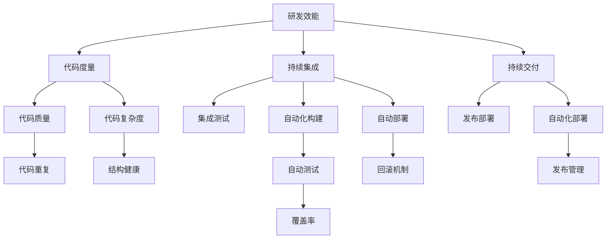

                 

# 研发效能度量与提升策略探讨

> 关键词：研发效能, 代码度量, 持续集成, 持续交付, 自动化测试, DevOps

## 1. 背景介绍

### 1.1 问题由来
在当今数字化、信息化快速发展的时代，软件开发项目规模日益增大，企业对软件质量、交付速度和市场响应能力的要求也在不断提高。传统的瀑布式开发模式已经不能满足企业日益增长的需求，敏捷开发、DevOps等现代软件工程方法应运而生。

研发效能（Development Efficiency），作为衡量软件开发团队生产力、交付速度、产品质量等综合指标，对企业竞争力有着重要影响。然而，研发效能评估与提升仍然面临诸多挑战，如度量指标选取不当、度量结果理解不清、提升策略针对性不足等。

### 1.2 问题核心关键点
本论文聚焦于研发效能的度量与提升，重点在于：
1. 如何构建科学的研发效能度量体系，确保度量指标全面覆盖关键领域。
2. 如何基于度量结果发现问题、分析原因，提供针对性改进策略。
3. 如何利用DevOps工具链，实现代码、测试、交付全链条的自动化，提升整体研发效能。

### 1.3 问题研究意义
研发效能度量与提升对企业有以下重要意义：

1. 提升交付速度与质量。通过精细化度量，识别关键瓶颈，提升开发与交付效率。
2. 降低开发成本。精简不必要的活动，提高资源利用率，减少项目延迟风险。
3. 优化团队协作。实现跨团队协作与信息共享，提升团队整体协作效率。
4. 强化市场响应能力。快速适应市场变化，缩短产品上市周期。
5. 推动技术创新。基于度量反馈持续改进，促进技术积累与创新。

## 2. 核心概念与联系

### 2.1 核心概念概述

为更好地理解研发效能的度量与提升，本节将介绍几个密切相关的核心概念：

- 研发效能（Development Efficiency）：衡量软件开发团队生产力、交付速度、产品质量等的综合指标。包括代码度量、测试度量、交付度量、团队协作度量等。

- 代码度量（Code Metrics）：通过统计代码行数、代码复杂度、代码重复度等指标，评估代码质量和结构健康性。

- 持续集成（Continuous Integration, CI）：自动化地将代码合并到主分支，集成测试，并报告错误，确保代码质量。

- 持续交付（Continuous Delivery, CD）：自动化地将软件发布到生产环境，保证发布稳定性和可靠。

- DevOps：软件开发与运维团队协作的文化与实践，强调自动化、持续集成、持续交付，提升软件交付速度与质量。

这些核心概念之间的逻辑关系可以通过以下Mermaid流程图来展示：



这个流程图展示了几大核心概念之间的关联：

1. 研发效能包含代码度量、持续集成、持续交付等多个方面。
2. 代码度量主要关注代码质量、复杂度、重复度等，是提升开发效率的基础。
3. 持续集成通过自动化构建和测试，确保代码质量，是代码度量的重要保障。
4. 持续交付通过自动化部署，实现快速交付，是研发效能的重要体现。
5. DevOps强调自动化和持续集成、持续交付，是实现高研发效能的必要条件。

这些概念共同构成了现代软件开发效能的核心框架，帮助企业在软件开发过程中提升效率、降低成本、优化质量。

## 3. 核心算法原理 & 具体操作步骤

### 3.1 算法原理概述

研发效能的度量与提升，本质上是一个数据驱动、持续改进的过程。其核心思想是：通过收集和分析软件开发过程中的各项关键数据，识别瓶颈、优化流程、提升效率。

形式化地，假设软件开发过程中有若干关键活动，记为 $A=\{a_1,a_2,\cdots,a_n\}$，其中每个活动 $a_i$ 的耗时与质量分别为 $T_i,Q_i$。研发效能的度量函数为 $\eta(A)$，可以定义为：

$$
\eta(A) = \frac{1}{n} \sum_{i=1}^n \frac{Q_i}{T_i}
$$

其中 $\eta(A)$ 表示整体研发效能，$Q_i$ 表示活动 $a_i$ 的质量，$T_i$ 表示活动 $a_i$ 的耗时。通过最大化 $\eta(A)$，可以最大化整体研发效能。

### 3.2 算法步骤详解

研发效能的度量与提升一般包括以下几个关键步骤：

**Step 1: 选择度量指标**
- 根据具体需求，选择合适的度量指标。包括代码度量、测试度量、交付度量、协作度量等。
- 确保度量指标全面覆盖关键领域，如代码行数、测试覆盖率、发布周期、代码质量等。

**Step 2: 数据收集与整理**
- 通过工具链（如SonarQube、Jenkins、Jira等）收集代码、测试、交付等数据。
- 对数据进行清洗、整理，去除异常值，确保数据质量。

**Step 3: 数据度量与分析**
- 根据选定的度量指标，进行数据度量。计算平均代码行数、代码复杂度、测试覆盖率等。
- 应用统计学方法，进行数据分布、相关性、回归等分析，发现潜在问题。

**Step 4: 生成报告与优化策略**
- 将度量结果生成可视化的报告，直观展示整体和局部情况。
- 基于分析结果，制定优化策略，如代码重构、自动化测试、持续集成等。

**Step 5: 实施改进与评估效果**
- 根据优化策略，进行实施。通过代码审查、技术改进、流程优化等手段，提升研发效能。
- 定期评估改进效果，继续优化。

### 3.3 算法优缺点

研发效能的度量与提升方法具有以下优点：
1. 数据驱动。通过客观数据支持决策，减少主观偏差。
2. 系统化改进。通过全面度量、分析、改进，实现系统性提升。
3. 持续改进。通过定期评估和优化，保持持续改进。

同时，该方法也存在一定的局限性：
1. 数据获取难度大。度量依赖工具链和持续集成的成熟度，需要较好的基础设施支持。
2. 数据质量影响结果。数据清洗、整理不充分，可能导致度量结果失真。
3. 结果解释困难。复杂的数据关系和业务背景可能导致结果理解困难。
4. 改进策略局限性。基于静态数据改进，可能无法应对动态变化的业务需求。

尽管存在这些局限性，但就目前而言，基于数据驱动的研发效能度量与提升方法仍是最主流的范式。未来相关研究的重点在于如何进一步提升数据获取的便捷性、提升数据质量、增强结果可解释性、拓展改进策略的灵活性。

### 3.4 算法应用领域

研发效能度量与提升方法已经在软件开发、产品上线、团队协作等多个领域得到广泛应用，为提升软件开发效能提供了有力支持。

- 软件开发效能：通过度量代码质量、测试覆盖率、交付速度等指标，识别瓶颈，优化开发流程，提升开发效率。
- 产品上线效能：通过度量发布频率、发布周期、回滚成功率等指标，提升产品上线速度和稳定性。
- 团队协作效能：通过度量任务完成率、任务依赖关系、沟通效率等指标，提升团队协作效率和信息共享。

此外，在金融科技、互联网、制造业等众多行业，研发效能度量与提升技术也在不断得到应用，为提升企业竞争力提供新的动力。

## 4. 数学模型和公式 & 详细讲解 & 举例说明

### 4.1 数学模型构建

本节将使用数学语言对研发效能的度量与提升过程进行更加严格的刻画。

记软件开发过程中的关键活动为 $A=\{a_1,a_2,\cdots,a_n\}$，其中每个活动 $a_i$ 的耗时与质量分别为 $T_i,Q_i$。研发效能的度量函数为 $\eta(A)$，可以定义为：

$$
\eta(A) = \frac{1}{n} \sum_{i=1}^n \frac{Q_i}{T_i}
$$

其中 $\eta(A)$ 表示整体研发效能，$Q_i$ 表示活动 $a_i$ 的质量，$T_i$ 表示活动 $a_i$ 的耗时。

### 4.2 公式推导过程

以下我们以代码行数和测试覆盖率为例，推导度量函数的计算公式。

假设软件开发过程中有 $n$ 个关键活动，每个活动的代码行数和测试覆盖率分别为 $L_i,C_i$。则整体代码行数和测试覆盖率分别为：

$$
L = \frac{1}{n} \sum_{i=1}^n L_i
$$

$$
C = \frac{1}{n} \sum_{i=1}^n C_i
$$

根据度量函数的定义，整体研发效能可以进一步推导为：

$$
\eta(A) = \frac{C}{L}
$$

在实际应用中，上述公式可以根据具体度量指标进行调整，如考虑每个活动的重要性和依赖关系，采用加权平均法：

$$
\eta(A) = \frac{\sum_{i=1}^n w_i \frac{Q_i}{T_i}}{\sum_{i=1}^n w_i T_i}
$$

其中 $w_i$ 为活动 $a_i$ 的重要性权重。

### 4.3 案例分析与讲解

假设某软件开发团队有四个关键活动 $a_1,a_2,a_3,a_4$，每个活动的耗时和质量数据如表所示：

| 活动编号 | 耗时（天） | 质量得分（分） | 代码行数（行） | 测试覆盖率（%） |
| --- | --- | --- | --- | --- |
| $a_1$ | 5 | 90 | 1000 | 70 |
| $a_2$ | 10 | 80 | 2000 | 80 |
| $a_3$ | 8 | 95 | 1500 | 60 |
| $a_4$ | 7 | 85 | 1800 | 65 |

假设活动的重要性权重分别为 $w_1=w_3=0.5, w_2=w_4=0.25$，则整体研发效能可以计算为：

$$
\eta(A) = \frac{0.5 \times \frac{90}{5} + 0.25 \times \frac{80}{10} + 0.5 \times \frac{95}{8} + 0.25 \times \frac{85}{7}}{0.5 \times 5 + 0.25 \times 10 + 0.5 \times 8 + 0.25 \times 7} = \frac{77.5}{26.75} \approx 2.90
$$

这意味着该团队的平均研发效能为约2.90，即每行代码的质量对时间的贡献比为2.90。

## 5. 项目实践：代码实例和详细解释说明

### 5.1 开发环境搭建

在进行研发效能度量与提升实践前，我们需要准备好开发环境。以下是使用Jenkins进行持续集成的环境配置流程：

1. 安装Jenkins：从官网下载并安装Jenkins，用于自动化集成测试和发布。
2. 安装必要的插件：如Jira plugin、SonarQube plugin、Github plugin等，方便数据收集与集成。
3. 配置GIT仓库：将代码仓库配置为Jenkins访问权限，实现代码自动推送与拉取。

完成上述步骤后，即可在Jenkins平台上进行持续集成和测试。

### 5.2 源代码详细实现

下面我们以DevOps集成实践为例，给出使用Jenkins对代码进行持续集成和测试的Jenkinsfile代码实现。

```groovy
pipeline {
    agent any
    stages {
        stage('Build') {
            steps {
                withGithub {
                    credentials 'github-ci',
                    script {
                        def git = new WithGithub(Git).wrap([
                            username: "your-username",
                            password: "your-token"
                        ])
                        git.browse("my-repo")
                        git.pull()
                    }
                }
                sh 'mvn install'
            }
        }
        stage('Test') {
            steps {
                withSonarQube {
                    credentials 'sonarQube',
                    script {
                        def sonar = new WithSonarQube(SonarQube).wrap([
                            url: "your-sonar-url",
                            username: "your-sonar-username",
                            password: "your-sonar-password"
                        ])
                        sonarQube.setVersion()
                        sonarQube.start()
                        sonarQube.stop()
                    }
                }
                sh 'mvn test'
            }
        }
        stage('Report') {
            steps {
                withSonarQube {
                    script {
                        def sonar = new WithSonarQube(SonarQube).wrap([
                            url: "your-sonar-url",
                            username: "your-sonar-username",
                            password: "your-sonar-password"
                        ])
                        sonarQube.setVersion()
                        sonarQube.start()
                        sonarQube.stop()
                    }
                }
                sh 'mvn site:generate-reports'
            }
        }
    }
}
```

这个Jenkinsfile实现了Jenkins对代码的自动构建、测试和报告，实现了持续集成的核心功能。

### 5.3 代码解读与分析

让我们再详细解读一下关键代码的实现细节：

**Jenkinsfile类**：
- 定义了整个持续集成过程，包含Build、Test、Report三个阶段。

**withGithub脚本块**：
- 使用WithGithub插件，获取GitHub上的代码仓库，实现代码的自动拉取。

**withSonarQube脚本块**：
- 使用WithSonarQube插件，与SonarQube平台集成，实现代码质量度量。

**mvn命令**：
- 使用Maven工具进行代码构建和测试，实现自动化编译和单元测试。

**mvn site命令**：
- 使用Maven site插件生成项目报告，方便后续分析与展示。

**Jenkins控制台**：
- 实时记录每次集成过程中的日志，方便调试和问题排查。

通过上述Jenkinsfile代码实现，可以实现一个完整的持续集成过程。Jenkins提供了丰富的插件和扩展功能，可以进一步扩展集成场景和功能，实现更加灵活和复杂的自动化流程。

## 6. 实际应用场景

### 6.1 软件开发企业

研发效能度量与提升在软件开发企业中得到了广泛应用。通过持续集成和持续交付，企业可以实现快速迭代开发，提升交付速度与质量。具体应用场景包括：

- 构建自动化的CI/CD管道，实现代码构建、测试、部署的自动化。
- 引入JIRA、Confluence等协作工具，提升团队协作效率。
- 应用SonarQube、Jenkins、Github等工具，实时监控代码质量，发现潜在问题。

### 6.2 金融科技公司

金融科技公司需要应对快速变化的金融市场，提升产品上线速度与稳定性。研发效能度量与提升方法可以在以下方面发挥作用：

- 利用CI/CD管道，实现高频次的产品迭代与发布。
- 应用监控工具（如Prometheus、Grafana），实时监控系统性能与稳定性。
- 引入自动化测试（如Selenium、JMeter），确保发布稳定性与安全性。

### 6.3 制造业企业

制造业企业对软件系统的可靠性和稳定性有更高要求，研发效能度量与提升可以提升软件开发的质量与效率。具体应用场景包括：

- 引入DevOps文化与实践，实现自动化测试与部署。
- 应用容器化技术（如Docker、Kubernetes），提高部署效率与可移植性。
- 引入持续集成与持续交付（CI/CD），实现快速迭代与发布。

## 7. 工具和资源推荐

### 7.1 学习资源推荐

为了帮助开发者系统掌握研发效能的度量与提升理论基础和实践技巧，这里推荐一些优质的学习资源：

1. 《DevOps实践指南》：详细介绍DevOps理念与实践，涵盖持续集成、持续交付、自动化测试等关键技术。

2. 《Jenkins官方文档》：全面介绍Jenkins的安装、配置与使用，涵盖丰富的插件和扩展功能。

3. 《SonarQube官方文档》：详细介绍SonarQube的质量管理与代码度量功能，提供丰富的示例和最佳实践。

4. 《CI/CD最佳实践》：详细介绍CI/CD的构建与部署流程，提供实用的案例和工具推荐。

5. 《DevOps技术专栏》：从多个维度探讨DevOps文化与实践，提供深入的理论与实践指导。

通过对这些资源的学习实践，相信你一定能够快速掌握研发效能度量的精髓，并用于解决实际的开发问题。

### 7.2 开发工具推荐

高效的开发离不开优秀的工具支持。以下是几款用于研发效能度量与提升开发的常用工具：

1. Jenkins：开源持续集成工具，支持丰富的插件与扩展，实现自动化构建、测试、部署。

2. SonarQube：开源代码质量度量工具，提供全面的代码分析与度量功能。

3. GitLab：开源代码托管平台，支持持续集成、持续交付、自动化测试等功能。

4. JIRA：开源协作工具，支持任务管理、缺陷跟踪、团队协作等功能。

5. Docker：开源容器化技术，提供轻量级、可移植的运行环境。

6. Kubernetes：开源容器编排工具，提供自动化部署、负载均衡等功能。

合理利用这些工具，可以显著提升研发效能度量的开发效率，加快创新迭代的步伐。

### 7.3 相关论文推荐

研发效能度量与提升技术的发展源于学界的持续研究。以下是几篇奠基性的相关论文，推荐阅读：

1. "Continuous Integration: A Practical Model for Introducing New Software Technology"（Continuous Integration论文）：提出持续集成概念，阐述其对软件开发的重要性。

2. "Towards Agile and Lean Software Development"（敏捷与精益软件开发论文）：探讨敏捷开发、精益管理对提升研发效能的意义。

3. "Engineering a Production-Grade DevOps Culture"（DevOps文化工程论文）：详细探讨DevOps文化与实践，提供实际应用的案例与建议。

4. "Software Quality Engineering: A Tester's Guide"（软件质量工程指南）：提供全面的软件质量管理与度量方法，涵盖测试、度量、持续集成等关键技术。

这些论文代表了大研发效能度量与提升技术的发展脉络。通过学习这些前沿成果，可以帮助研究者把握学科前进方向，激发更多的创新灵感。

## 8. 总结：未来发展趋势与挑战

### 8.1 总结

本文对研发效能的度量与提升方法进行了全面系统的介绍。首先阐述了研发效能的核心理念和应用意义，明确了度量与提升在提升开发效率、降低开发成本、优化团队协作等方面的重要价值。其次，从原理到实践，详细讲解了研发效能的度量函数构建和具体步骤，提供了完整的代码实现实例。同时，本文还广泛探讨了研发效能在软件开发、金融科技、制造业等众多领域的应用前景，展示了其广阔的应用潜力。最后，精选了研发效能度量的各类学习资源，力求为读者提供全方位的技术指引。

通过本文的系统梳理，可以看到，研发效能度量与提升方法已经成为现代软件开发的重要手段，极大地提升了企业的研发效率和市场响应能力。未来，伴随DevOps文化与技术的不断发展，研发效能度量与提升技术必将持续演进，进一步推动软件开发模式向敏捷、自动化、持续交付等方向发展。

### 8.2 未来发展趋势

展望未来，研发效能度量与提升技术将呈现以下几个发展趋势：

1. 自动化与智能化。未来将进一步提升工具链的自动化与智能化水平，实现端到端的自动化流程。

2. 实时监控与反馈。引入实时监控和反馈机制，实现动态调整和持续改进。

3. 跨团队协作。推动不同团队之间的信息共享与协作，提升整体研发效能。

4. 零停机部署。引入容器化与编排技术，实现零停机部署，提高部署稳定性。

5. 持续学习与优化。引入机器学习与数据挖掘技术，动态优化研发效能指标。

6. 安全与合规。提升代码与系统的安全性与合规性，保障数据与系统安全。

以上趋势凸显了研发效能度量与提升技术的广阔前景。这些方向的探索发展，必将进一步提升软件开发企业的效率、质量和市场响应能力，推动企业向数字化、智能化方向迈进。

### 8.3 面临的挑战

尽管研发效能度量与提升技术已经取得了显著进展，但在迈向更加智能化、普适化应用的过程中，它仍面临着诸多挑战：

1. 数据质量问题。工具链和集成过程中产生的大量数据可能存在噪声、缺失等问题，影响度量结果的准确性。

2. 复杂度挑战。不同工具链和平台的集成与协同，增加了度量与提升的复杂度，可能带来兼容性问题。

3. 文化转变难度。引入DevOps文化与实践需要跨部门协作，涉及到组织架构、流程、文化等多方面的转变。

4. 资源投入高。自动化与智能化工具链的部署、维护需要较高的人力和物力投入。

5. 安全与隐私问题。数据隐私和安全问题日益突出，如何平衡开发效能与数据安全成为重要课题。

6. 性能瓶颈。工具链和系统的性能瓶颈可能影响自动化流程的流畅性。

正视研发效能度量与提升面临的这些挑战，积极应对并寻求突破，将是大规模软件开发体系迈向成熟的必由之路。相信随着学界和产业界的共同努力，这些挑战终将一一被克服，研发效能度量与提升技术必将在构建高效率、高质量、高安全性的软件系统中发挥更大作用。

### 8.4 未来突破

面对研发效能度量与提升技术所面临的种种挑战，未来的研究需要在以下几个方面寻求新的突破：

1. 引入数据治理机制。构建数据质量管理体系，提升数据治理能力，确保数据质量。

2. 优化工具链与平台。设计更加高效、易用的工具链与平台，降低集成复杂度。

3. 推动跨部门协作。加强跨部门沟通与协作，构建统一的度量与提升标准。

4. 引入智能化技术。引入机器学习、大数据分析等智能化技术，实现自动优化。

5. 提升安全与合规性。建立安全与合规性管理体系，保障数据安全与系统合规。

6. 优化资源配置。合理配置资源，提高工具链与系统的效率与性能。

这些研究方向的探索，必将引领研发效能度量与提升技术迈向更高的台阶，为构建高效率、高质量、高安全性的软件系统铺平道路。面向未来，研发效能度量与提升技术还需要与其他技术进行更深入的融合，如知识管理、自动化运维、人工智能等，多路径协同发力，共同推动软件开发模式的进步。只有勇于创新、敢于突破，才能不断拓展研发效能的边界，让软件开发模式在更加复杂、多变的业务环境中发挥更大的价值。

## 9. 附录：常见问题与解答

**Q1：如何构建科学的研发效能度量体系？**

A: 构建科学的研发效能度量体系，应遵循以下原则：
1. 全面覆盖。度量指标应全面覆盖关键领域，如代码质量、测试覆盖率、交付周期、团队协作等。
2. 合理权重。根据活动的重要性和依赖关系，合理设置权重，反映不同活动的贡献。
3. 实时动态。定期更新度量数据，实现实时监控与反馈。

**Q2：如何在微服务架构中提升研发效能？**

A: 在微服务架构中，提升研发效能需要从以下几个方面入手：
1. 服务分解。合理分解服务，减少跨服务依赖，提高系统可维护性。
2. 自动化部署。引入自动化部署工具，如Kubernetes，实现快速部署与回滚。
3. 监控告警。引入实时监控与告警机制，及时发现和解决问题。
4. 版本控制。采用分布式版本控制工具，如Git，实现高效的软件变更管理。

**Q3：如何提升团队协作效能？**

A: 提升团队协作效能需要从以下几个方面入手：
1. 统一协作工具。引入统一的协作工具，如JIRA、Confluence，实现信息共享与协作。
2. 明确任务分工。通过任务分配与进度跟踪，明确任务分工与责任。
3. 定期沟通。定期举行团队会议，沟通进展与问题，确保信息透明。

**Q4：如何优化持续集成流程？**

A: 优化持续集成流程需要从以下几个方面入手：
1. 自动化测试。引入自动化测试工具，如Selenium、JMeter，提高测试效率与覆盖率。
2. 快速反馈。引入持续集成工具，如Jenkins，实现快速构建与测试反馈。
3. 静态分析。引入静态分析工具，如SonarQube，实现代码质量初步评估。

通过合理应用这些技术和方法，可以有效提升团队的协作效率和软件开发的整体研发效能。

---

作者：禅与计算机程序设计艺术 / Zen and the Art of Computer Programming

