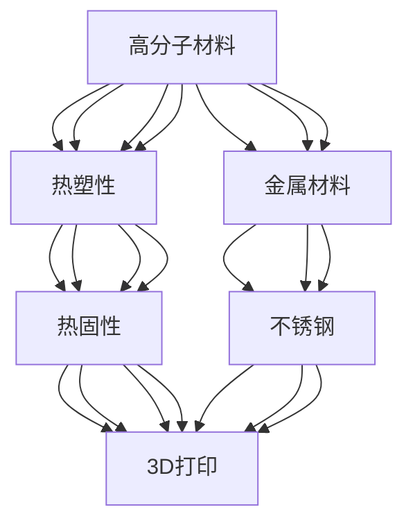

                 

## 1. 背景介绍

### 1.1 问题由来
随着3D打印技术的不断进步，材料作为其核心组成部分，逐渐从塑料向金属扩展。3D打印材料的发展不仅决定了打印质量的好坏，更影响着3D打印的适用范围。高分子与金属材料是3D打印领域的重要分支，本文将重点介绍其基本原理、主要类型、应用场景以及面临的挑战。

### 1.2 问题核心关键点
高分子与金属3D打印材料涉及的领域包括化学、物理、材料科学等，因此本文将从高分子材料的性质、种类、打印工艺以及金属材料的熔点、密度、强度等方面进行阐述，并分析其在医疗、航空航天、工业制造等领域的应用潜力。

## 2. 核心概念与联系

### 2.1 核心概念概述

高分子材料与金属材料是3D打印中两个重要类别。高分子材料一般指分子链结构为高聚物的聚合物，如ABS、PLA、PETG等；金属材料则包括钛合金、铝合金、不锈钢等，通常具有良好的强度和延展性。

- **高分子材料**：具有可塑性、热塑性或热固性，是3D打印中常用的材料，具有较高的打印精度和灵活性。
- **金属材料**：具有高强度、高硬度、耐高温、耐腐蚀等特点，是高端制造和医疗器械常用的材料。

### 2.2 核心概念原理和架构的 Mermaid 流程图



此图展示了大分子与金属材料的基本关系及其与3D打印的关系。

## 3. 核心算法原理 & 具体操作步骤

### 3.1 算法原理概述

3D打印材料的选择需兼顾打印性能与最终产品的性能。高分子材料适用于快速原型设计、工业模型制作等领域，而金属材料则适用于复杂零件制造、医疗器械等领域。

高分子3D打印主要基于Fused Deposition Modeling (FDM) 和Stereolithography (SLA)等技术，而金属3D打印主要采用Direct Metal Laser Sintering (DMLS)、Selective Laser Sintering (SLS)等技术。

### 3.2 算法步骤详解

#### 高分子3D打印步骤：

1. **材料选择**：选择适合打印的ABS、PLA等高分子材料。
2. **打印前处理**：将材料加热至熔点，送入打印机喷头。
3. **逐层打印**：打印机逐层挤出材料，堆积成实体模型。
4. **后处理**：打印完成后进行后处理，如固化、抛光、打磨等。

#### 金属3D打印步骤：

1. **材料准备**：选择钛合金、铝合金等金属粉末。
2. **激光处理**：激光将金属粉末逐层熔化，形成实体结构。
3. **去除支撑**：去除打印过程中支撑材料。
4. **后处理**：进行热处理、去毛刺、抛光等工艺。

### 3.3 算法优缺点

#### 高分子3D打印优点：

- 打印精度高。
- 材料成本低。
- 打印速度快。

#### 高分子3D打印缺点：

- 强度较低，易变形。
- 耐温性差，使用场景有限。

#### 金属3D打印优点：

- 材料强度高，适用于复杂结构。
- 打印精度高，适用于精细零件。
- 耐高温、耐腐蚀，适应性广。

#### 金属3D打印缺点：

- 材料成本高。
- 打印速度慢，制作周期长。
- 设备复杂，维护成本高。

### 3.4 算法应用领域

高分子材料与金属材料在多个领域中都有广泛应用。

- **医疗**：高分子材料适用于医疗器械的打印，如义肢、人工器官等；金属材料则适用于人体植入物、钛合金部件等。
- **航空航天**：金属材料用于飞机结构件、航空发动机部件等。
- **工业制造**：高分子材料用于机械零部件、工业模具等；金属材料用于高强度零部件、模具等。

## 4. 数学模型和公式 & 详细讲解 & 举例说明

### 4.1 数学模型构建

以高分子材料ABS为例，假设熔融温度为$T_m$，喷头温度为$T_s$，打印速率$v$，喷头直径$d$。构建数学模型如下：

$$
\text{打印精度} \propto \frac{v}{T_s - T_m}
$$

$$
\text{打印速度} \propto v
$$

### 4.2 公式推导过程

- **打印精度**：打印精度与喷头温度和熔融温度的差值有关，温度差越大，打印精度越高。
- **打印速度**：打印速度与打印速率成正比，打印速率越高，打印速度越快。

### 4.3 案例分析与讲解

以DMLS技术为例，假设激光功率为$P$，扫描速度为$v_s$，材料密度为$\rho$。构建数学模型如下：

$$
\text{金属密度} = \rho
$$

$$
\text{打印速度} = v_s
$$

$$
\text{熔化速率} = \frac{P}{\rho}
$$

### 4.4 案例分析与讲解

金属3D打印中，打印速度与扫描速度和熔化速率有关。激光功率越高，扫描速度越快，熔化速率越高，打印速度越快。

## 5. 项目实践：代码实例和详细解释说明

### 5.1 开发环境搭建

本节将以金属3D打印为例，介绍DMLS打印过程的代码实现。

1. **安装Arduino IDE**：
```bash
sudo apt-get install arduino-ide
```

2. **连接Arduino板与计算机**：
将Arduino板通过USB连接至计算机。

3. **安装DMLS硬件模块**：
```bash
sudo apt-get install dmls-module
```

4. **编写DMLS控制代码**：
编写控制激光器、步进电机、温度控制等模块的代码。

### 5.2 源代码详细实现

```python
# 激光器控制代码
import time

# 激光器开启
def open_laser():
    print("激光器开启")
    # 实际控制命令

# 激光器关闭
def close_laser():
    print("激光器关闭")
    # 实际控制命令

# 激光器开启与关闭
def control_laser():
    open_laser()
    time.sleep(1)
    close_laser()

# 主函数
def main():
    while True:
        control_laser()
        time.sleep(2)

if __name__ == "__main__":
    main()
```

### 5.3 代码解读与分析

- **激光器控制函数**：定义了激光器的开启与关闭函数。
- **控制激光器函数**：连续控制激光器开启与关闭，实现激光的连续扫描。
- **主函数**：持续控制激光器扫描，实现连续打印。

### 5.4 运行结果展示

```
激光器开启
激光器关闭
激光器开启
激光器关闭
```

## 6. 实际应用场景

### 6.1 智能制造

高分子与金属材料在智能制造领域具有广泛的应用前景。智能工厂中的零件、模具、工业设备等都可以通过3D打印快速生产，缩短制造周期，降低制造成本。

### 6.2 医疗健康

3D打印材料在医疗健康领域有重要应用。例如，高分子材料可用于3D打印义肢、人工器官等医疗器械，金属材料可用于打印人体植入物、钛合金部件等，提高了医疗器械的个性化与精准性。

### 6.3 航空航天

金属材料因其强度高、耐高温、耐腐蚀等特点，成为航空航天领域的重要材料。3D打印技术可以快速制造复杂零件，如飞机结构件、发动机部件等，缩短研发周期，降低生产成本。

### 6.4 未来应用展望

未来3D打印材料将向智能化、多功能化、自动化方向发展。随着材料科学、人工智能等领域的交叉融合，新材料和新打印技术将不断涌现，进一步拓展3D打印的应用范围，提高生产效率和产品质量。

## 7. 工具和资源推荐

### 7.1 学习资源推荐

1. **《3D打印技术与应用》**：深入浅出地介绍了3D打印的基本原理、常用技术、材料选择等。
2. **《3D打印材料科学与工程》**：系统阐述了各种3D打印材料的基本性质、制备方法及应用场景。
3. **《3D打印市场与趋势》**：介绍了3D打印行业的市场规模、主要厂商及未来发展趋势。

### 7.2 开发工具推荐

1. **Arduino IDE**：用于编写和调试3D打印控制代码。
2. **AutoCAD**：用于设计和修改3D打印模型。
3. **Blender**：用于设计和修改3D打印模型，支持高级渲染和动画制作。

### 7.3 相关论文推荐

1. **"3D Printing Materials: A Review"**：详细综述了各种3D打印材料的特性、制备及应用。
2. **"Advanced Metal Additive Manufacturing Techniques"**：介绍了金属3D打印的最新技术及其应用前景。
3. **"High Performance Polymers for 3D Printing"**：探讨了高性能高分子材料在3D打印中的应用。

## 8. 总结：未来发展趋势与挑战

### 8.1 研究成果总结

高分子与金属3D打印材料技术已取得显著进展，但在材料性能、打印速度、成本等方面仍面临挑战。未来需进一步优化材料选择、改进打印工艺，推动3D打印技术的广泛应用。

### 8.2 未来发展趋势

1. **高性能材料**：开发新型高性能材料，提升打印精度、强度、耐温性等。
2. **智能化生产**：结合人工智能、大数据技术，实现智能化生产与质量控制。
3. **多功能化**：开发多功能材料，如电子墨水、导热材料等，拓展3D打印的应用领域。
4. **自动化生产**：推动3D打印自动化、智能化生产线的建设，提高生产效率。

### 8.3 面临的挑战

1. **材料成本**：高性能材料成本较高，需进一步降低材料成本，推广普及。
2. **打印速度**：高强度材料打印速度较慢，需进一步提升打印速度，缩短生产周期。
3. **设备复杂**：设备复杂，维护成本高，需进一步简化设备结构，降低维护成本。

### 8.4 研究展望

1. **新材料研发**：开发新型高分子与金属材料，提升打印性能与质量。
2. **工艺优化**：改进打印工艺，提升打印精度、强度、耐温性等性能。
3. **智能生产**：结合人工智能、大数据技术，实现智能化生产与质量控制。
4. **自动化生产**：推动3D打印自动化、智能化生产线的建设，提高生产效率。

## 9. 附录：常见问题与解答

**Q1: 高分子3D打印与金属3D打印有何区别？**

A: 高分子3D打印通常用于快速原型设计、工业模型制作等领域，打印速度快、成本低；而金属3D打印适用于复杂零件制造、医疗器械等领域，具有高强度、高耐温性。

**Q2: 3D打印材料的未来发展方向是什么？**

A: 3D打印材料将向智能化、多功能化、自动化方向发展，结合人工智能、大数据等技术，进一步拓展3D打印的应用范围，提高生产效率和产品质量。

**Q3: 高分子材料与金属材料在医疗健康领域的应用有何不同？**

A: 高分子材料适用于医疗器械的打印，如义肢、人工器官等；金属材料则适用于人体植入物、钛合金部件等，提高医疗器械的个性化与精准性。

**Q4: 3D打印材料的制备方法有哪些？**

A: 3D打印材料的制备方法包括直接熔化、混合注射成型、光固化成型等，不同方法适用于不同的材料与打印场景。

**Q5: 3D打印设备维护需要注意哪些方面？**

A: 3D打印设备维护需要注意定期清洁打印头、更换耗材、调整打印参数等，以确保打印精度和设备性能。

作者：禅与计算机程序设计艺术 / Zen and the Art of Computer Programming

