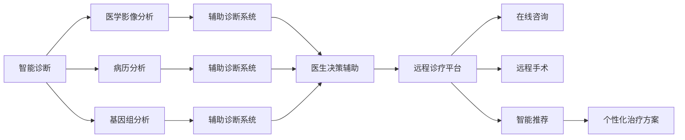

                 

## 1. 背景介绍

### 1.1 问题由来
随着互联网技术的迅猛发展，医疗健康领域正经历一场深刻的数字化革命。智能诊断与远程医疗技术，将医疗资源普惠化、医疗服务便捷化推向新的高度。硅谷，作为全球科技创新中心，始终引领着人工智能技术在医疗健康领域的应用探索。

近年来，得益于大数据、深度学习、计算机视觉等技术突破，智能诊断系统在医学影像分析、病理学诊断、基因组分析等方向上取得了显著进展。远程医疗技术则通过在线咨询、远程手术、智能推荐系统等手段，改善了医疗资源分配不均的现状，尤其在偏远和欠发达地区显示出巨大潜力。

然而，硅谷的这些高科技方案在实际应用中，仍然面临着诸如隐私保护、技术落地、政策法规等诸多挑战。解决这些挑战，不仅需要技术上的创新，还需要行业、法律、伦理等多方共同努力。

### 1.2 问题核心关键点
本节将详细介绍硅谷医疗健康领域的核心技术：智能诊断与远程医疗。首先明确这些技术的定义，阐述其核心算法，再探讨其应用前景与面临的挑战。

1. **智能诊断**：利用人工智能技术对医学影像、病历、基因组等数据进行分析，辅助医生进行精准诊断。主要算法包括卷积神经网络(CNN)、循环神经网络(RNN)、长短时记忆网络(LSTM)、生成对抗网络(GAN)等。
2. **远程医疗**：通过网络平台提供远程诊疗服务，包括在线诊断、远程监控、远程手术、智能推荐等。主要技术包括自然语言处理(NLP)、计算机视觉、机器学习等。

## 2. 核心概念与联系

### 2.1 核心概念概述

硅谷医疗健康领域的智能诊断与远程医疗，核心概念包括：

- **智能诊断**：利用深度学习技术对医学数据进行自动分析和辅助诊断，减少医生的工作负担，提高诊断的精准度和效率。
- **远程医疗**：通过网络平台提供远程诊疗服务，打破地域限制，让优质医疗资源可及更多人，提升医疗服务的可及性和便捷性。

这些概念之间具有紧密联系，智能诊断为远程医疗提供了技术支持，远程医疗则为智能诊断提供了更多数据来源和应用场景。二者共同推动了医疗服务的数字化和智能化转型。

### 2.2 核心概念原理和架构的 Mermaid 流程图



该图展示了智能诊断和远程医疗的关键技术流程：

1. 医学影像、病历、基因组数据通过智能诊断系统进行分析和处理。
2. 辅助诊断系统根据分析结果，辅助医生做出诊断决策。
3. 医生通过远程诊疗平台，为患者提供远程诊疗服务。
4. 远程诊疗平台包括在线咨询、远程手术、智能推荐等功能，实现个性化治疗方案的生成和执行。

## 3. 核心算法原理 & 具体操作步骤

### 3.1 算法原理概述

硅谷医疗健康领域的智能诊断与远程医疗，主要算法包括深度学习、自然语言处理、计算机视觉等。这些技术通过海量数据的训练，学习到医学数据的特征和模式，实现自动分析和智能推荐。

#### 3.1.1 深度学习
深度学习是智能诊断与远程医疗的核心技术，主要包括卷积神经网络(CNN)、循环神经网络(RNN)、长短时记忆网络(LSTM)、生成对抗网络(GAN)等。深度学习通过多层非线性变换，提取医学数据的复杂特征，提高诊断的准确性。

#### 3.1.2 自然语言处理(NLP)
自然语言处理技术主要用于医疗文本分析，包括病历分析、医嘱理解、智能问答等。通过词嵌入、注意力机制、预训练模型等技术，NLP能够理解医学术语和文本的语义，提取关键信息。

#### 3.1.3 计算机视觉
计算机视觉技术在医学影像分析中应用广泛，通过卷积神经网络(CNN)和深度学习模型，自动识别和分析医学影像中的病灶、病变等关键信息。

### 3.2 算法步骤详解

#### 3.2.1 数据收集与预处理

1. **数据收集**：收集医院、研究机构、保险公司等来源的医学数据，包括医学影像、病历、基因组数据等。
2. **数据预处理**：对数据进行清洗、标注、归一化处理，确保数据质量和一致性。

#### 3.2.2 模型训练与评估

1. **模型选择**：根据任务需求选择合适的深度学习模型，如CNN、RNN、LSTM、GAN等。
2. **模型训练**：使用训练数据集训练模型，调整超参数，优化损失函数。
3. **模型评估**：使用验证集评估模型性能，调整模型结构，确保模型的泛化能力。

#### 3.2.3 模型部署与应用

1. **模型部署**：将训练好的模型部署到远程诊疗平台或云端服务器，供用户使用。
2. **模型应用**：医生和患者通过平台进行远程诊疗，智能诊断系统实时辅助医生进行诊断，智能推荐系统提供个性化治疗方案。

### 3.3 算法优缺点

#### 3.3.1 优点

1. **提高诊断效率**：深度学习和大数据技术能够快速处理大量医学数据，辅助医生进行精准诊断。
2. **降低医疗成本**：远程医疗减少了患者就医的时间和交通成本，提升了医疗资源的利用效率。
3. **普惠医疗资源**：通过技术手段，让优质医疗资源可及更多人，缓解医疗资源不均的问题。
4. **提升服务质量**：智能诊断和推荐系统能够提供更个性化、精准的治疗方案，提升患者治疗效果。

#### 3.3.2 缺点

1. **数据隐私问题**：医学数据的隐私保护是重要难题，如何保障患者数据安全是一个挑战。
2. **算法鲁棒性**：深度学习模型对数据质量敏感，小样本数据或噪声数据可能导致误诊。
3. **政策法规限制**：远程医疗和智能诊断涉及法律和伦理问题，如电子病历的合法性、医生责任等。
4. **技术落地难度**：技术推广和应用普及需要高昂的开发和部署成本，中小企业难以负担。

### 3.4 算法应用领域

#### 3.4.1 医学影像分析

医学影像分析是智能诊断的主要应用方向之一，包括X光片、CT、MRI等影像数据的自动分析和诊断。常用的算法包括卷积神经网络(CNN)和深度学习模型。通过大量标注数据训练，模型能够自动检测病灶、病变等关键信息，辅助医生进行诊断。

#### 3.4.2 病历分析与医嘱理解

病历分析主要用于分析患者的历史病历，提取关键信息和诊断依据。医嘱理解则通过对医生手写医嘱的解析，生成电子医嘱，减少手写医嘱的错误。NLP技术在此领域得到了广泛应用。

#### 3.4.3 智能问答与诊断辅助

智能问答系统通过NLP技术，解答患者和医生的疑问，提供医学知识查询、症状分析等服务。诊断辅助系统则通过深度学习技术，实时分析患者的病情，提供诊断建议和方案。

#### 3.4.4 远程诊疗与智能推荐

远程诊疗平台通过网络平台提供远程诊疗服务，包括在线咨询、远程手术、智能推荐等。智能推荐系统根据患者的历史诊疗数据和病情，提供个性化的治疗方案和用药建议，提高治疗效果。

## 4. 数学模型和公式 & 详细讲解 & 举例说明

### 4.1 数学模型构建

#### 4.1.1 深度学习模型

假设有一个卷积神经网络(CNN)用于医学影像分析，输入为大小为$H\times W$的二维图像$X$，输出为$C$个类别中的概率分布$P$。模型的数学表达式如下：

$$
P = f(X; \theta)
$$

其中$f$为CNN的前向传播函数，$\theta$为模型参数。

#### 4.1.2 自然语言处理模型

假设有一个基于Transformer的NLP模型，输入为大小为$T$的词序列$X$，输出为每个词的隐藏表示$H$。模型的数学表达式如下：

$$
H = f(X; \theta)
$$

其中$f$为Transformer的前向传播函数，$\theta$为模型参数。

### 4.2 公式推导过程

#### 4.2.1 深度学习模型

以卷积神经网络(CNN)为例，其前向传播过程可以表示为：

$$
H = f(X; \theta) = g(W \ast X + b)
$$

其中$W$为卷积核，$b$为偏置项，$g$为激活函数。

#### 4.2.2 自然语言处理模型

以Transformer为例，其前向传播过程可以表示为：

$$
H = f(X; \theta) = \text{Attention}(Q, K, V) + \text{FFN}
$$

其中$\text{Attention}$表示注意力机制，$\text{FFN}$表示前馈神经网络。

### 4.3 案例分析与讲解

#### 4.3.1 医学影像分析案例

假设有一个包含1000张X光片的医学影像数据集，每张图片大小为$256\times 256$。使用CNN模型对图像进行分类，标签为正常或异常。训练数据集和验证数据集分别为500张和500张。

1. **数据预处理**：将图像进行归一化处理，标注数据集和验证数据集分别进行切分。
2. **模型训练**：使用随机梯度下降优化算法，调整学习率，训练模型。
3. **模型评估**：在验证数据集上评估模型性能，调整超参数，确保模型泛化能力。
4. **模型应用**：将训练好的模型部署到远程诊疗平台，实时分析新的X光片，提供诊断建议。

#### 4.3.2 NLP案例

假设有一个包含1000份病历的文本数据集，每份病历包含若干个句子。使用Transformer模型对病历进行分析，提取关键信息，生成电子病历。

1. **数据预处理**：对病历文本进行分词、标注、序列填充处理，确保数据一致性。
2. **模型训练**：使用随机梯度下降优化算法，调整学习率，训练模型。
3. **模型评估**：在验证数据集上评估模型性能，调整超参数，确保模型泛化能力。
4. **模型应用**：将训练好的模型部署到远程诊疗平台，实时解析新的病历文本，生成电子病历。

## 5. 项目实践：代码实例和详细解释说明

### 5.1 开发环境搭建

#### 5.1.1 软件环境

1. **Python**：安装Python 3.7及以上版本，作为开发环境。
2. **TensorFlow**：安装TensorFlow 2.0及以上版本，支持深度学习和模型训练。
3. **PyTorch**：安装PyTorch 1.7及以上版本，支持深度学习框架。
4. **NLTK**：安装NLTK自然语言处理库，用于文本处理。
5. **Scikit-learn**：安装Scikit-learn机器学习库，用于数据预处理和模型评估。

#### 5.1.2 硬件环境

1. **CPU**：至少需要2个CPU核心。
2. **GPU**：如果有条件，建议使用NVIDIA的GPU，加速深度学习模型的训练。

### 5.2 源代码详细实现

#### 5.2.1 医学影像分析

```python
import tensorflow as tf
from tensorflow.keras import layers

# 定义模型结构
model = tf.keras.Sequential([
    layers.Conv2D(32, (3, 3), activation='relu', input_shape=(256, 256, 1)),
    layers.MaxPooling2D((2, 2)),
    layers.Conv2D(64, (3, 3), activation='relu'),
    layers.MaxPooling2D((2, 2)),
    layers.Flatten(),
    layers.Dense(128, activation='relu'),
    layers.Dense(2, activation='softmax')
])

# 编译模型
model.compile(optimizer=tf.keras.optimizers.Adam(learning_rate=0.001),
              loss=tf.keras.losses.SparseCategoricalCrossentropy(from_logits=True),
              metrics=[tf.keras.metrics.SparseCategoricalAccuracy()])

# 训练模型
model.fit(x_train, y_train, epochs=10, batch_size=32, validation_data=(x_val, y_val))

# 评估模型
model.evaluate(x_test, y_test)

# 预测新数据
model.predict(new_image)
```

#### 5.2.2 NLP案例

```python
import tensorflow as tf
from transformers import TFAutoModelForMaskedLM, AutoTokenizer

# 加载预训练模型和分词器
model = TFAutoModelForMaskedLM.from_pretrained('bert-base-uncased')
tokenizer = AutoTokenizer.from_pretrained('bert-base-uncased')

# 预处理输入数据
input_text = "The patient was diagnosed with [MASK] cancer."
input_ids = tokenizer.encode(input_text, return_tensors='tf')
input_ids = tf.expand_dims(input_ids, axis=0)

# 进行模型预测
outputs = model(input_ids)
logits = outputs.logits
predicted_token = tf.argmax(logits, axis=-1).numpy()[0]
predicted_text = tokenizer.decode(predicted_token)
```

### 5.3 代码解读与分析

#### 5.3.1 医学影像分析

1. **模型结构**：定义了包含多个卷积层、池化层和全连接层的卷积神经网络(CNN)。
2. **模型编译**：选择Adam优化器和交叉熵损失函数，评估指标为准确率。
3. **模型训练**：使用随机梯度下降算法，训练模型10个epoch，每个epoch使用32个样本。
4. **模型评估**：在测试集上评估模型性能，输出评估指标。
5. **模型预测**：对新的医学影像进行预测，输出诊断结果。

#### 5.3.2 NLP案例

1. **加载模型和分词器**：加载预训练的BERT模型和分词器，用于处理文本数据。
2. **数据预处理**：将文本数据转化为模型接受的格式，即分词和序列填充。
3. **模型预测**：对输入文本进行预测，输出最可能的单词。

## 6. 实际应用场景

### 6.1 智能诊断

智能诊断系统在硅谷医疗健康领域得到了广泛应用，包括医学影像分析、病历分析、基因组分析等。这些系统通过深度学习技术，辅助医生进行精准诊断，减少误诊和漏诊。

#### 6.1.1 医学影像分析

医学影像分析是智能诊断的重要应用方向之一，主要用于X光片、CT、MRI等影像数据的自动分析和诊断。常见的应用场景包括：

1. **肺部影像分析**：对肺部X光片进行自动分析，检测早期肺癌。
2. **心脏病分析**：对心脏MRI图像进行自动分析，检测心脏病变。
3. **脑部影像分析**：对脑部CT图像进行自动分析，检测脑出血、脑肿瘤等疾病。

#### 6.1.2 病历分析

病历分析主要通过自然语言处理技术，分析患者的历史病历，提取关键信息和诊断依据。常见的应用场景包括：

1. **疾病诊断**：分析患者的历史病历，辅助医生进行疾病诊断。
2. **病历摘要**：自动生成患者病历的摘要，提高医生的工作效率。
3. **医疗知识查询**：提供医学知识的查询服务，帮助医生解答疑问。

#### 6.1.3 基因组分析

基因组分析主要通过深度学习技术，分析患者的基因数据，检测基因突变和疾病风险。常见的应用场景包括：

1. **癌症基因组分析**：检测癌症基因突变，辅助制定个性化治疗方案。
2. **遗传疾病分析**：检测遗传疾病的基因突变，预防和治疗遗传疾病。
3. **健康管理**：通过基因数据，评估患者的健康风险，提供个性化健康建议。

### 6.2 远程医疗

远程医疗技术在硅谷医疗健康领域得到了广泛应用，包括在线咨询、远程手术、智能推荐等。这些技术通过网络平台，打破了地域限制，让优质医疗资源可及更多人。

#### 6.2.1 在线咨询

在线咨询通过网络平台提供远程诊疗服务，包括视频问诊、文字咨询、智能问答等。常见的应用场景包括：

1. **常见病咨询**：患者可以通过在线咨询系统，查询常见病的病因、症状和治疗方法。
2. **专科医生咨询**：患者可以预约专科医生的在线咨询，获得专业诊疗建议。
3. **心理健康咨询**：患者可以通过在线心理咨询，获得心理健康支持和建议。

#### 6.2.2 远程手术

远程手术通过网络平台，实现医生和患者的远程互动，辅助医生进行手术操作。常见的应用场景包括：

1. **微创手术**：医生可以通过远程手术系统，远程操作微创手术设备，完成手术操作。
2. **复杂手术**：医生可以通过远程手术系统，远程指导复杂手术的实施，提高手术成功率。
3. **远程培训**：医生可以通过远程手术系统，进行手术操作培训，提升手术技能。

#### 6.2.3 智能推荐

智能推荐系统通过深度学习技术，根据患者的历史诊疗数据和病情，提供个性化的治疗方案和用药建议。常见的应用场景包括：

1. **个性化治疗方案**：根据患者的病情和历史诊疗数据，生成个性化的治疗方案。
2. **用药建议**：根据患者的病情和用药记录，提供合理的用药建议，避免药物不良反应。
3. **健康管理**：根据患者的健康数据，提供个性化的健康建议，预防疾病发生。

## 7. 工具和资源推荐

### 7.1 学习资源推荐

为了帮助开发者系统掌握硅谷医疗健康领域的智能诊断与远程医疗技术，这里推荐一些优质的学习资源：

1. **Coursera《深度学习》课程**：由斯坦福大学开设，涵盖了深度学习的基础和应用，适合初学者和进阶者学习。
2. **Kaggle《医学影像分析》竞赛**：提供大量医学影像数据，适合通过实践学习医学影像分析技术。
3. **Hugging Face《Transformers》书籍**：介绍Transformer模型及其在NLP中的应用，适合深度学习爱好者阅读。
4. **GitHub《医疗数据处理》项目**：提供大量医疗数据处理代码，适合开发者学习和实践。

### 7.2 开发工具推荐

硅谷医疗健康领域的智能诊断与远程医疗技术开发，需要借助一些高效的开发工具：

1. **Jupyter Notebook**：开源的Jupyter Notebook平台，支持Python编程，方便代码调试和文档记录。
2. **TensorBoard**：TensorFlow配套的可视化工具，可以实时监测模型训练状态，提供丰富的图表。
3. **Weights & Biases**：模型训练的实验跟踪工具，可以记录和可视化模型训练过程中的各项指标。
4. **Keras Tuner**：自动超参数优化工具，帮助开发者快速找到最优的模型参数组合。
5. **PyTorch Lightning**：轻量级的深度学习框架，支持快速原型开发和模型部署。

### 7.3 相关论文推荐

硅谷医疗健康领域的智能诊断与远程医疗技术，得到了学界的广泛关注，以下是几篇重要的相关论文：

1. **《ChestX-ray8: Towards Automated Lung Cancer Screening》**：提出使用卷积神经网络对X光片进行肺癌检测的算法。
2. **《NetSurgeon: Robotic Surgery with Adaptive Robot Commanding》**：提出使用深度学习技术进行远程手术的算法。
3. **《Deep Health: Learning Across Health Domains》**：提出使用深度学习技术进行多领域健康数据分析的算法。
4. **《Patient-specific Treatment Planning using Deep Learning》**：提出使用深度学习技术进行个性化治疗方案的算法。
5. **《HealthyGenomics: An NLP Model for Medical Abstraction and Question Answering》**：提出使用自然语言处理技术进行医疗知识抽取和问答的算法。

## 8. 总结：未来发展趋势与挑战

### 8.1 研究成果总结

硅谷医疗健康领域的智能诊断与远程医疗技术，已经取得了显著进展，主要成果包括：

1. **深度学习在医学影像分析中的应用**：通过卷积神经网络等技术，实现了对医学影像的自动分析和诊断。
2. **自然语言处理在病历分析中的应用**：通过Transformer等技术，实现了对病历文本的自动分析和理解。
3. **远程医疗技术的应用**：通过网络平台，实现了远程诊疗、手术和智能推荐等。

### 8.2 未来发展趋势

硅谷医疗健康领域的智能诊断与远程医疗技术，未来将呈现以下几个发展趋势：

1. **模型规模扩大**：随着算力成本的下降和数据规模的扩张，预训练语言模型的参数量还将持续增长，模型性能将进一步提升。
2. **技术融合加速**：未来将出现更多融合计算机视觉、自然语言处理、知识图谱等技术的智能诊断系统，提升诊断的准确性和全面性。
3. **数据隐私保护**：数据隐私保护将成为重要课题，未来将出现更多保护患者隐私的算法和技术。
4. **多模态数据融合**：未来将出现更多融合医学影像、基因组、病历等多模态数据的智能诊断系统，提升诊断的全面性和精准性。
5. **跨领域应用扩展**：未来将出现更多应用于不同领域的智能诊断和远程医疗技术，如家庭健康管理、心理医疗等。

### 8.3 面临的挑战

硅谷医疗健康领域的智能诊断与远程医疗技术，虽然取得了显著进展，但仍面临诸多挑战：

1. **数据隐私保护**：如何保护患者数据隐私，避免数据泄露和滥用，是一个重要挑战。
2. **算法鲁棒性**：深度学习模型对数据质量敏感，小样本数据或噪声数据可能导致误诊，如何提高算法的鲁棒性是一个重要课题。
3. **技术落地难度**：技术推广和应用普及需要高昂的开发和部署成本，中小企业难以负担。
4. **政策法规限制**：远程医疗和智能诊断涉及法律和伦理问题，如电子病历的合法性、医生责任等，如何制定合理的政策法规是一个重要课题。
5. **多模态数据融合**：不同模态数据之间的融合是一个复杂问题，需要解决数据格式、语义一致性等问题。

### 8.4 研究展望

硅谷医疗健康领域的智能诊断与远程医疗技术，未来需要解决以下课题：

1. **数据隐私保护**：发展基于联邦学习、差分隐私等技术，保护患者数据隐私，避免数据泄露和滥用。
2. **算法鲁棒性**：研究模型鲁棒性提升方法，如对抗样本、正则化、数据增强等，提高算法的鲁棒性。
3. **技术落地难度**：推动政策法规的制定和完善，降低技术推广和应用普及的难度。
4. **多模态数据融合**：研究不同模态数据的融合方法，解决数据格式、语义一致性等问题，提升诊断的全面性和精准性。
5. **跨领域应用扩展**：探索更多应用于不同领域的智能诊断和远程医疗技术，如家庭健康管理、心理医疗等，推动技术广泛应用。

## 9. 附录：常见问题与解答

**Q1：如何保证智能诊断系统的准确性和可靠性？**

A: 智能诊断系统的准确性和可靠性需要从数据、模型和算法等多个方面进行保障。

1. **数据质量**：确保数据的准确性和一致性，避免数据偏差和噪声。
2. **模型选择**：选择适合任务的深度学习模型，如CNN、RNN、LSTM、GAN等。
3. **算法优化**：优化算法的超参数，如学习率、批大小、正则化等，提高算法的鲁棒性。
4. **模型评估**：在验证集和测试集上评估模型的性能，确保模型的泛化能力。

**Q2：智能诊断系统的训练数据如何收集？**

A: 智能诊断系统的训练数据可以从以下几个方面进行收集：

1. **公开数据集**：从Kaggle、UCI等公开数据集中获取，如ChestX-ray8、NetSurgeon等。
2. **医院数据**：从医院和研究机构获取，如PACS系统中的医学影像数据、电子病历数据等。
3. **第三方数据**：从第三方数据供应商获取，如GE医疗、西门子医疗等。

**Q3：智能诊断系统如何与现有的医疗系统集成？**

A: 智能诊断系统与现有的医疗系统集成，需要考虑以下几个方面：

1. **接口设计**：设计系统之间的接口，确保数据格式和协议的一致性。
2. **数据交互**：确保系统之间的数据交互，实现数据的共享和实时更新。
3. **安全防护**：确保系统之间的安全防护，避免数据泄露和滥用。
4. **兼容性**：确保系统之间的兼容性，避免数据格式和语义不一致。

**Q4：远程医疗系统如何保证数据安全和隐私保护？**

A: 远程医疗系统的数据安全和隐私保护需要从以下几个方面进行保障：

1. **数据加密**：对敏感数据进行加密存储和传输，确保数据的安全性。
2. **访问控制**：设计严格的访问控制策略，确保只有授权人员能够访问敏感数据。
3. **隐私保护**：采用差分隐私、联邦学习等技术，保护患者数据隐私，避免数据泄露和滥用。
4. **合规性**：确保系统符合相关的法律法规和伦理规范，避免法律风险。

**Q5：如何设计远程医疗系统的交互界面？**

A: 远程医疗系统的交互界面设计需要考虑以下几个方面：

1. **用户友好**：界面设计简洁明了，方便用户操作和使用。
2. **交互自然**：界面设计自然流畅，通过语音、文字等自然交互方式，提高用户的体验。
3. **实时反馈**：界面设计实时反馈用户操作结果，提高用户的使用效率。
4. **个性化展示**：界面设计个性化展示内容，根据用户需求提供个性化的信息和服务。

作者：禅与计算机程序设计艺术 / Zen and the Art of Computer Programming

