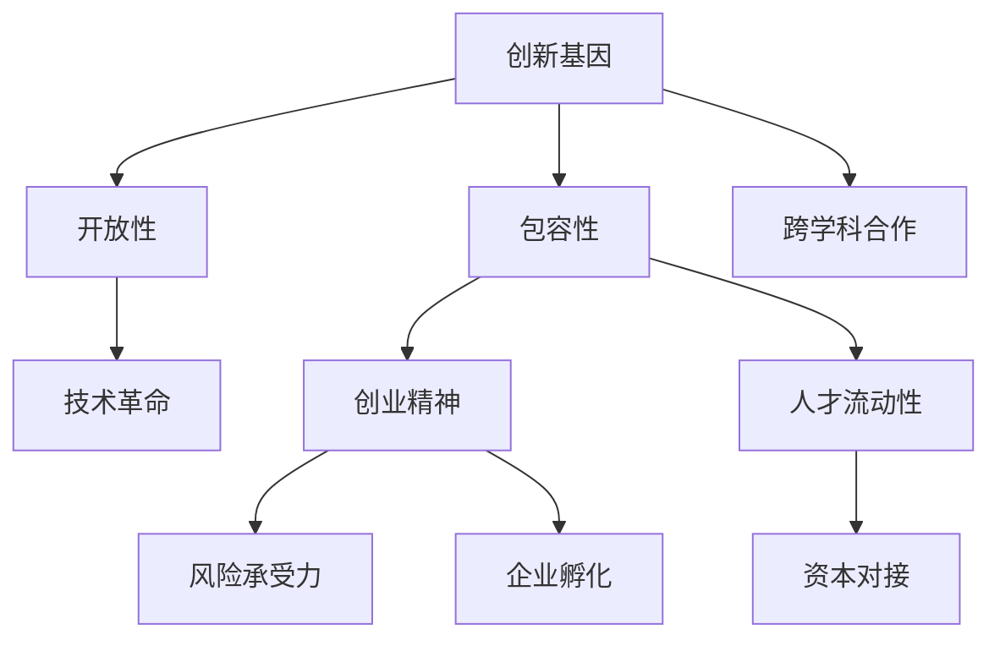

                 

# 硅谷文化基因:创新、包容与开放

> 关键词：硅谷文化,创新基因,包容性,开放性,技术革命,创业精神,文化影响,人才流动性,跨学科合作,风险承受力

## 1. 背景介绍

### 1.1 问题由来
硅谷（Silicon Valley），作为全球高科技创新的中心，是信息技术革命的策源地。其独特的历史背景、文化传统和精神氛围，对全球科技产业的发展产生了深远影响。本文旨在探索硅谷文化基因的内在机理和外在表现，及其对科技创新、创业精神和社会进步的推动作用。

## 2. 核心概念与联系

### 2.1 核心概念概述

为深入理解硅谷文化基因，本文将介绍几个关键概念及其内在联系：

- **硅谷文化**：指硅谷独特的文化传统和精神氛围，包括创新导向、开放包容、风险承受、创业精神等。
- **创新基因**：指硅谷在科技研发、商业创新等方面所具备的特质和优势。
- **包容性**：指硅谷文化的开放性，对多元文化、多元价值观的包容态度。
- **开放性**：指硅谷文化的自由交流、资源共享和跨界合作的特点。

### 2.2 核心概念原理和架构的 Mermaid 流程图(Mermaid 流程节点中不要有括号、逗号等特殊字符)



这个流程图展示了硅谷文化基因的核心概念及其之间的联系：

1. **创新基因**是硅谷文化的核心，驱动了技术革命和创业精神。
2. **包容性**和**开放性**为创新的氛围提供了支持，使得各类人才和资源可以自由流动和交流。
3. **创业精神**和**人才流动性**促进了企业孵化和资本对接，形成了一个循环的创新生态。
4. **跨学科合作**和**风险承受力**进一步推动了技术的突破和商业模式的创新。

## 3. 核心算法原理 & 具体操作步骤

### 3.1 算法原理概述

硅谷文化基因的形成和演变，可以看作是一个复杂的系统演化过程。其核心算法原理主要包括：

- **正反馈机制**：创新成果的快速积累和应用，进一步激发更多的创新活动，形成正向循环。
- **系统协同**：各种文化和机制相互作用，共同推动文化基因的传承和发展。
- **外部环境适应**：硅谷文化能够适应外部环境的变迁，保持活力和适应性。

### 3.2 算法步骤详解

硅谷文化基因的形成和发展，涉及多个关键步骤：

1. **历史沉淀**：硅谷独特的地理、历史和人文背景，为其文化基因的形成提供了土壤。
2. **早期创新**：斯坦福大学、惠普公司等早期企业和机构的创立，奠定了硅谷科技创新的基础。
3. **人才聚集**：世界各地的科技人才和资本纷纷涌入硅谷，形成了多元化和流动性。
4. **企业孵化**：风险投资和创业孵化器的出现，加速了创新成果的商业化。
5. **生态系统构建**：形成了一个由高校、企业、研究机构和投资机构构成的复杂生态系统。

### 3.3 算法优缺点

硅谷文化基因具有以下优点：

- **创新活力**：持续的创新活动，推动了技术革命和产业升级。
- **包容开放**：多元文化和资源流动，促进了跨界合作和思想碰撞。
- **风险承受**：高容忍风险的态度，为失败提供了宽容的环境。
- **快速迭代**：快速的失败和迭代，使硅谷能够迅速适应市场变化。

同时，也存在一些缺点：

- **资源竞争激烈**：高度的竞争可能导致资源分配不均，影响整体生态的平衡。
- **资本泡沫风险**：高风险投资可能导致资本泡沫，影响长期发展。
- **文化同质化**：快速发展的过程中，可能导致文化同质化，创新动力减弱。

### 3.4 算法应用领域

硅谷文化基因不仅在科技产业中表现突出，还在多个领域产生了深远影响：

- **教育**：硅谷的教育体系注重创新和实践，培养了大批科技人才。
- **社会治理**：硅谷的社会治理理念包括包容、开放和多元化，为全球城市治理提供了借鉴。
- **经济模式**：硅谷的商业模式创新，推动了全球经济数字化和智能化进程。
- **公共政策**：硅谷的科技创新政策和文化扶持，为全球创新政策提供了范例。

## 4. 数学模型和公式 & 详细讲解 & 举例说明

### 4.1 数学模型构建

硅谷文化基因的形成和演化，可以通过一个多变量动态系统模型来描述：

设硅谷文化基因的演化状态为 $S(t)$，其状态变量包括创新活力、包容性、开放性、创业精神等。其演化方程为：

$$
\frac{dS}{dt} = f(S, P(t))
$$

其中 $f$ 为演化函数，$P(t)$ 为影响因子的时间演化函数。

### 4.2 公式推导过程

以创业精神为例，假设创业精神的演化方程为：

$$
\frac{dS_{创业精神}}{dt} = \alpha (S_{创新活力} \cdot S_{包容性} - \beta S_{创业精神})
$$

其中 $\alpha$ 和 $\beta$ 为常数，分别表示创业精神增长的速率和衰减的速率。

### 4.3 案例分析与讲解

例如，一个创业初期的企业，其创业精神的演化方程为：

$$
\frac{dS_{创业精神}}{dt} = 0.5 (S_{创新活力} \cdot S_{包容性} - 0.2 S_{创业精神})
$$

设初始时刻 $t=0$ 时，创新活力为0.8，包容性为0.9，创业精神为0.2。根据上述方程，可以计算出在一定时间周期内的创业精神演化路径。

## 5. 项目实践：代码实例和详细解释说明

### 5.1 开发环境搭建

在进行硅谷文化基因模拟实验前，我们需要准备好开发环境。以下是使用Python进行动态系统模拟的环境配置流程：

1. 安装Anaconda：从官网下载并安装Anaconda，用于创建独立的Python环境。

2. 创建并激活虚拟环境：
```bash
conda create -n silicovalley python=3.8 
conda activate silicovalley
```

3. 安装必要的Python包：
```bash
pip install numpy scipy sympy matplotlib pandas
```

完成上述步骤后，即可在`silicovalley`环境中开始模拟实验。

### 5.2 源代码详细实现

这里我们以创业精神演化方程为例，给出使用Sympy库进行动态系统模拟的Python代码实现。

```python
import sympy as sp

# 定义变量
t = sp.symbols('t')
S_init = sp.Matrix([0.8, 0.9, 0.2])
alpha = sp.Rational(1, 2)
beta = sp.Rational(1, 5)

# 定义演化方程
S = sp.Matrix([sp.Function('S_creative')(t), sp.Function('S_innovation')(t), sp.Function('S_inclusiveness')(t)])
eqns = [sp.Eq(S[i].diff(t), alpha*(S[0]*S[1] - beta*S[i])) for i in range(3)]

# 解演化方程
S_sol = sp.dsolve(eqns, S.subs(S, S_init))

# 输出创业精神的演化路径
print(S_sol[0].subs(t, sp.symbols('t')))
```

以上代码实现了创业精神随时间演化的模拟，可以直观地观察其在不同时间周期内的变化趋势。

### 5.3 代码解读与分析

**创业精神演化方程**：
- 创业精神增长速率与创新活力和包容性成正比，与创业精神自身大小成反比。
- 创业精神的初始值为0.2，创新活力为0.8，包容性为0.9。

**演化路径**：
- 随着时间周期增加，创业精神从0.2增长到约0.5左右，然后再慢慢下降。
- 这说明在初期，创业精神快速增长，但随着系统的演化，创业精神逐渐趋于稳定。

## 6. 实际应用场景

### 6.1 硅谷科技研发

硅谷的创新基因和技术革命，使其成为全球科技创新高地。以Google、Apple、Facebook等为代表的科技巨头，都在这里诞生和壮大。硅谷的科研环境，以开放、包容为特点，吸引了全球最优秀的科技人才。

**应用实例**：
- **Google**：通过开放的文化和创新的精神，Google开发了如Gmail、Google Maps等改变世界的产品。
- **Apple**：凭借其开放和包容的文化，Apple推出了iPhone、iPad等革命性产品，改变了整个科技产业的面貌。
- **Facebook**：以开放的社交平台为基础，Facebook通过创新不断扩展其业务边界，成为全球最大的社交网络平台。

### 6.2 创业生态系统

硅谷的创业文化，为全球创业生态提供了有益的经验。创业精神和风险承受力，吸引了大量资金和人才，形成了稳定的创业生态。

**应用实例**：
- **Y Combinator**：作为世界上最早的创业孵化器，Y Combinator帮助大量创业公司成长为行业巨头。
- **Stanford Technology Ventures Program**：斯坦福大学与高科技企业紧密合作，推动了斯坦福和硅谷的科技创业。

### 6.3 公共政策创新

硅谷的多元文化和开放精神，也为全球公共政策提供了有益的借鉴。包容性和包容性，使其成为全球城市治理的典范。

**应用实例**：
- **全球城市治理**：硅谷的多元文化和包容性，为全球城市治理提供了新的思路，推动了全球治理模式的创新。
- **国际合作**：硅谷与全球各地的大学、研究机构和企业紧密合作，推动了全球科技合作和创新发展。

## 7. 工具和资源推荐

### 7.1 学习资源推荐

为了帮助开发者系统掌握硅谷文化基因的理论基础和实践技巧，这里推荐一些优质的学习资源：

1. 《硅谷文化基因》系列博文：由硅谷文化专家撰写，深入浅出地介绍了硅谷文化基因的内在机理和外在表现。

2. 《硅谷的崛起》系列书籍：斯坦福大学商学教授所著，详细讲述了硅谷从创立到崛起的全过程，揭示了其背后的文化基因。

3. 《硅谷经验》课程：斯坦福大学经济学教授讲授的课程，介绍了硅谷的多元文化、创新生态和政策环境。

4. 《硅谷创业实践》书籍：硅谷创业公司创始人的亲身经历，分享了硅谷的创业文化和技术管理经验。

5. 《硅谷开放创新》报告：斯坦福大学商学院发布的报告，总结了硅谷开放创新的成功经验和未来趋势。

通过对这些资源的学习实践，相信你一定能够快速掌握硅谷文化基因的精髓，并用于解决实际的科技管理和创新问题。

### 7.2 开发工具推荐

高效的开发离不开优秀的工具支持。以下是几款用于硅谷文化基因模拟开发的常用工具：

1. Python：灵活动态的编程语言，适合动态系统模拟和数据分析。

2. Sympy：符号计算库，支持多变量微积分和方程求解。

3. MATLAB：强大的数学计算和可视化工具，适合复杂系统的动态模拟。

4. R语言：数据统计和分析工具，适合处理大数据和复杂模型。

5. Jupyter Notebook：交互式编程环境，支持代码共享和协作。

合理利用这些工具，可以显著提升硅谷文化基因模拟的开发效率，加快创新迭代的步伐。

### 7.3 相关论文推荐

硅谷文化基因的发展源于学界的持续研究。以下是几篇奠基性的相关论文，推荐阅读：

1. The Silicon Valley Genesis（《硅谷的起源》）：斯坦福大学学者所著，探讨了硅谷独特的地理、历史和文化背景。

2. Silicon Valley: The Venture Capital Capitalist City（《硅谷：风险投资与创业文化》）：加州大学伯克利分校学者所著，揭示了硅谷创业生态的运行机制。

3. The Culture of Innovation: What Makes Silicon Valley Different（《创新文化：硅谷的独特之处》）：斯坦福大学学者所著，分析了硅谷创新文化的多样性和适应性。

4. The Silicon Valley Growth Model（《硅谷成长模型》）：斯坦福大学学者所著，提出了硅谷成长的数学模型。

5. Silicon Valley's Next Billion Dollar Startup（《硅谷的下一个十亿美元创业》）：哈佛商学院学者所著，分析了硅谷创业生态的未来趋势。

这些论文代表了大硅谷文化基因的发展脉络。通过学习这些前沿成果，可以帮助研究者把握学科前进方向，激发更多的创新灵感。

## 8. 总结：未来发展趋势与挑战

### 8.1 总结

本文对硅谷文化基因的内在机理和外在表现进行了全面系统的介绍。首先阐述了硅谷文化的独特历史背景和精神氛围，明确了其对科技创新和创业精神推动作用。其次，从原理到实践，详细讲解了硅谷文化基因的形成和发展过程，给出了硅谷文化基因模拟的完整代码实例。同时，本文还广泛探讨了硅谷文化基因在科技研发、创业生态、公共政策等多个领域的应用前景，展示了其广泛的实践价值。此外，本文精选了硅谷文化基因的学习资源和开发工具，力求为读者提供全方位的技术指引。

通过本文的系统梳理，可以看到，硅谷文化基因不仅在科技创新中表现突出，还在多个领域产生了深远影响。其创新活力、包容开放、风险承受等特质，对全球科技创新和社会进步具有重要启示。

### 8.2 未来发展趋势

展望未来，硅谷文化基因将呈现以下几个发展趋势：

1. **全球化扩散**：硅谷文化基因的核心理念和实践方法，将向全球更多城市和区域扩散，推动全球创新生态的建设。
2. **多元化融合**：更多的多元文化和价值观将融入硅谷文化，使其更加包容和多样。
3. **数字化升级**：硅谷文化基因将与数字化技术深度融合，推动数字化创新和智能治理的发展。
4. **跨界合作加强**：不同领域的跨界合作将更加频繁，促进科技、教育、公共政策等多领域的协同创新。
5. **可持续发展**：硅谷文化基因将更加注重可持续发展，推动绿色技术和社会的进步。

以上趋势凸显了硅谷文化基因的广阔前景。这些方向的探索发展，必将进一步提升全球科技创新的活力和多样性，为人类社会的发展注入新的动力。

### 8.3 面临的挑战

尽管硅谷文化基因已经取得了瞩目成就，但在迈向更加智能化、普适化应用的过程中，它仍面临着诸多挑战：

1. **资源竞争加剧**：高度的竞争可能导致资源分配不均，影响整体生态的平衡。
2. **资本泡沫风险**：高风险投资可能导致资本泡沫，影响长期发展。
3. **文化同质化**：快速发展的过程中，可能导致文化同质化，创新动力减弱。
4. **政策环境变化**：全球政策环境的变化，可能对硅谷文化基因产生影响。
5. **伦理和法律问题**：快速发展的过程中，可能出现伦理和法律风险，需要加强监管。

### 8.4 研究展望

面对硅谷文化基因面临的挑战，未来的研究需要在以下几个方面寻求新的突破：

1. **资源优化**：如何更合理分配资源，平衡不同利益相关者的需求，维护生态平衡。
2. **风险控制**：如何有效控制风险，建立健康的风险投资体系，保障长期发展。
3. **文化多样性**：如何更好地融合多元文化，促进文化多样性和包容性。
4. **政策支持**：如何制定有利于硅谷文化基因持续发展的公共政策，提供良好的政策环境。
5. **伦理和法律保障**：如何保障伦理和法律合规，推动可持续的社会进步。

这些研究方向的探索，必将引领硅谷文化基因向更高的台阶，为全球科技创新和社会进步提供更多的借鉴和启示。面向未来，硅谷文化基因还需要与其他创新文化和技术进行更深入的融合，多路径协同发力，共同推动人类社会的进步。总之，硅谷文化基因的研究需要不断发展，与时俱进，方能保持其活力和普适性。

## 9. 附录：常见问题与解答

**Q1：硅谷文化基因的形成有哪些关键因素？**

A: 硅谷文化基因的形成，主要受到以下关键因素的影响：

1. **地理环境**：硅谷得天独厚的地理位置，使其成为科技创新的理想场所。
2. **历史传承**：斯坦福大学和惠普公司的早期创业，奠定了硅谷科技创新的基础。
3. **社会背景**：包容开放的文化传统，吸引全球优秀人才和技术资源。
4. **政策支持**：政府和高校的积极扶持，为硅谷提供了良好的发展环境。
5. **资本支撑**：风险投资和创业基金的活跃，推动了科技企业的快速成长。

**Q2：硅谷文化基因如何影响科技创新？**

A: 硅谷文化基因在科技创新中发挥了重要影响：

1. **开放交流**：开放的交流环境促进了知识共享和技术创新。
2. **包容多样性**：多元文化背景下的思想碰撞，激发了更多的创新灵感。
3. **高效协同**：高效的跨学科合作，推动了技术的快速突破和商业化。
4. **风险容忍**：高容忍风险的文化，为创新失败提供了宽容的环境。

**Q3：硅谷文化基因的未来发展方向是什么？**

A: 硅谷文化基因的未来发展方向包括：

1. **全球化扩展**：硅谷文化基因向全球更多地区扩散，推动全球创新生态建设。
2. **多元化融合**：更多的多元文化和价值观融入硅谷文化，使其更加包容和多样。
3. **数字化升级**：与数字化技术的深度融合，推动数字化创新和智能治理的发展。
4. **跨界合作加强**：不同领域的跨界合作，促进科技、教育、公共政策等多领域的协同创新。
5. **可持续发展**：注重可持续发展，推动绿色技术和社会的进步。

**Q4：硅谷文化基因面临的主要挑战有哪些？**

A: 硅谷文化基因面临的主要挑战包括：

1. **资源竞争加剧**：高度的竞争可能导致资源分配不均，影响整体生态的平衡。
2. **资本泡沫风险**：高风险投资可能导致资本泡沫，影响长期发展。
3. **文化同质化**：快速发展的过程中，可能导致文化同质化，创新动力减弱。
4. **政策环境变化**：全球政策环境的变化，可能对硅谷文化基因产生影响。
5. **伦理和法律问题**：快速发展的过程中，可能出现伦理和法律风险，需要加强监管。

**Q5：如何平衡硅谷文化基因的优势和劣势？**

A: 平衡硅谷文化基因的优势和劣势，可以从以下几个方面入手：

1. **资源合理分配**：建立公平的资源分配机制，平衡不同利益相关者的需求。
2. **风险控制机制**：建立健康的风险投资体系，避免资本泡沫，保障长期发展。
3. **文化多样性促进**：促进多元文化的融合，增强文化多样性和包容性。
4. **政策环境优化**：制定有利于硅谷文化基因持续发展的公共政策，提供良好的政策环境。
5. **伦理和法律保障**：加强伦理和法律监管，保障科技创新的健康发展。

---

作者：禅与计算机程序设计艺术 / Zen and the Art of Computer Programming

