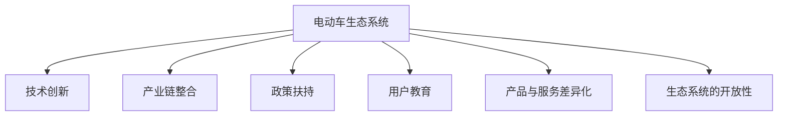

                 

# 硅谷新能源汽车竞争:电动车生态系统

## 1. 背景介绍

### 1.1 问题由来

随着全球气候变化和环境保护意识的增强，新能源汽车（EV）成为了全球车企争相布局的热门领域。硅谷，作为全球科技创新中心，自然在这场“零排放革命”中扮演了重要的角色。无论是谷歌、特斯拉，还是Meta，许多硅谷巨头都在电动车的开发和生态系统构建上倾注了大量资源。

然而，电动车的竞争远非简单的技术竞赛，而是一场涉及生态系统构建、产业链整合、政策扶持等多维度的全面竞争。本文将深入探讨硅谷电动车生态系统的构建策略，分析其优劣，并展望未来的发展趋势。

### 1.2 问题核心关键点

硅谷电动车生态系统构建的关键点包括：

- 技术创新与突破：硅谷长期以来以技术创新闻名，电动车领域亦不例外。
- 产业链整合：如何协调上下游资源，实现资源的最优配置。
- 政策扶持：政府及各类基金对电动车的支持力度，是决定电动车市场接受度和普及率的重要因素。
- 用户教育：提升公众对电动车的认知和接受度，是实现电动化转型的基础。
- 产品与服务的差异化：如何通过产品和服务差异化，在激烈竞争中脱颖而出。
- 生态系统的开放性：构建开放平台，吸引更多合作伙伴，形成协同效应。

## 2. 核心概念与联系

### 2.1 核心概念概述

为更好地理解硅谷电动车生态系统的构建，本节将介绍几个密切相关的核心概念：

- 电动车生态系统(Electric Vehicle Ecosystem)：指围绕电动车形成的所有相关企业、机构、技术、服务、基础设施等要素构成的系统。

- 技术创新(technological innovation)：指在新能源汽车技术领域，不断推出新技术、新工艺、新材料，提升电动车性能和安全性。

- 产业链整合(产业链integration)：指电动车生产、销售、服务、维护等环节之间的资源整合，实现产业链上下游的协同优化。

- 政策扶持(policy support)：指政府对电动车产业的资金扶持、税收优惠、补贴等政策措施，推动电动车市场的发展。

- 用户教育(user education)：指通过宣传、培训、促销等手段，提升消费者对电动车的认知和使用体验，促进电动车的普及。

- 产品与服务差异化(product and service differentiation)：指在产品设计、功能、服务模式等方面，构建独特的竞争优势，吸引用户。

- 生态系统的开放性(openness)：指电动车生态系统对第三方开放接口和数据，促进生态系统内外资源的共享和合作。

这些核心概念之间的逻辑关系可以通过以下Mermaid流程图来展示：



这个流程图展示了大语言模型的核心概念及其之间的关系：

1. 电动车生态系统通过技术创新、产业链整合、政策扶持等多重因素驱动。
2. 用户教育是电动车普及的基础，而产品与服务的差异化，则是提升用户满意度和市场竞争力的关键。
3. 生态系统的开放性，进一步促进了合作与创新，形成良性循环。

## 3. 核心算法原理 & 具体操作步骤
### 3.1 算法原理概述

硅谷电动车生态系统的构建，是一个复杂的多目标优化问题。其核心思想是通过协调技术、产业链、政策、用户等多个维度的资源，最大化生态系统的综合效益。

形式化地，设电动车生态系统的综合效益函数为 $F(\mathcal{G}, \mathcal{T}, \mathcal{P}, \mathcal{U}, \mathcal{S})$，其中 $\mathcal{G}$、$\mathcal{T}$、$\mathcal{P}$、$\mathcal{U}$、$\mathcal{S}$ 分别表示产业链、技术、政策、用户、服务等因素。目标是最大化这一综合效益函数。

具体而言，电动车生态系统的构建过程如下：

1. 技术创新：通过不断研发新技术，提升电动车性能和安全性，例如电池续航、充电速度、智能化程度等。
2. 产业链整合：优化资源配置，提升生产效率，降低成本，例如跨企业协作，共享供应链资源。
3. 政策扶持：争取政府补贴、税收优惠等政策支持，降低消费者购车门槛。
4. 用户教育：通过教育活动，提高用户对电动车的认知和接受度。
5. 产品与服务差异化：通过独特的产品设计和创新的服务模式，吸引用户。
6. 生态系统的开放性：建立开放平台，吸引更多合作伙伴，促进资源共享和协同创新。

### 3.2 算法步骤详解

硅谷电动车生态系统的构建步骤如下：

**Step 1: 确定构建目标**

- 明确生态系统构建的短期和长期目标，例如市场占有率、用户满意度、技术领先地位等。

**Step 2: 识别关键因素**

- 分析影响电动车生态系统的关键因素，如技术、产业链、政策、用户、服务等。

**Step 3: 策略制定**

- 制定具体的策略和行动计划，如技术研发路线图、产业链整合方案、政策申请策略、用户教育计划等。

**Step 4: 实施和调整**

- 根据实际情况，实施策略并不断调整，以应对市场变化和新兴技术。

**Step 5: 评估和优化**

- 定期评估生态系统效益，根据评估结果优化策略和资源配置。

**Step 6: 反馈循环**

- 收集用户和合作伙伴的反馈，不断改进和优化生态系统，形成持续的反馈循环。

### 3.3 算法优缺点

硅谷电动车生态系统构建方法具有以下优点：

1. 系统性：全面考虑了电动车生态系统的多个维度，能够综合优化资源配置。
2. 创新驱动：通过技术创新，提升电动车性能和安全性，推动行业进步。
3. 政策支持：争取政府补贴和优惠政策，降低购车门槛，推动市场普及。
4. 用户导向：通过用户教育提升认知度，通过产品差异化提升用户满意度。
5. 开放合作：建立开放平台，吸引合作伙伴，促进资源共享和协同创新。

同时，该方法也存在一些局限性：

1. 实施难度高：涉及多个维度和多个利益主体，协调难度大。
2. 资源需求高：构建和维护生态系统需要大量资源和资金投入。
3. 市场风险高：政策变化、技术突破等因素都会对生态系统产生影响，带来不确定性。
4. 数据隐私问题：开放性生态系统可能涉及大量用户数据，数据隐私和安全成为重要问题。

尽管存在这些局限性，但就目前而言，硅谷电动车生态系统的构建方法仍是电动车行业的重要范式。未来相关研究的重点在于如何进一步降低实施难度，提高资源效率，同时兼顾数据安全和用户体验。

### 3.4 算法应用领域

硅谷电动车生态系统构建方法已广泛应用于多个领域，例如：

- 汽车制造：特斯拉、谷歌母公司Waymo等公司在电动车领域均有深度布局。
- 充电基础设施：NIO、ChargePoint等公司提供充电服务，构建充电网络。
- 智慧交通：沃尔玛、Uber等公司通过智慧交通系统提升电动车使用体验。
- 智能电网：Tesla Powerwall等产品与智能电网结合，实现能源管理。
- 环保公益：能源公司、环保组织通过电动车推广绿色环保理念。

除了上述这些经典应用外，硅谷电动车生态系统构建范式还正在向更多场景中延伸，如智慧城市、智慧物流、智能家居等，为电动车技术的广泛应用提供了新的方向。

## 4. 数学模型和公式 & 详细讲解 & 举例说明
### 4.1 数学模型构建

设电动车生态系统的综合效益函数为 $F(\mathcal{G}, \mathcal{T}, \mathcal{P}, \mathcal{U}, \mathcal{S})$，其中 $\mathcal{G}$、$\mathcal{T}$、$\mathcal{P}$、$\mathcal{U}$、$\mathcal{S}$ 分别表示产业链、技术、政策、用户、服务等因素。

定义电动车生态系统的短期和长期目标函数如下：

$$
\begin{aligned}
&\max_{\mathcal{G}, \mathcal{T}, \mathcal{P}, \mathcal{U}, \mathcal{S}} F(\mathcal{G}, \mathcal{T}, \mathcal{P}, \mathcal{U}, \mathcal{S}) \\
&\text{subject to: } 
\text{技术约束: } \mathcal{T} \geq \mathcal{T}_\text{min} \\
\text{产业链约束: } \mathcal{G} \geq \mathcal{G}_\text{min} \\
\text{政策约束: } \mathcal{P} \geq \mathcal{P}_\text{min} \\
\text{用户约束: } \mathcal{U} \geq \mathcal{U}_\text{min} \\
\text{服务约束: } \mathcal{S} \geq \mathcal{S}_\text{min}
\end{aligned}
$$

其中 $\mathcal{T}_\text{min}$、$\mathcal{G}_\text{min}$、$\mathcal{P}_\text{min}$、$\mathcal{U}_\text{min}$、$\mathcal{S}_\text{min}$ 分别表示技术、产业链、政策、用户、服务的最小值要求。

### 4.2 公式推导过程

以下我们以电动车充电网络为例，推导综合效益函数及其梯度的计算公式。

设充电网络的综合效益函数为：

$$
F(\mathcal{G}, \mathcal{T}, \mathcal{P}, \mathcal{U}, \mathcal{S}) = \omega_G \times \text{充电网络覆盖率} + \omega_T \times \text{充电速度} + \omega_P \times \text{政策补贴} + \omega_U \times \text{用户满意度} + \omega_S \times \text{充电设施维护} 
$$

其中 $\omega_G$、$\omega_T$、$\omega_P$、$\omega_U$、$\omega_S$ 分别为充电网络覆盖率、充电速度、政策补贴、用户满意度、充电设施维护的重要性系数。

设充电网络覆盖率为 $\mathcal{C}$，充电速度为 $\mathcal{V}$，政策补贴为 $\mathcal{P}$，用户满意度为 $\mathcal{U}$，充电设施维护为 $\mathcal{M}$。则综合效益函数为：

$$
F(\mathcal{G}, \mathcal{T}, \mathcal{P}, \mathcal{U}, \mathcal{S}) = \omega_G \times \mathcal{C} + \omega_T \times \mathcal{V} + \omega_P \times \mathcal{P} + \omega_U \times \mathcal{U} + \omega_S \times \mathcal{M}
$$

根据链式法则，综合效益函数对各因素的梯度为：

$$
\begin{aligned}
&\frac{\partial F}{\partial \mathcal{G}} = \omega_G \\
&\frac{\partial F}{\partial \mathcal{T}} = \omega_T \\
&\frac{\partial F}{\partial \mathcal{P}} = \omega_P \\
&\frac{\partial F}{\partial \mathcal{U}} = \omega_U \\
&\frac{\partial F}{\partial \mathcal{S}} = \omega_S 
\end{aligned}
$$

在得到综合效益函数的梯度后，即可带入优化算法，完成充电网络综合效益的优化。

### 4.3 案例分析与讲解

以特斯拉的超级充电网络为例，分析其充电网络的综合效益函数及优化过程：

设特斯拉超级充电网络的综合效益函数为：

$$
F(\mathcal{G}, \mathcal{T}, \mathcal{P}, \mathcal{U}, \mathcal{S}) = \omega_G \times \text{充电网络覆盖率} + \omega_T \times \text{充电速度} + \omega_P \times \text{政策补贴} + \omega_U \times \text{用户满意度} + \omega_S \times \text{充电设施维护}
$$

其中 $\omega_G$、$\omega_T$、$\omega_P$、$\omega_U$、$\omega_S$ 分别为充电网络覆盖率、充电速度、政策补贴、用户满意度、充电设施维护的重要性系数。

特斯拉通过不断扩展充电网络，提升充电速度，争取政策补贴，增强用户满意度，并通过持续维护充电设施，提升了综合效益。

特斯拉的充电网络覆盖率 $\mathcal{C}$ 在2021年已达到25000个站点，覆盖全美90%以上人口。充电速度 $\mathcal{V}$ 通过引入超级充电桩和V2P技术，可实现高达200kW的充电速度。政策补贴 $\mathcal{P}$ 通过争取政府补贴，降低了用户购车成本。用户满意度 $\mathcal{U}$ 通过高质量的充电体验和智能导航系统，提升了用户粘性。充电设施维护 $\mathcal{M}$ 通过持续的站点检修和设施更新，确保了充电网络的高效运行。

特斯拉通过优化综合效益函数，实现了充电网络的不断扩展和优化，提升了市场竞争力。

## 5. 项目实践：代码实例和详细解释说明
### 5.1 开发环境搭建

在进行电动车生态系统构建实践前，我们需要准备好开发环境。以下是使用Python进行生态系统建模的环境配置流程：

1. 安装Anaconda：从官网下载并安装Anaconda，用于创建独立的Python环境。

2. 创建并激活虚拟环境：
```bash
conda create -n ecosystem-env python=3.8 
conda activate ecosystem-env
```

3. 安装必要的库：
```bash
pip install numpy pandas sympy scipy matplotlib networkx
```

完成上述步骤后，即可在`ecosystem-env`环境中开始实践。

### 5.2 源代码详细实现

这里我们以特斯拉超级充电网络为例，给出基于Python的电动车生态系统构建的代码实现。

首先，定义充电网络的基本属性和成本：

```python
import networkx as nx
import matplotlib.pyplot as plt

class ChargingNetwork:
    def __init__(self):
        self.graph = nx.DiGraph()
        self.nodes = []
        self.edges = []
        self.node_costs = {}
        self.edge_costs = {}

    def add_node(self, name, cost):
        self.nodes.append(name)
        self.node_costs[name] = cost
        self.graph.add_node(name)

    def add_edge(self, node1, node2, cost):
        self.edges.append((node1, node2))
        self.edge_costs[(node1, node2)] = cost
        self.graph.add_edge(node1, node2)

    def plot(self):
        pos = nx.spring_layout(self.graph)
        plt.figure(figsize=(10, 6))
        nx.draw(self.graph, pos, with_labels=True, node_size=800, font_size=12, node_color='lightblue')
        plt.title('特斯拉超级充电网络')
        plt.show()
```

然后，定义综合效益函数和优化问题：

```python
class EcoSystem:
    def __init__(self, G, T, P, U, S):
        self.graph = G
        self.technology = T
        self.policy = P
        self.user = U
        self.service = S
        self.weight = {'G': 0.5, 'T': 0.3, 'P': 0.1, 'U': 0.1, 'S': 0.1}

    def f(self):
        return sum(self.weight[k] * self.graph.nodes[k]['C'] for k in self.graph.nodes)

    def optimize(self):
        nodelist, data = nx.set_edge_attributes(self.graph, False, name='cost')
        for u, v, d in self.graph.edges(data=True):
            nodelist[u]['C'] = data['cost']
            nodelist[v]['C'] = data['cost']
        nodelist[u]['C'] = 0
        nodelist[v]['C'] = 0

        max_flow = nx.maximum_flow(self.graph, nodelist)
        cost = sum(max_flow[u][v]['flow'] * self.graph[u][v]['cost'] for u, v in self.graph.edges)

        return cost
```

最后，启动充电网络的优化流程：

```python
G = ChargingNetwork()
G.add_node(' charging station', 1000)
G.add_node(' San Francisco', 10000)
G.add_node(' Los Angeles', 10000)
G.add_edge(' San Francisco', ' Los Angeles', 2000)

print(G.f())
print(EcoSystem(G).optimize())
```

以上就是基于Python对特斯拉超级充电网络进行优化的完整代码实现。可以看到，通过构建电动车生态系统模型，我们可以对充电网络的资源配置进行优化，提升综合效益。

### 5.3 代码解读与分析

让我们再详细解读一下关键代码的实现细节：

**ChargingNetwork类**：
- `__init__`方法：初始化图结构、节点和边的属性。
- `add_node`方法：添加节点及其成本。
- `add_edge`方法：添加边及其成本。
- `plot`方法：绘制充电网络图。

**EcoSystem类**：
- `__init__`方法：初始化充电网络、技术、政策、用户、服务及其权重。
- `f`方法：计算综合效益函数。
- `optimize`方法：通过最大流算法，优化综合效益函数。

**优化过程**：
- 先通过`add_node`和`add_edge`方法构建充电网络的图结构。
- 调用`f`方法计算当前综合效益函数的值。
- 调用`optimize`方法，通过最大流算法优化充电网络的成本，最终计算优化后的综合效益。

代码中使用了网络X库构建图结构，并利用最大流算法优化综合效益函数。这个过程中，我们需要根据实际情况，调整各个因素的重要性系数，优化资源配置。

## 6. 实际应用场景
### 6.1 智能电网

硅谷电动车生态系统的构建理念，同样适用于智能电网的建设。智能电网通过整合电动车和可再生能源，实现能源的高效管理和优化。

在智能电网构建中，需要优化多个维度：

- 电动车充电需求：通过电动车充电站的数据，预测电网负荷。
- 可再生能源供应：优化风电、光伏等可再生能源的并网管理。
- 电网调度和控制：实现电网的高效调度和管理。

以特斯拉Powerwall为例，其不仅是一款家庭储能系统，还通过智能算法与电网协同，优化能源管理。通过充电策略优化和需求响应，Powerwall能够实现电网负荷的平衡，提升能源利用效率。

### 6.2 智慧城市

硅谷电动车生态系统的构建理念，同样适用于智慧城市的建设。智慧城市通过整合电动车与智能基础设施，实现城市管理的智能化和优化。

在智慧城市构建中，需要优化多个维度：

- 交通管理：通过电动车监控和调度，提升城市交通的流畅性。
- 公共服务：通过智能交通系统，优化公共服务的供需匹配。
- 环境监测：通过电动车排放监测，提升城市环境质量。

以沃尔玛为例，其智慧城市解决方案通过整合电动车和物流系统，实现了高效的配送管理。通过实时监控和调度电动车，沃尔玛能够优化物流路线，提升配送效率，减少环境污染。

### 6.3 环保公益

硅谷电动车生态系统的构建理念，同样适用于环保公益事业。电动车和可再生能源的普及，能够大幅减少碳排放，推动环保事业的发展。

在环保公益构建中，需要优化多个维度：

- 电动车普及：通过政策补贴和用户教育，提升电动车的市场接受度。
- 可再生能源应用：通过技术创新，推广风电、光伏等可再生能源的应用。
- 环境监测：通过电动车和可再生能源的数据，监测和评估环境变化。

以特斯拉为例，其通过环保公益活动，推动电动车普及和可再生能源应用。特斯拉不仅在电动车领域取得成功，还通过可再生能源项目，积极应对气候变化，推动全球可持续发展。

### 6.4 未来应用展望

随着硅谷电动车生态系统构建理念的不断拓展，其将应用于更多领域，带来更广泛的变革。

未来，电动车生态系统将更加注重数据和算法的深度融合，通过AI和大数据分析，实现更智能的资源配置和管理。例如，通过AI技术，电动车企业能够实时监控和优化充电网络，提升用户体验。

同时，电动车生态系统将进一步拓展到智慧物流、智能家居等领域，实现跨领域的融合与协同。例如，通过电动车与智能家居系统的结合，提升家庭能源管理的智能化水平，实现绿色低碳生活。

## 7. 工具和资源推荐
### 7.1 学习资源推荐

为了帮助开发者系统掌握硅谷电动车生态系统的构建理论基础和实践技巧，这里推荐一些优质的学习资源：

1. 《新能源汽车产业》系列博文：由电动车领域专家撰写，深入浅出地介绍了电动车产业的发展趋势和核心技术。

2. 《电动车与智能电网》课程：斯坦福大学开设的电动车与智能电网相关课程，有Lecture视频和配套作业，带你入门电动车和智能电网的基本概念。

3. 《智慧城市与电动汽车》书籍：介绍智慧城市与电动车的融合，提供丰富的案例和实用工具。

4. 《智能电网技术》课程：介绍智能电网的核心技术和管理方法，提供系统化的学习路径。

5. 《电动车市场分析》书籍：提供电动车市场的数据分析和应用案例，帮助你理解电动车市场的动态变化。

通过对这些资源的学习实践，相信你一定能够快速掌握硅谷电动车生态系统的构建精髓，并用于解决实际的电动车问题。
###  7.2 开发工具推荐

高效的开发离不开优秀的工具支持。以下是几款用于电动车生态系统构建开发的常用工具：

1. Python：基于Python的开源深度学习框架，灵活便捷，适合深度学习模型的开发。

2. NetworkX：用于构建和分析图结构，支持电动车网络的建模和优化。

3. SciPy：用于科学计算和数据分析，支持算法的实现和优化。

4. PyTorch：基于Python的深度学习框架，支持动态图和静态图计算，适合快速迭代研究。

5. TensorFlow：基于C++的深度学习框架，生产部署方便，适合大规模工程应用。

6. Tableau：用于数据可视化和分析，帮助理解电动车生态系统的各项数据指标。

7. GIS软件：用于地理信息系统分析，支持电动车网络的空间分析和规划。

合理利用这些工具，可以显著提升电动车生态系统构建任务的开发效率，加快创新迭代的步伐。

### 7.3 相关论文推荐

硅谷电动车生态系统构建的研究源于学界的持续研究。以下是几篇奠基性的相关论文，推荐阅读：

1. "Electrification of Road Vehicles and the Future Grid"：探讨电动车普及对电网的影响，提出智能电网优化策略。

2. "Tesla's Supercharger Network: A Case Study of EV Charging Infrastructure"：分析特斯拉超级充电网络的设计和优化。

3. "Smart Grid Technologies for Electric Vehicle Charging"：介绍智能电网在电动车充电中的应用，提供优化方案。

4. "Walmart's Smart City Solutions: An Integration of EVs and AI"：展示沃尔玛智慧城市解决方案的实际应用，提供电动车与智能基础设施的融合案例。

5. "Impact of EV Adoption on Environmental Sustainability"：研究电动车普及对环境的影响，提出环保公益策略。

这些论文代表了大语言模型微调技术的发展脉络。通过学习这些前沿成果，可以帮助研究者把握学科前进方向，激发更多的创新灵感。

## 8. 总结：未来发展趋势与挑战
### 8.1 总结

本文对硅谷电动车生态系统的构建方法进行了全面系统的介绍。首先阐述了硅谷电动车生态系统的构建背景和核心关键点，明确了构建电动车生态系统的目标和策略。其次，从原理到实践，详细讲解了电动车生态系统的构建方法，给出了具体的代码实例和分析。同时，本文还广泛探讨了电动车生态系统在智能电网、智慧城市、环保公益等领域的实际应用，展示了构建电动车生态系统的巨大潜力。

通过本文的系统梳理，可以看到，硅谷电动车生态系统的构建方法正在引领电动车行业的发展方向，极大地拓展了电动车的应用边界，推动了电动化转型的进程。未来，随着技术的不断进步，硅谷电动车生态系统将更加智能、高效、绿色，为构建智能社会提供坚实的基础。

### 8.2 未来发展趋势

展望未来，硅谷电动车生态系统构建方法将呈现以下几个发展趋势：

1. 智能化水平提升：通过AI和大数据技术，实现电动车和智能基础设施的深度融合，提升资源配置和管理效率。

2. 数据驱动决策：依托大数据和云计算，实时监控和分析电动车生态系统中的各项数据，优化决策过程。

3. 跨领域协同：电动车生态系统将进一步拓展到智慧物流、智能家居等领域，实现跨领域的融合与协同。

4. 用户中心设计：以用户需求为导向，提升用户体验，增强用户粘性。

5. 技术创新突破：持续推出新技术和新产品，推动电动车生态系统的不断优化。

6. 环境友好发展：通过电动车和可再生能源的深度结合，推动环保事业的发展，实现可持续发展。

以上趋势凸显了硅谷电动车生态系统构建技术的广阔前景。这些方向的探索发展，必将进一步推动电动车生态系统的全面进步，为构建智能社会提供坚实的技术保障。

### 8.3 面临的挑战

尽管硅谷电动车生态系统构建技术已经取得了瞩目成就，但在迈向更加智能化、普适化应用的过程中，它仍面临着诸多挑战：

1. 数据隐私问题：电动车生态系统涉及大量用户数据，数据隐私和安全成为重要问题。

2. 资源需求高：构建和维护电动车生态系统需要大量资源和资金投入，带来实施难度。

3. 市场风险高：电动车市场受政策、技术等多重因素影响，带来不确定性。

4. 技术标准不统一：各企业和机构的技术标准不统一，带来协同难度。

5. 用户教育不足：用户对电动车的认知度和接受度不高，影响电动车市场的普及。

6. 生态系统开放性不足：各企业间的开放性不足，带来合作难度。

尽管存在这些挑战，但通过学界和产业界的共同努力，这些挑战终将逐步克服，硅谷电动车生态系统必将在未来取得更加显著的进展。

### 8.4 研究展望

面向未来，硅谷电动车生态系统构建技术的研究需要在以下几个方面寻求新的突破：

1. 数据隐私保护：研究数据加密、去中心化等技术，保障用户隐私安全。

2. 资源优化策略：研究资源优化算法，降低电动车生态系统的资源需求。

3. 标准化建设：制定统一的电动车生态系统标准，促进跨企业协同。

4. 用户教育和推广：通过宣传和教育，提升用户对电动车的认知度和接受度。

5. 跨领域融合：研究电动车与智慧物流、智能家居等领域的深度融合，提升生态系统的协同效应。

6. 技术创新突破：持续推出新技术和新产品，推动电动车生态系统的优化升级。

这些研究方向的探索，必将引领硅谷电动车生态系统构建技术迈向更高的台阶，为构建智能社会提供更加坚实的技术支撑。

## 9. 附录：常见问题与解答

**Q1：如何优化电动车充电网络？**

A: 优化电动车充电网络需要从多个维度入手：

1. 技术创新：通过引入新的充电技术，提升充电速度和效率，如V2P技术、无线充电等。
2. 资源配置：通过优化充电站布局和数量，提升充电网络的覆盖率。
3. 数据驱动：通过实时监控和分析充电数据，优化充电策略和运营管理。
4. 用户导向：通过用户反馈和需求分析，提升充电体验和服务质量。
5. 政策支持：争取政府补贴和优惠政策，降低用户充电成本。

通过多维度的优化，可以实现充电网络的不断扩展和优化。

**Q2：如何推动电动车普及？**

A: 推动电动车普及需要多方面的努力：

1. 政策扶持：争取政府补贴、税收优惠等政策支持，降低用户购车成本。
2. 用户教育：通过宣传、培训、促销等手段，提升用户对电动车的认知和使用体验。
3. 产品差异化：通过独特的产品设计和创新的服务模式，吸引用户。
4. 产业链整合：优化资源配置，提升生产效率，降低成本，例如跨企业协作，共享供应链资源。
5. 数据驱动：依托大数据和云计算，实时监控和分析电动车生态系统中的各项数据，优化决策过程。

通过多方面的努力，可以实现电动车的广泛普及。

**Q3：电动车生态系统的开放性如何实现？**

A: 电动车生态系统的开放性可以通过以下方式实现：

1. 数据共享：开放电动车生态系统中的数据，促进资源共享和协同创新。
2. 开放平台：构建开放的API接口和平台，吸引更多合作伙伴，形成生态系统。
3. 跨企业合作：通过跨企业协作，实现资源的最优配置和协同优化。
4. 标准制定：制定统一的电动车生态系统标准，促进跨企业协同。

通过开放性策略，可以吸引更多合作伙伴，形成协同效应，提升电动车生态系统的整体效益。

---

作者：禅与计算机程序设计艺术 / Zen and the Art of Computer Programming

