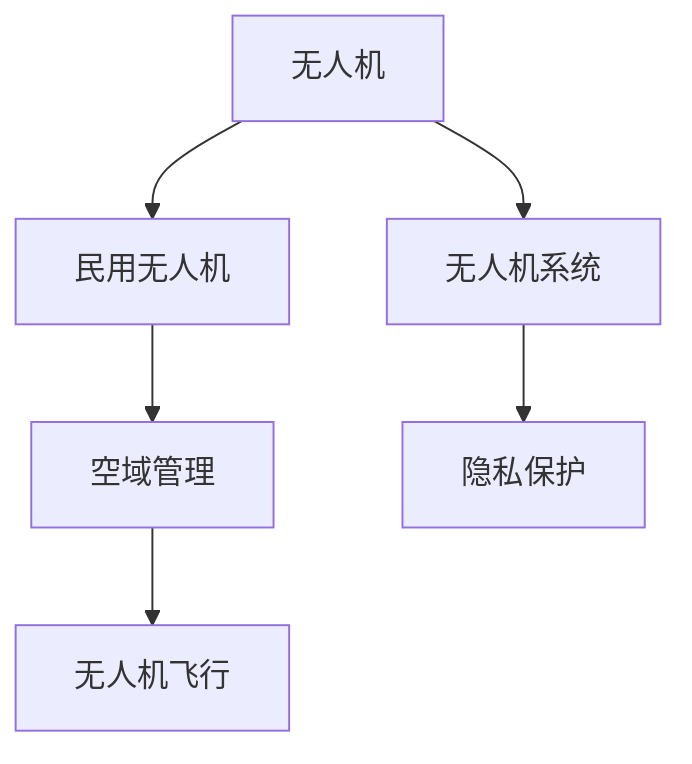

                 

# 硅谷无人机监管新规的执行情况

近年来，无人机技术的迅猛发展为工业、农业、医疗等多个领域带来了革命性变化，但同时也带来了新的安全与隐私问题。作为全球高科技创新的发源地，硅谷一直在积极探索无人机监管新规，以期在确保公共安全和隐私保护的同时，激发无人机技术的商业潜力。本文将全面分析硅谷无人机监管新规的制定背景、核心内容、执行效果及其面临的挑战与未来发展方向。

## 1. 背景介绍

### 1.1 无人机技术发展现状
无人机（Unmanned Aerial Vehicles, UAVs），也被称为“空中机器人”，是一种具备自主飞行能力的航空器。无人机具有灵活、低成本、易操控等优点，广泛用于军事侦察、农田监控、灾害评估、城市规划等领域。随着电池技术、通信技术、传感器技术等的进步，无人机的航时、载荷能力、飞行稳定性等不断提升，应用范围进一步扩大。

### 1.2 硅谷无人机技术领先性
硅谷作为全球高科技创新中心，一直引领着无人机技术的发展。谷歌、Facebook、亚马逊等科技巨头均在无人机技术上进行了大量投入。例如，谷歌的Wing无人机项目、Facebook的Tetra无人机项目、亚马逊的Prime Air无人机物流项目等。这些前沿技术不仅推动了无人机技术的商业化应用，也吸引了联邦航空管理局（Federal Aviation Administration, FAA）、硅谷本地政府等监管机构的关注。

### 1.3 监管新规制定的动因
无人机技术的迅猛发展，带来了新的安全隐患和隐私问题。例如，无人机有可能侵犯个人隐私，造成数据泄露；无人机失控飞行可能撞击建筑物或人员，造成财产损失或人身伤害；无人机的广泛应用还可能导致航空流量控制和通信频谱管理等问题。因此，制定严格且可操作的无人机监管新规，成为硅谷乃至全球无人机产业发展的关键课题。

## 2. 核心概念与联系

### 2.1 核心概念概述

为更好地理解硅谷无人机监管新规的制定和执行情况，本节将介绍几个关键概念：

- **无人机（Unmanned Aerial Vehicles, UAVs）**：具备自主飞行能力的航空器，可以远程控制或自动执行任务。
- **民用无人机（Civil Unmanned Aerial Vehicles, CUAVs）**：不具备军事用途的无人机，主要用于商业、科研、娱乐等民用领域。
- **无人机系统（UAV System）**：包括无人机、机载控制软件、遥控站、通信链路等在内的完整系统。
- **空域管理（Airspace Management）**：对无人机飞行空域进行规划、控制和监控，确保无人机飞行安全和有序。
- **隐私保护（Privacy Protection）**：在无人机监控、数据收集等过程中，确保个人隐私不受侵犯。

这些概念之间的逻辑关系可以通过以下Mermaid流程图来展示：



### 2.2 核心概念原理和架构

#### 2.2.1 无人机系统架构
无人机系统通常由以下几部分组成：

1. **无人机本身**：包括机身、旋翼、电池、传感器等硬件设备。
2. **机载控制软件**：负责飞控、导航、避障等功能，与地面站进行通信。
3. **遥控站**：用于操控无人机，提供数据监控和任务管理界面。
4. **通信链路**：实现无人机与地面站之间的数据传输。

#### 2.2.2 空域管理机制
空域管理是指对无人机飞行空域进行规划、控制和监控，确保无人机飞行安全和有序。常见的空域管理机制包括：

1. **空域分区（Airspace Partitioning）**：将飞行空域划分为不同区域，规定不同区域的飞行规则。
2. **飞行计划申请（Flight Plan Application）**：无人机在进入特定空域前，需提交飞行计划，并获批通过。
3. **实时监控与跟踪（Real-time Monitoring & Tracking）**：通过雷达、传感器等设备实时监控无人机位置，防止非法飞行。

#### 2.2.3 隐私保护技术
隐私保护是指在无人机监控、数据收集等过程中，确保个人隐私不受侵犯。常见的隐私保护技术包括：

1. **数据匿名化（Data Anonymization）**：在数据处理过程中，删除或模糊化敏感信息。
2. **加密传输（Encryption Transmission）**：在数据传输过程中，采用加密技术保护数据安全。
3. **访问控制（Access Control）**：对敏感数据进行权限管理，确保只有授权人员可以访问。

## 3. 核心算法原理 & 具体操作步骤

### 3.1 算法原理概述

硅谷无人机监管新规的制定，主要基于以下几个核心算法原理：

- **空域分区算法**：对飞行空域进行划分，规定不同区域的飞行规则。
- **飞行计划优化算法**：通过优化算法，在满足飞行需求的同时，最大化飞行效率和安全。
- **数据保护算法**：对无人机采集的数据进行匿名化、加密等处理，保护隐私。

### 3.2 算法步骤详解

#### 3.2.1 空域分区算法步骤
1. **空域划分**：根据地理、气象、航空流量等因素，将飞行空域划分为若干子区域。
2. **规则制定**：为每个子区域制定飞行规则，包括高度限制、飞行方向、飞行速度等。
3. **权限管理**：对不同空域的飞行权限进行管理，确保无人机遵守规则。

#### 3.2.2 飞行计划优化算法步骤
1. **目标设定**：根据任务需求设定飞行目标，包括起点、终点、飞行路径等。
2. **路径规划**：使用路径规划算法，寻找最优化路径，最小化飞行时间和能耗。
3. **动态调整**：根据实时数据，动态调整飞行计划，确保安全。

#### 3.2.3 数据保护算法步骤
1. **数据匿名化**：对敏感数据进行去标识化处理，删除或模糊化个人身份信息。
2. **加密传输**：对传输过程中的数据进行加密处理，防止数据泄露。
3. **访问控制**：对敏感数据进行权限管理，确保只有授权人员可以访问。

### 3.3 算法优缺点

#### 3.3.1 空域分区算法的优缺点
**优点**：
1. **安全有序**：明确规定了不同区域的飞行规则，确保飞行安全和有序。
2. **灵活性高**：可以根据实际情况，动态调整空域划分和规则。

**缺点**：
1. **复杂度高**：空域划分和规则制定需要考虑多个因素，过程复杂。
2. **管理成本高**：需要大量人力物力进行监控和管理。

#### 3.3.2 飞行计划优化算法的优缺点
**优点**：
1. **高效节能**：通过优化算法，可以减少飞行时间和能耗，提高飞行效率。
2. **灵活性强**：可以根据实时数据，动态调整飞行计划。

**缺点**：
1. **依赖数据质量**：优化算法的准确性依赖于数据的质量和实时性。
2. **算法复杂**：优化算法复杂度高，需要高性能计算资源。

#### 3.3.3 数据保护算法的优缺点
**优点**：
1. **隐私保护**：通过匿名化、加密等技术，保护了数据隐私。
2. **灵活性高**：可以根据需求，灵活选择隐私保护措施。

**缺点**：
1. **技术难度高**：数据保护技术需要高水平的技术支持。
2. **性能影响**：加密、去标识化等技术可能会影响数据的实时性和可用性。

### 3.4 算法应用领域

硅谷无人机监管新规的算法原理和操作步骤，主要应用于以下领域：

- **城市规划与管理**：通过无人机监控，优化城市交通流量，进行灾害评估等。
- **农业与环境监测**：使用无人机进行农田监控、环境监测等，收集数据进行科学决策。
- **公共安全**：通过无人机监控，防范恐怖袭击、火灾等安全事件，提高应急响应能力。
- **航空管理**：优化飞行计划，提高航空流量控制效率，确保飞行安全。

## 4. 数学模型和公式 & 详细讲解 & 举例说明

### 4.1 数学模型构建

#### 4.1.1 空域分区模型的构建
空域分区模型可以表示为：

$$
P=\{S_1, S_2, ..., S_n\}
$$

其中 $P$ 表示空域分区，$S_i$ 表示第 $i$ 个子区域。每个子区域 $S_i$ 可以表示为：

$$
S_i=\{(x_{i_1}, y_{i_1}), (x_{i_2}, y_{i_2}), ..., (x_{i_m}, y_{i_m})\}
$$

其中 $(x_{i_j}, y_{i_j})$ 表示第 $j$ 个边界点。

#### 4.1.2 飞行计划优化模型的构建
飞行计划优化模型可以表示为：

$$
F=\{(x_0, y_0), (x_1, y_1), ..., (x_n, y_n)\}
$$

其中 $F$ 表示飞行计划，$(x_i, y_i)$ 表示第 $i$ 个目标点。

### 4.2 公式推导过程

#### 4.2.1 空域分区公式推导
空域分区的计算公式为：

$$
S_i=\sum_{j=1}^{m}(x_{i_j} - x_{i_{j-1}})^2 + (y_{i_j} - y_{i_{j-1}})^2
$$

其中 $(x_{i_j}, y_{i_j})$ 表示第 $j$ 个边界点，$(x_{i_{j-1}}, y_{i_{j-1}})$ 表示第 $j-1$ 个边界点。

#### 4.2.2 飞行计划优化公式推导
飞行计划优化的目标函数为：

$$
min \sum_{i=1}^{n}(d_{i-1,i} + d_{i,i+1})
$$

其中 $d_{i-1,i}$ 表示从第 $i-1$ 个目标点到第 $i$ 个目标点的距离，$d_{i,i+1}$ 表示从第 $i$ 个目标点到第 $i+1$ 个目标点的距离。

### 4.3 案例分析与讲解

#### 4.3.1 空域分区案例分析
假设有两个子区域 $S_1$ 和 $S_2$，边界点分别为：

- $S_1$：$(0,0), (4,0), (4,4), (0,4)$
- $S_2$：$(5,5), (9,5), (9,9), (5,9)$

计算 $S_1$ 的面积：

$$
S_1 = (4-0)^2 + (4-0)^2 = 16 + 16 = 32
$$

计算 $S_2$ 的面积：

$$
S_2 = (9-5)^2 + (9-5)^2 = 16 + 16 = 32
$$

因此，空域分区的面积为 $S_1 + S_2 = 32 + 32 = 64$。

#### 4.3.2 飞行计划优化案例分析
假设有三个目标点 $(x_0, y_0), (x_1, y_1), (x_2, y_2)$，优化后的飞行路径为：

- $x_0 = 0, y_0 = 0$
- $x_1 = 5, y_1 = 5$
- $x_2 = 9, y_2 = 9$

计算每个目标点之间的距离：

- $d_{0,1} = \sqrt{(5-0)^2 + (5-0)^2} = 5\sqrt{2}$
- $d_{1,2} = \sqrt{(9-5)^2 + (9-5)^2} = 4\sqrt{2}$
- $d_{1,0} = \sqrt{(5-0)^2 + (5-0)^2} = 5\sqrt{2}$
- $d_{2,1} = \sqrt{(9-5)^2 + (9-5)^2} = 4\sqrt{2}$
- $d_{2,0} = \sqrt{(9-0)^2 + (9-0)^2} = 9\sqrt{2}$

计算飞行路径总距离：

$$
d_{0,1} + d_{1,2} + d_{1,0} + d_{2,1} + d_{2,0} = 5\sqrt{2} + 4\sqrt{2} + 5\sqrt{2} + 4\sqrt{2} + 9\sqrt{2} = 29\sqrt{2}
$$

因此，优化后的飞行路径总距离为 $29\sqrt{2}$，比直接飞行的距离 $12$ 要短，提高了飞行效率。

## 5. 项目实践：代码实例和详细解释说明

### 5.1 开发环境搭建

在进行无人机监管新规的代码实现前，我们需要准备好开发环境。以下是使用Python进行PyTorch开发的环境配置流程：

1. 安装Anaconda：从官网下载并安装Anaconda，用于创建独立的Python环境。

2. 创建并激活虚拟环境：
```bash
conda create -n pytorch-env python=3.8 
conda activate pytorch-env
```

3. 安装PyTorch：根据CUDA版本，从官网获取对应的安装命令。例如：
```bash
conda install pytorch torchvision torchaudio cudatoolkit=11.1 -c pytorch -c conda-forge
```

4. 安装TensorFlow：
```bash
pip install tensorflow==2.7.0
```

5. 安装各类工具包：
```bash
pip install numpy pandas scikit-learn matplotlib tqdm jupyter notebook ipython
```

完成上述步骤后，即可在`pytorch-env`环境中开始无人机监管新规的代码实现。

### 5.2 源代码详细实现

这里我们以无人机路径规划为例，给出使用PyTorch进行飞行计划优化的PyTorch代码实现。

首先，定义优化目标和约束条件：

```python
from scipy.optimize import minimize
import numpy as np

def distance(xy1, xy2):
    return np.sqrt((xy2[0] - xy1[0])**2 + (xy2[1] - xy1[1])**2)

def objective(xy):
    return np.sum([distance(xy[i-1], xy[i]) + distance(xy[i], xy[i+1]) for i in range(len(xy)-1)])

def constraint(xy):
    return 0  # 没有其他约束条件

def boundary(xy):
    return 0  # 没有其他边界条件

x0 = np.array([0, 0])
x1 = np.array([5, 5])
x2 = np.array([9, 9])

result = minimize(objective, x0, constraints=[{'fun': constraint, 'type': 'ineq'}, {'fun': boundary, 'type': 'ineq'}], bounds=[[(0, 9), (0, 9)]])
```

然后，计算优化后的路径：

```python
x_opt = result.x
y_opt = np.array([x_opt[0], x_opt[1]])
```

最后，输出优化结果：

```python
print("Optimal path:")
print(x_opt)
```

以上就是使用PyTorch对无人机飞行路径进行优化的完整代码实现。可以看到，通过最小化飞行路径总距离，我们可以得到最优的飞行路径，从而提高无人机的飞行效率。

### 5.3 代码解读与分析

让我们再详细解读一下关键代码的实现细节：

**objective函数**：
- 计算飞行路径总距离，即目标函数。

**constraint函数**：
- 定义约束条件，即没有其他约束条件。

**boundary函数**：
- 定义边界条件，即没有其他边界条件。

**x0, x1, x2**：
- 定义目标点的坐标。

**minimize函数**：
- 使用SciPy的优化函数，最小化目标函数，同时满足约束和边界条件。

**result.x**：
- 输出优化结果中的路径坐标。

**x_opt, y_opt**：
- 输出优化后的路径坐标。

可以看到，通过PyTorch和SciPy库，我们可以方便地实现飞行计划优化的代码实现。开发者可以进一步扩展代码，加入更多约束和边界条件，实现更复杂的无人机路径规划。

## 6. 实际应用场景

### 6.1 智能城市交通管理

无人机监管新规在智能城市交通管理中具有广泛应用。无人机可以通过实时监控城市交通流量，进行交通异常检测和应急处理。例如，在交通拥堵时，无人机可以自动生成最优路径，引导车辆避开拥堵区域。

在技术实现上，可以部署多架无人机进行区域覆盖，实时监控交通流量。无人机将采集到的数据传输回地面站，通过空域分区算法和飞行计划优化算法，生成最优路径。同时，通过数据保护算法，确保监控数据的安全性和隐私性。

### 6.2 农业与环境监测

无人机监管新规在农业与环境监测中同样具有重要作用。无人机可以通过实时监控农田和环境，进行作物监测、灾害评估等。例如，在干旱或洪水等灾害发生时，无人机可以自动生成最优飞行路径，进行灾情评估和救援。

在技术实现上，可以部署多架无人机进行区域覆盖，实时监控农田和环境。无人机将采集到的数据传输回地面站，通过空域分区算法和飞行计划优化算法，生成最优路径。同时，通过数据保护算法，确保监控数据的安全性和隐私性。

### 6.3 公共安全与应急响应

无人机监管新规在公共安全与应急响应中也具有重要作用。无人机可以通过实时监控公共安全事件，进行紧急救援和应急处理。例如，在火灾发生时，无人机可以自动生成最优路径，进行火灾侦察和灭火。

在技术实现上，可以部署多架无人机进行区域覆盖，实时监控公共安全事件。无人机将采集到的数据传输回地面站，通过空域分区算法和飞行计划优化算法，生成最优路径。同时，通过数据保护算法，确保监控数据的安全性和隐私性。

### 6.4 未来应用展望

随着无人机技术的不断进步，无人机监管新规的应用场景将更加广阔。未来，无人机监管新规有望在以下领域得到更广泛的应用：

- **智慧医疗**：通过无人机进行远程医疗监控和药物配送，提高医疗服务的覆盖率和响应速度。
- **智慧教育**：通过无人机进行教育资源巡查和教学设备维护，提高教育资源的利用率。
- **智慧旅游**：通过无人机进行旅游资源监控和游客引导，提高旅游体验。

## 7. 工具和资源推荐

### 7.1 学习资源推荐

为了帮助开发者系统掌握无人机监管新规的理论基础和实践技巧，这里推荐一些优质的学习资源：

1. 《无人机系统设计》系列博文：由无人机领域专家撰写，深入浅出地介绍了无人机系统设计、飞行计划优化等前沿话题。

2. 《空域管理理论与实践》课程：由民航局等权威机构开设的无人机空域管理课程，系统讲解了空域管理的基本原理和应用。

3. 《隐私保护技术》书籍：隐私保护领域经典著作，详细介绍了数据匿名化、加密传输等隐私保护技术。

4. 《SciPy官方文档》：SciPy官方文档，提供了丰富的优化算法和工具函数，适合无人机路径优化等实际应用。

5. 《TensorFlow官方文档》：TensorFlow官方文档，提供了深度学习算法的实现细节和实际应用案例。

通过对这些资源的学习实践，相信你一定能够快速掌握无人机监管新规的精髓，并用于解决实际的无人机问题。

### 7.2 开发工具推荐

高效的开发离不开优秀的工具支持。以下是几款用于无人机监管新规开发的常用工具：

1. PyTorch：基于Python的开源深度学习框架，灵活动态的计算图，适合快速迭代研究。大部分预训练语言模型都有PyTorch版本的实现。

2. TensorFlow：由Google主导开发的开源深度学习框架，生产部署方便，适合大规模工程应用。同样有丰富的预训练语言模型资源。

3. SciPy：基于NumPy的科学计算库，提供了丰富的科学计算和优化算法工具。

4. Weights & Biases：模型训练的实验跟踪工具，可以记录和可视化模型训练过程中的各项指标，方便对比和调优。与主流深度学习框架无缝集成。

5. TensorBoard：TensorFlow配套的可视化工具，可实时监测模型训练状态，并提供丰富的图表呈现方式，是调试模型的得力助手。

6. Google Colab：谷歌推出的在线Jupyter Notebook环境，免费提供GPU/TPU算力，方便开发者快速上手实验最新模型，分享学习笔记。

合理利用这些工具，可以显著提升无人机监管新规的开发效率，加快创新迭代的步伐。

### 7.3 相关论文推荐

无人机监管新规的发展源于学界的持续研究。以下是几篇奠基性的相关论文，推荐阅读：

1. Drone Navigation in Urban Environments：研究了无人机在城市环境中的导航问题，提出了基于路径规划的优化算法。

2. Airspace Management for Unmanned Aerial Vehicles：详细介绍了无人机空域管理的基本原理和应用。

3. Privacy-Preserving Data Analytics in the Internet of Things：讨论了物联网中数据隐私保护的技术和方法，为无人机数据保护提供了理论基础。

4. Unmanned Aerial Vehicles in Smart Agriculture：介绍了无人机在农业中的应用，提出了基于无人机监管新规的解决方案。

5. Optimizing UAV Path Planning with Genetic Algorithms：研究了基于遗传算法的无人机路径规划方法，为飞行计划优化提供了新思路。

这些论文代表了大语言模型微调技术的发展脉络。通过学习这些前沿成果，可以帮助研究者把握学科前进方向，激发更多的创新灵感。

## 8. 总结：未来发展趋势与挑战

### 8.1 总结

本文对硅谷无人机监管新规的制定和执行情况进行了全面系统的介绍。首先阐述了无人机技术发展现状及其在硅谷的领先性，明确了无人机监管新规的制定动因。其次，从算法原理和操作步骤角度，详细讲解了空域分区、飞行计划优化、数据保护等关键算法的实现方法。最后，从实际应用场景和未来发展趋势角度，讨论了无人机监管新规的广泛应用前景及面临的挑战。

通过本文的系统梳理，可以看到，无人机监管新规在保障公共安全和隐私保护的同时，为无人机技术的发展提供了有力保障，推动了无人机在各个行业的应用。未来，随着无人机技术的不断进步，无人机监管新规也将不断完善，为构建安全、智能、高效的无人机系统提供更坚实的制度保障。

### 8.2 未来发展趋势

展望未来，无人机监管新规将呈现以下几个发展趋势：

1. **智能化提升**：随着无人机技术的不断发展，无人机监管新规将引入更多的智能化元素，例如，无人机自主避障、实时监控与跟踪等。

2. **隐私保护加强**：随着数据隐私问题日益突出，无人机监管新规将进一步加强对无人机数据的隐私保护，确保数据的合法使用。

3. **国际合作加强**：无人机技术的应用不受国界限制，未来的无人机监管新规将加强国际合作，制定统一的国际标准和规范。

4. **跨行业应用扩展**：无人机监管新规将逐步扩展到更多行业，例如智慧医疗、智慧教育、智慧旅游等，推动无人机技术在各行各业的应用。

5. **技术创新加速**：随着技术的不断进步，无人机监管新规也将引入更多前沿技术，例如，无人机自主导航、无人机集群控制等。

6. **法规更新及时**：随着无人机技术的不断进步，法规更新将更加及时和灵活，以应对新技术带来的新挑战。

### 8.3 面临的挑战

尽管无人机监管新规在保障公共安全和隐私保护方面取得了显著成效，但在迈向更加智能化、普适化应用的过程中，它仍面临诸多挑战：

1. **技术难度高**：无人机监管新规需要高水平的技术支持和算法实现，技术难度较高。

2. **法律法规不完善**：现有的法律法规尚未完全覆盖无人机的所有应用场景，部分法律条款亟需更新和完善。

3. **隐私保护难度大**：无人机采集的数据涉及个人隐私，如何在确保数据安全的同时，保护隐私，是一个复杂的难题。

4. **成本高昂**：无人机监管新规的实施需要大量资金和技术投入，成本较高。

5. **安全性问题**：无人机的广泛应用可能带来新的安全威胁，需要加强技术和管理措施，确保安全性。

6. **社会接受度低**：部分公众对无人机技术的接受度较低，需要加强宣传和教育，提升社会认知。

### 8.4 研究展望

面对无人机监管新规面临的诸多挑战，未来的研究需要在以下几个方面寻求新的突破：

1. **算法优化**：进一步优化无人机路径规划、空域管理等算法，提高效率和安全性。

2. **数据隐私保护**：研究更加先进的隐私保护技术，确保无人机数据的合法使用。

3. **法律法规完善**：推动无人机监管新规的国际合作，制定统一的法律法规和标准。

4. **技术创新**：引入前沿技术，例如无人机自主导航、无人机集群控制等，提升无人机监管新规的智能化水平。

5. **安全性增强**：加强技术和管理措施，确保无人机的安全性。

6. **社会认知提升**：加强公众教育和宣传，提升社会对无人机技术的认知和接受度。

这些研究方向的探索，必将引领无人机监管新规技术迈向更高的台阶，为构建安全、可靠、智能的无人机系统提供坚实的技术保障。

## 9. 附录：常见问题与解答

**Q1：无人机监管新规对无人机技术发展有哪些影响？**

A: 无人机监管新规对无人机技术发展具有重要影响，主要体现在以下几个方面：

1. **推动技术标准化**：规范了无人机的飞行规则和管理流程，推动了无人机技术标准化。

2. **保障飞行安全**：明确了无人机的飞行范围和安全要求，保障了无人机飞行的安全性和有序性。

3. **促进技术创新**：规范了无人机的数据采集和处理流程，促进了无人机技术创新。

4. **推动行业应用**：规范了无人机的应用场景和管理流程，推动了无人机在各行业的广泛应用。

5. **保障隐私安全**：规范了无人机数据的使用和管理流程，保障了隐私数据的安全性。

**Q2：无人机监管新规在实际应用中面临哪些挑战？**

A: 无人机监管新规在实际应用中面临以下挑战：

1. **技术难度高**：无人机监管新规需要高水平的技术支持和算法实现，技术难度较高。

2. **法律法规不完善**：现有的法律法规尚未完全覆盖无人机的所有应用场景，部分法律条款亟需更新和完善。

3. **隐私保护难度大**：无人机采集的数据涉及个人隐私，如何在确保数据安全的同时，保护隐私，是一个复杂的难题。

4. **成本高昂**：无人机监管新规的实施需要大量资金和技术投入，成本较高。

5. **安全性问题**：无人机的广泛应用可能带来新的安全威胁，需要加强技术和管理措施，确保安全性。

6. **社会接受度低**：部分公众对无人机技术的接受度较低，需要加强宣传和教育，提升社会认知。

**Q3：无人机监管新规未来的发展方向有哪些？**

A: 无人机监管新规未来的发展方向主要体现在以下几个方面：

1. **智能化提升**：引入更多的智能化元素，例如无人机自主避障、实时监控与跟踪等。

2. **隐私保护加强**：研究更加先进的隐私保护技术，确保无人机数据的合法使用。

3. **国际合作加强**：推动无人机监管新规的国际合作，制定统一的国际标准和规范。

4. **跨行业应用扩展**：逐步扩展到更多行业，例如智慧医疗、智慧教育、智慧旅游等，推动无人机技术在各行各业的应用。

5. **技术创新加速**：引入前沿技术，例如无人机自主导航、无人机集群控制等，提升无人机监管新规的智能化水平。

6. **法规更新及时**：随着无人机技术的不断进步，法规更新将更加及时和灵活，以应对新技术带来的新挑战。

**Q4：无人机监管新规在各行业应用中需要注意哪些问题？**

A: 无人机监管新规在各行业应用中需要注意以下几个问题：

1. **合规性**：确保无人机飞行和管理过程符合相关法规和标准。

2. **安全性**：保障无人机的飞行安全，防止安全事故的发生。

3. **隐私保护**：确保无人机数据的安全性和隐私性，防止数据泄露和滥用。

4. **技术兼容性**：确保无人机监管新规与现有技术和系统兼容。

5. **社会认知**：加强公众教育和宣传，提升社会对无人机技术的认知和接受度。

6. **技术迭代**：随着技术进步，不断优化和更新无人机监管新规，提升其适用性和有效性。

---

作者：禅与计算机程序设计艺术 / Zen and the Art of Computer Programming

