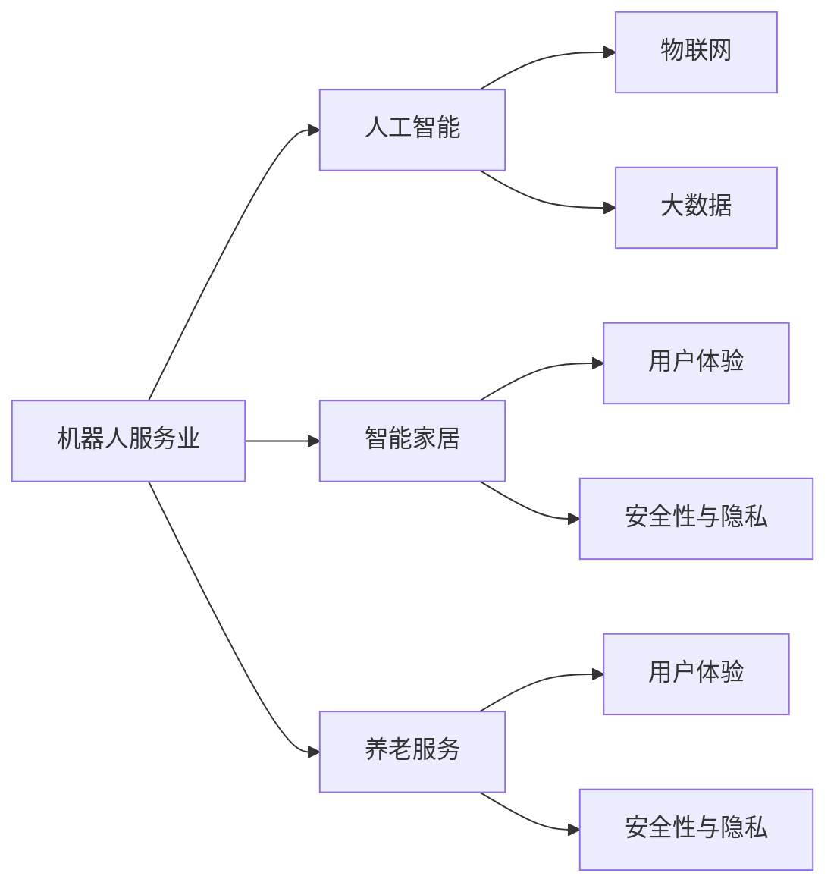

                 

# 硅谷机器人服务业:智能家居与养老服务

> 关键词：
    - 机器人服务业
    - 智能家居
    - 养老服务
    - 人工智能
    - 工业4.0
    - 数据驱动
    - 智能决策
    - 用户体验
    - 人机交互

## 1. 背景介绍

### 1.1 问题由来
随着科技的快速发展，机器人服务业已经成为引领未来服务业转型升级的重要方向。特别是在智能家居和养老服务领域，机器人正在为提升人们的生活质量带来深刻变革。

硅谷作为全球科技创新的中心，一直走在前沿技术应用的前列。在机器人服务业方面，硅谷汇集了众多顶尖的科技公司、科研机构和创新型企业，探索着基于人工智能、物联网、大数据等前沿技术的新型服务模式。

本文将聚焦于硅谷在智能家居与养老服务领域的机器人服务业应用，探讨其核心技术原理、实际操作流程、算法优缺点、实际应用场景和未来发展方向。

### 1.2 问题核心关键点
硅谷机器人服务业的核心技术包括以下几个方面：

1. 人工智能：基于深度学习和自然语言处理技术的智能家居和养老服务机器人。
2. 物联网：通过传感器和智能设备实现环境感知和数据采集。
3. 大数据：收集和分析大量用户行为数据，提供个性化服务。
4. 用户界面：设计直观、易用的用户界面，提升用户体验。
5. 安全性与隐私：保障数据安全和个人隐私，确保用户信任。

硅谷的机器人服务业应用案例众多，如iRobot的扫地机器人、Jibo的社交机器人、Parrot的智能助手等，这些技术突破和应用创新正推动着智能家居和养老服务的智能化升级。

### 1.3 问题研究意义
硅谷机器人服务业的研究意义主要体现在以下几个方面：

1. 提升生活质量：通过智能家居和养老服务机器人，为用户提供便捷、安全、个性化的生活服务，提高生活质量。
2. 促进产业升级：带动相关产业的技术升级和商业模式创新，推动服务业向智能化方向发展。
3. 刺激经济增长：推动机器人产业的技术研发和市场应用，促进就业和经济增长。
4. 社会价值：通过自动化、智能化服务，解决人口老龄化、残障人士等社会问题，提升社会福祉。
5. 引领未来：探索新型服务业态，为未来服务业的智能化和自动化趋势奠定基础。

## 2. 核心概念与联系

### 2.1 核心概念概述

为更好地理解硅谷机器人服务业的技术体系和应用流程，本节将介绍几个关键核心概念：

- **机器人服务业**：利用机器人提供各种服务，如家居清洁、医疗护理、教育辅导等。
- **智能家居**：通过物联网、人工智能等技术，实现家居自动化、智能化的管理和服务。
- **养老服务**：为老年人提供生活照护、健康监测、情感陪伴等服务的智能化系统。
- **人工智能(AI)**：通过机器学习、深度学习等技术，使机器人具备自主感知、决策和执行能力。
- **物联网(IoT)**：实现智能设备间的互联互通，构建智能服务生态。
- **大数据**：收集、存储、分析和利用用户数据，提升服务精准度和个性化。
- **用户体验(UX)**：设计满足用户需求、提升使用满意度的界面和交互方式。
- **安全性与隐私**：保障数据安全和用户隐私，确保服务安全可靠。

这些概念之间存在着紧密的联系，共同构成了硅谷机器人服务业的技术框架。以下通过Mermaid流程图展示这些概念之间的逻辑关系：



这个流程图展示了硅谷机器人服务业的关键概念及其相互关系：

1. 机器人服务业是核心，应用人工智能、物联网和大数据等技术。
2. 智能家居和养老服务是主要应用场景。
3. 用户体验和安全性是服务成功的关键。

## 3. 核心算法原理 & 具体操作步骤

### 3.1 算法原理概述

硅谷机器人服务业的核心算法原理主要包括以下几个方面：

1. **深度学习与自然语言处理**：利用深度神经网络进行图像、语音和文本处理，使机器人能够理解和执行复杂的指令。
2. **强化学习**：通过与环境的交互，优化机器人行为策略，提高自主决策能力。
3. **传感器与数据分析**：通过各种传感器采集环境信息，结合数据分析技术，实现智能感知和决策。
4. **人机交互设计**：设计直观易用的用户界面，提升人机交互体验。

### 3.2 算法步骤详解

硅谷机器人服务业的算法步骤主要包括以下几个关键环节：

1. **数据收集与预处理**：通过传感器和智能设备收集环境数据，预处理数据以去除噪声和异常值。
2. **模型训练与优化**：使用深度学习算法训练模型，通过调参优化模型性能。
3. **实时感知与决策**：将实时数据输入模型，进行环境感知和决策，生成控制指令。
4. **执行与反馈**：执行机器人任务，并根据反馈调整模型和控制策略。
5. **用户体验与优化**：根据用户反馈优化模型和界面，提升用户体验。

### 3.3 算法优缺点

硅谷机器人服务业算法具有以下优点：

1. **高效性**：深度学习和强化学习算法能够快速处理大量数据，提高决策效率。
2. **自适应性**：通过不断学习与优化，机器人能够适应复杂多变的环境。
3. **个性化**：通过大数据分析，机器人能够提供个性化的服务。
4. **交互友好**：基于人机交互设计，机器人能够理解用户需求，提供直观的服务。

同时，这些算法也存在一些缺点：

1. **数据依赖**：算法需要大量高质量的数据进行训练，数据采集和处理成本较高。
2. **模型复杂**：深度学习和强化学习模型复杂，对计算资源和算法能力要求较高。
3. **用户隐私**：数据采集和处理可能涉及用户隐私，需要严格的数据保护措施。
4. **安全风险**：算法的决策依赖于数据的准确性和模型的可靠性，存在一定的安全风险。

### 3.4 算法应用领域

硅谷机器人服务业的应用领域广泛，涵盖智能家居、养老服务、医疗健康、教育培训等多个领域。以下是几个典型应用案例：

1. **智能家居**：如扫地机器人、智能门锁、智能音箱等，提供清洁、安防、娱乐等服务。
2. **养老服务**：如护理机器人、陪伴机器人、健康监测设备等，提供日常护理、情感陪伴、健康监测等服务。
3. **医疗健康**：如手术机器人、康复机器人、远程医疗设备等，提供精准医疗、康复训练、远程咨询等服务。
4. **教育培训**：如教育机器人、虚拟助教、在线辅导等，提供个性化学习、互动教学、远程辅导等服务。

## 4. 数学模型和公式 & 详细讲解 & 举例说明

### 4.1 数学模型构建

硅谷机器人服务业的核心数学模型包括深度学习模型、强化学习模型和数据分析模型。以下以深度学习模型为例，介绍其数学模型构建过程。

假设有一个智能家居机器人，其目标是最大化用户满意度。设用户满意度为 $y$，机器人执行的操作为 $x$。可以通过以下数学模型进行建模：

$$
y = \sum_{i=1}^n \alpha_i \cdot f_i(x)
$$

其中 $f_i(x)$ 为第 $i$ 个特征函数，$\alpha_i$ 为特征权重。机器人的目标是最大化 $y$，即：

$$
\max_{x} y = \max_{x} \sum_{i=1}^n \alpha_i \cdot f_i(x)
$$

### 4.2 公式推导过程

深度学习模型的公式推导过程如下：

1. **输入层**：输入层为智能家居机器人的传感器数据，如温度、湿度、光线强度等。
2. **隐藏层**：隐藏层使用神经网络进行特征提取和处理，得到中间特征表示。
3. **输出层**：输出层根据中间特征表示生成用户满意度的预测值。

以深度神经网络为例，其公式推导过程如下：

$$
y = \sigma (\sum_{i=1}^n \omega_i x_i + b)
$$

其中 $\sigma$ 为激活函数，$\omega_i$ 为权重参数，$b$ 为偏置参数。通过反向传播算法，计算梯度并更新参数，使得模型能够逼近最优解。

### 4.3 案例分析与讲解

以下通过一个具体案例，说明深度学习模型在硅谷智能家居中的应用。

假设有一个智能门锁，其目标是在用户回家时自动解锁。设用户是否在家为 $x$，智能门锁是否解锁为 $y$。可以通过以下深度学习模型进行建模：

1. **输入层**：输入层为智能门锁传感器采集的数据，如门磁开关状态、光线强度等。
2. **隐藏层**：隐藏层使用神经网络进行特征提取和处理，得到中间特征表示。
3. **输出层**：输出层根据中间特征表示生成智能门锁是否解锁的预测值。

具体公式如下：

$$
y = \sigma (\sum_{i=1}^n \omega_i x_i + b)
$$

其中 $\sigma$ 为激活函数，$\omega_i$ 为权重参数，$b$ 为偏置参数。通过反向传播算法，计算梯度并更新参数，使得模型能够逼近最优解，实现智能门锁的自动化解锁。

## 5. 项目实践：代码实例和详细解释说明

### 5.1 开发环境搭建

在进行硅谷机器人服务业项目开发前，需要准备好开发环境。以下是使用Python进行TensorFlow开发的环境配置流程：

1. 安装Anaconda：从官网下载并安装Anaconda，用于创建独立的Python环境。

2. 创建并激活虚拟环境：
```bash
conda create -n tensorflow-env python=3.8 
conda activate tensorflow-env
```

3. 安装TensorFlow：根据CUDA版本，从官网获取对应的安装命令。例如：
```bash
conda install tensorflow tensorflow-gpu -c conda-forge
```

4. 安装各类工具包：
```bash
pip install numpy pandas scikit-learn matplotlib tqdm jupyter notebook ipython
```

完成上述步骤后，即可在`tensorflow-env`环境中开始项目实践。

### 5.2 源代码详细实现

下面我们以智能家居机器人为例，给出使用TensorFlow进行深度学习模型开发的PyTorch代码实现。

首先，定义深度学习模型：

```python
import tensorflow as tf
from tensorflow.keras import layers, models

def build_model(input_dim):
    model = models.Sequential()
    model.add(layers.Dense(64, activation='relu', input_dim=input_dim))
    model.add(layers.Dense(32, activation='relu'))
    model.add(layers.Dense(1, activation='sigmoid'))
    return model
```

接着，加载并处理数据集：

```python
import numpy as np

# 加载数据集
data = np.load('data.npy')

# 数据预处理
x_train = data[:, :-1]  # 输入特征
y_train = data[:, -1]   # 输出标签

# 标准化数据
x_train = (x_train - np.mean(x_train)) / np.std(x_train)

# 构建模型
model = build_model(input_dim=x_train.shape[1])

# 编译模型
model.compile(optimizer='adam', loss='binary_crossentropy', metrics=['accuracy'])
```

最后，进行模型训练和评估：

```python
# 训练模型
model.fit(x_train, y_train, epochs=10, batch_size=32)

# 评估模型
test_data = np.load('test_data.npy')
x_test = (test_data[:, :-1] - np.mean(x_train)) / np.std(x_train)
y_test = test_data[:, -1]
loss, accuracy = model.evaluate(x_test, y_test)
print(f'Test loss: {loss}, Test accuracy: {accuracy}')
```

以上就是使用TensorFlow进行智能家居机器人深度学习模型开发的完整代码实现。可以看到，TensorFlow提供了便捷的高级API，可以极大地简化模型构建和训练流程。

### 5.3 代码解读与分析

让我们再详细解读一下关键代码的实现细节：

**build_model函数**：
- 定义一个包含两个隐藏层的全连接神经网络模型。
- 输入层维度根据输入特征数量确定。
- 隐藏层包含64和32个神经元，激活函数为ReLU。
- 输出层为二分类，激活函数为Sigmoid。

**加载与处理数据集**：
- 使用numpy加载训练和测试数据集。
- 对输入特征进行标准化处理，以加快模型收敛。
- 使用模型编译函数设置优化器和损失函数。

**训练与评估模型**：
- 使用fit函数进行模型训练，设置训练轮数和批量大小。
- 使用evaluate函数进行模型评估，输出损失和准确率。

**TensorFlow提供的高级API**：
- Keras API提供便捷的模型构建接口，支持快速搭建深度学习模型。
- Dataset API支持高效数据加载和处理，简化了数据集预处理流程。
- TensorBoard提供了模型训练的可视化工具，便于调试和优化模型。

以上代码实现了深度学习模型在智能家居机器人中的应用，展示了TensorFlow的强大功能和便捷接口。

## 6. 实际应用场景

### 6.1 智能家居

在智能家居领域，硅谷机器人服务业的应用已经非常广泛，主要包括以下几个方面：

1. **智能清洁**：如扫地机器人、吸尘器等，提供自动清洁服务，提升家庭卫生水平。
2. **智能安防**：如智能门锁、监控摄像头等，提供家居安全保障，预防盗窃和意外伤害。
3. **智能照明**：如智能灯泡、智能插座等，提供能源节约和智能控制，提升家居舒适性。
4. **智能家电**：如智能冰箱、智能洗衣机等，提供个性化定制和远程控制，提升家电使用效率。

### 6.2 养老服务

在养老服务领域，硅谷机器人服务业的应用主要包括：

1. **护理机器人**：提供日常护理、康复训练、健康监测等服务，帮助老年人更好地生活。
2. **陪伴机器人**：提供情感陪伴、聊天娱乐等功能，缓解老年人的孤独感。
3. **远程医疗**：通过智能设备采集老年人的健康数据，提供远程医疗咨询和健康管理。

### 6.3 医疗健康

在医疗健康领域，硅谷机器人服务业的应用主要包括以下几个方面：

1. **手术机器人**：提供精准微创手术，提升手术成功率和患者恢复速度。
2. **康复机器人**：提供康复训练、物理治疗等服务，帮助患者恢复健康。
3. **远程医疗**：通过智能设备采集病人的健康数据，提供远程咨询和诊断服务。

### 6.4 未来应用展望

随着技术的不断进步，硅谷机器人服务业的应用前景将更加广阔，主要包括以下几个方向：

1. **高度智能化**：通过更加先进的算法和数据处理技术，实现更高水平的自主决策和智能控制。
2. **跨领域融合**：与其他新兴技术如虚拟现实、增强现实等结合，提供更加多样化的服务体验。
3. **个性化定制**：通过大数据分析和用户反馈，实现更加个性化和定制化的服务。
4. **泛在化应用**：将机器人服务应用于更多的场景，如智慧城市、智能交通、工业自动化等。

## 7. 工具和资源推荐

### 7.1 学习资源推荐

为了帮助开发者系统掌握硅谷机器人服务业的技术基础和实践技巧，这里推荐一些优质的学习资源：

1. **《机器人学导论》**：斯坦福大学机器人学课程，详细介绍了机器人学的基础理论和应用案例。
2. **《深度学习入门：基于Python的理论与实现》**：清华大学教授周志华所著，全面介绍了深度学习的基本概念和应用场景。
3. **《人工智能：一种现代方法》**：经典教材，系统介绍了人工智能的理论和应用。
4. **Coursera《深度学习专项课程》**：由吴恩达教授主讲，系统介绍了深度学习的基本原理和实践方法。
5. **Udacity《机器人编程与设计》课程**：涵盖了机器人学、控制理论、传感器技术等多个方面的知识。

通过对这些资源的学习实践，相信你一定能够快速掌握硅谷机器人服务业的核心技术，并用于解决实际的智能家居和养老服务问题。

### 7.2 开发工具推荐

高效的开发离不开优秀的工具支持。以下是几款用于硅谷机器人服务业开发的常用工具：

1. **TensorFlow**：Google开源的深度学习框架，支持GPU加速，适合大规模工程应用。
2. **PyTorch**：Facebook开源的深度学习框架，支持动态计算图，适合研究和实验。
3. **ROS（Robot Operating System）**：开源的机器人操作系统，提供了丰富的API和工具，支持跨平台开发。
4. **OpenCV**：开源的计算机视觉库，提供了图像处理和分析的强大工具。
5. **Arduino**：开源的微控制器平台，支持嵌入式开发，适合硬件驱动和传感器采集。

合理利用这些工具，可以显著提升硅谷机器人服务业项目的开发效率，加快创新迭代的步伐。

### 7.3 相关论文推荐

硅谷机器人服务业的研究已经取得了丰硕的成果，以下是几篇奠基性的相关论文，推荐阅读：

1. **"Robot Manipulation Using Deep Reinforcement Learning"**：提出了使用深度强化学习进行机器人操作的算法。
2. **"Deep Learning for Multimodal Robot Perception and Control"**：介绍了深度学习在多模态机器人感知和控制中的应用。
3. **"Robotics in Human Care"**：讨论了机器人技术在老年护理中的应用，展示了其潜在的社会价值。
4. **"AI for Healthcare: Challenges and Opportunities"**：综述了人工智能在医疗健康领域的应用前景和挑战。
5. **"Smart Homes and IoT: Current Trends and Future Directions"**：综述了智能家居和物联网技术的最新进展和未来方向。

这些论文代表了大规模机器人服务业的应用和研究现状，通过学习这些前沿成果，可以帮助研究者把握学科前进方向，激发更多的创新灵感。

## 8. 总结：未来发展趋势与挑战

### 8.1 总结

本文对硅谷机器人服务业在智能家居与养老服务中的应用进行了全面系统的介绍。首先阐述了智能家居和养老服务领域的机器人服务业背景和意义，明确了机器人服务业在提升生活质量、促进产业升级等方面的独特价值。其次，从原理到实践，详细讲解了深度学习、强化学习、物联网和大数据分析等核心技术，展示了硅谷机器人服务业的核心算法和具体实现。

通过本文的系统梳理，可以看到，硅谷机器人服务业正处于快速发展阶段，正在为智能家居和养老服务带来深刻变革。未来，伴随技术的不断进步和应用的深入推广，硅谷机器人服务业必将在更多领域大放异彩，为人类社会带来更多的福祉。

### 8.2 未来发展趋势

展望未来，硅谷机器人服务业的发展趋势将主要体现在以下几个方面：

1. **技术创新**：随着深度学习、强化学习、大数据等技术的不断进步，硅谷机器人服务业将实现更高水平的智能化和自主决策能力。
2. **应用拓展**：除了智能家居和养老服务，硅谷机器人服务业还将拓展到智慧城市、智能交通、工业自动化等多个领域，提供更加多样化的服务。
3. **市场推广**：随着产品成本的降低和用户需求的多样化，硅谷机器人服务业将迎来大规模的市场推广和应用落地。
4. **标准制定**：随着市场竞争的加剧，硅谷机器人服务业将加速标准制定和行业规范，提升服务质量和安全保障。
5. **伦理道德**：随着社会对机器人伦理道德的关注，硅谷机器人服务业将更加注重用户隐私、安全性等方面的问题，提升用户信任度。

### 8.3 面临的挑战

尽管硅谷机器人服务业已经取得了显著成就，但在迈向更加智能化、普适化应用的过程中，它仍面临着诸多挑战：

1. **技术瓶颈**：深度学习和强化学习等核心算法对计算资源和数据需求较高，需要进一步突破技术瓶颈，降低成本。
2. **用户接受度**：用户对新兴技术持观望态度，需要更多的市场教育和用户体验优化，提升用户接受度。
3. **标准化问题**：目前机器人服务业缺乏统一的标准和规范，不同厂商的产品和服务难以互通，需要加速标准化进程。
4. **安全性与隐私**：用户数据隐私和设备安全问题仍需进一步解决，需要加强数据保护和系统安全。
5. **伦理道德**：机器人技术的应用需要遵循伦理道德标准，避免对社会产生负面影响。

### 8.4 研究展望

面对硅谷机器人服务业所面临的挑战，未来的研究需要在以下几个方面寻求新的突破：

1. **技术优化**：继续优化深度学习和强化学习算法，降低计算资源和数据需求，提升算法效率和性能。
2. **市场推广**：加强产品推广和用户教育，提升用户接受度和满意度，推动市场规模化应用。
3. **标准化建设**：加速机器人服务业的标准化进程，制定统一的技术标准和行业规范，促进产品互操作性。
4. **安全保障**：加强数据保护和系统安全，制定伦理道德标准，确保用户隐私和安全。
5. **伦理道德**：探讨机器人技术在伦理道德方面的应用，制定合理的伦理框架，确保技术应用的合理性和安全性。

这些研究方向的探索，必将引领硅谷机器人服务业走向更高的台阶，为人类社会带来更多的福祉。面向未来，硅谷机器人服务业还需要与其他新兴技术进行更深入的融合，如人工智能、物联网、区块链等，共同推动未来服务的智能化和自动化趋势。只有勇于创新、敢于突破，才能不断拓展机器人服务业的应用边界，让智能技术更好地造福人类社会。

## 9. 附录：常见问题与解答

**Q1：什么是硅谷机器人服务业？**

A: 硅谷机器人服务业是指利用机器人提供各种服务，如智能家居、养老服务、医疗健康、教育培训等。通过人工智能、物联网、大数据等技术，实现智能化和自动化的服务。

**Q2：深度学习在硅谷机器人服务业中的应用主要体现在哪些方面？**

A: 深度学习在硅谷机器人服务业中的应用主要体现在以下几个方面：

1. 图像识别和目标检测：通过深度学习算法，实现环境感知和对象识别，为机器人提供自主导航和避障能力。
2. 语音识别和自然语言处理：通过深度学习算法，实现语音识别和自然语言处理，提升人机交互体验。
3. 生成对抗网络：通过深度学习算法，实现图像和视频的生成，为机器人提供更加多样化的感官输入。

**Q3：硅谷机器人服务业面临的主要技术挑战有哪些？**

A: 硅谷机器人服务业面临的主要技术挑战包括：

1. 计算资源和数据需求：深度学习和强化学习等算法对计算资源和数据需求较高，需要进一步优化算法和提升数据质量。
2. 人机交互设计：需要设计直观易用的用户界面，提升用户体验，解决人机交互障碍。
3. 安全性与隐私：用户数据隐私和设备安全问题仍需进一步解决，需要加强数据保护和系统安全。
4. 标准化问题：目前机器人服务业缺乏统一的标准和规范，不同厂商的产品和服务难以互通，需要加速标准化进程。

**Q4：未来硅谷机器人服务业的发展方向有哪些？**

A: 未来硅谷机器人服务业的发展方向主要包括以下几个方面：

1. 技术创新：随着深度学习、强化学习、大数据等技术的不断进步，硅谷机器人服务业将实现更高水平的智能化和自主决策能力。
2. 应用拓展：除了智能家居和养老服务，硅谷机器人服务业还将拓展到智慧城市、智能交通、工业自动化等多个领域，提供更加多样化的服务。
3. 市场推广：随着产品成本的降低和用户需求的多样化，硅谷机器人服务业将迎来大规模的市场推广和应用落地。
4. 标准化建设：加速机器人服务业的标准化进程，制定统一的技术标准和行业规范，促进产品互操作性。
5. 安全保障：加强数据保护和系统安全，制定伦理道德标准，确保用户隐私和安全。
6. 伦理道德：探讨机器人技术在伦理道德方面的应用，制定合理的伦理框架，确保技术应用的合理性和安全性。

通过这些研究方向的探索，硅谷机器人服务业必将在未来实现更大的发展，为人类社会带来更多的福祉。

---

作者：禅与计算机程序设计艺术 / Zen and the Art of Computer Programming

