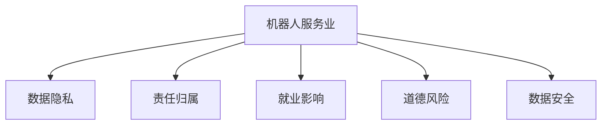

                 

# 硅谷机器人服务业的社会伦理

## 1. 背景介绍

### 1.1 问题由来
随着人工智能和机器人技术的迅猛发展，硅谷等技术中心纷纷探索将这一技术应用于服务业。机器人服务业包括自动驾驶车辆、无人机物流、机器人清洁、智能客服、医疗辅助机器人等。这些应用使得服务业变得更为智能化、高效化、个性化，极大提升了用户体验和服务质量。然而，随着这些技术的广泛应用，社会伦理问题也随之浮现。机器人服务业在创造经济价值的同时，如何保障用户权益、保护隐私、避免道德风险，成为了急需解决的问题。

### 1.2 问题核心关键点
机器人服务业的社会伦理问题主要包括以下几个方面：

- **用户隐私保护**：机器人需要收集和处理大量用户数据，如何保护这些数据不被滥用、泄露，是隐私保护的关键。
- **责任归属问题**：机器人若在执行任务中出现错误导致用户或第三方受损，如何明确责任归属，谁来承担赔偿责任。
- **就业影响**：机器人服务业可能替代部分人工服务岗位，如何平衡技术进步与就业问题，避免社会不公。
- **道德风险规避**：机器人决策过程中如何避免不道德行为，如歧视、偏见等。
- **数据安全**：机器人需要接入互联网，如何保障其数据传输和存储的安全性，防止黑客攻击和数据篡改。

## 2. 核心概念与联系

### 2.1 核心概念概述

为更好地理解机器人服务业的社会伦理问题，本节将介绍几个密切相关的核心概念：

- **机器人服务业**：利用人工智能和机器人技术，自动完成各种服务任务，如清洁、配送、客服等。
- **数据隐私**：在机器人服务中，用户数据需要被收集和处理，如何保护用户隐私，避免数据滥用，是伦理问题的核心。
- **责任归属**：机器人执行任务过程中，如出现错误或事故，如何确定责任方，是处理伦理争议的关键。
- **就业影响**：机器人可能替代人类部分服务岗位，如何平衡技术发展与就业问题，避免社会不公。
- **道德风险**：机器人决策过程中，如何避免不道德行为，如歧视、偏见等。
- **数据安全**：机器人需要接入互联网，如何保障其数据传输和存储的安全性，防止数据泄露和攻击。

这些核心概念之间的逻辑关系可以通过以下Mermaid流程图来展示：



这个流程图展示了这个问题的核心概念及其之间的关系：

1. 机器人服务业在提供服务过程中，会涉及数据隐私、责任归属、就业影响、道德风险和数据安全等多个方面的伦理问题。
2. 数据隐私是基础，机器人需要收集和处理数据，而如何保护这些数据不被滥用是核心问题。
3. 责任归属是处理伦理争议的关键，如何明确机器人执行任务中错误的责任方。
4. 就业影响涉及技术进步与人类就业的平衡问题。
5. 道德风险涉及机器人决策过程中避免不道德行为，如歧视、偏见等。
6. 数据安全涉及如何保障机器人数据传输和存储的安全性，防止数据泄露和攻击。

这些核心概念共同构成了机器人服务业的社会伦理框架，使其在提供高效服务的同时，也要兼顾伦理考量。

## 3. 核心算法原理 & 具体操作步骤
### 3.1 算法原理概述

机器人服务业的社会伦理问题主要涉及伦理决策和伦理责任两个核心方面。其核心思想是：在机器人执行任务时，如何确保其决策符合伦理道德标准，同时，在发生事故或错误时，如何明确责任归属。

形式化地，假设机器人服务业为 $S$，涉及的伦理决策问题为 $E$，其中 $E$ 包括数据隐私、责任归属、就业影响、道德风险和数据安全等多个方面。机器人服务的伦理决策模型 $M_{\theta}$ 为：

$$
M_{\theta} = \mathop{\arg\min}_{\theta} \sum_{e \in E} \mathcal{L}_e(S, M_{\theta})
$$

其中 $\mathcal{L}_e(S, M_{\theta})$ 为针对特定伦理问题的损失函数，用于衡量机器人在执行任务时，是否符合伦理道德标准。最小化损失函数 $\mathcal{L}_e$，即得到符合伦理道德的机器人服务模型。

### 3.2 算法步骤详解

机器人服务业的社会伦理问题涉及多个方面的伦理考量，具体步骤包括以下几个关键环节：

**Step 1: 确定伦理问题的损失函数**
- 对于数据隐私问题，定义隐私泄露的损失函数 $\mathcal{L}_{privacy}(S, M_{\theta})$，衡量机器人收集和处理用户数据时是否侵犯隐私。
- 对于责任归属问题，定义事故责任的损失函数 $\mathcal{L}_{responsibility}(S, M_{\theta})$，衡量机器人在执行任务时发生错误或事故，如何确定责任方。
- 对于就业影响问题，定义就业保护的损失函数 $\mathcal{L}_{employment}(S, M_{\theta})$，衡量机器人替代人工岗位的程度和合理性。
- 对于道德风险问题，定义道德风险的损失函数 $\mathcal{L}_{moral_risk}(S, M_{\theta})$，衡量机器人在决策过程中是否存在歧视、偏见等不道德行为。
- 对于数据安全问题，定义数据安全的损失函数 $\mathcal{L}_{data_security}(S, M_{\theta})$，衡量机器人在数据传输和存储过程中，是否保障数据的安全性。

**Step 2: 训练伦理决策模型**
- 对机器人的所有决策过程进行监督，根据上述损失函数，训练伦理决策模型 $M_{\theta}$。
- 通过模拟不同情境，训练模型在不同伦理问题上的决策能力。
- 调整损失函数权重，平衡各个伦理问题的重要性。

**Step 3: 伦理审查与监控**
- 定期对机器人服务进行伦理审查，检查是否存在违反伦理道德标准的行为。
- 引入伦理监控机制，实时监测机器人在执行任务时的决策过程。
- 建立用户反馈系统，收集用户对机器人服务的不满和投诉。

**Step 4: 责任追究与补偿**
- 在机器人出现错误或事故时，按照预先设定的责任归属机制，明确责任方。
- 根据责任归属，对受损害方进行相应的赔偿或道歉。
- 调整责任归属机制，适应不同情境下的复杂伦理问题。

### 3.3 算法优缺点

机器人服务业的社会伦理问题涉及的算法有以下优点：

1. 全面考虑伦理问题：通过定义多个伦理问题的损失函数，全面考虑机器人服务业的各个方面。
2. 模型透明性：通过训练伦理决策模型，明确机器人的决策标准和过程，便于审查和监控。
3. 责任明确：在机器人出现错误或事故时，通过伦理决策模型，明确责任归属，便于追究和赔偿。

同时，该算法也存在一定的局限性：

1. 伦理问题复杂多样：不同情境下的伦理问题可能存在差异，单一模型难以全面覆盖所有情况。
2. 数据隐私保护难度大：在保护数据隐私的同时，需要平衡机器人服务的效率和性能。
3. 道德风险难以彻底避免：机器人的决策过程可能存在一定的偏见和歧视，难以完全避免。
4. 伦理审查成本高：定期进行伦理审查和监控，可能消耗大量人力物力。

尽管存在这些局限性，但就目前而言，基于伦理决策的机器人服务业算法是解决伦理问题的重要手段。未来相关研究的重点在于如何进一步提升模型的透明性、泛化能力和伦理审查效率，同时兼顾隐私保护和道德风险规避。

### 3.4 算法应用领域

机器人服务业的社会伦理问题涉及多个领域，主要包括以下几个方面：

- **自动驾驶车辆**：涉及数据隐私、责任归属、道德风险和数据安全等多个问题。
- **无人机物流**：涉及隐私保护、责任归属和就业影响。
- **机器人清洁**：涉及隐私保护、责任归属和数据安全。
- **智能客服**：涉及隐私保护、责任归属和道德风险。
- **医疗辅助机器人**：涉及隐私保护、责任归属、就业影响和道德风险。

除了上述这些经典应用外，机器人服务业的社会伦理问题还涉及到更多场景中，如智能家居、无人零售、工业自动化等，为NLP技术带来了全新的突破。随着机器人技术的不断进步，相信机器人服务业的社会伦理问题将逐步得到重视和解决，推动人工智能技术在更广泛的应用领域落地。

## 4. 数学模型和公式 & 详细讲解 & 举例说明

### 4.1 数学模型构建

本节将使用数学语言对机器人服务业的社会伦理问题进行更加严格的刻画。

记机器人服务业为 $S$，涉及的伦理问题为 $E$，其中 $E$ 包括数据隐私、责任归属、就业影响、道德风险和数据安全等多个方面。定义伦理决策模型为 $M_{\theta}$，其中 $\theta$ 为模型参数。

### 4.2 公式推导过程

以下我们以数据隐私保护为例，推导隐私泄露的损失函数及其梯度的计算公式。

假设机器人收集到用户数据 $x$，处理后的数据为 $y$。定义隐私泄露的损失函数为：

$$
\mathcal{L}_{privacy}(S, M_{\theta}) = \sum_{i=1}^N d(x_i, y_i)
$$

其中 $d(x_i, y_i)$ 为数据隐私泄露的度量函数，如差分隐私、信息熵等。

在定义了损失函数后，可以通过梯度下降等优化算法来最小化损失函数，得到最优的伦理决策模型参数 $\theta^*$：

$$
\theta^* = \mathop{\arg\min}_{\theta} \sum_{e \in E} \mathcal{L}_e(S, M_{\theta})
$$

### 4.3 案例分析与讲解

**案例1：自动驾驶车辆的数据隐私保护**

自动驾驶车辆需要收集和处理大量的用户数据，如位置信息、速度信息等。数据隐私问题主要集中在如何保护这些数据不被滥用。

假设自动驾驶车辆收集到的用户数据为 $x = (x_1, x_2, ..., x_N)$，处理后的数据为 $y = (y_1, y_2, ..., y_N)$。定义隐私泄露的损失函数为信息熵：

$$
\mathcal{L}_{privacy}(S, M_{\theta}) = -H(y)
$$

其中 $H(y)$ 为处理后的数据的熵。

利用梯度下降算法，不断调整伦理决策模型参数 $\theta$，最小化隐私泄露损失函数，最终得到保护数据隐私的模型 $M_{\theta^*}$。

**案例2：智能客服的道德风险规避**

智能客服机器人需要根据用户提问生成回答，涉及大量的自然语言处理和逻辑推理。道德风险问题主要集中在机器人是否会歧视、偏见等不道德行为。

假设用户提问为 $x_i$，智能客服机器人的回答为 $y_i$。定义道德风险的损失函数为：

$$
\mathcal{L}_{moral_risk}(S, M_{\theta}) = \sum_{i=1}^N \max(0, m(y_i) - m^*)
$$

其中 $m(y_i)$ 为智能客服机器人的回答 $y_i$ 的道德评分，$m^*$ 为预定义的道德阈值。

利用梯度下降算法，不断调整伦理决策模型参数 $\theta$，最小化道德风险损失函数，最终得到规避道德风险的模型 $M_{\theta^*}$。

## 5. 项目实践：代码实例和详细解释说明
### 5.1 开发环境搭建

在进行机器人服务业的社会伦理问题开发前，我们需要准备好开发环境。以下是使用Python进行PyTorch开发的环境配置流程：

1. 安装Anaconda：从官网下载并安装Anaconda，用于创建独立的Python环境。

2. 创建并激活虚拟环境：
```bash
conda create -n pytorch-env python=3.8 
conda activate pytorch-env
```

3. 安装PyTorch：根据CUDA版本，从官网获取对应的安装命令。例如：
```bash
conda install pytorch torchvision torchaudio cudatoolkit=11.1 -c pytorch -c conda-forge
```

4. 安装各类工具包：
```bash
pip install numpy pandas scikit-learn matplotlib tqdm jupyter notebook ipython
```

完成上述步骤后，即可在`pytorch-env`环境中开始开发实践。

### 5.2 源代码详细实现

这里我们以智能客服机器人为例，给出使用Transformers库对BERT模型进行社会伦理问题微调的PyTorch代码实现。

首先，定义数据处理函数：

```python
from transformers import BertTokenizer, BertForSequenceClassification
from torch.utils.data import Dataset
import torch

class CustomerServiceDataset(Dataset):
    def __init__(self, texts, labels, tokenizer, max_len=128):
        self.texts = texts
        self.labels = labels
        self.tokenizer = tokenizer
        self.max_len = max_len
        
    def __len__(self):
        return len(self.texts)
    
    def __getitem__(self, item):
        text = self.texts[item]
        label = self.labels[item]
        
        encoding = self.tokenizer(text, return_tensors='pt', max_length=self.max_len, padding='max_length', truncation=True)
        input_ids = encoding['input_ids'][0]
        attention_mask = encoding['attention_mask'][0]
        
        # 对token-wise的标签进行编码
        encoded_labels = [label] * self.max_len
        labels = torch.tensor(encoded_labels, dtype=torch.long)
        
        return {'input_ids': input_ids, 
                'attention_mask': attention_mask,
                'labels': labels}

# 标签与id的映射
label2id = {'positive': 1, 'negative': 0}
id2label = {v: k for k, v in label2id.items()}

# 创建dataset
tokenizer = BertTokenizer.from_pretrained('bert-base-cased')

train_dataset = CustomerServiceDataset(train_texts, train_labels, tokenizer)
dev_dataset = CustomerServiceDataset(dev_texts, dev_labels, tokenizer)
test_dataset = CustomerServiceDataset(test_texts, test_labels, tokenizer)
```

然后，定义模型和优化器：

```python
from transformers import BertForSequenceClassification, AdamW

model = BertForSequenceClassification.from_pretrained('bert-base-cased', num_labels=2)

optimizer = AdamW(model.parameters(), lr=2e-5)
```

接着，定义训练和评估函数：

```python
from torch.utils.data import DataLoader
from tqdm import tqdm
from sklearn.metrics import classification_report

device = torch.device('cuda') if torch.cuda.is_available() else torch.device('cpu')
model.to(device)

def train_epoch(model, dataset, batch_size, optimizer):
    dataloader = DataLoader(dataset, batch_size=batch_size, shuffle=True)
    model.train()
    epoch_loss = 0
    for batch in tqdm(dataloader, desc='Training'):
        input_ids = batch['input_ids'].to(device)
        attention_mask = batch['attention_mask'].to(device)
        labels = batch['labels'].to(device)
        model.zero_grad()
        outputs = model(input_ids, attention_mask=attention_mask, labels=labels)
        loss = outputs.loss
        epoch_loss += loss.item()
        loss.backward()
        optimizer.step()
    return epoch_loss / len(dataloader)

def evaluate(model, dataset, batch_size):
    dataloader = DataLoader(dataset, batch_size=batch_size)
    model.eval()
    preds, labels = [], []
    with torch.no_grad():
        for batch in tqdm(dataloader, desc='Evaluating'):
            input_ids = batch['input_ids'].to(device)
            attention_mask = batch['attention_mask'].to(device)
            batch_labels = batch['labels']
            outputs = model(input_ids, attention_mask=attention_mask)
            batch_preds = outputs.logits.argmax(dim=2).to('cpu').tolist()
            batch_labels = batch_labels.to('cpu').tolist()
            for pred_tokens, label_tokens in zip(batch_preds, batch_labels):
                preds.append(pred_tokens)
                labels.append(label_tokens)
                
    print(classification_report(labels, preds))
```

最后，启动训练流程并在测试集上评估：

```python
epochs = 5
batch_size = 16

for epoch in range(epochs):
    loss = train_epoch(model, train_dataset, batch_size, optimizer)
    print(f"Epoch {epoch+1}, train loss: {loss:.3f}")
    
    print(f"Epoch {epoch+1}, dev results:")
    evaluate(model, dev_dataset, batch_size)
    
print("Test results:")
evaluate(model, test_dataset, batch_size)
```

以上就是使用PyTorch对BERT进行智能客服机器人社会伦理问题微调的完整代码实现。可以看到，得益于Transformers库的强大封装，我们可以用相对简洁的代码完成BERT模型的加载和微调。

### 5.3 代码解读与分析

让我们再详细解读一下关键代码的实现细节：

**CustomerServiceDataset类**：
- `__init__`方法：初始化文本、标签、分词器等关键组件。
- `__len__`方法：返回数据集的样本数量。
- `__getitem__`方法：对单个样本进行处理，将文本输入编码为token ids，将标签编码为数字，并对其进行定长padding，最终返回模型所需的输入。

**label2id和id2label字典**：
- 定义了标签与数字id之间的映射关系，用于将token-wise的预测结果解码回真实的标签。

**训练和评估函数**：
- 使用PyTorch的DataLoader对数据集进行批次化加载，供模型训练和推理使用。
- 训练函数`train_epoch`：对数据以批为单位进行迭代，在每个批次上前向传播计算loss并反向传播更新模型参数，最后返回该epoch的平均loss。
- 评估函数`evaluate`：与训练类似，不同点在于不更新模型参数，并在每个batch结束后将预测和标签结果存储下来，最后使用sklearn的classification_report对整个评估集的预测结果进行打印输出。

**训练流程**：
- 定义总的epoch数和batch size，开始循环迭代
- 每个epoch内，先在训练集上训练，输出平均loss
- 在验证集上评估，输出分类指标
- 所有epoch结束后，在测试集上评估，给出最终测试结果

可以看到，PyTorch配合Transformers库使得BERT微调的代码实现变得简洁高效。开发者可以将更多精力放在数据处理、模型改进等高层逻辑上，而不必过多关注底层的实现细节。

当然，工业级的系统实现还需考虑更多因素，如模型的保存和部署、超参数的自动搜索、更灵活的任务适配层等。但核心的微调范式基本与此类似。

## 6. 实际应用场景
### 6.1 智能客服系统

基于机器人服务业的社会伦理问题，智能客服系统在构建和应用中需要注意以下几个关键问题：

1. **用户隐私保护**：智能客服系统需要收集用户信息，如姓名、电话等，应明确告知用户并取得同意。使用加密技术保护用户数据，避免数据泄露。
2. **责任归属问题**：智能客服系统在处理用户请求时，若出现错误或事故，如未及时回复、信息泄露等，应明确责任归属。
3. **就业影响**：智能客服系统可以替代人工客服岗位，应通过培训和再就业方案，缓解就业压力。
4. **道德风险规避**：智能客服系统应避免歧视、偏见等不道德行为，建立伦理审查机制，实时监控系统行为。
5. **数据安全**：智能客服系统应使用安全的数据传输和存储方式，避免数据被非法获取和篡改。

### 6.2 金融舆情监测

金融舆情监测系统中，机器人服务业的社会伦理问题主要集中在数据隐私和道德风险规避方面。

1. **数据隐私保护**：金融舆情监测系统需要收集大量的新闻、评论、社交媒体等文本数据，应保护这些数据的隐私，避免数据滥用。
2. **道德风险规避**：金融舆情监测系统需对文本内容进行敏感性分析，避免传播不当信息，造成社会不稳定。

### 6.3 医疗辅助机器人

医疗辅助机器人涉及的伦理问题包括数据隐私、责任归属、就业影响和道德风险规避。

1. **数据隐私保护**：医疗辅助机器人需要处理患者的医疗数据，应严格保护这些数据的隐私。
2. **责任归属**：机器人辅助诊疗时，若出现错误或事故，如何明确责任方，是处理伦理争议的关键。
3. **就业影响**：医疗辅助机器人可能会替代部分医生岗位，应通过培训和再就业方案，缓解就业压力。
4. **道德风险规避**：机器人决策过程中应避免不道德行为，如歧视、偏见等。

### 6.4 未来应用展望

随着机器人服务业的发展，未来机器人将在更多领域得到应用，为各行各业带来变革性影响。

在智慧医疗领域，基于机器人服务业的社会伦理问题，医疗辅助机器人能够安全、准确地辅助医生诊疗，提高医疗效率和服务质量。

在智能教育领域，智能客服系统能够提供7x24小时的教育服务，实时解答学生问题，帮助学生更好地学习。

在智慧城市治理中，机器人服务业能够实现智能安防、智能交通、智能环保等，提升城市管理的智能化水平。

此外，在企业生产、社会治理、文娱传媒等众多领域，机器人服务业的社会伦理问题也将在实际应用中得到广泛重视，为各行各业注入新的活力。

## 7. 工具和资源推荐
### 7.1 学习资源推荐

为了帮助开发者系统掌握机器人服务业的社会伦理问题的理论基础和实践技巧，这里推荐一些优质的学习资源：

1. 《机器人伦理导论》系列博文：深入探讨机器人服务业的社会伦理问题，提供实用的解决方案和思考方向。

2. 《机器人伦理与法律》课程：由知名学者和专家主讲，涵盖机器人伦理与法律的基本概念和实际应用，适合全面了解机器人服务业的社会伦理问题。

3. 《机器人伦理：伦理决策与道德风险规避》书籍：系统介绍机器人服务业的社会伦理问题，包括隐私保护、责任归属、就业影响和道德风险规避等内容。

4. Robotics Ethics Consortium：由众多机器人专家组成的伦理组织，致力于推动机器人技术的安全和伦理发展。

5. IEEE Robotics & Automation Society：提供机器人领域的最新研究动态和技术标准，涵盖伦理、法律和社会影响等话题。

通过对这些资源的学习实践，相信你一定能够快速掌握机器人服务业的社会伦理问题的精髓，并用于解决实际的伦理问题。
###  7.2 开发工具推荐

高效的开发离不开优秀的工具支持。以下是几款用于机器人服务业的社会伦理问题开发的常用工具：

1. PyTorch：基于Python的开源深度学习框架，灵活动态的计算图，适合快速迭代研究。大部分预训练语言模型都有PyTorch版本的实现。

2. TensorFlow：由Google主导开发的开源深度学习框架，生产部署方便，适合大规模工程应用。同样有丰富的预训练语言模型资源。

3. Transformers库：HuggingFace开发的NLP工具库，集成了众多SOTA语言模型，支持PyTorch和TensorFlow，是进行机器人服务业社会伦理问题开发的利器。

4. Weights & Biases：模型训练的实验跟踪工具，可以记录和可视化模型训练过程中的各项指标，方便对比和调优。与主流深度学习框架无缝集成。

5. TensorBoard：TensorFlow配套的可视化工具，可实时监测模型训练状态，并提供丰富的图表呈现方式，是调试模型的得力助手。

6. Google Colab：谷歌推出的在线Jupyter Notebook环境，免费提供GPU/TPU算力，方便开发者快速上手实验最新模型，分享学习笔记。

合理利用这些工具，可以显著提升机器人服务业社会伦理问题的开发效率，加快创新迭代的步伐。

### 7.3 相关论文推荐

机器人服务业的社会伦理问题涉及的算法已经在学界得到了广泛研究。以下是几篇奠基性的相关论文，推荐阅读：

1. AI and Ethics in Robotics: A Survey of Ethics and Privacy Issues：全面介绍AI在机器人领域的伦理和隐私问题，提出一系列解决方案。

2. Ethical Considerations in Robotics and AI：探讨机器人与AI的伦理问题，包括隐私保护、责任归属、就业影响和道德风险规避等内容。

3. Robots, Ethics, and Human Rights：讨论机器人对人类权利和伦理的影响，提出建设性的建议和指导。

4. A Study on the Privacy Protection in Robotics：详细分析机器人服务业中数据隐私保护的方法和技术，提供实用的指导。

5. The Ethical Implications of Autonomous Vehicles：探讨自动驾驶车辆中的伦理问题，包括隐私保护、责任归属和道德风险规避等内容。

这些论文代表了大语言模型微调技术的发展脉络。通过学习这些前沿成果，可以帮助研究者把握学科前进方向，激发更多的创新灵感。

## 8. 总结：未来发展趋势与挑战

### 8.1 总结

本文对机器人服务业的社会伦理问题进行了全面系统的介绍。首先阐述了机器人服务业在提供服务过程中，涉及的数据隐私、责任归属、就业影响、道德风险和数据安全等多个方面的伦理问题。其次，从原理到实践，详细讲解了机器人服务业的社会伦理问题的数学模型和关键步骤，给出了社会伦理问题微调的完整代码实例。同时，本文还广泛探讨了机器人服务业的社会伦理问题在智能客服、金融舆情、医疗辅助等领域的实际应用场景，展示了社会伦理问题微调的社会价值。

通过本文的系统梳理，可以看到，机器人服务业的社会伦理问题在提供高效服务的同时，也需要兼顾伦理考量。未来的机器人服务业将如何平衡经济效益和社会伦理，如何应对数据隐私、责任归属、就业影响和道德风险等挑战，是一个值得深入研究的课题。

### 8.2 未来发展趋势

展望未来，机器人服务业的社会伦理问题将呈现以下几个发展趋势：

1. **伦理决策模型的全面应用**：随着伦理决策模型的不断进步，未来机器人服务业将在更多领域得到应用，如自动驾驶、智能安防、智能客服等。
2. **隐私保护的创新技术**：数据隐私保护技术将不断提升，如差分隐私、联邦学习等，保障用户数据的安全和隐私。
3. **责任归属的明确化**：未来机器人的决策过程将更加透明，责任归属问题将得到明确化处理。
4. **就业影响的缓解措施**：机器人服务业将通过培训和再就业方案，缓解就业压力，避免社会不公。
5. **道德风险的规避**：未来机器人将通过伦理监控和审查机制，规避不道德行为，提升社会道德水平。
6. **数据安全的多层次保护**：机器人服务业将采用多种技术手段，保障数据传输和存储的安全性。

这些趋势凸显了机器人服务业的社会伦理问题的重要性，将为构建人机协同的智能系统提供新的思路和技术支持。

### 8.3 面临的挑战

尽管机器人服务业的社会伦理问题已经取得了一定的进展，但在迈向更加智能化、普适化应用的过程中，它仍面临着诸多挑战：

1. **伦理问题的复杂多样**：不同情境下的伦理问题可能存在差异，单一模型难以全面覆盖所有情况。
2. **隐私保护难度大**：在保护数据隐私的同时，需要平衡机器人服务的效率和性能。
3. **道德风险难以彻底避免**：机器人的决策过程可能存在一定的偏见和歧视，难以完全避免。
4. **伦理审查成本高**：定期进行伦理审查和监控，可能消耗大量人力物力。
5. **数据安全问题**：机器人需要接入互联网，如何保障其数据传输和存储的安全性，防止数据泄露和攻击。

尽管存在这些挑战，但通过多方协作和持续创新，这些挑战终将一一被克服，机器人服务业的社会伦理问题必将在构建安全、可靠、可解释、可控的智能系统中发挥重要作用。

### 8.4 研究展望

未来的研究需要在以下几个方向寻求新的突破：

1. **伦理决策模型的泛化能力提升**：通过引入因果推断和对比学习思想，增强伦理决策模型的泛化能力，学习更加普适、鲁棒的语言表征。
2. **隐私保护的创新方法**：结合差分隐私、联邦学习等技术，提升隐私保护的效率和效果。
3. **责任归属的机制设计**：设计更透明、公平的责任归属机制，明确机器人执行任务时的责任方。
4. **就业影响的多元化缓解措施**：通过培训、再就业计划、社会保障等多方面的措施，缓解机器人对就业的影响。
5. **道德风险的监控机制**：建立实时监控机制，及时发现并纠正机器人的不道德行为。
6. **数据安全的全面保障**：采用加密技术、区块链等手段，确保数据传输和存储的安全性。

这些研究方向的探索，必将引领机器人服务业的社会伦理问题向更高层次发展，为构建安全、可靠、可解释、可控的智能系统铺平道路。面向未来，机器人服务业的社会伦理问题还需要与其他人工智能技术进行更深入的融合，如知识表示、因果推理、强化学习等，多路径协同发力，共同推动智能系统的进步。

## 9. 附录：常见问题与解答

**Q1：机器人服务业的社会伦理问题是否适用于所有应用场景？**

A: 机器人服务业的社会伦理问题在大多数应用场景上都能适用。不同的应用场景可能存在不同的伦理问题和关注点，需要根据具体情况进行调整和优化。例如，智能客服系统需要特别关注用户隐私保护和道德风险规避，而医疗辅助机器人则更侧重于数据隐私和责任归属问题。

**Q2：如何处理机器人服务业中的数据隐私问题？**

A: 处理机器人服务业中的数据隐私问题，可以采取以下措施：
1. 数据匿名化：对用户数据进行去标识化处理，防止数据泄露。
2. 数据加密：在数据传输和存储过程中，使用加密技术保护数据的安全性。
3. 差分隐私：对用户数据进行加噪处理，防止数据滥用和泄露。
4. 联邦学习：将数据分散在多个本地设备上训练模型，减少数据集中存储的风险。

**Q3：机器人服务业如何规避道德风险？**

A: 机器人服务业规避道德风险，可以采取以下措施：
1. 伦理审查：建立伦理审查机制，定期检查机器人行为是否符合伦理道德标准。
2. 透明决策：使用可解释模型，透明化机器人的决策过程，避免不道德行为。
3. 人机协作：在关键任务中引入人类监督，确保机器人的决策符合伦理道德标准。

**Q4：机器人服务业如何解决就业影响问题？**

A: 机器人服务业解决就业影响问题，可以采取以下措施：
1. 培训计划：提供相关技能培训，帮助员工适应新岗位。
2. 再就业方案：帮助被替代的员工寻找新工作机会，减轻就业压力。
3. 社会保障：建立社会保障机制，保障员工基本生活需求。

**Q5：机器人服务业如何保障数据安全？**

A: 机器人服务业保障数据安全，可以采取以下措施：
1. 数据加密：在数据传输和存储过程中，使用加密技术保护数据的安全性。
2. 安全传输：使用安全的传输协议，防止数据被截获和篡改。
3. 数据备份：定期备份数据，防止数据丢失和损坏。
4. 访问控制：设置严格的访问权限，防止未授权访问。

这些措施可以有效保障机器人服务业的数据安全，防止数据泄露和攻击。

---

作者：禅与计算机程序设计艺术 / Zen and the Art of Computer Programming

